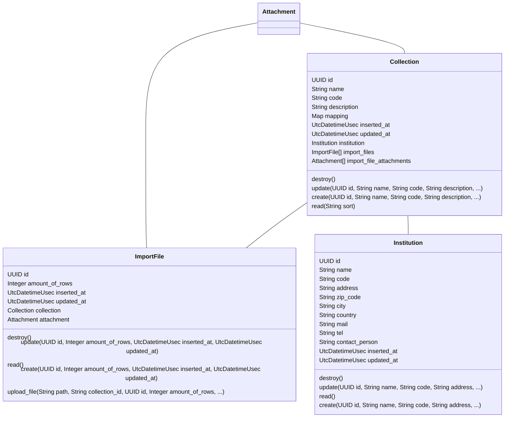
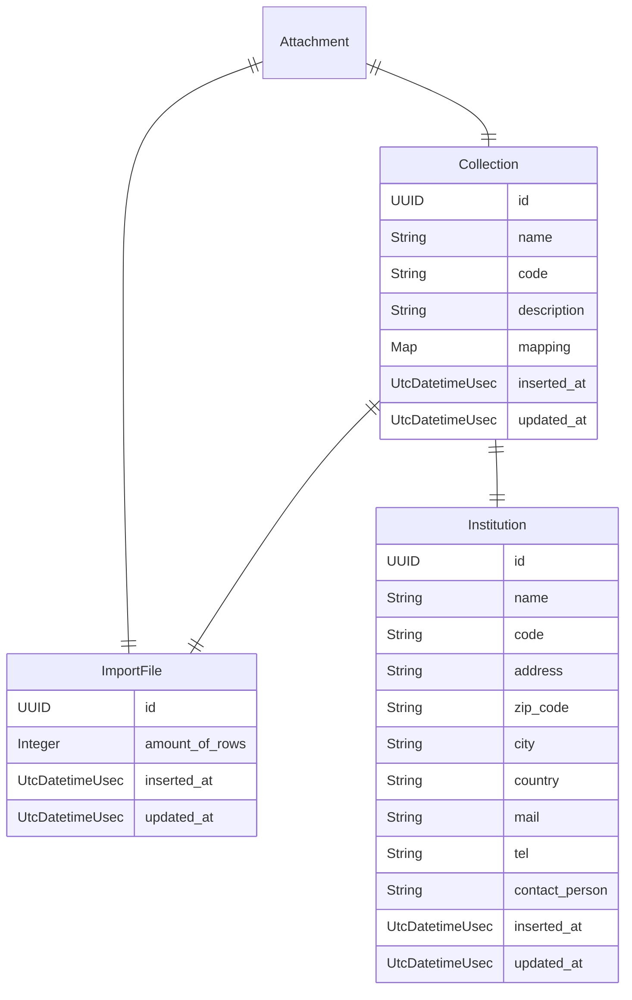
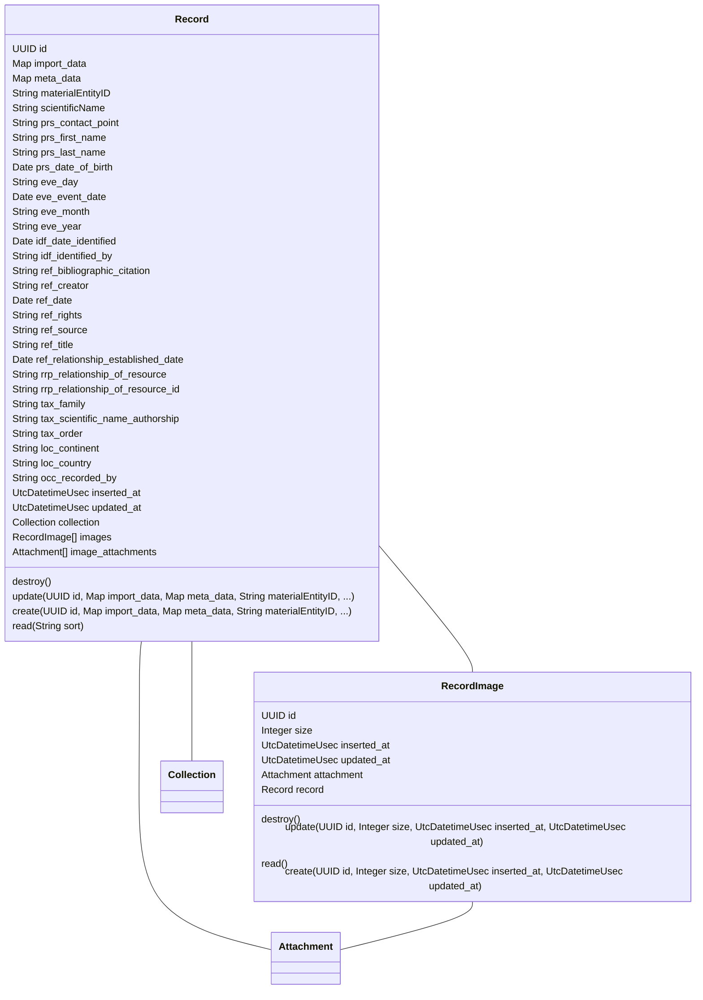
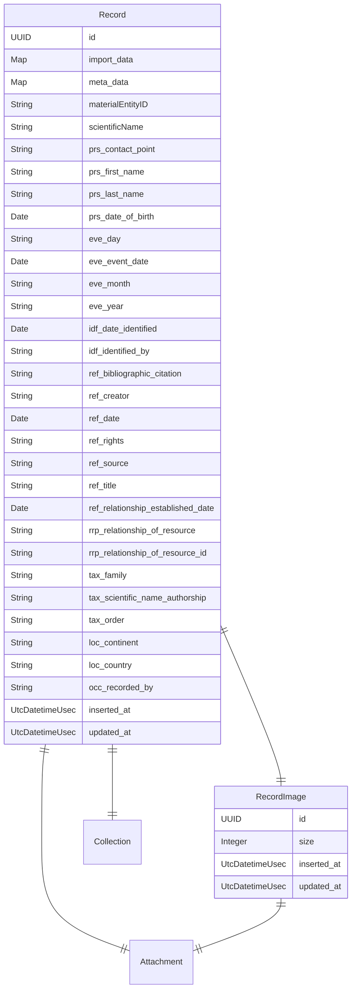
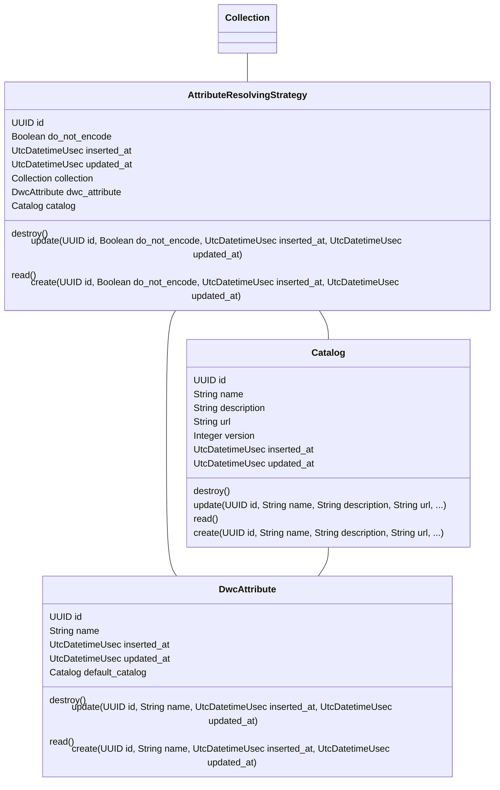
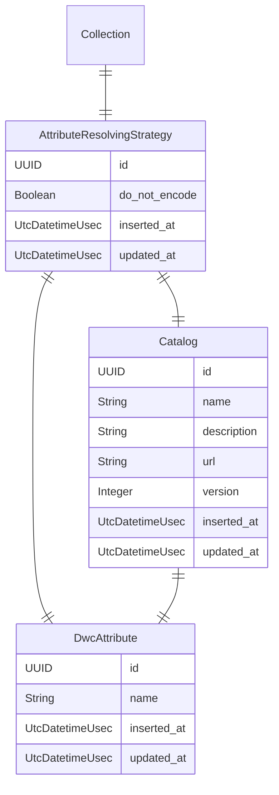
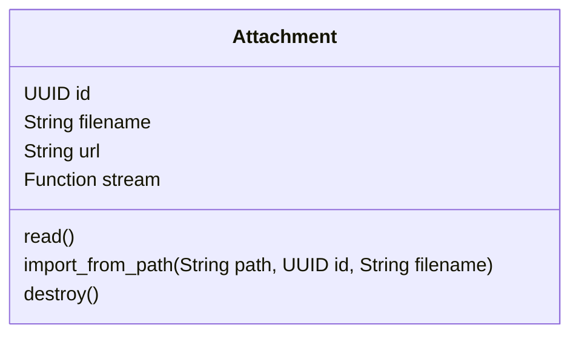
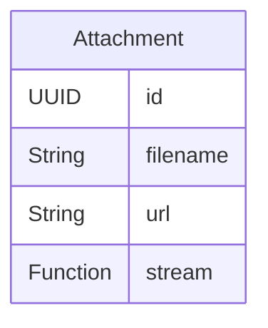

# API Documentation

## API DataAggregator.Platform

### Class Diagram

### ER Diagram

### Resources

- [Institution](#institution)
- [Collection](#collection)
- [ImportFile](#importfile)

### Institution

#### Attributes

| Name | Type | Description |
| ---- | ---- | ----------- |
| **id** | UUID |  |
| **name** | String |  |
| **code** | String |  |
| **address** | String |  |
| **zip_code** | String |  |
| **city** | String |  |
| **country** | String |  |
| **mail** | String |  |
| **tel** | String |  |
| **contact_person** | String |  |
| **inserted_at** | UtcDatetimeUsec |  |
| **updated_at** | UtcDatetimeUsec |  |

#### Actions

| Name | Type | Input | Description |
| ---- | ---- | ----- | ----------- |
| **destroy** | _destroy_ | <ul></ul> |  |
| **update** | _update_ | <ul><li><b>id</b> <i>UUID</i> attribute</li><li><b>name</b> <i>String</i> attribute</li><li><b>code</b> <i>String</i> attribute</li><li><b>address</b> <i>String</i> attribute</li><li><b>zip_code</b> <i>String</i> attribute</li><li><b>city</b> <i>String</i> attribute</li><li><b>country</b> <i>String</i> attribute</li><li><b>mail</b> <i>String</i> attribute</li><li><b>tel</b> <i>String</i> attribute</li><li><b>contact_person</b> <i>String</i> attribute</li><li><b>inserted_at</b> <i>UtcDatetimeUsec</i> attribute</li><li><b>updated_at</b> <i>UtcDatetimeUsec</i> attribute</li></ul> |  |
| **read** | _read_ | <ul></ul> |  |
| **create** | _create_ | <ul><li><b>id</b> <i>UUID</i> attribute</li><li><b>name</b> <i>String</i> attribute</li><li><b>code</b> <i>String</i> attribute</li><li><b>address</b> <i>String</i> attribute</li><li><b>zip_code</b> <i>String</i> attribute</li><li><b>city</b> <i>String</i> attribute</li><li><b>country</b> <i>String</i> attribute</li><li><b>mail</b> <i>String</i> attribute</li><li><b>tel</b> <i>String</i> attribute</li><li><b>contact_person</b> <i>String</i> attribute</li><li><b>inserted_at</b> <i>UtcDatetimeUsec</i> attribute</li><li><b>updated_at</b> <i>UtcDatetimeUsec</i> attribute</li></ul> |  |

### Collection

#### Attributes

| Name | Type | Description |
| ---- | ---- | ----------- |
| **id** | UUID |  |
| **name** | String |  |
| **code** | String |  |
| **description** | String |  |
| **mapping** | Map |  |
| **inserted_at** | UtcDatetimeUsec |  |
| **updated_at** | UtcDatetimeUsec |  |
| **institution_id** | UUID |  |

#### Actions

| Name | Type | Input | Description |
| ---- | ---- | ----- | ----------- |
| **destroy** | _destroy_ | <ul></ul> |  |
| **update** | _update_ | <ul><li><b>id</b> <i>UUID</i> attribute</li><li><b>name</b> <i>String</i> attribute</li><li><b>code</b> <i>String</i> attribute</li><li><b>description</b> <i>String</i> attribute</li><li><b>mapping</b> <i>Map</i> attribute</li><li><b>inserted_at</b> <i>UtcDatetimeUsec</i> attribute</li><li><b>updated_at</b> <i>UtcDatetimeUsec</i> attribute</li></ul> |  |
| **create** | _create_ | <ul><li><b>id</b> <i>UUID</i> attribute</li><li><b>name</b> <i>String</i> attribute</li><li><b>code</b> <i>String</i> attribute</li><li><b>description</b> <i>String</i> attribute</li><li><b>mapping</b> <i>Map</i> attribute</li><li><b>inserted_at</b> <i>UtcDatetimeUsec</i> attribute</li><li><b>updated_at</b> <i>UtcDatetimeUsec</i> attribute</li></ul> |  |
| **read** | _read_ | <ul><li><b>sort</b> <i>String</i> </li></ul> |  |

### ImportFile

#### Attributes

| Name | Type | Description |
| ---- | ---- | ----------- |
| **id** | UUID |  |
| **amount_of_rows** | Integer |  |
| **inserted_at** | UtcDatetimeUsec |  |
| **updated_at** | UtcDatetimeUsec |  |
| **collection_id** | UUID |  |
| **attachment_id** | UUID |  |

#### Actions

| Name | Type | Input | Description |
| ---- | ---- | ----- | ----------- |
| **destroy** | _destroy_ | <ul></ul> |  |
| **update** | _update_ | <ul><li><b>id</b> <i>UUID</i> attribute</li><li><b>amount_of_rows</b> <i>Integer</i> attribute</li><li><b>inserted_at</b> <i>UtcDatetimeUsec</i> attribute</li><li><b>updated_at</b> <i>UtcDatetimeUsec</i> attribute</li></ul> |  |
| **read** | _read_ | <ul></ul> |  |
| **create** | _create_ | <ul><li><b>id</b> <i>UUID</i> attribute</li><li><b>amount_of_rows</b> <i>Integer</i> attribute</li><li><b>inserted_at</b> <i>UtcDatetimeUsec</i> attribute</li><li><b>updated_at</b> <i>UtcDatetimeUsec</i> attribute</li></ul> |  |
| **upload_file** | _create_ | <ul><li><b>path</b> <i>String</i> </li><li><b>collection_id</b> <i>String</i> </li><li><b>id</b> <i>UUID</i> attribute</li><li><b>amount_of_rows</b> <i>Integer</i> attribute</li><li><b>inserted_at</b> <i>UtcDatetimeUsec</i> attribute</li><li><b>updated_at</b> <i>UtcDatetimeUsec</i> attribute</li></ul> |  |

## API DataAggregator.Data

### Class Diagram

### ER Diagram

### Resources

- [Record](#record)
- [RecordImage](#recordimage)

### Record

#### Attributes

| Name | Type | Description |
| ---- | ---- | ----------- |
| **id** | UUID |  |
| **import_data** | Map |  |
| **meta_data** | Map |  |
| **materialEntityID** | String |  |
| **scientificName** | String |  |
| **prs_contact_point** | String |  |
| **prs_first_name** | String |  |
| **prs_last_name** | String |  |
| **prs_date_of_birth** | Date |  |
| **eve_day** | String |  |
| **eve_event_date** | Date |  |
| **eve_month** | String |  |
| **eve_year** | String |  |
| **idf_date_identified** | Date |  |
| **idf_identified_by** | String |  |
| **ref_bibliographic_citation** | String |  |
| **ref_creator** | String |  |
| **ref_date** | Date |  |
| **ref_rights** | String |  |
| **ref_source** | String |  |
| **ref_title** | String |  |
| **ref_relationship_established_date** | Date |  |
| **rrp_relationship_of_resource** | String |  |
| **rrp_relationship_of_resource_id** | String |  |
| **tax_family** | String |  |
| **tax_scientific_name_authorship** | String |  |
| **tax_order** | String |  |
| **loc_continent** | String |  |
| **loc_country** | String |  |
| **occ_recorded_by** | String |  |
| **inserted_at** | UtcDatetimeUsec |  |
| **updated_at** | UtcDatetimeUsec |  |
| **collection_id** | UUID |  |

#### Actions

| Name | Type | Input | Description |
| ---- | ---- | ----- | ----------- |
| **destroy** | _destroy_ | <ul></ul> |  |
| **update** | _update_ | <ul><li><b>id</b> <i>UUID</i> attribute</li><li><b>import_data</b> <i>Map</i> attribute</li><li><b>meta_data</b> <i>Map</i> attribute</li><li><b>materialEntityID</b> <i>String</i> attribute</li><li><b>scientificName</b> <i>String</i> attribute</li><li><b>prs_contact_point</b> <i>String</i> attribute</li><li><b>prs_first_name</b> <i>String</i> attribute</li><li><b>prs_last_name</b> <i>String</i> attribute</li><li><b>prs_date_of_birth</b> <i>Date</i> attribute</li><li><b>eve_day</b> <i>String</i> attribute</li><li><b>eve_event_date</b> <i>Date</i> attribute</li><li><b>eve_month</b> <i>String</i> attribute</li><li><b>eve_year</b> <i>String</i> attribute</li><li><b>idf_date_identified</b> <i>Date</i> attribute</li><li><b>idf_identified_by</b> <i>String</i> attribute</li><li><b>ref_bibliographic_citation</b> <i>String</i> attribute</li><li><b>ref_creator</b> <i>String</i> attribute</li><li><b>ref_date</b> <i>Date</i> attribute</li><li><b>ref_rights</b> <i>String</i> attribute</li><li><b>ref_source</b> <i>String</i> attribute</li><li><b>ref_title</b> <i>String</i> attribute</li><li><b>ref_relationship_established_date</b> <i>Date</i> attribute</li><li><b>rrp_relationship_of_resource</b> <i>String</i> attribute</li><li><b>rrp_relationship_of_resource_id</b> <i>String</i> attribute</li><li><b>tax_family</b> <i>String</i> attribute</li><li><b>tax_scientific_name_authorship</b> <i>String</i> attribute</li><li><b>tax_order</b> <i>String</i> attribute</li><li><b>loc_continent</b> <i>String</i> attribute</li><li><b>loc_country</b> <i>String</i> attribute</li><li><b>occ_recorded_by</b> <i>String</i> attribute</li><li><b>inserted_at</b> <i>UtcDatetimeUsec</i> attribute</li><li><b>updated_at</b> <i>UtcDatetimeUsec</i> attribute</li></ul> |  |
| **create** | _create_ | <ul><li><b>id</b> <i>UUID</i> attribute</li><li><b>import_data</b> <i>Map</i> attribute</li><li><b>meta_data</b> <i>Map</i> attribute</li><li><b>materialEntityID</b> <i>String</i> attribute</li><li><b>scientificName</b> <i>String</i> attribute</li><li><b>prs_contact_point</b> <i>String</i> attribute</li><li><b>prs_first_name</b> <i>String</i> attribute</li><li><b>prs_last_name</b> <i>String</i> attribute</li><li><b>prs_date_of_birth</b> <i>Date</i> attribute</li><li><b>eve_day</b> <i>String</i> attribute</li><li><b>eve_event_date</b> <i>Date</i> attribute</li><li><b>eve_month</b> <i>String</i> attribute</li><li><b>eve_year</b> <i>String</i> attribute</li><li><b>idf_date_identified</b> <i>Date</i> attribute</li><li><b>idf_identified_by</b> <i>String</i> attribute</li><li><b>ref_bibliographic_citation</b> <i>String</i> attribute</li><li><b>ref_creator</b> <i>String</i> attribute</li><li><b>ref_date</b> <i>Date</i> attribute</li><li><b>ref_rights</b> <i>String</i> attribute</li><li><b>ref_source</b> <i>String</i> attribute</li><li><b>ref_title</b> <i>String</i> attribute</li><li><b>ref_relationship_established_date</b> <i>Date</i> attribute</li><li><b>rrp_relationship_of_resource</b> <i>String</i> attribute</li><li><b>rrp_relationship_of_resource_id</b> <i>String</i> attribute</li><li><b>tax_family</b> <i>String</i> attribute</li><li><b>tax_scientific_name_authorship</b> <i>String</i> attribute</li><li><b>tax_order</b> <i>String</i> attribute</li><li><b>loc_continent</b> <i>String</i> attribute</li><li><b>loc_country</b> <i>String</i> attribute</li><li><b>occ_recorded_by</b> <i>String</i> attribute</li><li><b>inserted_at</b> <i>UtcDatetimeUsec</i> attribute</li><li><b>updated_at</b> <i>UtcDatetimeUsec</i> attribute</li></ul> |  |
| **read** | _read_ | <ul><li><b>sort</b> <i>String</i> </li></ul> |  |

### RecordImage

#### Attributes

| Name | Type | Description |
| ---- | ---- | ----------- |
| **id** | UUID |  |
| **size** | Integer |  |
| **inserted_at** | UtcDatetimeUsec |  |
| **updated_at** | UtcDatetimeUsec |  |
| **attachment_id** | UUID |  |
| **record_id** | UUID |  |

#### Actions

| Name | Type | Input | Description |
| ---- | ---- | ----- | ----------- |
| **destroy** | _destroy_ | <ul></ul> |  |
| **update** | _update_ | <ul><li><b>id</b> <i>UUID</i> attribute</li><li><b>size</b> <i>Integer</i> attribute</li><li><b>inserted_at</b> <i>UtcDatetimeUsec</i> attribute</li><li><b>updated_at</b> <i>UtcDatetimeUsec</i> attribute</li></ul> |  |
| **read** | _read_ | <ul></ul> |  |
| **create** | _create_ | <ul><li><b>id</b> <i>UUID</i> attribute</li><li><b>size</b> <i>Integer</i> attribute</li><li><b>inserted_at</b> <i>UtcDatetimeUsec</i> attribute</li><li><b>updated_at</b> <i>UtcDatetimeUsec</i> attribute</li></ul> |  |

## API DataAggregator.Taxonomy

### Class Diagram

### ER Diagram

### Resources

- [DwcAttribute](#dwcattribute)
- [Catalog](#catalog)
- [AttributeResolvingStrategy](#attributeresolvingstrategy)

### DwcAttribute

#### Attributes

| Name | Type | Description |
| ---- | ---- | ----------- |
| **id** | UUID |  |
| **name** | String |  |
| **inserted_at** | UtcDatetimeUsec |  |
| **updated_at** | UtcDatetimeUsec |  |
| **default_catalog_id** | UUID |  |

#### Actions

| Name | Type | Input | Description |
| ---- | ---- | ----- | ----------- |
| **destroy** | _destroy_ | <ul></ul> |  |
| **update** | _update_ | <ul><li><b>id</b> <i>UUID</i> attribute</li><li><b>name</b> <i>String</i> attribute</li><li><b>inserted_at</b> <i>UtcDatetimeUsec</i> attribute</li><li><b>updated_at</b> <i>UtcDatetimeUsec</i> attribute</li></ul> |  |
| **read** | _read_ | <ul></ul> |  |
| **create** | _create_ | <ul><li><b>id</b> <i>UUID</i> attribute</li><li><b>name</b> <i>String</i> attribute</li><li><b>inserted_at</b> <i>UtcDatetimeUsec</i> attribute</li><li><b>updated_at</b> <i>UtcDatetimeUsec</i> attribute</li></ul> |  |

### Catalog

#### Attributes

| Name | Type | Description |
| ---- | ---- | ----------- |
| **id** | UUID |  |
| **name** | String |  |
| **description** | String |  |
| **url** | String |  |
| **version** | Integer |  |
| **inserted_at** | UtcDatetimeUsec |  |
| **updated_at** | UtcDatetimeUsec |  |

#### Actions

| Name | Type | Input | Description |
| ---- | ---- | ----- | ----------- |
| **destroy** | _destroy_ | <ul></ul> |  |
| **update** | _update_ | <ul><li><b>id</b> <i>UUID</i> attribute</li><li><b>name</b> <i>String</i> attribute</li><li><b>description</b> <i>String</i> attribute</li><li><b>url</b> <i>String</i> attribute</li><li><b>version</b> <i>Integer</i> attribute</li><li><b>inserted_at</b> <i>UtcDatetimeUsec</i> attribute</li><li><b>updated_at</b> <i>UtcDatetimeUsec</i> attribute</li></ul> |  |
| **read** | _read_ | <ul></ul> |  |
| **create** | _create_ | <ul><li><b>id</b> <i>UUID</i> attribute</li><li><b>name</b> <i>String</i> attribute</li><li><b>description</b> <i>String</i> attribute</li><li><b>url</b> <i>String</i> attribute</li><li><b>version</b> <i>Integer</i> attribute</li><li><b>inserted_at</b> <i>UtcDatetimeUsec</i> attribute</li><li><b>updated_at</b> <i>UtcDatetimeUsec</i> attribute</li></ul> |  |

### AttributeResolvingStrategy

#### Attributes

| Name | Type | Description |
| ---- | ---- | ----------- |
| **id** | UUID |  |
| **do_not_encode** | Boolean |  |
| **inserted_at** | UtcDatetimeUsec |  |
| **updated_at** | UtcDatetimeUsec |  |
| **collection_id** | UUID |  |
| **dwc_attribute_id** | UUID |  |
| **catalog_id** | UUID |  |

#### Actions

| Name | Type | Input | Description |
| ---- | ---- | ----- | ----------- |
| **destroy** | _destroy_ | <ul></ul> |  |
| **update** | _update_ | <ul><li><b>id</b> <i>UUID</i> attribute</li><li><b>do_not_encode</b> <i>Boolean</i> attribute</li><li><b>inserted_at</b> <i>UtcDatetimeUsec</i> attribute</li><li><b>updated_at</b> <i>UtcDatetimeUsec</i> attribute</li></ul> |  |
| **read** | _read_ | <ul></ul> |  |
| **create** | _create_ | <ul><li><b>id</b> <i>UUID</i> attribute</li><li><b>do_not_encode</b> <i>Boolean</i> attribute</li><li><b>inserted_at</b> <i>UtcDatetimeUsec</i> attribute</li><li><b>updated_at</b> <i>UtcDatetimeUsec</i> attribute</li></ul> |  |

## API DataAggregator.Files

### Class Diagram

### ER Diagram

### Resources

- [Attachment](#attachment)

### Attachment

#### Attributes

| Name | Type | Description |
| ---- | ---- | ----------- |
| **id** | UUID |  |
| **filename** | String |  |
| **inserted_at** | UtcDatetimeUsec |  |
| **updated_at** | UtcDatetimeUsec |  |

#### Actions

| Name | Type | Input | Description |
| ---- | ---- | ----- | ----------- |
| **read** | _read_ | <ul></ul> |  |
| **import_from_path** | _create_ | <ul><li><b>path</b> <i>String</i> </li><li><b>id</b> <i>UUID</i> attribute</li><li><b>filename</b> <i>String</i> attribute</li></ul> |  |
| **destroy** | _destroy_ | <ul></ul> |  |

