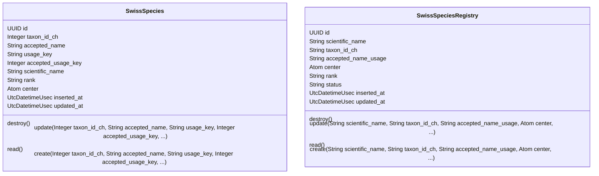
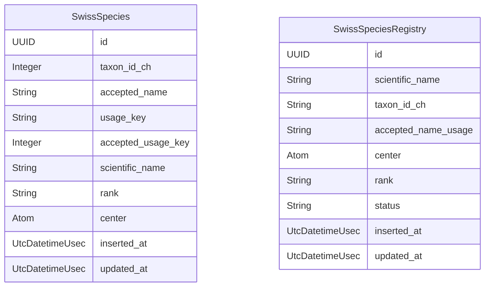
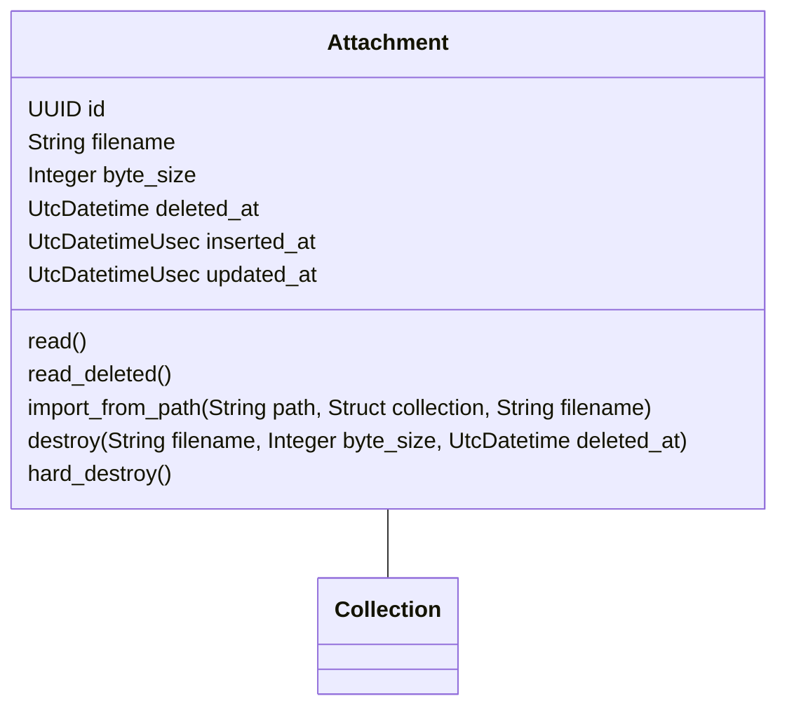
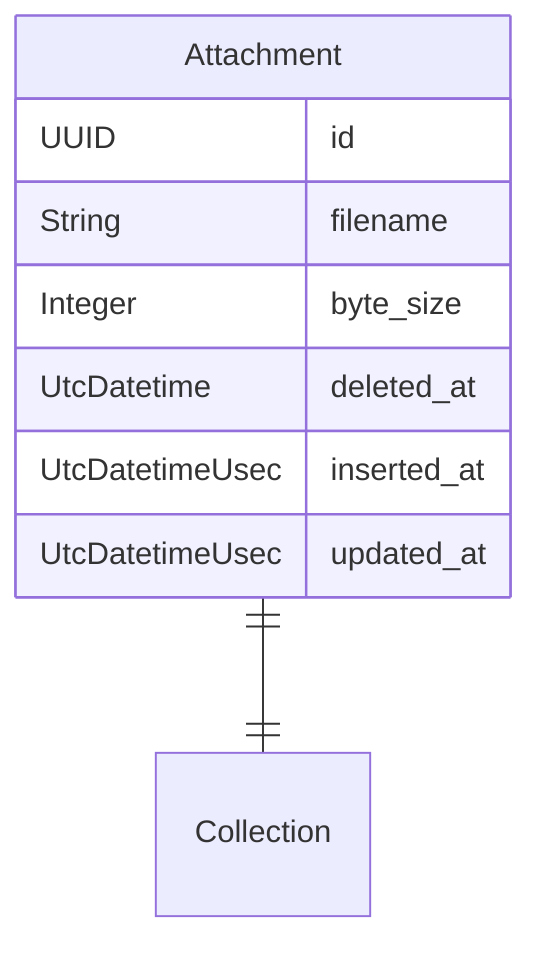
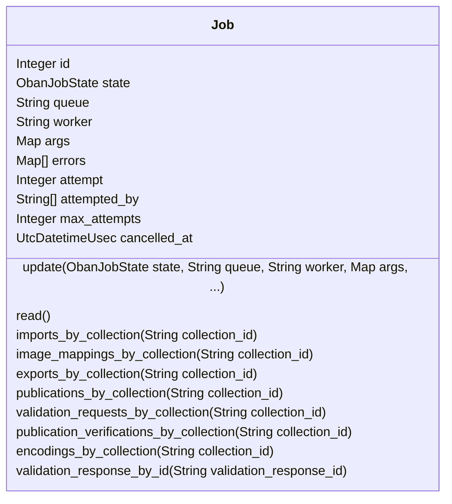
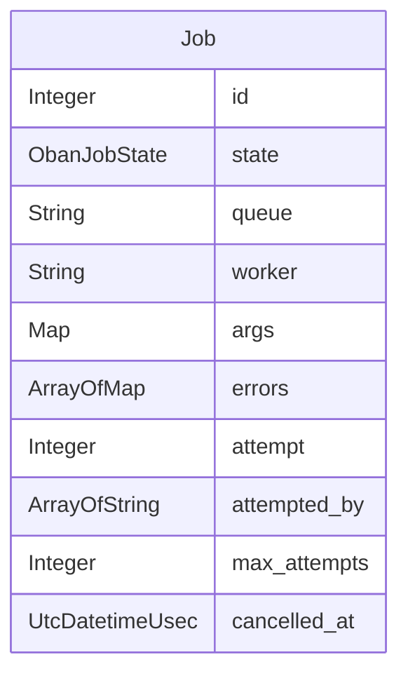
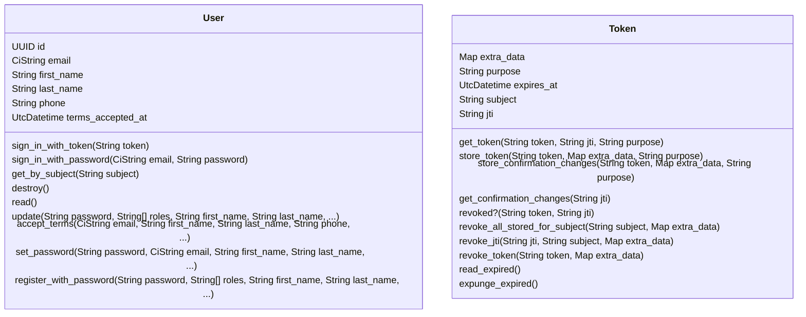
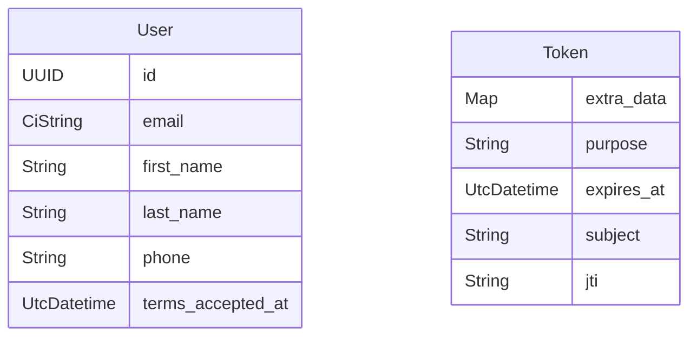

# Domain Documentation

## Domain DataAggregator.Records

### Class Diagram

```mermaid
classDiagram
    class Collection {
        UUID id
        Integer items_to_digitize
        String owner
        String name
        String code
        String grscicoll_reference
        String grscicoll_institution_key
        String grscicoll_institution_code
        String grscicoll_institution_name
        String description
        String gbif_dataset_key
        String gbif_doi
        Map[] import_mapping
        Integer records_count
        CollectionType type
        UtcDatetimeUsec inserted_at
        UtcDatetimeUsec updated_at
        Atom state
        Float digitizing_progress
        Import[] imports
        Export[] exports
        Record[] records
        ImageUpload[] image_uploads
        ValidationRequest[] validation_requests
        Publication[] publications
        ValidationResponse[] validation_responses
        update(Integer items_to_digitize, String owner, String name, String code, ...)
        read()
        create(Integer items_to_digitize, String owner, String name, String code, ...)
        update_import_mapping(Map[] import_mapping)
        touch(Integer items_to_digitize, String owner, String name, String code, ...)
        register_at_gbif(String existing_dataset_key, Integer items_to_digitize, String owner, String name, ...)
        set_mapping()
        set_importing()
        set_exporting()
        set_encoding()
        set_publishing()
        set_validating()
        set_deleting()
        set_idle()
        set_idle_encoding()
        decrement_records_count()
        enqueue_encoding(Map query)
        cancel_action()
        destroy()
        create_endpoint(Struct collection, String dwca_file_url)
        export(Struct export)
        publish(Struct publication)
        validate(Struct validation_request)
        start_validations(Struct collection)
    }
    class EncodedRecord {
        Map ext_vernacular_names
        Map ext_species_profile
        Map ext_species_distribution
        Map ext_refs
        Map ext_resource_relationship
        Map ext_permit
        Map ext_chronometric
        Map ext_assertions
        Map ext_amplification
        Map oth_dynamic_properties
        String oth_type_designated_by
        String oth_measurement_value
        String oth_measurement_unit
        UtcDatetime oth_swiss_species_registered_at
        Boolean oth_swiss_species_registered
        String oth_swiss_species_center
        String oth_specify_author_of_record
        String oth_specify_event
        String oth_specify_locality
        String oth_specify_organism_name
        String oth_specify_person
        String oth_type
        String oth_rights_holder
        String oth_owner_institution_code
        String oth_modified
        String oth_modified_by
        String oth_license
        String oth_language
        String oth_information_withheld
        String oth_gbif_ch_id
        String oth_gbif_id
        String oth_date_available
        String oth_dataset_name
        String oth_data_generalizations
        String oth_bibliographic_citation
        String oth_basis_of_record
        String oth_access_rights
        String pvn_tissue_bank_institution
        String pvn_storage_name
        String pvn_preservation_type
        String pvn_sequence
        String pvn_preservation_temperature
        String pvn_preservation_special_mode
        String pvn_preservation_quality
        String pvn_preservation_mode_text
        String pvn_preservation_mode_keywords
        String pvn_preservation_method
        String pvn_preservation_id
        String pvn_preservation_date_begin
        String pvn_preservation_alteration_text
        String pvn_dna_storage_code
        String pvn_dna_bank_institution
        String occ_vitality
        String occ_occurrence_remarks
        String occ_associated_taxa
        String occ_associated_references
        String occ_associated_occurrences
        Integer occ_individual_count
        String occ_caste
        String occ_occurrence_id
        String org_associated_organisms
        String org_organism_remarks
        String org_organism_scope
        String org_organism_name
        String org_organism_id
        String org_pathway
        String org_degree_of_establishment
        String org_establishment_means
        String org_sex
        String gec_place_of_origin
        String gec_member
        String gec_group
        String gec_formation
        String gec_lithostratigraphic_terms
        String gec_highest_biostratigraphic_zone
        String gec_lowest_biostratigraphic_zone
        String gec_latest_age_or_highest_stage
        String gec_latest_epoch_or_highest_series
        String gec_latest_period_or_highest_system
        String gec_latest_era_or_highest_erathem
        String gec_latest_eon_or_highest_eonothem
        String gec_earliest_period_or_lowest_system
        String gec_earliest_era_or_lowest_erathem
        String gec_earliest_epoch_or_lowest_series
        String gec_earliest_eon_or_lowest_eonothem
        String gec_earliest_age_or_lowest_stage
        String gec_bed
        String gec_geological_context_id
        String mts_material_sample_type
        String mts_material_sample_id
        String mte_associated_sequences
        String mte_disposition
        String mte_original_biominerals
        String mte_orig_col_author
        Integer mte_year_collection_entrance
        String mte_tissue_bank_id
        String mte_taphonomy
        String mte_sample_designation
        String mte_orientation
        String mte_organism_quantity_method
        String mte_mineralization
        String mte_matrix
        String mte_form
        String mte_feeding_predation_traces
        String mte_extraction_temporary_id
        String mte_encrustation
        String mte_dna_stable_id
        String mte_dna_bank_id
        String mte_depositional_environment_type
        String mte_depositional_environment_text
        String mte_completeness
        String mte_paleo_completeness
        String mte_catalog_number
        String mte_bioerosion
        String mte_assemblage_origin
        String mte_articulation
        String mte_permit_id
        String mte_replacement_minerals
        String mte_barcode_label
        String mte_references
        String mte_other_catalog_numbers
        String mte_associated_media
        String mte_occurrence_status
        String mte_behavior
        String mte_reproductive_condition
        String mte_life_stage
        String mte_organism_quantity_type
        String mte_organism_quantity
        String mte_recorded_by_id
        String mte_recorded_by
        String mte_record_number
        String mte_material_entity_remarks
        String mte_preparations
        String mte_verbatim_label
        String mte_post_burial_transportation
        String mte_part_of_organism
        String mte_parent_material_entity_id
        String mte_anatomical_description
        String mte_material_entity_id
        Float loc_swiss_coordinates_lv95_y
        Float loc_swiss_coordinates_lv95_x
        Float loc_swiss_coordinates_lv03_y
        Float loc_swiss_coordinates_lv03_x
        String loc_georeference_verification_status
        String loc_georeference_remarks
        String loc_georeference_sources
        String loc_georeference_protocol
        String loc_georeferenced_date
        String loc_georeferenced_by
        Float loc_footprint_spatial_fit
        String loc_footprint_srs
        String loc_footprint_wkt
        String loc_verbatim_srs
        String loc_verbatim_coordinate_system
        String loc_verbatim_longitude
        String loc_verbatim_latitude
        String loc_verbatim_coordinates
        Float loc_point_radius_spatial_fit
        Float loc_coordinate_precision
        Float loc_coordinate_uncertainty_in_meters
        String loc_geodetic_datum
        String loc_location_remarks
        String loc_location_according_to
        Float loc_maximum_distance_above_surface_in_meters
        Float loc_minimum_distance_above_surface_in_meters
        String loc_verbatim_depth
        Float loc_maximum_depth_in_meters
        Float loc_minimum_depth_in_meters
        String loc_vertical_datum
        String loc_verbatim_elevation
        Float loc_maximum_elevation_in_meters
        Float loc_minimum_elevation_in_meters
        String loc_country_code
        String loc_municipality
        String loc_county
        Float loc_decimal_latitude
        Float loc_decimal_longitude
        String loc_state_province
        String loc_verbatim_locality
        String loc_locality
        String loc_country
        String loc_island
        String loc_island_group
        String loc_continent
        String loc_higher_geography
        String loc_water_body_id
        String loc_water_body
        String loc_higher_geography_id
        String loc_location_id
        String tax_subclass
        String tax_subkingdom
        String tax_domain
        String tax_taxon_remarks
        String tax_nomenclatural_status
        String tax_taxonomic_status
        String tax_nomenclatural_code
        String tax_vernacular_name
        String tax_verbatim_taxon_rank
        String tax_taxon_rank
        String tax_accepted_name_usage_id
        String tax_accepted_name_usage
        Integer tax_taxon_id_ch
        String tax_cultivar_epithet
        String tax_specific_epithet
        String tax_infraspecific_epithet
        String tax_infrageneric_epithet
        String tax_scientific_name_authorship
        String tax_generic_name
        String tax_scientific_name
        String tax_sub_tribe
        String tax_tribe
        String tax_sub_genus
        String tax_genus
        String tax_subfamily
        String tax_family
        String tax_order
        String tax_class
        String tax_superfamily
        String tax_phylum
        String tax_kingdom
        String tax_taxon_concept_id
        String tax_higher_classification
        String tax_name_published_in_year
        String tax_name_published_in
        String tax_name_published_in_id
        String tax_name_according_to
        String tax_name_according_to_id
        String tax_original_name_usage
        String tax_original_name_usage_id
        String tax_parent_name_usage
        String tax_parent_name_usage_id
        String tax_scientific_name_id
        Integer tax_identifier
        String tax_taxon_id
        String idf_identification_id
        String idf_typified_name
        String idf_last_verified_by_id
        String idf_last_verified_by
        String idf_verbatim_identification
        String idf_previous_identifications
        String idf_identified_by_id
        String idf_identification_verification_status
        String idf_identification_remarks
        String idf_identification_reference
        String idf_identification_qualifier
        String idf_evidence_type
        String idf_type_status
        String idf_identified_by
        String idf_date_identified
        String eve_event_type
        Float eve_shrub_layer_height_in_meters
        String eve_start_day_of_year
        String eve_sampling_effort
        String eve_sample_size_unit
        Float eve_sample_size_value
        String eve_sampling_protocol
        String eve_substratum_state
        String eve_substratum
        String eve_micro_structure
        String eve_landscape_structure
        String eve_influence
        String eve_habitat_ref
        String eve_habitat_inclusion
        String eve_habitat_contact
        String eve_habitat_code
        Integer eve_end_of_period_year
        Integer eve_end_of_period_month
        Integer eve_end_of_period_day
        Float eve_tree_layer_height_in_meters
        String eve_syntaxon_name
        String eve_project
        Boolean eve_mosses_identified
        Boolean eve_lichens_identified
        Float eve_inclination_in_degrees
        Float eve_herb_layer_height_in_centimeters
        String eve_event_remarks
        String eve_field_notes
        String eve_habitat
        String eve_verbatim_event_date
        Integer eve_year
        Integer eve_month
        Integer eve_day
        Integer eve_end_day_of_year
        String eve_event_time
        String eve_event_date
        String eve_field_number
        String eve_parent_event_id
        String eve_event_id
        Float eve_cover_water_in_percentage
        Float eve_cover_trees_in_percentage
        Float eve_cover_total_in_percentage
        Float eve_cover_shrubs_in_percentage
        Float eve_cover_rock_in_percentage
        Float eve_cover_mosses_in_percentage
        Float eve_cover_litter_in_percentage
        Float eve_cover_lychens_in_percentage
        Float eve_cover_herbs_in_percentage
        Float eve_cover_cryptogams_in_percentage
        Float eve_cover_algae_in_percentage
        String eve_aspect
        UUID id
        Map extra_data
        String iucn_redlist_category
        Boolean iucn_redlist
        Boolean mids_level_one
        Boolean mids_level_two
        Boolean mids_level_three
        Boolean mids_level_four
        UtcDatetimeUsec inserted_at
        UtcDatetimeUsec updated_at
        UUID record_id
        UUID collection_id
        Record record
        SwissSpecies[] swiss_species
        SwissSpeciesRegistry swiss_species_registry
        Collection collection
        destroy()
        update(Map ext_vernacular_names, Map ext_species_profile, Map ext_species_distribution, Map ext_refs, ...)
        read()
        create(Struct record, Map ext_vernacular_names, Map ext_species_profile, Map ext_species_distribution, ...)
        update_return_minimal_fields(Map ext_vernacular_names, Map ext_species_profile, Map ext_species_distribution, Map ext_refs, ...)
        add_image_url(Struct image, Map ext_vernacular_names, Map ext_species_profile, Map ext_species_distribution, ...)
    }
    class RecordEncodingResult {
        UUID id
        Map input
        Map output
        String message
        Catalog catalog
        EncodingResultState state
        UtcDatetimeUsec inserted_at
        UtcDatetimeUsec updated_at
        UUID record_id
        UUID collection_id
        Record record
        Collection collection
        destroy()
        read()
        filter_by_record(String record_id)
        create(Struct record, Struct collection, Map input, Map output, ...)
        update(Struct record, Map input, Map output, String message, ...)
    }
    class Export {
        UUID id
        String name
        UtcDatetime exported_at
        UtcDatetime started_at
        UtcDatetime finished_at
        Map mapping
        Map records_query
        Integer exported_count
        Integer rows_count
        HeaderSourceType header_source
        DataLayerType data_layer
        UtcDatetimeUsec inserted_at
        UtcDatetimeUsec updated_at
        Atom state
        UUID collection_id
        UUID started_by_id
        UUID attachment_id
        Collection collection
        User started_by
        Attachment attachment
        read()
        active()
        create(Struct collection, String name, UtcDatetime exported_at, UtcDatetime started_at, ...)
        update_mapping(Map mapping, String name, UtcDatetime exported_at, UtcDatetime started_at, ...)
        update(Struct[] records, String name, UtcDatetime exported_at, UtcDatetime started_at, ...)
        enqueue(UUID started_by_id)
        add_export_progress(Integer exported)
        set_running()
        set_failed()
        run()
        set_exported()
        update_attachment(Struct attachment)
        cancel_export()
        destroy()
    }
    class Import {
        UUID id
        Column[] columns
        UtcDatetimeUsec inserted_at
        UtcDatetimeUsec updated_at
        UtcDatetime started_at
        UtcDatetime finished_at
        Integer rows_count
        Integer rows_valid_count
        Integer rows_invalid_count
        Integer rows_imported_count
        Integer rows_error_count
        Atom state
        UUID collection_id
        UUID created_by_id
        UUID started_by_id
        UUID attachment_id
        UUID error_log_id
        Integer records_count
        Collection collection
        User created_by
        User started_by
        Attachment attachment
        Attachment error_log
        Record[] records
        update(Column[] columns, UtcDatetime started_at, UtcDatetime finished_at, Integer rows_count, ...)
        read()
        active()
        create(Struct collection, Column[] columns, UtcDatetime started_at, UtcDatetime finished_at, ...)
        create_from_path(Struct collection, String path, String filename, UUID created_by_id)
        update_mapping(Column[] columns)
        add_validation_progress(Integer valid, Integer invalid)
        enqueue_import(UUID started_by_id)
        import()
        set_importing()
        add_import_progress(Integer imported)
        set_failed()
        set_imported()
        update_error_log(Struct error_log)
        cancel_import()
        destroy()
    }
    class Record {
        UUID import_id
        UUID record_id
        UUID collection_id
        Import import
        Record record
        Collection collection
        update(UUID import_id, UUID record_id, UUID collection_id)
        destroy()
        read()
        create(UUID import_id, UUID record_id, UUID collection_id)
    }
    class ImageUpload {
        UUID id
        UtcDatetimeUsec inserted_at
        UtcDatetimeUsec updated_at
        UtcDatetime started_at
        UtcDatetime finished_at
        Map[] invalid_file_infos
        Integer mapped_images_count
        Integer unmapped_images_count
        Integer max_mapping_operations_count
        Integer current_mapping_operations_count
        String error_message
        Integer invalid_files_count
        Atom mapping_identifier
        Atom state
        UUID collection_id
        UUID created_by_id
        UUID started_by_id
        UUID attachment_id
        UUID upload_log_id
        Float mapping_progress
        Collection collection
        User created_by
        User started_by
        Attachment attachment
        Attachment upload_log
        Image[] images
        Attachment[] image_attachments
        update(UtcDatetime started_at, UtcDatetime finished_at, Map[] invalid_file_infos, Integer mapped_images_count, ...)
        read()
        update_mapping_identifier(Atom mapping_identifier)
        enqueue_extraction()
        add_mapping_progress(Integer mapped)
        add_current_mapping_operations_count(Integer operations_count)
        extract()
        set_extracting()
        set_extracted()
        set_extraction_failed()
        enqueue_mapping(UUID started_by_id)
        map()
        set_mapping()
        set_mapped()
        set_mapping_incomplete()
        set_mapping_failed()
        set_error_message(String error_message)
        cancel_mapping()
        update_upload_log(Struct upload_log)
        active()
        create(Struct collection, UtcDatetime started_at, UtcDatetime finished_at, Map[] invalid_file_infos, ...)
        create_from_path(Struct collection, String path, String filename, UUID created_by_id)
        destroy()
    }
    class Publication {
        UUID id
        String name
        UtcDatetime published_at
        UtcDatetime started_at
        UtcDatetime finished_at
        Map records_query
        Integer published_count
        Integer rows_count
        Atom center
        String existing_dataset_key
        String layer
        PublicationLicenseType license
        UtcDatetimeUsec inserted_at
        UtcDatetimeUsec updated_at
        Atom state
        UUID collection_id
        UUID started_by_id
        UUID attachment_id
        Collection collection
        User started_by
        Attachment attachment
        update(String name, UtcDatetime published_at, UtcDatetime started_at, UtcDatetime finished_at, ...)
        read()
        active()
        create(Struct collection, String name, UtcDatetime published_at, UtcDatetime started_at, ...)
        enqueue(UUID started_by_id)
        add_publication_progress(Integer published)
        set_running()
        set_failed(String name, UtcDatetime published_at, UtcDatetime started_at, UtcDatetime finished_at, ...)
        run()
        set_done()
        update_attachment(Struct attachment)
        cancel_publication()
        destroy()
    }
    class PublishedRecord {
        Map ext_vernacular_names
        Map ext_species_profile
        Map ext_species_distribution
        Map ext_refs
        Map ext_resource_relationship
        Map ext_permit
        Map ext_chronometric
        Map ext_assertions
        Map ext_amplification
        Map oth_dynamic_properties
        String oth_type_designated_by
        String oth_measurement_value
        String oth_measurement_unit
        UtcDatetime oth_swiss_species_registered_at
        Boolean oth_swiss_species_registered
        String oth_swiss_species_center
        String oth_specify_author_of_record
        String oth_specify_event
        String oth_specify_locality
        String oth_specify_organism_name
        String oth_specify_person
        String oth_type
        String oth_rights_holder
        String oth_owner_institution_code
        String oth_modified
        String oth_modified_by
        String oth_license
        String oth_language
        String oth_information_withheld
        String oth_gbif_ch_id
        String oth_gbif_id
        String oth_date_available
        String oth_dataset_name
        String oth_data_generalizations
        String oth_bibliographic_citation
        String oth_basis_of_record
        String oth_access_rights
        String pvn_tissue_bank_institution
        String pvn_storage_name
        String pvn_preservation_type
        String pvn_sequence
        String pvn_preservation_temperature
        String pvn_preservation_special_mode
        String pvn_preservation_quality
        String pvn_preservation_mode_text
        String pvn_preservation_mode_keywords
        String pvn_preservation_method
        String pvn_preservation_id
        String pvn_preservation_date_begin
        String pvn_preservation_alteration_text
        String pvn_dna_storage_code
        String pvn_dna_bank_institution
        String occ_vitality
        String occ_occurrence_remarks
        String occ_associated_taxa
        String occ_associated_references
        String occ_associated_occurrences
        Integer occ_individual_count
        String occ_caste
        String occ_occurrence_id
        String org_associated_organisms
        String org_organism_remarks
        String org_organism_scope
        String org_organism_name
        String org_organism_id
        String org_pathway
        String org_degree_of_establishment
        String org_establishment_means
        String org_sex
        String gec_place_of_origin
        String gec_member
        String gec_group
        String gec_formation
        String gec_lithostratigraphic_terms
        String gec_highest_biostratigraphic_zone
        String gec_lowest_biostratigraphic_zone
        String gec_latest_age_or_highest_stage
        String gec_latest_epoch_or_highest_series
        String gec_latest_period_or_highest_system
        String gec_latest_era_or_highest_erathem
        String gec_latest_eon_or_highest_eonothem
        String gec_earliest_period_or_lowest_system
        String gec_earliest_era_or_lowest_erathem
        String gec_earliest_epoch_or_lowest_series
        String gec_earliest_eon_or_lowest_eonothem
        String gec_earliest_age_or_lowest_stage
        String gec_bed
        String gec_geological_context_id
        String mts_material_sample_type
        String mts_material_sample_id
        String mte_associated_sequences
        String mte_disposition
        String mte_original_biominerals
        String mte_orig_col_author
        Integer mte_year_collection_entrance
        String mte_tissue_bank_id
        String mte_taphonomy
        String mte_sample_designation
        String mte_orientation
        String mte_organism_quantity_method
        String mte_mineralization
        String mte_matrix
        String mte_form
        String mte_feeding_predation_traces
        String mte_extraction_temporary_id
        String mte_encrustation
        String mte_dna_stable_id
        String mte_dna_bank_id
        String mte_depositional_environment_type
        String mte_depositional_environment_text
        String mte_completeness
        String mte_paleo_completeness
        String mte_catalog_number
        String mte_bioerosion
        String mte_assemblage_origin
        String mte_articulation
        String mte_permit_id
        String mte_replacement_minerals
        String mte_barcode_label
        String mte_references
        String mte_other_catalog_numbers
        String mte_associated_media
        String mte_occurrence_status
        String mte_behavior
        String mte_reproductive_condition
        String mte_life_stage
        String mte_organism_quantity_type
        String mte_organism_quantity
        String mte_recorded_by_id
        String mte_recorded_by
        String mte_record_number
        String mte_material_entity_remarks
        String mte_preparations
        String mte_verbatim_label
        String mte_post_burial_transportation
        String mte_part_of_organism
        String mte_parent_material_entity_id
        String mte_anatomical_description
        String mte_material_entity_id
        Float loc_swiss_coordinates_lv95_y
        Float loc_swiss_coordinates_lv95_x
        Float loc_swiss_coordinates_lv03_y
        Float loc_swiss_coordinates_lv03_x
        String loc_georeference_verification_status
        String loc_georeference_remarks
        String loc_georeference_sources
        String loc_georeference_protocol
        String loc_georeferenced_date
        String loc_georeferenced_by
        Float loc_footprint_spatial_fit
        String loc_footprint_srs
        String loc_footprint_wkt
        String loc_verbatim_srs
        String loc_verbatim_coordinate_system
        String loc_verbatim_longitude
        String loc_verbatim_latitude
        String loc_verbatim_coordinates
        Float loc_point_radius_spatial_fit
        Float loc_coordinate_precision
        Float loc_coordinate_uncertainty_in_meters
        String loc_geodetic_datum
        String loc_location_remarks
        String loc_location_according_to
        Float loc_maximum_distance_above_surface_in_meters
        Float loc_minimum_distance_above_surface_in_meters
        String loc_verbatim_depth
        Float loc_maximum_depth_in_meters
        Float loc_minimum_depth_in_meters
        String loc_vertical_datum
        String loc_verbatim_elevation
        Float loc_maximum_elevation_in_meters
        Float loc_minimum_elevation_in_meters
        String loc_country_code
        String loc_municipality
        String loc_county
        Float loc_decimal_latitude
        Float loc_decimal_longitude
        String loc_state_province
        String loc_verbatim_locality
        String loc_locality
        String loc_country
        String loc_island
        String loc_island_group
        String loc_continent
        String loc_higher_geography
        String loc_water_body_id
        String loc_water_body
        String loc_higher_geography_id
        String loc_location_id
        String tax_subclass
        String tax_subkingdom
        String tax_domain
        String tax_taxon_remarks
        String tax_nomenclatural_status
        String tax_taxonomic_status
        String tax_nomenclatural_code
        String tax_vernacular_name
        String tax_verbatim_taxon_rank
        String tax_taxon_rank
        String tax_accepted_name_usage_id
        String tax_accepted_name_usage
        Integer tax_taxon_id_ch
        String tax_cultivar_epithet
        String tax_specific_epithet
        String tax_infraspecific_epithet
        String tax_infrageneric_epithet
        String tax_scientific_name_authorship
        String tax_generic_name
        String tax_scientific_name
        String tax_sub_tribe
        String tax_tribe
        String tax_sub_genus
        String tax_genus
        String tax_subfamily
        String tax_family
        String tax_order
        String tax_class
        String tax_superfamily
        String tax_phylum
        String tax_kingdom
        String tax_taxon_concept_id
        String tax_higher_classification
        String tax_name_published_in_year
        String tax_name_published_in
        String tax_name_published_in_id
        String tax_name_according_to
        String tax_name_according_to_id
        String tax_original_name_usage
        String tax_original_name_usage_id
        String tax_parent_name_usage
        String tax_parent_name_usage_id
        String tax_scientific_name_id
        Integer tax_identifier
        String tax_taxon_id
        String idf_identification_id
        String idf_typified_name
        String idf_last_verified_by_id
        String idf_last_verified_by
        String idf_verbatim_identification
        String idf_previous_identifications
        String idf_identified_by_id
        String idf_identification_verification_status
        String idf_identification_remarks
        String idf_identification_reference
        String idf_identification_qualifier
        String idf_evidence_type
        String idf_type_status
        String idf_identified_by
        String idf_date_identified
        String eve_event_type
        Float eve_shrub_layer_height_in_meters
        String eve_start_day_of_year
        String eve_sampling_effort
        String eve_sample_size_unit
        Float eve_sample_size_value
        String eve_sampling_protocol
        String eve_substratum_state
        String eve_substratum
        String eve_micro_structure
        String eve_landscape_structure
        String eve_influence
        String eve_habitat_ref
        String eve_habitat_inclusion
        String eve_habitat_contact
        String eve_habitat_code
        Integer eve_end_of_period_year
        Integer eve_end_of_period_month
        Integer eve_end_of_period_day
        Float eve_tree_layer_height_in_meters
        String eve_syntaxon_name
        String eve_project
        Boolean eve_mosses_identified
        Boolean eve_lichens_identified
        Float eve_inclination_in_degrees
        Float eve_herb_layer_height_in_centimeters
        String eve_event_remarks
        String eve_field_notes
        String eve_habitat
        String eve_verbatim_event_date
        Integer eve_year
        Integer eve_month
        Integer eve_day
        Integer eve_end_day_of_year
        String eve_event_time
        String eve_event_date
        String eve_field_number
        String eve_parent_event_id
        String eve_event_id
        Float eve_cover_water_in_percentage
        Float eve_cover_trees_in_percentage
        Float eve_cover_total_in_percentage
        Float eve_cover_shrubs_in_percentage
        Float eve_cover_rock_in_percentage
        Float eve_cover_mosses_in_percentage
        Float eve_cover_litter_in_percentage
        Float eve_cover_lychens_in_percentage
        Float eve_cover_herbs_in_percentage
        Float eve_cover_cryptogams_in_percentage
        Float eve_cover_algae_in_percentage
        String eve_aspect
        UUID id
        Map extra_data
        UtcDatetimeUsec inserted_at
        UtcDatetimeUsec updated_at
        UUID collection_id
        UUID publication_id
        UUID record_id
        Collection collection
        Publication publication
        Record record
        destroy()
        update(Map ext_vernacular_names, Map ext_species_profile, Map ext_species_distribution, Map ext_refs, ...)
        read()
        create(Map ext_vernacular_names, Map ext_species_profile, Map ext_species_distribution, Map ext_refs, ...)
    }
    class Record {
        Map ext_vernacular_names
        Map ext_species_profile
        Map ext_species_distribution
        Map ext_refs
        Map ext_resource_relationship
        Map ext_permit
        Map ext_chronometric
        Map ext_assertions
        Map ext_amplification
        Map oth_dynamic_properties
        String oth_type_designated_by
        String oth_measurement_value
        String oth_measurement_unit
        UtcDatetime oth_swiss_species_registered_at
        Boolean oth_swiss_species_registered
        String oth_swiss_species_center
        String oth_specify_author_of_record
        String oth_specify_event
        String oth_specify_locality
        String oth_specify_organism_name
        String oth_specify_person
        String oth_type
        String oth_rights_holder
        String oth_owner_institution_code
        String oth_modified
        String oth_modified_by
        String oth_license
        String oth_language
        String oth_information_withheld
        String oth_gbif_ch_id
        String oth_gbif_id
        String oth_date_available
        String oth_dataset_name
        String oth_data_generalizations
        String oth_bibliographic_citation
        String oth_basis_of_record
        String oth_access_rights
        String pvn_tissue_bank_institution
        String pvn_storage_name
        String pvn_preservation_type
        String pvn_sequence
        String pvn_preservation_temperature
        String pvn_preservation_special_mode
        String pvn_preservation_quality
        String pvn_preservation_mode_text
        String pvn_preservation_mode_keywords
        String pvn_preservation_method
        String pvn_preservation_id
        String pvn_preservation_date_begin
        String pvn_preservation_alteration_text
        String pvn_dna_storage_code
        String pvn_dna_bank_institution
        String occ_vitality
        String occ_occurrence_remarks
        String occ_associated_taxa
        String occ_associated_references
        String occ_associated_occurrences
        Integer occ_individual_count
        String occ_caste
        String occ_occurrence_id
        String org_associated_organisms
        String org_organism_remarks
        String org_organism_scope
        String org_organism_name
        String org_organism_id
        String org_pathway
        String org_degree_of_establishment
        String org_establishment_means
        String org_sex
        String gec_place_of_origin
        String gec_member
        String gec_group
        String gec_formation
        String gec_lithostratigraphic_terms
        String gec_highest_biostratigraphic_zone
        String gec_lowest_biostratigraphic_zone
        String gec_latest_age_or_highest_stage
        String gec_latest_epoch_or_highest_series
        String gec_latest_period_or_highest_system
        String gec_latest_era_or_highest_erathem
        String gec_latest_eon_or_highest_eonothem
        String gec_earliest_period_or_lowest_system
        String gec_earliest_era_or_lowest_erathem
        String gec_earliest_epoch_or_lowest_series
        String gec_earliest_eon_or_lowest_eonothem
        String gec_earliest_age_or_lowest_stage
        String gec_bed
        String gec_geological_context_id
        String mts_material_sample_type
        String mts_material_sample_id
        String mte_associated_sequences
        String mte_disposition
        String mte_original_biominerals
        String mte_orig_col_author
        Integer mte_year_collection_entrance
        String mte_tissue_bank_id
        String mte_taphonomy
        String mte_sample_designation
        String mte_orientation
        String mte_organism_quantity_method
        String mte_mineralization
        String mte_matrix
        String mte_form
        String mte_feeding_predation_traces
        String mte_extraction_temporary_id
        String mte_encrustation
        String mte_dna_stable_id
        String mte_dna_bank_id
        String mte_depositional_environment_type
        String mte_depositional_environment_text
        String mte_completeness
        String mte_paleo_completeness
        String mte_catalog_number
        String mte_bioerosion
        String mte_assemblage_origin
        String mte_articulation
        String mte_permit_id
        String mte_replacement_minerals
        String mte_barcode_label
        String mte_references
        String mte_other_catalog_numbers
        String mte_associated_media
        String mte_occurrence_status
        String mte_behavior
        String mte_reproductive_condition
        String mte_life_stage
        String mte_organism_quantity_type
        String mte_organism_quantity
        String mte_recorded_by_id
        String mte_recorded_by
        String mte_record_number
        String mte_material_entity_remarks
        String mte_preparations
        String mte_verbatim_label
        String mte_post_burial_transportation
        String mte_part_of_organism
        String mte_parent_material_entity_id
        String mte_anatomical_description
        String mte_material_entity_id
        Float loc_swiss_coordinates_lv95_y
        Float loc_swiss_coordinates_lv95_x
        Float loc_swiss_coordinates_lv03_y
        Float loc_swiss_coordinates_lv03_x
        String loc_georeference_verification_status
        String loc_georeference_remarks
        String loc_georeference_sources
        String loc_georeference_protocol
        String loc_georeferenced_date
        String loc_georeferenced_by
        Float loc_footprint_spatial_fit
        String loc_footprint_srs
        String loc_footprint_wkt
        String loc_verbatim_srs
        String loc_verbatim_coordinate_system
        String loc_verbatim_longitude
        String loc_verbatim_latitude
        String loc_verbatim_coordinates
        Float loc_point_radius_spatial_fit
        Float loc_coordinate_precision
        Float loc_coordinate_uncertainty_in_meters
        String loc_geodetic_datum
        String loc_location_remarks
        String loc_location_according_to
        Float loc_maximum_distance_above_surface_in_meters
        Float loc_minimum_distance_above_surface_in_meters
        String loc_verbatim_depth
        Float loc_maximum_depth_in_meters
        Float loc_minimum_depth_in_meters
        String loc_vertical_datum
        String loc_verbatim_elevation
        Float loc_maximum_elevation_in_meters
        Float loc_minimum_elevation_in_meters
        String loc_country_code
        String loc_municipality
        String loc_county
        Float loc_decimal_latitude
        Float loc_decimal_longitude
        String loc_state_province
        String loc_verbatim_locality
        String loc_locality
        String loc_country
        String loc_island
        String loc_island_group
        String loc_continent
        String loc_higher_geography
        String loc_water_body_id
        String loc_water_body
        String loc_higher_geography_id
        String loc_location_id
        String tax_subclass
        String tax_subkingdom
        String tax_domain
        String tax_taxon_remarks
        String tax_nomenclatural_status
        String tax_taxonomic_status
        String tax_nomenclatural_code
        String tax_vernacular_name
        String tax_verbatim_taxon_rank
        String tax_taxon_rank
        String tax_accepted_name_usage_id
        String tax_accepted_name_usage
        Integer tax_taxon_id_ch
        String tax_cultivar_epithet
        String tax_specific_epithet
        String tax_infraspecific_epithet
        String tax_infrageneric_epithet
        String tax_scientific_name_authorship
        String tax_generic_name
        String tax_scientific_name
        String tax_sub_tribe
        String tax_tribe
        String tax_sub_genus
        String tax_genus
        String tax_subfamily
        String tax_family
        String tax_order
        String tax_class
        String tax_superfamily
        String tax_phylum
        String tax_kingdom
        String tax_taxon_concept_id
        String tax_higher_classification
        String tax_name_published_in_year
        String tax_name_published_in
        String tax_name_published_in_id
        String tax_name_according_to
        String tax_name_according_to_id
        String tax_original_name_usage
        String tax_original_name_usage_id
        String tax_parent_name_usage
        String tax_parent_name_usage_id
        String tax_scientific_name_id
        Integer tax_identifier
        String tax_taxon_id
        String idf_identification_id
        String idf_typified_name
        String idf_last_verified_by_id
        String idf_last_verified_by
        String idf_verbatim_identification
        String idf_previous_identifications
        String idf_identified_by_id
        String idf_identification_verification_status
        String idf_identification_remarks
        String idf_identification_reference
        String idf_identification_qualifier
        String idf_evidence_type
        String idf_type_status
        String idf_identified_by
        String idf_date_identified
        String eve_event_type
        Float eve_shrub_layer_height_in_meters
        String eve_start_day_of_year
        String eve_sampling_effort
        String eve_sample_size_unit
        Float eve_sample_size_value
        String eve_sampling_protocol
        String eve_substratum_state
        String eve_substratum
        String eve_micro_structure
        String eve_landscape_structure
        String eve_influence
        String eve_habitat_ref
        String eve_habitat_inclusion
        String eve_habitat_contact
        String eve_habitat_code
        Integer eve_end_of_period_year
        Integer eve_end_of_period_month
        Integer eve_end_of_period_day
        Float eve_tree_layer_height_in_meters
        String eve_syntaxon_name
        String eve_project
        Boolean eve_mosses_identified
        Boolean eve_lichens_identified
        Float eve_inclination_in_degrees
        Float eve_herb_layer_height_in_centimeters
        String eve_event_remarks
        String eve_field_notes
        String eve_habitat
        String eve_verbatim_event_date
        Integer eve_year
        Integer eve_month
        Integer eve_day
        Integer eve_end_day_of_year
        String eve_event_time
        String eve_event_date
        String eve_field_number
        String eve_parent_event_id
        String eve_event_id
        Float eve_cover_water_in_percentage
        Float eve_cover_trees_in_percentage
        Float eve_cover_total_in_percentage
        Float eve_cover_shrubs_in_percentage
        Float eve_cover_rock_in_percentage
        Float eve_cover_mosses_in_percentage
        Float eve_cover_litter_in_percentage
        Float eve_cover_lychens_in_percentage
        Float eve_cover_herbs_in_percentage
        Float eve_cover_cryptogams_in_percentage
        Float eve_cover_algae_in_percentage
        String eve_aspect
        UUID id
        Map import_data
        Map extra_data
        Map errors
        PublicationStatusType publication_status
        ValidationStatusType validation_status
        String iucn_redlist_category
        String validation_annotation
        UtcDatetime last_validation_started_at
        UtcDatetime last_imported_at
        UtcDatetimeUsec inserted_at
        UtcDatetimeUsec updated_at
        Atom state
        UUID collection_id
        Boolean full_text_search
        Float full_text_search_rank
        Tsquery tsquery
        Boolean iucn_redlist
        Integer mids_level
        String iucn_redlist_category_group
        Boolean loc_decimal_presence
        Boolean loc_swiss_coordinates_95_presence
        Boolean loc_swiss_coordinates_03_presence
        Boolean eve_event_date_presence
        Collection collection
        Import[] imports
        Image[] images
        Attachment[] image_attachments
        EncodedRecord encoded_record
        PublishedRecord published_record
        ValidationRequestRecord validation_request_record
        ValidatedRecord validated_record
        update(Map ext_vernacular_names, Map ext_species_profile, Map ext_species_distribution, Map ext_refs, ...)
        read()
        encoding()
        create(Struct collection, Map ext_vernacular_names, Map ext_species_profile, Map ext_species_distribution, ...)
        import(Struct import, Map params, Map ext_vernacular_names, Map ext_species_profile, ...)
        enqueue_encoder()
        enqueue_publication_verifier(Struct published_record)
        bulk_import(Struct import, Term rows)
        encode(Term record, Atom catalog)
        check_if_published(Map ext_vernacular_names, Map ext_species_profile, Map ext_species_distribution, Map ext_refs, ...)
        set_imported(Map ext_vernacular_names, Map ext_species_profile, Map ext_species_distribution, Map ext_refs, ...)
        set_encoding(Map ext_vernacular_names, Map ext_species_profile, Map ext_species_distribution, Map ext_refs, ...)
        set_encoded(Map ext_vernacular_names, Map ext_species_profile, Map ext_species_distribution, Map ext_refs, ...)
        set_encoding_failed(Map ext_vernacular_names, Map ext_species_profile, Map ext_species_distribution, Map ext_refs, ...)
        update_publication_status(Atom status, Map ext_vernacular_names, Map ext_species_profile, Map ext_species_distribution, ...)
        update_validation_status(Atom status, Map ext_vernacular_names, Map ext_species_profile, Map ext_species_distribution, ...)
        set_validation_status_not_validated(String annotation, Map ext_vernacular_names, Map ext_species_profile, Map ext_species_distribution, ...)
        update_last_validation_started_at()
        add_images(Struct[] images, Map ext_vernacular_names, Map ext_species_profile, Map ext_species_distribution, ...)
        destroy()
    }
    class Image {
        UUID id
        Integer size
        UtcDatetimeUsec inserted_at
        UtcDatetimeUsec updated_at
        UUID attachment_id
        UUID record_id
        UUID image_upload_id
        UUID collection_id
        Attachment attachment
        Record record
        ImageUpload image_upload
        Collection collection
        update(Integer size, UUID attachment_id, UUID record_id, UUID image_upload_id, ...)
        read()
        create(Integer size, UUID attachment_id, UUID record_id, UUID image_upload_id, ...)
        destroy()
    }
    class Version {
        UUID id
        Atom version_action_type
        Atom version_action_name
        String mte_catalog_number
        String tax_scientific_name
        UUID collection_id
        UUID version_source_id
        Map changes
        UUID user_id
        Record version_source
        User user
        destroy()
        update(Atom version_action_type, Atom version_action_name, String mte_catalog_number, String tax_scientific_name, ...)
        read()
        create(Atom version_action_type, Atom version_action_name, String mte_catalog_number, String tax_scientific_name, ...)
    }
    class Version {
        UUID id
        Atom version_action_type
        Atom version_action_name
        UUID collection_id
        UUID version_source_id
        Map changes
        UUID user_id
        EncodedRecord version_source
        User user
        destroy()
        update(Atom version_action_type, Atom version_action_name, UUID collection_id, UUID version_source_id, ...)
        read()
        create(Atom version_action_type, Atom version_action_name, UUID collection_id, UUID version_source_id, ...)
    }
    class ValidationRequest {
        UUID id
        String name
        UtcDatetime started_at
        UtcDatetime finished_at
        Map records_query
        Integer processed_rows_count
        Integer total_rows_count
        Integer sent_for_validation_count
        Atom center
        UtcDatetimeUsec inserted_at
        UtcDatetimeUsec updated_at
        Atom state
        UUID collection_id
        UUID started_by_id
        UUID attachment_id
        Collection collection
        User started_by
        Attachment attachment
        update(String name, UtcDatetime started_at, UtcDatetime finished_at, Map records_query, ...)
        read()
        active()
        create(Struct collection, String name, UtcDatetime started_at, UtcDatetime finished_at, ...)
        enqueue(UUID started_by_id)
        add_validation_request_progress(Integer processed_rows)
        add_sent_for_validation_progress(Integer processed_rows)
        set_running()
        set_failed(String name, UtcDatetime started_at, UtcDatetime finished_at, Map records_query, ...)
        run()
        set_done()
        update_attachment(Struct attachment)
        cancel_validation_request()
        destroy()
    }
    class ValidationResponse {
        UUID id
        ValidationResponseType type
        Integer rows_count
        Integer rows_invalid_count
        Integer rows_validated_count
        Integer rows_error_count
        UtcDatetime started_at
        UtcDatetime finished_at
        UtcDatetimeUsec inserted_at
        UtcDatetimeUsec updated_at
        Atom state
        UUID attachment_id
        UUID error_log_id
        UUID created_by_id
        UUID started_by_id
        Attachment attachment
        Attachment error_log
        User created_by
        User started_by
        Collection[] affected_collections
        update(ValidationResponseType type, Integer rows_count, Integer rows_invalid_count, Integer rows_validated_count, ...)
        read()
        add_affected_collection(Struct collection)
        destroy()
        create(ValidationResponseType type)
        create_from_path(String path, String filename, UUID created_by_id, ValidationResponseType type)
        enqueue(UUID started_by_id)
        set_running()
        set_failed(ValidationResponseType type, Integer rows_count, Integer rows_invalid_count, Integer rows_validated_count, ...)
        set_cancelled(ValidationResponseType type, Integer rows_count, Integer rows_invalid_count, Integer rows_validated_count, ...)
        run()
        set_done()
        update_attachment(Struct attachment)
        add_validation_progress(Integer validated, Integer invalid)
        update_error_log(Struct error_log)
    }
    class ValidatedRecord {
        Map ext_vernacular_names
        Map ext_species_profile
        Map ext_species_distribution
        Map ext_refs
        Map ext_resource_relationship
        Map ext_permit
        Map ext_chronometric
        Map ext_assertions
        Map ext_amplification
        Map oth_dynamic_properties
        String oth_type_designated_by
        String oth_measurement_value
        String oth_measurement_unit
        UtcDatetime oth_swiss_species_registered_at
        Boolean oth_swiss_species_registered
        String oth_swiss_species_center
        String oth_specify_author_of_record
        String oth_specify_event
        String oth_specify_locality
        String oth_specify_organism_name
        String oth_specify_person
        String oth_type
        String oth_rights_holder
        String oth_owner_institution_code
        String oth_modified
        String oth_modified_by
        String oth_license
        String oth_language
        String oth_information_withheld
        String oth_gbif_ch_id
        String oth_gbif_id
        String oth_date_available
        String oth_dataset_name
        String oth_data_generalizations
        String oth_bibliographic_citation
        String oth_basis_of_record
        String oth_access_rights
        String pvn_tissue_bank_institution
        String pvn_storage_name
        String pvn_preservation_type
        String pvn_sequence
        String pvn_preservation_temperature
        String pvn_preservation_special_mode
        String pvn_preservation_quality
        String pvn_preservation_mode_text
        String pvn_preservation_mode_keywords
        String pvn_preservation_method
        String pvn_preservation_id
        String pvn_preservation_date_begin
        String pvn_preservation_alteration_text
        String pvn_dna_storage_code
        String pvn_dna_bank_institution
        String occ_vitality
        String occ_occurrence_remarks
        String occ_associated_taxa
        String occ_associated_references
        String occ_associated_occurrences
        Integer occ_individual_count
        String occ_caste
        String occ_occurrence_id
        String org_associated_organisms
        String org_organism_remarks
        String org_organism_scope
        String org_organism_name
        String org_organism_id
        String org_pathway
        String org_degree_of_establishment
        String org_establishment_means
        String org_sex
        String gec_place_of_origin
        String gec_member
        String gec_group
        String gec_formation
        String gec_lithostratigraphic_terms
        String gec_highest_biostratigraphic_zone
        String gec_lowest_biostratigraphic_zone
        String gec_latest_age_or_highest_stage
        String gec_latest_epoch_or_highest_series
        String gec_latest_period_or_highest_system
        String gec_latest_era_or_highest_erathem
        String gec_latest_eon_or_highest_eonothem
        String gec_earliest_period_or_lowest_system
        String gec_earliest_era_or_lowest_erathem
        String gec_earliest_epoch_or_lowest_series
        String gec_earliest_eon_or_lowest_eonothem
        String gec_earliest_age_or_lowest_stage
        String gec_bed
        String gec_geological_context_id
        String mts_material_sample_type
        String mts_material_sample_id
        String mte_associated_sequences
        String mte_disposition
        String mte_original_biominerals
        String mte_orig_col_author
        Integer mte_year_collection_entrance
        String mte_tissue_bank_id
        String mte_taphonomy
        String mte_sample_designation
        String mte_orientation
        String mte_organism_quantity_method
        String mte_mineralization
        String mte_matrix
        String mte_form
        String mte_feeding_predation_traces
        String mte_extraction_temporary_id
        String mte_encrustation
        String mte_dna_stable_id
        String mte_dna_bank_id
        String mte_depositional_environment_type
        String mte_depositional_environment_text
        String mte_completeness
        String mte_paleo_completeness
        String mte_catalog_number
        String mte_bioerosion
        String mte_assemblage_origin
        String mte_articulation
        String mte_permit_id
        String mte_replacement_minerals
        String mte_barcode_label
        String mte_references
        String mte_other_catalog_numbers
        String mte_associated_media
        String mte_occurrence_status
        String mte_behavior
        String mte_reproductive_condition
        String mte_life_stage
        String mte_organism_quantity_type
        String mte_organism_quantity
        String mte_recorded_by_id
        String mte_recorded_by
        String mte_record_number
        String mte_material_entity_remarks
        String mte_preparations
        String mte_verbatim_label
        String mte_post_burial_transportation
        String mte_part_of_organism
        String mte_parent_material_entity_id
        String mte_anatomical_description
        String mte_material_entity_id
        Float loc_swiss_coordinates_lv95_y
        Float loc_swiss_coordinates_lv95_x
        Float loc_swiss_coordinates_lv03_y
        Float loc_swiss_coordinates_lv03_x
        String loc_georeference_verification_status
        String loc_georeference_remarks
        String loc_georeference_sources
        String loc_georeference_protocol
        String loc_georeferenced_date
        String loc_georeferenced_by
        Float loc_footprint_spatial_fit
        String loc_footprint_srs
        String loc_footprint_wkt
        String loc_verbatim_srs
        String loc_verbatim_coordinate_system
        String loc_verbatim_longitude
        String loc_verbatim_latitude
        String loc_verbatim_coordinates
        Float loc_point_radius_spatial_fit
        Float loc_coordinate_precision
        Float loc_coordinate_uncertainty_in_meters
        String loc_geodetic_datum
        String loc_location_remarks
        String loc_location_according_to
        Float loc_maximum_distance_above_surface_in_meters
        Float loc_minimum_distance_above_surface_in_meters
        String loc_verbatim_depth
        Float loc_maximum_depth_in_meters
        Float loc_minimum_depth_in_meters
        String loc_vertical_datum
        String loc_verbatim_elevation
        Float loc_maximum_elevation_in_meters
        Float loc_minimum_elevation_in_meters
        String loc_country_code
        String loc_municipality
        String loc_county
        Float loc_decimal_latitude
        Float loc_decimal_longitude
        String loc_state_province
        String loc_verbatim_locality
        String loc_locality
        String loc_country
        String loc_island
        String loc_island_group
        String loc_continent
        String loc_higher_geography
        String loc_water_body_id
        String loc_water_body
        String loc_higher_geography_id
        String loc_location_id
        String tax_subclass
        String tax_subkingdom
        String tax_domain
        String tax_taxon_remarks
        String tax_nomenclatural_status
        String tax_taxonomic_status
        String tax_nomenclatural_code
        String tax_vernacular_name
        String tax_verbatim_taxon_rank
        String tax_taxon_rank
        String tax_accepted_name_usage_id
        String tax_accepted_name_usage
        Integer tax_taxon_id_ch
        String tax_cultivar_epithet
        String tax_specific_epithet
        String tax_infraspecific_epithet
        String tax_infrageneric_epithet
        String tax_scientific_name_authorship
        String tax_generic_name
        String tax_scientific_name
        String tax_sub_tribe
        String tax_tribe
        String tax_sub_genus
        String tax_genus
        String tax_subfamily
        String tax_family
        String tax_order
        String tax_class
        String tax_superfamily
        String tax_phylum
        String tax_kingdom
        String tax_taxon_concept_id
        String tax_higher_classification
        String tax_name_published_in_year
        String tax_name_published_in
        String tax_name_published_in_id
        String tax_name_according_to
        String tax_name_according_to_id
        String tax_original_name_usage
        String tax_original_name_usage_id
        String tax_parent_name_usage
        String tax_parent_name_usage_id
        String tax_scientific_name_id
        Integer tax_identifier
        String tax_taxon_id
        String idf_identification_id
        String idf_typified_name
        String idf_last_verified_by_id
        String idf_last_verified_by
        String idf_verbatim_identification
        String idf_previous_identifications
        String idf_identified_by_id
        String idf_identification_verification_status
        String idf_identification_remarks
        String idf_identification_reference
        String idf_identification_qualifier
        String idf_evidence_type
        String idf_type_status
        String idf_identified_by
        String idf_date_identified
        String eve_event_type
        Float eve_shrub_layer_height_in_meters
        String eve_start_day_of_year
        String eve_sampling_effort
        String eve_sample_size_unit
        Float eve_sample_size_value
        String eve_sampling_protocol
        String eve_substratum_state
        String eve_substratum
        String eve_micro_structure
        String eve_landscape_structure
        String eve_influence
        String eve_habitat_ref
        String eve_habitat_inclusion
        String eve_habitat_contact
        String eve_habitat_code
        Integer eve_end_of_period_year
        Integer eve_end_of_period_month
        Integer eve_end_of_period_day
        Float eve_tree_layer_height_in_meters
        String eve_syntaxon_name
        String eve_project
        Boolean eve_mosses_identified
        Boolean eve_lichens_identified
        Float eve_inclination_in_degrees
        Float eve_herb_layer_height_in_centimeters
        String eve_event_remarks
        String eve_field_notes
        String eve_habitat
        String eve_verbatim_event_date
        Integer eve_year
        Integer eve_month
        Integer eve_day
        Integer eve_end_day_of_year
        String eve_event_time
        String eve_event_date
        String eve_field_number
        String eve_parent_event_id
        String eve_event_id
        Float eve_cover_water_in_percentage
        Float eve_cover_trees_in_percentage
        Float eve_cover_total_in_percentage
        Float eve_cover_shrubs_in_percentage
        Float eve_cover_rock_in_percentage
        Float eve_cover_mosses_in_percentage
        Float eve_cover_litter_in_percentage
        Float eve_cover_lychens_in_percentage
        Float eve_cover_herbs_in_percentage
        Float eve_cover_cryptogams_in_percentage
        Float eve_cover_algae_in_percentage
        String eve_aspect
        UUID id
        Map extra_data
        UtcDatetimeUsec inserted_at
        UtcDatetimeUsec updated_at
        UUID record_id
        UUID collection_id
        Record record
        Collection collection
        destroy()
        update(Map ext_vernacular_names, Map ext_species_profile, Map ext_species_distribution, Map ext_refs, ...)
        read()
        create(Struct record, Struct collection, Map ext_vernacular_names, Map ext_species_profile, ...)
        validate(Struct record, Struct collection, Map ext_vernacular_names, Map ext_species_profile, ...)
        bulk_validate(Term rows)
    }
    class ValidationRequestRecord {
        UUID id
        Map data
        UUID record_id
        UUID collection_id
        Record record
        Collection collection
        update(Map data, UUID record_id, UUID collection_id)
        destroy()
        read()
        create(Struct collection, Struct record, Map data, UUID record_id, ...)
    }
    class Version {
        UUID id
        Atom version_action_type
        UUID collection_id
        UUID version_source_id
        Map changes
        UUID user_id
        ValidationRequestRecord version_source
        User user
        update(Atom version_action_type, UUID collection_id, UUID version_source_id, Map changes, ...)
        create(Atom version_action_type, UUID collection_id, UUID version_source_id, Map changes, ...)
        destroy()
        read()
    }
    class ValidationResponseCollection {
        destroy()
        read()
        create(UUID validation_response_id, UUID collection_id)
    }

    User -- Version
    User -- Export
    User -- ImageUpload
    User -- Import
    User -- Publication
    User -- Version
    User -- ValidationRequest
    User -- Version
    User -- ValidationResponse
    Attachment -- Export
    Attachment -- ImageUpload
    Attachment -- Import
    Attachment -- Publication
    Attachment -- Record
    Attachment -- Image
    Attachment -- ValidationRequest
    Attachment -- ValidationResponse
    Collection -- EncodedRecord
    Collection -- RecordEncodingResult
    Collection -- Export
    Collection -- ImageUpload
    Collection -- Import
    Collection -- Record
    Collection -- Publication
    Collection -- PublishedRecord
    Collection -- Record
    Collection -- Image
    Collection -- ValidationRequest
    Collection -- ValidationRequestRecord
    Collection -- ValidationResponse
    Collection -- ValidatedRecord
    Collection -- ValidationResponseCollection
    EncodedRecord -- Version
    EncodedRecord -- Record
    EncodedRecord -- SwissSpecies
    EncodedRecord -- SwissSpeciesRegistry
    RecordEncodingResult -- Record
    ImageUpload -- Image
    Import -- Record
    Import -- Record
    Record -- Record
    Publication -- PublishedRecord
    PublishedRecord -- Record
    Record -- Image
    Record -- Version
    Record -- ValidationRequestRecord
    Record -- ValidatedRecord
    ValidationRequestRecord -- Version
    ValidationResponse -- ValidationResponseCollection
```

### ER Diagram

```mermaid
erDiagram
    "Collection" {
        UUID id
        Integer items_to_digitize
        String owner
        String name
        String code
        String grscicoll_reference
        String grscicoll_institution_key
        String grscicoll_institution_code
        String grscicoll_institution_name
        String description
        String gbif_dataset_key
        String gbif_doi
        ArrayOfMap import_mapping
        Integer records_count
        CollectionType type
        UtcDatetimeUsec inserted_at
        UtcDatetimeUsec updated_at
        Atom state
        Float digitizing_progress
    }
    "EncodedRecord" {
        Map ext_vernacular_names
        Map ext_species_profile
        Map ext_species_distribution
        Map ext_refs
        Map ext_resource_relationship
        Map ext_permit
        Map ext_chronometric
        Map ext_assertions
        Map ext_amplification
        Map oth_dynamic_properties
        String oth_type_designated_by
        String oth_measurement_value
        String oth_measurement_unit
        UtcDatetime oth_swiss_species_registered_at
        Boolean oth_swiss_species_registered
        String oth_swiss_species_center
        String oth_specify_author_of_record
        String oth_specify_event
        String oth_specify_locality
        String oth_specify_organism_name
        String oth_specify_person
        String oth_type
        String oth_rights_holder
        String oth_owner_institution_code
        String oth_modified
        String oth_modified_by
        String oth_license
        String oth_language
        String oth_information_withheld
        String oth_gbif_ch_id
        String oth_gbif_id
        String oth_date_available
        String oth_dataset_name
        String oth_data_generalizations
        String oth_bibliographic_citation
        String oth_basis_of_record
        String oth_access_rights
        String pvn_tissue_bank_institution
        String pvn_storage_name
        String pvn_preservation_type
        String pvn_sequence
        String pvn_preservation_temperature
        String pvn_preservation_special_mode
        String pvn_preservation_quality
        String pvn_preservation_mode_text
        String pvn_preservation_mode_keywords
        String pvn_preservation_method
        String pvn_preservation_id
        String pvn_preservation_date_begin
        String pvn_preservation_alteration_text
        String pvn_dna_storage_code
        String pvn_dna_bank_institution
        String occ_vitality
        String occ_occurrence_remarks
        String occ_associated_taxa
        String occ_associated_references
        String occ_associated_occurrences
        Integer occ_individual_count
        String occ_caste
        String occ_occurrence_id
        String org_associated_organisms
        String org_organism_remarks
        String org_organism_scope
        String org_organism_name
        String org_organism_id
        String org_pathway
        String org_degree_of_establishment
        String org_establishment_means
        String org_sex
        String gec_place_of_origin
        String gec_member
        String gec_group
        String gec_formation
        String gec_lithostratigraphic_terms
        String gec_highest_biostratigraphic_zone
        String gec_lowest_biostratigraphic_zone
        String gec_latest_age_or_highest_stage
        String gec_latest_epoch_or_highest_series
        String gec_latest_period_or_highest_system
        String gec_latest_era_or_highest_erathem
        String gec_latest_eon_or_highest_eonothem
        String gec_earliest_period_or_lowest_system
        String gec_earliest_era_or_lowest_erathem
        String gec_earliest_epoch_or_lowest_series
        String gec_earliest_eon_or_lowest_eonothem
        String gec_earliest_age_or_lowest_stage
        String gec_bed
        String gec_geological_context_id
        String mts_material_sample_type
        String mts_material_sample_id
        String mte_associated_sequences
        String mte_disposition
        String mte_original_biominerals
        String mte_orig_col_author
        Integer mte_year_collection_entrance
        String mte_tissue_bank_id
        String mte_taphonomy
        String mte_sample_designation
        String mte_orientation
        String mte_organism_quantity_method
        String mte_mineralization
        String mte_matrix
        String mte_form
        String mte_feeding_predation_traces
        String mte_extraction_temporary_id
        String mte_encrustation
        String mte_dna_stable_id
        String mte_dna_bank_id
        String mte_depositional_environment_type
        String mte_depositional_environment_text
        String mte_completeness
        String mte_paleo_completeness
        String mte_catalog_number
        String mte_bioerosion
        String mte_assemblage_origin
        String mte_articulation
        String mte_permit_id
        String mte_replacement_minerals
        String mte_barcode_label
        String mte_references
        String mte_other_catalog_numbers
        String mte_associated_media
        String mte_occurrence_status
        String mte_behavior
        String mte_reproductive_condition
        String mte_life_stage
        String mte_organism_quantity_type
        String mte_organism_quantity
        String mte_recorded_by_id
        String mte_recorded_by
        String mte_record_number
        String mte_material_entity_remarks
        String mte_preparations
        String mte_verbatim_label
        String mte_post_burial_transportation
        String mte_part_of_organism
        String mte_parent_material_entity_id
        String mte_anatomical_description
        String mte_material_entity_id
        Float loc_swiss_coordinates_lv95_y
        Float loc_swiss_coordinates_lv95_x
        Float loc_swiss_coordinates_lv03_y
        Float loc_swiss_coordinates_lv03_x
        String loc_georeference_verification_status
        String loc_georeference_remarks
        String loc_georeference_sources
        String loc_georeference_protocol
        String loc_georeferenced_date
        String loc_georeferenced_by
        Float loc_footprint_spatial_fit
        String loc_footprint_srs
        String loc_footprint_wkt
        String loc_verbatim_srs
        String loc_verbatim_coordinate_system
        String loc_verbatim_longitude
        String loc_verbatim_latitude
        String loc_verbatim_coordinates
        Float loc_point_radius_spatial_fit
        Float loc_coordinate_precision
        Float loc_coordinate_uncertainty_in_meters
        String loc_geodetic_datum
        String loc_location_remarks
        String loc_location_according_to
        Float loc_maximum_distance_above_surface_in_meters
        Float loc_minimum_distance_above_surface_in_meters
        String loc_verbatim_depth
        Float loc_maximum_depth_in_meters
        Float loc_minimum_depth_in_meters
        String loc_vertical_datum
        String loc_verbatim_elevation
        Float loc_maximum_elevation_in_meters
        Float loc_minimum_elevation_in_meters
        String loc_country_code
        String loc_municipality
        String loc_county
        Float loc_decimal_latitude
        Float loc_decimal_longitude
        String loc_state_province
        String loc_verbatim_locality
        String loc_locality
        String loc_country
        String loc_island
        String loc_island_group
        String loc_continent
        String loc_higher_geography
        String loc_water_body_id
        String loc_water_body
        String loc_higher_geography_id
        String loc_location_id
        String tax_subclass
        String tax_subkingdom
        String tax_domain
        String tax_taxon_remarks
        String tax_nomenclatural_status
        String tax_taxonomic_status
        String tax_nomenclatural_code
        String tax_vernacular_name
        String tax_verbatim_taxon_rank
        String tax_taxon_rank
        String tax_accepted_name_usage_id
        String tax_accepted_name_usage
        Integer tax_taxon_id_ch
        String tax_cultivar_epithet
        String tax_specific_epithet
        String tax_infraspecific_epithet
        String tax_infrageneric_epithet
        String tax_scientific_name_authorship
        String tax_generic_name
        String tax_scientific_name
        String tax_sub_tribe
        String tax_tribe
        String tax_sub_genus
        String tax_genus
        String tax_subfamily
        String tax_family
        String tax_order
        String tax_class
        String tax_superfamily
        String tax_phylum
        String tax_kingdom
        String tax_taxon_concept_id
        String tax_higher_classification
        String tax_name_published_in_year
        String tax_name_published_in
        String tax_name_published_in_id
        String tax_name_according_to
        String tax_name_according_to_id
        String tax_original_name_usage
        String tax_original_name_usage_id
        String tax_parent_name_usage
        String tax_parent_name_usage_id
        String tax_scientific_name_id
        Integer tax_identifier
        String tax_taxon_id
        String idf_identification_id
        String idf_typified_name
        String idf_last_verified_by_id
        String idf_last_verified_by
        String idf_verbatim_identification
        String idf_previous_identifications
        String idf_identified_by_id
        String idf_identification_verification_status
        String idf_identification_remarks
        String idf_identification_reference
        String idf_identification_qualifier
        String idf_evidence_type
        String idf_type_status
        String idf_identified_by
        String idf_date_identified
        String eve_event_type
        Float eve_shrub_layer_height_in_meters
        String eve_start_day_of_year
        String eve_sampling_effort
        String eve_sample_size_unit
        Float eve_sample_size_value
        String eve_sampling_protocol
        String eve_substratum_state
        String eve_substratum
        String eve_micro_structure
        String eve_landscape_structure
        String eve_influence
        String eve_habitat_ref
        String eve_habitat_inclusion
        String eve_habitat_contact
        String eve_habitat_code
        Integer eve_end_of_period_year
        Integer eve_end_of_period_month
        Integer eve_end_of_period_day
        Float eve_tree_layer_height_in_meters
        String eve_syntaxon_name
        String eve_project
        Boolean eve_mosses_identified
        Boolean eve_lichens_identified
        Float eve_inclination_in_degrees
        Float eve_herb_layer_height_in_centimeters
        String eve_event_remarks
        String eve_field_notes
        String eve_habitat
        String eve_verbatim_event_date
        Integer eve_year
        Integer eve_month
        Integer eve_day
        Integer eve_end_day_of_year
        String eve_event_time
        String eve_event_date
        String eve_field_number
        String eve_parent_event_id
        String eve_event_id
        Float eve_cover_water_in_percentage
        Float eve_cover_trees_in_percentage
        Float eve_cover_total_in_percentage
        Float eve_cover_shrubs_in_percentage
        Float eve_cover_rock_in_percentage
        Float eve_cover_mosses_in_percentage
        Float eve_cover_litter_in_percentage
        Float eve_cover_lychens_in_percentage
        Float eve_cover_herbs_in_percentage
        Float eve_cover_cryptogams_in_percentage
        Float eve_cover_algae_in_percentage
        String eve_aspect
        UUID id
        Map extra_data
        String iucn_redlist_category
        Boolean iucn_redlist
        Boolean mids_level_one
        Boolean mids_level_two
        Boolean mids_level_three
        Boolean mids_level_four
        UtcDatetimeUsec inserted_at
        UtcDatetimeUsec updated_at
        UUID record_id
        UUID collection_id
    }
    "RecordEncodingResult" {
        UUID id
        Map input
        Map output
        String message
        Catalog catalog
        EncodingResultState state
        UtcDatetimeUsec inserted_at
        UtcDatetimeUsec updated_at
        UUID record_id
        UUID collection_id
    }
    "Export" {
        UUID id
        String name
        UtcDatetime exported_at
        UtcDatetime started_at
        UtcDatetime finished_at
        Map mapping
        Map records_query
        Integer exported_count
        Integer rows_count
        HeaderSourceType header_source
        DataLayerType data_layer
        UtcDatetimeUsec inserted_at
        UtcDatetimeUsec updated_at
        Atom state
        UUID collection_id
        UUID started_by_id
        UUID attachment_id
    }
    "Import" {
        UUID id
        ArrayOfColumn columns
        UtcDatetimeUsec inserted_at
        UtcDatetimeUsec updated_at
        UtcDatetime started_at
        UtcDatetime finished_at
        Integer rows_count
        Integer rows_valid_count
        Integer rows_invalid_count
        Integer rows_imported_count
        Integer rows_error_count
        Atom state
        UUID collection_id
        UUID created_by_id
        UUID started_by_id
        UUID attachment_id
        UUID error_log_id
        Integer records_count
    }
    "Record" {
        UUID import_id
        UUID record_id
        UUID collection_id
    }
    "ImageUpload" {
        UUID id
        UtcDatetimeUsec inserted_at
        UtcDatetimeUsec updated_at
        UtcDatetime started_at
        UtcDatetime finished_at
        ArrayOfMap invalid_file_infos
        Integer mapped_images_count
        Integer unmapped_images_count
        Integer max_mapping_operations_count
        Integer current_mapping_operations_count
        String error_message
        Integer invalid_files_count
        Atom mapping_identifier
        Atom state
        UUID collection_id
        UUID created_by_id
        UUID started_by_id
        UUID attachment_id
        UUID upload_log_id
        Float mapping_progress
    }
    "Publication" {
        UUID id
        String name
        UtcDatetime published_at
        UtcDatetime started_at
        UtcDatetime finished_at
        Map records_query
        Integer published_count
        Integer rows_count
        Atom center
        String existing_dataset_key
        String layer
        PublicationLicenseType license
        UtcDatetimeUsec inserted_at
        UtcDatetimeUsec updated_at
        Atom state
        UUID collection_id
        UUID started_by_id
        UUID attachment_id
    }
    "PublishedRecord" {
        Map ext_vernacular_names
        Map ext_species_profile
        Map ext_species_distribution
        Map ext_refs
        Map ext_resource_relationship
        Map ext_permit
        Map ext_chronometric
        Map ext_assertions
        Map ext_amplification
        Map oth_dynamic_properties
        String oth_type_designated_by
        String oth_measurement_value
        String oth_measurement_unit
        UtcDatetime oth_swiss_species_registered_at
        Boolean oth_swiss_species_registered
        String oth_swiss_species_center
        String oth_specify_author_of_record
        String oth_specify_event
        String oth_specify_locality
        String oth_specify_organism_name
        String oth_specify_person
        String oth_type
        String oth_rights_holder
        String oth_owner_institution_code
        String oth_modified
        String oth_modified_by
        String oth_license
        String oth_language
        String oth_information_withheld
        String oth_gbif_ch_id
        String oth_gbif_id
        String oth_date_available
        String oth_dataset_name
        String oth_data_generalizations
        String oth_bibliographic_citation
        String oth_basis_of_record
        String oth_access_rights
        String pvn_tissue_bank_institution
        String pvn_storage_name
        String pvn_preservation_type
        String pvn_sequence
        String pvn_preservation_temperature
        String pvn_preservation_special_mode
        String pvn_preservation_quality
        String pvn_preservation_mode_text
        String pvn_preservation_mode_keywords
        String pvn_preservation_method
        String pvn_preservation_id
        String pvn_preservation_date_begin
        String pvn_preservation_alteration_text
        String pvn_dna_storage_code
        String pvn_dna_bank_institution
        String occ_vitality
        String occ_occurrence_remarks
        String occ_associated_taxa
        String occ_associated_references
        String occ_associated_occurrences
        Integer occ_individual_count
        String occ_caste
        String occ_occurrence_id
        String org_associated_organisms
        String org_organism_remarks
        String org_organism_scope
        String org_organism_name
        String org_organism_id
        String org_pathway
        String org_degree_of_establishment
        String org_establishment_means
        String org_sex
        String gec_place_of_origin
        String gec_member
        String gec_group
        String gec_formation
        String gec_lithostratigraphic_terms
        String gec_highest_biostratigraphic_zone
        String gec_lowest_biostratigraphic_zone
        String gec_latest_age_or_highest_stage
        String gec_latest_epoch_or_highest_series
        String gec_latest_period_or_highest_system
        String gec_latest_era_or_highest_erathem
        String gec_latest_eon_or_highest_eonothem
        String gec_earliest_period_or_lowest_system
        String gec_earliest_era_or_lowest_erathem
        String gec_earliest_epoch_or_lowest_series
        String gec_earliest_eon_or_lowest_eonothem
        String gec_earliest_age_or_lowest_stage
        String gec_bed
        String gec_geological_context_id
        String mts_material_sample_type
        String mts_material_sample_id
        String mte_associated_sequences
        String mte_disposition
        String mte_original_biominerals
        String mte_orig_col_author
        Integer mte_year_collection_entrance
        String mte_tissue_bank_id
        String mte_taphonomy
        String mte_sample_designation
        String mte_orientation
        String mte_organism_quantity_method
        String mte_mineralization
        String mte_matrix
        String mte_form
        String mte_feeding_predation_traces
        String mte_extraction_temporary_id
        String mte_encrustation
        String mte_dna_stable_id
        String mte_dna_bank_id
        String mte_depositional_environment_type
        String mte_depositional_environment_text
        String mte_completeness
        String mte_paleo_completeness
        String mte_catalog_number
        String mte_bioerosion
        String mte_assemblage_origin
        String mte_articulation
        String mte_permit_id
        String mte_replacement_minerals
        String mte_barcode_label
        String mte_references
        String mte_other_catalog_numbers
        String mte_associated_media
        String mte_occurrence_status
        String mte_behavior
        String mte_reproductive_condition
        String mte_life_stage
        String mte_organism_quantity_type
        String mte_organism_quantity
        String mte_recorded_by_id
        String mte_recorded_by
        String mte_record_number
        String mte_material_entity_remarks
        String mte_preparations
        String mte_verbatim_label
        String mte_post_burial_transportation
        String mte_part_of_organism
        String mte_parent_material_entity_id
        String mte_anatomical_description
        String mte_material_entity_id
        Float loc_swiss_coordinates_lv95_y
        Float loc_swiss_coordinates_lv95_x
        Float loc_swiss_coordinates_lv03_y
        Float loc_swiss_coordinates_lv03_x
        String loc_georeference_verification_status
        String loc_georeference_remarks
        String loc_georeference_sources
        String loc_georeference_protocol
        String loc_georeferenced_date
        String loc_georeferenced_by
        Float loc_footprint_spatial_fit
        String loc_footprint_srs
        String loc_footprint_wkt
        String loc_verbatim_srs
        String loc_verbatim_coordinate_system
        String loc_verbatim_longitude
        String loc_verbatim_latitude
        String loc_verbatim_coordinates
        Float loc_point_radius_spatial_fit
        Float loc_coordinate_precision
        Float loc_coordinate_uncertainty_in_meters
        String loc_geodetic_datum
        String loc_location_remarks
        String loc_location_according_to
        Float loc_maximum_distance_above_surface_in_meters
        Float loc_minimum_distance_above_surface_in_meters
        String loc_verbatim_depth
        Float loc_maximum_depth_in_meters
        Float loc_minimum_depth_in_meters
        String loc_vertical_datum
        String loc_verbatim_elevation
        Float loc_maximum_elevation_in_meters
        Float loc_minimum_elevation_in_meters
        String loc_country_code
        String loc_municipality
        String loc_county
        Float loc_decimal_latitude
        Float loc_decimal_longitude
        String loc_state_province
        String loc_verbatim_locality
        String loc_locality
        String loc_country
        String loc_island
        String loc_island_group
        String loc_continent
        String loc_higher_geography
        String loc_water_body_id
        String loc_water_body
        String loc_higher_geography_id
        String loc_location_id
        String tax_subclass
        String tax_subkingdom
        String tax_domain
        String tax_taxon_remarks
        String tax_nomenclatural_status
        String tax_taxonomic_status
        String tax_nomenclatural_code
        String tax_vernacular_name
        String tax_verbatim_taxon_rank
        String tax_taxon_rank
        String tax_accepted_name_usage_id
        String tax_accepted_name_usage
        Integer tax_taxon_id_ch
        String tax_cultivar_epithet
        String tax_specific_epithet
        String tax_infraspecific_epithet
        String tax_infrageneric_epithet
        String tax_scientific_name_authorship
        String tax_generic_name
        String tax_scientific_name
        String tax_sub_tribe
        String tax_tribe
        String tax_sub_genus
        String tax_genus
        String tax_subfamily
        String tax_family
        String tax_order
        String tax_class
        String tax_superfamily
        String tax_phylum
        String tax_kingdom
        String tax_taxon_concept_id
        String tax_higher_classification
        String tax_name_published_in_year
        String tax_name_published_in
        String tax_name_published_in_id
        String tax_name_according_to
        String tax_name_according_to_id
        String tax_original_name_usage
        String tax_original_name_usage_id
        String tax_parent_name_usage
        String tax_parent_name_usage_id
        String tax_scientific_name_id
        Integer tax_identifier
        String tax_taxon_id
        String idf_identification_id
        String idf_typified_name
        String idf_last_verified_by_id
        String idf_last_verified_by
        String idf_verbatim_identification
        String idf_previous_identifications
        String idf_identified_by_id
        String idf_identification_verification_status
        String idf_identification_remarks
        String idf_identification_reference
        String idf_identification_qualifier
        String idf_evidence_type
        String idf_type_status
        String idf_identified_by
        String idf_date_identified
        String eve_event_type
        Float eve_shrub_layer_height_in_meters
        String eve_start_day_of_year
        String eve_sampling_effort
        String eve_sample_size_unit
        Float eve_sample_size_value
        String eve_sampling_protocol
        String eve_substratum_state
        String eve_substratum
        String eve_micro_structure
        String eve_landscape_structure
        String eve_influence
        String eve_habitat_ref
        String eve_habitat_inclusion
        String eve_habitat_contact
        String eve_habitat_code
        Integer eve_end_of_period_year
        Integer eve_end_of_period_month
        Integer eve_end_of_period_day
        Float eve_tree_layer_height_in_meters
        String eve_syntaxon_name
        String eve_project
        Boolean eve_mosses_identified
        Boolean eve_lichens_identified
        Float eve_inclination_in_degrees
        Float eve_herb_layer_height_in_centimeters
        String eve_event_remarks
        String eve_field_notes
        String eve_habitat
        String eve_verbatim_event_date
        Integer eve_year
        Integer eve_month
        Integer eve_day
        Integer eve_end_day_of_year
        String eve_event_time
        String eve_event_date
        String eve_field_number
        String eve_parent_event_id
        String eve_event_id
        Float eve_cover_water_in_percentage
        Float eve_cover_trees_in_percentage
        Float eve_cover_total_in_percentage
        Float eve_cover_shrubs_in_percentage
        Float eve_cover_rock_in_percentage
        Float eve_cover_mosses_in_percentage
        Float eve_cover_litter_in_percentage
        Float eve_cover_lychens_in_percentage
        Float eve_cover_herbs_in_percentage
        Float eve_cover_cryptogams_in_percentage
        Float eve_cover_algae_in_percentage
        String eve_aspect
        UUID id
        Map extra_data
        UtcDatetimeUsec inserted_at
        UtcDatetimeUsec updated_at
        UUID collection_id
        UUID publication_id
        UUID record_id
    }
    "Record" {
        Map ext_vernacular_names
        Map ext_species_profile
        Map ext_species_distribution
        Map ext_refs
        Map ext_resource_relationship
        Map ext_permit
        Map ext_chronometric
        Map ext_assertions
        Map ext_amplification
        Map oth_dynamic_properties
        String oth_type_designated_by
        String oth_measurement_value
        String oth_measurement_unit
        UtcDatetime oth_swiss_species_registered_at
        Boolean oth_swiss_species_registered
        String oth_swiss_species_center
        String oth_specify_author_of_record
        String oth_specify_event
        String oth_specify_locality
        String oth_specify_organism_name
        String oth_specify_person
        String oth_type
        String oth_rights_holder
        String oth_owner_institution_code
        String oth_modified
        String oth_modified_by
        String oth_license
        String oth_language
        String oth_information_withheld
        String oth_gbif_ch_id
        String oth_gbif_id
        String oth_date_available
        String oth_dataset_name
        String oth_data_generalizations
        String oth_bibliographic_citation
        String oth_basis_of_record
        String oth_access_rights
        String pvn_tissue_bank_institution
        String pvn_storage_name
        String pvn_preservation_type
        String pvn_sequence
        String pvn_preservation_temperature
        String pvn_preservation_special_mode
        String pvn_preservation_quality
        String pvn_preservation_mode_text
        String pvn_preservation_mode_keywords
        String pvn_preservation_method
        String pvn_preservation_id
        String pvn_preservation_date_begin
        String pvn_preservation_alteration_text
        String pvn_dna_storage_code
        String pvn_dna_bank_institution
        String occ_vitality
        String occ_occurrence_remarks
        String occ_associated_taxa
        String occ_associated_references
        String occ_associated_occurrences
        Integer occ_individual_count
        String occ_caste
        String occ_occurrence_id
        String org_associated_organisms
        String org_organism_remarks
        String org_organism_scope
        String org_organism_name
        String org_organism_id
        String org_pathway
        String org_degree_of_establishment
        String org_establishment_means
        String org_sex
        String gec_place_of_origin
        String gec_member
        String gec_group
        String gec_formation
        String gec_lithostratigraphic_terms
        String gec_highest_biostratigraphic_zone
        String gec_lowest_biostratigraphic_zone
        String gec_latest_age_or_highest_stage
        String gec_latest_epoch_or_highest_series
        String gec_latest_period_or_highest_system
        String gec_latest_era_or_highest_erathem
        String gec_latest_eon_or_highest_eonothem
        String gec_earliest_period_or_lowest_system
        String gec_earliest_era_or_lowest_erathem
        String gec_earliest_epoch_or_lowest_series
        String gec_earliest_eon_or_lowest_eonothem
        String gec_earliest_age_or_lowest_stage
        String gec_bed
        String gec_geological_context_id
        String mts_material_sample_type
        String mts_material_sample_id
        String mte_associated_sequences
        String mte_disposition
        String mte_original_biominerals
        String mte_orig_col_author
        Integer mte_year_collection_entrance
        String mte_tissue_bank_id
        String mte_taphonomy
        String mte_sample_designation
        String mte_orientation
        String mte_organism_quantity_method
        String mte_mineralization
        String mte_matrix
        String mte_form
        String mte_feeding_predation_traces
        String mte_extraction_temporary_id
        String mte_encrustation
        String mte_dna_stable_id
        String mte_dna_bank_id
        String mte_depositional_environment_type
        String mte_depositional_environment_text
        String mte_completeness
        String mte_paleo_completeness
        String mte_catalog_number
        String mte_bioerosion
        String mte_assemblage_origin
        String mte_articulation
        String mte_permit_id
        String mte_replacement_minerals
        String mte_barcode_label
        String mte_references
        String mte_other_catalog_numbers
        String mte_associated_media
        String mte_occurrence_status
        String mte_behavior
        String mte_reproductive_condition
        String mte_life_stage
        String mte_organism_quantity_type
        String mte_organism_quantity
        String mte_recorded_by_id
        String mte_recorded_by
        String mte_record_number
        String mte_material_entity_remarks
        String mte_preparations
        String mte_verbatim_label
        String mte_post_burial_transportation
        String mte_part_of_organism
        String mte_parent_material_entity_id
        String mte_anatomical_description
        String mte_material_entity_id
        Float loc_swiss_coordinates_lv95_y
        Float loc_swiss_coordinates_lv95_x
        Float loc_swiss_coordinates_lv03_y
        Float loc_swiss_coordinates_lv03_x
        String loc_georeference_verification_status
        String loc_georeference_remarks
        String loc_georeference_sources
        String loc_georeference_protocol
        String loc_georeferenced_date
        String loc_georeferenced_by
        Float loc_footprint_spatial_fit
        String loc_footprint_srs
        String loc_footprint_wkt
        String loc_verbatim_srs
        String loc_verbatim_coordinate_system
        String loc_verbatim_longitude
        String loc_verbatim_latitude
        String loc_verbatim_coordinates
        Float loc_point_radius_spatial_fit
        Float loc_coordinate_precision
        Float loc_coordinate_uncertainty_in_meters
        String loc_geodetic_datum
        String loc_location_remarks
        String loc_location_according_to
        Float loc_maximum_distance_above_surface_in_meters
        Float loc_minimum_distance_above_surface_in_meters
        String loc_verbatim_depth
        Float loc_maximum_depth_in_meters
        Float loc_minimum_depth_in_meters
        String loc_vertical_datum
        String loc_verbatim_elevation
        Float loc_maximum_elevation_in_meters
        Float loc_minimum_elevation_in_meters
        String loc_country_code
        String loc_municipality
        String loc_county
        Float loc_decimal_latitude
        Float loc_decimal_longitude
        String loc_state_province
        String loc_verbatim_locality
        String loc_locality
        String loc_country
        String loc_island
        String loc_island_group
        String loc_continent
        String loc_higher_geography
        String loc_water_body_id
        String loc_water_body
        String loc_higher_geography_id
        String loc_location_id
        String tax_subclass
        String tax_subkingdom
        String tax_domain
        String tax_taxon_remarks
        String tax_nomenclatural_status
        String tax_taxonomic_status
        String tax_nomenclatural_code
        String tax_vernacular_name
        String tax_verbatim_taxon_rank
        String tax_taxon_rank
        String tax_accepted_name_usage_id
        String tax_accepted_name_usage
        Integer tax_taxon_id_ch
        String tax_cultivar_epithet
        String tax_specific_epithet
        String tax_infraspecific_epithet
        String tax_infrageneric_epithet
        String tax_scientific_name_authorship
        String tax_generic_name
        String tax_scientific_name
        String tax_sub_tribe
        String tax_tribe
        String tax_sub_genus
        String tax_genus
        String tax_subfamily
        String tax_family
        String tax_order
        String tax_class
        String tax_superfamily
        String tax_phylum
        String tax_kingdom
        String tax_taxon_concept_id
        String tax_higher_classification
        String tax_name_published_in_year
        String tax_name_published_in
        String tax_name_published_in_id
        String tax_name_according_to
        String tax_name_according_to_id
        String tax_original_name_usage
        String tax_original_name_usage_id
        String tax_parent_name_usage
        String tax_parent_name_usage_id
        String tax_scientific_name_id
        Integer tax_identifier
        String tax_taxon_id
        String idf_identification_id
        String idf_typified_name
        String idf_last_verified_by_id
        String idf_last_verified_by
        String idf_verbatim_identification
        String idf_previous_identifications
        String idf_identified_by_id
        String idf_identification_verification_status
        String idf_identification_remarks
        String idf_identification_reference
        String idf_identification_qualifier
        String idf_evidence_type
        String idf_type_status
        String idf_identified_by
        String idf_date_identified
        String eve_event_type
        Float eve_shrub_layer_height_in_meters
        String eve_start_day_of_year
        String eve_sampling_effort
        String eve_sample_size_unit
        Float eve_sample_size_value
        String eve_sampling_protocol
        String eve_substratum_state
        String eve_substratum
        String eve_micro_structure
        String eve_landscape_structure
        String eve_influence
        String eve_habitat_ref
        String eve_habitat_inclusion
        String eve_habitat_contact
        String eve_habitat_code
        Integer eve_end_of_period_year
        Integer eve_end_of_period_month
        Integer eve_end_of_period_day
        Float eve_tree_layer_height_in_meters
        String eve_syntaxon_name
        String eve_project
        Boolean eve_mosses_identified
        Boolean eve_lichens_identified
        Float eve_inclination_in_degrees
        Float eve_herb_layer_height_in_centimeters
        String eve_event_remarks
        String eve_field_notes
        String eve_habitat
        String eve_verbatim_event_date
        Integer eve_year
        Integer eve_month
        Integer eve_day
        Integer eve_end_day_of_year
        String eve_event_time
        String eve_event_date
        String eve_field_number
        String eve_parent_event_id
        String eve_event_id
        Float eve_cover_water_in_percentage
        Float eve_cover_trees_in_percentage
        Float eve_cover_total_in_percentage
        Float eve_cover_shrubs_in_percentage
        Float eve_cover_rock_in_percentage
        Float eve_cover_mosses_in_percentage
        Float eve_cover_litter_in_percentage
        Float eve_cover_lychens_in_percentage
        Float eve_cover_herbs_in_percentage
        Float eve_cover_cryptogams_in_percentage
        Float eve_cover_algae_in_percentage
        String eve_aspect
        UUID id
        Map import_data
        Map extra_data
        Map errors
        PublicationStatusType publication_status
        ValidationStatusType validation_status
        String iucn_redlist_category
        String validation_annotation
        UtcDatetime last_validation_started_at
        UtcDatetime last_imported_at
        UtcDatetimeUsec inserted_at
        UtcDatetimeUsec updated_at
        Atom state
        UUID collection_id
        Boolean full_text_search
        Float full_text_search_rank
        Tsquery tsquery
        Boolean iucn_redlist
        Integer mids_level
        String iucn_redlist_category_group
        Boolean loc_decimal_presence
        Boolean loc_swiss_coordinates_95_presence
        Boolean loc_swiss_coordinates_03_presence
        Boolean eve_event_date_presence
    }
    "Image" {
        UUID id
        Integer size
        UtcDatetimeUsec inserted_at
        UtcDatetimeUsec updated_at
        UUID attachment_id
        UUID record_id
        UUID image_upload_id
        UUID collection_id
    }
    "Version" {
        UUID id
        Atom version_action_type
        Atom version_action_name
        String mte_catalog_number
        String tax_scientific_name
        UUID collection_id
        UUID version_source_id
        Map changes
        UUID user_id
    }
    "Version" {
        UUID id
        Atom version_action_type
        Atom version_action_name
        UUID collection_id
        UUID version_source_id
        Map changes
        UUID user_id
    }
    "ValidationRequest" {
        UUID id
        String name
        UtcDatetime started_at
        UtcDatetime finished_at
        Map records_query
        Integer processed_rows_count
        Integer total_rows_count
        Integer sent_for_validation_count
        Atom center
        UtcDatetimeUsec inserted_at
        UtcDatetimeUsec updated_at
        Atom state
        UUID collection_id
        UUID started_by_id
        UUID attachment_id
    }
    "ValidationResponse" {
        UUID id
        ValidationResponseType type
        Integer rows_count
        Integer rows_invalid_count
        Integer rows_validated_count
        Integer rows_error_count
        UtcDatetime started_at
        UtcDatetime finished_at
        UtcDatetimeUsec inserted_at
        UtcDatetimeUsec updated_at
        Atom state
        UUID attachment_id
        UUID error_log_id
        UUID created_by_id
        UUID started_by_id
    }
    "ValidatedRecord" {
        Map ext_vernacular_names
        Map ext_species_profile
        Map ext_species_distribution
        Map ext_refs
        Map ext_resource_relationship
        Map ext_permit
        Map ext_chronometric
        Map ext_assertions
        Map ext_amplification
        Map oth_dynamic_properties
        String oth_type_designated_by
        String oth_measurement_value
        String oth_measurement_unit
        UtcDatetime oth_swiss_species_registered_at
        Boolean oth_swiss_species_registered
        String oth_swiss_species_center
        String oth_specify_author_of_record
        String oth_specify_event
        String oth_specify_locality
        String oth_specify_organism_name
        String oth_specify_person
        String oth_type
        String oth_rights_holder
        String oth_owner_institution_code
        String oth_modified
        String oth_modified_by
        String oth_license
        String oth_language
        String oth_information_withheld
        String oth_gbif_ch_id
        String oth_gbif_id
        String oth_date_available
        String oth_dataset_name
        String oth_data_generalizations
        String oth_bibliographic_citation
        String oth_basis_of_record
        String oth_access_rights
        String pvn_tissue_bank_institution
        String pvn_storage_name
        String pvn_preservation_type
        String pvn_sequence
        String pvn_preservation_temperature
        String pvn_preservation_special_mode
        String pvn_preservation_quality
        String pvn_preservation_mode_text
        String pvn_preservation_mode_keywords
        String pvn_preservation_method
        String pvn_preservation_id
        String pvn_preservation_date_begin
        String pvn_preservation_alteration_text
        String pvn_dna_storage_code
        String pvn_dna_bank_institution
        String occ_vitality
        String occ_occurrence_remarks
        String occ_associated_taxa
        String occ_associated_references
        String occ_associated_occurrences
        Integer occ_individual_count
        String occ_caste
        String occ_occurrence_id
        String org_associated_organisms
        String org_organism_remarks
        String org_organism_scope
        String org_organism_name
        String org_organism_id
        String org_pathway
        String org_degree_of_establishment
        String org_establishment_means
        String org_sex
        String gec_place_of_origin
        String gec_member
        String gec_group
        String gec_formation
        String gec_lithostratigraphic_terms
        String gec_highest_biostratigraphic_zone
        String gec_lowest_biostratigraphic_zone
        String gec_latest_age_or_highest_stage
        String gec_latest_epoch_or_highest_series
        String gec_latest_period_or_highest_system
        String gec_latest_era_or_highest_erathem
        String gec_latest_eon_or_highest_eonothem
        String gec_earliest_period_or_lowest_system
        String gec_earliest_era_or_lowest_erathem
        String gec_earliest_epoch_or_lowest_series
        String gec_earliest_eon_or_lowest_eonothem
        String gec_earliest_age_or_lowest_stage
        String gec_bed
        String gec_geological_context_id
        String mts_material_sample_type
        String mts_material_sample_id
        String mte_associated_sequences
        String mte_disposition
        String mte_original_biominerals
        String mte_orig_col_author
        Integer mte_year_collection_entrance
        String mte_tissue_bank_id
        String mte_taphonomy
        String mte_sample_designation
        String mte_orientation
        String mte_organism_quantity_method
        String mte_mineralization
        String mte_matrix
        String mte_form
        String mte_feeding_predation_traces
        String mte_extraction_temporary_id
        String mte_encrustation
        String mte_dna_stable_id
        String mte_dna_bank_id
        String mte_depositional_environment_type
        String mte_depositional_environment_text
        String mte_completeness
        String mte_paleo_completeness
        String mte_catalog_number
        String mte_bioerosion
        String mte_assemblage_origin
        String mte_articulation
        String mte_permit_id
        String mte_replacement_minerals
        String mte_barcode_label
        String mte_references
        String mte_other_catalog_numbers
        String mte_associated_media
        String mte_occurrence_status
        String mte_behavior
        String mte_reproductive_condition
        String mte_life_stage
        String mte_organism_quantity_type
        String mte_organism_quantity
        String mte_recorded_by_id
        String mte_recorded_by
        String mte_record_number
        String mte_material_entity_remarks
        String mte_preparations
        String mte_verbatim_label
        String mte_post_burial_transportation
        String mte_part_of_organism
        String mte_parent_material_entity_id
        String mte_anatomical_description
        String mte_material_entity_id
        Float loc_swiss_coordinates_lv95_y
        Float loc_swiss_coordinates_lv95_x
        Float loc_swiss_coordinates_lv03_y
        Float loc_swiss_coordinates_lv03_x
        String loc_georeference_verification_status
        String loc_georeference_remarks
        String loc_georeference_sources
        String loc_georeference_protocol
        String loc_georeferenced_date
        String loc_georeferenced_by
        Float loc_footprint_spatial_fit
        String loc_footprint_srs
        String loc_footprint_wkt
        String loc_verbatim_srs
        String loc_verbatim_coordinate_system
        String loc_verbatim_longitude
        String loc_verbatim_latitude
        String loc_verbatim_coordinates
        Float loc_point_radius_spatial_fit
        Float loc_coordinate_precision
        Float loc_coordinate_uncertainty_in_meters
        String loc_geodetic_datum
        String loc_location_remarks
        String loc_location_according_to
        Float loc_maximum_distance_above_surface_in_meters
        Float loc_minimum_distance_above_surface_in_meters
        String loc_verbatim_depth
        Float loc_maximum_depth_in_meters
        Float loc_minimum_depth_in_meters
        String loc_vertical_datum
        String loc_verbatim_elevation
        Float loc_maximum_elevation_in_meters
        Float loc_minimum_elevation_in_meters
        String loc_country_code
        String loc_municipality
        String loc_county
        Float loc_decimal_latitude
        Float loc_decimal_longitude
        String loc_state_province
        String loc_verbatim_locality
        String loc_locality
        String loc_country
        String loc_island
        String loc_island_group
        String loc_continent
        String loc_higher_geography
        String loc_water_body_id
        String loc_water_body
        String loc_higher_geography_id
        String loc_location_id
        String tax_subclass
        String tax_subkingdom
        String tax_domain
        String tax_taxon_remarks
        String tax_nomenclatural_status
        String tax_taxonomic_status
        String tax_nomenclatural_code
        String tax_vernacular_name
        String tax_verbatim_taxon_rank
        String tax_taxon_rank
        String tax_accepted_name_usage_id
        String tax_accepted_name_usage
        Integer tax_taxon_id_ch
        String tax_cultivar_epithet
        String tax_specific_epithet
        String tax_infraspecific_epithet
        String tax_infrageneric_epithet
        String tax_scientific_name_authorship
        String tax_generic_name
        String tax_scientific_name
        String tax_sub_tribe
        String tax_tribe
        String tax_sub_genus
        String tax_genus
        String tax_subfamily
        String tax_family
        String tax_order
        String tax_class
        String tax_superfamily
        String tax_phylum
        String tax_kingdom
        String tax_taxon_concept_id
        String tax_higher_classification
        String tax_name_published_in_year
        String tax_name_published_in
        String tax_name_published_in_id
        String tax_name_according_to
        String tax_name_according_to_id
        String tax_original_name_usage
        String tax_original_name_usage_id
        String tax_parent_name_usage
        String tax_parent_name_usage_id
        String tax_scientific_name_id
        Integer tax_identifier
        String tax_taxon_id
        String idf_identification_id
        String idf_typified_name
        String idf_last_verified_by_id
        String idf_last_verified_by
        String idf_verbatim_identification
        String idf_previous_identifications
        String idf_identified_by_id
        String idf_identification_verification_status
        String idf_identification_remarks
        String idf_identification_reference
        String idf_identification_qualifier
        String idf_evidence_type
        String idf_type_status
        String idf_identified_by
        String idf_date_identified
        String eve_event_type
        Float eve_shrub_layer_height_in_meters
        String eve_start_day_of_year
        String eve_sampling_effort
        String eve_sample_size_unit
        Float eve_sample_size_value
        String eve_sampling_protocol
        String eve_substratum_state
        String eve_substratum
        String eve_micro_structure
        String eve_landscape_structure
        String eve_influence
        String eve_habitat_ref
        String eve_habitat_inclusion
        String eve_habitat_contact
        String eve_habitat_code
        Integer eve_end_of_period_year
        Integer eve_end_of_period_month
        Integer eve_end_of_period_day
        Float eve_tree_layer_height_in_meters
        String eve_syntaxon_name
        String eve_project
        Boolean eve_mosses_identified
        Boolean eve_lichens_identified
        Float eve_inclination_in_degrees
        Float eve_herb_layer_height_in_centimeters
        String eve_event_remarks
        String eve_field_notes
        String eve_habitat
        String eve_verbatim_event_date
        Integer eve_year
        Integer eve_month
        Integer eve_day
        Integer eve_end_day_of_year
        String eve_event_time
        String eve_event_date
        String eve_field_number
        String eve_parent_event_id
        String eve_event_id
        Float eve_cover_water_in_percentage
        Float eve_cover_trees_in_percentage
        Float eve_cover_total_in_percentage
        Float eve_cover_shrubs_in_percentage
        Float eve_cover_rock_in_percentage
        Float eve_cover_mosses_in_percentage
        Float eve_cover_litter_in_percentage
        Float eve_cover_lychens_in_percentage
        Float eve_cover_herbs_in_percentage
        Float eve_cover_cryptogams_in_percentage
        Float eve_cover_algae_in_percentage
        String eve_aspect
        UUID id
        Map extra_data
        UtcDatetimeUsec inserted_at
        UtcDatetimeUsec updated_at
        UUID record_id
        UUID collection_id
    }
    "ValidationRequestRecord" {
        UUID id
        Map data
        UUID record_id
        UUID collection_id
    }
    "Version" {
        UUID id
        Atom version_action_type
        UUID collection_id
        UUID version_source_id
        Map changes
        UUID user_id
    }
    "ValidationResponseCollection" {

    }

    "User" ||--|| "Version" : ""
    "User" ||--|| "Export" : ""
    "User" ||--|| "ImageUpload" : ""
    "User" ||--|| "Import" : ""
    "User" ||--|| "Publication" : ""
    "User" ||--|| "Version" : ""
    "User" ||--|| "ValidationRequest" : ""
    "User" ||--|| "Version" : ""
    "User" ||--|| "ValidationResponse" : ""
    "Attachment" ||--|| "Export" : ""
    "Attachment" ||--|| "ImageUpload" : ""
    "Attachment" ||--|| "Import" : ""
    "Attachment" ||--|| "Publication" : ""
    "Attachment" ||--|| "Record" : ""
    "Attachment" ||--|| "Image" : ""
    "Attachment" ||--|| "ValidationRequest" : ""
    "Attachment" ||--|| "ValidationResponse" : ""
    "Collection" ||--|| "EncodedRecord" : ""
    "Collection" ||--|| "RecordEncodingResult" : ""
    "Collection" ||--|| "Export" : ""
    "Collection" ||--|| "ImageUpload" : ""
    "Collection" ||--|| "Import" : ""
    "Collection" ||--|| "Record" : ""
    "Collection" ||--|| "Publication" : ""
    "Collection" ||--|| "PublishedRecord" : ""
    "Collection" ||--|| "Record" : ""
    "Collection" ||--|| "Image" : ""
    "Collection" ||--|| "ValidationRequest" : ""
    "Collection" ||--|| "ValidationRequestRecord" : ""
    "Collection" ||--|| "ValidationResponse" : ""
    "Collection" ||--|| "ValidatedRecord" : ""
    "Collection" ||--|| "ValidationResponseCollection" : ""
    "EncodedRecord" ||--|| "Version" : ""
    "EncodedRecord" ||--|| "Record" : ""
    "EncodedRecord" ||--|| "SwissSpecies" : ""
    "EncodedRecord" ||--|| "SwissSpeciesRegistry" : ""
    "RecordEncodingResult" ||--|| "Record" : ""
    "ImageUpload" ||--|| "Image" : ""
    "Import" ||--|| "Record" : ""
    "Import" ||--|| "Record" : ""
    "Record" ||--|| "Record" : ""
    "Publication" ||--|| "PublishedRecord" : ""
    "PublishedRecord" ||--|| "Record" : ""
    "Record" ||--|| "Image" : ""
    "Record" ||--|| "Version" : ""
    "Record" ||--|| "ValidationRequestRecord" : ""
    "Record" ||--|| "ValidatedRecord" : ""
    "ValidationRequestRecord" ||--|| "Version" : ""
    "ValidationResponse" ||--|| "ValidationResponseCollection" : ""
```

### Resources

- [Collection](#collection)
- [EncodedRecord](#encodedrecord)
- [RecordEncodingResult](#recordencodingresult)
- [Export](#export)
- [Import](#import)
- [Record](#record)
- [ImageUpload](#imageupload)
- [Publication](#publication)
- [PublishedRecord](#publishedrecord)
- [Record](#record)
- [Image](#image)
- [Version](#version)
- [Version](#version)
- [ValidationRequest](#validationrequest)
- [ValidationResponse](#validationresponse)
- [ValidatedRecord](#validatedrecord)
- [ValidationRequestRecord](#validationrequestrecord)
- [Version](#version)
- [ValidationResponseCollection](#validationresponsecollection)

### Collection


#### Attributes

| Name | Type | Description |
| ---- | ---- | ----------- |
| **id** | UUID |  |
| **items_to_digitize** | Integer |  |
| **owner** | String |  |
| **name** | String |  |
| **code** | String | an iternationally valid code to identify the collection |
| **grscicoll_reference** | String | a code to identify the collection in the GrSciColl database |
| **grscicoll_institution_key** | String | the key to identify the institution in the GrSciColl database |
| **grscicoll_institution_code** | String | the code to identify the institution in the GrSciColl database |
| **grscicoll_institution_name** | String | the name of the institution in the GrSciColl database |
| **description** | String |  |
| **gbif_dataset_key** | String | the key of the dataset (to publish) in the GBIF database |
| **gbif_doi** | String | the DOI of the dataset in the GBIF database |
| **import_mapping** | Map[] |  |
| **records_count** | Integer |  |
| **type** | CollectionType |  |
| **inserted_at** | UtcDatetimeUsec |  |
| **updated_at** | UtcDatetimeUsec |  |
| **state** | Atom |  |

#### Actions

| Name | Type | Input | Description |
| ---- | ---- | ----- | ----------- |
| **update** | _update_ | <ul><li><b>items_to_digitize</b> <i>Integer</i> attribute</li><li><b>owner</b> <i>String</i> attribute</li><li><b>name</b> <i>String</i> attribute</li><li><b>code</b> <i>String</i> attribute</li><li><b>grscicoll_reference</b> <i>String</i> attribute</li><li><b>grscicoll_institution_key</b> <i>String</i> attribute</li><li><b>grscicoll_institution_code</b> <i>String</i> attribute</li><li><b>grscicoll_institution_name</b> <i>String</i> attribute</li><li><b>description</b> <i>String</i> attribute</li><li><b>gbif_dataset_key</b> <i>String</i> attribute</li><li><b>gbif_doi</b> <i>String</i> attribute</li><li><b>import_mapping</b> <i>Map[]</i> attribute</li><li><b>records_count</b> <i>Integer</i> attribute</li><li><b>type</b> <i>CollectionType</i> attribute</li><li><b>state</b> <i>Atom</i> attribute</li></ul> |  |
| **read** | _read_ | <ul></ul> |  |
| **create** | _create_ | <ul><li><b>items_to_digitize</b> <i>Integer</i> attribute</li><li><b>owner</b> <i>String</i> attribute</li><li><b>name</b> <i>String</i> attribute</li><li><b>code</b> <i>String</i> attribute</li><li><b>grscicoll_reference</b> <i>String</i> attribute</li><li><b>grscicoll_institution_key</b> <i>String</i> attribute</li><li><b>grscicoll_institution_code</b> <i>String</i> attribute</li><li><b>grscicoll_institution_name</b> <i>String</i> attribute</li><li><b>description</b> <i>String</i> attribute</li><li><b>gbif_dataset_key</b> <i>String</i> attribute</li><li><b>gbif_doi</b> <i>String</i> attribute</li><li><b>import_mapping</b> <i>Map[]</i> attribute</li><li><b>records_count</b> <i>Integer</i> attribute</li><li><b>type</b> <i>CollectionType</i> attribute</li><li><b>state</b> <i>Atom</i> attribute</li></ul> |  |
| **update_import_mapping** | _update_ | <ul><li><b>import_mapping</b> <i>Map[]</i> attribute</li></ul> |  |
| **touch** | _update_ | <ul><li><b>items_to_digitize</b> <i>Integer</i> attribute</li><li><b>owner</b> <i>String</i> attribute</li><li><b>name</b> <i>String</i> attribute</li><li><b>code</b> <i>String</i> attribute</li><li><b>grscicoll_reference</b> <i>String</i> attribute</li><li><b>grscicoll_institution_key</b> <i>String</i> attribute</li><li><b>grscicoll_institution_code</b> <i>String</i> attribute</li><li><b>grscicoll_institution_name</b> <i>String</i> attribute</li><li><b>description</b> <i>String</i> attribute</li><li><b>gbif_dataset_key</b> <i>String</i> attribute</li><li><b>gbif_doi</b> <i>String</i> attribute</li><li><b>import_mapping</b> <i>Map[]</i> attribute</li><li><b>records_count</b> <i>Integer</i> attribute</li><li><b>type</b> <i>CollectionType</i> attribute</li><li><b>state</b> <i>Atom</i> attribute</li></ul> |  |
| **register_at_gbif** | _update_ | <ul><li><b>existing_dataset_key</b> <i>String</i> </li><li><b>items_to_digitize</b> <i>Integer</i> attribute</li><li><b>owner</b> <i>String</i> attribute</li><li><b>name</b> <i>String</i> attribute</li><li><b>code</b> <i>String</i> attribute</li><li><b>grscicoll_reference</b> <i>String</i> attribute</li><li><b>grscicoll_institution_key</b> <i>String</i> attribute</li><li><b>grscicoll_institution_code</b> <i>String</i> attribute</li><li><b>grscicoll_institution_name</b> <i>String</i> attribute</li><li><b>description</b> <i>String</i> attribute</li><li><b>gbif_dataset_key</b> <i>String</i> attribute</li><li><b>gbif_doi</b> <i>String</i> attribute</li><li><b>import_mapping</b> <i>Map[]</i> attribute</li><li><b>records_count</b> <i>Integer</i> attribute</li><li><b>type</b> <i>CollectionType</i> attribute</li><li><b>state</b> <i>Atom</i> attribute</li></ul> |  |
| **set_mapping** | _update_ | <ul></ul> |  |
| **set_importing** | _update_ | <ul></ul> |  |
| **set_exporting** | _update_ | <ul></ul> |  |
| **set_encoding** | _update_ | <ul></ul> |  |
| **set_publishing** | _update_ | <ul></ul> |  |
| **set_validating** | _update_ | <ul></ul> |  |
| **set_deleting** | _update_ | <ul></ul> |  |
| **set_idle** | _update_ | <ul></ul> |  |
| **set_idle_encoding** | _update_ | <ul></ul> |  |
| **decrement_records_count** | _update_ | <ul></ul> |  |
| **enqueue_encoding** | _update_ | <ul><li><b>query</b> <i>Map</i> </li></ul> |  |
| **cancel_action** | _update_ | <ul></ul> |  |
| **destroy** | _destroy_ | <ul></ul> |  |
| **create_endpoint** | _action_ | <ul><li><b>collection</b> <i>Struct</i> </li><li><b>dwca_file_url</b> <i>String</i> </li></ul> |  |
| **export** | _action_ | <ul><li><b>export</b> <i>Struct</i> </li></ul> |  |
| **publish** | _action_ | <ul><li><b>publication</b> <i>Struct</i> </li></ul> |  |
| **validate** | _action_ | <ul><li><b>validation_request</b> <i>Struct</i> </li></ul> |  |
| **start_validations** | _action_ | <ul><li><b>collection</b> <i>Struct</i> </li></ul> |  |

### EncodedRecord


#### Attributes

| Name | Type | Description |
| ---- | ---- | ----------- |
| **ext_vernacular_names** | Map |  |
| **ext_species_profile** | Map |  |
| **ext_species_distribution** | Map |  |
| **ext_refs** | Map |  |
| **ext_resource_relationship** | Map |  |
| **ext_permit** | Map |  |
| **ext_chronometric** | Map |  |
| **ext_assertions** | Map |  |
| **ext_amplification** | Map |  |
| **oth_dynamic_properties** | Map |  |
| **oth_type_designated_by** | String |  |
| **oth_measurement_value** | String |  |
| **oth_measurement_unit** | String |  |
| **oth_swiss_species_registered_at** | UtcDatetime |  |
| **oth_swiss_species_registered** | Boolean |  |
| **oth_swiss_species_center** | String |  |
| **oth_specify_author_of_record** | String |  |
| **oth_specify_event** | String |  |
| **oth_specify_locality** | String |  |
| **oth_specify_organism_name** | String |  |
| **oth_specify_person** | String |  |
| **oth_type** | String |  |
| **oth_rights_holder** | String |  |
| **oth_owner_institution_code** | String |  |
| **oth_modified** | String |  |
| **oth_modified_by** | String |  |
| **oth_license** | String |  |
| **oth_language** | String |  |
| **oth_information_withheld** | String |  |
| **oth_gbif_ch_id** | String |  |
| **oth_gbif_id** | String |  |
| **oth_date_available** | String |  |
| **oth_dataset_name** | String |  |
| **oth_data_generalizations** | String |  |
| **oth_bibliographic_citation** | String |  |
| **oth_basis_of_record** | String |  |
| **oth_access_rights** | String |  |
| **pvn_tissue_bank_institution** | String |  |
| **pvn_storage_name** | String |  |
| **pvn_preservation_type** | String |  |
| **pvn_sequence** | String |  |
| **pvn_preservation_temperature** | String |  |
| **pvn_preservation_special_mode** | String |  |
| **pvn_preservation_quality** | String |  |
| **pvn_preservation_mode_text** | String |  |
| **pvn_preservation_mode_keywords** | String |  |
| **pvn_preservation_method** | String |  |
| **pvn_preservation_id** | String |  |
| **pvn_preservation_date_begin** | String |  |
| **pvn_preservation_alteration_text** | String |  |
| **pvn_dna_storage_code** | String |  |
| **pvn_dna_bank_institution** | String |  |
| **occ_vitality** | String |  |
| **occ_occurrence_remarks** | String |  |
| **occ_associated_taxa** | String |  |
| **occ_associated_references** | String |  |
| **occ_associated_occurrences** | String |  |
| **occ_individual_count** | Integer |  |
| **occ_caste** | String |  |
| **occ_occurrence_id** | String |  |
| **org_associated_organisms** | String |  |
| **org_organism_remarks** | String |  |
| **org_organism_scope** | String |  |
| **org_organism_name** | String |  |
| **org_organism_id** | String |  |
| **org_pathway** | String |  |
| **org_degree_of_establishment** | String |  |
| **org_establishment_means** | String |  |
| **org_sex** | String |  |
| **gec_place_of_origin** | String |  |
| **gec_member** | String |  |
| **gec_group** | String |  |
| **gec_formation** | String |  |
| **gec_lithostratigraphic_terms** | String |  |
| **gec_highest_biostratigraphic_zone** | String |  |
| **gec_lowest_biostratigraphic_zone** | String |  |
| **gec_latest_age_or_highest_stage** | String |  |
| **gec_latest_epoch_or_highest_series** | String |  |
| **gec_latest_period_or_highest_system** | String |  |
| **gec_latest_era_or_highest_erathem** | String |  |
| **gec_latest_eon_or_highest_eonothem** | String |  |
| **gec_earliest_period_or_lowest_system** | String |  |
| **gec_earliest_era_or_lowest_erathem** | String |  |
| **gec_earliest_epoch_or_lowest_series** | String |  |
| **gec_earliest_eon_or_lowest_eonothem** | String |  |
| **gec_earliest_age_or_lowest_stage** | String |  |
| **gec_bed** | String |  |
| **gec_geological_context_id** | String |  |
| **mts_material_sample_type** | String |  |
| **mts_material_sample_id** | String |  |
| **mte_associated_sequences** | String |  |
| **mte_disposition** | String |  |
| **mte_original_biominerals** | String |  |
| **mte_orig_col_author** | String |  |
| **mte_year_collection_entrance** | Integer |  |
| **mte_tissue_bank_id** | String |  |
| **mte_taphonomy** | String |  |
| **mte_sample_designation** | String |  |
| **mte_orientation** | String |  |
| **mte_organism_quantity_method** | String |  |
| **mte_mineralization** | String |  |
| **mte_matrix** | String |  |
| **mte_form** | String |  |
| **mte_feeding_predation_traces** | String |  |
| **mte_extraction_temporary_id** | String |  |
| **mte_encrustation** | String |  |
| **mte_dna_stable_id** | String |  |
| **mte_dna_bank_id** | String |  |
| **mte_depositional_environment_type** | String |  |
| **mte_depositional_environment_text** | String |  |
| **mte_completeness** | String |  |
| **mte_paleo_completeness** | String |  |
| **mte_catalog_number** | String |  |
| **mte_bioerosion** | String |  |
| **mte_assemblage_origin** | String |  |
| **mte_articulation** | String |  |
| **mte_permit_id** | String |  |
| **mte_replacement_minerals** | String |  |
| **mte_barcode_label** | String |  |
| **mte_references** | String |  |
| **mte_other_catalog_numbers** | String |  |
| **mte_associated_media** | String |  |
| **mte_occurrence_status** | String |  |
| **mte_behavior** | String |  |
| **mte_reproductive_condition** | String |  |
| **mte_life_stage** | String |  |
| **mte_organism_quantity_type** | String |  |
| **mte_organism_quantity** | String |  |
| **mte_recorded_by_id** | String |  |
| **mte_recorded_by** | String |  |
| **mte_record_number** | String |  |
| **mte_material_entity_remarks** | String |  |
| **mte_preparations** | String |  |
| **mte_verbatim_label** | String |  |
| **mte_post_burial_transportation** | String |  |
| **mte_part_of_organism** | String |  |
| **mte_parent_material_entity_id** | String |  |
| **mte_anatomical_description** | String |  |
| **mte_material_entity_id** | String |  |
| **loc_swiss_coordinates_lv95_y** | Float |  |
| **loc_swiss_coordinates_lv95_x** | Float |  |
| **loc_swiss_coordinates_lv03_y** | Float |  |
| **loc_swiss_coordinates_lv03_x** | Float |  |
| **loc_georeference_verification_status** | String |  |
| **loc_georeference_remarks** | String |  |
| **loc_georeference_sources** | String |  |
| **loc_georeference_protocol** | String |  |
| **loc_georeferenced_date** | String |  |
| **loc_georeferenced_by** | String |  |
| **loc_footprint_spatial_fit** | Float |  |
| **loc_footprint_srs** | String |  |
| **loc_footprint_wkt** | String |  |
| **loc_verbatim_srs** | String |  |
| **loc_verbatim_coordinate_system** | String |  |
| **loc_verbatim_longitude** | String |  |
| **loc_verbatim_latitude** | String |  |
| **loc_verbatim_coordinates** | String |  |
| **loc_point_radius_spatial_fit** | Float |  |
| **loc_coordinate_precision** | Float |  |
| **loc_coordinate_uncertainty_in_meters** | Float |  |
| **loc_geodetic_datum** | String |  |
| **loc_location_remarks** | String |  |
| **loc_location_according_to** | String |  |
| **loc_maximum_distance_above_surface_in_meters** | Float |  |
| **loc_minimum_distance_above_surface_in_meters** | Float |  |
| **loc_verbatim_depth** | String |  |
| **loc_maximum_depth_in_meters** | Float |  |
| **loc_minimum_depth_in_meters** | Float |  |
| **loc_vertical_datum** | String |  |
| **loc_verbatim_elevation** | String |  |
| **loc_maximum_elevation_in_meters** | Float |  |
| **loc_minimum_elevation_in_meters** | Float |  |
| **loc_country_code** | String |  |
| **loc_municipality** | String |  |
| **loc_county** | String |  |
| **loc_decimal_latitude** | Float |  |
| **loc_decimal_longitude** | Float |  |
| **loc_state_province** | String |  |
| **loc_verbatim_locality** | String |  |
| **loc_locality** | String |  |
| **loc_country** | String |  |
| **loc_island** | String |  |
| **loc_island_group** | String |  |
| **loc_continent** | String |  |
| **loc_higher_geography** | String |  |
| **loc_water_body_id** | String |  |
| **loc_water_body** | String |  |
| **loc_higher_geography_id** | String |  |
| **loc_location_id** | String |  |
| **tax_subclass** | String |  |
| **tax_subkingdom** | String |  |
| **tax_domain** | String |  |
| **tax_taxon_remarks** | String |  |
| **tax_nomenclatural_status** | String |  |
| **tax_taxonomic_status** | String |  |
| **tax_nomenclatural_code** | String |  |
| **tax_vernacular_name** | String |  |
| **tax_verbatim_taxon_rank** | String |  |
| **tax_taxon_rank** | String |  |
| **tax_accepted_name_usage_id** | String |  |
| **tax_accepted_name_usage** | String |  |
| **tax_taxon_id_ch** | Integer |  |
| **tax_cultivar_epithet** | String |  |
| **tax_specific_epithet** | String |  |
| **tax_infraspecific_epithet** | String |  |
| **tax_infrageneric_epithet** | String |  |
| **tax_scientific_name_authorship** | String |  |
| **tax_generic_name** | String |  |
| **tax_scientific_name** | String |  |
| **tax_sub_tribe** | String |  |
| **tax_tribe** | String |  |
| **tax_sub_genus** | String |  |
| **tax_genus** | String |  |
| **tax_subfamily** | String |  |
| **tax_family** | String |  |
| **tax_order** | String |  |
| **tax_class** | String |  |
| **tax_superfamily** | String |  |
| **tax_phylum** | String |  |
| **tax_kingdom** | String |  |
| **tax_taxon_concept_id** | String |  |
| **tax_higher_classification** | String |  |
| **tax_name_published_in_year** | String |  |
| **tax_name_published_in** | String |  |
| **tax_name_published_in_id** | String |  |
| **tax_name_according_to** | String |  |
| **tax_name_according_to_id** | String |  |
| **tax_original_name_usage** | String |  |
| **tax_original_name_usage_id** | String |  |
| **tax_parent_name_usage** | String |  |
| **tax_parent_name_usage_id** | String |  |
| **tax_scientific_name_id** | String |  |
| **tax_identifier** | Integer |  |
| **tax_taxon_id** | String |  |
| **idf_identification_id** | String |  |
| **idf_typified_name** | String |  |
| **idf_last_verified_by_id** | String |  |
| **idf_last_verified_by** | String |  |
| **idf_verbatim_identification** | String |  |
| **idf_previous_identifications** | String |  |
| **idf_identified_by_id** | String |  |
| **idf_identification_verification_status** | String |  |
| **idf_identification_remarks** | String |  |
| **idf_identification_reference** | String |  |
| **idf_identification_qualifier** | String |  |
| **idf_evidence_type** | String |  |
| **idf_type_status** | String |  |
| **idf_identified_by** | String |  |
| **idf_date_identified** | String |  |
| **eve_event_type** | String |  |
| **eve_shrub_layer_height_in_meters** | Float |  |
| **eve_start_day_of_year** | String |  |
| **eve_sampling_effort** | String |  |
| **eve_sample_size_unit** | String |  |
| **eve_sample_size_value** | Float |  |
| **eve_sampling_protocol** | String |  |
| **eve_substratum_state** | String |  |
| **eve_substratum** | String |  |
| **eve_micro_structure** | String |  |
| **eve_landscape_structure** | String |  |
| **eve_influence** | String |  |
| **eve_habitat_ref** | String |  |
| **eve_habitat_inclusion** | String |  |
| **eve_habitat_contact** | String |  |
| **eve_habitat_code** | String |  |
| **eve_end_of_period_year** | Integer |  |
| **eve_end_of_period_month** | Integer |  |
| **eve_end_of_period_day** | Integer |  |
| **eve_tree_layer_height_in_meters** | Float |  |
| **eve_syntaxon_name** | String |  |
| **eve_project** | String |  |
| **eve_mosses_identified** | Boolean |  |
| **eve_lichens_identified** | Boolean |  |
| **eve_inclination_in_degrees** | Float |  |
| **eve_herb_layer_height_in_centimeters** | Float |  |
| **eve_event_remarks** | String |  |
| **eve_field_notes** | String |  |
| **eve_habitat** | String |  |
| **eve_verbatim_event_date** | String |  |
| **eve_year** | Integer |  |
| **eve_month** | Integer |  |
| **eve_day** | Integer |  |
| **eve_end_day_of_year** | Integer |  |
| **eve_event_time** | String |  |
| **eve_event_date** | String |  |
| **eve_field_number** | String |  |
| **eve_parent_event_id** | String |  |
| **eve_event_id** | String |  |
| **eve_cover_water_in_percentage** | Float |  |
| **eve_cover_trees_in_percentage** | Float |  |
| **eve_cover_total_in_percentage** | Float |  |
| **eve_cover_shrubs_in_percentage** | Float |  |
| **eve_cover_rock_in_percentage** | Float |  |
| **eve_cover_mosses_in_percentage** | Float |  |
| **eve_cover_litter_in_percentage** | Float |  |
| **eve_cover_lychens_in_percentage** | Float |  |
| **eve_cover_herbs_in_percentage** | Float |  |
| **eve_cover_cryptogams_in_percentage** | Float |  |
| **eve_cover_algae_in_percentage** | Float |  |
| **eve_aspect** | String |  |
| **id** | UUID |  |
| **extra_data** | Map |  |
| **iucn_redlist_category** | String |  |
| **iucn_redlist** | Boolean |  |
| **mids_level_one** | Boolean |  |
| **mids_level_two** | Boolean |  |
| **mids_level_three** | Boolean |  |
| **mids_level_four** | Boolean |  |
| **tsv** | String |  |
| **inserted_at** | UtcDatetimeUsec |  |
| **updated_at** | UtcDatetimeUsec |  |
| **record_id** | UUID |  |
| **collection_id** | UUID |  |

#### Actions

| Name | Type | Input | Description |
| ---- | ---- | ----- | ----------- |
| **destroy** | _destroy_ | <ul></ul> |  |
| **update** | _update_ | <ul><li><b>ext_vernacular_names</b> <i>Map</i> attribute</li><li><b>ext_species_profile</b> <i>Map</i> attribute</li><li><b>ext_species_distribution</b> <i>Map</i> attribute</li><li><b>ext_refs</b> <i>Map</i> attribute</li><li><b>ext_resource_relationship</b> <i>Map</i> attribute</li><li><b>ext_permit</b> <i>Map</i> attribute</li><li><b>ext_chronometric</b> <i>Map</i> attribute</li><li><b>ext_assertions</b> <i>Map</i> attribute</li><li><b>ext_amplification</b> <i>Map</i> attribute</li><li><b>oth_dynamic_properties</b> <i>Map</i> attribute</li><li><b>oth_type_designated_by</b> <i>String</i> attribute</li><li><b>oth_measurement_value</b> <i>String</i> attribute</li><li><b>oth_measurement_unit</b> <i>String</i> attribute</li><li><b>oth_swiss_species_registered_at</b> <i>UtcDatetime</i> attribute</li><li><b>oth_swiss_species_registered</b> <i>Boolean</i> attribute</li><li><b>oth_swiss_species_center</b> <i>String</i> attribute</li><li><b>oth_specify_author_of_record</b> <i>String</i> attribute</li><li><b>oth_specify_event</b> <i>String</i> attribute</li><li><b>oth_specify_locality</b> <i>String</i> attribute</li><li><b>oth_specify_organism_name</b> <i>String</i> attribute</li><li><b>oth_specify_person</b> <i>String</i> attribute</li><li><b>oth_type</b> <i>String</i> attribute</li><li><b>oth_rights_holder</b> <i>String</i> attribute</li><li><b>oth_owner_institution_code</b> <i>String</i> attribute</li><li><b>oth_modified</b> <i>String</i> attribute</li><li><b>oth_modified_by</b> <i>String</i> attribute</li><li><b>oth_license</b> <i>String</i> attribute</li><li><b>oth_language</b> <i>String</i> attribute</li><li><b>oth_information_withheld</b> <i>String</i> attribute</li><li><b>oth_gbif_ch_id</b> <i>String</i> attribute</li><li><b>oth_gbif_id</b> <i>String</i> attribute</li><li><b>oth_date_available</b> <i>String</i> attribute</li><li><b>oth_dataset_name</b> <i>String</i> attribute</li><li><b>oth_data_generalizations</b> <i>String</i> attribute</li><li><b>oth_bibliographic_citation</b> <i>String</i> attribute</li><li><b>oth_basis_of_record</b> <i>String</i> attribute</li><li><b>oth_access_rights</b> <i>String</i> attribute</li><li><b>pvn_tissue_bank_institution</b> <i>String</i> attribute</li><li><b>pvn_storage_name</b> <i>String</i> attribute</li><li><b>pvn_preservation_type</b> <i>String</i> attribute</li><li><b>pvn_sequence</b> <i>String</i> attribute</li><li><b>pvn_preservation_temperature</b> <i>String</i> attribute</li><li><b>pvn_preservation_special_mode</b> <i>String</i> attribute</li><li><b>pvn_preservation_quality</b> <i>String</i> attribute</li><li><b>pvn_preservation_mode_text</b> <i>String</i> attribute</li><li><b>pvn_preservation_mode_keywords</b> <i>String</i> attribute</li><li><b>pvn_preservation_method</b> <i>String</i> attribute</li><li><b>pvn_preservation_id</b> <i>String</i> attribute</li><li><b>pvn_preservation_date_begin</b> <i>String</i> attribute</li><li><b>pvn_preservation_alteration_text</b> <i>String</i> attribute</li><li><b>pvn_dna_storage_code</b> <i>String</i> attribute</li><li><b>pvn_dna_bank_institution</b> <i>String</i> attribute</li><li><b>occ_vitality</b> <i>String</i> attribute</li><li><b>occ_occurrence_remarks</b> <i>String</i> attribute</li><li><b>occ_associated_taxa</b> <i>String</i> attribute</li><li><b>occ_associated_references</b> <i>String</i> attribute</li><li><b>occ_associated_occurrences</b> <i>String</i> attribute</li><li><b>occ_individual_count</b> <i>Integer</i> attribute</li><li><b>occ_caste</b> <i>String</i> attribute</li><li><b>occ_occurrence_id</b> <i>String</i> attribute</li><li><b>org_associated_organisms</b> <i>String</i> attribute</li><li><b>org_organism_remarks</b> <i>String</i> attribute</li><li><b>org_organism_scope</b> <i>String</i> attribute</li><li><b>org_organism_name</b> <i>String</i> attribute</li><li><b>org_organism_id</b> <i>String</i> attribute</li><li><b>org_pathway</b> <i>String</i> attribute</li><li><b>org_degree_of_establishment</b> <i>String</i> attribute</li><li><b>org_establishment_means</b> <i>String</i> attribute</li><li><b>org_sex</b> <i>String</i> attribute</li><li><b>gec_place_of_origin</b> <i>String</i> attribute</li><li><b>gec_member</b> <i>String</i> attribute</li><li><b>gec_group</b> <i>String</i> attribute</li><li><b>gec_formation</b> <i>String</i> attribute</li><li><b>gec_lithostratigraphic_terms</b> <i>String</i> attribute</li><li><b>gec_highest_biostratigraphic_zone</b> <i>String</i> attribute</li><li><b>gec_lowest_biostratigraphic_zone</b> <i>String</i> attribute</li><li><b>gec_latest_age_or_highest_stage</b> <i>String</i> attribute</li><li><b>gec_latest_epoch_or_highest_series</b> <i>String</i> attribute</li><li><b>gec_latest_period_or_highest_system</b> <i>String</i> attribute</li><li><b>gec_latest_era_or_highest_erathem</b> <i>String</i> attribute</li><li><b>gec_latest_eon_or_highest_eonothem</b> <i>String</i> attribute</li><li><b>gec_earliest_period_or_lowest_system</b> <i>String</i> attribute</li><li><b>gec_earliest_era_or_lowest_erathem</b> <i>String</i> attribute</li><li><b>gec_earliest_epoch_or_lowest_series</b> <i>String</i> attribute</li><li><b>gec_earliest_eon_or_lowest_eonothem</b> <i>String</i> attribute</li><li><b>gec_earliest_age_or_lowest_stage</b> <i>String</i> attribute</li><li><b>gec_bed</b> <i>String</i> attribute</li><li><b>gec_geological_context_id</b> <i>String</i> attribute</li><li><b>mts_material_sample_type</b> <i>String</i> attribute</li><li><b>mts_material_sample_id</b> <i>String</i> attribute</li><li><b>mte_associated_sequences</b> <i>String</i> attribute</li><li><b>mte_disposition</b> <i>String</i> attribute</li><li><b>mte_original_biominerals</b> <i>String</i> attribute</li><li><b>mte_orig_col_author</b> <i>String</i> attribute</li><li><b>mte_year_collection_entrance</b> <i>Integer</i> attribute</li><li><b>mte_tissue_bank_id</b> <i>String</i> attribute</li><li><b>mte_taphonomy</b> <i>String</i> attribute</li><li><b>mte_sample_designation</b> <i>String</i> attribute</li><li><b>mte_orientation</b> <i>String</i> attribute</li><li><b>mte_organism_quantity_method</b> <i>String</i> attribute</li><li><b>mte_mineralization</b> <i>String</i> attribute</li><li><b>mte_matrix</b> <i>String</i> attribute</li><li><b>mte_form</b> <i>String</i> attribute</li><li><b>mte_feeding_predation_traces</b> <i>String</i> attribute</li><li><b>mte_extraction_temporary_id</b> <i>String</i> attribute</li><li><b>mte_encrustation</b> <i>String</i> attribute</li><li><b>mte_dna_stable_id</b> <i>String</i> attribute</li><li><b>mte_dna_bank_id</b> <i>String</i> attribute</li><li><b>mte_depositional_environment_type</b> <i>String</i> attribute</li><li><b>mte_depositional_environment_text</b> <i>String</i> attribute</li><li><b>mte_completeness</b> <i>String</i> attribute</li><li><b>mte_paleo_completeness</b> <i>String</i> attribute</li><li><b>mte_catalog_number</b> <i>String</i> attribute</li><li><b>mte_bioerosion</b> <i>String</i> attribute</li><li><b>mte_assemblage_origin</b> <i>String</i> attribute</li><li><b>mte_articulation</b> <i>String</i> attribute</li><li><b>mte_permit_id</b> <i>String</i> attribute</li><li><b>mte_replacement_minerals</b> <i>String</i> attribute</li><li><b>mte_barcode_label</b> <i>String</i> attribute</li><li><b>mte_references</b> <i>String</i> attribute</li><li><b>mte_other_catalog_numbers</b> <i>String</i> attribute</li><li><b>mte_associated_media</b> <i>String</i> attribute</li><li><b>mte_occurrence_status</b> <i>String</i> attribute</li><li><b>mte_behavior</b> <i>String</i> attribute</li><li><b>mte_reproductive_condition</b> <i>String</i> attribute</li><li><b>mte_life_stage</b> <i>String</i> attribute</li><li><b>mte_organism_quantity_type</b> <i>String</i> attribute</li><li><b>mte_organism_quantity</b> <i>String</i> attribute</li><li><b>mte_recorded_by_id</b> <i>String</i> attribute</li><li><b>mte_recorded_by</b> <i>String</i> attribute</li><li><b>mte_record_number</b> <i>String</i> attribute</li><li><b>mte_material_entity_remarks</b> <i>String</i> attribute</li><li><b>mte_preparations</b> <i>String</i> attribute</li><li><b>mte_verbatim_label</b> <i>String</i> attribute</li><li><b>mte_post_burial_transportation</b> <i>String</i> attribute</li><li><b>mte_part_of_organism</b> <i>String</i> attribute</li><li><b>mte_parent_material_entity_id</b> <i>String</i> attribute</li><li><b>mte_anatomical_description</b> <i>String</i> attribute</li><li><b>mte_material_entity_id</b> <i>String</i> attribute</li><li><b>loc_swiss_coordinates_lv95_y</b> <i>Float</i> attribute</li><li><b>loc_swiss_coordinates_lv95_x</b> <i>Float</i> attribute</li><li><b>loc_swiss_coordinates_lv03_y</b> <i>Float</i> attribute</li><li><b>loc_swiss_coordinates_lv03_x</b> <i>Float</i> attribute</li><li><b>loc_georeference_verification_status</b> <i>String</i> attribute</li><li><b>loc_georeference_remarks</b> <i>String</i> attribute</li><li><b>loc_georeference_sources</b> <i>String</i> attribute</li><li><b>loc_georeference_protocol</b> <i>String</i> attribute</li><li><b>loc_georeferenced_date</b> <i>String</i> attribute</li><li><b>loc_georeferenced_by</b> <i>String</i> attribute</li><li><b>loc_footprint_spatial_fit</b> <i>Float</i> attribute</li><li><b>loc_footprint_srs</b> <i>String</i> attribute</li><li><b>loc_footprint_wkt</b> <i>String</i> attribute</li><li><b>loc_verbatim_srs</b> <i>String</i> attribute</li><li><b>loc_verbatim_coordinate_system</b> <i>String</i> attribute</li><li><b>loc_verbatim_longitude</b> <i>String</i> attribute</li><li><b>loc_verbatim_latitude</b> <i>String</i> attribute</li><li><b>loc_verbatim_coordinates</b> <i>String</i> attribute</li><li><b>loc_point_radius_spatial_fit</b> <i>Float</i> attribute</li><li><b>loc_coordinate_precision</b> <i>Float</i> attribute</li><li><b>loc_coordinate_uncertainty_in_meters</b> <i>Float</i> attribute</li><li><b>loc_geodetic_datum</b> <i>String</i> attribute</li><li><b>loc_location_remarks</b> <i>String</i> attribute</li><li><b>loc_location_according_to</b> <i>String</i> attribute</li><li><b>loc_maximum_distance_above_surface_in_meters</b> <i>Float</i> attribute</li><li><b>loc_minimum_distance_above_surface_in_meters</b> <i>Float</i> attribute</li><li><b>loc_verbatim_depth</b> <i>String</i> attribute</li><li><b>loc_maximum_depth_in_meters</b> <i>Float</i> attribute</li><li><b>loc_minimum_depth_in_meters</b> <i>Float</i> attribute</li><li><b>loc_vertical_datum</b> <i>String</i> attribute</li><li><b>loc_verbatim_elevation</b> <i>String</i> attribute</li><li><b>loc_maximum_elevation_in_meters</b> <i>Float</i> attribute</li><li><b>loc_minimum_elevation_in_meters</b> <i>Float</i> attribute</li><li><b>loc_country_code</b> <i>String</i> attribute</li><li><b>loc_municipality</b> <i>String</i> attribute</li><li><b>loc_county</b> <i>String</i> attribute</li><li><b>loc_decimal_latitude</b> <i>Float</i> attribute</li><li><b>loc_decimal_longitude</b> <i>Float</i> attribute</li><li><b>loc_state_province</b> <i>String</i> attribute</li><li><b>loc_verbatim_locality</b> <i>String</i> attribute</li><li><b>loc_locality</b> <i>String</i> attribute</li><li><b>loc_country</b> <i>String</i> attribute</li><li><b>loc_island</b> <i>String</i> attribute</li><li><b>loc_island_group</b> <i>String</i> attribute</li><li><b>loc_continent</b> <i>String</i> attribute</li><li><b>loc_higher_geography</b> <i>String</i> attribute</li><li><b>loc_water_body_id</b> <i>String</i> attribute</li><li><b>loc_water_body</b> <i>String</i> attribute</li><li><b>loc_higher_geography_id</b> <i>String</i> attribute</li><li><b>loc_location_id</b> <i>String</i> attribute</li><li><b>tax_subclass</b> <i>String</i> attribute</li><li><b>tax_subkingdom</b> <i>String</i> attribute</li><li><b>tax_domain</b> <i>String</i> attribute</li><li><b>tax_taxon_remarks</b> <i>String</i> attribute</li><li><b>tax_nomenclatural_status</b> <i>String</i> attribute</li><li><b>tax_taxonomic_status</b> <i>String</i> attribute</li><li><b>tax_nomenclatural_code</b> <i>String</i> attribute</li><li><b>tax_vernacular_name</b> <i>String</i> attribute</li><li><b>tax_verbatim_taxon_rank</b> <i>String</i> attribute</li><li><b>tax_taxon_rank</b> <i>String</i> attribute</li><li><b>tax_accepted_name_usage_id</b> <i>String</i> attribute</li><li><b>tax_accepted_name_usage</b> <i>String</i> attribute</li><li><b>tax_taxon_id_ch</b> <i>Integer</i> attribute</li><li><b>tax_cultivar_epithet</b> <i>String</i> attribute</li><li><b>tax_specific_epithet</b> <i>String</i> attribute</li><li><b>tax_infraspecific_epithet</b> <i>String</i> attribute</li><li><b>tax_infrageneric_epithet</b> <i>String</i> attribute</li><li><b>tax_scientific_name_authorship</b> <i>String</i> attribute</li><li><b>tax_generic_name</b> <i>String</i> attribute</li><li><b>tax_scientific_name</b> <i>String</i> attribute</li><li><b>tax_sub_tribe</b> <i>String</i> attribute</li><li><b>tax_tribe</b> <i>String</i> attribute</li><li><b>tax_sub_genus</b> <i>String</i> attribute</li><li><b>tax_genus</b> <i>String</i> attribute</li><li><b>tax_subfamily</b> <i>String</i> attribute</li><li><b>tax_family</b> <i>String</i> attribute</li><li><b>tax_order</b> <i>String</i> attribute</li><li><b>tax_class</b> <i>String</i> attribute</li><li><b>tax_superfamily</b> <i>String</i> attribute</li><li><b>tax_phylum</b> <i>String</i> attribute</li><li><b>tax_kingdom</b> <i>String</i> attribute</li><li><b>tax_taxon_concept_id</b> <i>String</i> attribute</li><li><b>tax_higher_classification</b> <i>String</i> attribute</li><li><b>tax_name_published_in_year</b> <i>String</i> attribute</li><li><b>tax_name_published_in</b> <i>String</i> attribute</li><li><b>tax_name_published_in_id</b> <i>String</i> attribute</li><li><b>tax_name_according_to</b> <i>String</i> attribute</li><li><b>tax_name_according_to_id</b> <i>String</i> attribute</li><li><b>tax_original_name_usage</b> <i>String</i> attribute</li><li><b>tax_original_name_usage_id</b> <i>String</i> attribute</li><li><b>tax_parent_name_usage</b> <i>String</i> attribute</li><li><b>tax_parent_name_usage_id</b> <i>String</i> attribute</li><li><b>tax_scientific_name_id</b> <i>String</i> attribute</li><li><b>tax_identifier</b> <i>Integer</i> attribute</li><li><b>tax_taxon_id</b> <i>String</i> attribute</li><li><b>idf_identification_id</b> <i>String</i> attribute</li><li><b>idf_typified_name</b> <i>String</i> attribute</li><li><b>idf_last_verified_by_id</b> <i>String</i> attribute</li><li><b>idf_last_verified_by</b> <i>String</i> attribute</li><li><b>idf_verbatim_identification</b> <i>String</i> attribute</li><li><b>idf_previous_identifications</b> <i>String</i> attribute</li><li><b>idf_identified_by_id</b> <i>String</i> attribute</li><li><b>idf_identification_verification_status</b> <i>String</i> attribute</li><li><b>idf_identification_remarks</b> <i>String</i> attribute</li><li><b>idf_identification_reference</b> <i>String</i> attribute</li><li><b>idf_identification_qualifier</b> <i>String</i> attribute</li><li><b>idf_evidence_type</b> <i>String</i> attribute</li><li><b>idf_type_status</b> <i>String</i> attribute</li><li><b>idf_identified_by</b> <i>String</i> attribute</li><li><b>idf_date_identified</b> <i>String</i> attribute</li><li><b>eve_event_type</b> <i>String</i> attribute</li><li><b>eve_shrub_layer_height_in_meters</b> <i>Float</i> attribute</li><li><b>eve_start_day_of_year</b> <i>String</i> attribute</li><li><b>eve_sampling_effort</b> <i>String</i> attribute</li><li><b>eve_sample_size_unit</b> <i>String</i> attribute</li><li><b>eve_sample_size_value</b> <i>Float</i> attribute</li><li><b>eve_sampling_protocol</b> <i>String</i> attribute</li><li><b>eve_substratum_state</b> <i>String</i> attribute</li><li><b>eve_substratum</b> <i>String</i> attribute</li><li><b>eve_micro_structure</b> <i>String</i> attribute</li><li><b>eve_landscape_structure</b> <i>String</i> attribute</li><li><b>eve_influence</b> <i>String</i> attribute</li><li><b>eve_habitat_ref</b> <i>String</i> attribute</li><li><b>eve_habitat_inclusion</b> <i>String</i> attribute</li><li><b>eve_habitat_contact</b> <i>String</i> attribute</li><li><b>eve_habitat_code</b> <i>String</i> attribute</li><li><b>eve_end_of_period_year</b> <i>Integer</i> attribute</li><li><b>eve_end_of_period_month</b> <i>Integer</i> attribute</li><li><b>eve_end_of_period_day</b> <i>Integer</i> attribute</li><li><b>eve_tree_layer_height_in_meters</b> <i>Float</i> attribute</li><li><b>eve_syntaxon_name</b> <i>String</i> attribute</li><li><b>eve_project</b> <i>String</i> attribute</li><li><b>eve_mosses_identified</b> <i>Boolean</i> attribute</li><li><b>eve_lichens_identified</b> <i>Boolean</i> attribute</li><li><b>eve_inclination_in_degrees</b> <i>Float</i> attribute</li><li><b>eve_herb_layer_height_in_centimeters</b> <i>Float</i> attribute</li><li><b>eve_event_remarks</b> <i>String</i> attribute</li><li><b>eve_field_notes</b> <i>String</i> attribute</li><li><b>eve_habitat</b> <i>String</i> attribute</li><li><b>eve_verbatim_event_date</b> <i>String</i> attribute</li><li><b>eve_year</b> <i>Integer</i> attribute</li><li><b>eve_month</b> <i>Integer</i> attribute</li><li><b>eve_day</b> <i>Integer</i> attribute</li><li><b>eve_end_day_of_year</b> <i>Integer</i> attribute</li><li><b>eve_event_time</b> <i>String</i> attribute</li><li><b>eve_event_date</b> <i>String</i> attribute</li><li><b>eve_field_number</b> <i>String</i> attribute</li><li><b>eve_parent_event_id</b> <i>String</i> attribute</li><li><b>eve_event_id</b> <i>String</i> attribute</li><li><b>eve_cover_water_in_percentage</b> <i>Float</i> attribute</li><li><b>eve_cover_trees_in_percentage</b> <i>Float</i> attribute</li><li><b>eve_cover_total_in_percentage</b> <i>Float</i> attribute</li><li><b>eve_cover_shrubs_in_percentage</b> <i>Float</i> attribute</li><li><b>eve_cover_rock_in_percentage</b> <i>Float</i> attribute</li><li><b>eve_cover_mosses_in_percentage</b> <i>Float</i> attribute</li><li><b>eve_cover_litter_in_percentage</b> <i>Float</i> attribute</li><li><b>eve_cover_lychens_in_percentage</b> <i>Float</i> attribute</li><li><b>eve_cover_herbs_in_percentage</b> <i>Float</i> attribute</li><li><b>eve_cover_cryptogams_in_percentage</b> <i>Float</i> attribute</li><li><b>eve_cover_algae_in_percentage</b> <i>Float</i> attribute</li><li><b>eve_aspect</b> <i>String</i> attribute</li><li><b>extra_data</b> <i>Map</i> attribute</li><li><b>iucn_redlist_category</b> <i>String</i> attribute</li><li><b>record_id</b> <i>UUID</i> attribute</li><li><b>collection_id</b> <i>UUID</i> attribute</li></ul> |  |
| **read** | _read_ | <ul></ul> |  |
| **create** | _create_ | <ul><li><b>record</b> <i>Struct</i> </li><li><b>ext_vernacular_names</b> <i>Map</i> attribute</li><li><b>ext_species_profile</b> <i>Map</i> attribute</li><li><b>ext_species_distribution</b> <i>Map</i> attribute</li><li><b>ext_refs</b> <i>Map</i> attribute</li><li><b>ext_resource_relationship</b> <i>Map</i> attribute</li><li><b>ext_permit</b> <i>Map</i> attribute</li><li><b>ext_chronometric</b> <i>Map</i> attribute</li><li><b>ext_assertions</b> <i>Map</i> attribute</li><li><b>ext_amplification</b> <i>Map</i> attribute</li><li><b>oth_dynamic_properties</b> <i>Map</i> attribute</li><li><b>oth_type_designated_by</b> <i>String</i> attribute</li><li><b>oth_measurement_value</b> <i>String</i> attribute</li><li><b>oth_measurement_unit</b> <i>String</i> attribute</li><li><b>oth_swiss_species_registered_at</b> <i>UtcDatetime</i> attribute</li><li><b>oth_swiss_species_registered</b> <i>Boolean</i> attribute</li><li><b>oth_swiss_species_center</b> <i>String</i> attribute</li><li><b>oth_specify_author_of_record</b> <i>String</i> attribute</li><li><b>oth_specify_event</b> <i>String</i> attribute</li><li><b>oth_specify_locality</b> <i>String</i> attribute</li><li><b>oth_specify_organism_name</b> <i>String</i> attribute</li><li><b>oth_specify_person</b> <i>String</i> attribute</li><li><b>oth_type</b> <i>String</i> attribute</li><li><b>oth_rights_holder</b> <i>String</i> attribute</li><li><b>oth_owner_institution_code</b> <i>String</i> attribute</li><li><b>oth_modified</b> <i>String</i> attribute</li><li><b>oth_modified_by</b> <i>String</i> attribute</li><li><b>oth_license</b> <i>String</i> attribute</li><li><b>oth_language</b> <i>String</i> attribute</li><li><b>oth_information_withheld</b> <i>String</i> attribute</li><li><b>oth_gbif_ch_id</b> <i>String</i> attribute</li><li><b>oth_gbif_id</b> <i>String</i> attribute</li><li><b>oth_date_available</b> <i>String</i> attribute</li><li><b>oth_dataset_name</b> <i>String</i> attribute</li><li><b>oth_data_generalizations</b> <i>String</i> attribute</li><li><b>oth_bibliographic_citation</b> <i>String</i> attribute</li><li><b>oth_basis_of_record</b> <i>String</i> attribute</li><li><b>oth_access_rights</b> <i>String</i> attribute</li><li><b>pvn_tissue_bank_institution</b> <i>String</i> attribute</li><li><b>pvn_storage_name</b> <i>String</i> attribute</li><li><b>pvn_preservation_type</b> <i>String</i> attribute</li><li><b>pvn_sequence</b> <i>String</i> attribute</li><li><b>pvn_preservation_temperature</b> <i>String</i> attribute</li><li><b>pvn_preservation_special_mode</b> <i>String</i> attribute</li><li><b>pvn_preservation_quality</b> <i>String</i> attribute</li><li><b>pvn_preservation_mode_text</b> <i>String</i> attribute</li><li><b>pvn_preservation_mode_keywords</b> <i>String</i> attribute</li><li><b>pvn_preservation_method</b> <i>String</i> attribute</li><li><b>pvn_preservation_id</b> <i>String</i> attribute</li><li><b>pvn_preservation_date_begin</b> <i>String</i> attribute</li><li><b>pvn_preservation_alteration_text</b> <i>String</i> attribute</li><li><b>pvn_dna_storage_code</b> <i>String</i> attribute</li><li><b>pvn_dna_bank_institution</b> <i>String</i> attribute</li><li><b>occ_vitality</b> <i>String</i> attribute</li><li><b>occ_occurrence_remarks</b> <i>String</i> attribute</li><li><b>occ_associated_taxa</b> <i>String</i> attribute</li><li><b>occ_associated_references</b> <i>String</i> attribute</li><li><b>occ_associated_occurrences</b> <i>String</i> attribute</li><li><b>occ_individual_count</b> <i>Integer</i> attribute</li><li><b>occ_caste</b> <i>String</i> attribute</li><li><b>occ_occurrence_id</b> <i>String</i> attribute</li><li><b>org_associated_organisms</b> <i>String</i> attribute</li><li><b>org_organism_remarks</b> <i>String</i> attribute</li><li><b>org_organism_scope</b> <i>String</i> attribute</li><li><b>org_organism_name</b> <i>String</i> attribute</li><li><b>org_organism_id</b> <i>String</i> attribute</li><li><b>org_pathway</b> <i>String</i> attribute</li><li><b>org_degree_of_establishment</b> <i>String</i> attribute</li><li><b>org_establishment_means</b> <i>String</i> attribute</li><li><b>org_sex</b> <i>String</i> attribute</li><li><b>gec_place_of_origin</b> <i>String</i> attribute</li><li><b>gec_member</b> <i>String</i> attribute</li><li><b>gec_group</b> <i>String</i> attribute</li><li><b>gec_formation</b> <i>String</i> attribute</li><li><b>gec_lithostratigraphic_terms</b> <i>String</i> attribute</li><li><b>gec_highest_biostratigraphic_zone</b> <i>String</i> attribute</li><li><b>gec_lowest_biostratigraphic_zone</b> <i>String</i> attribute</li><li><b>gec_latest_age_or_highest_stage</b> <i>String</i> attribute</li><li><b>gec_latest_epoch_or_highest_series</b> <i>String</i> attribute</li><li><b>gec_latest_period_or_highest_system</b> <i>String</i> attribute</li><li><b>gec_latest_era_or_highest_erathem</b> <i>String</i> attribute</li><li><b>gec_latest_eon_or_highest_eonothem</b> <i>String</i> attribute</li><li><b>gec_earliest_period_or_lowest_system</b> <i>String</i> attribute</li><li><b>gec_earliest_era_or_lowest_erathem</b> <i>String</i> attribute</li><li><b>gec_earliest_epoch_or_lowest_series</b> <i>String</i> attribute</li><li><b>gec_earliest_eon_or_lowest_eonothem</b> <i>String</i> attribute</li><li><b>gec_earliest_age_or_lowest_stage</b> <i>String</i> attribute</li><li><b>gec_bed</b> <i>String</i> attribute</li><li><b>gec_geological_context_id</b> <i>String</i> attribute</li><li><b>mts_material_sample_type</b> <i>String</i> attribute</li><li><b>mts_material_sample_id</b> <i>String</i> attribute</li><li><b>mte_associated_sequences</b> <i>String</i> attribute</li><li><b>mte_disposition</b> <i>String</i> attribute</li><li><b>mte_original_biominerals</b> <i>String</i> attribute</li><li><b>mte_orig_col_author</b> <i>String</i> attribute</li><li><b>mte_year_collection_entrance</b> <i>Integer</i> attribute</li><li><b>mte_tissue_bank_id</b> <i>String</i> attribute</li><li><b>mte_taphonomy</b> <i>String</i> attribute</li><li><b>mte_sample_designation</b> <i>String</i> attribute</li><li><b>mte_orientation</b> <i>String</i> attribute</li><li><b>mte_organism_quantity_method</b> <i>String</i> attribute</li><li><b>mte_mineralization</b> <i>String</i> attribute</li><li><b>mte_matrix</b> <i>String</i> attribute</li><li><b>mte_form</b> <i>String</i> attribute</li><li><b>mte_feeding_predation_traces</b> <i>String</i> attribute</li><li><b>mte_extraction_temporary_id</b> <i>String</i> attribute</li><li><b>mte_encrustation</b> <i>String</i> attribute</li><li><b>mte_dna_stable_id</b> <i>String</i> attribute</li><li><b>mte_dna_bank_id</b> <i>String</i> attribute</li><li><b>mte_depositional_environment_type</b> <i>String</i> attribute</li><li><b>mte_depositional_environment_text</b> <i>String</i> attribute</li><li><b>mte_completeness</b> <i>String</i> attribute</li><li><b>mte_paleo_completeness</b> <i>String</i> attribute</li><li><b>mte_catalog_number</b> <i>String</i> attribute</li><li><b>mte_bioerosion</b> <i>String</i> attribute</li><li><b>mte_assemblage_origin</b> <i>String</i> attribute</li><li><b>mte_articulation</b> <i>String</i> attribute</li><li><b>mte_permit_id</b> <i>String</i> attribute</li><li><b>mte_replacement_minerals</b> <i>String</i> attribute</li><li><b>mte_barcode_label</b> <i>String</i> attribute</li><li><b>mte_references</b> <i>String</i> attribute</li><li><b>mte_other_catalog_numbers</b> <i>String</i> attribute</li><li><b>mte_associated_media</b> <i>String</i> attribute</li><li><b>mte_occurrence_status</b> <i>String</i> attribute</li><li><b>mte_behavior</b> <i>String</i> attribute</li><li><b>mte_reproductive_condition</b> <i>String</i> attribute</li><li><b>mte_life_stage</b> <i>String</i> attribute</li><li><b>mte_organism_quantity_type</b> <i>String</i> attribute</li><li><b>mte_organism_quantity</b> <i>String</i> attribute</li><li><b>mte_recorded_by_id</b> <i>String</i> attribute</li><li><b>mte_recorded_by</b> <i>String</i> attribute</li><li><b>mte_record_number</b> <i>String</i> attribute</li><li><b>mte_material_entity_remarks</b> <i>String</i> attribute</li><li><b>mte_preparations</b> <i>String</i> attribute</li><li><b>mte_verbatim_label</b> <i>String</i> attribute</li><li><b>mte_post_burial_transportation</b> <i>String</i> attribute</li><li><b>mte_part_of_organism</b> <i>String</i> attribute</li><li><b>mte_parent_material_entity_id</b> <i>String</i> attribute</li><li><b>mte_anatomical_description</b> <i>String</i> attribute</li><li><b>mte_material_entity_id</b> <i>String</i> attribute</li><li><b>loc_swiss_coordinates_lv95_y</b> <i>Float</i> attribute</li><li><b>loc_swiss_coordinates_lv95_x</b> <i>Float</i> attribute</li><li><b>loc_swiss_coordinates_lv03_y</b> <i>Float</i> attribute</li><li><b>loc_swiss_coordinates_lv03_x</b> <i>Float</i> attribute</li><li><b>loc_georeference_verification_status</b> <i>String</i> attribute</li><li><b>loc_georeference_remarks</b> <i>String</i> attribute</li><li><b>loc_georeference_sources</b> <i>String</i> attribute</li><li><b>loc_georeference_protocol</b> <i>String</i> attribute</li><li><b>loc_georeferenced_date</b> <i>String</i> attribute</li><li><b>loc_georeferenced_by</b> <i>String</i> attribute</li><li><b>loc_footprint_spatial_fit</b> <i>Float</i> attribute</li><li><b>loc_footprint_srs</b> <i>String</i> attribute</li><li><b>loc_footprint_wkt</b> <i>String</i> attribute</li><li><b>loc_verbatim_srs</b> <i>String</i> attribute</li><li><b>loc_verbatim_coordinate_system</b> <i>String</i> attribute</li><li><b>loc_verbatim_longitude</b> <i>String</i> attribute</li><li><b>loc_verbatim_latitude</b> <i>String</i> attribute</li><li><b>loc_verbatim_coordinates</b> <i>String</i> attribute</li><li><b>loc_point_radius_spatial_fit</b> <i>Float</i> attribute</li><li><b>loc_coordinate_precision</b> <i>Float</i> attribute</li><li><b>loc_coordinate_uncertainty_in_meters</b> <i>Float</i> attribute</li><li><b>loc_geodetic_datum</b> <i>String</i> attribute</li><li><b>loc_location_remarks</b> <i>String</i> attribute</li><li><b>loc_location_according_to</b> <i>String</i> attribute</li><li><b>loc_maximum_distance_above_surface_in_meters</b> <i>Float</i> attribute</li><li><b>loc_minimum_distance_above_surface_in_meters</b> <i>Float</i> attribute</li><li><b>loc_verbatim_depth</b> <i>String</i> attribute</li><li><b>loc_maximum_depth_in_meters</b> <i>Float</i> attribute</li><li><b>loc_minimum_depth_in_meters</b> <i>Float</i> attribute</li><li><b>loc_vertical_datum</b> <i>String</i> attribute</li><li><b>loc_verbatim_elevation</b> <i>String</i> attribute</li><li><b>loc_maximum_elevation_in_meters</b> <i>Float</i> attribute</li><li><b>loc_minimum_elevation_in_meters</b> <i>Float</i> attribute</li><li><b>loc_country_code</b> <i>String</i> attribute</li><li><b>loc_municipality</b> <i>String</i> attribute</li><li><b>loc_county</b> <i>String</i> attribute</li><li><b>loc_decimal_latitude</b> <i>Float</i> attribute</li><li><b>loc_decimal_longitude</b> <i>Float</i> attribute</li><li><b>loc_state_province</b> <i>String</i> attribute</li><li><b>loc_verbatim_locality</b> <i>String</i> attribute</li><li><b>loc_locality</b> <i>String</i> attribute</li><li><b>loc_country</b> <i>String</i> attribute</li><li><b>loc_island</b> <i>String</i> attribute</li><li><b>loc_island_group</b> <i>String</i> attribute</li><li><b>loc_continent</b> <i>String</i> attribute</li><li><b>loc_higher_geography</b> <i>String</i> attribute</li><li><b>loc_water_body_id</b> <i>String</i> attribute</li><li><b>loc_water_body</b> <i>String</i> attribute</li><li><b>loc_higher_geography_id</b> <i>String</i> attribute</li><li><b>loc_location_id</b> <i>String</i> attribute</li><li><b>tax_subclass</b> <i>String</i> attribute</li><li><b>tax_subkingdom</b> <i>String</i> attribute</li><li><b>tax_domain</b> <i>String</i> attribute</li><li><b>tax_taxon_remarks</b> <i>String</i> attribute</li><li><b>tax_nomenclatural_status</b> <i>String</i> attribute</li><li><b>tax_taxonomic_status</b> <i>String</i> attribute</li><li><b>tax_nomenclatural_code</b> <i>String</i> attribute</li><li><b>tax_vernacular_name</b> <i>String</i> attribute</li><li><b>tax_verbatim_taxon_rank</b> <i>String</i> attribute</li><li><b>tax_taxon_rank</b> <i>String</i> attribute</li><li><b>tax_accepted_name_usage_id</b> <i>String</i> attribute</li><li><b>tax_accepted_name_usage</b> <i>String</i> attribute</li><li><b>tax_taxon_id_ch</b> <i>Integer</i> attribute</li><li><b>tax_cultivar_epithet</b> <i>String</i> attribute</li><li><b>tax_specific_epithet</b> <i>String</i> attribute</li><li><b>tax_infraspecific_epithet</b> <i>String</i> attribute</li><li><b>tax_infrageneric_epithet</b> <i>String</i> attribute</li><li><b>tax_scientific_name_authorship</b> <i>String</i> attribute</li><li><b>tax_generic_name</b> <i>String</i> attribute</li><li><b>tax_scientific_name</b> <i>String</i> attribute</li><li><b>tax_sub_tribe</b> <i>String</i> attribute</li><li><b>tax_tribe</b> <i>String</i> attribute</li><li><b>tax_sub_genus</b> <i>String</i> attribute</li><li><b>tax_genus</b> <i>String</i> attribute</li><li><b>tax_subfamily</b> <i>String</i> attribute</li><li><b>tax_family</b> <i>String</i> attribute</li><li><b>tax_order</b> <i>String</i> attribute</li><li><b>tax_class</b> <i>String</i> attribute</li><li><b>tax_superfamily</b> <i>String</i> attribute</li><li><b>tax_phylum</b> <i>String</i> attribute</li><li><b>tax_kingdom</b> <i>String</i> attribute</li><li><b>tax_taxon_concept_id</b> <i>String</i> attribute</li><li><b>tax_higher_classification</b> <i>String</i> attribute</li><li><b>tax_name_published_in_year</b> <i>String</i> attribute</li><li><b>tax_name_published_in</b> <i>String</i> attribute</li><li><b>tax_name_published_in_id</b> <i>String</i> attribute</li><li><b>tax_name_according_to</b> <i>String</i> attribute</li><li><b>tax_name_according_to_id</b> <i>String</i> attribute</li><li><b>tax_original_name_usage</b> <i>String</i> attribute</li><li><b>tax_original_name_usage_id</b> <i>String</i> attribute</li><li><b>tax_parent_name_usage</b> <i>String</i> attribute</li><li><b>tax_parent_name_usage_id</b> <i>String</i> attribute</li><li><b>tax_scientific_name_id</b> <i>String</i> attribute</li><li><b>tax_identifier</b> <i>Integer</i> attribute</li><li><b>tax_taxon_id</b> <i>String</i> attribute</li><li><b>idf_identification_id</b> <i>String</i> attribute</li><li><b>idf_typified_name</b> <i>String</i> attribute</li><li><b>idf_last_verified_by_id</b> <i>String</i> attribute</li><li><b>idf_last_verified_by</b> <i>String</i> attribute</li><li><b>idf_verbatim_identification</b> <i>String</i> attribute</li><li><b>idf_previous_identifications</b> <i>String</i> attribute</li><li><b>idf_identified_by_id</b> <i>String</i> attribute</li><li><b>idf_identification_verification_status</b> <i>String</i> attribute</li><li><b>idf_identification_remarks</b> <i>String</i> attribute</li><li><b>idf_identification_reference</b> <i>String</i> attribute</li><li><b>idf_identification_qualifier</b> <i>String</i> attribute</li><li><b>idf_evidence_type</b> <i>String</i> attribute</li><li><b>idf_type_status</b> <i>String</i> attribute</li><li><b>idf_identified_by</b> <i>String</i> attribute</li><li><b>idf_date_identified</b> <i>String</i> attribute</li><li><b>eve_event_type</b> <i>String</i> attribute</li><li><b>eve_shrub_layer_height_in_meters</b> <i>Float</i> attribute</li><li><b>eve_start_day_of_year</b> <i>String</i> attribute</li><li><b>eve_sampling_effort</b> <i>String</i> attribute</li><li><b>eve_sample_size_unit</b> <i>String</i> attribute</li><li><b>eve_sample_size_value</b> <i>Float</i> attribute</li><li><b>eve_sampling_protocol</b> <i>String</i> attribute</li><li><b>eve_substratum_state</b> <i>String</i> attribute</li><li><b>eve_substratum</b> <i>String</i> attribute</li><li><b>eve_micro_structure</b> <i>String</i> attribute</li><li><b>eve_landscape_structure</b> <i>String</i> attribute</li><li><b>eve_influence</b> <i>String</i> attribute</li><li><b>eve_habitat_ref</b> <i>String</i> attribute</li><li><b>eve_habitat_inclusion</b> <i>String</i> attribute</li><li><b>eve_habitat_contact</b> <i>String</i> attribute</li><li><b>eve_habitat_code</b> <i>String</i> attribute</li><li><b>eve_end_of_period_year</b> <i>Integer</i> attribute</li><li><b>eve_end_of_period_month</b> <i>Integer</i> attribute</li><li><b>eve_end_of_period_day</b> <i>Integer</i> attribute</li><li><b>eve_tree_layer_height_in_meters</b> <i>Float</i> attribute</li><li><b>eve_syntaxon_name</b> <i>String</i> attribute</li><li><b>eve_project</b> <i>String</i> attribute</li><li><b>eve_mosses_identified</b> <i>Boolean</i> attribute</li><li><b>eve_lichens_identified</b> <i>Boolean</i> attribute</li><li><b>eve_inclination_in_degrees</b> <i>Float</i> attribute</li><li><b>eve_herb_layer_height_in_centimeters</b> <i>Float</i> attribute</li><li><b>eve_event_remarks</b> <i>String</i> attribute</li><li><b>eve_field_notes</b> <i>String</i> attribute</li><li><b>eve_habitat</b> <i>String</i> attribute</li><li><b>eve_verbatim_event_date</b> <i>String</i> attribute</li><li><b>eve_year</b> <i>Integer</i> attribute</li><li><b>eve_month</b> <i>Integer</i> attribute</li><li><b>eve_day</b> <i>Integer</i> attribute</li><li><b>eve_end_day_of_year</b> <i>Integer</i> attribute</li><li><b>eve_event_time</b> <i>String</i> attribute</li><li><b>eve_event_date</b> <i>String</i> attribute</li><li><b>eve_field_number</b> <i>String</i> attribute</li><li><b>eve_parent_event_id</b> <i>String</i> attribute</li><li><b>eve_event_id</b> <i>String</i> attribute</li><li><b>eve_cover_water_in_percentage</b> <i>Float</i> attribute</li><li><b>eve_cover_trees_in_percentage</b> <i>Float</i> attribute</li><li><b>eve_cover_total_in_percentage</b> <i>Float</i> attribute</li><li><b>eve_cover_shrubs_in_percentage</b> <i>Float</i> attribute</li><li><b>eve_cover_rock_in_percentage</b> <i>Float</i> attribute</li><li><b>eve_cover_mosses_in_percentage</b> <i>Float</i> attribute</li><li><b>eve_cover_litter_in_percentage</b> <i>Float</i> attribute</li><li><b>eve_cover_lychens_in_percentage</b> <i>Float</i> attribute</li><li><b>eve_cover_herbs_in_percentage</b> <i>Float</i> attribute</li><li><b>eve_cover_cryptogams_in_percentage</b> <i>Float</i> attribute</li><li><b>eve_cover_algae_in_percentage</b> <i>Float</i> attribute</li><li><b>eve_aspect</b> <i>String</i> attribute</li><li><b>extra_data</b> <i>Map</i> attribute</li><li><b>iucn_redlist_category</b> <i>String</i> attribute</li><li><b>record_id</b> <i>UUID</i> attribute</li><li><b>collection_id</b> <i>UUID</i> attribute</li></ul> |  |
| **update_return_minimal_fields** | _update_ | <ul><li><b>ext_vernacular_names</b> <i>Map</i> attribute</li><li><b>ext_species_profile</b> <i>Map</i> attribute</li><li><b>ext_species_distribution</b> <i>Map</i> attribute</li><li><b>ext_refs</b> <i>Map</i> attribute</li><li><b>ext_resource_relationship</b> <i>Map</i> attribute</li><li><b>ext_permit</b> <i>Map</i> attribute</li><li><b>ext_chronometric</b> <i>Map</i> attribute</li><li><b>ext_assertions</b> <i>Map</i> attribute</li><li><b>ext_amplification</b> <i>Map</i> attribute</li><li><b>oth_dynamic_properties</b> <i>Map</i> attribute</li><li><b>oth_type_designated_by</b> <i>String</i> attribute</li><li><b>oth_measurement_value</b> <i>String</i> attribute</li><li><b>oth_measurement_unit</b> <i>String</i> attribute</li><li><b>oth_swiss_species_registered_at</b> <i>UtcDatetime</i> attribute</li><li><b>oth_swiss_species_registered</b> <i>Boolean</i> attribute</li><li><b>oth_swiss_species_center</b> <i>String</i> attribute</li><li><b>oth_specify_author_of_record</b> <i>String</i> attribute</li><li><b>oth_specify_event</b> <i>String</i> attribute</li><li><b>oth_specify_locality</b> <i>String</i> attribute</li><li><b>oth_specify_organism_name</b> <i>String</i> attribute</li><li><b>oth_specify_person</b> <i>String</i> attribute</li><li><b>oth_type</b> <i>String</i> attribute</li><li><b>oth_rights_holder</b> <i>String</i> attribute</li><li><b>oth_owner_institution_code</b> <i>String</i> attribute</li><li><b>oth_modified</b> <i>String</i> attribute</li><li><b>oth_modified_by</b> <i>String</i> attribute</li><li><b>oth_license</b> <i>String</i> attribute</li><li><b>oth_language</b> <i>String</i> attribute</li><li><b>oth_information_withheld</b> <i>String</i> attribute</li><li><b>oth_gbif_ch_id</b> <i>String</i> attribute</li><li><b>oth_gbif_id</b> <i>String</i> attribute</li><li><b>oth_date_available</b> <i>String</i> attribute</li><li><b>oth_dataset_name</b> <i>String</i> attribute</li><li><b>oth_data_generalizations</b> <i>String</i> attribute</li><li><b>oth_bibliographic_citation</b> <i>String</i> attribute</li><li><b>oth_basis_of_record</b> <i>String</i> attribute</li><li><b>oth_access_rights</b> <i>String</i> attribute</li><li><b>pvn_tissue_bank_institution</b> <i>String</i> attribute</li><li><b>pvn_storage_name</b> <i>String</i> attribute</li><li><b>pvn_preservation_type</b> <i>String</i> attribute</li><li><b>pvn_sequence</b> <i>String</i> attribute</li><li><b>pvn_preservation_temperature</b> <i>String</i> attribute</li><li><b>pvn_preservation_special_mode</b> <i>String</i> attribute</li><li><b>pvn_preservation_quality</b> <i>String</i> attribute</li><li><b>pvn_preservation_mode_text</b> <i>String</i> attribute</li><li><b>pvn_preservation_mode_keywords</b> <i>String</i> attribute</li><li><b>pvn_preservation_method</b> <i>String</i> attribute</li><li><b>pvn_preservation_id</b> <i>String</i> attribute</li><li><b>pvn_preservation_date_begin</b> <i>String</i> attribute</li><li><b>pvn_preservation_alteration_text</b> <i>String</i> attribute</li><li><b>pvn_dna_storage_code</b> <i>String</i> attribute</li><li><b>pvn_dna_bank_institution</b> <i>String</i> attribute</li><li><b>occ_vitality</b> <i>String</i> attribute</li><li><b>occ_occurrence_remarks</b> <i>String</i> attribute</li><li><b>occ_associated_taxa</b> <i>String</i> attribute</li><li><b>occ_associated_references</b> <i>String</i> attribute</li><li><b>occ_associated_occurrences</b> <i>String</i> attribute</li><li><b>occ_individual_count</b> <i>Integer</i> attribute</li><li><b>occ_caste</b> <i>String</i> attribute</li><li><b>occ_occurrence_id</b> <i>String</i> attribute</li><li><b>org_associated_organisms</b> <i>String</i> attribute</li><li><b>org_organism_remarks</b> <i>String</i> attribute</li><li><b>org_organism_scope</b> <i>String</i> attribute</li><li><b>org_organism_name</b> <i>String</i> attribute</li><li><b>org_organism_id</b> <i>String</i> attribute</li><li><b>org_pathway</b> <i>String</i> attribute</li><li><b>org_degree_of_establishment</b> <i>String</i> attribute</li><li><b>org_establishment_means</b> <i>String</i> attribute</li><li><b>org_sex</b> <i>String</i> attribute</li><li><b>gec_place_of_origin</b> <i>String</i> attribute</li><li><b>gec_member</b> <i>String</i> attribute</li><li><b>gec_group</b> <i>String</i> attribute</li><li><b>gec_formation</b> <i>String</i> attribute</li><li><b>gec_lithostratigraphic_terms</b> <i>String</i> attribute</li><li><b>gec_highest_biostratigraphic_zone</b> <i>String</i> attribute</li><li><b>gec_lowest_biostratigraphic_zone</b> <i>String</i> attribute</li><li><b>gec_latest_age_or_highest_stage</b> <i>String</i> attribute</li><li><b>gec_latest_epoch_or_highest_series</b> <i>String</i> attribute</li><li><b>gec_latest_period_or_highest_system</b> <i>String</i> attribute</li><li><b>gec_latest_era_or_highest_erathem</b> <i>String</i> attribute</li><li><b>gec_latest_eon_or_highest_eonothem</b> <i>String</i> attribute</li><li><b>gec_earliest_period_or_lowest_system</b> <i>String</i> attribute</li><li><b>gec_earliest_era_or_lowest_erathem</b> <i>String</i> attribute</li><li><b>gec_earliest_epoch_or_lowest_series</b> <i>String</i> attribute</li><li><b>gec_earliest_eon_or_lowest_eonothem</b> <i>String</i> attribute</li><li><b>gec_earliest_age_or_lowest_stage</b> <i>String</i> attribute</li><li><b>gec_bed</b> <i>String</i> attribute</li><li><b>gec_geological_context_id</b> <i>String</i> attribute</li><li><b>mts_material_sample_type</b> <i>String</i> attribute</li><li><b>mts_material_sample_id</b> <i>String</i> attribute</li><li><b>mte_associated_sequences</b> <i>String</i> attribute</li><li><b>mte_disposition</b> <i>String</i> attribute</li><li><b>mte_original_biominerals</b> <i>String</i> attribute</li><li><b>mte_orig_col_author</b> <i>String</i> attribute</li><li><b>mte_year_collection_entrance</b> <i>Integer</i> attribute</li><li><b>mte_tissue_bank_id</b> <i>String</i> attribute</li><li><b>mte_taphonomy</b> <i>String</i> attribute</li><li><b>mte_sample_designation</b> <i>String</i> attribute</li><li><b>mte_orientation</b> <i>String</i> attribute</li><li><b>mte_organism_quantity_method</b> <i>String</i> attribute</li><li><b>mte_mineralization</b> <i>String</i> attribute</li><li><b>mte_matrix</b> <i>String</i> attribute</li><li><b>mte_form</b> <i>String</i> attribute</li><li><b>mte_feeding_predation_traces</b> <i>String</i> attribute</li><li><b>mte_extraction_temporary_id</b> <i>String</i> attribute</li><li><b>mte_encrustation</b> <i>String</i> attribute</li><li><b>mte_dna_stable_id</b> <i>String</i> attribute</li><li><b>mte_dna_bank_id</b> <i>String</i> attribute</li><li><b>mte_depositional_environment_type</b> <i>String</i> attribute</li><li><b>mte_depositional_environment_text</b> <i>String</i> attribute</li><li><b>mte_completeness</b> <i>String</i> attribute</li><li><b>mte_paleo_completeness</b> <i>String</i> attribute</li><li><b>mte_catalog_number</b> <i>String</i> attribute</li><li><b>mte_bioerosion</b> <i>String</i> attribute</li><li><b>mte_assemblage_origin</b> <i>String</i> attribute</li><li><b>mte_articulation</b> <i>String</i> attribute</li><li><b>mte_permit_id</b> <i>String</i> attribute</li><li><b>mte_replacement_minerals</b> <i>String</i> attribute</li><li><b>mte_barcode_label</b> <i>String</i> attribute</li><li><b>mte_references</b> <i>String</i> attribute</li><li><b>mte_other_catalog_numbers</b> <i>String</i> attribute</li><li><b>mte_associated_media</b> <i>String</i> attribute</li><li><b>mte_occurrence_status</b> <i>String</i> attribute</li><li><b>mte_behavior</b> <i>String</i> attribute</li><li><b>mte_reproductive_condition</b> <i>String</i> attribute</li><li><b>mte_life_stage</b> <i>String</i> attribute</li><li><b>mte_organism_quantity_type</b> <i>String</i> attribute</li><li><b>mte_organism_quantity</b> <i>String</i> attribute</li><li><b>mte_recorded_by_id</b> <i>String</i> attribute</li><li><b>mte_recorded_by</b> <i>String</i> attribute</li><li><b>mte_record_number</b> <i>String</i> attribute</li><li><b>mte_material_entity_remarks</b> <i>String</i> attribute</li><li><b>mte_preparations</b> <i>String</i> attribute</li><li><b>mte_verbatim_label</b> <i>String</i> attribute</li><li><b>mte_post_burial_transportation</b> <i>String</i> attribute</li><li><b>mte_part_of_organism</b> <i>String</i> attribute</li><li><b>mte_parent_material_entity_id</b> <i>String</i> attribute</li><li><b>mte_anatomical_description</b> <i>String</i> attribute</li><li><b>mte_material_entity_id</b> <i>String</i> attribute</li><li><b>loc_swiss_coordinates_lv95_y</b> <i>Float</i> attribute</li><li><b>loc_swiss_coordinates_lv95_x</b> <i>Float</i> attribute</li><li><b>loc_swiss_coordinates_lv03_y</b> <i>Float</i> attribute</li><li><b>loc_swiss_coordinates_lv03_x</b> <i>Float</i> attribute</li><li><b>loc_georeference_verification_status</b> <i>String</i> attribute</li><li><b>loc_georeference_remarks</b> <i>String</i> attribute</li><li><b>loc_georeference_sources</b> <i>String</i> attribute</li><li><b>loc_georeference_protocol</b> <i>String</i> attribute</li><li><b>loc_georeferenced_date</b> <i>String</i> attribute</li><li><b>loc_georeferenced_by</b> <i>String</i> attribute</li><li><b>loc_footprint_spatial_fit</b> <i>Float</i> attribute</li><li><b>loc_footprint_srs</b> <i>String</i> attribute</li><li><b>loc_footprint_wkt</b> <i>String</i> attribute</li><li><b>loc_verbatim_srs</b> <i>String</i> attribute</li><li><b>loc_verbatim_coordinate_system</b> <i>String</i> attribute</li><li><b>loc_verbatim_longitude</b> <i>String</i> attribute</li><li><b>loc_verbatim_latitude</b> <i>String</i> attribute</li><li><b>loc_verbatim_coordinates</b> <i>String</i> attribute</li><li><b>loc_point_radius_spatial_fit</b> <i>Float</i> attribute</li><li><b>loc_coordinate_precision</b> <i>Float</i> attribute</li><li><b>loc_coordinate_uncertainty_in_meters</b> <i>Float</i> attribute</li><li><b>loc_geodetic_datum</b> <i>String</i> attribute</li><li><b>loc_location_remarks</b> <i>String</i> attribute</li><li><b>loc_location_according_to</b> <i>String</i> attribute</li><li><b>loc_maximum_distance_above_surface_in_meters</b> <i>Float</i> attribute</li><li><b>loc_minimum_distance_above_surface_in_meters</b> <i>Float</i> attribute</li><li><b>loc_verbatim_depth</b> <i>String</i> attribute</li><li><b>loc_maximum_depth_in_meters</b> <i>Float</i> attribute</li><li><b>loc_minimum_depth_in_meters</b> <i>Float</i> attribute</li><li><b>loc_vertical_datum</b> <i>String</i> attribute</li><li><b>loc_verbatim_elevation</b> <i>String</i> attribute</li><li><b>loc_maximum_elevation_in_meters</b> <i>Float</i> attribute</li><li><b>loc_minimum_elevation_in_meters</b> <i>Float</i> attribute</li><li><b>loc_country_code</b> <i>String</i> attribute</li><li><b>loc_municipality</b> <i>String</i> attribute</li><li><b>loc_county</b> <i>String</i> attribute</li><li><b>loc_decimal_latitude</b> <i>Float</i> attribute</li><li><b>loc_decimal_longitude</b> <i>Float</i> attribute</li><li><b>loc_state_province</b> <i>String</i> attribute</li><li><b>loc_verbatim_locality</b> <i>String</i> attribute</li><li><b>loc_locality</b> <i>String</i> attribute</li><li><b>loc_country</b> <i>String</i> attribute</li><li><b>loc_island</b> <i>String</i> attribute</li><li><b>loc_island_group</b> <i>String</i> attribute</li><li><b>loc_continent</b> <i>String</i> attribute</li><li><b>loc_higher_geography</b> <i>String</i> attribute</li><li><b>loc_water_body_id</b> <i>String</i> attribute</li><li><b>loc_water_body</b> <i>String</i> attribute</li><li><b>loc_higher_geography_id</b> <i>String</i> attribute</li><li><b>loc_location_id</b> <i>String</i> attribute</li><li><b>tax_subclass</b> <i>String</i> attribute</li><li><b>tax_subkingdom</b> <i>String</i> attribute</li><li><b>tax_domain</b> <i>String</i> attribute</li><li><b>tax_taxon_remarks</b> <i>String</i> attribute</li><li><b>tax_nomenclatural_status</b> <i>String</i> attribute</li><li><b>tax_taxonomic_status</b> <i>String</i> attribute</li><li><b>tax_nomenclatural_code</b> <i>String</i> attribute</li><li><b>tax_vernacular_name</b> <i>String</i> attribute</li><li><b>tax_verbatim_taxon_rank</b> <i>String</i> attribute</li><li><b>tax_taxon_rank</b> <i>String</i> attribute</li><li><b>tax_accepted_name_usage_id</b> <i>String</i> attribute</li><li><b>tax_accepted_name_usage</b> <i>String</i> attribute</li><li><b>tax_taxon_id_ch</b> <i>Integer</i> attribute</li><li><b>tax_cultivar_epithet</b> <i>String</i> attribute</li><li><b>tax_specific_epithet</b> <i>String</i> attribute</li><li><b>tax_infraspecific_epithet</b> <i>String</i> attribute</li><li><b>tax_infrageneric_epithet</b> <i>String</i> attribute</li><li><b>tax_scientific_name_authorship</b> <i>String</i> attribute</li><li><b>tax_generic_name</b> <i>String</i> attribute</li><li><b>tax_scientific_name</b> <i>String</i> attribute</li><li><b>tax_sub_tribe</b> <i>String</i> attribute</li><li><b>tax_tribe</b> <i>String</i> attribute</li><li><b>tax_sub_genus</b> <i>String</i> attribute</li><li><b>tax_genus</b> <i>String</i> attribute</li><li><b>tax_subfamily</b> <i>String</i> attribute</li><li><b>tax_family</b> <i>String</i> attribute</li><li><b>tax_order</b> <i>String</i> attribute</li><li><b>tax_class</b> <i>String</i> attribute</li><li><b>tax_superfamily</b> <i>String</i> attribute</li><li><b>tax_phylum</b> <i>String</i> attribute</li><li><b>tax_kingdom</b> <i>String</i> attribute</li><li><b>tax_taxon_concept_id</b> <i>String</i> attribute</li><li><b>tax_higher_classification</b> <i>String</i> attribute</li><li><b>tax_name_published_in_year</b> <i>String</i> attribute</li><li><b>tax_name_published_in</b> <i>String</i> attribute</li><li><b>tax_name_published_in_id</b> <i>String</i> attribute</li><li><b>tax_name_according_to</b> <i>String</i> attribute</li><li><b>tax_name_according_to_id</b> <i>String</i> attribute</li><li><b>tax_original_name_usage</b> <i>String</i> attribute</li><li><b>tax_original_name_usage_id</b> <i>String</i> attribute</li><li><b>tax_parent_name_usage</b> <i>String</i> attribute</li><li><b>tax_parent_name_usage_id</b> <i>String</i> attribute</li><li><b>tax_scientific_name_id</b> <i>String</i> attribute</li><li><b>tax_identifier</b> <i>Integer</i> attribute</li><li><b>tax_taxon_id</b> <i>String</i> attribute</li><li><b>idf_identification_id</b> <i>String</i> attribute</li><li><b>idf_typified_name</b> <i>String</i> attribute</li><li><b>idf_last_verified_by_id</b> <i>String</i> attribute</li><li><b>idf_last_verified_by</b> <i>String</i> attribute</li><li><b>idf_verbatim_identification</b> <i>String</i> attribute</li><li><b>idf_previous_identifications</b> <i>String</i> attribute</li><li><b>idf_identified_by_id</b> <i>String</i> attribute</li><li><b>idf_identification_verification_status</b> <i>String</i> attribute</li><li><b>idf_identification_remarks</b> <i>String</i> attribute</li><li><b>idf_identification_reference</b> <i>String</i> attribute</li><li><b>idf_identification_qualifier</b> <i>String</i> attribute</li><li><b>idf_evidence_type</b> <i>String</i> attribute</li><li><b>idf_type_status</b> <i>String</i> attribute</li><li><b>idf_identified_by</b> <i>String</i> attribute</li><li><b>idf_date_identified</b> <i>String</i> attribute</li><li><b>eve_event_type</b> <i>String</i> attribute</li><li><b>eve_shrub_layer_height_in_meters</b> <i>Float</i> attribute</li><li><b>eve_start_day_of_year</b> <i>String</i> attribute</li><li><b>eve_sampling_effort</b> <i>String</i> attribute</li><li><b>eve_sample_size_unit</b> <i>String</i> attribute</li><li><b>eve_sample_size_value</b> <i>Float</i> attribute</li><li><b>eve_sampling_protocol</b> <i>String</i> attribute</li><li><b>eve_substratum_state</b> <i>String</i> attribute</li><li><b>eve_substratum</b> <i>String</i> attribute</li><li><b>eve_micro_structure</b> <i>String</i> attribute</li><li><b>eve_landscape_structure</b> <i>String</i> attribute</li><li><b>eve_influence</b> <i>String</i> attribute</li><li><b>eve_habitat_ref</b> <i>String</i> attribute</li><li><b>eve_habitat_inclusion</b> <i>String</i> attribute</li><li><b>eve_habitat_contact</b> <i>String</i> attribute</li><li><b>eve_habitat_code</b> <i>String</i> attribute</li><li><b>eve_end_of_period_year</b> <i>Integer</i> attribute</li><li><b>eve_end_of_period_month</b> <i>Integer</i> attribute</li><li><b>eve_end_of_period_day</b> <i>Integer</i> attribute</li><li><b>eve_tree_layer_height_in_meters</b> <i>Float</i> attribute</li><li><b>eve_syntaxon_name</b> <i>String</i> attribute</li><li><b>eve_project</b> <i>String</i> attribute</li><li><b>eve_mosses_identified</b> <i>Boolean</i> attribute</li><li><b>eve_lichens_identified</b> <i>Boolean</i> attribute</li><li><b>eve_inclination_in_degrees</b> <i>Float</i> attribute</li><li><b>eve_herb_layer_height_in_centimeters</b> <i>Float</i> attribute</li><li><b>eve_event_remarks</b> <i>String</i> attribute</li><li><b>eve_field_notes</b> <i>String</i> attribute</li><li><b>eve_habitat</b> <i>String</i> attribute</li><li><b>eve_verbatim_event_date</b> <i>String</i> attribute</li><li><b>eve_year</b> <i>Integer</i> attribute</li><li><b>eve_month</b> <i>Integer</i> attribute</li><li><b>eve_day</b> <i>Integer</i> attribute</li><li><b>eve_end_day_of_year</b> <i>Integer</i> attribute</li><li><b>eve_event_time</b> <i>String</i> attribute</li><li><b>eve_event_date</b> <i>String</i> attribute</li><li><b>eve_field_number</b> <i>String</i> attribute</li><li><b>eve_parent_event_id</b> <i>String</i> attribute</li><li><b>eve_event_id</b> <i>String</i> attribute</li><li><b>eve_cover_water_in_percentage</b> <i>Float</i> attribute</li><li><b>eve_cover_trees_in_percentage</b> <i>Float</i> attribute</li><li><b>eve_cover_total_in_percentage</b> <i>Float</i> attribute</li><li><b>eve_cover_shrubs_in_percentage</b> <i>Float</i> attribute</li><li><b>eve_cover_rock_in_percentage</b> <i>Float</i> attribute</li><li><b>eve_cover_mosses_in_percentage</b> <i>Float</i> attribute</li><li><b>eve_cover_litter_in_percentage</b> <i>Float</i> attribute</li><li><b>eve_cover_lychens_in_percentage</b> <i>Float</i> attribute</li><li><b>eve_cover_herbs_in_percentage</b> <i>Float</i> attribute</li><li><b>eve_cover_cryptogams_in_percentage</b> <i>Float</i> attribute</li><li><b>eve_cover_algae_in_percentage</b> <i>Float</i> attribute</li><li><b>eve_aspect</b> <i>String</i> attribute</li><li><b>extra_data</b> <i>Map</i> attribute</li><li><b>iucn_redlist_category</b> <i>String</i> attribute</li><li><b>record_id</b> <i>UUID</i> attribute</li><li><b>collection_id</b> <i>UUID</i> attribute</li></ul> |  |
| **add_image_url** | _update_ | <ul><li><b>image</b> <i>Struct</i> </li><li><b>ext_vernacular_names</b> <i>Map</i> attribute</li><li><b>ext_species_profile</b> <i>Map</i> attribute</li><li><b>ext_species_distribution</b> <i>Map</i> attribute</li><li><b>ext_refs</b> <i>Map</i> attribute</li><li><b>ext_resource_relationship</b> <i>Map</i> attribute</li><li><b>ext_permit</b> <i>Map</i> attribute</li><li><b>ext_chronometric</b> <i>Map</i> attribute</li><li><b>ext_assertions</b> <i>Map</i> attribute</li><li><b>ext_amplification</b> <i>Map</i> attribute</li><li><b>oth_dynamic_properties</b> <i>Map</i> attribute</li><li><b>oth_type_designated_by</b> <i>String</i> attribute</li><li><b>oth_measurement_value</b> <i>String</i> attribute</li><li><b>oth_measurement_unit</b> <i>String</i> attribute</li><li><b>oth_swiss_species_registered_at</b> <i>UtcDatetime</i> attribute</li><li><b>oth_swiss_species_registered</b> <i>Boolean</i> attribute</li><li><b>oth_swiss_species_center</b> <i>String</i> attribute</li><li><b>oth_specify_author_of_record</b> <i>String</i> attribute</li><li><b>oth_specify_event</b> <i>String</i> attribute</li><li><b>oth_specify_locality</b> <i>String</i> attribute</li><li><b>oth_specify_organism_name</b> <i>String</i> attribute</li><li><b>oth_specify_person</b> <i>String</i> attribute</li><li><b>oth_type</b> <i>String</i> attribute</li><li><b>oth_rights_holder</b> <i>String</i> attribute</li><li><b>oth_owner_institution_code</b> <i>String</i> attribute</li><li><b>oth_modified</b> <i>String</i> attribute</li><li><b>oth_modified_by</b> <i>String</i> attribute</li><li><b>oth_license</b> <i>String</i> attribute</li><li><b>oth_language</b> <i>String</i> attribute</li><li><b>oth_information_withheld</b> <i>String</i> attribute</li><li><b>oth_gbif_ch_id</b> <i>String</i> attribute</li><li><b>oth_gbif_id</b> <i>String</i> attribute</li><li><b>oth_date_available</b> <i>String</i> attribute</li><li><b>oth_dataset_name</b> <i>String</i> attribute</li><li><b>oth_data_generalizations</b> <i>String</i> attribute</li><li><b>oth_bibliographic_citation</b> <i>String</i> attribute</li><li><b>oth_basis_of_record</b> <i>String</i> attribute</li><li><b>oth_access_rights</b> <i>String</i> attribute</li><li><b>pvn_tissue_bank_institution</b> <i>String</i> attribute</li><li><b>pvn_storage_name</b> <i>String</i> attribute</li><li><b>pvn_preservation_type</b> <i>String</i> attribute</li><li><b>pvn_sequence</b> <i>String</i> attribute</li><li><b>pvn_preservation_temperature</b> <i>String</i> attribute</li><li><b>pvn_preservation_special_mode</b> <i>String</i> attribute</li><li><b>pvn_preservation_quality</b> <i>String</i> attribute</li><li><b>pvn_preservation_mode_text</b> <i>String</i> attribute</li><li><b>pvn_preservation_mode_keywords</b> <i>String</i> attribute</li><li><b>pvn_preservation_method</b> <i>String</i> attribute</li><li><b>pvn_preservation_id</b> <i>String</i> attribute</li><li><b>pvn_preservation_date_begin</b> <i>String</i> attribute</li><li><b>pvn_preservation_alteration_text</b> <i>String</i> attribute</li><li><b>pvn_dna_storage_code</b> <i>String</i> attribute</li><li><b>pvn_dna_bank_institution</b> <i>String</i> attribute</li><li><b>occ_vitality</b> <i>String</i> attribute</li><li><b>occ_occurrence_remarks</b> <i>String</i> attribute</li><li><b>occ_associated_taxa</b> <i>String</i> attribute</li><li><b>occ_associated_references</b> <i>String</i> attribute</li><li><b>occ_associated_occurrences</b> <i>String</i> attribute</li><li><b>occ_individual_count</b> <i>Integer</i> attribute</li><li><b>occ_caste</b> <i>String</i> attribute</li><li><b>occ_occurrence_id</b> <i>String</i> attribute</li><li><b>org_associated_organisms</b> <i>String</i> attribute</li><li><b>org_organism_remarks</b> <i>String</i> attribute</li><li><b>org_organism_scope</b> <i>String</i> attribute</li><li><b>org_organism_name</b> <i>String</i> attribute</li><li><b>org_organism_id</b> <i>String</i> attribute</li><li><b>org_pathway</b> <i>String</i> attribute</li><li><b>org_degree_of_establishment</b> <i>String</i> attribute</li><li><b>org_establishment_means</b> <i>String</i> attribute</li><li><b>org_sex</b> <i>String</i> attribute</li><li><b>gec_place_of_origin</b> <i>String</i> attribute</li><li><b>gec_member</b> <i>String</i> attribute</li><li><b>gec_group</b> <i>String</i> attribute</li><li><b>gec_formation</b> <i>String</i> attribute</li><li><b>gec_lithostratigraphic_terms</b> <i>String</i> attribute</li><li><b>gec_highest_biostratigraphic_zone</b> <i>String</i> attribute</li><li><b>gec_lowest_biostratigraphic_zone</b> <i>String</i> attribute</li><li><b>gec_latest_age_or_highest_stage</b> <i>String</i> attribute</li><li><b>gec_latest_epoch_or_highest_series</b> <i>String</i> attribute</li><li><b>gec_latest_period_or_highest_system</b> <i>String</i> attribute</li><li><b>gec_latest_era_or_highest_erathem</b> <i>String</i> attribute</li><li><b>gec_latest_eon_or_highest_eonothem</b> <i>String</i> attribute</li><li><b>gec_earliest_period_or_lowest_system</b> <i>String</i> attribute</li><li><b>gec_earliest_era_or_lowest_erathem</b> <i>String</i> attribute</li><li><b>gec_earliest_epoch_or_lowest_series</b> <i>String</i> attribute</li><li><b>gec_earliest_eon_or_lowest_eonothem</b> <i>String</i> attribute</li><li><b>gec_earliest_age_or_lowest_stage</b> <i>String</i> attribute</li><li><b>gec_bed</b> <i>String</i> attribute</li><li><b>gec_geological_context_id</b> <i>String</i> attribute</li><li><b>mts_material_sample_type</b> <i>String</i> attribute</li><li><b>mts_material_sample_id</b> <i>String</i> attribute</li><li><b>mte_associated_sequences</b> <i>String</i> attribute</li><li><b>mte_disposition</b> <i>String</i> attribute</li><li><b>mte_original_biominerals</b> <i>String</i> attribute</li><li><b>mte_orig_col_author</b> <i>String</i> attribute</li><li><b>mte_year_collection_entrance</b> <i>Integer</i> attribute</li><li><b>mte_tissue_bank_id</b> <i>String</i> attribute</li><li><b>mte_taphonomy</b> <i>String</i> attribute</li><li><b>mte_sample_designation</b> <i>String</i> attribute</li><li><b>mte_orientation</b> <i>String</i> attribute</li><li><b>mte_organism_quantity_method</b> <i>String</i> attribute</li><li><b>mte_mineralization</b> <i>String</i> attribute</li><li><b>mte_matrix</b> <i>String</i> attribute</li><li><b>mte_form</b> <i>String</i> attribute</li><li><b>mte_feeding_predation_traces</b> <i>String</i> attribute</li><li><b>mte_extraction_temporary_id</b> <i>String</i> attribute</li><li><b>mte_encrustation</b> <i>String</i> attribute</li><li><b>mte_dna_stable_id</b> <i>String</i> attribute</li><li><b>mte_dna_bank_id</b> <i>String</i> attribute</li><li><b>mte_depositional_environment_type</b> <i>String</i> attribute</li><li><b>mte_depositional_environment_text</b> <i>String</i> attribute</li><li><b>mte_completeness</b> <i>String</i> attribute</li><li><b>mte_paleo_completeness</b> <i>String</i> attribute</li><li><b>mte_catalog_number</b> <i>String</i> attribute</li><li><b>mte_bioerosion</b> <i>String</i> attribute</li><li><b>mte_assemblage_origin</b> <i>String</i> attribute</li><li><b>mte_articulation</b> <i>String</i> attribute</li><li><b>mte_permit_id</b> <i>String</i> attribute</li><li><b>mte_replacement_minerals</b> <i>String</i> attribute</li><li><b>mte_barcode_label</b> <i>String</i> attribute</li><li><b>mte_references</b> <i>String</i> attribute</li><li><b>mte_other_catalog_numbers</b> <i>String</i> attribute</li><li><b>mte_associated_media</b> <i>String</i> attribute</li><li><b>mte_occurrence_status</b> <i>String</i> attribute</li><li><b>mte_behavior</b> <i>String</i> attribute</li><li><b>mte_reproductive_condition</b> <i>String</i> attribute</li><li><b>mte_life_stage</b> <i>String</i> attribute</li><li><b>mte_organism_quantity_type</b> <i>String</i> attribute</li><li><b>mte_organism_quantity</b> <i>String</i> attribute</li><li><b>mte_recorded_by_id</b> <i>String</i> attribute</li><li><b>mte_recorded_by</b> <i>String</i> attribute</li><li><b>mte_record_number</b> <i>String</i> attribute</li><li><b>mte_material_entity_remarks</b> <i>String</i> attribute</li><li><b>mte_preparations</b> <i>String</i> attribute</li><li><b>mte_verbatim_label</b> <i>String</i> attribute</li><li><b>mte_post_burial_transportation</b> <i>String</i> attribute</li><li><b>mte_part_of_organism</b> <i>String</i> attribute</li><li><b>mte_parent_material_entity_id</b> <i>String</i> attribute</li><li><b>mte_anatomical_description</b> <i>String</i> attribute</li><li><b>mte_material_entity_id</b> <i>String</i> attribute</li><li><b>loc_swiss_coordinates_lv95_y</b> <i>Float</i> attribute</li><li><b>loc_swiss_coordinates_lv95_x</b> <i>Float</i> attribute</li><li><b>loc_swiss_coordinates_lv03_y</b> <i>Float</i> attribute</li><li><b>loc_swiss_coordinates_lv03_x</b> <i>Float</i> attribute</li><li><b>loc_georeference_verification_status</b> <i>String</i> attribute</li><li><b>loc_georeference_remarks</b> <i>String</i> attribute</li><li><b>loc_georeference_sources</b> <i>String</i> attribute</li><li><b>loc_georeference_protocol</b> <i>String</i> attribute</li><li><b>loc_georeferenced_date</b> <i>String</i> attribute</li><li><b>loc_georeferenced_by</b> <i>String</i> attribute</li><li><b>loc_footprint_spatial_fit</b> <i>Float</i> attribute</li><li><b>loc_footprint_srs</b> <i>String</i> attribute</li><li><b>loc_footprint_wkt</b> <i>String</i> attribute</li><li><b>loc_verbatim_srs</b> <i>String</i> attribute</li><li><b>loc_verbatim_coordinate_system</b> <i>String</i> attribute</li><li><b>loc_verbatim_longitude</b> <i>String</i> attribute</li><li><b>loc_verbatim_latitude</b> <i>String</i> attribute</li><li><b>loc_verbatim_coordinates</b> <i>String</i> attribute</li><li><b>loc_point_radius_spatial_fit</b> <i>Float</i> attribute</li><li><b>loc_coordinate_precision</b> <i>Float</i> attribute</li><li><b>loc_coordinate_uncertainty_in_meters</b> <i>Float</i> attribute</li><li><b>loc_geodetic_datum</b> <i>String</i> attribute</li><li><b>loc_location_remarks</b> <i>String</i> attribute</li><li><b>loc_location_according_to</b> <i>String</i> attribute</li><li><b>loc_maximum_distance_above_surface_in_meters</b> <i>Float</i> attribute</li><li><b>loc_minimum_distance_above_surface_in_meters</b> <i>Float</i> attribute</li><li><b>loc_verbatim_depth</b> <i>String</i> attribute</li><li><b>loc_maximum_depth_in_meters</b> <i>Float</i> attribute</li><li><b>loc_minimum_depth_in_meters</b> <i>Float</i> attribute</li><li><b>loc_vertical_datum</b> <i>String</i> attribute</li><li><b>loc_verbatim_elevation</b> <i>String</i> attribute</li><li><b>loc_maximum_elevation_in_meters</b> <i>Float</i> attribute</li><li><b>loc_minimum_elevation_in_meters</b> <i>Float</i> attribute</li><li><b>loc_country_code</b> <i>String</i> attribute</li><li><b>loc_municipality</b> <i>String</i> attribute</li><li><b>loc_county</b> <i>String</i> attribute</li><li><b>loc_decimal_latitude</b> <i>Float</i> attribute</li><li><b>loc_decimal_longitude</b> <i>Float</i> attribute</li><li><b>loc_state_province</b> <i>String</i> attribute</li><li><b>loc_verbatim_locality</b> <i>String</i> attribute</li><li><b>loc_locality</b> <i>String</i> attribute</li><li><b>loc_country</b> <i>String</i> attribute</li><li><b>loc_island</b> <i>String</i> attribute</li><li><b>loc_island_group</b> <i>String</i> attribute</li><li><b>loc_continent</b> <i>String</i> attribute</li><li><b>loc_higher_geography</b> <i>String</i> attribute</li><li><b>loc_water_body_id</b> <i>String</i> attribute</li><li><b>loc_water_body</b> <i>String</i> attribute</li><li><b>loc_higher_geography_id</b> <i>String</i> attribute</li><li><b>loc_location_id</b> <i>String</i> attribute</li><li><b>tax_subclass</b> <i>String</i> attribute</li><li><b>tax_subkingdom</b> <i>String</i> attribute</li><li><b>tax_domain</b> <i>String</i> attribute</li><li><b>tax_taxon_remarks</b> <i>String</i> attribute</li><li><b>tax_nomenclatural_status</b> <i>String</i> attribute</li><li><b>tax_taxonomic_status</b> <i>String</i> attribute</li><li><b>tax_nomenclatural_code</b> <i>String</i> attribute</li><li><b>tax_vernacular_name</b> <i>String</i> attribute</li><li><b>tax_verbatim_taxon_rank</b> <i>String</i> attribute</li><li><b>tax_taxon_rank</b> <i>String</i> attribute</li><li><b>tax_accepted_name_usage_id</b> <i>String</i> attribute</li><li><b>tax_accepted_name_usage</b> <i>String</i> attribute</li><li><b>tax_taxon_id_ch</b> <i>Integer</i> attribute</li><li><b>tax_cultivar_epithet</b> <i>String</i> attribute</li><li><b>tax_specific_epithet</b> <i>String</i> attribute</li><li><b>tax_infraspecific_epithet</b> <i>String</i> attribute</li><li><b>tax_infrageneric_epithet</b> <i>String</i> attribute</li><li><b>tax_scientific_name_authorship</b> <i>String</i> attribute</li><li><b>tax_generic_name</b> <i>String</i> attribute</li><li><b>tax_scientific_name</b> <i>String</i> attribute</li><li><b>tax_sub_tribe</b> <i>String</i> attribute</li><li><b>tax_tribe</b> <i>String</i> attribute</li><li><b>tax_sub_genus</b> <i>String</i> attribute</li><li><b>tax_genus</b> <i>String</i> attribute</li><li><b>tax_subfamily</b> <i>String</i> attribute</li><li><b>tax_family</b> <i>String</i> attribute</li><li><b>tax_order</b> <i>String</i> attribute</li><li><b>tax_class</b> <i>String</i> attribute</li><li><b>tax_superfamily</b> <i>String</i> attribute</li><li><b>tax_phylum</b> <i>String</i> attribute</li><li><b>tax_kingdom</b> <i>String</i> attribute</li><li><b>tax_taxon_concept_id</b> <i>String</i> attribute</li><li><b>tax_higher_classification</b> <i>String</i> attribute</li><li><b>tax_name_published_in_year</b> <i>String</i> attribute</li><li><b>tax_name_published_in</b> <i>String</i> attribute</li><li><b>tax_name_published_in_id</b> <i>String</i> attribute</li><li><b>tax_name_according_to</b> <i>String</i> attribute</li><li><b>tax_name_according_to_id</b> <i>String</i> attribute</li><li><b>tax_original_name_usage</b> <i>String</i> attribute</li><li><b>tax_original_name_usage_id</b> <i>String</i> attribute</li><li><b>tax_parent_name_usage</b> <i>String</i> attribute</li><li><b>tax_parent_name_usage_id</b> <i>String</i> attribute</li><li><b>tax_scientific_name_id</b> <i>String</i> attribute</li><li><b>tax_identifier</b> <i>Integer</i> attribute</li><li><b>tax_taxon_id</b> <i>String</i> attribute</li><li><b>idf_identification_id</b> <i>String</i> attribute</li><li><b>idf_typified_name</b> <i>String</i> attribute</li><li><b>idf_last_verified_by_id</b> <i>String</i> attribute</li><li><b>idf_last_verified_by</b> <i>String</i> attribute</li><li><b>idf_verbatim_identification</b> <i>String</i> attribute</li><li><b>idf_previous_identifications</b> <i>String</i> attribute</li><li><b>idf_identified_by_id</b> <i>String</i> attribute</li><li><b>idf_identification_verification_status</b> <i>String</i> attribute</li><li><b>idf_identification_remarks</b> <i>String</i> attribute</li><li><b>idf_identification_reference</b> <i>String</i> attribute</li><li><b>idf_identification_qualifier</b> <i>String</i> attribute</li><li><b>idf_evidence_type</b> <i>String</i> attribute</li><li><b>idf_type_status</b> <i>String</i> attribute</li><li><b>idf_identified_by</b> <i>String</i> attribute</li><li><b>idf_date_identified</b> <i>String</i> attribute</li><li><b>eve_event_type</b> <i>String</i> attribute</li><li><b>eve_shrub_layer_height_in_meters</b> <i>Float</i> attribute</li><li><b>eve_start_day_of_year</b> <i>String</i> attribute</li><li><b>eve_sampling_effort</b> <i>String</i> attribute</li><li><b>eve_sample_size_unit</b> <i>String</i> attribute</li><li><b>eve_sample_size_value</b> <i>Float</i> attribute</li><li><b>eve_sampling_protocol</b> <i>String</i> attribute</li><li><b>eve_substratum_state</b> <i>String</i> attribute</li><li><b>eve_substratum</b> <i>String</i> attribute</li><li><b>eve_micro_structure</b> <i>String</i> attribute</li><li><b>eve_landscape_structure</b> <i>String</i> attribute</li><li><b>eve_influence</b> <i>String</i> attribute</li><li><b>eve_habitat_ref</b> <i>String</i> attribute</li><li><b>eve_habitat_inclusion</b> <i>String</i> attribute</li><li><b>eve_habitat_contact</b> <i>String</i> attribute</li><li><b>eve_habitat_code</b> <i>String</i> attribute</li><li><b>eve_end_of_period_year</b> <i>Integer</i> attribute</li><li><b>eve_end_of_period_month</b> <i>Integer</i> attribute</li><li><b>eve_end_of_period_day</b> <i>Integer</i> attribute</li><li><b>eve_tree_layer_height_in_meters</b> <i>Float</i> attribute</li><li><b>eve_syntaxon_name</b> <i>String</i> attribute</li><li><b>eve_project</b> <i>String</i> attribute</li><li><b>eve_mosses_identified</b> <i>Boolean</i> attribute</li><li><b>eve_lichens_identified</b> <i>Boolean</i> attribute</li><li><b>eve_inclination_in_degrees</b> <i>Float</i> attribute</li><li><b>eve_herb_layer_height_in_centimeters</b> <i>Float</i> attribute</li><li><b>eve_event_remarks</b> <i>String</i> attribute</li><li><b>eve_field_notes</b> <i>String</i> attribute</li><li><b>eve_habitat</b> <i>String</i> attribute</li><li><b>eve_verbatim_event_date</b> <i>String</i> attribute</li><li><b>eve_year</b> <i>Integer</i> attribute</li><li><b>eve_month</b> <i>Integer</i> attribute</li><li><b>eve_day</b> <i>Integer</i> attribute</li><li><b>eve_end_day_of_year</b> <i>Integer</i> attribute</li><li><b>eve_event_time</b> <i>String</i> attribute</li><li><b>eve_event_date</b> <i>String</i> attribute</li><li><b>eve_field_number</b> <i>String</i> attribute</li><li><b>eve_parent_event_id</b> <i>String</i> attribute</li><li><b>eve_event_id</b> <i>String</i> attribute</li><li><b>eve_cover_water_in_percentage</b> <i>Float</i> attribute</li><li><b>eve_cover_trees_in_percentage</b> <i>Float</i> attribute</li><li><b>eve_cover_total_in_percentage</b> <i>Float</i> attribute</li><li><b>eve_cover_shrubs_in_percentage</b> <i>Float</i> attribute</li><li><b>eve_cover_rock_in_percentage</b> <i>Float</i> attribute</li><li><b>eve_cover_mosses_in_percentage</b> <i>Float</i> attribute</li><li><b>eve_cover_litter_in_percentage</b> <i>Float</i> attribute</li><li><b>eve_cover_lychens_in_percentage</b> <i>Float</i> attribute</li><li><b>eve_cover_herbs_in_percentage</b> <i>Float</i> attribute</li><li><b>eve_cover_cryptogams_in_percentage</b> <i>Float</i> attribute</li><li><b>eve_cover_algae_in_percentage</b> <i>Float</i> attribute</li><li><b>eve_aspect</b> <i>String</i> attribute</li><li><b>extra_data</b> <i>Map</i> attribute</li><li><b>iucn_redlist_category</b> <i>String</i> attribute</li><li><b>record_id</b> <i>UUID</i> attribute</li><li><b>collection_id</b> <i>UUID</i> attribute</li></ul> |  |

### RecordEncodingResult


#### Attributes

| Name | Type | Description |
| ---- | ---- | ----------- |
| **id** | UUID |  |
| **input** | Map | The input data for the encoding |
| **output** | Map | The output data of the encoding |
| **message** | String | A message describing the result of the encoding |
| **catalog** | Catalog | The catalog used for the encoding |
| **state** | EncodingResultState | The state of the encoding result |
| **inserted_at** | UtcDatetimeUsec |  |
| **updated_at** | UtcDatetimeUsec |  |
| **record_id** | UUID |  |
| **collection_id** | UUID |  |

#### Actions

| Name | Type | Input | Description |
| ---- | ---- | ----- | ----------- |
| **destroy** | _destroy_ | <ul></ul> |  |
| **read** | _read_ | <ul></ul> |  |
| **filter_by_record** | _read_ | <ul><li><b>record_id</b> <i>String</i> </li></ul> |  |
| **create** | _create_ | <ul><li><b>record</b> <i>Struct</i> </li><li><b>collection</b> <i>Struct</i> </li><li><b>input</b> <i>Map</i> attribute</li><li><b>output</b> <i>Map</i> attribute</li><li><b>message</b> <i>String</i> attribute</li><li><b>catalog</b> <i>Catalog</i> attribute</li><li><b>state</b> <i>EncodingResultState</i> attribute</li><li><b>record_id</b> <i>UUID</i> attribute</li><li><b>collection_id</b> <i>UUID</i> attribute</li></ul> |  |
| **update** | _update_ | <ul><li><b>record</b> <i>Struct</i> </li><li><b>input</b> <i>Map</i> attribute</li><li><b>output</b> <i>Map</i> attribute</li><li><b>message</b> <i>String</i> attribute</li><li><b>catalog</b> <i>Catalog</i> attribute</li><li><b>state</b> <i>EncodingResultState</i> attribute</li><li><b>record_id</b> <i>UUID</i> attribute</li><li><b>collection_id</b> <i>UUID</i> attribute</li></ul> |  |

### Export


#### Attributes

| Name | Type | Description |
| ---- | ---- | ----------- |
| **id** | UUID |  |
| **name** | String |  |
| **exported_at** | UtcDatetime |  |
| **started_at** | UtcDatetime |  |
| **finished_at** | UtcDatetime |  |
| **mapping** | Map |  |
| **records_query** | Map |  |
| **exported_count** | Integer |  |
| **rows_count** | Integer |  |
| **header_source** | HeaderSourceType |  |
| **data_layer** | DataLayerType |  |
| **inserted_at** | UtcDatetimeUsec |  |
| **updated_at** | UtcDatetimeUsec |  |
| **state** | Atom |  |
| **collection_id** | UUID |  |
| **started_by_id** | UUID |  |
| **attachment_id** | UUID |  |

#### Actions

| Name | Type | Input | Description |
| ---- | ---- | ----- | ----------- |
| **read** | _read_ | <ul></ul> |  |
| **active** | _read_ | <ul></ul> |  |
| **create** | _create_ | <ul><li><b>collection</b> <i>Struct</i> </li><li><b>name</b> <i>String</i> attribute</li><li><b>exported_at</b> <i>UtcDatetime</i> attribute</li><li><b>started_at</b> <i>UtcDatetime</i> attribute</li><li><b>finished_at</b> <i>UtcDatetime</i> attribute</li><li><b>mapping</b> <i>Map</i> attribute</li><li><b>records_query</b> <i>Map</i> attribute</li><li><b>exported_count</b> <i>Integer</i> attribute</li><li><b>rows_count</b> <i>Integer</i> attribute</li><li><b>header_source</b> <i>HeaderSourceType</i> attribute</li><li><b>data_layer</b> <i>DataLayerType</i> attribute</li><li><b>state</b> <i>Atom</i> attribute</li><li><b>collection_id</b> <i>UUID</i> attribute</li><li><b>started_by_id</b> <i>UUID</i> attribute</li><li><b>attachment_id</b> <i>UUID</i> attribute</li></ul> |  |
| **update_mapping** | _update_ | <ul><li><b>mapping</b> <i>Map</i> </li><li><b>name</b> <i>String</i> attribute</li><li><b>exported_at</b> <i>UtcDatetime</i> attribute</li><li><b>started_at</b> <i>UtcDatetime</i> attribute</li><li><b>finished_at</b> <i>UtcDatetime</i> attribute</li><li><b>records_query</b> <i>Map</i> attribute</li><li><b>exported_count</b> <i>Integer</i> attribute</li><li><b>rows_count</b> <i>Integer</i> attribute</li><li><b>header_source</b> <i>HeaderSourceType</i> attribute</li><li><b>data_layer</b> <i>DataLayerType</i> attribute</li><li><b>state</b> <i>Atom</i> attribute</li><li><b>collection_id</b> <i>UUID</i> attribute</li><li><b>started_by_id</b> <i>UUID</i> attribute</li><li><b>attachment_id</b> <i>UUID</i> attribute</li></ul> |  |
| **update** | _update_ | <ul><li><b>records</b> <i>Struct[]</i> </li><li><b>name</b> <i>String</i> attribute</li><li><b>exported_at</b> <i>UtcDatetime</i> attribute</li><li><b>started_at</b> <i>UtcDatetime</i> attribute</li><li><b>finished_at</b> <i>UtcDatetime</i> attribute</li><li><b>mapping</b> <i>Map</i> attribute</li><li><b>records_query</b> <i>Map</i> attribute</li><li><b>exported_count</b> <i>Integer</i> attribute</li><li><b>rows_count</b> <i>Integer</i> attribute</li><li><b>header_source</b> <i>HeaderSourceType</i> attribute</li><li><b>data_layer</b> <i>DataLayerType</i> attribute</li><li><b>state</b> <i>Atom</i> attribute</li><li><b>collection_id</b> <i>UUID</i> attribute</li><li><b>started_by_id</b> <i>UUID</i> attribute</li><li><b>attachment_id</b> <i>UUID</i> attribute</li></ul> |  |
| **enqueue** | _update_ | <ul><li><b>started_by_id</b> <i>UUID</i> attribute</li></ul> |  |
| **add_export_progress** | _update_ | <ul><li><b>exported</b> <i>Integer</i> </li></ul> |  |
| **set_running** | _update_ | <ul></ul> |  |
| **set_failed** | _update_ | <ul></ul> |  |
| **run** | _update_ | <ul></ul> |  |
| **set_exported** | _update_ | <ul></ul> |  |
| **update_attachment** | _update_ | <ul><li><b>attachment</b> <i>Struct</i> </li></ul> |  |
| **cancel_export** | _update_ | <ul></ul> |  |
| **destroy** | _destroy_ | <ul></ul> |  |

### Import


#### Attributes

| Name | Type | Description |
| ---- | ---- | ----------- |
| **id** | UUID |  |
| **columns** | Column[] |  |
| **inserted_at** | UtcDatetimeUsec |  |
| **updated_at** | UtcDatetimeUsec |  |
| **started_at** | UtcDatetime |  |
| **finished_at** | UtcDatetime |  |
| **rows_count** | Integer |  |
| **rows_valid_count** | Integer |  |
| **rows_invalid_count** | Integer |  |
| **rows_imported_count** | Integer |  |
| **rows_error_count** | Integer |  |
| **state** | Atom |  |
| **collection_id** | UUID |  |
| **created_by_id** | UUID |  |
| **started_by_id** | UUID |  |
| **attachment_id** | UUID |  |
| **error_log_id** | UUID |  |

#### Actions

| Name | Type | Input | Description |
| ---- | ---- | ----- | ----------- |
| **update** | _update_ | <ul><li><b>columns</b> <i>Column[]</i> attribute</li><li><b>started_at</b> <i>UtcDatetime</i> attribute</li><li><b>finished_at</b> <i>UtcDatetime</i> attribute</li><li><b>rows_count</b> <i>Integer</i> attribute</li><li><b>rows_valid_count</b> <i>Integer</i> attribute</li><li><b>rows_invalid_count</b> <i>Integer</i> attribute</li><li><b>rows_imported_count</b> <i>Integer</i> attribute</li><li><b>rows_error_count</b> <i>Integer</i> attribute</li><li><b>state</b> <i>Atom</i> attribute</li><li><b>collection_id</b> <i>UUID</i> attribute</li><li><b>created_by_id</b> <i>UUID</i> attribute</li><li><b>started_by_id</b> <i>UUID</i> attribute</li><li><b>attachment_id</b> <i>UUID</i> attribute</li><li><b>error_log_id</b> <i>UUID</i> attribute</li></ul> |  |
| **read** | _read_ | <ul></ul> |  |
| **active** | _read_ | <ul></ul> |  |
| **create** | _create_ | <ul><li><b>collection</b> <i>Struct</i> </li><li><b>columns</b> <i>Column[]</i> attribute</li><li><b>started_at</b> <i>UtcDatetime</i> attribute</li><li><b>finished_at</b> <i>UtcDatetime</i> attribute</li><li><b>rows_count</b> <i>Integer</i> attribute</li><li><b>rows_valid_count</b> <i>Integer</i> attribute</li><li><b>rows_invalid_count</b> <i>Integer</i> attribute</li><li><b>rows_imported_count</b> <i>Integer</i> attribute</li><li><b>rows_error_count</b> <i>Integer</i> attribute</li><li><b>state</b> <i>Atom</i> attribute</li><li><b>collection_id</b> <i>UUID</i> attribute</li><li><b>created_by_id</b> <i>UUID</i> attribute</li><li><b>started_by_id</b> <i>UUID</i> attribute</li><li><b>attachment_id</b> <i>UUID</i> attribute</li><li><b>error_log_id</b> <i>UUID</i> attribute</li></ul> |  |
| **create_from_path** | _create_ | <ul><li><b>collection</b> <i>Struct</i> </li><li><b>path</b> <i>String</i> </li><li><b>filename</b> <i>String</i> </li><li><b>created_by_id</b> <i>UUID</i> attribute</li></ul> |  |
| **update_mapping** | _update_ | <ul><li><b>columns</b> <i>Column[]</i> attribute</li></ul> |  |
| **add_validation_progress** | _update_ | <ul><li><b>valid</b> <i>Integer</i> </li><li><b>invalid</b> <i>Integer</i> </li></ul> |  |
| **enqueue_import** | _update_ | <ul><li><b>started_by_id</b> <i>UUID</i> attribute</li></ul> |  |
| **import** | _update_ | <ul></ul> |  |
| **set_importing** | _update_ | <ul></ul> |  |
| **add_import_progress** | _update_ | <ul><li><b>imported</b> <i>Integer</i> </li></ul> |  |
| **set_failed** | _update_ | <ul></ul> |  |
| **set_imported** | _update_ | <ul></ul> |  |
| **update_error_log** | _update_ | <ul><li><b>error_log</b> <i>Struct</i> </li></ul> |  |
| **cancel_import** | _update_ | <ul></ul> |  |
| **destroy** | _destroy_ | <ul></ul> |  |

### Record


#### Attributes

| Name | Type | Description |
| ---- | ---- | ----------- |
| **import_id** | UUID |  |
| **record_id** | UUID |  |
| **collection_id** | UUID |  |

#### Actions

| Name | Type | Input | Description |
| ---- | ---- | ----- | ----------- |
| **update** | _update_ | <ul><li><b>import_id</b> <i>UUID</i> attribute</li><li><b>record_id</b> <i>UUID</i> attribute</li><li><b>collection_id</b> <i>UUID</i> attribute</li></ul> |  |
| **destroy** | _destroy_ | <ul></ul> |  |
| **read** | _read_ | <ul></ul> |  |
| **create** | _create_ | <ul><li><b>import_id</b> <i>UUID</i> attribute</li><li><b>record_id</b> <i>UUID</i> attribute</li><li><b>collection_id</b> <i>UUID</i> attribute</li></ul> |  |

### ImageUpload


#### Attributes

| Name | Type | Description |
| ---- | ---- | ----------- |
| **id** | UUID |  |
| **inserted_at** | UtcDatetimeUsec |  |
| **updated_at** | UtcDatetimeUsec |  |
| **started_at** | UtcDatetime |  |
| **finished_at** | UtcDatetime |  |
| **invalid_file_infos** | Map[] |  |
| **mapped_images_count** | Integer |  |
| **unmapped_images_count** | Integer |  |
| **max_mapping_operations_count** | Integer |  |
| **current_mapping_operations_count** | Integer |  |
| **error_message** | String |  |
| **invalid_files_count** | Integer |  |
| **mapping_identifier** | Atom |  |
| **state** | Atom |  |
| **collection_id** | UUID |  |
| **created_by_id** | UUID |  |
| **started_by_id** | UUID |  |
| **attachment_id** | UUID |  |
| **upload_log_id** | UUID |  |

#### Actions

| Name | Type | Input | Description |
| ---- | ---- | ----- | ----------- |
| **update** | _update_ | <ul><li><b>started_at</b> <i>UtcDatetime</i> attribute</li><li><b>finished_at</b> <i>UtcDatetime</i> attribute</li><li><b>invalid_file_infos</b> <i>Map[]</i> attribute</li><li><b>mapped_images_count</b> <i>Integer</i> attribute</li><li><b>unmapped_images_count</b> <i>Integer</i> attribute</li><li><b>max_mapping_operations_count</b> <i>Integer</i> attribute</li><li><b>current_mapping_operations_count</b> <i>Integer</i> attribute</li><li><b>error_message</b> <i>String</i> attribute</li><li><b>invalid_files_count</b> <i>Integer</i> attribute</li><li><b>mapping_identifier</b> <i>Atom</i> attribute</li><li><b>state</b> <i>Atom</i> attribute</li><li><b>collection_id</b> <i>UUID</i> attribute</li><li><b>created_by_id</b> <i>UUID</i> attribute</li><li><b>started_by_id</b> <i>UUID</i> attribute</li><li><b>attachment_id</b> <i>UUID</i> attribute</li><li><b>upload_log_id</b> <i>UUID</i> attribute</li></ul> |  |
| **read** | _read_ | <ul></ul> |  |
| **update_mapping_identifier** | _update_ | <ul><li><b>mapping_identifier</b> <i>Atom</i> attribute</li></ul> |  |
| **enqueue_extraction** | _update_ | <ul></ul> |  |
| **add_mapping_progress** | _update_ | <ul><li><b>mapped</b> <i>Integer</i> </li></ul> |  |
| **add_current_mapping_operations_count** | _update_ | <ul><li><b>operations_count</b> <i>Integer</i> </li></ul> |  |
| **extract** | _update_ | <ul></ul> |  |
| **set_extracting** | _update_ | <ul></ul> |  |
| **set_extracted** | _update_ | <ul></ul> |  |
| **set_extraction_failed** | _update_ | <ul></ul> |  |
| **enqueue_mapping** | _update_ | <ul><li><b>started_by_id</b> <i>UUID</i> attribute</li></ul> |  |
| **map** | _update_ | <ul></ul> |  |
| **set_mapping** | _update_ | <ul></ul> |  |
| **set_mapped** | _update_ | <ul></ul> |  |
| **set_mapping_incomplete** | _update_ | <ul></ul> |  |
| **set_mapping_failed** | _update_ | <ul></ul> |  |
| **set_error_message** | _update_ | <ul><li><b>error_message</b> <i>String</i> </li></ul> |  |
| **cancel_mapping** | _update_ | <ul></ul> |  |
| **update_upload_log** | _update_ | <ul><li><b>upload_log</b> <i>Struct</i> </li></ul> |  |
| **active** | _read_ | <ul></ul> |  |
| **create** | _create_ | <ul><li><b>collection</b> <i>Struct</i> </li><li><b>started_at</b> <i>UtcDatetime</i> attribute</li><li><b>finished_at</b> <i>UtcDatetime</i> attribute</li><li><b>invalid_file_infos</b> <i>Map[]</i> attribute</li><li><b>mapped_images_count</b> <i>Integer</i> attribute</li><li><b>unmapped_images_count</b> <i>Integer</i> attribute</li><li><b>max_mapping_operations_count</b> <i>Integer</i> attribute</li><li><b>current_mapping_operations_count</b> <i>Integer</i> attribute</li><li><b>error_message</b> <i>String</i> attribute</li><li><b>invalid_files_count</b> <i>Integer</i> attribute</li><li><b>mapping_identifier</b> <i>Atom</i> attribute</li><li><b>state</b> <i>Atom</i> attribute</li><li><b>collection_id</b> <i>UUID</i> attribute</li><li><b>created_by_id</b> <i>UUID</i> attribute</li><li><b>started_by_id</b> <i>UUID</i> attribute</li><li><b>attachment_id</b> <i>UUID</i> attribute</li><li><b>upload_log_id</b> <i>UUID</i> attribute</li></ul> |  |
| **create_from_path** | _create_ | <ul><li><b>collection</b> <i>Struct</i> </li><li><b>path</b> <i>String</i> </li><li><b>filename</b> <i>String</i> </li><li><b>created_by_id</b> <i>UUID</i> attribute</li></ul> |  |
| **destroy** | _destroy_ | <ul></ul> |  |

### Publication


#### Attributes

| Name | Type | Description |
| ---- | ---- | ----------- |
| **id** | UUID |  |
| **name** | String |  |
| **published_at** | UtcDatetime |  |
| **started_at** | UtcDatetime |  |
| **finished_at** | UtcDatetime |  |
| **records_query** | Map |  |
| **published_count** | Integer |  |
| **rows_count** | Integer |  |
| **center** | Atom |  |
| **existing_dataset_key** | String |  |
| **layer** | String |  |
| **license** | PublicationLicenseType |  |
| **inserted_at** | UtcDatetimeUsec |  |
| **updated_at** | UtcDatetimeUsec |  |
| **state** | Atom |  |
| **collection_id** | UUID |  |
| **started_by_id** | UUID |  |
| **attachment_id** | UUID |  |

#### Actions

| Name | Type | Input | Description |
| ---- | ---- | ----- | ----------- |
| **update** | _update_ | <ul><li><b>name</b> <i>String</i> attribute</li><li><b>published_at</b> <i>UtcDatetime</i> attribute</li><li><b>started_at</b> <i>UtcDatetime</i> attribute</li><li><b>finished_at</b> <i>UtcDatetime</i> attribute</li><li><b>records_query</b> <i>Map</i> attribute</li><li><b>published_count</b> <i>Integer</i> attribute</li><li><b>rows_count</b> <i>Integer</i> attribute</li><li><b>center</b> <i>Atom</i> attribute</li><li><b>existing_dataset_key</b> <i>String</i> attribute</li><li><b>layer</b> <i>String</i> attribute</li><li><b>license</b> <i>PublicationLicenseType</i> attribute</li><li><b>state</b> <i>Atom</i> attribute</li><li><b>collection_id</b> <i>UUID</i> attribute</li><li><b>started_by_id</b> <i>UUID</i> attribute</li><li><b>attachment_id</b> <i>UUID</i> attribute</li></ul> |  |
| **read** | _read_ | <ul></ul> |  |
| **active** | _read_ | <ul></ul> |  |
| **create** | _create_ | <ul><li><b>collection</b> <i>Struct</i> </li><li><b>name</b> <i>String</i> attribute</li><li><b>published_at</b> <i>UtcDatetime</i> attribute</li><li><b>started_at</b> <i>UtcDatetime</i> attribute</li><li><b>finished_at</b> <i>UtcDatetime</i> attribute</li><li><b>records_query</b> <i>Map</i> attribute</li><li><b>published_count</b> <i>Integer</i> attribute</li><li><b>rows_count</b> <i>Integer</i> attribute</li><li><b>center</b> <i>Atom</i> attribute</li><li><b>existing_dataset_key</b> <i>String</i> attribute</li><li><b>layer</b> <i>String</i> attribute</li><li><b>license</b> <i>PublicationLicenseType</i> attribute</li><li><b>state</b> <i>Atom</i> attribute</li><li><b>collection_id</b> <i>UUID</i> attribute</li><li><b>started_by_id</b> <i>UUID</i> attribute</li><li><b>attachment_id</b> <i>UUID</i> attribute</li></ul> |  |
| **enqueue** | _update_ | <ul><li><b>started_by_id</b> <i>UUID</i> attribute</li></ul> |  |
| **add_publication_progress** | _update_ | <ul><li><b>published</b> <i>Integer</i> </li></ul> |  |
| **set_running** | _update_ | <ul></ul> |  |
| **set_failed** | _update_ | <ul><li><b>name</b> <i>String</i> attribute</li><li><b>published_at</b> <i>UtcDatetime</i> attribute</li><li><b>started_at</b> <i>UtcDatetime</i> attribute</li><li><b>finished_at</b> <i>UtcDatetime</i> attribute</li><li><b>records_query</b> <i>Map</i> attribute</li><li><b>published_count</b> <i>Integer</i> attribute</li><li><b>rows_count</b> <i>Integer</i> attribute</li><li><b>center</b> <i>Atom</i> attribute</li><li><b>existing_dataset_key</b> <i>String</i> attribute</li><li><b>layer</b> <i>String</i> attribute</li><li><b>license</b> <i>PublicationLicenseType</i> attribute</li><li><b>state</b> <i>Atom</i> attribute</li><li><b>collection_id</b> <i>UUID</i> attribute</li><li><b>started_by_id</b> <i>UUID</i> attribute</li><li><b>attachment_id</b> <i>UUID</i> attribute</li></ul> |  |
| **run** | _update_ | <ul></ul> |  |
| **set_done** | _update_ | <ul></ul> |  |
| **update_attachment** | _update_ | <ul><li><b>attachment</b> <i>Struct</i> </li></ul> |  |
| **cancel_publication** | _update_ | <ul></ul> |  |
| **destroy** | _destroy_ | <ul></ul> |  |

### PublishedRecord


#### Attributes

| Name | Type | Description |
| ---- | ---- | ----------- |
| **ext_vernacular_names** | Map |  |
| **ext_species_profile** | Map |  |
| **ext_species_distribution** | Map |  |
| **ext_refs** | Map |  |
| **ext_resource_relationship** | Map |  |
| **ext_permit** | Map |  |
| **ext_chronometric** | Map |  |
| **ext_assertions** | Map |  |
| **ext_amplification** | Map |  |
| **oth_dynamic_properties** | Map |  |
| **oth_type_designated_by** | String |  |
| **oth_measurement_value** | String |  |
| **oth_measurement_unit** | String |  |
| **oth_swiss_species_registered_at** | UtcDatetime |  |
| **oth_swiss_species_registered** | Boolean |  |
| **oth_swiss_species_center** | String |  |
| **oth_specify_author_of_record** | String |  |
| **oth_specify_event** | String |  |
| **oth_specify_locality** | String |  |
| **oth_specify_organism_name** | String |  |
| **oth_specify_person** | String |  |
| **oth_type** | String |  |
| **oth_rights_holder** | String |  |
| **oth_owner_institution_code** | String |  |
| **oth_modified** | String |  |
| **oth_modified_by** | String |  |
| **oth_license** | String |  |
| **oth_language** | String |  |
| **oth_information_withheld** | String |  |
| **oth_gbif_ch_id** | String |  |
| **oth_gbif_id** | String |  |
| **oth_date_available** | String |  |
| **oth_dataset_name** | String |  |
| **oth_data_generalizations** | String |  |
| **oth_bibliographic_citation** | String |  |
| **oth_basis_of_record** | String |  |
| **oth_access_rights** | String |  |
| **pvn_tissue_bank_institution** | String |  |
| **pvn_storage_name** | String |  |
| **pvn_preservation_type** | String |  |
| **pvn_sequence** | String |  |
| **pvn_preservation_temperature** | String |  |
| **pvn_preservation_special_mode** | String |  |
| **pvn_preservation_quality** | String |  |
| **pvn_preservation_mode_text** | String |  |
| **pvn_preservation_mode_keywords** | String |  |
| **pvn_preservation_method** | String |  |
| **pvn_preservation_id** | String |  |
| **pvn_preservation_date_begin** | String |  |
| **pvn_preservation_alteration_text** | String |  |
| **pvn_dna_storage_code** | String |  |
| **pvn_dna_bank_institution** | String |  |
| **occ_vitality** | String |  |
| **occ_occurrence_remarks** | String |  |
| **occ_associated_taxa** | String |  |
| **occ_associated_references** | String |  |
| **occ_associated_occurrences** | String |  |
| **occ_individual_count** | Integer |  |
| **occ_caste** | String |  |
| **occ_occurrence_id** | String |  |
| **org_associated_organisms** | String |  |
| **org_organism_remarks** | String |  |
| **org_organism_scope** | String |  |
| **org_organism_name** | String |  |
| **org_organism_id** | String |  |
| **org_pathway** | String |  |
| **org_degree_of_establishment** | String |  |
| **org_establishment_means** | String |  |
| **org_sex** | String |  |
| **gec_place_of_origin** | String |  |
| **gec_member** | String |  |
| **gec_group** | String |  |
| **gec_formation** | String |  |
| **gec_lithostratigraphic_terms** | String |  |
| **gec_highest_biostratigraphic_zone** | String |  |
| **gec_lowest_biostratigraphic_zone** | String |  |
| **gec_latest_age_or_highest_stage** | String |  |
| **gec_latest_epoch_or_highest_series** | String |  |
| **gec_latest_period_or_highest_system** | String |  |
| **gec_latest_era_or_highest_erathem** | String |  |
| **gec_latest_eon_or_highest_eonothem** | String |  |
| **gec_earliest_period_or_lowest_system** | String |  |
| **gec_earliest_era_or_lowest_erathem** | String |  |
| **gec_earliest_epoch_or_lowest_series** | String |  |
| **gec_earliest_eon_or_lowest_eonothem** | String |  |
| **gec_earliest_age_or_lowest_stage** | String |  |
| **gec_bed** | String |  |
| **gec_geological_context_id** | String |  |
| **mts_material_sample_type** | String |  |
| **mts_material_sample_id** | String |  |
| **mte_associated_sequences** | String |  |
| **mte_disposition** | String |  |
| **mte_original_biominerals** | String |  |
| **mte_orig_col_author** | String |  |
| **mte_year_collection_entrance** | Integer |  |
| **mte_tissue_bank_id** | String |  |
| **mte_taphonomy** | String |  |
| **mte_sample_designation** | String |  |
| **mte_orientation** | String |  |
| **mte_organism_quantity_method** | String |  |
| **mte_mineralization** | String |  |
| **mte_matrix** | String |  |
| **mte_form** | String |  |
| **mte_feeding_predation_traces** | String |  |
| **mte_extraction_temporary_id** | String |  |
| **mte_encrustation** | String |  |
| **mte_dna_stable_id** | String |  |
| **mte_dna_bank_id** | String |  |
| **mte_depositional_environment_type** | String |  |
| **mte_depositional_environment_text** | String |  |
| **mte_completeness** | String |  |
| **mte_paleo_completeness** | String |  |
| **mte_catalog_number** | String |  |
| **mte_bioerosion** | String |  |
| **mte_assemblage_origin** | String |  |
| **mte_articulation** | String |  |
| **mte_permit_id** | String |  |
| **mte_replacement_minerals** | String |  |
| **mte_barcode_label** | String |  |
| **mte_references** | String |  |
| **mte_other_catalog_numbers** | String |  |
| **mte_associated_media** | String |  |
| **mte_occurrence_status** | String |  |
| **mte_behavior** | String |  |
| **mte_reproductive_condition** | String |  |
| **mte_life_stage** | String |  |
| **mte_organism_quantity_type** | String |  |
| **mte_organism_quantity** | String |  |
| **mte_recorded_by_id** | String |  |
| **mte_recorded_by** | String |  |
| **mte_record_number** | String |  |
| **mte_material_entity_remarks** | String |  |
| **mte_preparations** | String |  |
| **mte_verbatim_label** | String |  |
| **mte_post_burial_transportation** | String |  |
| **mte_part_of_organism** | String |  |
| **mte_parent_material_entity_id** | String |  |
| **mte_anatomical_description** | String |  |
| **mte_material_entity_id** | String |  |
| **loc_swiss_coordinates_lv95_y** | Float |  |
| **loc_swiss_coordinates_lv95_x** | Float |  |
| **loc_swiss_coordinates_lv03_y** | Float |  |
| **loc_swiss_coordinates_lv03_x** | Float |  |
| **loc_georeference_verification_status** | String |  |
| **loc_georeference_remarks** | String |  |
| **loc_georeference_sources** | String |  |
| **loc_georeference_protocol** | String |  |
| **loc_georeferenced_date** | String |  |
| **loc_georeferenced_by** | String |  |
| **loc_footprint_spatial_fit** | Float |  |
| **loc_footprint_srs** | String |  |
| **loc_footprint_wkt** | String |  |
| **loc_verbatim_srs** | String |  |
| **loc_verbatim_coordinate_system** | String |  |
| **loc_verbatim_longitude** | String |  |
| **loc_verbatim_latitude** | String |  |
| **loc_verbatim_coordinates** | String |  |
| **loc_point_radius_spatial_fit** | Float |  |
| **loc_coordinate_precision** | Float |  |
| **loc_coordinate_uncertainty_in_meters** | Float |  |
| **loc_geodetic_datum** | String |  |
| **loc_location_remarks** | String |  |
| **loc_location_according_to** | String |  |
| **loc_maximum_distance_above_surface_in_meters** | Float |  |
| **loc_minimum_distance_above_surface_in_meters** | Float |  |
| **loc_verbatim_depth** | String |  |
| **loc_maximum_depth_in_meters** | Float |  |
| **loc_minimum_depth_in_meters** | Float |  |
| **loc_vertical_datum** | String |  |
| **loc_verbatim_elevation** | String |  |
| **loc_maximum_elevation_in_meters** | Float |  |
| **loc_minimum_elevation_in_meters** | Float |  |
| **loc_country_code** | String |  |
| **loc_municipality** | String |  |
| **loc_county** | String |  |
| **loc_decimal_latitude** | Float |  |
| **loc_decimal_longitude** | Float |  |
| **loc_state_province** | String |  |
| **loc_verbatim_locality** | String |  |
| **loc_locality** | String |  |
| **loc_country** | String |  |
| **loc_island** | String |  |
| **loc_island_group** | String |  |
| **loc_continent** | String |  |
| **loc_higher_geography** | String |  |
| **loc_water_body_id** | String |  |
| **loc_water_body** | String |  |
| **loc_higher_geography_id** | String |  |
| **loc_location_id** | String |  |
| **tax_subclass** | String |  |
| **tax_subkingdom** | String |  |
| **tax_domain** | String |  |
| **tax_taxon_remarks** | String |  |
| **tax_nomenclatural_status** | String |  |
| **tax_taxonomic_status** | String |  |
| **tax_nomenclatural_code** | String |  |
| **tax_vernacular_name** | String |  |
| **tax_verbatim_taxon_rank** | String |  |
| **tax_taxon_rank** | String |  |
| **tax_accepted_name_usage_id** | String |  |
| **tax_accepted_name_usage** | String |  |
| **tax_taxon_id_ch** | Integer |  |
| **tax_cultivar_epithet** | String |  |
| **tax_specific_epithet** | String |  |
| **tax_infraspecific_epithet** | String |  |
| **tax_infrageneric_epithet** | String |  |
| **tax_scientific_name_authorship** | String |  |
| **tax_generic_name** | String |  |
| **tax_scientific_name** | String |  |
| **tax_sub_tribe** | String |  |
| **tax_tribe** | String |  |
| **tax_sub_genus** | String |  |
| **tax_genus** | String |  |
| **tax_subfamily** | String |  |
| **tax_family** | String |  |
| **tax_order** | String |  |
| **tax_class** | String |  |
| **tax_superfamily** | String |  |
| **tax_phylum** | String |  |
| **tax_kingdom** | String |  |
| **tax_taxon_concept_id** | String |  |
| **tax_higher_classification** | String |  |
| **tax_name_published_in_year** | String |  |
| **tax_name_published_in** | String |  |
| **tax_name_published_in_id** | String |  |
| **tax_name_according_to** | String |  |
| **tax_name_according_to_id** | String |  |
| **tax_original_name_usage** | String |  |
| **tax_original_name_usage_id** | String |  |
| **tax_parent_name_usage** | String |  |
| **tax_parent_name_usage_id** | String |  |
| **tax_scientific_name_id** | String |  |
| **tax_identifier** | Integer |  |
| **tax_taxon_id** | String |  |
| **idf_identification_id** | String |  |
| **idf_typified_name** | String |  |
| **idf_last_verified_by_id** | String |  |
| **idf_last_verified_by** | String |  |
| **idf_verbatim_identification** | String |  |
| **idf_previous_identifications** | String |  |
| **idf_identified_by_id** | String |  |
| **idf_identification_verification_status** | String |  |
| **idf_identification_remarks** | String |  |
| **idf_identification_reference** | String |  |
| **idf_identification_qualifier** | String |  |
| **idf_evidence_type** | String |  |
| **idf_type_status** | String |  |
| **idf_identified_by** | String |  |
| **idf_date_identified** | String |  |
| **eve_event_type** | String |  |
| **eve_shrub_layer_height_in_meters** | Float |  |
| **eve_start_day_of_year** | String |  |
| **eve_sampling_effort** | String |  |
| **eve_sample_size_unit** | String |  |
| **eve_sample_size_value** | Float |  |
| **eve_sampling_protocol** | String |  |
| **eve_substratum_state** | String |  |
| **eve_substratum** | String |  |
| **eve_micro_structure** | String |  |
| **eve_landscape_structure** | String |  |
| **eve_influence** | String |  |
| **eve_habitat_ref** | String |  |
| **eve_habitat_inclusion** | String |  |
| **eve_habitat_contact** | String |  |
| **eve_habitat_code** | String |  |
| **eve_end_of_period_year** | Integer |  |
| **eve_end_of_period_month** | Integer |  |
| **eve_end_of_period_day** | Integer |  |
| **eve_tree_layer_height_in_meters** | Float |  |
| **eve_syntaxon_name** | String |  |
| **eve_project** | String |  |
| **eve_mosses_identified** | Boolean |  |
| **eve_lichens_identified** | Boolean |  |
| **eve_inclination_in_degrees** | Float |  |
| **eve_herb_layer_height_in_centimeters** | Float |  |
| **eve_event_remarks** | String |  |
| **eve_field_notes** | String |  |
| **eve_habitat** | String |  |
| **eve_verbatim_event_date** | String |  |
| **eve_year** | Integer |  |
| **eve_month** | Integer |  |
| **eve_day** | Integer |  |
| **eve_end_day_of_year** | Integer |  |
| **eve_event_time** | String |  |
| **eve_event_date** | String |  |
| **eve_field_number** | String |  |
| **eve_parent_event_id** | String |  |
| **eve_event_id** | String |  |
| **eve_cover_water_in_percentage** | Float |  |
| **eve_cover_trees_in_percentage** | Float |  |
| **eve_cover_total_in_percentage** | Float |  |
| **eve_cover_shrubs_in_percentage** | Float |  |
| **eve_cover_rock_in_percentage** | Float |  |
| **eve_cover_mosses_in_percentage** | Float |  |
| **eve_cover_litter_in_percentage** | Float |  |
| **eve_cover_lychens_in_percentage** | Float |  |
| **eve_cover_herbs_in_percentage** | Float |  |
| **eve_cover_cryptogams_in_percentage** | Float |  |
| **eve_cover_algae_in_percentage** | Float |  |
| **eve_aspect** | String |  |
| **id** | UUID |  |
| **extra_data** | Map |  |
| **inserted_at** | UtcDatetimeUsec |  |
| **updated_at** | UtcDatetimeUsec |  |
| **collection_id** | UUID |  |
| **publication_id** | UUID |  |
| **record_id** | UUID |  |

#### Actions

| Name | Type | Input | Description |
| ---- | ---- | ----- | ----------- |
| **destroy** | _destroy_ | <ul></ul> |  |
| **update** | _update_ | <ul><li><b>ext_vernacular_names</b> <i>Map</i> attribute</li><li><b>ext_species_profile</b> <i>Map</i> attribute</li><li><b>ext_species_distribution</b> <i>Map</i> attribute</li><li><b>ext_refs</b> <i>Map</i> attribute</li><li><b>ext_resource_relationship</b> <i>Map</i> attribute</li><li><b>ext_permit</b> <i>Map</i> attribute</li><li><b>ext_chronometric</b> <i>Map</i> attribute</li><li><b>ext_assertions</b> <i>Map</i> attribute</li><li><b>ext_amplification</b> <i>Map</i> attribute</li><li><b>oth_dynamic_properties</b> <i>Map</i> attribute</li><li><b>oth_type_designated_by</b> <i>String</i> attribute</li><li><b>oth_measurement_value</b> <i>String</i> attribute</li><li><b>oth_measurement_unit</b> <i>String</i> attribute</li><li><b>oth_swiss_species_registered_at</b> <i>UtcDatetime</i> attribute</li><li><b>oth_swiss_species_registered</b> <i>Boolean</i> attribute</li><li><b>oth_swiss_species_center</b> <i>String</i> attribute</li><li><b>oth_specify_author_of_record</b> <i>String</i> attribute</li><li><b>oth_specify_event</b> <i>String</i> attribute</li><li><b>oth_specify_locality</b> <i>String</i> attribute</li><li><b>oth_specify_organism_name</b> <i>String</i> attribute</li><li><b>oth_specify_person</b> <i>String</i> attribute</li><li><b>oth_type</b> <i>String</i> attribute</li><li><b>oth_rights_holder</b> <i>String</i> attribute</li><li><b>oth_owner_institution_code</b> <i>String</i> attribute</li><li><b>oth_modified</b> <i>String</i> attribute</li><li><b>oth_modified_by</b> <i>String</i> attribute</li><li><b>oth_license</b> <i>String</i> attribute</li><li><b>oth_language</b> <i>String</i> attribute</li><li><b>oth_information_withheld</b> <i>String</i> attribute</li><li><b>oth_gbif_ch_id</b> <i>String</i> attribute</li><li><b>oth_gbif_id</b> <i>String</i> attribute</li><li><b>oth_date_available</b> <i>String</i> attribute</li><li><b>oth_dataset_name</b> <i>String</i> attribute</li><li><b>oth_data_generalizations</b> <i>String</i> attribute</li><li><b>oth_bibliographic_citation</b> <i>String</i> attribute</li><li><b>oth_basis_of_record</b> <i>String</i> attribute</li><li><b>oth_access_rights</b> <i>String</i> attribute</li><li><b>pvn_tissue_bank_institution</b> <i>String</i> attribute</li><li><b>pvn_storage_name</b> <i>String</i> attribute</li><li><b>pvn_preservation_type</b> <i>String</i> attribute</li><li><b>pvn_sequence</b> <i>String</i> attribute</li><li><b>pvn_preservation_temperature</b> <i>String</i> attribute</li><li><b>pvn_preservation_special_mode</b> <i>String</i> attribute</li><li><b>pvn_preservation_quality</b> <i>String</i> attribute</li><li><b>pvn_preservation_mode_text</b> <i>String</i> attribute</li><li><b>pvn_preservation_mode_keywords</b> <i>String</i> attribute</li><li><b>pvn_preservation_method</b> <i>String</i> attribute</li><li><b>pvn_preservation_id</b> <i>String</i> attribute</li><li><b>pvn_preservation_date_begin</b> <i>String</i> attribute</li><li><b>pvn_preservation_alteration_text</b> <i>String</i> attribute</li><li><b>pvn_dna_storage_code</b> <i>String</i> attribute</li><li><b>pvn_dna_bank_institution</b> <i>String</i> attribute</li><li><b>occ_vitality</b> <i>String</i> attribute</li><li><b>occ_occurrence_remarks</b> <i>String</i> attribute</li><li><b>occ_associated_taxa</b> <i>String</i> attribute</li><li><b>occ_associated_references</b> <i>String</i> attribute</li><li><b>occ_associated_occurrences</b> <i>String</i> attribute</li><li><b>occ_individual_count</b> <i>Integer</i> attribute</li><li><b>occ_caste</b> <i>String</i> attribute</li><li><b>occ_occurrence_id</b> <i>String</i> attribute</li><li><b>org_associated_organisms</b> <i>String</i> attribute</li><li><b>org_organism_remarks</b> <i>String</i> attribute</li><li><b>org_organism_scope</b> <i>String</i> attribute</li><li><b>org_organism_name</b> <i>String</i> attribute</li><li><b>org_organism_id</b> <i>String</i> attribute</li><li><b>org_pathway</b> <i>String</i> attribute</li><li><b>org_degree_of_establishment</b> <i>String</i> attribute</li><li><b>org_establishment_means</b> <i>String</i> attribute</li><li><b>org_sex</b> <i>String</i> attribute</li><li><b>gec_place_of_origin</b> <i>String</i> attribute</li><li><b>gec_member</b> <i>String</i> attribute</li><li><b>gec_group</b> <i>String</i> attribute</li><li><b>gec_formation</b> <i>String</i> attribute</li><li><b>gec_lithostratigraphic_terms</b> <i>String</i> attribute</li><li><b>gec_highest_biostratigraphic_zone</b> <i>String</i> attribute</li><li><b>gec_lowest_biostratigraphic_zone</b> <i>String</i> attribute</li><li><b>gec_latest_age_or_highest_stage</b> <i>String</i> attribute</li><li><b>gec_latest_epoch_or_highest_series</b> <i>String</i> attribute</li><li><b>gec_latest_period_or_highest_system</b> <i>String</i> attribute</li><li><b>gec_latest_era_or_highest_erathem</b> <i>String</i> attribute</li><li><b>gec_latest_eon_or_highest_eonothem</b> <i>String</i> attribute</li><li><b>gec_earliest_period_or_lowest_system</b> <i>String</i> attribute</li><li><b>gec_earliest_era_or_lowest_erathem</b> <i>String</i> attribute</li><li><b>gec_earliest_epoch_or_lowest_series</b> <i>String</i> attribute</li><li><b>gec_earliest_eon_or_lowest_eonothem</b> <i>String</i> attribute</li><li><b>gec_earliest_age_or_lowest_stage</b> <i>String</i> attribute</li><li><b>gec_bed</b> <i>String</i> attribute</li><li><b>gec_geological_context_id</b> <i>String</i> attribute</li><li><b>mts_material_sample_type</b> <i>String</i> attribute</li><li><b>mts_material_sample_id</b> <i>String</i> attribute</li><li><b>mte_associated_sequences</b> <i>String</i> attribute</li><li><b>mte_disposition</b> <i>String</i> attribute</li><li><b>mte_original_biominerals</b> <i>String</i> attribute</li><li><b>mte_orig_col_author</b> <i>String</i> attribute</li><li><b>mte_year_collection_entrance</b> <i>Integer</i> attribute</li><li><b>mte_tissue_bank_id</b> <i>String</i> attribute</li><li><b>mte_taphonomy</b> <i>String</i> attribute</li><li><b>mte_sample_designation</b> <i>String</i> attribute</li><li><b>mte_orientation</b> <i>String</i> attribute</li><li><b>mte_organism_quantity_method</b> <i>String</i> attribute</li><li><b>mte_mineralization</b> <i>String</i> attribute</li><li><b>mte_matrix</b> <i>String</i> attribute</li><li><b>mte_form</b> <i>String</i> attribute</li><li><b>mte_feeding_predation_traces</b> <i>String</i> attribute</li><li><b>mte_extraction_temporary_id</b> <i>String</i> attribute</li><li><b>mte_encrustation</b> <i>String</i> attribute</li><li><b>mte_dna_stable_id</b> <i>String</i> attribute</li><li><b>mte_dna_bank_id</b> <i>String</i> attribute</li><li><b>mte_depositional_environment_type</b> <i>String</i> attribute</li><li><b>mte_depositional_environment_text</b> <i>String</i> attribute</li><li><b>mte_completeness</b> <i>String</i> attribute</li><li><b>mte_paleo_completeness</b> <i>String</i> attribute</li><li><b>mte_catalog_number</b> <i>String</i> attribute</li><li><b>mte_bioerosion</b> <i>String</i> attribute</li><li><b>mte_assemblage_origin</b> <i>String</i> attribute</li><li><b>mte_articulation</b> <i>String</i> attribute</li><li><b>mte_permit_id</b> <i>String</i> attribute</li><li><b>mte_replacement_minerals</b> <i>String</i> attribute</li><li><b>mte_barcode_label</b> <i>String</i> attribute</li><li><b>mte_references</b> <i>String</i> attribute</li><li><b>mte_other_catalog_numbers</b> <i>String</i> attribute</li><li><b>mte_associated_media</b> <i>String</i> attribute</li><li><b>mte_occurrence_status</b> <i>String</i> attribute</li><li><b>mte_behavior</b> <i>String</i> attribute</li><li><b>mte_reproductive_condition</b> <i>String</i> attribute</li><li><b>mte_life_stage</b> <i>String</i> attribute</li><li><b>mte_organism_quantity_type</b> <i>String</i> attribute</li><li><b>mte_organism_quantity</b> <i>String</i> attribute</li><li><b>mte_recorded_by_id</b> <i>String</i> attribute</li><li><b>mte_recorded_by</b> <i>String</i> attribute</li><li><b>mte_record_number</b> <i>String</i> attribute</li><li><b>mte_material_entity_remarks</b> <i>String</i> attribute</li><li><b>mte_preparations</b> <i>String</i> attribute</li><li><b>mte_verbatim_label</b> <i>String</i> attribute</li><li><b>mte_post_burial_transportation</b> <i>String</i> attribute</li><li><b>mte_part_of_organism</b> <i>String</i> attribute</li><li><b>mte_parent_material_entity_id</b> <i>String</i> attribute</li><li><b>mte_anatomical_description</b> <i>String</i> attribute</li><li><b>mte_material_entity_id</b> <i>String</i> attribute</li><li><b>loc_swiss_coordinates_lv95_y</b> <i>Float</i> attribute</li><li><b>loc_swiss_coordinates_lv95_x</b> <i>Float</i> attribute</li><li><b>loc_swiss_coordinates_lv03_y</b> <i>Float</i> attribute</li><li><b>loc_swiss_coordinates_lv03_x</b> <i>Float</i> attribute</li><li><b>loc_georeference_verification_status</b> <i>String</i> attribute</li><li><b>loc_georeference_remarks</b> <i>String</i> attribute</li><li><b>loc_georeference_sources</b> <i>String</i> attribute</li><li><b>loc_georeference_protocol</b> <i>String</i> attribute</li><li><b>loc_georeferenced_date</b> <i>String</i> attribute</li><li><b>loc_georeferenced_by</b> <i>String</i> attribute</li><li><b>loc_footprint_spatial_fit</b> <i>Float</i> attribute</li><li><b>loc_footprint_srs</b> <i>String</i> attribute</li><li><b>loc_footprint_wkt</b> <i>String</i> attribute</li><li><b>loc_verbatim_srs</b> <i>String</i> attribute</li><li><b>loc_verbatim_coordinate_system</b> <i>String</i> attribute</li><li><b>loc_verbatim_longitude</b> <i>String</i> attribute</li><li><b>loc_verbatim_latitude</b> <i>String</i> attribute</li><li><b>loc_verbatim_coordinates</b> <i>String</i> attribute</li><li><b>loc_point_radius_spatial_fit</b> <i>Float</i> attribute</li><li><b>loc_coordinate_precision</b> <i>Float</i> attribute</li><li><b>loc_coordinate_uncertainty_in_meters</b> <i>Float</i> attribute</li><li><b>loc_geodetic_datum</b> <i>String</i> attribute</li><li><b>loc_location_remarks</b> <i>String</i> attribute</li><li><b>loc_location_according_to</b> <i>String</i> attribute</li><li><b>loc_maximum_distance_above_surface_in_meters</b> <i>Float</i> attribute</li><li><b>loc_minimum_distance_above_surface_in_meters</b> <i>Float</i> attribute</li><li><b>loc_verbatim_depth</b> <i>String</i> attribute</li><li><b>loc_maximum_depth_in_meters</b> <i>Float</i> attribute</li><li><b>loc_minimum_depth_in_meters</b> <i>Float</i> attribute</li><li><b>loc_vertical_datum</b> <i>String</i> attribute</li><li><b>loc_verbatim_elevation</b> <i>String</i> attribute</li><li><b>loc_maximum_elevation_in_meters</b> <i>Float</i> attribute</li><li><b>loc_minimum_elevation_in_meters</b> <i>Float</i> attribute</li><li><b>loc_country_code</b> <i>String</i> attribute</li><li><b>loc_municipality</b> <i>String</i> attribute</li><li><b>loc_county</b> <i>String</i> attribute</li><li><b>loc_decimal_latitude</b> <i>Float</i> attribute</li><li><b>loc_decimal_longitude</b> <i>Float</i> attribute</li><li><b>loc_state_province</b> <i>String</i> attribute</li><li><b>loc_verbatim_locality</b> <i>String</i> attribute</li><li><b>loc_locality</b> <i>String</i> attribute</li><li><b>loc_country</b> <i>String</i> attribute</li><li><b>loc_island</b> <i>String</i> attribute</li><li><b>loc_island_group</b> <i>String</i> attribute</li><li><b>loc_continent</b> <i>String</i> attribute</li><li><b>loc_higher_geography</b> <i>String</i> attribute</li><li><b>loc_water_body_id</b> <i>String</i> attribute</li><li><b>loc_water_body</b> <i>String</i> attribute</li><li><b>loc_higher_geography_id</b> <i>String</i> attribute</li><li><b>loc_location_id</b> <i>String</i> attribute</li><li><b>tax_subclass</b> <i>String</i> attribute</li><li><b>tax_subkingdom</b> <i>String</i> attribute</li><li><b>tax_domain</b> <i>String</i> attribute</li><li><b>tax_taxon_remarks</b> <i>String</i> attribute</li><li><b>tax_nomenclatural_status</b> <i>String</i> attribute</li><li><b>tax_taxonomic_status</b> <i>String</i> attribute</li><li><b>tax_nomenclatural_code</b> <i>String</i> attribute</li><li><b>tax_vernacular_name</b> <i>String</i> attribute</li><li><b>tax_verbatim_taxon_rank</b> <i>String</i> attribute</li><li><b>tax_taxon_rank</b> <i>String</i> attribute</li><li><b>tax_accepted_name_usage_id</b> <i>String</i> attribute</li><li><b>tax_accepted_name_usage</b> <i>String</i> attribute</li><li><b>tax_taxon_id_ch</b> <i>Integer</i> attribute</li><li><b>tax_cultivar_epithet</b> <i>String</i> attribute</li><li><b>tax_specific_epithet</b> <i>String</i> attribute</li><li><b>tax_infraspecific_epithet</b> <i>String</i> attribute</li><li><b>tax_infrageneric_epithet</b> <i>String</i> attribute</li><li><b>tax_scientific_name_authorship</b> <i>String</i> attribute</li><li><b>tax_generic_name</b> <i>String</i> attribute</li><li><b>tax_scientific_name</b> <i>String</i> attribute</li><li><b>tax_sub_tribe</b> <i>String</i> attribute</li><li><b>tax_tribe</b> <i>String</i> attribute</li><li><b>tax_sub_genus</b> <i>String</i> attribute</li><li><b>tax_genus</b> <i>String</i> attribute</li><li><b>tax_subfamily</b> <i>String</i> attribute</li><li><b>tax_family</b> <i>String</i> attribute</li><li><b>tax_order</b> <i>String</i> attribute</li><li><b>tax_class</b> <i>String</i> attribute</li><li><b>tax_superfamily</b> <i>String</i> attribute</li><li><b>tax_phylum</b> <i>String</i> attribute</li><li><b>tax_kingdom</b> <i>String</i> attribute</li><li><b>tax_taxon_concept_id</b> <i>String</i> attribute</li><li><b>tax_higher_classification</b> <i>String</i> attribute</li><li><b>tax_name_published_in_year</b> <i>String</i> attribute</li><li><b>tax_name_published_in</b> <i>String</i> attribute</li><li><b>tax_name_published_in_id</b> <i>String</i> attribute</li><li><b>tax_name_according_to</b> <i>String</i> attribute</li><li><b>tax_name_according_to_id</b> <i>String</i> attribute</li><li><b>tax_original_name_usage</b> <i>String</i> attribute</li><li><b>tax_original_name_usage_id</b> <i>String</i> attribute</li><li><b>tax_parent_name_usage</b> <i>String</i> attribute</li><li><b>tax_parent_name_usage_id</b> <i>String</i> attribute</li><li><b>tax_scientific_name_id</b> <i>String</i> attribute</li><li><b>tax_identifier</b> <i>Integer</i> attribute</li><li><b>tax_taxon_id</b> <i>String</i> attribute</li><li><b>idf_identification_id</b> <i>String</i> attribute</li><li><b>idf_typified_name</b> <i>String</i> attribute</li><li><b>idf_last_verified_by_id</b> <i>String</i> attribute</li><li><b>idf_last_verified_by</b> <i>String</i> attribute</li><li><b>idf_verbatim_identification</b> <i>String</i> attribute</li><li><b>idf_previous_identifications</b> <i>String</i> attribute</li><li><b>idf_identified_by_id</b> <i>String</i> attribute</li><li><b>idf_identification_verification_status</b> <i>String</i> attribute</li><li><b>idf_identification_remarks</b> <i>String</i> attribute</li><li><b>idf_identification_reference</b> <i>String</i> attribute</li><li><b>idf_identification_qualifier</b> <i>String</i> attribute</li><li><b>idf_evidence_type</b> <i>String</i> attribute</li><li><b>idf_type_status</b> <i>String</i> attribute</li><li><b>idf_identified_by</b> <i>String</i> attribute</li><li><b>idf_date_identified</b> <i>String</i> attribute</li><li><b>eve_event_type</b> <i>String</i> attribute</li><li><b>eve_shrub_layer_height_in_meters</b> <i>Float</i> attribute</li><li><b>eve_start_day_of_year</b> <i>String</i> attribute</li><li><b>eve_sampling_effort</b> <i>String</i> attribute</li><li><b>eve_sample_size_unit</b> <i>String</i> attribute</li><li><b>eve_sample_size_value</b> <i>Float</i> attribute</li><li><b>eve_sampling_protocol</b> <i>String</i> attribute</li><li><b>eve_substratum_state</b> <i>String</i> attribute</li><li><b>eve_substratum</b> <i>String</i> attribute</li><li><b>eve_micro_structure</b> <i>String</i> attribute</li><li><b>eve_landscape_structure</b> <i>String</i> attribute</li><li><b>eve_influence</b> <i>String</i> attribute</li><li><b>eve_habitat_ref</b> <i>String</i> attribute</li><li><b>eve_habitat_inclusion</b> <i>String</i> attribute</li><li><b>eve_habitat_contact</b> <i>String</i> attribute</li><li><b>eve_habitat_code</b> <i>String</i> attribute</li><li><b>eve_end_of_period_year</b> <i>Integer</i> attribute</li><li><b>eve_end_of_period_month</b> <i>Integer</i> attribute</li><li><b>eve_end_of_period_day</b> <i>Integer</i> attribute</li><li><b>eve_tree_layer_height_in_meters</b> <i>Float</i> attribute</li><li><b>eve_syntaxon_name</b> <i>String</i> attribute</li><li><b>eve_project</b> <i>String</i> attribute</li><li><b>eve_mosses_identified</b> <i>Boolean</i> attribute</li><li><b>eve_lichens_identified</b> <i>Boolean</i> attribute</li><li><b>eve_inclination_in_degrees</b> <i>Float</i> attribute</li><li><b>eve_herb_layer_height_in_centimeters</b> <i>Float</i> attribute</li><li><b>eve_event_remarks</b> <i>String</i> attribute</li><li><b>eve_field_notes</b> <i>String</i> attribute</li><li><b>eve_habitat</b> <i>String</i> attribute</li><li><b>eve_verbatim_event_date</b> <i>String</i> attribute</li><li><b>eve_year</b> <i>Integer</i> attribute</li><li><b>eve_month</b> <i>Integer</i> attribute</li><li><b>eve_day</b> <i>Integer</i> attribute</li><li><b>eve_end_day_of_year</b> <i>Integer</i> attribute</li><li><b>eve_event_time</b> <i>String</i> attribute</li><li><b>eve_event_date</b> <i>String</i> attribute</li><li><b>eve_field_number</b> <i>String</i> attribute</li><li><b>eve_parent_event_id</b> <i>String</i> attribute</li><li><b>eve_event_id</b> <i>String</i> attribute</li><li><b>eve_cover_water_in_percentage</b> <i>Float</i> attribute</li><li><b>eve_cover_trees_in_percentage</b> <i>Float</i> attribute</li><li><b>eve_cover_total_in_percentage</b> <i>Float</i> attribute</li><li><b>eve_cover_shrubs_in_percentage</b> <i>Float</i> attribute</li><li><b>eve_cover_rock_in_percentage</b> <i>Float</i> attribute</li><li><b>eve_cover_mosses_in_percentage</b> <i>Float</i> attribute</li><li><b>eve_cover_litter_in_percentage</b> <i>Float</i> attribute</li><li><b>eve_cover_lychens_in_percentage</b> <i>Float</i> attribute</li><li><b>eve_cover_herbs_in_percentage</b> <i>Float</i> attribute</li><li><b>eve_cover_cryptogams_in_percentage</b> <i>Float</i> attribute</li><li><b>eve_cover_algae_in_percentage</b> <i>Float</i> attribute</li><li><b>eve_aspect</b> <i>String</i> attribute</li><li><b>extra_data</b> <i>Map</i> attribute</li><li><b>collection_id</b> <i>UUID</i> attribute</li><li><b>publication_id</b> <i>UUID</i> attribute</li><li><b>record_id</b> <i>UUID</i> attribute</li></ul> |  |
| **read** | _read_ | <ul></ul> |  |
| **create** | _create_ | <ul><li><b>ext_vernacular_names</b> <i>Map</i> attribute</li><li><b>ext_species_profile</b> <i>Map</i> attribute</li><li><b>ext_species_distribution</b> <i>Map</i> attribute</li><li><b>ext_refs</b> <i>Map</i> attribute</li><li><b>ext_resource_relationship</b> <i>Map</i> attribute</li><li><b>ext_permit</b> <i>Map</i> attribute</li><li><b>ext_chronometric</b> <i>Map</i> attribute</li><li><b>ext_assertions</b> <i>Map</i> attribute</li><li><b>ext_amplification</b> <i>Map</i> attribute</li><li><b>oth_dynamic_properties</b> <i>Map</i> attribute</li><li><b>oth_type_designated_by</b> <i>String</i> attribute</li><li><b>oth_measurement_value</b> <i>String</i> attribute</li><li><b>oth_measurement_unit</b> <i>String</i> attribute</li><li><b>oth_swiss_species_registered_at</b> <i>UtcDatetime</i> attribute</li><li><b>oth_swiss_species_registered</b> <i>Boolean</i> attribute</li><li><b>oth_swiss_species_center</b> <i>String</i> attribute</li><li><b>oth_specify_author_of_record</b> <i>String</i> attribute</li><li><b>oth_specify_event</b> <i>String</i> attribute</li><li><b>oth_specify_locality</b> <i>String</i> attribute</li><li><b>oth_specify_organism_name</b> <i>String</i> attribute</li><li><b>oth_specify_person</b> <i>String</i> attribute</li><li><b>oth_type</b> <i>String</i> attribute</li><li><b>oth_rights_holder</b> <i>String</i> attribute</li><li><b>oth_owner_institution_code</b> <i>String</i> attribute</li><li><b>oth_modified</b> <i>String</i> attribute</li><li><b>oth_modified_by</b> <i>String</i> attribute</li><li><b>oth_license</b> <i>String</i> attribute</li><li><b>oth_language</b> <i>String</i> attribute</li><li><b>oth_information_withheld</b> <i>String</i> attribute</li><li><b>oth_gbif_ch_id</b> <i>String</i> attribute</li><li><b>oth_gbif_id</b> <i>String</i> attribute</li><li><b>oth_date_available</b> <i>String</i> attribute</li><li><b>oth_dataset_name</b> <i>String</i> attribute</li><li><b>oth_data_generalizations</b> <i>String</i> attribute</li><li><b>oth_bibliographic_citation</b> <i>String</i> attribute</li><li><b>oth_basis_of_record</b> <i>String</i> attribute</li><li><b>oth_access_rights</b> <i>String</i> attribute</li><li><b>pvn_tissue_bank_institution</b> <i>String</i> attribute</li><li><b>pvn_storage_name</b> <i>String</i> attribute</li><li><b>pvn_preservation_type</b> <i>String</i> attribute</li><li><b>pvn_sequence</b> <i>String</i> attribute</li><li><b>pvn_preservation_temperature</b> <i>String</i> attribute</li><li><b>pvn_preservation_special_mode</b> <i>String</i> attribute</li><li><b>pvn_preservation_quality</b> <i>String</i> attribute</li><li><b>pvn_preservation_mode_text</b> <i>String</i> attribute</li><li><b>pvn_preservation_mode_keywords</b> <i>String</i> attribute</li><li><b>pvn_preservation_method</b> <i>String</i> attribute</li><li><b>pvn_preservation_id</b> <i>String</i> attribute</li><li><b>pvn_preservation_date_begin</b> <i>String</i> attribute</li><li><b>pvn_preservation_alteration_text</b> <i>String</i> attribute</li><li><b>pvn_dna_storage_code</b> <i>String</i> attribute</li><li><b>pvn_dna_bank_institution</b> <i>String</i> attribute</li><li><b>occ_vitality</b> <i>String</i> attribute</li><li><b>occ_occurrence_remarks</b> <i>String</i> attribute</li><li><b>occ_associated_taxa</b> <i>String</i> attribute</li><li><b>occ_associated_references</b> <i>String</i> attribute</li><li><b>occ_associated_occurrences</b> <i>String</i> attribute</li><li><b>occ_individual_count</b> <i>Integer</i> attribute</li><li><b>occ_caste</b> <i>String</i> attribute</li><li><b>occ_occurrence_id</b> <i>String</i> attribute</li><li><b>org_associated_organisms</b> <i>String</i> attribute</li><li><b>org_organism_remarks</b> <i>String</i> attribute</li><li><b>org_organism_scope</b> <i>String</i> attribute</li><li><b>org_organism_name</b> <i>String</i> attribute</li><li><b>org_organism_id</b> <i>String</i> attribute</li><li><b>org_pathway</b> <i>String</i> attribute</li><li><b>org_degree_of_establishment</b> <i>String</i> attribute</li><li><b>org_establishment_means</b> <i>String</i> attribute</li><li><b>org_sex</b> <i>String</i> attribute</li><li><b>gec_place_of_origin</b> <i>String</i> attribute</li><li><b>gec_member</b> <i>String</i> attribute</li><li><b>gec_group</b> <i>String</i> attribute</li><li><b>gec_formation</b> <i>String</i> attribute</li><li><b>gec_lithostratigraphic_terms</b> <i>String</i> attribute</li><li><b>gec_highest_biostratigraphic_zone</b> <i>String</i> attribute</li><li><b>gec_lowest_biostratigraphic_zone</b> <i>String</i> attribute</li><li><b>gec_latest_age_or_highest_stage</b> <i>String</i> attribute</li><li><b>gec_latest_epoch_or_highest_series</b> <i>String</i> attribute</li><li><b>gec_latest_period_or_highest_system</b> <i>String</i> attribute</li><li><b>gec_latest_era_or_highest_erathem</b> <i>String</i> attribute</li><li><b>gec_latest_eon_or_highest_eonothem</b> <i>String</i> attribute</li><li><b>gec_earliest_period_or_lowest_system</b> <i>String</i> attribute</li><li><b>gec_earliest_era_or_lowest_erathem</b> <i>String</i> attribute</li><li><b>gec_earliest_epoch_or_lowest_series</b> <i>String</i> attribute</li><li><b>gec_earliest_eon_or_lowest_eonothem</b> <i>String</i> attribute</li><li><b>gec_earliest_age_or_lowest_stage</b> <i>String</i> attribute</li><li><b>gec_bed</b> <i>String</i> attribute</li><li><b>gec_geological_context_id</b> <i>String</i> attribute</li><li><b>mts_material_sample_type</b> <i>String</i> attribute</li><li><b>mts_material_sample_id</b> <i>String</i> attribute</li><li><b>mte_associated_sequences</b> <i>String</i> attribute</li><li><b>mte_disposition</b> <i>String</i> attribute</li><li><b>mte_original_biominerals</b> <i>String</i> attribute</li><li><b>mte_orig_col_author</b> <i>String</i> attribute</li><li><b>mte_year_collection_entrance</b> <i>Integer</i> attribute</li><li><b>mte_tissue_bank_id</b> <i>String</i> attribute</li><li><b>mte_taphonomy</b> <i>String</i> attribute</li><li><b>mte_sample_designation</b> <i>String</i> attribute</li><li><b>mte_orientation</b> <i>String</i> attribute</li><li><b>mte_organism_quantity_method</b> <i>String</i> attribute</li><li><b>mte_mineralization</b> <i>String</i> attribute</li><li><b>mte_matrix</b> <i>String</i> attribute</li><li><b>mte_form</b> <i>String</i> attribute</li><li><b>mte_feeding_predation_traces</b> <i>String</i> attribute</li><li><b>mte_extraction_temporary_id</b> <i>String</i> attribute</li><li><b>mte_encrustation</b> <i>String</i> attribute</li><li><b>mte_dna_stable_id</b> <i>String</i> attribute</li><li><b>mte_dna_bank_id</b> <i>String</i> attribute</li><li><b>mte_depositional_environment_type</b> <i>String</i> attribute</li><li><b>mte_depositional_environment_text</b> <i>String</i> attribute</li><li><b>mte_completeness</b> <i>String</i> attribute</li><li><b>mte_paleo_completeness</b> <i>String</i> attribute</li><li><b>mte_catalog_number</b> <i>String</i> attribute</li><li><b>mte_bioerosion</b> <i>String</i> attribute</li><li><b>mte_assemblage_origin</b> <i>String</i> attribute</li><li><b>mte_articulation</b> <i>String</i> attribute</li><li><b>mte_permit_id</b> <i>String</i> attribute</li><li><b>mte_replacement_minerals</b> <i>String</i> attribute</li><li><b>mte_barcode_label</b> <i>String</i> attribute</li><li><b>mte_references</b> <i>String</i> attribute</li><li><b>mte_other_catalog_numbers</b> <i>String</i> attribute</li><li><b>mte_associated_media</b> <i>String</i> attribute</li><li><b>mte_occurrence_status</b> <i>String</i> attribute</li><li><b>mte_behavior</b> <i>String</i> attribute</li><li><b>mte_reproductive_condition</b> <i>String</i> attribute</li><li><b>mte_life_stage</b> <i>String</i> attribute</li><li><b>mte_organism_quantity_type</b> <i>String</i> attribute</li><li><b>mte_organism_quantity</b> <i>String</i> attribute</li><li><b>mte_recorded_by_id</b> <i>String</i> attribute</li><li><b>mte_recorded_by</b> <i>String</i> attribute</li><li><b>mte_record_number</b> <i>String</i> attribute</li><li><b>mte_material_entity_remarks</b> <i>String</i> attribute</li><li><b>mte_preparations</b> <i>String</i> attribute</li><li><b>mte_verbatim_label</b> <i>String</i> attribute</li><li><b>mte_post_burial_transportation</b> <i>String</i> attribute</li><li><b>mte_part_of_organism</b> <i>String</i> attribute</li><li><b>mte_parent_material_entity_id</b> <i>String</i> attribute</li><li><b>mte_anatomical_description</b> <i>String</i> attribute</li><li><b>mte_material_entity_id</b> <i>String</i> attribute</li><li><b>loc_swiss_coordinates_lv95_y</b> <i>Float</i> attribute</li><li><b>loc_swiss_coordinates_lv95_x</b> <i>Float</i> attribute</li><li><b>loc_swiss_coordinates_lv03_y</b> <i>Float</i> attribute</li><li><b>loc_swiss_coordinates_lv03_x</b> <i>Float</i> attribute</li><li><b>loc_georeference_verification_status</b> <i>String</i> attribute</li><li><b>loc_georeference_remarks</b> <i>String</i> attribute</li><li><b>loc_georeference_sources</b> <i>String</i> attribute</li><li><b>loc_georeference_protocol</b> <i>String</i> attribute</li><li><b>loc_georeferenced_date</b> <i>String</i> attribute</li><li><b>loc_georeferenced_by</b> <i>String</i> attribute</li><li><b>loc_footprint_spatial_fit</b> <i>Float</i> attribute</li><li><b>loc_footprint_srs</b> <i>String</i> attribute</li><li><b>loc_footprint_wkt</b> <i>String</i> attribute</li><li><b>loc_verbatim_srs</b> <i>String</i> attribute</li><li><b>loc_verbatim_coordinate_system</b> <i>String</i> attribute</li><li><b>loc_verbatim_longitude</b> <i>String</i> attribute</li><li><b>loc_verbatim_latitude</b> <i>String</i> attribute</li><li><b>loc_verbatim_coordinates</b> <i>String</i> attribute</li><li><b>loc_point_radius_spatial_fit</b> <i>Float</i> attribute</li><li><b>loc_coordinate_precision</b> <i>Float</i> attribute</li><li><b>loc_coordinate_uncertainty_in_meters</b> <i>Float</i> attribute</li><li><b>loc_geodetic_datum</b> <i>String</i> attribute</li><li><b>loc_location_remarks</b> <i>String</i> attribute</li><li><b>loc_location_according_to</b> <i>String</i> attribute</li><li><b>loc_maximum_distance_above_surface_in_meters</b> <i>Float</i> attribute</li><li><b>loc_minimum_distance_above_surface_in_meters</b> <i>Float</i> attribute</li><li><b>loc_verbatim_depth</b> <i>String</i> attribute</li><li><b>loc_maximum_depth_in_meters</b> <i>Float</i> attribute</li><li><b>loc_minimum_depth_in_meters</b> <i>Float</i> attribute</li><li><b>loc_vertical_datum</b> <i>String</i> attribute</li><li><b>loc_verbatim_elevation</b> <i>String</i> attribute</li><li><b>loc_maximum_elevation_in_meters</b> <i>Float</i> attribute</li><li><b>loc_minimum_elevation_in_meters</b> <i>Float</i> attribute</li><li><b>loc_country_code</b> <i>String</i> attribute</li><li><b>loc_municipality</b> <i>String</i> attribute</li><li><b>loc_county</b> <i>String</i> attribute</li><li><b>loc_decimal_latitude</b> <i>Float</i> attribute</li><li><b>loc_decimal_longitude</b> <i>Float</i> attribute</li><li><b>loc_state_province</b> <i>String</i> attribute</li><li><b>loc_verbatim_locality</b> <i>String</i> attribute</li><li><b>loc_locality</b> <i>String</i> attribute</li><li><b>loc_country</b> <i>String</i> attribute</li><li><b>loc_island</b> <i>String</i> attribute</li><li><b>loc_island_group</b> <i>String</i> attribute</li><li><b>loc_continent</b> <i>String</i> attribute</li><li><b>loc_higher_geography</b> <i>String</i> attribute</li><li><b>loc_water_body_id</b> <i>String</i> attribute</li><li><b>loc_water_body</b> <i>String</i> attribute</li><li><b>loc_higher_geography_id</b> <i>String</i> attribute</li><li><b>loc_location_id</b> <i>String</i> attribute</li><li><b>tax_subclass</b> <i>String</i> attribute</li><li><b>tax_subkingdom</b> <i>String</i> attribute</li><li><b>tax_domain</b> <i>String</i> attribute</li><li><b>tax_taxon_remarks</b> <i>String</i> attribute</li><li><b>tax_nomenclatural_status</b> <i>String</i> attribute</li><li><b>tax_taxonomic_status</b> <i>String</i> attribute</li><li><b>tax_nomenclatural_code</b> <i>String</i> attribute</li><li><b>tax_vernacular_name</b> <i>String</i> attribute</li><li><b>tax_verbatim_taxon_rank</b> <i>String</i> attribute</li><li><b>tax_taxon_rank</b> <i>String</i> attribute</li><li><b>tax_accepted_name_usage_id</b> <i>String</i> attribute</li><li><b>tax_accepted_name_usage</b> <i>String</i> attribute</li><li><b>tax_taxon_id_ch</b> <i>Integer</i> attribute</li><li><b>tax_cultivar_epithet</b> <i>String</i> attribute</li><li><b>tax_specific_epithet</b> <i>String</i> attribute</li><li><b>tax_infraspecific_epithet</b> <i>String</i> attribute</li><li><b>tax_infrageneric_epithet</b> <i>String</i> attribute</li><li><b>tax_scientific_name_authorship</b> <i>String</i> attribute</li><li><b>tax_generic_name</b> <i>String</i> attribute</li><li><b>tax_scientific_name</b> <i>String</i> attribute</li><li><b>tax_sub_tribe</b> <i>String</i> attribute</li><li><b>tax_tribe</b> <i>String</i> attribute</li><li><b>tax_sub_genus</b> <i>String</i> attribute</li><li><b>tax_genus</b> <i>String</i> attribute</li><li><b>tax_subfamily</b> <i>String</i> attribute</li><li><b>tax_family</b> <i>String</i> attribute</li><li><b>tax_order</b> <i>String</i> attribute</li><li><b>tax_class</b> <i>String</i> attribute</li><li><b>tax_superfamily</b> <i>String</i> attribute</li><li><b>tax_phylum</b> <i>String</i> attribute</li><li><b>tax_kingdom</b> <i>String</i> attribute</li><li><b>tax_taxon_concept_id</b> <i>String</i> attribute</li><li><b>tax_higher_classification</b> <i>String</i> attribute</li><li><b>tax_name_published_in_year</b> <i>String</i> attribute</li><li><b>tax_name_published_in</b> <i>String</i> attribute</li><li><b>tax_name_published_in_id</b> <i>String</i> attribute</li><li><b>tax_name_according_to</b> <i>String</i> attribute</li><li><b>tax_name_according_to_id</b> <i>String</i> attribute</li><li><b>tax_original_name_usage</b> <i>String</i> attribute</li><li><b>tax_original_name_usage_id</b> <i>String</i> attribute</li><li><b>tax_parent_name_usage</b> <i>String</i> attribute</li><li><b>tax_parent_name_usage_id</b> <i>String</i> attribute</li><li><b>tax_scientific_name_id</b> <i>String</i> attribute</li><li><b>tax_identifier</b> <i>Integer</i> attribute</li><li><b>tax_taxon_id</b> <i>String</i> attribute</li><li><b>idf_identification_id</b> <i>String</i> attribute</li><li><b>idf_typified_name</b> <i>String</i> attribute</li><li><b>idf_last_verified_by_id</b> <i>String</i> attribute</li><li><b>idf_last_verified_by</b> <i>String</i> attribute</li><li><b>idf_verbatim_identification</b> <i>String</i> attribute</li><li><b>idf_previous_identifications</b> <i>String</i> attribute</li><li><b>idf_identified_by_id</b> <i>String</i> attribute</li><li><b>idf_identification_verification_status</b> <i>String</i> attribute</li><li><b>idf_identification_remarks</b> <i>String</i> attribute</li><li><b>idf_identification_reference</b> <i>String</i> attribute</li><li><b>idf_identification_qualifier</b> <i>String</i> attribute</li><li><b>idf_evidence_type</b> <i>String</i> attribute</li><li><b>idf_type_status</b> <i>String</i> attribute</li><li><b>idf_identified_by</b> <i>String</i> attribute</li><li><b>idf_date_identified</b> <i>String</i> attribute</li><li><b>eve_event_type</b> <i>String</i> attribute</li><li><b>eve_shrub_layer_height_in_meters</b> <i>Float</i> attribute</li><li><b>eve_start_day_of_year</b> <i>String</i> attribute</li><li><b>eve_sampling_effort</b> <i>String</i> attribute</li><li><b>eve_sample_size_unit</b> <i>String</i> attribute</li><li><b>eve_sample_size_value</b> <i>Float</i> attribute</li><li><b>eve_sampling_protocol</b> <i>String</i> attribute</li><li><b>eve_substratum_state</b> <i>String</i> attribute</li><li><b>eve_substratum</b> <i>String</i> attribute</li><li><b>eve_micro_structure</b> <i>String</i> attribute</li><li><b>eve_landscape_structure</b> <i>String</i> attribute</li><li><b>eve_influence</b> <i>String</i> attribute</li><li><b>eve_habitat_ref</b> <i>String</i> attribute</li><li><b>eve_habitat_inclusion</b> <i>String</i> attribute</li><li><b>eve_habitat_contact</b> <i>String</i> attribute</li><li><b>eve_habitat_code</b> <i>String</i> attribute</li><li><b>eve_end_of_period_year</b> <i>Integer</i> attribute</li><li><b>eve_end_of_period_month</b> <i>Integer</i> attribute</li><li><b>eve_end_of_period_day</b> <i>Integer</i> attribute</li><li><b>eve_tree_layer_height_in_meters</b> <i>Float</i> attribute</li><li><b>eve_syntaxon_name</b> <i>String</i> attribute</li><li><b>eve_project</b> <i>String</i> attribute</li><li><b>eve_mosses_identified</b> <i>Boolean</i> attribute</li><li><b>eve_lichens_identified</b> <i>Boolean</i> attribute</li><li><b>eve_inclination_in_degrees</b> <i>Float</i> attribute</li><li><b>eve_herb_layer_height_in_centimeters</b> <i>Float</i> attribute</li><li><b>eve_event_remarks</b> <i>String</i> attribute</li><li><b>eve_field_notes</b> <i>String</i> attribute</li><li><b>eve_habitat</b> <i>String</i> attribute</li><li><b>eve_verbatim_event_date</b> <i>String</i> attribute</li><li><b>eve_year</b> <i>Integer</i> attribute</li><li><b>eve_month</b> <i>Integer</i> attribute</li><li><b>eve_day</b> <i>Integer</i> attribute</li><li><b>eve_end_day_of_year</b> <i>Integer</i> attribute</li><li><b>eve_event_time</b> <i>String</i> attribute</li><li><b>eve_event_date</b> <i>String</i> attribute</li><li><b>eve_field_number</b> <i>String</i> attribute</li><li><b>eve_parent_event_id</b> <i>String</i> attribute</li><li><b>eve_event_id</b> <i>String</i> attribute</li><li><b>eve_cover_water_in_percentage</b> <i>Float</i> attribute</li><li><b>eve_cover_trees_in_percentage</b> <i>Float</i> attribute</li><li><b>eve_cover_total_in_percentage</b> <i>Float</i> attribute</li><li><b>eve_cover_shrubs_in_percentage</b> <i>Float</i> attribute</li><li><b>eve_cover_rock_in_percentage</b> <i>Float</i> attribute</li><li><b>eve_cover_mosses_in_percentage</b> <i>Float</i> attribute</li><li><b>eve_cover_litter_in_percentage</b> <i>Float</i> attribute</li><li><b>eve_cover_lychens_in_percentage</b> <i>Float</i> attribute</li><li><b>eve_cover_herbs_in_percentage</b> <i>Float</i> attribute</li><li><b>eve_cover_cryptogams_in_percentage</b> <i>Float</i> attribute</li><li><b>eve_cover_algae_in_percentage</b> <i>Float</i> attribute</li><li><b>eve_aspect</b> <i>String</i> attribute</li><li><b>extra_data</b> <i>Map</i> attribute</li><li><b>collection_id</b> <i>UUID</i> attribute</li><li><b>publication_id</b> <i>UUID</i> attribute</li><li><b>record_id</b> <i>UUID</i> attribute</li></ul> |  |

### Record


#### Attributes

| Name | Type | Description |
| ---- | ---- | ----------- |
| **ext_vernacular_names** | Map |  |
| **ext_species_profile** | Map |  |
| **ext_species_distribution** | Map |  |
| **ext_refs** | Map |  |
| **ext_resource_relationship** | Map |  |
| **ext_permit** | Map |  |
| **ext_chronometric** | Map |  |
| **ext_assertions** | Map |  |
| **ext_amplification** | Map |  |
| **oth_dynamic_properties** | Map |  |
| **oth_type_designated_by** | String |  |
| **oth_measurement_value** | String |  |
| **oth_measurement_unit** | String |  |
| **oth_swiss_species_registered_at** | UtcDatetime |  |
| **oth_swiss_species_registered** | Boolean |  |
| **oth_swiss_species_center** | String |  |
| **oth_specify_author_of_record** | String |  |
| **oth_specify_event** | String |  |
| **oth_specify_locality** | String |  |
| **oth_specify_organism_name** | String |  |
| **oth_specify_person** | String |  |
| **oth_type** | String |  |
| **oth_rights_holder** | String |  |
| **oth_owner_institution_code** | String |  |
| **oth_modified** | String |  |
| **oth_modified_by** | String |  |
| **oth_license** | String |  |
| **oth_language** | String |  |
| **oth_information_withheld** | String |  |
| **oth_gbif_ch_id** | String |  |
| **oth_gbif_id** | String |  |
| **oth_date_available** | String |  |
| **oth_dataset_name** | String |  |
| **oth_data_generalizations** | String |  |
| **oth_bibliographic_citation** | String |  |
| **oth_basis_of_record** | String |  |
| **oth_access_rights** | String |  |
| **pvn_tissue_bank_institution** | String |  |
| **pvn_storage_name** | String |  |
| **pvn_preservation_type** | String |  |
| **pvn_sequence** | String |  |
| **pvn_preservation_temperature** | String |  |
| **pvn_preservation_special_mode** | String |  |
| **pvn_preservation_quality** | String |  |
| **pvn_preservation_mode_text** | String |  |
| **pvn_preservation_mode_keywords** | String |  |
| **pvn_preservation_method** | String |  |
| **pvn_preservation_id** | String |  |
| **pvn_preservation_date_begin** | String |  |
| **pvn_preservation_alteration_text** | String |  |
| **pvn_dna_storage_code** | String |  |
| **pvn_dna_bank_institution** | String |  |
| **occ_vitality** | String |  |
| **occ_occurrence_remarks** | String |  |
| **occ_associated_taxa** | String |  |
| **occ_associated_references** | String |  |
| **occ_associated_occurrences** | String |  |
| **occ_individual_count** | Integer |  |
| **occ_caste** | String |  |
| **occ_occurrence_id** | String |  |
| **org_associated_organisms** | String |  |
| **org_organism_remarks** | String |  |
| **org_organism_scope** | String |  |
| **org_organism_name** | String |  |
| **org_organism_id** | String |  |
| **org_pathway** | String |  |
| **org_degree_of_establishment** | String |  |
| **org_establishment_means** | String |  |
| **org_sex** | String |  |
| **gec_place_of_origin** | String |  |
| **gec_member** | String |  |
| **gec_group** | String |  |
| **gec_formation** | String |  |
| **gec_lithostratigraphic_terms** | String |  |
| **gec_highest_biostratigraphic_zone** | String |  |
| **gec_lowest_biostratigraphic_zone** | String |  |
| **gec_latest_age_or_highest_stage** | String |  |
| **gec_latest_epoch_or_highest_series** | String |  |
| **gec_latest_period_or_highest_system** | String |  |
| **gec_latest_era_or_highest_erathem** | String |  |
| **gec_latest_eon_or_highest_eonothem** | String |  |
| **gec_earliest_period_or_lowest_system** | String |  |
| **gec_earliest_era_or_lowest_erathem** | String |  |
| **gec_earliest_epoch_or_lowest_series** | String |  |
| **gec_earliest_eon_or_lowest_eonothem** | String |  |
| **gec_earliest_age_or_lowest_stage** | String |  |
| **gec_bed** | String |  |
| **gec_geological_context_id** | String |  |
| **mts_material_sample_type** | String |  |
| **mts_material_sample_id** | String |  |
| **mte_associated_sequences** | String |  |
| **mte_disposition** | String |  |
| **mte_original_biominerals** | String |  |
| **mte_orig_col_author** | String |  |
| **mte_year_collection_entrance** | Integer |  |
| **mte_tissue_bank_id** | String |  |
| **mte_taphonomy** | String |  |
| **mte_sample_designation** | String |  |
| **mte_orientation** | String |  |
| **mte_organism_quantity_method** | String |  |
| **mte_mineralization** | String |  |
| **mte_matrix** | String |  |
| **mte_form** | String |  |
| **mte_feeding_predation_traces** | String |  |
| **mte_extraction_temporary_id** | String |  |
| **mte_encrustation** | String |  |
| **mte_dna_stable_id** | String |  |
| **mte_dna_bank_id** | String |  |
| **mte_depositional_environment_type** | String |  |
| **mte_depositional_environment_text** | String |  |
| **mte_completeness** | String |  |
| **mte_paleo_completeness** | String |  |
| **mte_catalog_number** | String |  |
| **mte_bioerosion** | String |  |
| **mte_assemblage_origin** | String |  |
| **mte_articulation** | String |  |
| **mte_permit_id** | String |  |
| **mte_replacement_minerals** | String |  |
| **mte_barcode_label** | String |  |
| **mte_references** | String |  |
| **mte_other_catalog_numbers** | String |  |
| **mte_associated_media** | String |  |
| **mte_occurrence_status** | String |  |
| **mte_behavior** | String |  |
| **mte_reproductive_condition** | String |  |
| **mte_life_stage** | String |  |
| **mte_organism_quantity_type** | String |  |
| **mte_organism_quantity** | String |  |
| **mte_recorded_by_id** | String |  |
| **mte_recorded_by** | String |  |
| **mte_record_number** | String |  |
| **mte_material_entity_remarks** | String |  |
| **mte_preparations** | String |  |
| **mte_verbatim_label** | String |  |
| **mte_post_burial_transportation** | String |  |
| **mte_part_of_organism** | String |  |
| **mte_parent_material_entity_id** | String |  |
| **mte_anatomical_description** | String |  |
| **mte_material_entity_id** | String |  |
| **loc_swiss_coordinates_lv95_y** | Float |  |
| **loc_swiss_coordinates_lv95_x** | Float |  |
| **loc_swiss_coordinates_lv03_y** | Float |  |
| **loc_swiss_coordinates_lv03_x** | Float |  |
| **loc_georeference_verification_status** | String |  |
| **loc_georeference_remarks** | String |  |
| **loc_georeference_sources** | String |  |
| **loc_georeference_protocol** | String |  |
| **loc_georeferenced_date** | String |  |
| **loc_georeferenced_by** | String |  |
| **loc_footprint_spatial_fit** | Float |  |
| **loc_footprint_srs** | String |  |
| **loc_footprint_wkt** | String |  |
| **loc_verbatim_srs** | String |  |
| **loc_verbatim_coordinate_system** | String |  |
| **loc_verbatim_longitude** | String |  |
| **loc_verbatim_latitude** | String |  |
| **loc_verbatim_coordinates** | String |  |
| **loc_point_radius_spatial_fit** | Float |  |
| **loc_coordinate_precision** | Float |  |
| **loc_coordinate_uncertainty_in_meters** | Float |  |
| **loc_geodetic_datum** | String |  |
| **loc_location_remarks** | String |  |
| **loc_location_according_to** | String |  |
| **loc_maximum_distance_above_surface_in_meters** | Float |  |
| **loc_minimum_distance_above_surface_in_meters** | Float |  |
| **loc_verbatim_depth** | String |  |
| **loc_maximum_depth_in_meters** | Float |  |
| **loc_minimum_depth_in_meters** | Float |  |
| **loc_vertical_datum** | String |  |
| **loc_verbatim_elevation** | String |  |
| **loc_maximum_elevation_in_meters** | Float |  |
| **loc_minimum_elevation_in_meters** | Float |  |
| **loc_country_code** | String |  |
| **loc_municipality** | String |  |
| **loc_county** | String |  |
| **loc_decimal_latitude** | Float |  |
| **loc_decimal_longitude** | Float |  |
| **loc_state_province** | String |  |
| **loc_verbatim_locality** | String |  |
| **loc_locality** | String |  |
| **loc_country** | String |  |
| **loc_island** | String |  |
| **loc_island_group** | String |  |
| **loc_continent** | String |  |
| **loc_higher_geography** | String |  |
| **loc_water_body_id** | String |  |
| **loc_water_body** | String |  |
| **loc_higher_geography_id** | String |  |
| **loc_location_id** | String |  |
| **tax_subclass** | String |  |
| **tax_subkingdom** | String |  |
| **tax_domain** | String |  |
| **tax_taxon_remarks** | String |  |
| **tax_nomenclatural_status** | String |  |
| **tax_taxonomic_status** | String |  |
| **tax_nomenclatural_code** | String |  |
| **tax_vernacular_name** | String |  |
| **tax_verbatim_taxon_rank** | String |  |
| **tax_taxon_rank** | String |  |
| **tax_accepted_name_usage_id** | String |  |
| **tax_accepted_name_usage** | String |  |
| **tax_taxon_id_ch** | Integer |  |
| **tax_cultivar_epithet** | String |  |
| **tax_specific_epithet** | String |  |
| **tax_infraspecific_epithet** | String |  |
| **tax_infrageneric_epithet** | String |  |
| **tax_scientific_name_authorship** | String |  |
| **tax_generic_name** | String |  |
| **tax_scientific_name** | String |  |
| **tax_sub_tribe** | String |  |
| **tax_tribe** | String |  |
| **tax_sub_genus** | String |  |
| **tax_genus** | String |  |
| **tax_subfamily** | String |  |
| **tax_family** | String |  |
| **tax_order** | String |  |
| **tax_class** | String |  |
| **tax_superfamily** | String |  |
| **tax_phylum** | String |  |
| **tax_kingdom** | String |  |
| **tax_taxon_concept_id** | String |  |
| **tax_higher_classification** | String |  |
| **tax_name_published_in_year** | String |  |
| **tax_name_published_in** | String |  |
| **tax_name_published_in_id** | String |  |
| **tax_name_according_to** | String |  |
| **tax_name_according_to_id** | String |  |
| **tax_original_name_usage** | String |  |
| **tax_original_name_usage_id** | String |  |
| **tax_parent_name_usage** | String |  |
| **tax_parent_name_usage_id** | String |  |
| **tax_scientific_name_id** | String |  |
| **tax_identifier** | Integer |  |
| **tax_taxon_id** | String |  |
| **idf_identification_id** | String |  |
| **idf_typified_name** | String |  |
| **idf_last_verified_by_id** | String |  |
| **idf_last_verified_by** | String |  |
| **idf_verbatim_identification** | String |  |
| **idf_previous_identifications** | String |  |
| **idf_identified_by_id** | String |  |
| **idf_identification_verification_status** | String |  |
| **idf_identification_remarks** | String |  |
| **idf_identification_reference** | String |  |
| **idf_identification_qualifier** | String |  |
| **idf_evidence_type** | String |  |
| **idf_type_status** | String |  |
| **idf_identified_by** | String |  |
| **idf_date_identified** | String |  |
| **eve_event_type** | String |  |
| **eve_shrub_layer_height_in_meters** | Float |  |
| **eve_start_day_of_year** | String |  |
| **eve_sampling_effort** | String |  |
| **eve_sample_size_unit** | String |  |
| **eve_sample_size_value** | Float |  |
| **eve_sampling_protocol** | String |  |
| **eve_substratum_state** | String |  |
| **eve_substratum** | String |  |
| **eve_micro_structure** | String |  |
| **eve_landscape_structure** | String |  |
| **eve_influence** | String |  |
| **eve_habitat_ref** | String |  |
| **eve_habitat_inclusion** | String |  |
| **eve_habitat_contact** | String |  |
| **eve_habitat_code** | String |  |
| **eve_end_of_period_year** | Integer |  |
| **eve_end_of_period_month** | Integer |  |
| **eve_end_of_period_day** | Integer |  |
| **eve_tree_layer_height_in_meters** | Float |  |
| **eve_syntaxon_name** | String |  |
| **eve_project** | String |  |
| **eve_mosses_identified** | Boolean |  |
| **eve_lichens_identified** | Boolean |  |
| **eve_inclination_in_degrees** | Float |  |
| **eve_herb_layer_height_in_centimeters** | Float |  |
| **eve_event_remarks** | String |  |
| **eve_field_notes** | String |  |
| **eve_habitat** | String |  |
| **eve_verbatim_event_date** | String |  |
| **eve_year** | Integer |  |
| **eve_month** | Integer |  |
| **eve_day** | Integer |  |
| **eve_end_day_of_year** | Integer |  |
| **eve_event_time** | String |  |
| **eve_event_date** | String |  |
| **eve_field_number** | String |  |
| **eve_parent_event_id** | String |  |
| **eve_event_id** | String |  |
| **eve_cover_water_in_percentage** | Float |  |
| **eve_cover_trees_in_percentage** | Float |  |
| **eve_cover_total_in_percentage** | Float |  |
| **eve_cover_shrubs_in_percentage** | Float |  |
| **eve_cover_rock_in_percentage** | Float |  |
| **eve_cover_mosses_in_percentage** | Float |  |
| **eve_cover_litter_in_percentage** | Float |  |
| **eve_cover_lychens_in_percentage** | Float |  |
| **eve_cover_herbs_in_percentage** | Float |  |
| **eve_cover_cryptogams_in_percentage** | Float |  |
| **eve_cover_algae_in_percentage** | Float |  |
| **eve_aspect** | String |  |
| **id** | UUID |  |
| **import_data** | Map |  |
| **extra_data** | Map |  |
| **errors** | Map |  |
| **publication_status** | PublicationStatusType |  |
| **validation_status** | ValidationStatusType |  |
| **iucn_redlist_category** | String |  |
| **validation_annotation** | String |  |
| **last_validation_started_at** | UtcDatetime |  |
| **last_imported_at** | UtcDatetime |  |
| **tsv** | String |  |
| **inserted_at** | UtcDatetimeUsec |  |
| **updated_at** | UtcDatetimeUsec |  |
| **state** | Atom |  |
| **collection_id** | UUID |  |

#### Actions

| Name | Type | Input | Description |
| ---- | ---- | ----- | ----------- |
| **update** | _update_ | <ul><li><b>ext_vernacular_names</b> <i>Map</i> attribute</li><li><b>ext_species_profile</b> <i>Map</i> attribute</li><li><b>ext_species_distribution</b> <i>Map</i> attribute</li><li><b>ext_refs</b> <i>Map</i> attribute</li><li><b>ext_resource_relationship</b> <i>Map</i> attribute</li><li><b>ext_permit</b> <i>Map</i> attribute</li><li><b>ext_chronometric</b> <i>Map</i> attribute</li><li><b>ext_assertions</b> <i>Map</i> attribute</li><li><b>ext_amplification</b> <i>Map</i> attribute</li><li><b>oth_dynamic_properties</b> <i>Map</i> attribute</li><li><b>oth_type_designated_by</b> <i>String</i> attribute</li><li><b>oth_measurement_value</b> <i>String</i> attribute</li><li><b>oth_measurement_unit</b> <i>String</i> attribute</li><li><b>oth_swiss_species_registered_at</b> <i>UtcDatetime</i> attribute</li><li><b>oth_swiss_species_registered</b> <i>Boolean</i> attribute</li><li><b>oth_swiss_species_center</b> <i>String</i> attribute</li><li><b>oth_specify_author_of_record</b> <i>String</i> attribute</li><li><b>oth_specify_event</b> <i>String</i> attribute</li><li><b>oth_specify_locality</b> <i>String</i> attribute</li><li><b>oth_specify_organism_name</b> <i>String</i> attribute</li><li><b>oth_specify_person</b> <i>String</i> attribute</li><li><b>oth_type</b> <i>String</i> attribute</li><li><b>oth_rights_holder</b> <i>String</i> attribute</li><li><b>oth_owner_institution_code</b> <i>String</i> attribute</li><li><b>oth_modified</b> <i>String</i> attribute</li><li><b>oth_modified_by</b> <i>String</i> attribute</li><li><b>oth_license</b> <i>String</i> attribute</li><li><b>oth_language</b> <i>String</i> attribute</li><li><b>oth_information_withheld</b> <i>String</i> attribute</li><li><b>oth_gbif_ch_id</b> <i>String</i> attribute</li><li><b>oth_gbif_id</b> <i>String</i> attribute</li><li><b>oth_date_available</b> <i>String</i> attribute</li><li><b>oth_dataset_name</b> <i>String</i> attribute</li><li><b>oth_data_generalizations</b> <i>String</i> attribute</li><li><b>oth_bibliographic_citation</b> <i>String</i> attribute</li><li><b>oth_basis_of_record</b> <i>String</i> attribute</li><li><b>oth_access_rights</b> <i>String</i> attribute</li><li><b>pvn_tissue_bank_institution</b> <i>String</i> attribute</li><li><b>pvn_storage_name</b> <i>String</i> attribute</li><li><b>pvn_preservation_type</b> <i>String</i> attribute</li><li><b>pvn_sequence</b> <i>String</i> attribute</li><li><b>pvn_preservation_temperature</b> <i>String</i> attribute</li><li><b>pvn_preservation_special_mode</b> <i>String</i> attribute</li><li><b>pvn_preservation_quality</b> <i>String</i> attribute</li><li><b>pvn_preservation_mode_text</b> <i>String</i> attribute</li><li><b>pvn_preservation_mode_keywords</b> <i>String</i> attribute</li><li><b>pvn_preservation_method</b> <i>String</i> attribute</li><li><b>pvn_preservation_id</b> <i>String</i> attribute</li><li><b>pvn_preservation_date_begin</b> <i>String</i> attribute</li><li><b>pvn_preservation_alteration_text</b> <i>String</i> attribute</li><li><b>pvn_dna_storage_code</b> <i>String</i> attribute</li><li><b>pvn_dna_bank_institution</b> <i>String</i> attribute</li><li><b>occ_vitality</b> <i>String</i> attribute</li><li><b>occ_occurrence_remarks</b> <i>String</i> attribute</li><li><b>occ_associated_taxa</b> <i>String</i> attribute</li><li><b>occ_associated_references</b> <i>String</i> attribute</li><li><b>occ_associated_occurrences</b> <i>String</i> attribute</li><li><b>occ_individual_count</b> <i>Integer</i> attribute</li><li><b>occ_caste</b> <i>String</i> attribute</li><li><b>occ_occurrence_id</b> <i>String</i> attribute</li><li><b>org_associated_organisms</b> <i>String</i> attribute</li><li><b>org_organism_remarks</b> <i>String</i> attribute</li><li><b>org_organism_scope</b> <i>String</i> attribute</li><li><b>org_organism_name</b> <i>String</i> attribute</li><li><b>org_organism_id</b> <i>String</i> attribute</li><li><b>org_pathway</b> <i>String</i> attribute</li><li><b>org_degree_of_establishment</b> <i>String</i> attribute</li><li><b>org_establishment_means</b> <i>String</i> attribute</li><li><b>org_sex</b> <i>String</i> attribute</li><li><b>gec_place_of_origin</b> <i>String</i> attribute</li><li><b>gec_member</b> <i>String</i> attribute</li><li><b>gec_group</b> <i>String</i> attribute</li><li><b>gec_formation</b> <i>String</i> attribute</li><li><b>gec_lithostratigraphic_terms</b> <i>String</i> attribute</li><li><b>gec_highest_biostratigraphic_zone</b> <i>String</i> attribute</li><li><b>gec_lowest_biostratigraphic_zone</b> <i>String</i> attribute</li><li><b>gec_latest_age_or_highest_stage</b> <i>String</i> attribute</li><li><b>gec_latest_epoch_or_highest_series</b> <i>String</i> attribute</li><li><b>gec_latest_period_or_highest_system</b> <i>String</i> attribute</li><li><b>gec_latest_era_or_highest_erathem</b> <i>String</i> attribute</li><li><b>gec_latest_eon_or_highest_eonothem</b> <i>String</i> attribute</li><li><b>gec_earliest_period_or_lowest_system</b> <i>String</i> attribute</li><li><b>gec_earliest_era_or_lowest_erathem</b> <i>String</i> attribute</li><li><b>gec_earliest_epoch_or_lowest_series</b> <i>String</i> attribute</li><li><b>gec_earliest_eon_or_lowest_eonothem</b> <i>String</i> attribute</li><li><b>gec_earliest_age_or_lowest_stage</b> <i>String</i> attribute</li><li><b>gec_bed</b> <i>String</i> attribute</li><li><b>gec_geological_context_id</b> <i>String</i> attribute</li><li><b>mts_material_sample_type</b> <i>String</i> attribute</li><li><b>mts_material_sample_id</b> <i>String</i> attribute</li><li><b>mte_associated_sequences</b> <i>String</i> attribute</li><li><b>mte_disposition</b> <i>String</i> attribute</li><li><b>mte_original_biominerals</b> <i>String</i> attribute</li><li><b>mte_orig_col_author</b> <i>String</i> attribute</li><li><b>mte_year_collection_entrance</b> <i>Integer</i> attribute</li><li><b>mte_tissue_bank_id</b> <i>String</i> attribute</li><li><b>mte_taphonomy</b> <i>String</i> attribute</li><li><b>mte_sample_designation</b> <i>String</i> attribute</li><li><b>mte_orientation</b> <i>String</i> attribute</li><li><b>mte_organism_quantity_method</b> <i>String</i> attribute</li><li><b>mte_mineralization</b> <i>String</i> attribute</li><li><b>mte_matrix</b> <i>String</i> attribute</li><li><b>mte_form</b> <i>String</i> attribute</li><li><b>mte_feeding_predation_traces</b> <i>String</i> attribute</li><li><b>mte_extraction_temporary_id</b> <i>String</i> attribute</li><li><b>mte_encrustation</b> <i>String</i> attribute</li><li><b>mte_dna_stable_id</b> <i>String</i> attribute</li><li><b>mte_dna_bank_id</b> <i>String</i> attribute</li><li><b>mte_depositional_environment_type</b> <i>String</i> attribute</li><li><b>mte_depositional_environment_text</b> <i>String</i> attribute</li><li><b>mte_completeness</b> <i>String</i> attribute</li><li><b>mte_paleo_completeness</b> <i>String</i> attribute</li><li><b>mte_catalog_number</b> <i>String</i> attribute</li><li><b>mte_bioerosion</b> <i>String</i> attribute</li><li><b>mte_assemblage_origin</b> <i>String</i> attribute</li><li><b>mte_articulation</b> <i>String</i> attribute</li><li><b>mte_permit_id</b> <i>String</i> attribute</li><li><b>mte_replacement_minerals</b> <i>String</i> attribute</li><li><b>mte_barcode_label</b> <i>String</i> attribute</li><li><b>mte_references</b> <i>String</i> attribute</li><li><b>mte_other_catalog_numbers</b> <i>String</i> attribute</li><li><b>mte_associated_media</b> <i>String</i> attribute</li><li><b>mte_occurrence_status</b> <i>String</i> attribute</li><li><b>mte_behavior</b> <i>String</i> attribute</li><li><b>mte_reproductive_condition</b> <i>String</i> attribute</li><li><b>mte_life_stage</b> <i>String</i> attribute</li><li><b>mte_organism_quantity_type</b> <i>String</i> attribute</li><li><b>mte_organism_quantity</b> <i>String</i> attribute</li><li><b>mte_recorded_by_id</b> <i>String</i> attribute</li><li><b>mte_recorded_by</b> <i>String</i> attribute</li><li><b>mte_record_number</b> <i>String</i> attribute</li><li><b>mte_material_entity_remarks</b> <i>String</i> attribute</li><li><b>mte_preparations</b> <i>String</i> attribute</li><li><b>mte_verbatim_label</b> <i>String</i> attribute</li><li><b>mte_post_burial_transportation</b> <i>String</i> attribute</li><li><b>mte_part_of_organism</b> <i>String</i> attribute</li><li><b>mte_parent_material_entity_id</b> <i>String</i> attribute</li><li><b>mte_anatomical_description</b> <i>String</i> attribute</li><li><b>mte_material_entity_id</b> <i>String</i> attribute</li><li><b>loc_swiss_coordinates_lv95_y</b> <i>Float</i> attribute</li><li><b>loc_swiss_coordinates_lv95_x</b> <i>Float</i> attribute</li><li><b>loc_swiss_coordinates_lv03_y</b> <i>Float</i> attribute</li><li><b>loc_swiss_coordinates_lv03_x</b> <i>Float</i> attribute</li><li><b>loc_georeference_verification_status</b> <i>String</i> attribute</li><li><b>loc_georeference_remarks</b> <i>String</i> attribute</li><li><b>loc_georeference_sources</b> <i>String</i> attribute</li><li><b>loc_georeference_protocol</b> <i>String</i> attribute</li><li><b>loc_georeferenced_date</b> <i>String</i> attribute</li><li><b>loc_georeferenced_by</b> <i>String</i> attribute</li><li><b>loc_footprint_spatial_fit</b> <i>Float</i> attribute</li><li><b>loc_footprint_srs</b> <i>String</i> attribute</li><li><b>loc_footprint_wkt</b> <i>String</i> attribute</li><li><b>loc_verbatim_srs</b> <i>String</i> attribute</li><li><b>loc_verbatim_coordinate_system</b> <i>String</i> attribute</li><li><b>loc_verbatim_longitude</b> <i>String</i> attribute</li><li><b>loc_verbatim_latitude</b> <i>String</i> attribute</li><li><b>loc_verbatim_coordinates</b> <i>String</i> attribute</li><li><b>loc_point_radius_spatial_fit</b> <i>Float</i> attribute</li><li><b>loc_coordinate_precision</b> <i>Float</i> attribute</li><li><b>loc_coordinate_uncertainty_in_meters</b> <i>Float</i> attribute</li><li><b>loc_geodetic_datum</b> <i>String</i> attribute</li><li><b>loc_location_remarks</b> <i>String</i> attribute</li><li><b>loc_location_according_to</b> <i>String</i> attribute</li><li><b>loc_maximum_distance_above_surface_in_meters</b> <i>Float</i> attribute</li><li><b>loc_minimum_distance_above_surface_in_meters</b> <i>Float</i> attribute</li><li><b>loc_verbatim_depth</b> <i>String</i> attribute</li><li><b>loc_maximum_depth_in_meters</b> <i>Float</i> attribute</li><li><b>loc_minimum_depth_in_meters</b> <i>Float</i> attribute</li><li><b>loc_vertical_datum</b> <i>String</i> attribute</li><li><b>loc_verbatim_elevation</b> <i>String</i> attribute</li><li><b>loc_maximum_elevation_in_meters</b> <i>Float</i> attribute</li><li><b>loc_minimum_elevation_in_meters</b> <i>Float</i> attribute</li><li><b>loc_country_code</b> <i>String</i> attribute</li><li><b>loc_municipality</b> <i>String</i> attribute</li><li><b>loc_county</b> <i>String</i> attribute</li><li><b>loc_decimal_latitude</b> <i>Float</i> attribute</li><li><b>loc_decimal_longitude</b> <i>Float</i> attribute</li><li><b>loc_state_province</b> <i>String</i> attribute</li><li><b>loc_verbatim_locality</b> <i>String</i> attribute</li><li><b>loc_locality</b> <i>String</i> attribute</li><li><b>loc_country</b> <i>String</i> attribute</li><li><b>loc_island</b> <i>String</i> attribute</li><li><b>loc_island_group</b> <i>String</i> attribute</li><li><b>loc_continent</b> <i>String</i> attribute</li><li><b>loc_higher_geography</b> <i>String</i> attribute</li><li><b>loc_water_body_id</b> <i>String</i> attribute</li><li><b>loc_water_body</b> <i>String</i> attribute</li><li><b>loc_higher_geography_id</b> <i>String</i> attribute</li><li><b>loc_location_id</b> <i>String</i> attribute</li><li><b>tax_subclass</b> <i>String</i> attribute</li><li><b>tax_subkingdom</b> <i>String</i> attribute</li><li><b>tax_domain</b> <i>String</i> attribute</li><li><b>tax_taxon_remarks</b> <i>String</i> attribute</li><li><b>tax_nomenclatural_status</b> <i>String</i> attribute</li><li><b>tax_taxonomic_status</b> <i>String</i> attribute</li><li><b>tax_nomenclatural_code</b> <i>String</i> attribute</li><li><b>tax_vernacular_name</b> <i>String</i> attribute</li><li><b>tax_verbatim_taxon_rank</b> <i>String</i> attribute</li><li><b>tax_taxon_rank</b> <i>String</i> attribute</li><li><b>tax_accepted_name_usage_id</b> <i>String</i> attribute</li><li><b>tax_accepted_name_usage</b> <i>String</i> attribute</li><li><b>tax_taxon_id_ch</b> <i>Integer</i> attribute</li><li><b>tax_cultivar_epithet</b> <i>String</i> attribute</li><li><b>tax_specific_epithet</b> <i>String</i> attribute</li><li><b>tax_infraspecific_epithet</b> <i>String</i> attribute</li><li><b>tax_infrageneric_epithet</b> <i>String</i> attribute</li><li><b>tax_scientific_name_authorship</b> <i>String</i> attribute</li><li><b>tax_generic_name</b> <i>String</i> attribute</li><li><b>tax_scientific_name</b> <i>String</i> attribute</li><li><b>tax_sub_tribe</b> <i>String</i> attribute</li><li><b>tax_tribe</b> <i>String</i> attribute</li><li><b>tax_sub_genus</b> <i>String</i> attribute</li><li><b>tax_genus</b> <i>String</i> attribute</li><li><b>tax_subfamily</b> <i>String</i> attribute</li><li><b>tax_family</b> <i>String</i> attribute</li><li><b>tax_order</b> <i>String</i> attribute</li><li><b>tax_class</b> <i>String</i> attribute</li><li><b>tax_superfamily</b> <i>String</i> attribute</li><li><b>tax_phylum</b> <i>String</i> attribute</li><li><b>tax_kingdom</b> <i>String</i> attribute</li><li><b>tax_taxon_concept_id</b> <i>String</i> attribute</li><li><b>tax_higher_classification</b> <i>String</i> attribute</li><li><b>tax_name_published_in_year</b> <i>String</i> attribute</li><li><b>tax_name_published_in</b> <i>String</i> attribute</li><li><b>tax_name_published_in_id</b> <i>String</i> attribute</li><li><b>tax_name_according_to</b> <i>String</i> attribute</li><li><b>tax_name_according_to_id</b> <i>String</i> attribute</li><li><b>tax_original_name_usage</b> <i>String</i> attribute</li><li><b>tax_original_name_usage_id</b> <i>String</i> attribute</li><li><b>tax_parent_name_usage</b> <i>String</i> attribute</li><li><b>tax_parent_name_usage_id</b> <i>String</i> attribute</li><li><b>tax_scientific_name_id</b> <i>String</i> attribute</li><li><b>tax_identifier</b> <i>Integer</i> attribute</li><li><b>tax_taxon_id</b> <i>String</i> attribute</li><li><b>idf_identification_id</b> <i>String</i> attribute</li><li><b>idf_typified_name</b> <i>String</i> attribute</li><li><b>idf_last_verified_by_id</b> <i>String</i> attribute</li><li><b>idf_last_verified_by</b> <i>String</i> attribute</li><li><b>idf_verbatim_identification</b> <i>String</i> attribute</li><li><b>idf_previous_identifications</b> <i>String</i> attribute</li><li><b>idf_identified_by_id</b> <i>String</i> attribute</li><li><b>idf_identification_verification_status</b> <i>String</i> attribute</li><li><b>idf_identification_remarks</b> <i>String</i> attribute</li><li><b>idf_identification_reference</b> <i>String</i> attribute</li><li><b>idf_identification_qualifier</b> <i>String</i> attribute</li><li><b>idf_evidence_type</b> <i>String</i> attribute</li><li><b>idf_type_status</b> <i>String</i> attribute</li><li><b>idf_identified_by</b> <i>String</i> attribute</li><li><b>idf_date_identified</b> <i>String</i> attribute</li><li><b>eve_event_type</b> <i>String</i> attribute</li><li><b>eve_shrub_layer_height_in_meters</b> <i>Float</i> attribute</li><li><b>eve_start_day_of_year</b> <i>String</i> attribute</li><li><b>eve_sampling_effort</b> <i>String</i> attribute</li><li><b>eve_sample_size_unit</b> <i>String</i> attribute</li><li><b>eve_sample_size_value</b> <i>Float</i> attribute</li><li><b>eve_sampling_protocol</b> <i>String</i> attribute</li><li><b>eve_substratum_state</b> <i>String</i> attribute</li><li><b>eve_substratum</b> <i>String</i> attribute</li><li><b>eve_micro_structure</b> <i>String</i> attribute</li><li><b>eve_landscape_structure</b> <i>String</i> attribute</li><li><b>eve_influence</b> <i>String</i> attribute</li><li><b>eve_habitat_ref</b> <i>String</i> attribute</li><li><b>eve_habitat_inclusion</b> <i>String</i> attribute</li><li><b>eve_habitat_contact</b> <i>String</i> attribute</li><li><b>eve_habitat_code</b> <i>String</i> attribute</li><li><b>eve_end_of_period_year</b> <i>Integer</i> attribute</li><li><b>eve_end_of_period_month</b> <i>Integer</i> attribute</li><li><b>eve_end_of_period_day</b> <i>Integer</i> attribute</li><li><b>eve_tree_layer_height_in_meters</b> <i>Float</i> attribute</li><li><b>eve_syntaxon_name</b> <i>String</i> attribute</li><li><b>eve_project</b> <i>String</i> attribute</li><li><b>eve_mosses_identified</b> <i>Boolean</i> attribute</li><li><b>eve_lichens_identified</b> <i>Boolean</i> attribute</li><li><b>eve_inclination_in_degrees</b> <i>Float</i> attribute</li><li><b>eve_herb_layer_height_in_centimeters</b> <i>Float</i> attribute</li><li><b>eve_event_remarks</b> <i>String</i> attribute</li><li><b>eve_field_notes</b> <i>String</i> attribute</li><li><b>eve_habitat</b> <i>String</i> attribute</li><li><b>eve_verbatim_event_date</b> <i>String</i> attribute</li><li><b>eve_year</b> <i>Integer</i> attribute</li><li><b>eve_month</b> <i>Integer</i> attribute</li><li><b>eve_day</b> <i>Integer</i> attribute</li><li><b>eve_end_day_of_year</b> <i>Integer</i> attribute</li><li><b>eve_event_time</b> <i>String</i> attribute</li><li><b>eve_event_date</b> <i>String</i> attribute</li><li><b>eve_field_number</b> <i>String</i> attribute</li><li><b>eve_parent_event_id</b> <i>String</i> attribute</li><li><b>eve_event_id</b> <i>String</i> attribute</li><li><b>eve_cover_water_in_percentage</b> <i>Float</i> attribute</li><li><b>eve_cover_trees_in_percentage</b> <i>Float</i> attribute</li><li><b>eve_cover_total_in_percentage</b> <i>Float</i> attribute</li><li><b>eve_cover_shrubs_in_percentage</b> <i>Float</i> attribute</li><li><b>eve_cover_rock_in_percentage</b> <i>Float</i> attribute</li><li><b>eve_cover_mosses_in_percentage</b> <i>Float</i> attribute</li><li><b>eve_cover_litter_in_percentage</b> <i>Float</i> attribute</li><li><b>eve_cover_lychens_in_percentage</b> <i>Float</i> attribute</li><li><b>eve_cover_herbs_in_percentage</b> <i>Float</i> attribute</li><li><b>eve_cover_cryptogams_in_percentage</b> <i>Float</i> attribute</li><li><b>eve_cover_algae_in_percentage</b> <i>Float</i> attribute</li><li><b>eve_aspect</b> <i>String</i> attribute</li><li><b>import_data</b> <i>Map</i> attribute</li><li><b>extra_data</b> <i>Map</i> attribute</li><li><b>errors</b> <i>Map</i> attribute</li><li><b>publication_status</b> <i>PublicationStatusType</i> attribute</li><li><b>validation_status</b> <i>ValidationStatusType</i> attribute</li><li><b>iucn_redlist_category</b> <i>String</i> attribute</li><li><b>validation_annotation</b> <i>String</i> attribute</li><li><b>last_validation_started_at</b> <i>UtcDatetime</i> attribute</li><li><b>last_imported_at</b> <i>UtcDatetime</i> attribute</li><li><b>state</b> <i>Atom</i> attribute</li><li><b>collection_id</b> <i>UUID</i> attribute</li></ul> |  |
| **read** | _read_ | <ul></ul> |  |
| **encoding** | _read_ | <ul></ul> |  |
| **create** | _create_ | <ul><li><b>collection</b> <i>Struct</i> </li><li><b>ext_vernacular_names</b> <i>Map</i> attribute</li><li><b>ext_species_profile</b> <i>Map</i> attribute</li><li><b>ext_species_distribution</b> <i>Map</i> attribute</li><li><b>ext_refs</b> <i>Map</i> attribute</li><li><b>ext_resource_relationship</b> <i>Map</i> attribute</li><li><b>ext_permit</b> <i>Map</i> attribute</li><li><b>ext_chronometric</b> <i>Map</i> attribute</li><li><b>ext_assertions</b> <i>Map</i> attribute</li><li><b>ext_amplification</b> <i>Map</i> attribute</li><li><b>oth_dynamic_properties</b> <i>Map</i> attribute</li><li><b>oth_type_designated_by</b> <i>String</i> attribute</li><li><b>oth_measurement_value</b> <i>String</i> attribute</li><li><b>oth_measurement_unit</b> <i>String</i> attribute</li><li><b>oth_swiss_species_registered_at</b> <i>UtcDatetime</i> attribute</li><li><b>oth_swiss_species_registered</b> <i>Boolean</i> attribute</li><li><b>oth_swiss_species_center</b> <i>String</i> attribute</li><li><b>oth_specify_author_of_record</b> <i>String</i> attribute</li><li><b>oth_specify_event</b> <i>String</i> attribute</li><li><b>oth_specify_locality</b> <i>String</i> attribute</li><li><b>oth_specify_organism_name</b> <i>String</i> attribute</li><li><b>oth_specify_person</b> <i>String</i> attribute</li><li><b>oth_type</b> <i>String</i> attribute</li><li><b>oth_rights_holder</b> <i>String</i> attribute</li><li><b>oth_owner_institution_code</b> <i>String</i> attribute</li><li><b>oth_modified</b> <i>String</i> attribute</li><li><b>oth_modified_by</b> <i>String</i> attribute</li><li><b>oth_license</b> <i>String</i> attribute</li><li><b>oth_language</b> <i>String</i> attribute</li><li><b>oth_information_withheld</b> <i>String</i> attribute</li><li><b>oth_gbif_ch_id</b> <i>String</i> attribute</li><li><b>oth_gbif_id</b> <i>String</i> attribute</li><li><b>oth_date_available</b> <i>String</i> attribute</li><li><b>oth_dataset_name</b> <i>String</i> attribute</li><li><b>oth_data_generalizations</b> <i>String</i> attribute</li><li><b>oth_bibliographic_citation</b> <i>String</i> attribute</li><li><b>oth_basis_of_record</b> <i>String</i> attribute</li><li><b>oth_access_rights</b> <i>String</i> attribute</li><li><b>pvn_tissue_bank_institution</b> <i>String</i> attribute</li><li><b>pvn_storage_name</b> <i>String</i> attribute</li><li><b>pvn_preservation_type</b> <i>String</i> attribute</li><li><b>pvn_sequence</b> <i>String</i> attribute</li><li><b>pvn_preservation_temperature</b> <i>String</i> attribute</li><li><b>pvn_preservation_special_mode</b> <i>String</i> attribute</li><li><b>pvn_preservation_quality</b> <i>String</i> attribute</li><li><b>pvn_preservation_mode_text</b> <i>String</i> attribute</li><li><b>pvn_preservation_mode_keywords</b> <i>String</i> attribute</li><li><b>pvn_preservation_method</b> <i>String</i> attribute</li><li><b>pvn_preservation_id</b> <i>String</i> attribute</li><li><b>pvn_preservation_date_begin</b> <i>String</i> attribute</li><li><b>pvn_preservation_alteration_text</b> <i>String</i> attribute</li><li><b>pvn_dna_storage_code</b> <i>String</i> attribute</li><li><b>pvn_dna_bank_institution</b> <i>String</i> attribute</li><li><b>occ_vitality</b> <i>String</i> attribute</li><li><b>occ_occurrence_remarks</b> <i>String</i> attribute</li><li><b>occ_associated_taxa</b> <i>String</i> attribute</li><li><b>occ_associated_references</b> <i>String</i> attribute</li><li><b>occ_associated_occurrences</b> <i>String</i> attribute</li><li><b>occ_individual_count</b> <i>Integer</i> attribute</li><li><b>occ_caste</b> <i>String</i> attribute</li><li><b>occ_occurrence_id</b> <i>String</i> attribute</li><li><b>org_associated_organisms</b> <i>String</i> attribute</li><li><b>org_organism_remarks</b> <i>String</i> attribute</li><li><b>org_organism_scope</b> <i>String</i> attribute</li><li><b>org_organism_name</b> <i>String</i> attribute</li><li><b>org_organism_id</b> <i>String</i> attribute</li><li><b>org_pathway</b> <i>String</i> attribute</li><li><b>org_degree_of_establishment</b> <i>String</i> attribute</li><li><b>org_establishment_means</b> <i>String</i> attribute</li><li><b>org_sex</b> <i>String</i> attribute</li><li><b>gec_place_of_origin</b> <i>String</i> attribute</li><li><b>gec_member</b> <i>String</i> attribute</li><li><b>gec_group</b> <i>String</i> attribute</li><li><b>gec_formation</b> <i>String</i> attribute</li><li><b>gec_lithostratigraphic_terms</b> <i>String</i> attribute</li><li><b>gec_highest_biostratigraphic_zone</b> <i>String</i> attribute</li><li><b>gec_lowest_biostratigraphic_zone</b> <i>String</i> attribute</li><li><b>gec_latest_age_or_highest_stage</b> <i>String</i> attribute</li><li><b>gec_latest_epoch_or_highest_series</b> <i>String</i> attribute</li><li><b>gec_latest_period_or_highest_system</b> <i>String</i> attribute</li><li><b>gec_latest_era_or_highest_erathem</b> <i>String</i> attribute</li><li><b>gec_latest_eon_or_highest_eonothem</b> <i>String</i> attribute</li><li><b>gec_earliest_period_or_lowest_system</b> <i>String</i> attribute</li><li><b>gec_earliest_era_or_lowest_erathem</b> <i>String</i> attribute</li><li><b>gec_earliest_epoch_or_lowest_series</b> <i>String</i> attribute</li><li><b>gec_earliest_eon_or_lowest_eonothem</b> <i>String</i> attribute</li><li><b>gec_earliest_age_or_lowest_stage</b> <i>String</i> attribute</li><li><b>gec_bed</b> <i>String</i> attribute</li><li><b>gec_geological_context_id</b> <i>String</i> attribute</li><li><b>mts_material_sample_type</b> <i>String</i> attribute</li><li><b>mts_material_sample_id</b> <i>String</i> attribute</li><li><b>mte_associated_sequences</b> <i>String</i> attribute</li><li><b>mte_disposition</b> <i>String</i> attribute</li><li><b>mte_original_biominerals</b> <i>String</i> attribute</li><li><b>mte_orig_col_author</b> <i>String</i> attribute</li><li><b>mte_year_collection_entrance</b> <i>Integer</i> attribute</li><li><b>mte_tissue_bank_id</b> <i>String</i> attribute</li><li><b>mte_taphonomy</b> <i>String</i> attribute</li><li><b>mte_sample_designation</b> <i>String</i> attribute</li><li><b>mte_orientation</b> <i>String</i> attribute</li><li><b>mte_organism_quantity_method</b> <i>String</i> attribute</li><li><b>mte_mineralization</b> <i>String</i> attribute</li><li><b>mte_matrix</b> <i>String</i> attribute</li><li><b>mte_form</b> <i>String</i> attribute</li><li><b>mte_feeding_predation_traces</b> <i>String</i> attribute</li><li><b>mte_extraction_temporary_id</b> <i>String</i> attribute</li><li><b>mte_encrustation</b> <i>String</i> attribute</li><li><b>mte_dna_stable_id</b> <i>String</i> attribute</li><li><b>mte_dna_bank_id</b> <i>String</i> attribute</li><li><b>mte_depositional_environment_type</b> <i>String</i> attribute</li><li><b>mte_depositional_environment_text</b> <i>String</i> attribute</li><li><b>mte_completeness</b> <i>String</i> attribute</li><li><b>mte_paleo_completeness</b> <i>String</i> attribute</li><li><b>mte_catalog_number</b> <i>String</i> attribute</li><li><b>mte_bioerosion</b> <i>String</i> attribute</li><li><b>mte_assemblage_origin</b> <i>String</i> attribute</li><li><b>mte_articulation</b> <i>String</i> attribute</li><li><b>mte_permit_id</b> <i>String</i> attribute</li><li><b>mte_replacement_minerals</b> <i>String</i> attribute</li><li><b>mte_barcode_label</b> <i>String</i> attribute</li><li><b>mte_references</b> <i>String</i> attribute</li><li><b>mte_other_catalog_numbers</b> <i>String</i> attribute</li><li><b>mte_associated_media</b> <i>String</i> attribute</li><li><b>mte_occurrence_status</b> <i>String</i> attribute</li><li><b>mte_behavior</b> <i>String</i> attribute</li><li><b>mte_reproductive_condition</b> <i>String</i> attribute</li><li><b>mte_life_stage</b> <i>String</i> attribute</li><li><b>mte_organism_quantity_type</b> <i>String</i> attribute</li><li><b>mte_organism_quantity</b> <i>String</i> attribute</li><li><b>mte_recorded_by_id</b> <i>String</i> attribute</li><li><b>mte_recorded_by</b> <i>String</i> attribute</li><li><b>mte_record_number</b> <i>String</i> attribute</li><li><b>mte_material_entity_remarks</b> <i>String</i> attribute</li><li><b>mte_preparations</b> <i>String</i> attribute</li><li><b>mte_verbatim_label</b> <i>String</i> attribute</li><li><b>mte_post_burial_transportation</b> <i>String</i> attribute</li><li><b>mte_part_of_organism</b> <i>String</i> attribute</li><li><b>mte_parent_material_entity_id</b> <i>String</i> attribute</li><li><b>mte_anatomical_description</b> <i>String</i> attribute</li><li><b>mte_material_entity_id</b> <i>String</i> attribute</li><li><b>loc_swiss_coordinates_lv95_y</b> <i>Float</i> attribute</li><li><b>loc_swiss_coordinates_lv95_x</b> <i>Float</i> attribute</li><li><b>loc_swiss_coordinates_lv03_y</b> <i>Float</i> attribute</li><li><b>loc_swiss_coordinates_lv03_x</b> <i>Float</i> attribute</li><li><b>loc_georeference_verification_status</b> <i>String</i> attribute</li><li><b>loc_georeference_remarks</b> <i>String</i> attribute</li><li><b>loc_georeference_sources</b> <i>String</i> attribute</li><li><b>loc_georeference_protocol</b> <i>String</i> attribute</li><li><b>loc_georeferenced_date</b> <i>String</i> attribute</li><li><b>loc_georeferenced_by</b> <i>String</i> attribute</li><li><b>loc_footprint_spatial_fit</b> <i>Float</i> attribute</li><li><b>loc_footprint_srs</b> <i>String</i> attribute</li><li><b>loc_footprint_wkt</b> <i>String</i> attribute</li><li><b>loc_verbatim_srs</b> <i>String</i> attribute</li><li><b>loc_verbatim_coordinate_system</b> <i>String</i> attribute</li><li><b>loc_verbatim_longitude</b> <i>String</i> attribute</li><li><b>loc_verbatim_latitude</b> <i>String</i> attribute</li><li><b>loc_verbatim_coordinates</b> <i>String</i> attribute</li><li><b>loc_point_radius_spatial_fit</b> <i>Float</i> attribute</li><li><b>loc_coordinate_precision</b> <i>Float</i> attribute</li><li><b>loc_coordinate_uncertainty_in_meters</b> <i>Float</i> attribute</li><li><b>loc_geodetic_datum</b> <i>String</i> attribute</li><li><b>loc_location_remarks</b> <i>String</i> attribute</li><li><b>loc_location_according_to</b> <i>String</i> attribute</li><li><b>loc_maximum_distance_above_surface_in_meters</b> <i>Float</i> attribute</li><li><b>loc_minimum_distance_above_surface_in_meters</b> <i>Float</i> attribute</li><li><b>loc_verbatim_depth</b> <i>String</i> attribute</li><li><b>loc_maximum_depth_in_meters</b> <i>Float</i> attribute</li><li><b>loc_minimum_depth_in_meters</b> <i>Float</i> attribute</li><li><b>loc_vertical_datum</b> <i>String</i> attribute</li><li><b>loc_verbatim_elevation</b> <i>String</i> attribute</li><li><b>loc_maximum_elevation_in_meters</b> <i>Float</i> attribute</li><li><b>loc_minimum_elevation_in_meters</b> <i>Float</i> attribute</li><li><b>loc_country_code</b> <i>String</i> attribute</li><li><b>loc_municipality</b> <i>String</i> attribute</li><li><b>loc_county</b> <i>String</i> attribute</li><li><b>loc_decimal_latitude</b> <i>Float</i> attribute</li><li><b>loc_decimal_longitude</b> <i>Float</i> attribute</li><li><b>loc_state_province</b> <i>String</i> attribute</li><li><b>loc_verbatim_locality</b> <i>String</i> attribute</li><li><b>loc_locality</b> <i>String</i> attribute</li><li><b>loc_country</b> <i>String</i> attribute</li><li><b>loc_island</b> <i>String</i> attribute</li><li><b>loc_island_group</b> <i>String</i> attribute</li><li><b>loc_continent</b> <i>String</i> attribute</li><li><b>loc_higher_geography</b> <i>String</i> attribute</li><li><b>loc_water_body_id</b> <i>String</i> attribute</li><li><b>loc_water_body</b> <i>String</i> attribute</li><li><b>loc_higher_geography_id</b> <i>String</i> attribute</li><li><b>loc_location_id</b> <i>String</i> attribute</li><li><b>tax_subclass</b> <i>String</i> attribute</li><li><b>tax_subkingdom</b> <i>String</i> attribute</li><li><b>tax_domain</b> <i>String</i> attribute</li><li><b>tax_taxon_remarks</b> <i>String</i> attribute</li><li><b>tax_nomenclatural_status</b> <i>String</i> attribute</li><li><b>tax_taxonomic_status</b> <i>String</i> attribute</li><li><b>tax_nomenclatural_code</b> <i>String</i> attribute</li><li><b>tax_vernacular_name</b> <i>String</i> attribute</li><li><b>tax_verbatim_taxon_rank</b> <i>String</i> attribute</li><li><b>tax_taxon_rank</b> <i>String</i> attribute</li><li><b>tax_accepted_name_usage_id</b> <i>String</i> attribute</li><li><b>tax_accepted_name_usage</b> <i>String</i> attribute</li><li><b>tax_taxon_id_ch</b> <i>Integer</i> attribute</li><li><b>tax_cultivar_epithet</b> <i>String</i> attribute</li><li><b>tax_specific_epithet</b> <i>String</i> attribute</li><li><b>tax_infraspecific_epithet</b> <i>String</i> attribute</li><li><b>tax_infrageneric_epithet</b> <i>String</i> attribute</li><li><b>tax_scientific_name_authorship</b> <i>String</i> attribute</li><li><b>tax_generic_name</b> <i>String</i> attribute</li><li><b>tax_scientific_name</b> <i>String</i> attribute</li><li><b>tax_sub_tribe</b> <i>String</i> attribute</li><li><b>tax_tribe</b> <i>String</i> attribute</li><li><b>tax_sub_genus</b> <i>String</i> attribute</li><li><b>tax_genus</b> <i>String</i> attribute</li><li><b>tax_subfamily</b> <i>String</i> attribute</li><li><b>tax_family</b> <i>String</i> attribute</li><li><b>tax_order</b> <i>String</i> attribute</li><li><b>tax_class</b> <i>String</i> attribute</li><li><b>tax_superfamily</b> <i>String</i> attribute</li><li><b>tax_phylum</b> <i>String</i> attribute</li><li><b>tax_kingdom</b> <i>String</i> attribute</li><li><b>tax_taxon_concept_id</b> <i>String</i> attribute</li><li><b>tax_higher_classification</b> <i>String</i> attribute</li><li><b>tax_name_published_in_year</b> <i>String</i> attribute</li><li><b>tax_name_published_in</b> <i>String</i> attribute</li><li><b>tax_name_published_in_id</b> <i>String</i> attribute</li><li><b>tax_name_according_to</b> <i>String</i> attribute</li><li><b>tax_name_according_to_id</b> <i>String</i> attribute</li><li><b>tax_original_name_usage</b> <i>String</i> attribute</li><li><b>tax_original_name_usage_id</b> <i>String</i> attribute</li><li><b>tax_parent_name_usage</b> <i>String</i> attribute</li><li><b>tax_parent_name_usage_id</b> <i>String</i> attribute</li><li><b>tax_scientific_name_id</b> <i>String</i> attribute</li><li><b>tax_identifier</b> <i>Integer</i> attribute</li><li><b>tax_taxon_id</b> <i>String</i> attribute</li><li><b>idf_identification_id</b> <i>String</i> attribute</li><li><b>idf_typified_name</b> <i>String</i> attribute</li><li><b>idf_last_verified_by_id</b> <i>String</i> attribute</li><li><b>idf_last_verified_by</b> <i>String</i> attribute</li><li><b>idf_verbatim_identification</b> <i>String</i> attribute</li><li><b>idf_previous_identifications</b> <i>String</i> attribute</li><li><b>idf_identified_by_id</b> <i>String</i> attribute</li><li><b>idf_identification_verification_status</b> <i>String</i> attribute</li><li><b>idf_identification_remarks</b> <i>String</i> attribute</li><li><b>idf_identification_reference</b> <i>String</i> attribute</li><li><b>idf_identification_qualifier</b> <i>String</i> attribute</li><li><b>idf_evidence_type</b> <i>String</i> attribute</li><li><b>idf_type_status</b> <i>String</i> attribute</li><li><b>idf_identified_by</b> <i>String</i> attribute</li><li><b>idf_date_identified</b> <i>String</i> attribute</li><li><b>eve_event_type</b> <i>String</i> attribute</li><li><b>eve_shrub_layer_height_in_meters</b> <i>Float</i> attribute</li><li><b>eve_start_day_of_year</b> <i>String</i> attribute</li><li><b>eve_sampling_effort</b> <i>String</i> attribute</li><li><b>eve_sample_size_unit</b> <i>String</i> attribute</li><li><b>eve_sample_size_value</b> <i>Float</i> attribute</li><li><b>eve_sampling_protocol</b> <i>String</i> attribute</li><li><b>eve_substratum_state</b> <i>String</i> attribute</li><li><b>eve_substratum</b> <i>String</i> attribute</li><li><b>eve_micro_structure</b> <i>String</i> attribute</li><li><b>eve_landscape_structure</b> <i>String</i> attribute</li><li><b>eve_influence</b> <i>String</i> attribute</li><li><b>eve_habitat_ref</b> <i>String</i> attribute</li><li><b>eve_habitat_inclusion</b> <i>String</i> attribute</li><li><b>eve_habitat_contact</b> <i>String</i> attribute</li><li><b>eve_habitat_code</b> <i>String</i> attribute</li><li><b>eve_end_of_period_year</b> <i>Integer</i> attribute</li><li><b>eve_end_of_period_month</b> <i>Integer</i> attribute</li><li><b>eve_end_of_period_day</b> <i>Integer</i> attribute</li><li><b>eve_tree_layer_height_in_meters</b> <i>Float</i> attribute</li><li><b>eve_syntaxon_name</b> <i>String</i> attribute</li><li><b>eve_project</b> <i>String</i> attribute</li><li><b>eve_mosses_identified</b> <i>Boolean</i> attribute</li><li><b>eve_lichens_identified</b> <i>Boolean</i> attribute</li><li><b>eve_inclination_in_degrees</b> <i>Float</i> attribute</li><li><b>eve_herb_layer_height_in_centimeters</b> <i>Float</i> attribute</li><li><b>eve_event_remarks</b> <i>String</i> attribute</li><li><b>eve_field_notes</b> <i>String</i> attribute</li><li><b>eve_habitat</b> <i>String</i> attribute</li><li><b>eve_verbatim_event_date</b> <i>String</i> attribute</li><li><b>eve_year</b> <i>Integer</i> attribute</li><li><b>eve_month</b> <i>Integer</i> attribute</li><li><b>eve_day</b> <i>Integer</i> attribute</li><li><b>eve_end_day_of_year</b> <i>Integer</i> attribute</li><li><b>eve_event_time</b> <i>String</i> attribute</li><li><b>eve_event_date</b> <i>String</i> attribute</li><li><b>eve_field_number</b> <i>String</i> attribute</li><li><b>eve_parent_event_id</b> <i>String</i> attribute</li><li><b>eve_event_id</b> <i>String</i> attribute</li><li><b>eve_cover_water_in_percentage</b> <i>Float</i> attribute</li><li><b>eve_cover_trees_in_percentage</b> <i>Float</i> attribute</li><li><b>eve_cover_total_in_percentage</b> <i>Float</i> attribute</li><li><b>eve_cover_shrubs_in_percentage</b> <i>Float</i> attribute</li><li><b>eve_cover_rock_in_percentage</b> <i>Float</i> attribute</li><li><b>eve_cover_mosses_in_percentage</b> <i>Float</i> attribute</li><li><b>eve_cover_litter_in_percentage</b> <i>Float</i> attribute</li><li><b>eve_cover_lychens_in_percentage</b> <i>Float</i> attribute</li><li><b>eve_cover_herbs_in_percentage</b> <i>Float</i> attribute</li><li><b>eve_cover_cryptogams_in_percentage</b> <i>Float</i> attribute</li><li><b>eve_cover_algae_in_percentage</b> <i>Float</i> attribute</li><li><b>eve_aspect</b> <i>String</i> attribute</li><li><b>import_data</b> <i>Map</i> attribute</li><li><b>extra_data</b> <i>Map</i> attribute</li><li><b>errors</b> <i>Map</i> attribute</li><li><b>publication_status</b> <i>PublicationStatusType</i> attribute</li><li><b>validation_status</b> <i>ValidationStatusType</i> attribute</li><li><b>iucn_redlist_category</b> <i>String</i> attribute</li><li><b>validation_annotation</b> <i>String</i> attribute</li><li><b>last_validation_started_at</b> <i>UtcDatetime</i> attribute</li><li><b>last_imported_at</b> <i>UtcDatetime</i> attribute</li><li><b>state</b> <i>Atom</i> attribute</li><li><b>collection_id</b> <i>UUID</i> attribute</li></ul> |  |
| **import** | _create_ | <ul><li><b>import</b> <i>Struct</i> </li><li><b>params</b> <i>Map</i> </li><li><b>ext_vernacular_names</b> <i>Map</i> attribute</li><li><b>ext_species_profile</b> <i>Map</i> attribute</li><li><b>ext_species_distribution</b> <i>Map</i> attribute</li><li><b>ext_refs</b> <i>Map</i> attribute</li><li><b>ext_resource_relationship</b> <i>Map</i> attribute</li><li><b>ext_permit</b> <i>Map</i> attribute</li><li><b>ext_chronometric</b> <i>Map</i> attribute</li><li><b>ext_assertions</b> <i>Map</i> attribute</li><li><b>ext_amplification</b> <i>Map</i> attribute</li><li><b>oth_dynamic_properties</b> <i>Map</i> attribute</li><li><b>oth_type_designated_by</b> <i>String</i> attribute</li><li><b>oth_measurement_value</b> <i>String</i> attribute</li><li><b>oth_measurement_unit</b> <i>String</i> attribute</li><li><b>oth_swiss_species_registered_at</b> <i>UtcDatetime</i> attribute</li><li><b>oth_swiss_species_registered</b> <i>Boolean</i> attribute</li><li><b>oth_swiss_species_center</b> <i>String</i> attribute</li><li><b>oth_specify_author_of_record</b> <i>String</i> attribute</li><li><b>oth_specify_event</b> <i>String</i> attribute</li><li><b>oth_specify_locality</b> <i>String</i> attribute</li><li><b>oth_specify_organism_name</b> <i>String</i> attribute</li><li><b>oth_specify_person</b> <i>String</i> attribute</li><li><b>oth_type</b> <i>String</i> attribute</li><li><b>oth_rights_holder</b> <i>String</i> attribute</li><li><b>oth_owner_institution_code</b> <i>String</i> attribute</li><li><b>oth_modified</b> <i>String</i> attribute</li><li><b>oth_modified_by</b> <i>String</i> attribute</li><li><b>oth_license</b> <i>String</i> attribute</li><li><b>oth_language</b> <i>String</i> attribute</li><li><b>oth_information_withheld</b> <i>String</i> attribute</li><li><b>oth_gbif_ch_id</b> <i>String</i> attribute</li><li><b>oth_gbif_id</b> <i>String</i> attribute</li><li><b>oth_date_available</b> <i>String</i> attribute</li><li><b>oth_dataset_name</b> <i>String</i> attribute</li><li><b>oth_data_generalizations</b> <i>String</i> attribute</li><li><b>oth_bibliographic_citation</b> <i>String</i> attribute</li><li><b>oth_basis_of_record</b> <i>String</i> attribute</li><li><b>oth_access_rights</b> <i>String</i> attribute</li><li><b>pvn_tissue_bank_institution</b> <i>String</i> attribute</li><li><b>pvn_storage_name</b> <i>String</i> attribute</li><li><b>pvn_preservation_type</b> <i>String</i> attribute</li><li><b>pvn_sequence</b> <i>String</i> attribute</li><li><b>pvn_preservation_temperature</b> <i>String</i> attribute</li><li><b>pvn_preservation_special_mode</b> <i>String</i> attribute</li><li><b>pvn_preservation_quality</b> <i>String</i> attribute</li><li><b>pvn_preservation_mode_text</b> <i>String</i> attribute</li><li><b>pvn_preservation_mode_keywords</b> <i>String</i> attribute</li><li><b>pvn_preservation_method</b> <i>String</i> attribute</li><li><b>pvn_preservation_id</b> <i>String</i> attribute</li><li><b>pvn_preservation_date_begin</b> <i>String</i> attribute</li><li><b>pvn_preservation_alteration_text</b> <i>String</i> attribute</li><li><b>pvn_dna_storage_code</b> <i>String</i> attribute</li><li><b>pvn_dna_bank_institution</b> <i>String</i> attribute</li><li><b>occ_vitality</b> <i>String</i> attribute</li><li><b>occ_occurrence_remarks</b> <i>String</i> attribute</li><li><b>occ_associated_taxa</b> <i>String</i> attribute</li><li><b>occ_associated_references</b> <i>String</i> attribute</li><li><b>occ_associated_occurrences</b> <i>String</i> attribute</li><li><b>occ_individual_count</b> <i>Integer</i> attribute</li><li><b>occ_caste</b> <i>String</i> attribute</li><li><b>occ_occurrence_id</b> <i>String</i> attribute</li><li><b>org_associated_organisms</b> <i>String</i> attribute</li><li><b>org_organism_remarks</b> <i>String</i> attribute</li><li><b>org_organism_scope</b> <i>String</i> attribute</li><li><b>org_organism_name</b> <i>String</i> attribute</li><li><b>org_organism_id</b> <i>String</i> attribute</li><li><b>org_pathway</b> <i>String</i> attribute</li><li><b>org_degree_of_establishment</b> <i>String</i> attribute</li><li><b>org_establishment_means</b> <i>String</i> attribute</li><li><b>org_sex</b> <i>String</i> attribute</li><li><b>gec_place_of_origin</b> <i>String</i> attribute</li><li><b>gec_member</b> <i>String</i> attribute</li><li><b>gec_group</b> <i>String</i> attribute</li><li><b>gec_formation</b> <i>String</i> attribute</li><li><b>gec_lithostratigraphic_terms</b> <i>String</i> attribute</li><li><b>gec_highest_biostratigraphic_zone</b> <i>String</i> attribute</li><li><b>gec_lowest_biostratigraphic_zone</b> <i>String</i> attribute</li><li><b>gec_latest_age_or_highest_stage</b> <i>String</i> attribute</li><li><b>gec_latest_epoch_or_highest_series</b> <i>String</i> attribute</li><li><b>gec_latest_period_or_highest_system</b> <i>String</i> attribute</li><li><b>gec_latest_era_or_highest_erathem</b> <i>String</i> attribute</li><li><b>gec_latest_eon_or_highest_eonothem</b> <i>String</i> attribute</li><li><b>gec_earliest_period_or_lowest_system</b> <i>String</i> attribute</li><li><b>gec_earliest_era_or_lowest_erathem</b> <i>String</i> attribute</li><li><b>gec_earliest_epoch_or_lowest_series</b> <i>String</i> attribute</li><li><b>gec_earliest_eon_or_lowest_eonothem</b> <i>String</i> attribute</li><li><b>gec_earliest_age_or_lowest_stage</b> <i>String</i> attribute</li><li><b>gec_bed</b> <i>String</i> attribute</li><li><b>gec_geological_context_id</b> <i>String</i> attribute</li><li><b>mts_material_sample_type</b> <i>String</i> attribute</li><li><b>mts_material_sample_id</b> <i>String</i> attribute</li><li><b>mte_associated_sequences</b> <i>String</i> attribute</li><li><b>mte_disposition</b> <i>String</i> attribute</li><li><b>mte_original_biominerals</b> <i>String</i> attribute</li><li><b>mte_orig_col_author</b> <i>String</i> attribute</li><li><b>mte_year_collection_entrance</b> <i>Integer</i> attribute</li><li><b>mte_tissue_bank_id</b> <i>String</i> attribute</li><li><b>mte_taphonomy</b> <i>String</i> attribute</li><li><b>mte_sample_designation</b> <i>String</i> attribute</li><li><b>mte_orientation</b> <i>String</i> attribute</li><li><b>mte_organism_quantity_method</b> <i>String</i> attribute</li><li><b>mte_mineralization</b> <i>String</i> attribute</li><li><b>mte_matrix</b> <i>String</i> attribute</li><li><b>mte_form</b> <i>String</i> attribute</li><li><b>mte_feeding_predation_traces</b> <i>String</i> attribute</li><li><b>mte_extraction_temporary_id</b> <i>String</i> attribute</li><li><b>mte_encrustation</b> <i>String</i> attribute</li><li><b>mte_dna_stable_id</b> <i>String</i> attribute</li><li><b>mte_dna_bank_id</b> <i>String</i> attribute</li><li><b>mte_depositional_environment_type</b> <i>String</i> attribute</li><li><b>mte_depositional_environment_text</b> <i>String</i> attribute</li><li><b>mte_completeness</b> <i>String</i> attribute</li><li><b>mte_paleo_completeness</b> <i>String</i> attribute</li><li><b>mte_catalog_number</b> <i>String</i> attribute</li><li><b>mte_bioerosion</b> <i>String</i> attribute</li><li><b>mte_assemblage_origin</b> <i>String</i> attribute</li><li><b>mte_articulation</b> <i>String</i> attribute</li><li><b>mte_permit_id</b> <i>String</i> attribute</li><li><b>mte_replacement_minerals</b> <i>String</i> attribute</li><li><b>mte_barcode_label</b> <i>String</i> attribute</li><li><b>mte_references</b> <i>String</i> attribute</li><li><b>mte_other_catalog_numbers</b> <i>String</i> attribute</li><li><b>mte_associated_media</b> <i>String</i> attribute</li><li><b>mte_occurrence_status</b> <i>String</i> attribute</li><li><b>mte_behavior</b> <i>String</i> attribute</li><li><b>mte_reproductive_condition</b> <i>String</i> attribute</li><li><b>mte_life_stage</b> <i>String</i> attribute</li><li><b>mte_organism_quantity_type</b> <i>String</i> attribute</li><li><b>mte_organism_quantity</b> <i>String</i> attribute</li><li><b>mte_recorded_by_id</b> <i>String</i> attribute</li><li><b>mte_recorded_by</b> <i>String</i> attribute</li><li><b>mte_record_number</b> <i>String</i> attribute</li><li><b>mte_material_entity_remarks</b> <i>String</i> attribute</li><li><b>mte_preparations</b> <i>String</i> attribute</li><li><b>mte_verbatim_label</b> <i>String</i> attribute</li><li><b>mte_post_burial_transportation</b> <i>String</i> attribute</li><li><b>mte_part_of_organism</b> <i>String</i> attribute</li><li><b>mte_parent_material_entity_id</b> <i>String</i> attribute</li><li><b>mte_anatomical_description</b> <i>String</i> attribute</li><li><b>mte_material_entity_id</b> <i>String</i> attribute</li><li><b>loc_swiss_coordinates_lv95_y</b> <i>Float</i> attribute</li><li><b>loc_swiss_coordinates_lv95_x</b> <i>Float</i> attribute</li><li><b>loc_swiss_coordinates_lv03_y</b> <i>Float</i> attribute</li><li><b>loc_swiss_coordinates_lv03_x</b> <i>Float</i> attribute</li><li><b>loc_georeference_verification_status</b> <i>String</i> attribute</li><li><b>loc_georeference_remarks</b> <i>String</i> attribute</li><li><b>loc_georeference_sources</b> <i>String</i> attribute</li><li><b>loc_georeference_protocol</b> <i>String</i> attribute</li><li><b>loc_georeferenced_date</b> <i>String</i> attribute</li><li><b>loc_georeferenced_by</b> <i>String</i> attribute</li><li><b>loc_footprint_spatial_fit</b> <i>Float</i> attribute</li><li><b>loc_footprint_srs</b> <i>String</i> attribute</li><li><b>loc_footprint_wkt</b> <i>String</i> attribute</li><li><b>loc_verbatim_srs</b> <i>String</i> attribute</li><li><b>loc_verbatim_coordinate_system</b> <i>String</i> attribute</li><li><b>loc_verbatim_longitude</b> <i>String</i> attribute</li><li><b>loc_verbatim_latitude</b> <i>String</i> attribute</li><li><b>loc_verbatim_coordinates</b> <i>String</i> attribute</li><li><b>loc_point_radius_spatial_fit</b> <i>Float</i> attribute</li><li><b>loc_coordinate_precision</b> <i>Float</i> attribute</li><li><b>loc_coordinate_uncertainty_in_meters</b> <i>Float</i> attribute</li><li><b>loc_geodetic_datum</b> <i>String</i> attribute</li><li><b>loc_location_remarks</b> <i>String</i> attribute</li><li><b>loc_location_according_to</b> <i>String</i> attribute</li><li><b>loc_maximum_distance_above_surface_in_meters</b> <i>Float</i> attribute</li><li><b>loc_minimum_distance_above_surface_in_meters</b> <i>Float</i> attribute</li><li><b>loc_verbatim_depth</b> <i>String</i> attribute</li><li><b>loc_maximum_depth_in_meters</b> <i>Float</i> attribute</li><li><b>loc_minimum_depth_in_meters</b> <i>Float</i> attribute</li><li><b>loc_vertical_datum</b> <i>String</i> attribute</li><li><b>loc_verbatim_elevation</b> <i>String</i> attribute</li><li><b>loc_maximum_elevation_in_meters</b> <i>Float</i> attribute</li><li><b>loc_minimum_elevation_in_meters</b> <i>Float</i> attribute</li><li><b>loc_country_code</b> <i>String</i> attribute</li><li><b>loc_municipality</b> <i>String</i> attribute</li><li><b>loc_county</b> <i>String</i> attribute</li><li><b>loc_decimal_latitude</b> <i>Float</i> attribute</li><li><b>loc_decimal_longitude</b> <i>Float</i> attribute</li><li><b>loc_state_province</b> <i>String</i> attribute</li><li><b>loc_verbatim_locality</b> <i>String</i> attribute</li><li><b>loc_locality</b> <i>String</i> attribute</li><li><b>loc_country</b> <i>String</i> attribute</li><li><b>loc_island</b> <i>String</i> attribute</li><li><b>loc_island_group</b> <i>String</i> attribute</li><li><b>loc_continent</b> <i>String</i> attribute</li><li><b>loc_higher_geography</b> <i>String</i> attribute</li><li><b>loc_water_body_id</b> <i>String</i> attribute</li><li><b>loc_water_body</b> <i>String</i> attribute</li><li><b>loc_higher_geography_id</b> <i>String</i> attribute</li><li><b>loc_location_id</b> <i>String</i> attribute</li><li><b>tax_subclass</b> <i>String</i> attribute</li><li><b>tax_subkingdom</b> <i>String</i> attribute</li><li><b>tax_domain</b> <i>String</i> attribute</li><li><b>tax_taxon_remarks</b> <i>String</i> attribute</li><li><b>tax_nomenclatural_status</b> <i>String</i> attribute</li><li><b>tax_taxonomic_status</b> <i>String</i> attribute</li><li><b>tax_nomenclatural_code</b> <i>String</i> attribute</li><li><b>tax_vernacular_name</b> <i>String</i> attribute</li><li><b>tax_verbatim_taxon_rank</b> <i>String</i> attribute</li><li><b>tax_taxon_rank</b> <i>String</i> attribute</li><li><b>tax_accepted_name_usage_id</b> <i>String</i> attribute</li><li><b>tax_accepted_name_usage</b> <i>String</i> attribute</li><li><b>tax_taxon_id_ch</b> <i>Integer</i> attribute</li><li><b>tax_cultivar_epithet</b> <i>String</i> attribute</li><li><b>tax_specific_epithet</b> <i>String</i> attribute</li><li><b>tax_infraspecific_epithet</b> <i>String</i> attribute</li><li><b>tax_infrageneric_epithet</b> <i>String</i> attribute</li><li><b>tax_scientific_name_authorship</b> <i>String</i> attribute</li><li><b>tax_generic_name</b> <i>String</i> attribute</li><li><b>tax_scientific_name</b> <i>String</i> attribute</li><li><b>tax_sub_tribe</b> <i>String</i> attribute</li><li><b>tax_tribe</b> <i>String</i> attribute</li><li><b>tax_sub_genus</b> <i>String</i> attribute</li><li><b>tax_genus</b> <i>String</i> attribute</li><li><b>tax_subfamily</b> <i>String</i> attribute</li><li><b>tax_family</b> <i>String</i> attribute</li><li><b>tax_order</b> <i>String</i> attribute</li><li><b>tax_class</b> <i>String</i> attribute</li><li><b>tax_superfamily</b> <i>String</i> attribute</li><li><b>tax_phylum</b> <i>String</i> attribute</li><li><b>tax_kingdom</b> <i>String</i> attribute</li><li><b>tax_taxon_concept_id</b> <i>String</i> attribute</li><li><b>tax_higher_classification</b> <i>String</i> attribute</li><li><b>tax_name_published_in_year</b> <i>String</i> attribute</li><li><b>tax_name_published_in</b> <i>String</i> attribute</li><li><b>tax_name_published_in_id</b> <i>String</i> attribute</li><li><b>tax_name_according_to</b> <i>String</i> attribute</li><li><b>tax_name_according_to_id</b> <i>String</i> attribute</li><li><b>tax_original_name_usage</b> <i>String</i> attribute</li><li><b>tax_original_name_usage_id</b> <i>String</i> attribute</li><li><b>tax_parent_name_usage</b> <i>String</i> attribute</li><li><b>tax_parent_name_usage_id</b> <i>String</i> attribute</li><li><b>tax_scientific_name_id</b> <i>String</i> attribute</li><li><b>tax_identifier</b> <i>Integer</i> attribute</li><li><b>tax_taxon_id</b> <i>String</i> attribute</li><li><b>idf_identification_id</b> <i>String</i> attribute</li><li><b>idf_typified_name</b> <i>String</i> attribute</li><li><b>idf_last_verified_by_id</b> <i>String</i> attribute</li><li><b>idf_last_verified_by</b> <i>String</i> attribute</li><li><b>idf_verbatim_identification</b> <i>String</i> attribute</li><li><b>idf_previous_identifications</b> <i>String</i> attribute</li><li><b>idf_identified_by_id</b> <i>String</i> attribute</li><li><b>idf_identification_verification_status</b> <i>String</i> attribute</li><li><b>idf_identification_remarks</b> <i>String</i> attribute</li><li><b>idf_identification_reference</b> <i>String</i> attribute</li><li><b>idf_identification_qualifier</b> <i>String</i> attribute</li><li><b>idf_evidence_type</b> <i>String</i> attribute</li><li><b>idf_type_status</b> <i>String</i> attribute</li><li><b>idf_identified_by</b> <i>String</i> attribute</li><li><b>idf_date_identified</b> <i>String</i> attribute</li><li><b>eve_event_type</b> <i>String</i> attribute</li><li><b>eve_shrub_layer_height_in_meters</b> <i>Float</i> attribute</li><li><b>eve_start_day_of_year</b> <i>String</i> attribute</li><li><b>eve_sampling_effort</b> <i>String</i> attribute</li><li><b>eve_sample_size_unit</b> <i>String</i> attribute</li><li><b>eve_sample_size_value</b> <i>Float</i> attribute</li><li><b>eve_sampling_protocol</b> <i>String</i> attribute</li><li><b>eve_substratum_state</b> <i>String</i> attribute</li><li><b>eve_substratum</b> <i>String</i> attribute</li><li><b>eve_micro_structure</b> <i>String</i> attribute</li><li><b>eve_landscape_structure</b> <i>String</i> attribute</li><li><b>eve_influence</b> <i>String</i> attribute</li><li><b>eve_habitat_ref</b> <i>String</i> attribute</li><li><b>eve_habitat_inclusion</b> <i>String</i> attribute</li><li><b>eve_habitat_contact</b> <i>String</i> attribute</li><li><b>eve_habitat_code</b> <i>String</i> attribute</li><li><b>eve_end_of_period_year</b> <i>Integer</i> attribute</li><li><b>eve_end_of_period_month</b> <i>Integer</i> attribute</li><li><b>eve_end_of_period_day</b> <i>Integer</i> attribute</li><li><b>eve_tree_layer_height_in_meters</b> <i>Float</i> attribute</li><li><b>eve_syntaxon_name</b> <i>String</i> attribute</li><li><b>eve_project</b> <i>String</i> attribute</li><li><b>eve_mosses_identified</b> <i>Boolean</i> attribute</li><li><b>eve_lichens_identified</b> <i>Boolean</i> attribute</li><li><b>eve_inclination_in_degrees</b> <i>Float</i> attribute</li><li><b>eve_herb_layer_height_in_centimeters</b> <i>Float</i> attribute</li><li><b>eve_event_remarks</b> <i>String</i> attribute</li><li><b>eve_field_notes</b> <i>String</i> attribute</li><li><b>eve_habitat</b> <i>String</i> attribute</li><li><b>eve_verbatim_event_date</b> <i>String</i> attribute</li><li><b>eve_year</b> <i>Integer</i> attribute</li><li><b>eve_month</b> <i>Integer</i> attribute</li><li><b>eve_day</b> <i>Integer</i> attribute</li><li><b>eve_end_day_of_year</b> <i>Integer</i> attribute</li><li><b>eve_event_time</b> <i>String</i> attribute</li><li><b>eve_event_date</b> <i>String</i> attribute</li><li><b>eve_field_number</b> <i>String</i> attribute</li><li><b>eve_parent_event_id</b> <i>String</i> attribute</li><li><b>eve_event_id</b> <i>String</i> attribute</li><li><b>eve_cover_water_in_percentage</b> <i>Float</i> attribute</li><li><b>eve_cover_trees_in_percentage</b> <i>Float</i> attribute</li><li><b>eve_cover_total_in_percentage</b> <i>Float</i> attribute</li><li><b>eve_cover_shrubs_in_percentage</b> <i>Float</i> attribute</li><li><b>eve_cover_rock_in_percentage</b> <i>Float</i> attribute</li><li><b>eve_cover_mosses_in_percentage</b> <i>Float</i> attribute</li><li><b>eve_cover_litter_in_percentage</b> <i>Float</i> attribute</li><li><b>eve_cover_lychens_in_percentage</b> <i>Float</i> attribute</li><li><b>eve_cover_herbs_in_percentage</b> <i>Float</i> attribute</li><li><b>eve_cover_cryptogams_in_percentage</b> <i>Float</i> attribute</li><li><b>eve_cover_algae_in_percentage</b> <i>Float</i> attribute</li><li><b>eve_aspect</b> <i>String</i> attribute</li><li><b>import_data</b> <i>Map</i> attribute</li><li><b>extra_data</b> <i>Map</i> attribute</li><li><b>errors</b> <i>Map</i> attribute</li><li><b>publication_status</b> <i>PublicationStatusType</i> attribute</li><li><b>validation_status</b> <i>ValidationStatusType</i> attribute</li><li><b>iucn_redlist_category</b> <i>String</i> attribute</li><li><b>validation_annotation</b> <i>String</i> attribute</li><li><b>last_validation_started_at</b> <i>UtcDatetime</i> attribute</li><li><b>last_imported_at</b> <i>UtcDatetime</i> attribute</li><li><b>state</b> <i>Atom</i> attribute</li><li><b>collection_id</b> <i>UUID</i> attribute</li></ul> | Creates or updates a `Record` from the given `params`.<br /><br />The record is associated with the give `DataAggregator.Records.Import` and<br />its `DataAggregator.Records.Collection`. |
| **enqueue_encoder** | _update_ | <ul></ul> |  |
| **enqueue_publication_verifier** | _action_ | <ul><li><b>published_record</b> <i>Struct</i> </li></ul> |  |
| **bulk_import** | _action_ | <ul><li><b>import</b> <i>Struct</i> </li><li><b>rows</b> <i>Term</i> </li></ul> | Imports multiple records using `Ash.bulk_create/3`.<br /><br />The `rows` can be any enumberable, where each item which will be used as `params` for<br />the `DataAggregator.Records.Record.import/2` action. |
| **encode** | _action_ | <ul><li><b>record</b> <i>Term</i> </li><li><b>catalog</b> <i>Atom</i> </li></ul> |  |
| **check_if_published** | _update_ | <ul><li><b>ext_vernacular_names</b> <i>Map</i> attribute</li><li><b>ext_species_profile</b> <i>Map</i> attribute</li><li><b>ext_species_distribution</b> <i>Map</i> attribute</li><li><b>ext_refs</b> <i>Map</i> attribute</li><li><b>ext_resource_relationship</b> <i>Map</i> attribute</li><li><b>ext_permit</b> <i>Map</i> attribute</li><li><b>ext_chronometric</b> <i>Map</i> attribute</li><li><b>ext_assertions</b> <i>Map</i> attribute</li><li><b>ext_amplification</b> <i>Map</i> attribute</li><li><b>oth_dynamic_properties</b> <i>Map</i> attribute</li><li><b>oth_type_designated_by</b> <i>String</i> attribute</li><li><b>oth_measurement_value</b> <i>String</i> attribute</li><li><b>oth_measurement_unit</b> <i>String</i> attribute</li><li><b>oth_swiss_species_registered_at</b> <i>UtcDatetime</i> attribute</li><li><b>oth_swiss_species_registered</b> <i>Boolean</i> attribute</li><li><b>oth_swiss_species_center</b> <i>String</i> attribute</li><li><b>oth_specify_author_of_record</b> <i>String</i> attribute</li><li><b>oth_specify_event</b> <i>String</i> attribute</li><li><b>oth_specify_locality</b> <i>String</i> attribute</li><li><b>oth_specify_organism_name</b> <i>String</i> attribute</li><li><b>oth_specify_person</b> <i>String</i> attribute</li><li><b>oth_type</b> <i>String</i> attribute</li><li><b>oth_rights_holder</b> <i>String</i> attribute</li><li><b>oth_owner_institution_code</b> <i>String</i> attribute</li><li><b>oth_modified</b> <i>String</i> attribute</li><li><b>oth_modified_by</b> <i>String</i> attribute</li><li><b>oth_license</b> <i>String</i> attribute</li><li><b>oth_language</b> <i>String</i> attribute</li><li><b>oth_information_withheld</b> <i>String</i> attribute</li><li><b>oth_gbif_ch_id</b> <i>String</i> attribute</li><li><b>oth_gbif_id</b> <i>String</i> attribute</li><li><b>oth_date_available</b> <i>String</i> attribute</li><li><b>oth_dataset_name</b> <i>String</i> attribute</li><li><b>oth_data_generalizations</b> <i>String</i> attribute</li><li><b>oth_bibliographic_citation</b> <i>String</i> attribute</li><li><b>oth_basis_of_record</b> <i>String</i> attribute</li><li><b>oth_access_rights</b> <i>String</i> attribute</li><li><b>pvn_tissue_bank_institution</b> <i>String</i> attribute</li><li><b>pvn_storage_name</b> <i>String</i> attribute</li><li><b>pvn_preservation_type</b> <i>String</i> attribute</li><li><b>pvn_sequence</b> <i>String</i> attribute</li><li><b>pvn_preservation_temperature</b> <i>String</i> attribute</li><li><b>pvn_preservation_special_mode</b> <i>String</i> attribute</li><li><b>pvn_preservation_quality</b> <i>String</i> attribute</li><li><b>pvn_preservation_mode_text</b> <i>String</i> attribute</li><li><b>pvn_preservation_mode_keywords</b> <i>String</i> attribute</li><li><b>pvn_preservation_method</b> <i>String</i> attribute</li><li><b>pvn_preservation_id</b> <i>String</i> attribute</li><li><b>pvn_preservation_date_begin</b> <i>String</i> attribute</li><li><b>pvn_preservation_alteration_text</b> <i>String</i> attribute</li><li><b>pvn_dna_storage_code</b> <i>String</i> attribute</li><li><b>pvn_dna_bank_institution</b> <i>String</i> attribute</li><li><b>occ_vitality</b> <i>String</i> attribute</li><li><b>occ_occurrence_remarks</b> <i>String</i> attribute</li><li><b>occ_associated_taxa</b> <i>String</i> attribute</li><li><b>occ_associated_references</b> <i>String</i> attribute</li><li><b>occ_associated_occurrences</b> <i>String</i> attribute</li><li><b>occ_individual_count</b> <i>Integer</i> attribute</li><li><b>occ_caste</b> <i>String</i> attribute</li><li><b>occ_occurrence_id</b> <i>String</i> attribute</li><li><b>org_associated_organisms</b> <i>String</i> attribute</li><li><b>org_organism_remarks</b> <i>String</i> attribute</li><li><b>org_organism_scope</b> <i>String</i> attribute</li><li><b>org_organism_name</b> <i>String</i> attribute</li><li><b>org_organism_id</b> <i>String</i> attribute</li><li><b>org_pathway</b> <i>String</i> attribute</li><li><b>org_degree_of_establishment</b> <i>String</i> attribute</li><li><b>org_establishment_means</b> <i>String</i> attribute</li><li><b>org_sex</b> <i>String</i> attribute</li><li><b>gec_place_of_origin</b> <i>String</i> attribute</li><li><b>gec_member</b> <i>String</i> attribute</li><li><b>gec_group</b> <i>String</i> attribute</li><li><b>gec_formation</b> <i>String</i> attribute</li><li><b>gec_lithostratigraphic_terms</b> <i>String</i> attribute</li><li><b>gec_highest_biostratigraphic_zone</b> <i>String</i> attribute</li><li><b>gec_lowest_biostratigraphic_zone</b> <i>String</i> attribute</li><li><b>gec_latest_age_or_highest_stage</b> <i>String</i> attribute</li><li><b>gec_latest_epoch_or_highest_series</b> <i>String</i> attribute</li><li><b>gec_latest_period_or_highest_system</b> <i>String</i> attribute</li><li><b>gec_latest_era_or_highest_erathem</b> <i>String</i> attribute</li><li><b>gec_latest_eon_or_highest_eonothem</b> <i>String</i> attribute</li><li><b>gec_earliest_period_or_lowest_system</b> <i>String</i> attribute</li><li><b>gec_earliest_era_or_lowest_erathem</b> <i>String</i> attribute</li><li><b>gec_earliest_epoch_or_lowest_series</b> <i>String</i> attribute</li><li><b>gec_earliest_eon_or_lowest_eonothem</b> <i>String</i> attribute</li><li><b>gec_earliest_age_or_lowest_stage</b> <i>String</i> attribute</li><li><b>gec_bed</b> <i>String</i> attribute</li><li><b>gec_geological_context_id</b> <i>String</i> attribute</li><li><b>mts_material_sample_type</b> <i>String</i> attribute</li><li><b>mts_material_sample_id</b> <i>String</i> attribute</li><li><b>mte_associated_sequences</b> <i>String</i> attribute</li><li><b>mte_disposition</b> <i>String</i> attribute</li><li><b>mte_original_biominerals</b> <i>String</i> attribute</li><li><b>mte_orig_col_author</b> <i>String</i> attribute</li><li><b>mte_year_collection_entrance</b> <i>Integer</i> attribute</li><li><b>mte_tissue_bank_id</b> <i>String</i> attribute</li><li><b>mte_taphonomy</b> <i>String</i> attribute</li><li><b>mte_sample_designation</b> <i>String</i> attribute</li><li><b>mte_orientation</b> <i>String</i> attribute</li><li><b>mte_organism_quantity_method</b> <i>String</i> attribute</li><li><b>mte_mineralization</b> <i>String</i> attribute</li><li><b>mte_matrix</b> <i>String</i> attribute</li><li><b>mte_form</b> <i>String</i> attribute</li><li><b>mte_feeding_predation_traces</b> <i>String</i> attribute</li><li><b>mte_extraction_temporary_id</b> <i>String</i> attribute</li><li><b>mte_encrustation</b> <i>String</i> attribute</li><li><b>mte_dna_stable_id</b> <i>String</i> attribute</li><li><b>mte_dna_bank_id</b> <i>String</i> attribute</li><li><b>mte_depositional_environment_type</b> <i>String</i> attribute</li><li><b>mte_depositional_environment_text</b> <i>String</i> attribute</li><li><b>mte_completeness</b> <i>String</i> attribute</li><li><b>mte_paleo_completeness</b> <i>String</i> attribute</li><li><b>mte_catalog_number</b> <i>String</i> attribute</li><li><b>mte_bioerosion</b> <i>String</i> attribute</li><li><b>mte_assemblage_origin</b> <i>String</i> attribute</li><li><b>mte_articulation</b> <i>String</i> attribute</li><li><b>mte_permit_id</b> <i>String</i> attribute</li><li><b>mte_replacement_minerals</b> <i>String</i> attribute</li><li><b>mte_barcode_label</b> <i>String</i> attribute</li><li><b>mte_references</b> <i>String</i> attribute</li><li><b>mte_other_catalog_numbers</b> <i>String</i> attribute</li><li><b>mte_associated_media</b> <i>String</i> attribute</li><li><b>mte_occurrence_status</b> <i>String</i> attribute</li><li><b>mte_behavior</b> <i>String</i> attribute</li><li><b>mte_reproductive_condition</b> <i>String</i> attribute</li><li><b>mte_life_stage</b> <i>String</i> attribute</li><li><b>mte_organism_quantity_type</b> <i>String</i> attribute</li><li><b>mte_organism_quantity</b> <i>String</i> attribute</li><li><b>mte_recorded_by_id</b> <i>String</i> attribute</li><li><b>mte_recorded_by</b> <i>String</i> attribute</li><li><b>mte_record_number</b> <i>String</i> attribute</li><li><b>mte_material_entity_remarks</b> <i>String</i> attribute</li><li><b>mte_preparations</b> <i>String</i> attribute</li><li><b>mte_verbatim_label</b> <i>String</i> attribute</li><li><b>mte_post_burial_transportation</b> <i>String</i> attribute</li><li><b>mte_part_of_organism</b> <i>String</i> attribute</li><li><b>mte_parent_material_entity_id</b> <i>String</i> attribute</li><li><b>mte_anatomical_description</b> <i>String</i> attribute</li><li><b>mte_material_entity_id</b> <i>String</i> attribute</li><li><b>loc_swiss_coordinates_lv95_y</b> <i>Float</i> attribute</li><li><b>loc_swiss_coordinates_lv95_x</b> <i>Float</i> attribute</li><li><b>loc_swiss_coordinates_lv03_y</b> <i>Float</i> attribute</li><li><b>loc_swiss_coordinates_lv03_x</b> <i>Float</i> attribute</li><li><b>loc_georeference_verification_status</b> <i>String</i> attribute</li><li><b>loc_georeference_remarks</b> <i>String</i> attribute</li><li><b>loc_georeference_sources</b> <i>String</i> attribute</li><li><b>loc_georeference_protocol</b> <i>String</i> attribute</li><li><b>loc_georeferenced_date</b> <i>String</i> attribute</li><li><b>loc_georeferenced_by</b> <i>String</i> attribute</li><li><b>loc_footprint_spatial_fit</b> <i>Float</i> attribute</li><li><b>loc_footprint_srs</b> <i>String</i> attribute</li><li><b>loc_footprint_wkt</b> <i>String</i> attribute</li><li><b>loc_verbatim_srs</b> <i>String</i> attribute</li><li><b>loc_verbatim_coordinate_system</b> <i>String</i> attribute</li><li><b>loc_verbatim_longitude</b> <i>String</i> attribute</li><li><b>loc_verbatim_latitude</b> <i>String</i> attribute</li><li><b>loc_verbatim_coordinates</b> <i>String</i> attribute</li><li><b>loc_point_radius_spatial_fit</b> <i>Float</i> attribute</li><li><b>loc_coordinate_precision</b> <i>Float</i> attribute</li><li><b>loc_coordinate_uncertainty_in_meters</b> <i>Float</i> attribute</li><li><b>loc_geodetic_datum</b> <i>String</i> attribute</li><li><b>loc_location_remarks</b> <i>String</i> attribute</li><li><b>loc_location_according_to</b> <i>String</i> attribute</li><li><b>loc_maximum_distance_above_surface_in_meters</b> <i>Float</i> attribute</li><li><b>loc_minimum_distance_above_surface_in_meters</b> <i>Float</i> attribute</li><li><b>loc_verbatim_depth</b> <i>String</i> attribute</li><li><b>loc_maximum_depth_in_meters</b> <i>Float</i> attribute</li><li><b>loc_minimum_depth_in_meters</b> <i>Float</i> attribute</li><li><b>loc_vertical_datum</b> <i>String</i> attribute</li><li><b>loc_verbatim_elevation</b> <i>String</i> attribute</li><li><b>loc_maximum_elevation_in_meters</b> <i>Float</i> attribute</li><li><b>loc_minimum_elevation_in_meters</b> <i>Float</i> attribute</li><li><b>loc_country_code</b> <i>String</i> attribute</li><li><b>loc_municipality</b> <i>String</i> attribute</li><li><b>loc_county</b> <i>String</i> attribute</li><li><b>loc_decimal_latitude</b> <i>Float</i> attribute</li><li><b>loc_decimal_longitude</b> <i>Float</i> attribute</li><li><b>loc_state_province</b> <i>String</i> attribute</li><li><b>loc_verbatim_locality</b> <i>String</i> attribute</li><li><b>loc_locality</b> <i>String</i> attribute</li><li><b>loc_country</b> <i>String</i> attribute</li><li><b>loc_island</b> <i>String</i> attribute</li><li><b>loc_island_group</b> <i>String</i> attribute</li><li><b>loc_continent</b> <i>String</i> attribute</li><li><b>loc_higher_geography</b> <i>String</i> attribute</li><li><b>loc_water_body_id</b> <i>String</i> attribute</li><li><b>loc_water_body</b> <i>String</i> attribute</li><li><b>loc_higher_geography_id</b> <i>String</i> attribute</li><li><b>loc_location_id</b> <i>String</i> attribute</li><li><b>tax_subclass</b> <i>String</i> attribute</li><li><b>tax_subkingdom</b> <i>String</i> attribute</li><li><b>tax_domain</b> <i>String</i> attribute</li><li><b>tax_taxon_remarks</b> <i>String</i> attribute</li><li><b>tax_nomenclatural_status</b> <i>String</i> attribute</li><li><b>tax_taxonomic_status</b> <i>String</i> attribute</li><li><b>tax_nomenclatural_code</b> <i>String</i> attribute</li><li><b>tax_vernacular_name</b> <i>String</i> attribute</li><li><b>tax_verbatim_taxon_rank</b> <i>String</i> attribute</li><li><b>tax_taxon_rank</b> <i>String</i> attribute</li><li><b>tax_accepted_name_usage_id</b> <i>String</i> attribute</li><li><b>tax_accepted_name_usage</b> <i>String</i> attribute</li><li><b>tax_taxon_id_ch</b> <i>Integer</i> attribute</li><li><b>tax_cultivar_epithet</b> <i>String</i> attribute</li><li><b>tax_specific_epithet</b> <i>String</i> attribute</li><li><b>tax_infraspecific_epithet</b> <i>String</i> attribute</li><li><b>tax_infrageneric_epithet</b> <i>String</i> attribute</li><li><b>tax_scientific_name_authorship</b> <i>String</i> attribute</li><li><b>tax_generic_name</b> <i>String</i> attribute</li><li><b>tax_scientific_name</b> <i>String</i> attribute</li><li><b>tax_sub_tribe</b> <i>String</i> attribute</li><li><b>tax_tribe</b> <i>String</i> attribute</li><li><b>tax_sub_genus</b> <i>String</i> attribute</li><li><b>tax_genus</b> <i>String</i> attribute</li><li><b>tax_subfamily</b> <i>String</i> attribute</li><li><b>tax_family</b> <i>String</i> attribute</li><li><b>tax_order</b> <i>String</i> attribute</li><li><b>tax_class</b> <i>String</i> attribute</li><li><b>tax_superfamily</b> <i>String</i> attribute</li><li><b>tax_phylum</b> <i>String</i> attribute</li><li><b>tax_kingdom</b> <i>String</i> attribute</li><li><b>tax_taxon_concept_id</b> <i>String</i> attribute</li><li><b>tax_higher_classification</b> <i>String</i> attribute</li><li><b>tax_name_published_in_year</b> <i>String</i> attribute</li><li><b>tax_name_published_in</b> <i>String</i> attribute</li><li><b>tax_name_published_in_id</b> <i>String</i> attribute</li><li><b>tax_name_according_to</b> <i>String</i> attribute</li><li><b>tax_name_according_to_id</b> <i>String</i> attribute</li><li><b>tax_original_name_usage</b> <i>String</i> attribute</li><li><b>tax_original_name_usage_id</b> <i>String</i> attribute</li><li><b>tax_parent_name_usage</b> <i>String</i> attribute</li><li><b>tax_parent_name_usage_id</b> <i>String</i> attribute</li><li><b>tax_scientific_name_id</b> <i>String</i> attribute</li><li><b>tax_identifier</b> <i>Integer</i> attribute</li><li><b>tax_taxon_id</b> <i>String</i> attribute</li><li><b>idf_identification_id</b> <i>String</i> attribute</li><li><b>idf_typified_name</b> <i>String</i> attribute</li><li><b>idf_last_verified_by_id</b> <i>String</i> attribute</li><li><b>idf_last_verified_by</b> <i>String</i> attribute</li><li><b>idf_verbatim_identification</b> <i>String</i> attribute</li><li><b>idf_previous_identifications</b> <i>String</i> attribute</li><li><b>idf_identified_by_id</b> <i>String</i> attribute</li><li><b>idf_identification_verification_status</b> <i>String</i> attribute</li><li><b>idf_identification_remarks</b> <i>String</i> attribute</li><li><b>idf_identification_reference</b> <i>String</i> attribute</li><li><b>idf_identification_qualifier</b> <i>String</i> attribute</li><li><b>idf_evidence_type</b> <i>String</i> attribute</li><li><b>idf_type_status</b> <i>String</i> attribute</li><li><b>idf_identified_by</b> <i>String</i> attribute</li><li><b>idf_date_identified</b> <i>String</i> attribute</li><li><b>eve_event_type</b> <i>String</i> attribute</li><li><b>eve_shrub_layer_height_in_meters</b> <i>Float</i> attribute</li><li><b>eve_start_day_of_year</b> <i>String</i> attribute</li><li><b>eve_sampling_effort</b> <i>String</i> attribute</li><li><b>eve_sample_size_unit</b> <i>String</i> attribute</li><li><b>eve_sample_size_value</b> <i>Float</i> attribute</li><li><b>eve_sampling_protocol</b> <i>String</i> attribute</li><li><b>eve_substratum_state</b> <i>String</i> attribute</li><li><b>eve_substratum</b> <i>String</i> attribute</li><li><b>eve_micro_structure</b> <i>String</i> attribute</li><li><b>eve_landscape_structure</b> <i>String</i> attribute</li><li><b>eve_influence</b> <i>String</i> attribute</li><li><b>eve_habitat_ref</b> <i>String</i> attribute</li><li><b>eve_habitat_inclusion</b> <i>String</i> attribute</li><li><b>eve_habitat_contact</b> <i>String</i> attribute</li><li><b>eve_habitat_code</b> <i>String</i> attribute</li><li><b>eve_end_of_period_year</b> <i>Integer</i> attribute</li><li><b>eve_end_of_period_month</b> <i>Integer</i> attribute</li><li><b>eve_end_of_period_day</b> <i>Integer</i> attribute</li><li><b>eve_tree_layer_height_in_meters</b> <i>Float</i> attribute</li><li><b>eve_syntaxon_name</b> <i>String</i> attribute</li><li><b>eve_project</b> <i>String</i> attribute</li><li><b>eve_mosses_identified</b> <i>Boolean</i> attribute</li><li><b>eve_lichens_identified</b> <i>Boolean</i> attribute</li><li><b>eve_inclination_in_degrees</b> <i>Float</i> attribute</li><li><b>eve_herb_layer_height_in_centimeters</b> <i>Float</i> attribute</li><li><b>eve_event_remarks</b> <i>String</i> attribute</li><li><b>eve_field_notes</b> <i>String</i> attribute</li><li><b>eve_habitat</b> <i>String</i> attribute</li><li><b>eve_verbatim_event_date</b> <i>String</i> attribute</li><li><b>eve_year</b> <i>Integer</i> attribute</li><li><b>eve_month</b> <i>Integer</i> attribute</li><li><b>eve_day</b> <i>Integer</i> attribute</li><li><b>eve_end_day_of_year</b> <i>Integer</i> attribute</li><li><b>eve_event_time</b> <i>String</i> attribute</li><li><b>eve_event_date</b> <i>String</i> attribute</li><li><b>eve_field_number</b> <i>String</i> attribute</li><li><b>eve_parent_event_id</b> <i>String</i> attribute</li><li><b>eve_event_id</b> <i>String</i> attribute</li><li><b>eve_cover_water_in_percentage</b> <i>Float</i> attribute</li><li><b>eve_cover_trees_in_percentage</b> <i>Float</i> attribute</li><li><b>eve_cover_total_in_percentage</b> <i>Float</i> attribute</li><li><b>eve_cover_shrubs_in_percentage</b> <i>Float</i> attribute</li><li><b>eve_cover_rock_in_percentage</b> <i>Float</i> attribute</li><li><b>eve_cover_mosses_in_percentage</b> <i>Float</i> attribute</li><li><b>eve_cover_litter_in_percentage</b> <i>Float</i> attribute</li><li><b>eve_cover_lychens_in_percentage</b> <i>Float</i> attribute</li><li><b>eve_cover_herbs_in_percentage</b> <i>Float</i> attribute</li><li><b>eve_cover_cryptogams_in_percentage</b> <i>Float</i> attribute</li><li><b>eve_cover_algae_in_percentage</b> <i>Float</i> attribute</li><li><b>eve_aspect</b> <i>String</i> attribute</li><li><b>import_data</b> <i>Map</i> attribute</li><li><b>extra_data</b> <i>Map</i> attribute</li><li><b>errors</b> <i>Map</i> attribute</li><li><b>publication_status</b> <i>PublicationStatusType</i> attribute</li><li><b>validation_status</b> <i>ValidationStatusType</i> attribute</li><li><b>iucn_redlist_category</b> <i>String</i> attribute</li><li><b>validation_annotation</b> <i>String</i> attribute</li><li><b>last_validation_started_at</b> <i>UtcDatetime</i> attribute</li><li><b>last_imported_at</b> <i>UtcDatetime</i> attribute</li><li><b>state</b> <i>Atom</i> attribute</li><li><b>collection_id</b> <i>UUID</i> attribute</li></ul> |  |
| **set_imported** | _update_ | <ul><li><b>ext_vernacular_names</b> <i>Map</i> attribute</li><li><b>ext_species_profile</b> <i>Map</i> attribute</li><li><b>ext_species_distribution</b> <i>Map</i> attribute</li><li><b>ext_refs</b> <i>Map</i> attribute</li><li><b>ext_resource_relationship</b> <i>Map</i> attribute</li><li><b>ext_permit</b> <i>Map</i> attribute</li><li><b>ext_chronometric</b> <i>Map</i> attribute</li><li><b>ext_assertions</b> <i>Map</i> attribute</li><li><b>ext_amplification</b> <i>Map</i> attribute</li><li><b>oth_dynamic_properties</b> <i>Map</i> attribute</li><li><b>oth_type_designated_by</b> <i>String</i> attribute</li><li><b>oth_measurement_value</b> <i>String</i> attribute</li><li><b>oth_measurement_unit</b> <i>String</i> attribute</li><li><b>oth_swiss_species_registered_at</b> <i>UtcDatetime</i> attribute</li><li><b>oth_swiss_species_registered</b> <i>Boolean</i> attribute</li><li><b>oth_swiss_species_center</b> <i>String</i> attribute</li><li><b>oth_specify_author_of_record</b> <i>String</i> attribute</li><li><b>oth_specify_event</b> <i>String</i> attribute</li><li><b>oth_specify_locality</b> <i>String</i> attribute</li><li><b>oth_specify_organism_name</b> <i>String</i> attribute</li><li><b>oth_specify_person</b> <i>String</i> attribute</li><li><b>oth_type</b> <i>String</i> attribute</li><li><b>oth_rights_holder</b> <i>String</i> attribute</li><li><b>oth_owner_institution_code</b> <i>String</i> attribute</li><li><b>oth_modified</b> <i>String</i> attribute</li><li><b>oth_modified_by</b> <i>String</i> attribute</li><li><b>oth_license</b> <i>String</i> attribute</li><li><b>oth_language</b> <i>String</i> attribute</li><li><b>oth_information_withheld</b> <i>String</i> attribute</li><li><b>oth_gbif_ch_id</b> <i>String</i> attribute</li><li><b>oth_gbif_id</b> <i>String</i> attribute</li><li><b>oth_date_available</b> <i>String</i> attribute</li><li><b>oth_dataset_name</b> <i>String</i> attribute</li><li><b>oth_data_generalizations</b> <i>String</i> attribute</li><li><b>oth_bibliographic_citation</b> <i>String</i> attribute</li><li><b>oth_basis_of_record</b> <i>String</i> attribute</li><li><b>oth_access_rights</b> <i>String</i> attribute</li><li><b>pvn_tissue_bank_institution</b> <i>String</i> attribute</li><li><b>pvn_storage_name</b> <i>String</i> attribute</li><li><b>pvn_preservation_type</b> <i>String</i> attribute</li><li><b>pvn_sequence</b> <i>String</i> attribute</li><li><b>pvn_preservation_temperature</b> <i>String</i> attribute</li><li><b>pvn_preservation_special_mode</b> <i>String</i> attribute</li><li><b>pvn_preservation_quality</b> <i>String</i> attribute</li><li><b>pvn_preservation_mode_text</b> <i>String</i> attribute</li><li><b>pvn_preservation_mode_keywords</b> <i>String</i> attribute</li><li><b>pvn_preservation_method</b> <i>String</i> attribute</li><li><b>pvn_preservation_id</b> <i>String</i> attribute</li><li><b>pvn_preservation_date_begin</b> <i>String</i> attribute</li><li><b>pvn_preservation_alteration_text</b> <i>String</i> attribute</li><li><b>pvn_dna_storage_code</b> <i>String</i> attribute</li><li><b>pvn_dna_bank_institution</b> <i>String</i> attribute</li><li><b>occ_vitality</b> <i>String</i> attribute</li><li><b>occ_occurrence_remarks</b> <i>String</i> attribute</li><li><b>occ_associated_taxa</b> <i>String</i> attribute</li><li><b>occ_associated_references</b> <i>String</i> attribute</li><li><b>occ_associated_occurrences</b> <i>String</i> attribute</li><li><b>occ_individual_count</b> <i>Integer</i> attribute</li><li><b>occ_caste</b> <i>String</i> attribute</li><li><b>occ_occurrence_id</b> <i>String</i> attribute</li><li><b>org_associated_organisms</b> <i>String</i> attribute</li><li><b>org_organism_remarks</b> <i>String</i> attribute</li><li><b>org_organism_scope</b> <i>String</i> attribute</li><li><b>org_organism_name</b> <i>String</i> attribute</li><li><b>org_organism_id</b> <i>String</i> attribute</li><li><b>org_pathway</b> <i>String</i> attribute</li><li><b>org_degree_of_establishment</b> <i>String</i> attribute</li><li><b>org_establishment_means</b> <i>String</i> attribute</li><li><b>org_sex</b> <i>String</i> attribute</li><li><b>gec_place_of_origin</b> <i>String</i> attribute</li><li><b>gec_member</b> <i>String</i> attribute</li><li><b>gec_group</b> <i>String</i> attribute</li><li><b>gec_formation</b> <i>String</i> attribute</li><li><b>gec_lithostratigraphic_terms</b> <i>String</i> attribute</li><li><b>gec_highest_biostratigraphic_zone</b> <i>String</i> attribute</li><li><b>gec_lowest_biostratigraphic_zone</b> <i>String</i> attribute</li><li><b>gec_latest_age_or_highest_stage</b> <i>String</i> attribute</li><li><b>gec_latest_epoch_or_highest_series</b> <i>String</i> attribute</li><li><b>gec_latest_period_or_highest_system</b> <i>String</i> attribute</li><li><b>gec_latest_era_or_highest_erathem</b> <i>String</i> attribute</li><li><b>gec_latest_eon_or_highest_eonothem</b> <i>String</i> attribute</li><li><b>gec_earliest_period_or_lowest_system</b> <i>String</i> attribute</li><li><b>gec_earliest_era_or_lowest_erathem</b> <i>String</i> attribute</li><li><b>gec_earliest_epoch_or_lowest_series</b> <i>String</i> attribute</li><li><b>gec_earliest_eon_or_lowest_eonothem</b> <i>String</i> attribute</li><li><b>gec_earliest_age_or_lowest_stage</b> <i>String</i> attribute</li><li><b>gec_bed</b> <i>String</i> attribute</li><li><b>gec_geological_context_id</b> <i>String</i> attribute</li><li><b>mts_material_sample_type</b> <i>String</i> attribute</li><li><b>mts_material_sample_id</b> <i>String</i> attribute</li><li><b>mte_associated_sequences</b> <i>String</i> attribute</li><li><b>mte_disposition</b> <i>String</i> attribute</li><li><b>mte_original_biominerals</b> <i>String</i> attribute</li><li><b>mte_orig_col_author</b> <i>String</i> attribute</li><li><b>mte_year_collection_entrance</b> <i>Integer</i> attribute</li><li><b>mte_tissue_bank_id</b> <i>String</i> attribute</li><li><b>mte_taphonomy</b> <i>String</i> attribute</li><li><b>mte_sample_designation</b> <i>String</i> attribute</li><li><b>mte_orientation</b> <i>String</i> attribute</li><li><b>mte_organism_quantity_method</b> <i>String</i> attribute</li><li><b>mte_mineralization</b> <i>String</i> attribute</li><li><b>mte_matrix</b> <i>String</i> attribute</li><li><b>mte_form</b> <i>String</i> attribute</li><li><b>mte_feeding_predation_traces</b> <i>String</i> attribute</li><li><b>mte_extraction_temporary_id</b> <i>String</i> attribute</li><li><b>mte_encrustation</b> <i>String</i> attribute</li><li><b>mte_dna_stable_id</b> <i>String</i> attribute</li><li><b>mte_dna_bank_id</b> <i>String</i> attribute</li><li><b>mte_depositional_environment_type</b> <i>String</i> attribute</li><li><b>mte_depositional_environment_text</b> <i>String</i> attribute</li><li><b>mte_completeness</b> <i>String</i> attribute</li><li><b>mte_paleo_completeness</b> <i>String</i> attribute</li><li><b>mte_catalog_number</b> <i>String</i> attribute</li><li><b>mte_bioerosion</b> <i>String</i> attribute</li><li><b>mte_assemblage_origin</b> <i>String</i> attribute</li><li><b>mte_articulation</b> <i>String</i> attribute</li><li><b>mte_permit_id</b> <i>String</i> attribute</li><li><b>mte_replacement_minerals</b> <i>String</i> attribute</li><li><b>mte_barcode_label</b> <i>String</i> attribute</li><li><b>mte_references</b> <i>String</i> attribute</li><li><b>mte_other_catalog_numbers</b> <i>String</i> attribute</li><li><b>mte_associated_media</b> <i>String</i> attribute</li><li><b>mte_occurrence_status</b> <i>String</i> attribute</li><li><b>mte_behavior</b> <i>String</i> attribute</li><li><b>mte_reproductive_condition</b> <i>String</i> attribute</li><li><b>mte_life_stage</b> <i>String</i> attribute</li><li><b>mte_organism_quantity_type</b> <i>String</i> attribute</li><li><b>mte_organism_quantity</b> <i>String</i> attribute</li><li><b>mte_recorded_by_id</b> <i>String</i> attribute</li><li><b>mte_recorded_by</b> <i>String</i> attribute</li><li><b>mte_record_number</b> <i>String</i> attribute</li><li><b>mte_material_entity_remarks</b> <i>String</i> attribute</li><li><b>mte_preparations</b> <i>String</i> attribute</li><li><b>mte_verbatim_label</b> <i>String</i> attribute</li><li><b>mte_post_burial_transportation</b> <i>String</i> attribute</li><li><b>mte_part_of_organism</b> <i>String</i> attribute</li><li><b>mte_parent_material_entity_id</b> <i>String</i> attribute</li><li><b>mte_anatomical_description</b> <i>String</i> attribute</li><li><b>mte_material_entity_id</b> <i>String</i> attribute</li><li><b>loc_swiss_coordinates_lv95_y</b> <i>Float</i> attribute</li><li><b>loc_swiss_coordinates_lv95_x</b> <i>Float</i> attribute</li><li><b>loc_swiss_coordinates_lv03_y</b> <i>Float</i> attribute</li><li><b>loc_swiss_coordinates_lv03_x</b> <i>Float</i> attribute</li><li><b>loc_georeference_verification_status</b> <i>String</i> attribute</li><li><b>loc_georeference_remarks</b> <i>String</i> attribute</li><li><b>loc_georeference_sources</b> <i>String</i> attribute</li><li><b>loc_georeference_protocol</b> <i>String</i> attribute</li><li><b>loc_georeferenced_date</b> <i>String</i> attribute</li><li><b>loc_georeferenced_by</b> <i>String</i> attribute</li><li><b>loc_footprint_spatial_fit</b> <i>Float</i> attribute</li><li><b>loc_footprint_srs</b> <i>String</i> attribute</li><li><b>loc_footprint_wkt</b> <i>String</i> attribute</li><li><b>loc_verbatim_srs</b> <i>String</i> attribute</li><li><b>loc_verbatim_coordinate_system</b> <i>String</i> attribute</li><li><b>loc_verbatim_longitude</b> <i>String</i> attribute</li><li><b>loc_verbatim_latitude</b> <i>String</i> attribute</li><li><b>loc_verbatim_coordinates</b> <i>String</i> attribute</li><li><b>loc_point_radius_spatial_fit</b> <i>Float</i> attribute</li><li><b>loc_coordinate_precision</b> <i>Float</i> attribute</li><li><b>loc_coordinate_uncertainty_in_meters</b> <i>Float</i> attribute</li><li><b>loc_geodetic_datum</b> <i>String</i> attribute</li><li><b>loc_location_remarks</b> <i>String</i> attribute</li><li><b>loc_location_according_to</b> <i>String</i> attribute</li><li><b>loc_maximum_distance_above_surface_in_meters</b> <i>Float</i> attribute</li><li><b>loc_minimum_distance_above_surface_in_meters</b> <i>Float</i> attribute</li><li><b>loc_verbatim_depth</b> <i>String</i> attribute</li><li><b>loc_maximum_depth_in_meters</b> <i>Float</i> attribute</li><li><b>loc_minimum_depth_in_meters</b> <i>Float</i> attribute</li><li><b>loc_vertical_datum</b> <i>String</i> attribute</li><li><b>loc_verbatim_elevation</b> <i>String</i> attribute</li><li><b>loc_maximum_elevation_in_meters</b> <i>Float</i> attribute</li><li><b>loc_minimum_elevation_in_meters</b> <i>Float</i> attribute</li><li><b>loc_country_code</b> <i>String</i> attribute</li><li><b>loc_municipality</b> <i>String</i> attribute</li><li><b>loc_county</b> <i>String</i> attribute</li><li><b>loc_decimal_latitude</b> <i>Float</i> attribute</li><li><b>loc_decimal_longitude</b> <i>Float</i> attribute</li><li><b>loc_state_province</b> <i>String</i> attribute</li><li><b>loc_verbatim_locality</b> <i>String</i> attribute</li><li><b>loc_locality</b> <i>String</i> attribute</li><li><b>loc_country</b> <i>String</i> attribute</li><li><b>loc_island</b> <i>String</i> attribute</li><li><b>loc_island_group</b> <i>String</i> attribute</li><li><b>loc_continent</b> <i>String</i> attribute</li><li><b>loc_higher_geography</b> <i>String</i> attribute</li><li><b>loc_water_body_id</b> <i>String</i> attribute</li><li><b>loc_water_body</b> <i>String</i> attribute</li><li><b>loc_higher_geography_id</b> <i>String</i> attribute</li><li><b>loc_location_id</b> <i>String</i> attribute</li><li><b>tax_subclass</b> <i>String</i> attribute</li><li><b>tax_subkingdom</b> <i>String</i> attribute</li><li><b>tax_domain</b> <i>String</i> attribute</li><li><b>tax_taxon_remarks</b> <i>String</i> attribute</li><li><b>tax_nomenclatural_status</b> <i>String</i> attribute</li><li><b>tax_taxonomic_status</b> <i>String</i> attribute</li><li><b>tax_nomenclatural_code</b> <i>String</i> attribute</li><li><b>tax_vernacular_name</b> <i>String</i> attribute</li><li><b>tax_verbatim_taxon_rank</b> <i>String</i> attribute</li><li><b>tax_taxon_rank</b> <i>String</i> attribute</li><li><b>tax_accepted_name_usage_id</b> <i>String</i> attribute</li><li><b>tax_accepted_name_usage</b> <i>String</i> attribute</li><li><b>tax_taxon_id_ch</b> <i>Integer</i> attribute</li><li><b>tax_cultivar_epithet</b> <i>String</i> attribute</li><li><b>tax_specific_epithet</b> <i>String</i> attribute</li><li><b>tax_infraspecific_epithet</b> <i>String</i> attribute</li><li><b>tax_infrageneric_epithet</b> <i>String</i> attribute</li><li><b>tax_scientific_name_authorship</b> <i>String</i> attribute</li><li><b>tax_generic_name</b> <i>String</i> attribute</li><li><b>tax_scientific_name</b> <i>String</i> attribute</li><li><b>tax_sub_tribe</b> <i>String</i> attribute</li><li><b>tax_tribe</b> <i>String</i> attribute</li><li><b>tax_sub_genus</b> <i>String</i> attribute</li><li><b>tax_genus</b> <i>String</i> attribute</li><li><b>tax_subfamily</b> <i>String</i> attribute</li><li><b>tax_family</b> <i>String</i> attribute</li><li><b>tax_order</b> <i>String</i> attribute</li><li><b>tax_class</b> <i>String</i> attribute</li><li><b>tax_superfamily</b> <i>String</i> attribute</li><li><b>tax_phylum</b> <i>String</i> attribute</li><li><b>tax_kingdom</b> <i>String</i> attribute</li><li><b>tax_taxon_concept_id</b> <i>String</i> attribute</li><li><b>tax_higher_classification</b> <i>String</i> attribute</li><li><b>tax_name_published_in_year</b> <i>String</i> attribute</li><li><b>tax_name_published_in</b> <i>String</i> attribute</li><li><b>tax_name_published_in_id</b> <i>String</i> attribute</li><li><b>tax_name_according_to</b> <i>String</i> attribute</li><li><b>tax_name_according_to_id</b> <i>String</i> attribute</li><li><b>tax_original_name_usage</b> <i>String</i> attribute</li><li><b>tax_original_name_usage_id</b> <i>String</i> attribute</li><li><b>tax_parent_name_usage</b> <i>String</i> attribute</li><li><b>tax_parent_name_usage_id</b> <i>String</i> attribute</li><li><b>tax_scientific_name_id</b> <i>String</i> attribute</li><li><b>tax_identifier</b> <i>Integer</i> attribute</li><li><b>tax_taxon_id</b> <i>String</i> attribute</li><li><b>idf_identification_id</b> <i>String</i> attribute</li><li><b>idf_typified_name</b> <i>String</i> attribute</li><li><b>idf_last_verified_by_id</b> <i>String</i> attribute</li><li><b>idf_last_verified_by</b> <i>String</i> attribute</li><li><b>idf_verbatim_identification</b> <i>String</i> attribute</li><li><b>idf_previous_identifications</b> <i>String</i> attribute</li><li><b>idf_identified_by_id</b> <i>String</i> attribute</li><li><b>idf_identification_verification_status</b> <i>String</i> attribute</li><li><b>idf_identification_remarks</b> <i>String</i> attribute</li><li><b>idf_identification_reference</b> <i>String</i> attribute</li><li><b>idf_identification_qualifier</b> <i>String</i> attribute</li><li><b>idf_evidence_type</b> <i>String</i> attribute</li><li><b>idf_type_status</b> <i>String</i> attribute</li><li><b>idf_identified_by</b> <i>String</i> attribute</li><li><b>idf_date_identified</b> <i>String</i> attribute</li><li><b>eve_event_type</b> <i>String</i> attribute</li><li><b>eve_shrub_layer_height_in_meters</b> <i>Float</i> attribute</li><li><b>eve_start_day_of_year</b> <i>String</i> attribute</li><li><b>eve_sampling_effort</b> <i>String</i> attribute</li><li><b>eve_sample_size_unit</b> <i>String</i> attribute</li><li><b>eve_sample_size_value</b> <i>Float</i> attribute</li><li><b>eve_sampling_protocol</b> <i>String</i> attribute</li><li><b>eve_substratum_state</b> <i>String</i> attribute</li><li><b>eve_substratum</b> <i>String</i> attribute</li><li><b>eve_micro_structure</b> <i>String</i> attribute</li><li><b>eve_landscape_structure</b> <i>String</i> attribute</li><li><b>eve_influence</b> <i>String</i> attribute</li><li><b>eve_habitat_ref</b> <i>String</i> attribute</li><li><b>eve_habitat_inclusion</b> <i>String</i> attribute</li><li><b>eve_habitat_contact</b> <i>String</i> attribute</li><li><b>eve_habitat_code</b> <i>String</i> attribute</li><li><b>eve_end_of_period_year</b> <i>Integer</i> attribute</li><li><b>eve_end_of_period_month</b> <i>Integer</i> attribute</li><li><b>eve_end_of_period_day</b> <i>Integer</i> attribute</li><li><b>eve_tree_layer_height_in_meters</b> <i>Float</i> attribute</li><li><b>eve_syntaxon_name</b> <i>String</i> attribute</li><li><b>eve_project</b> <i>String</i> attribute</li><li><b>eve_mosses_identified</b> <i>Boolean</i> attribute</li><li><b>eve_lichens_identified</b> <i>Boolean</i> attribute</li><li><b>eve_inclination_in_degrees</b> <i>Float</i> attribute</li><li><b>eve_herb_layer_height_in_centimeters</b> <i>Float</i> attribute</li><li><b>eve_event_remarks</b> <i>String</i> attribute</li><li><b>eve_field_notes</b> <i>String</i> attribute</li><li><b>eve_habitat</b> <i>String</i> attribute</li><li><b>eve_verbatim_event_date</b> <i>String</i> attribute</li><li><b>eve_year</b> <i>Integer</i> attribute</li><li><b>eve_month</b> <i>Integer</i> attribute</li><li><b>eve_day</b> <i>Integer</i> attribute</li><li><b>eve_end_day_of_year</b> <i>Integer</i> attribute</li><li><b>eve_event_time</b> <i>String</i> attribute</li><li><b>eve_event_date</b> <i>String</i> attribute</li><li><b>eve_field_number</b> <i>String</i> attribute</li><li><b>eve_parent_event_id</b> <i>String</i> attribute</li><li><b>eve_event_id</b> <i>String</i> attribute</li><li><b>eve_cover_water_in_percentage</b> <i>Float</i> attribute</li><li><b>eve_cover_trees_in_percentage</b> <i>Float</i> attribute</li><li><b>eve_cover_total_in_percentage</b> <i>Float</i> attribute</li><li><b>eve_cover_shrubs_in_percentage</b> <i>Float</i> attribute</li><li><b>eve_cover_rock_in_percentage</b> <i>Float</i> attribute</li><li><b>eve_cover_mosses_in_percentage</b> <i>Float</i> attribute</li><li><b>eve_cover_litter_in_percentage</b> <i>Float</i> attribute</li><li><b>eve_cover_lychens_in_percentage</b> <i>Float</i> attribute</li><li><b>eve_cover_herbs_in_percentage</b> <i>Float</i> attribute</li><li><b>eve_cover_cryptogams_in_percentage</b> <i>Float</i> attribute</li><li><b>eve_cover_algae_in_percentage</b> <i>Float</i> attribute</li><li><b>eve_aspect</b> <i>String</i> attribute</li><li><b>import_data</b> <i>Map</i> attribute</li><li><b>extra_data</b> <i>Map</i> attribute</li><li><b>errors</b> <i>Map</i> attribute</li><li><b>publication_status</b> <i>PublicationStatusType</i> attribute</li><li><b>validation_status</b> <i>ValidationStatusType</i> attribute</li><li><b>iucn_redlist_category</b> <i>String</i> attribute</li><li><b>validation_annotation</b> <i>String</i> attribute</li><li><b>last_validation_started_at</b> <i>UtcDatetime</i> attribute</li><li><b>last_imported_at</b> <i>UtcDatetime</i> attribute</li><li><b>state</b> <i>Atom</i> attribute</li><li><b>collection_id</b> <i>UUID</i> attribute</li></ul> |  |
| **set_encoding** | _update_ | <ul><li><b>ext_vernacular_names</b> <i>Map</i> attribute</li><li><b>ext_species_profile</b> <i>Map</i> attribute</li><li><b>ext_species_distribution</b> <i>Map</i> attribute</li><li><b>ext_refs</b> <i>Map</i> attribute</li><li><b>ext_resource_relationship</b> <i>Map</i> attribute</li><li><b>ext_permit</b> <i>Map</i> attribute</li><li><b>ext_chronometric</b> <i>Map</i> attribute</li><li><b>ext_assertions</b> <i>Map</i> attribute</li><li><b>ext_amplification</b> <i>Map</i> attribute</li><li><b>oth_dynamic_properties</b> <i>Map</i> attribute</li><li><b>oth_type_designated_by</b> <i>String</i> attribute</li><li><b>oth_measurement_value</b> <i>String</i> attribute</li><li><b>oth_measurement_unit</b> <i>String</i> attribute</li><li><b>oth_swiss_species_registered_at</b> <i>UtcDatetime</i> attribute</li><li><b>oth_swiss_species_registered</b> <i>Boolean</i> attribute</li><li><b>oth_swiss_species_center</b> <i>String</i> attribute</li><li><b>oth_specify_author_of_record</b> <i>String</i> attribute</li><li><b>oth_specify_event</b> <i>String</i> attribute</li><li><b>oth_specify_locality</b> <i>String</i> attribute</li><li><b>oth_specify_organism_name</b> <i>String</i> attribute</li><li><b>oth_specify_person</b> <i>String</i> attribute</li><li><b>oth_type</b> <i>String</i> attribute</li><li><b>oth_rights_holder</b> <i>String</i> attribute</li><li><b>oth_owner_institution_code</b> <i>String</i> attribute</li><li><b>oth_modified</b> <i>String</i> attribute</li><li><b>oth_modified_by</b> <i>String</i> attribute</li><li><b>oth_license</b> <i>String</i> attribute</li><li><b>oth_language</b> <i>String</i> attribute</li><li><b>oth_information_withheld</b> <i>String</i> attribute</li><li><b>oth_gbif_ch_id</b> <i>String</i> attribute</li><li><b>oth_gbif_id</b> <i>String</i> attribute</li><li><b>oth_date_available</b> <i>String</i> attribute</li><li><b>oth_dataset_name</b> <i>String</i> attribute</li><li><b>oth_data_generalizations</b> <i>String</i> attribute</li><li><b>oth_bibliographic_citation</b> <i>String</i> attribute</li><li><b>oth_basis_of_record</b> <i>String</i> attribute</li><li><b>oth_access_rights</b> <i>String</i> attribute</li><li><b>pvn_tissue_bank_institution</b> <i>String</i> attribute</li><li><b>pvn_storage_name</b> <i>String</i> attribute</li><li><b>pvn_preservation_type</b> <i>String</i> attribute</li><li><b>pvn_sequence</b> <i>String</i> attribute</li><li><b>pvn_preservation_temperature</b> <i>String</i> attribute</li><li><b>pvn_preservation_special_mode</b> <i>String</i> attribute</li><li><b>pvn_preservation_quality</b> <i>String</i> attribute</li><li><b>pvn_preservation_mode_text</b> <i>String</i> attribute</li><li><b>pvn_preservation_mode_keywords</b> <i>String</i> attribute</li><li><b>pvn_preservation_method</b> <i>String</i> attribute</li><li><b>pvn_preservation_id</b> <i>String</i> attribute</li><li><b>pvn_preservation_date_begin</b> <i>String</i> attribute</li><li><b>pvn_preservation_alteration_text</b> <i>String</i> attribute</li><li><b>pvn_dna_storage_code</b> <i>String</i> attribute</li><li><b>pvn_dna_bank_institution</b> <i>String</i> attribute</li><li><b>occ_vitality</b> <i>String</i> attribute</li><li><b>occ_occurrence_remarks</b> <i>String</i> attribute</li><li><b>occ_associated_taxa</b> <i>String</i> attribute</li><li><b>occ_associated_references</b> <i>String</i> attribute</li><li><b>occ_associated_occurrences</b> <i>String</i> attribute</li><li><b>occ_individual_count</b> <i>Integer</i> attribute</li><li><b>occ_caste</b> <i>String</i> attribute</li><li><b>occ_occurrence_id</b> <i>String</i> attribute</li><li><b>org_associated_organisms</b> <i>String</i> attribute</li><li><b>org_organism_remarks</b> <i>String</i> attribute</li><li><b>org_organism_scope</b> <i>String</i> attribute</li><li><b>org_organism_name</b> <i>String</i> attribute</li><li><b>org_organism_id</b> <i>String</i> attribute</li><li><b>org_pathway</b> <i>String</i> attribute</li><li><b>org_degree_of_establishment</b> <i>String</i> attribute</li><li><b>org_establishment_means</b> <i>String</i> attribute</li><li><b>org_sex</b> <i>String</i> attribute</li><li><b>gec_place_of_origin</b> <i>String</i> attribute</li><li><b>gec_member</b> <i>String</i> attribute</li><li><b>gec_group</b> <i>String</i> attribute</li><li><b>gec_formation</b> <i>String</i> attribute</li><li><b>gec_lithostratigraphic_terms</b> <i>String</i> attribute</li><li><b>gec_highest_biostratigraphic_zone</b> <i>String</i> attribute</li><li><b>gec_lowest_biostratigraphic_zone</b> <i>String</i> attribute</li><li><b>gec_latest_age_or_highest_stage</b> <i>String</i> attribute</li><li><b>gec_latest_epoch_or_highest_series</b> <i>String</i> attribute</li><li><b>gec_latest_period_or_highest_system</b> <i>String</i> attribute</li><li><b>gec_latest_era_or_highest_erathem</b> <i>String</i> attribute</li><li><b>gec_latest_eon_or_highest_eonothem</b> <i>String</i> attribute</li><li><b>gec_earliest_period_or_lowest_system</b> <i>String</i> attribute</li><li><b>gec_earliest_era_or_lowest_erathem</b> <i>String</i> attribute</li><li><b>gec_earliest_epoch_or_lowest_series</b> <i>String</i> attribute</li><li><b>gec_earliest_eon_or_lowest_eonothem</b> <i>String</i> attribute</li><li><b>gec_earliest_age_or_lowest_stage</b> <i>String</i> attribute</li><li><b>gec_bed</b> <i>String</i> attribute</li><li><b>gec_geological_context_id</b> <i>String</i> attribute</li><li><b>mts_material_sample_type</b> <i>String</i> attribute</li><li><b>mts_material_sample_id</b> <i>String</i> attribute</li><li><b>mte_associated_sequences</b> <i>String</i> attribute</li><li><b>mte_disposition</b> <i>String</i> attribute</li><li><b>mte_original_biominerals</b> <i>String</i> attribute</li><li><b>mte_orig_col_author</b> <i>String</i> attribute</li><li><b>mte_year_collection_entrance</b> <i>Integer</i> attribute</li><li><b>mte_tissue_bank_id</b> <i>String</i> attribute</li><li><b>mte_taphonomy</b> <i>String</i> attribute</li><li><b>mte_sample_designation</b> <i>String</i> attribute</li><li><b>mte_orientation</b> <i>String</i> attribute</li><li><b>mte_organism_quantity_method</b> <i>String</i> attribute</li><li><b>mte_mineralization</b> <i>String</i> attribute</li><li><b>mte_matrix</b> <i>String</i> attribute</li><li><b>mte_form</b> <i>String</i> attribute</li><li><b>mte_feeding_predation_traces</b> <i>String</i> attribute</li><li><b>mte_extraction_temporary_id</b> <i>String</i> attribute</li><li><b>mte_encrustation</b> <i>String</i> attribute</li><li><b>mte_dna_stable_id</b> <i>String</i> attribute</li><li><b>mte_dna_bank_id</b> <i>String</i> attribute</li><li><b>mte_depositional_environment_type</b> <i>String</i> attribute</li><li><b>mte_depositional_environment_text</b> <i>String</i> attribute</li><li><b>mte_completeness</b> <i>String</i> attribute</li><li><b>mte_paleo_completeness</b> <i>String</i> attribute</li><li><b>mte_catalog_number</b> <i>String</i> attribute</li><li><b>mte_bioerosion</b> <i>String</i> attribute</li><li><b>mte_assemblage_origin</b> <i>String</i> attribute</li><li><b>mte_articulation</b> <i>String</i> attribute</li><li><b>mte_permit_id</b> <i>String</i> attribute</li><li><b>mte_replacement_minerals</b> <i>String</i> attribute</li><li><b>mte_barcode_label</b> <i>String</i> attribute</li><li><b>mte_references</b> <i>String</i> attribute</li><li><b>mte_other_catalog_numbers</b> <i>String</i> attribute</li><li><b>mte_associated_media</b> <i>String</i> attribute</li><li><b>mte_occurrence_status</b> <i>String</i> attribute</li><li><b>mte_behavior</b> <i>String</i> attribute</li><li><b>mte_reproductive_condition</b> <i>String</i> attribute</li><li><b>mte_life_stage</b> <i>String</i> attribute</li><li><b>mte_organism_quantity_type</b> <i>String</i> attribute</li><li><b>mte_organism_quantity</b> <i>String</i> attribute</li><li><b>mte_recorded_by_id</b> <i>String</i> attribute</li><li><b>mte_recorded_by</b> <i>String</i> attribute</li><li><b>mte_record_number</b> <i>String</i> attribute</li><li><b>mte_material_entity_remarks</b> <i>String</i> attribute</li><li><b>mte_preparations</b> <i>String</i> attribute</li><li><b>mte_verbatim_label</b> <i>String</i> attribute</li><li><b>mte_post_burial_transportation</b> <i>String</i> attribute</li><li><b>mte_part_of_organism</b> <i>String</i> attribute</li><li><b>mte_parent_material_entity_id</b> <i>String</i> attribute</li><li><b>mte_anatomical_description</b> <i>String</i> attribute</li><li><b>mte_material_entity_id</b> <i>String</i> attribute</li><li><b>loc_swiss_coordinates_lv95_y</b> <i>Float</i> attribute</li><li><b>loc_swiss_coordinates_lv95_x</b> <i>Float</i> attribute</li><li><b>loc_swiss_coordinates_lv03_y</b> <i>Float</i> attribute</li><li><b>loc_swiss_coordinates_lv03_x</b> <i>Float</i> attribute</li><li><b>loc_georeference_verification_status</b> <i>String</i> attribute</li><li><b>loc_georeference_remarks</b> <i>String</i> attribute</li><li><b>loc_georeference_sources</b> <i>String</i> attribute</li><li><b>loc_georeference_protocol</b> <i>String</i> attribute</li><li><b>loc_georeferenced_date</b> <i>String</i> attribute</li><li><b>loc_georeferenced_by</b> <i>String</i> attribute</li><li><b>loc_footprint_spatial_fit</b> <i>Float</i> attribute</li><li><b>loc_footprint_srs</b> <i>String</i> attribute</li><li><b>loc_footprint_wkt</b> <i>String</i> attribute</li><li><b>loc_verbatim_srs</b> <i>String</i> attribute</li><li><b>loc_verbatim_coordinate_system</b> <i>String</i> attribute</li><li><b>loc_verbatim_longitude</b> <i>String</i> attribute</li><li><b>loc_verbatim_latitude</b> <i>String</i> attribute</li><li><b>loc_verbatim_coordinates</b> <i>String</i> attribute</li><li><b>loc_point_radius_spatial_fit</b> <i>Float</i> attribute</li><li><b>loc_coordinate_precision</b> <i>Float</i> attribute</li><li><b>loc_coordinate_uncertainty_in_meters</b> <i>Float</i> attribute</li><li><b>loc_geodetic_datum</b> <i>String</i> attribute</li><li><b>loc_location_remarks</b> <i>String</i> attribute</li><li><b>loc_location_according_to</b> <i>String</i> attribute</li><li><b>loc_maximum_distance_above_surface_in_meters</b> <i>Float</i> attribute</li><li><b>loc_minimum_distance_above_surface_in_meters</b> <i>Float</i> attribute</li><li><b>loc_verbatim_depth</b> <i>String</i> attribute</li><li><b>loc_maximum_depth_in_meters</b> <i>Float</i> attribute</li><li><b>loc_minimum_depth_in_meters</b> <i>Float</i> attribute</li><li><b>loc_vertical_datum</b> <i>String</i> attribute</li><li><b>loc_verbatim_elevation</b> <i>String</i> attribute</li><li><b>loc_maximum_elevation_in_meters</b> <i>Float</i> attribute</li><li><b>loc_minimum_elevation_in_meters</b> <i>Float</i> attribute</li><li><b>loc_country_code</b> <i>String</i> attribute</li><li><b>loc_municipality</b> <i>String</i> attribute</li><li><b>loc_county</b> <i>String</i> attribute</li><li><b>loc_decimal_latitude</b> <i>Float</i> attribute</li><li><b>loc_decimal_longitude</b> <i>Float</i> attribute</li><li><b>loc_state_province</b> <i>String</i> attribute</li><li><b>loc_verbatim_locality</b> <i>String</i> attribute</li><li><b>loc_locality</b> <i>String</i> attribute</li><li><b>loc_country</b> <i>String</i> attribute</li><li><b>loc_island</b> <i>String</i> attribute</li><li><b>loc_island_group</b> <i>String</i> attribute</li><li><b>loc_continent</b> <i>String</i> attribute</li><li><b>loc_higher_geography</b> <i>String</i> attribute</li><li><b>loc_water_body_id</b> <i>String</i> attribute</li><li><b>loc_water_body</b> <i>String</i> attribute</li><li><b>loc_higher_geography_id</b> <i>String</i> attribute</li><li><b>loc_location_id</b> <i>String</i> attribute</li><li><b>tax_subclass</b> <i>String</i> attribute</li><li><b>tax_subkingdom</b> <i>String</i> attribute</li><li><b>tax_domain</b> <i>String</i> attribute</li><li><b>tax_taxon_remarks</b> <i>String</i> attribute</li><li><b>tax_nomenclatural_status</b> <i>String</i> attribute</li><li><b>tax_taxonomic_status</b> <i>String</i> attribute</li><li><b>tax_nomenclatural_code</b> <i>String</i> attribute</li><li><b>tax_vernacular_name</b> <i>String</i> attribute</li><li><b>tax_verbatim_taxon_rank</b> <i>String</i> attribute</li><li><b>tax_taxon_rank</b> <i>String</i> attribute</li><li><b>tax_accepted_name_usage_id</b> <i>String</i> attribute</li><li><b>tax_accepted_name_usage</b> <i>String</i> attribute</li><li><b>tax_taxon_id_ch</b> <i>Integer</i> attribute</li><li><b>tax_cultivar_epithet</b> <i>String</i> attribute</li><li><b>tax_specific_epithet</b> <i>String</i> attribute</li><li><b>tax_infraspecific_epithet</b> <i>String</i> attribute</li><li><b>tax_infrageneric_epithet</b> <i>String</i> attribute</li><li><b>tax_scientific_name_authorship</b> <i>String</i> attribute</li><li><b>tax_generic_name</b> <i>String</i> attribute</li><li><b>tax_scientific_name</b> <i>String</i> attribute</li><li><b>tax_sub_tribe</b> <i>String</i> attribute</li><li><b>tax_tribe</b> <i>String</i> attribute</li><li><b>tax_sub_genus</b> <i>String</i> attribute</li><li><b>tax_genus</b> <i>String</i> attribute</li><li><b>tax_subfamily</b> <i>String</i> attribute</li><li><b>tax_family</b> <i>String</i> attribute</li><li><b>tax_order</b> <i>String</i> attribute</li><li><b>tax_class</b> <i>String</i> attribute</li><li><b>tax_superfamily</b> <i>String</i> attribute</li><li><b>tax_phylum</b> <i>String</i> attribute</li><li><b>tax_kingdom</b> <i>String</i> attribute</li><li><b>tax_taxon_concept_id</b> <i>String</i> attribute</li><li><b>tax_higher_classification</b> <i>String</i> attribute</li><li><b>tax_name_published_in_year</b> <i>String</i> attribute</li><li><b>tax_name_published_in</b> <i>String</i> attribute</li><li><b>tax_name_published_in_id</b> <i>String</i> attribute</li><li><b>tax_name_according_to</b> <i>String</i> attribute</li><li><b>tax_name_according_to_id</b> <i>String</i> attribute</li><li><b>tax_original_name_usage</b> <i>String</i> attribute</li><li><b>tax_original_name_usage_id</b> <i>String</i> attribute</li><li><b>tax_parent_name_usage</b> <i>String</i> attribute</li><li><b>tax_parent_name_usage_id</b> <i>String</i> attribute</li><li><b>tax_scientific_name_id</b> <i>String</i> attribute</li><li><b>tax_identifier</b> <i>Integer</i> attribute</li><li><b>tax_taxon_id</b> <i>String</i> attribute</li><li><b>idf_identification_id</b> <i>String</i> attribute</li><li><b>idf_typified_name</b> <i>String</i> attribute</li><li><b>idf_last_verified_by_id</b> <i>String</i> attribute</li><li><b>idf_last_verified_by</b> <i>String</i> attribute</li><li><b>idf_verbatim_identification</b> <i>String</i> attribute</li><li><b>idf_previous_identifications</b> <i>String</i> attribute</li><li><b>idf_identified_by_id</b> <i>String</i> attribute</li><li><b>idf_identification_verification_status</b> <i>String</i> attribute</li><li><b>idf_identification_remarks</b> <i>String</i> attribute</li><li><b>idf_identification_reference</b> <i>String</i> attribute</li><li><b>idf_identification_qualifier</b> <i>String</i> attribute</li><li><b>idf_evidence_type</b> <i>String</i> attribute</li><li><b>idf_type_status</b> <i>String</i> attribute</li><li><b>idf_identified_by</b> <i>String</i> attribute</li><li><b>idf_date_identified</b> <i>String</i> attribute</li><li><b>eve_event_type</b> <i>String</i> attribute</li><li><b>eve_shrub_layer_height_in_meters</b> <i>Float</i> attribute</li><li><b>eve_start_day_of_year</b> <i>String</i> attribute</li><li><b>eve_sampling_effort</b> <i>String</i> attribute</li><li><b>eve_sample_size_unit</b> <i>String</i> attribute</li><li><b>eve_sample_size_value</b> <i>Float</i> attribute</li><li><b>eve_sampling_protocol</b> <i>String</i> attribute</li><li><b>eve_substratum_state</b> <i>String</i> attribute</li><li><b>eve_substratum</b> <i>String</i> attribute</li><li><b>eve_micro_structure</b> <i>String</i> attribute</li><li><b>eve_landscape_structure</b> <i>String</i> attribute</li><li><b>eve_influence</b> <i>String</i> attribute</li><li><b>eve_habitat_ref</b> <i>String</i> attribute</li><li><b>eve_habitat_inclusion</b> <i>String</i> attribute</li><li><b>eve_habitat_contact</b> <i>String</i> attribute</li><li><b>eve_habitat_code</b> <i>String</i> attribute</li><li><b>eve_end_of_period_year</b> <i>Integer</i> attribute</li><li><b>eve_end_of_period_month</b> <i>Integer</i> attribute</li><li><b>eve_end_of_period_day</b> <i>Integer</i> attribute</li><li><b>eve_tree_layer_height_in_meters</b> <i>Float</i> attribute</li><li><b>eve_syntaxon_name</b> <i>String</i> attribute</li><li><b>eve_project</b> <i>String</i> attribute</li><li><b>eve_mosses_identified</b> <i>Boolean</i> attribute</li><li><b>eve_lichens_identified</b> <i>Boolean</i> attribute</li><li><b>eve_inclination_in_degrees</b> <i>Float</i> attribute</li><li><b>eve_herb_layer_height_in_centimeters</b> <i>Float</i> attribute</li><li><b>eve_event_remarks</b> <i>String</i> attribute</li><li><b>eve_field_notes</b> <i>String</i> attribute</li><li><b>eve_habitat</b> <i>String</i> attribute</li><li><b>eve_verbatim_event_date</b> <i>String</i> attribute</li><li><b>eve_year</b> <i>Integer</i> attribute</li><li><b>eve_month</b> <i>Integer</i> attribute</li><li><b>eve_day</b> <i>Integer</i> attribute</li><li><b>eve_end_day_of_year</b> <i>Integer</i> attribute</li><li><b>eve_event_time</b> <i>String</i> attribute</li><li><b>eve_event_date</b> <i>String</i> attribute</li><li><b>eve_field_number</b> <i>String</i> attribute</li><li><b>eve_parent_event_id</b> <i>String</i> attribute</li><li><b>eve_event_id</b> <i>String</i> attribute</li><li><b>eve_cover_water_in_percentage</b> <i>Float</i> attribute</li><li><b>eve_cover_trees_in_percentage</b> <i>Float</i> attribute</li><li><b>eve_cover_total_in_percentage</b> <i>Float</i> attribute</li><li><b>eve_cover_shrubs_in_percentage</b> <i>Float</i> attribute</li><li><b>eve_cover_rock_in_percentage</b> <i>Float</i> attribute</li><li><b>eve_cover_mosses_in_percentage</b> <i>Float</i> attribute</li><li><b>eve_cover_litter_in_percentage</b> <i>Float</i> attribute</li><li><b>eve_cover_lychens_in_percentage</b> <i>Float</i> attribute</li><li><b>eve_cover_herbs_in_percentage</b> <i>Float</i> attribute</li><li><b>eve_cover_cryptogams_in_percentage</b> <i>Float</i> attribute</li><li><b>eve_cover_algae_in_percentage</b> <i>Float</i> attribute</li><li><b>eve_aspect</b> <i>String</i> attribute</li><li><b>import_data</b> <i>Map</i> attribute</li><li><b>extra_data</b> <i>Map</i> attribute</li><li><b>errors</b> <i>Map</i> attribute</li><li><b>publication_status</b> <i>PublicationStatusType</i> attribute</li><li><b>validation_status</b> <i>ValidationStatusType</i> attribute</li><li><b>iucn_redlist_category</b> <i>String</i> attribute</li><li><b>validation_annotation</b> <i>String</i> attribute</li><li><b>last_validation_started_at</b> <i>UtcDatetime</i> attribute</li><li><b>last_imported_at</b> <i>UtcDatetime</i> attribute</li><li><b>state</b> <i>Atom</i> attribute</li><li><b>collection_id</b> <i>UUID</i> attribute</li></ul> |  |
| **set_encoded** | _update_ | <ul><li><b>ext_vernacular_names</b> <i>Map</i> attribute</li><li><b>ext_species_profile</b> <i>Map</i> attribute</li><li><b>ext_species_distribution</b> <i>Map</i> attribute</li><li><b>ext_refs</b> <i>Map</i> attribute</li><li><b>ext_resource_relationship</b> <i>Map</i> attribute</li><li><b>ext_permit</b> <i>Map</i> attribute</li><li><b>ext_chronometric</b> <i>Map</i> attribute</li><li><b>ext_assertions</b> <i>Map</i> attribute</li><li><b>ext_amplification</b> <i>Map</i> attribute</li><li><b>oth_dynamic_properties</b> <i>Map</i> attribute</li><li><b>oth_type_designated_by</b> <i>String</i> attribute</li><li><b>oth_measurement_value</b> <i>String</i> attribute</li><li><b>oth_measurement_unit</b> <i>String</i> attribute</li><li><b>oth_swiss_species_registered_at</b> <i>UtcDatetime</i> attribute</li><li><b>oth_swiss_species_registered</b> <i>Boolean</i> attribute</li><li><b>oth_swiss_species_center</b> <i>String</i> attribute</li><li><b>oth_specify_author_of_record</b> <i>String</i> attribute</li><li><b>oth_specify_event</b> <i>String</i> attribute</li><li><b>oth_specify_locality</b> <i>String</i> attribute</li><li><b>oth_specify_organism_name</b> <i>String</i> attribute</li><li><b>oth_specify_person</b> <i>String</i> attribute</li><li><b>oth_type</b> <i>String</i> attribute</li><li><b>oth_rights_holder</b> <i>String</i> attribute</li><li><b>oth_owner_institution_code</b> <i>String</i> attribute</li><li><b>oth_modified</b> <i>String</i> attribute</li><li><b>oth_modified_by</b> <i>String</i> attribute</li><li><b>oth_license</b> <i>String</i> attribute</li><li><b>oth_language</b> <i>String</i> attribute</li><li><b>oth_information_withheld</b> <i>String</i> attribute</li><li><b>oth_gbif_ch_id</b> <i>String</i> attribute</li><li><b>oth_gbif_id</b> <i>String</i> attribute</li><li><b>oth_date_available</b> <i>String</i> attribute</li><li><b>oth_dataset_name</b> <i>String</i> attribute</li><li><b>oth_data_generalizations</b> <i>String</i> attribute</li><li><b>oth_bibliographic_citation</b> <i>String</i> attribute</li><li><b>oth_basis_of_record</b> <i>String</i> attribute</li><li><b>oth_access_rights</b> <i>String</i> attribute</li><li><b>pvn_tissue_bank_institution</b> <i>String</i> attribute</li><li><b>pvn_storage_name</b> <i>String</i> attribute</li><li><b>pvn_preservation_type</b> <i>String</i> attribute</li><li><b>pvn_sequence</b> <i>String</i> attribute</li><li><b>pvn_preservation_temperature</b> <i>String</i> attribute</li><li><b>pvn_preservation_special_mode</b> <i>String</i> attribute</li><li><b>pvn_preservation_quality</b> <i>String</i> attribute</li><li><b>pvn_preservation_mode_text</b> <i>String</i> attribute</li><li><b>pvn_preservation_mode_keywords</b> <i>String</i> attribute</li><li><b>pvn_preservation_method</b> <i>String</i> attribute</li><li><b>pvn_preservation_id</b> <i>String</i> attribute</li><li><b>pvn_preservation_date_begin</b> <i>String</i> attribute</li><li><b>pvn_preservation_alteration_text</b> <i>String</i> attribute</li><li><b>pvn_dna_storage_code</b> <i>String</i> attribute</li><li><b>pvn_dna_bank_institution</b> <i>String</i> attribute</li><li><b>occ_vitality</b> <i>String</i> attribute</li><li><b>occ_occurrence_remarks</b> <i>String</i> attribute</li><li><b>occ_associated_taxa</b> <i>String</i> attribute</li><li><b>occ_associated_references</b> <i>String</i> attribute</li><li><b>occ_associated_occurrences</b> <i>String</i> attribute</li><li><b>occ_individual_count</b> <i>Integer</i> attribute</li><li><b>occ_caste</b> <i>String</i> attribute</li><li><b>occ_occurrence_id</b> <i>String</i> attribute</li><li><b>org_associated_organisms</b> <i>String</i> attribute</li><li><b>org_organism_remarks</b> <i>String</i> attribute</li><li><b>org_organism_scope</b> <i>String</i> attribute</li><li><b>org_organism_name</b> <i>String</i> attribute</li><li><b>org_organism_id</b> <i>String</i> attribute</li><li><b>org_pathway</b> <i>String</i> attribute</li><li><b>org_degree_of_establishment</b> <i>String</i> attribute</li><li><b>org_establishment_means</b> <i>String</i> attribute</li><li><b>org_sex</b> <i>String</i> attribute</li><li><b>gec_place_of_origin</b> <i>String</i> attribute</li><li><b>gec_member</b> <i>String</i> attribute</li><li><b>gec_group</b> <i>String</i> attribute</li><li><b>gec_formation</b> <i>String</i> attribute</li><li><b>gec_lithostratigraphic_terms</b> <i>String</i> attribute</li><li><b>gec_highest_biostratigraphic_zone</b> <i>String</i> attribute</li><li><b>gec_lowest_biostratigraphic_zone</b> <i>String</i> attribute</li><li><b>gec_latest_age_or_highest_stage</b> <i>String</i> attribute</li><li><b>gec_latest_epoch_or_highest_series</b> <i>String</i> attribute</li><li><b>gec_latest_period_or_highest_system</b> <i>String</i> attribute</li><li><b>gec_latest_era_or_highest_erathem</b> <i>String</i> attribute</li><li><b>gec_latest_eon_or_highest_eonothem</b> <i>String</i> attribute</li><li><b>gec_earliest_period_or_lowest_system</b> <i>String</i> attribute</li><li><b>gec_earliest_era_or_lowest_erathem</b> <i>String</i> attribute</li><li><b>gec_earliest_epoch_or_lowest_series</b> <i>String</i> attribute</li><li><b>gec_earliest_eon_or_lowest_eonothem</b> <i>String</i> attribute</li><li><b>gec_earliest_age_or_lowest_stage</b> <i>String</i> attribute</li><li><b>gec_bed</b> <i>String</i> attribute</li><li><b>gec_geological_context_id</b> <i>String</i> attribute</li><li><b>mts_material_sample_type</b> <i>String</i> attribute</li><li><b>mts_material_sample_id</b> <i>String</i> attribute</li><li><b>mte_associated_sequences</b> <i>String</i> attribute</li><li><b>mte_disposition</b> <i>String</i> attribute</li><li><b>mte_original_biominerals</b> <i>String</i> attribute</li><li><b>mte_orig_col_author</b> <i>String</i> attribute</li><li><b>mte_year_collection_entrance</b> <i>Integer</i> attribute</li><li><b>mte_tissue_bank_id</b> <i>String</i> attribute</li><li><b>mte_taphonomy</b> <i>String</i> attribute</li><li><b>mte_sample_designation</b> <i>String</i> attribute</li><li><b>mte_orientation</b> <i>String</i> attribute</li><li><b>mte_organism_quantity_method</b> <i>String</i> attribute</li><li><b>mte_mineralization</b> <i>String</i> attribute</li><li><b>mte_matrix</b> <i>String</i> attribute</li><li><b>mte_form</b> <i>String</i> attribute</li><li><b>mte_feeding_predation_traces</b> <i>String</i> attribute</li><li><b>mte_extraction_temporary_id</b> <i>String</i> attribute</li><li><b>mte_encrustation</b> <i>String</i> attribute</li><li><b>mte_dna_stable_id</b> <i>String</i> attribute</li><li><b>mte_dna_bank_id</b> <i>String</i> attribute</li><li><b>mte_depositional_environment_type</b> <i>String</i> attribute</li><li><b>mte_depositional_environment_text</b> <i>String</i> attribute</li><li><b>mte_completeness</b> <i>String</i> attribute</li><li><b>mte_paleo_completeness</b> <i>String</i> attribute</li><li><b>mte_catalog_number</b> <i>String</i> attribute</li><li><b>mte_bioerosion</b> <i>String</i> attribute</li><li><b>mte_assemblage_origin</b> <i>String</i> attribute</li><li><b>mte_articulation</b> <i>String</i> attribute</li><li><b>mte_permit_id</b> <i>String</i> attribute</li><li><b>mte_replacement_minerals</b> <i>String</i> attribute</li><li><b>mte_barcode_label</b> <i>String</i> attribute</li><li><b>mte_references</b> <i>String</i> attribute</li><li><b>mte_other_catalog_numbers</b> <i>String</i> attribute</li><li><b>mte_associated_media</b> <i>String</i> attribute</li><li><b>mte_occurrence_status</b> <i>String</i> attribute</li><li><b>mte_behavior</b> <i>String</i> attribute</li><li><b>mte_reproductive_condition</b> <i>String</i> attribute</li><li><b>mte_life_stage</b> <i>String</i> attribute</li><li><b>mte_organism_quantity_type</b> <i>String</i> attribute</li><li><b>mte_organism_quantity</b> <i>String</i> attribute</li><li><b>mte_recorded_by_id</b> <i>String</i> attribute</li><li><b>mte_recorded_by</b> <i>String</i> attribute</li><li><b>mte_record_number</b> <i>String</i> attribute</li><li><b>mte_material_entity_remarks</b> <i>String</i> attribute</li><li><b>mte_preparations</b> <i>String</i> attribute</li><li><b>mte_verbatim_label</b> <i>String</i> attribute</li><li><b>mte_post_burial_transportation</b> <i>String</i> attribute</li><li><b>mte_part_of_organism</b> <i>String</i> attribute</li><li><b>mte_parent_material_entity_id</b> <i>String</i> attribute</li><li><b>mte_anatomical_description</b> <i>String</i> attribute</li><li><b>mte_material_entity_id</b> <i>String</i> attribute</li><li><b>loc_swiss_coordinates_lv95_y</b> <i>Float</i> attribute</li><li><b>loc_swiss_coordinates_lv95_x</b> <i>Float</i> attribute</li><li><b>loc_swiss_coordinates_lv03_y</b> <i>Float</i> attribute</li><li><b>loc_swiss_coordinates_lv03_x</b> <i>Float</i> attribute</li><li><b>loc_georeference_verification_status</b> <i>String</i> attribute</li><li><b>loc_georeference_remarks</b> <i>String</i> attribute</li><li><b>loc_georeference_sources</b> <i>String</i> attribute</li><li><b>loc_georeference_protocol</b> <i>String</i> attribute</li><li><b>loc_georeferenced_date</b> <i>String</i> attribute</li><li><b>loc_georeferenced_by</b> <i>String</i> attribute</li><li><b>loc_footprint_spatial_fit</b> <i>Float</i> attribute</li><li><b>loc_footprint_srs</b> <i>String</i> attribute</li><li><b>loc_footprint_wkt</b> <i>String</i> attribute</li><li><b>loc_verbatim_srs</b> <i>String</i> attribute</li><li><b>loc_verbatim_coordinate_system</b> <i>String</i> attribute</li><li><b>loc_verbatim_longitude</b> <i>String</i> attribute</li><li><b>loc_verbatim_latitude</b> <i>String</i> attribute</li><li><b>loc_verbatim_coordinates</b> <i>String</i> attribute</li><li><b>loc_point_radius_spatial_fit</b> <i>Float</i> attribute</li><li><b>loc_coordinate_precision</b> <i>Float</i> attribute</li><li><b>loc_coordinate_uncertainty_in_meters</b> <i>Float</i> attribute</li><li><b>loc_geodetic_datum</b> <i>String</i> attribute</li><li><b>loc_location_remarks</b> <i>String</i> attribute</li><li><b>loc_location_according_to</b> <i>String</i> attribute</li><li><b>loc_maximum_distance_above_surface_in_meters</b> <i>Float</i> attribute</li><li><b>loc_minimum_distance_above_surface_in_meters</b> <i>Float</i> attribute</li><li><b>loc_verbatim_depth</b> <i>String</i> attribute</li><li><b>loc_maximum_depth_in_meters</b> <i>Float</i> attribute</li><li><b>loc_minimum_depth_in_meters</b> <i>Float</i> attribute</li><li><b>loc_vertical_datum</b> <i>String</i> attribute</li><li><b>loc_verbatim_elevation</b> <i>String</i> attribute</li><li><b>loc_maximum_elevation_in_meters</b> <i>Float</i> attribute</li><li><b>loc_minimum_elevation_in_meters</b> <i>Float</i> attribute</li><li><b>loc_country_code</b> <i>String</i> attribute</li><li><b>loc_municipality</b> <i>String</i> attribute</li><li><b>loc_county</b> <i>String</i> attribute</li><li><b>loc_decimal_latitude</b> <i>Float</i> attribute</li><li><b>loc_decimal_longitude</b> <i>Float</i> attribute</li><li><b>loc_state_province</b> <i>String</i> attribute</li><li><b>loc_verbatim_locality</b> <i>String</i> attribute</li><li><b>loc_locality</b> <i>String</i> attribute</li><li><b>loc_country</b> <i>String</i> attribute</li><li><b>loc_island</b> <i>String</i> attribute</li><li><b>loc_island_group</b> <i>String</i> attribute</li><li><b>loc_continent</b> <i>String</i> attribute</li><li><b>loc_higher_geography</b> <i>String</i> attribute</li><li><b>loc_water_body_id</b> <i>String</i> attribute</li><li><b>loc_water_body</b> <i>String</i> attribute</li><li><b>loc_higher_geography_id</b> <i>String</i> attribute</li><li><b>loc_location_id</b> <i>String</i> attribute</li><li><b>tax_subclass</b> <i>String</i> attribute</li><li><b>tax_subkingdom</b> <i>String</i> attribute</li><li><b>tax_domain</b> <i>String</i> attribute</li><li><b>tax_taxon_remarks</b> <i>String</i> attribute</li><li><b>tax_nomenclatural_status</b> <i>String</i> attribute</li><li><b>tax_taxonomic_status</b> <i>String</i> attribute</li><li><b>tax_nomenclatural_code</b> <i>String</i> attribute</li><li><b>tax_vernacular_name</b> <i>String</i> attribute</li><li><b>tax_verbatim_taxon_rank</b> <i>String</i> attribute</li><li><b>tax_taxon_rank</b> <i>String</i> attribute</li><li><b>tax_accepted_name_usage_id</b> <i>String</i> attribute</li><li><b>tax_accepted_name_usage</b> <i>String</i> attribute</li><li><b>tax_taxon_id_ch</b> <i>Integer</i> attribute</li><li><b>tax_cultivar_epithet</b> <i>String</i> attribute</li><li><b>tax_specific_epithet</b> <i>String</i> attribute</li><li><b>tax_infraspecific_epithet</b> <i>String</i> attribute</li><li><b>tax_infrageneric_epithet</b> <i>String</i> attribute</li><li><b>tax_scientific_name_authorship</b> <i>String</i> attribute</li><li><b>tax_generic_name</b> <i>String</i> attribute</li><li><b>tax_scientific_name</b> <i>String</i> attribute</li><li><b>tax_sub_tribe</b> <i>String</i> attribute</li><li><b>tax_tribe</b> <i>String</i> attribute</li><li><b>tax_sub_genus</b> <i>String</i> attribute</li><li><b>tax_genus</b> <i>String</i> attribute</li><li><b>tax_subfamily</b> <i>String</i> attribute</li><li><b>tax_family</b> <i>String</i> attribute</li><li><b>tax_order</b> <i>String</i> attribute</li><li><b>tax_class</b> <i>String</i> attribute</li><li><b>tax_superfamily</b> <i>String</i> attribute</li><li><b>tax_phylum</b> <i>String</i> attribute</li><li><b>tax_kingdom</b> <i>String</i> attribute</li><li><b>tax_taxon_concept_id</b> <i>String</i> attribute</li><li><b>tax_higher_classification</b> <i>String</i> attribute</li><li><b>tax_name_published_in_year</b> <i>String</i> attribute</li><li><b>tax_name_published_in</b> <i>String</i> attribute</li><li><b>tax_name_published_in_id</b> <i>String</i> attribute</li><li><b>tax_name_according_to</b> <i>String</i> attribute</li><li><b>tax_name_according_to_id</b> <i>String</i> attribute</li><li><b>tax_original_name_usage</b> <i>String</i> attribute</li><li><b>tax_original_name_usage_id</b> <i>String</i> attribute</li><li><b>tax_parent_name_usage</b> <i>String</i> attribute</li><li><b>tax_parent_name_usage_id</b> <i>String</i> attribute</li><li><b>tax_scientific_name_id</b> <i>String</i> attribute</li><li><b>tax_identifier</b> <i>Integer</i> attribute</li><li><b>tax_taxon_id</b> <i>String</i> attribute</li><li><b>idf_identification_id</b> <i>String</i> attribute</li><li><b>idf_typified_name</b> <i>String</i> attribute</li><li><b>idf_last_verified_by_id</b> <i>String</i> attribute</li><li><b>idf_last_verified_by</b> <i>String</i> attribute</li><li><b>idf_verbatim_identification</b> <i>String</i> attribute</li><li><b>idf_previous_identifications</b> <i>String</i> attribute</li><li><b>idf_identified_by_id</b> <i>String</i> attribute</li><li><b>idf_identification_verification_status</b> <i>String</i> attribute</li><li><b>idf_identification_remarks</b> <i>String</i> attribute</li><li><b>idf_identification_reference</b> <i>String</i> attribute</li><li><b>idf_identification_qualifier</b> <i>String</i> attribute</li><li><b>idf_evidence_type</b> <i>String</i> attribute</li><li><b>idf_type_status</b> <i>String</i> attribute</li><li><b>idf_identified_by</b> <i>String</i> attribute</li><li><b>idf_date_identified</b> <i>String</i> attribute</li><li><b>eve_event_type</b> <i>String</i> attribute</li><li><b>eve_shrub_layer_height_in_meters</b> <i>Float</i> attribute</li><li><b>eve_start_day_of_year</b> <i>String</i> attribute</li><li><b>eve_sampling_effort</b> <i>String</i> attribute</li><li><b>eve_sample_size_unit</b> <i>String</i> attribute</li><li><b>eve_sample_size_value</b> <i>Float</i> attribute</li><li><b>eve_sampling_protocol</b> <i>String</i> attribute</li><li><b>eve_substratum_state</b> <i>String</i> attribute</li><li><b>eve_substratum</b> <i>String</i> attribute</li><li><b>eve_micro_structure</b> <i>String</i> attribute</li><li><b>eve_landscape_structure</b> <i>String</i> attribute</li><li><b>eve_influence</b> <i>String</i> attribute</li><li><b>eve_habitat_ref</b> <i>String</i> attribute</li><li><b>eve_habitat_inclusion</b> <i>String</i> attribute</li><li><b>eve_habitat_contact</b> <i>String</i> attribute</li><li><b>eve_habitat_code</b> <i>String</i> attribute</li><li><b>eve_end_of_period_year</b> <i>Integer</i> attribute</li><li><b>eve_end_of_period_month</b> <i>Integer</i> attribute</li><li><b>eve_end_of_period_day</b> <i>Integer</i> attribute</li><li><b>eve_tree_layer_height_in_meters</b> <i>Float</i> attribute</li><li><b>eve_syntaxon_name</b> <i>String</i> attribute</li><li><b>eve_project</b> <i>String</i> attribute</li><li><b>eve_mosses_identified</b> <i>Boolean</i> attribute</li><li><b>eve_lichens_identified</b> <i>Boolean</i> attribute</li><li><b>eve_inclination_in_degrees</b> <i>Float</i> attribute</li><li><b>eve_herb_layer_height_in_centimeters</b> <i>Float</i> attribute</li><li><b>eve_event_remarks</b> <i>String</i> attribute</li><li><b>eve_field_notes</b> <i>String</i> attribute</li><li><b>eve_habitat</b> <i>String</i> attribute</li><li><b>eve_verbatim_event_date</b> <i>String</i> attribute</li><li><b>eve_year</b> <i>Integer</i> attribute</li><li><b>eve_month</b> <i>Integer</i> attribute</li><li><b>eve_day</b> <i>Integer</i> attribute</li><li><b>eve_end_day_of_year</b> <i>Integer</i> attribute</li><li><b>eve_event_time</b> <i>String</i> attribute</li><li><b>eve_event_date</b> <i>String</i> attribute</li><li><b>eve_field_number</b> <i>String</i> attribute</li><li><b>eve_parent_event_id</b> <i>String</i> attribute</li><li><b>eve_event_id</b> <i>String</i> attribute</li><li><b>eve_cover_water_in_percentage</b> <i>Float</i> attribute</li><li><b>eve_cover_trees_in_percentage</b> <i>Float</i> attribute</li><li><b>eve_cover_total_in_percentage</b> <i>Float</i> attribute</li><li><b>eve_cover_shrubs_in_percentage</b> <i>Float</i> attribute</li><li><b>eve_cover_rock_in_percentage</b> <i>Float</i> attribute</li><li><b>eve_cover_mosses_in_percentage</b> <i>Float</i> attribute</li><li><b>eve_cover_litter_in_percentage</b> <i>Float</i> attribute</li><li><b>eve_cover_lychens_in_percentage</b> <i>Float</i> attribute</li><li><b>eve_cover_herbs_in_percentage</b> <i>Float</i> attribute</li><li><b>eve_cover_cryptogams_in_percentage</b> <i>Float</i> attribute</li><li><b>eve_cover_algae_in_percentage</b> <i>Float</i> attribute</li><li><b>eve_aspect</b> <i>String</i> attribute</li><li><b>import_data</b> <i>Map</i> attribute</li><li><b>extra_data</b> <i>Map</i> attribute</li><li><b>errors</b> <i>Map</i> attribute</li><li><b>publication_status</b> <i>PublicationStatusType</i> attribute</li><li><b>validation_status</b> <i>ValidationStatusType</i> attribute</li><li><b>iucn_redlist_category</b> <i>String</i> attribute</li><li><b>validation_annotation</b> <i>String</i> attribute</li><li><b>last_validation_started_at</b> <i>UtcDatetime</i> attribute</li><li><b>last_imported_at</b> <i>UtcDatetime</i> attribute</li><li><b>state</b> <i>Atom</i> attribute</li><li><b>collection_id</b> <i>UUID</i> attribute</li></ul> |  |
| **set_encoding_failed** | _update_ | <ul><li><b>ext_vernacular_names</b> <i>Map</i> attribute</li><li><b>ext_species_profile</b> <i>Map</i> attribute</li><li><b>ext_species_distribution</b> <i>Map</i> attribute</li><li><b>ext_refs</b> <i>Map</i> attribute</li><li><b>ext_resource_relationship</b> <i>Map</i> attribute</li><li><b>ext_permit</b> <i>Map</i> attribute</li><li><b>ext_chronometric</b> <i>Map</i> attribute</li><li><b>ext_assertions</b> <i>Map</i> attribute</li><li><b>ext_amplification</b> <i>Map</i> attribute</li><li><b>oth_dynamic_properties</b> <i>Map</i> attribute</li><li><b>oth_type_designated_by</b> <i>String</i> attribute</li><li><b>oth_measurement_value</b> <i>String</i> attribute</li><li><b>oth_measurement_unit</b> <i>String</i> attribute</li><li><b>oth_swiss_species_registered_at</b> <i>UtcDatetime</i> attribute</li><li><b>oth_swiss_species_registered</b> <i>Boolean</i> attribute</li><li><b>oth_swiss_species_center</b> <i>String</i> attribute</li><li><b>oth_specify_author_of_record</b> <i>String</i> attribute</li><li><b>oth_specify_event</b> <i>String</i> attribute</li><li><b>oth_specify_locality</b> <i>String</i> attribute</li><li><b>oth_specify_organism_name</b> <i>String</i> attribute</li><li><b>oth_specify_person</b> <i>String</i> attribute</li><li><b>oth_type</b> <i>String</i> attribute</li><li><b>oth_rights_holder</b> <i>String</i> attribute</li><li><b>oth_owner_institution_code</b> <i>String</i> attribute</li><li><b>oth_modified</b> <i>String</i> attribute</li><li><b>oth_modified_by</b> <i>String</i> attribute</li><li><b>oth_license</b> <i>String</i> attribute</li><li><b>oth_language</b> <i>String</i> attribute</li><li><b>oth_information_withheld</b> <i>String</i> attribute</li><li><b>oth_gbif_ch_id</b> <i>String</i> attribute</li><li><b>oth_gbif_id</b> <i>String</i> attribute</li><li><b>oth_date_available</b> <i>String</i> attribute</li><li><b>oth_dataset_name</b> <i>String</i> attribute</li><li><b>oth_data_generalizations</b> <i>String</i> attribute</li><li><b>oth_bibliographic_citation</b> <i>String</i> attribute</li><li><b>oth_basis_of_record</b> <i>String</i> attribute</li><li><b>oth_access_rights</b> <i>String</i> attribute</li><li><b>pvn_tissue_bank_institution</b> <i>String</i> attribute</li><li><b>pvn_storage_name</b> <i>String</i> attribute</li><li><b>pvn_preservation_type</b> <i>String</i> attribute</li><li><b>pvn_sequence</b> <i>String</i> attribute</li><li><b>pvn_preservation_temperature</b> <i>String</i> attribute</li><li><b>pvn_preservation_special_mode</b> <i>String</i> attribute</li><li><b>pvn_preservation_quality</b> <i>String</i> attribute</li><li><b>pvn_preservation_mode_text</b> <i>String</i> attribute</li><li><b>pvn_preservation_mode_keywords</b> <i>String</i> attribute</li><li><b>pvn_preservation_method</b> <i>String</i> attribute</li><li><b>pvn_preservation_id</b> <i>String</i> attribute</li><li><b>pvn_preservation_date_begin</b> <i>String</i> attribute</li><li><b>pvn_preservation_alteration_text</b> <i>String</i> attribute</li><li><b>pvn_dna_storage_code</b> <i>String</i> attribute</li><li><b>pvn_dna_bank_institution</b> <i>String</i> attribute</li><li><b>occ_vitality</b> <i>String</i> attribute</li><li><b>occ_occurrence_remarks</b> <i>String</i> attribute</li><li><b>occ_associated_taxa</b> <i>String</i> attribute</li><li><b>occ_associated_references</b> <i>String</i> attribute</li><li><b>occ_associated_occurrences</b> <i>String</i> attribute</li><li><b>occ_individual_count</b> <i>Integer</i> attribute</li><li><b>occ_caste</b> <i>String</i> attribute</li><li><b>occ_occurrence_id</b> <i>String</i> attribute</li><li><b>org_associated_organisms</b> <i>String</i> attribute</li><li><b>org_organism_remarks</b> <i>String</i> attribute</li><li><b>org_organism_scope</b> <i>String</i> attribute</li><li><b>org_organism_name</b> <i>String</i> attribute</li><li><b>org_organism_id</b> <i>String</i> attribute</li><li><b>org_pathway</b> <i>String</i> attribute</li><li><b>org_degree_of_establishment</b> <i>String</i> attribute</li><li><b>org_establishment_means</b> <i>String</i> attribute</li><li><b>org_sex</b> <i>String</i> attribute</li><li><b>gec_place_of_origin</b> <i>String</i> attribute</li><li><b>gec_member</b> <i>String</i> attribute</li><li><b>gec_group</b> <i>String</i> attribute</li><li><b>gec_formation</b> <i>String</i> attribute</li><li><b>gec_lithostratigraphic_terms</b> <i>String</i> attribute</li><li><b>gec_highest_biostratigraphic_zone</b> <i>String</i> attribute</li><li><b>gec_lowest_biostratigraphic_zone</b> <i>String</i> attribute</li><li><b>gec_latest_age_or_highest_stage</b> <i>String</i> attribute</li><li><b>gec_latest_epoch_or_highest_series</b> <i>String</i> attribute</li><li><b>gec_latest_period_or_highest_system</b> <i>String</i> attribute</li><li><b>gec_latest_era_or_highest_erathem</b> <i>String</i> attribute</li><li><b>gec_latest_eon_or_highest_eonothem</b> <i>String</i> attribute</li><li><b>gec_earliest_period_or_lowest_system</b> <i>String</i> attribute</li><li><b>gec_earliest_era_or_lowest_erathem</b> <i>String</i> attribute</li><li><b>gec_earliest_epoch_or_lowest_series</b> <i>String</i> attribute</li><li><b>gec_earliest_eon_or_lowest_eonothem</b> <i>String</i> attribute</li><li><b>gec_earliest_age_or_lowest_stage</b> <i>String</i> attribute</li><li><b>gec_bed</b> <i>String</i> attribute</li><li><b>gec_geological_context_id</b> <i>String</i> attribute</li><li><b>mts_material_sample_type</b> <i>String</i> attribute</li><li><b>mts_material_sample_id</b> <i>String</i> attribute</li><li><b>mte_associated_sequences</b> <i>String</i> attribute</li><li><b>mte_disposition</b> <i>String</i> attribute</li><li><b>mte_original_biominerals</b> <i>String</i> attribute</li><li><b>mte_orig_col_author</b> <i>String</i> attribute</li><li><b>mte_year_collection_entrance</b> <i>Integer</i> attribute</li><li><b>mte_tissue_bank_id</b> <i>String</i> attribute</li><li><b>mte_taphonomy</b> <i>String</i> attribute</li><li><b>mte_sample_designation</b> <i>String</i> attribute</li><li><b>mte_orientation</b> <i>String</i> attribute</li><li><b>mte_organism_quantity_method</b> <i>String</i> attribute</li><li><b>mte_mineralization</b> <i>String</i> attribute</li><li><b>mte_matrix</b> <i>String</i> attribute</li><li><b>mte_form</b> <i>String</i> attribute</li><li><b>mte_feeding_predation_traces</b> <i>String</i> attribute</li><li><b>mte_extraction_temporary_id</b> <i>String</i> attribute</li><li><b>mte_encrustation</b> <i>String</i> attribute</li><li><b>mte_dna_stable_id</b> <i>String</i> attribute</li><li><b>mte_dna_bank_id</b> <i>String</i> attribute</li><li><b>mte_depositional_environment_type</b> <i>String</i> attribute</li><li><b>mte_depositional_environment_text</b> <i>String</i> attribute</li><li><b>mte_completeness</b> <i>String</i> attribute</li><li><b>mte_paleo_completeness</b> <i>String</i> attribute</li><li><b>mte_catalog_number</b> <i>String</i> attribute</li><li><b>mte_bioerosion</b> <i>String</i> attribute</li><li><b>mte_assemblage_origin</b> <i>String</i> attribute</li><li><b>mte_articulation</b> <i>String</i> attribute</li><li><b>mte_permit_id</b> <i>String</i> attribute</li><li><b>mte_replacement_minerals</b> <i>String</i> attribute</li><li><b>mte_barcode_label</b> <i>String</i> attribute</li><li><b>mte_references</b> <i>String</i> attribute</li><li><b>mte_other_catalog_numbers</b> <i>String</i> attribute</li><li><b>mte_associated_media</b> <i>String</i> attribute</li><li><b>mte_occurrence_status</b> <i>String</i> attribute</li><li><b>mte_behavior</b> <i>String</i> attribute</li><li><b>mte_reproductive_condition</b> <i>String</i> attribute</li><li><b>mte_life_stage</b> <i>String</i> attribute</li><li><b>mte_organism_quantity_type</b> <i>String</i> attribute</li><li><b>mte_organism_quantity</b> <i>String</i> attribute</li><li><b>mte_recorded_by_id</b> <i>String</i> attribute</li><li><b>mte_recorded_by</b> <i>String</i> attribute</li><li><b>mte_record_number</b> <i>String</i> attribute</li><li><b>mte_material_entity_remarks</b> <i>String</i> attribute</li><li><b>mte_preparations</b> <i>String</i> attribute</li><li><b>mte_verbatim_label</b> <i>String</i> attribute</li><li><b>mte_post_burial_transportation</b> <i>String</i> attribute</li><li><b>mte_part_of_organism</b> <i>String</i> attribute</li><li><b>mte_parent_material_entity_id</b> <i>String</i> attribute</li><li><b>mte_anatomical_description</b> <i>String</i> attribute</li><li><b>mte_material_entity_id</b> <i>String</i> attribute</li><li><b>loc_swiss_coordinates_lv95_y</b> <i>Float</i> attribute</li><li><b>loc_swiss_coordinates_lv95_x</b> <i>Float</i> attribute</li><li><b>loc_swiss_coordinates_lv03_y</b> <i>Float</i> attribute</li><li><b>loc_swiss_coordinates_lv03_x</b> <i>Float</i> attribute</li><li><b>loc_georeference_verification_status</b> <i>String</i> attribute</li><li><b>loc_georeference_remarks</b> <i>String</i> attribute</li><li><b>loc_georeference_sources</b> <i>String</i> attribute</li><li><b>loc_georeference_protocol</b> <i>String</i> attribute</li><li><b>loc_georeferenced_date</b> <i>String</i> attribute</li><li><b>loc_georeferenced_by</b> <i>String</i> attribute</li><li><b>loc_footprint_spatial_fit</b> <i>Float</i> attribute</li><li><b>loc_footprint_srs</b> <i>String</i> attribute</li><li><b>loc_footprint_wkt</b> <i>String</i> attribute</li><li><b>loc_verbatim_srs</b> <i>String</i> attribute</li><li><b>loc_verbatim_coordinate_system</b> <i>String</i> attribute</li><li><b>loc_verbatim_longitude</b> <i>String</i> attribute</li><li><b>loc_verbatim_latitude</b> <i>String</i> attribute</li><li><b>loc_verbatim_coordinates</b> <i>String</i> attribute</li><li><b>loc_point_radius_spatial_fit</b> <i>Float</i> attribute</li><li><b>loc_coordinate_precision</b> <i>Float</i> attribute</li><li><b>loc_coordinate_uncertainty_in_meters</b> <i>Float</i> attribute</li><li><b>loc_geodetic_datum</b> <i>String</i> attribute</li><li><b>loc_location_remarks</b> <i>String</i> attribute</li><li><b>loc_location_according_to</b> <i>String</i> attribute</li><li><b>loc_maximum_distance_above_surface_in_meters</b> <i>Float</i> attribute</li><li><b>loc_minimum_distance_above_surface_in_meters</b> <i>Float</i> attribute</li><li><b>loc_verbatim_depth</b> <i>String</i> attribute</li><li><b>loc_maximum_depth_in_meters</b> <i>Float</i> attribute</li><li><b>loc_minimum_depth_in_meters</b> <i>Float</i> attribute</li><li><b>loc_vertical_datum</b> <i>String</i> attribute</li><li><b>loc_verbatim_elevation</b> <i>String</i> attribute</li><li><b>loc_maximum_elevation_in_meters</b> <i>Float</i> attribute</li><li><b>loc_minimum_elevation_in_meters</b> <i>Float</i> attribute</li><li><b>loc_country_code</b> <i>String</i> attribute</li><li><b>loc_municipality</b> <i>String</i> attribute</li><li><b>loc_county</b> <i>String</i> attribute</li><li><b>loc_decimal_latitude</b> <i>Float</i> attribute</li><li><b>loc_decimal_longitude</b> <i>Float</i> attribute</li><li><b>loc_state_province</b> <i>String</i> attribute</li><li><b>loc_verbatim_locality</b> <i>String</i> attribute</li><li><b>loc_locality</b> <i>String</i> attribute</li><li><b>loc_country</b> <i>String</i> attribute</li><li><b>loc_island</b> <i>String</i> attribute</li><li><b>loc_island_group</b> <i>String</i> attribute</li><li><b>loc_continent</b> <i>String</i> attribute</li><li><b>loc_higher_geography</b> <i>String</i> attribute</li><li><b>loc_water_body_id</b> <i>String</i> attribute</li><li><b>loc_water_body</b> <i>String</i> attribute</li><li><b>loc_higher_geography_id</b> <i>String</i> attribute</li><li><b>loc_location_id</b> <i>String</i> attribute</li><li><b>tax_subclass</b> <i>String</i> attribute</li><li><b>tax_subkingdom</b> <i>String</i> attribute</li><li><b>tax_domain</b> <i>String</i> attribute</li><li><b>tax_taxon_remarks</b> <i>String</i> attribute</li><li><b>tax_nomenclatural_status</b> <i>String</i> attribute</li><li><b>tax_taxonomic_status</b> <i>String</i> attribute</li><li><b>tax_nomenclatural_code</b> <i>String</i> attribute</li><li><b>tax_vernacular_name</b> <i>String</i> attribute</li><li><b>tax_verbatim_taxon_rank</b> <i>String</i> attribute</li><li><b>tax_taxon_rank</b> <i>String</i> attribute</li><li><b>tax_accepted_name_usage_id</b> <i>String</i> attribute</li><li><b>tax_accepted_name_usage</b> <i>String</i> attribute</li><li><b>tax_taxon_id_ch</b> <i>Integer</i> attribute</li><li><b>tax_cultivar_epithet</b> <i>String</i> attribute</li><li><b>tax_specific_epithet</b> <i>String</i> attribute</li><li><b>tax_infraspecific_epithet</b> <i>String</i> attribute</li><li><b>tax_infrageneric_epithet</b> <i>String</i> attribute</li><li><b>tax_scientific_name_authorship</b> <i>String</i> attribute</li><li><b>tax_generic_name</b> <i>String</i> attribute</li><li><b>tax_scientific_name</b> <i>String</i> attribute</li><li><b>tax_sub_tribe</b> <i>String</i> attribute</li><li><b>tax_tribe</b> <i>String</i> attribute</li><li><b>tax_sub_genus</b> <i>String</i> attribute</li><li><b>tax_genus</b> <i>String</i> attribute</li><li><b>tax_subfamily</b> <i>String</i> attribute</li><li><b>tax_family</b> <i>String</i> attribute</li><li><b>tax_order</b> <i>String</i> attribute</li><li><b>tax_class</b> <i>String</i> attribute</li><li><b>tax_superfamily</b> <i>String</i> attribute</li><li><b>tax_phylum</b> <i>String</i> attribute</li><li><b>tax_kingdom</b> <i>String</i> attribute</li><li><b>tax_taxon_concept_id</b> <i>String</i> attribute</li><li><b>tax_higher_classification</b> <i>String</i> attribute</li><li><b>tax_name_published_in_year</b> <i>String</i> attribute</li><li><b>tax_name_published_in</b> <i>String</i> attribute</li><li><b>tax_name_published_in_id</b> <i>String</i> attribute</li><li><b>tax_name_according_to</b> <i>String</i> attribute</li><li><b>tax_name_according_to_id</b> <i>String</i> attribute</li><li><b>tax_original_name_usage</b> <i>String</i> attribute</li><li><b>tax_original_name_usage_id</b> <i>String</i> attribute</li><li><b>tax_parent_name_usage</b> <i>String</i> attribute</li><li><b>tax_parent_name_usage_id</b> <i>String</i> attribute</li><li><b>tax_scientific_name_id</b> <i>String</i> attribute</li><li><b>tax_identifier</b> <i>Integer</i> attribute</li><li><b>tax_taxon_id</b> <i>String</i> attribute</li><li><b>idf_identification_id</b> <i>String</i> attribute</li><li><b>idf_typified_name</b> <i>String</i> attribute</li><li><b>idf_last_verified_by_id</b> <i>String</i> attribute</li><li><b>idf_last_verified_by</b> <i>String</i> attribute</li><li><b>idf_verbatim_identification</b> <i>String</i> attribute</li><li><b>idf_previous_identifications</b> <i>String</i> attribute</li><li><b>idf_identified_by_id</b> <i>String</i> attribute</li><li><b>idf_identification_verification_status</b> <i>String</i> attribute</li><li><b>idf_identification_remarks</b> <i>String</i> attribute</li><li><b>idf_identification_reference</b> <i>String</i> attribute</li><li><b>idf_identification_qualifier</b> <i>String</i> attribute</li><li><b>idf_evidence_type</b> <i>String</i> attribute</li><li><b>idf_type_status</b> <i>String</i> attribute</li><li><b>idf_identified_by</b> <i>String</i> attribute</li><li><b>idf_date_identified</b> <i>String</i> attribute</li><li><b>eve_event_type</b> <i>String</i> attribute</li><li><b>eve_shrub_layer_height_in_meters</b> <i>Float</i> attribute</li><li><b>eve_start_day_of_year</b> <i>String</i> attribute</li><li><b>eve_sampling_effort</b> <i>String</i> attribute</li><li><b>eve_sample_size_unit</b> <i>String</i> attribute</li><li><b>eve_sample_size_value</b> <i>Float</i> attribute</li><li><b>eve_sampling_protocol</b> <i>String</i> attribute</li><li><b>eve_substratum_state</b> <i>String</i> attribute</li><li><b>eve_substratum</b> <i>String</i> attribute</li><li><b>eve_micro_structure</b> <i>String</i> attribute</li><li><b>eve_landscape_structure</b> <i>String</i> attribute</li><li><b>eve_influence</b> <i>String</i> attribute</li><li><b>eve_habitat_ref</b> <i>String</i> attribute</li><li><b>eve_habitat_inclusion</b> <i>String</i> attribute</li><li><b>eve_habitat_contact</b> <i>String</i> attribute</li><li><b>eve_habitat_code</b> <i>String</i> attribute</li><li><b>eve_end_of_period_year</b> <i>Integer</i> attribute</li><li><b>eve_end_of_period_month</b> <i>Integer</i> attribute</li><li><b>eve_end_of_period_day</b> <i>Integer</i> attribute</li><li><b>eve_tree_layer_height_in_meters</b> <i>Float</i> attribute</li><li><b>eve_syntaxon_name</b> <i>String</i> attribute</li><li><b>eve_project</b> <i>String</i> attribute</li><li><b>eve_mosses_identified</b> <i>Boolean</i> attribute</li><li><b>eve_lichens_identified</b> <i>Boolean</i> attribute</li><li><b>eve_inclination_in_degrees</b> <i>Float</i> attribute</li><li><b>eve_herb_layer_height_in_centimeters</b> <i>Float</i> attribute</li><li><b>eve_event_remarks</b> <i>String</i> attribute</li><li><b>eve_field_notes</b> <i>String</i> attribute</li><li><b>eve_habitat</b> <i>String</i> attribute</li><li><b>eve_verbatim_event_date</b> <i>String</i> attribute</li><li><b>eve_year</b> <i>Integer</i> attribute</li><li><b>eve_month</b> <i>Integer</i> attribute</li><li><b>eve_day</b> <i>Integer</i> attribute</li><li><b>eve_end_day_of_year</b> <i>Integer</i> attribute</li><li><b>eve_event_time</b> <i>String</i> attribute</li><li><b>eve_event_date</b> <i>String</i> attribute</li><li><b>eve_field_number</b> <i>String</i> attribute</li><li><b>eve_parent_event_id</b> <i>String</i> attribute</li><li><b>eve_event_id</b> <i>String</i> attribute</li><li><b>eve_cover_water_in_percentage</b> <i>Float</i> attribute</li><li><b>eve_cover_trees_in_percentage</b> <i>Float</i> attribute</li><li><b>eve_cover_total_in_percentage</b> <i>Float</i> attribute</li><li><b>eve_cover_shrubs_in_percentage</b> <i>Float</i> attribute</li><li><b>eve_cover_rock_in_percentage</b> <i>Float</i> attribute</li><li><b>eve_cover_mosses_in_percentage</b> <i>Float</i> attribute</li><li><b>eve_cover_litter_in_percentage</b> <i>Float</i> attribute</li><li><b>eve_cover_lychens_in_percentage</b> <i>Float</i> attribute</li><li><b>eve_cover_herbs_in_percentage</b> <i>Float</i> attribute</li><li><b>eve_cover_cryptogams_in_percentage</b> <i>Float</i> attribute</li><li><b>eve_cover_algae_in_percentage</b> <i>Float</i> attribute</li><li><b>eve_aspect</b> <i>String</i> attribute</li><li><b>import_data</b> <i>Map</i> attribute</li><li><b>extra_data</b> <i>Map</i> attribute</li><li><b>errors</b> <i>Map</i> attribute</li><li><b>publication_status</b> <i>PublicationStatusType</i> attribute</li><li><b>validation_status</b> <i>ValidationStatusType</i> attribute</li><li><b>iucn_redlist_category</b> <i>String</i> attribute</li><li><b>validation_annotation</b> <i>String</i> attribute</li><li><b>last_validation_started_at</b> <i>UtcDatetime</i> attribute</li><li><b>last_imported_at</b> <i>UtcDatetime</i> attribute</li><li><b>state</b> <i>Atom</i> attribute</li><li><b>collection_id</b> <i>UUID</i> attribute</li></ul> |  |
| **update_publication_status** | _update_ | <ul><li><b>status</b> <i>Atom</i> </li><li><b>ext_vernacular_names</b> <i>Map</i> attribute</li><li><b>ext_species_profile</b> <i>Map</i> attribute</li><li><b>ext_species_distribution</b> <i>Map</i> attribute</li><li><b>ext_refs</b> <i>Map</i> attribute</li><li><b>ext_resource_relationship</b> <i>Map</i> attribute</li><li><b>ext_permit</b> <i>Map</i> attribute</li><li><b>ext_chronometric</b> <i>Map</i> attribute</li><li><b>ext_assertions</b> <i>Map</i> attribute</li><li><b>ext_amplification</b> <i>Map</i> attribute</li><li><b>oth_dynamic_properties</b> <i>Map</i> attribute</li><li><b>oth_type_designated_by</b> <i>String</i> attribute</li><li><b>oth_measurement_value</b> <i>String</i> attribute</li><li><b>oth_measurement_unit</b> <i>String</i> attribute</li><li><b>oth_swiss_species_registered_at</b> <i>UtcDatetime</i> attribute</li><li><b>oth_swiss_species_registered</b> <i>Boolean</i> attribute</li><li><b>oth_swiss_species_center</b> <i>String</i> attribute</li><li><b>oth_specify_author_of_record</b> <i>String</i> attribute</li><li><b>oth_specify_event</b> <i>String</i> attribute</li><li><b>oth_specify_locality</b> <i>String</i> attribute</li><li><b>oth_specify_organism_name</b> <i>String</i> attribute</li><li><b>oth_specify_person</b> <i>String</i> attribute</li><li><b>oth_type</b> <i>String</i> attribute</li><li><b>oth_rights_holder</b> <i>String</i> attribute</li><li><b>oth_owner_institution_code</b> <i>String</i> attribute</li><li><b>oth_modified</b> <i>String</i> attribute</li><li><b>oth_modified_by</b> <i>String</i> attribute</li><li><b>oth_license</b> <i>String</i> attribute</li><li><b>oth_language</b> <i>String</i> attribute</li><li><b>oth_information_withheld</b> <i>String</i> attribute</li><li><b>oth_gbif_ch_id</b> <i>String</i> attribute</li><li><b>oth_gbif_id</b> <i>String</i> attribute</li><li><b>oth_date_available</b> <i>String</i> attribute</li><li><b>oth_dataset_name</b> <i>String</i> attribute</li><li><b>oth_data_generalizations</b> <i>String</i> attribute</li><li><b>oth_bibliographic_citation</b> <i>String</i> attribute</li><li><b>oth_basis_of_record</b> <i>String</i> attribute</li><li><b>oth_access_rights</b> <i>String</i> attribute</li><li><b>pvn_tissue_bank_institution</b> <i>String</i> attribute</li><li><b>pvn_storage_name</b> <i>String</i> attribute</li><li><b>pvn_preservation_type</b> <i>String</i> attribute</li><li><b>pvn_sequence</b> <i>String</i> attribute</li><li><b>pvn_preservation_temperature</b> <i>String</i> attribute</li><li><b>pvn_preservation_special_mode</b> <i>String</i> attribute</li><li><b>pvn_preservation_quality</b> <i>String</i> attribute</li><li><b>pvn_preservation_mode_text</b> <i>String</i> attribute</li><li><b>pvn_preservation_mode_keywords</b> <i>String</i> attribute</li><li><b>pvn_preservation_method</b> <i>String</i> attribute</li><li><b>pvn_preservation_id</b> <i>String</i> attribute</li><li><b>pvn_preservation_date_begin</b> <i>String</i> attribute</li><li><b>pvn_preservation_alteration_text</b> <i>String</i> attribute</li><li><b>pvn_dna_storage_code</b> <i>String</i> attribute</li><li><b>pvn_dna_bank_institution</b> <i>String</i> attribute</li><li><b>occ_vitality</b> <i>String</i> attribute</li><li><b>occ_occurrence_remarks</b> <i>String</i> attribute</li><li><b>occ_associated_taxa</b> <i>String</i> attribute</li><li><b>occ_associated_references</b> <i>String</i> attribute</li><li><b>occ_associated_occurrences</b> <i>String</i> attribute</li><li><b>occ_individual_count</b> <i>Integer</i> attribute</li><li><b>occ_caste</b> <i>String</i> attribute</li><li><b>occ_occurrence_id</b> <i>String</i> attribute</li><li><b>org_associated_organisms</b> <i>String</i> attribute</li><li><b>org_organism_remarks</b> <i>String</i> attribute</li><li><b>org_organism_scope</b> <i>String</i> attribute</li><li><b>org_organism_name</b> <i>String</i> attribute</li><li><b>org_organism_id</b> <i>String</i> attribute</li><li><b>org_pathway</b> <i>String</i> attribute</li><li><b>org_degree_of_establishment</b> <i>String</i> attribute</li><li><b>org_establishment_means</b> <i>String</i> attribute</li><li><b>org_sex</b> <i>String</i> attribute</li><li><b>gec_place_of_origin</b> <i>String</i> attribute</li><li><b>gec_member</b> <i>String</i> attribute</li><li><b>gec_group</b> <i>String</i> attribute</li><li><b>gec_formation</b> <i>String</i> attribute</li><li><b>gec_lithostratigraphic_terms</b> <i>String</i> attribute</li><li><b>gec_highest_biostratigraphic_zone</b> <i>String</i> attribute</li><li><b>gec_lowest_biostratigraphic_zone</b> <i>String</i> attribute</li><li><b>gec_latest_age_or_highest_stage</b> <i>String</i> attribute</li><li><b>gec_latest_epoch_or_highest_series</b> <i>String</i> attribute</li><li><b>gec_latest_period_or_highest_system</b> <i>String</i> attribute</li><li><b>gec_latest_era_or_highest_erathem</b> <i>String</i> attribute</li><li><b>gec_latest_eon_or_highest_eonothem</b> <i>String</i> attribute</li><li><b>gec_earliest_period_or_lowest_system</b> <i>String</i> attribute</li><li><b>gec_earliest_era_or_lowest_erathem</b> <i>String</i> attribute</li><li><b>gec_earliest_epoch_or_lowest_series</b> <i>String</i> attribute</li><li><b>gec_earliest_eon_or_lowest_eonothem</b> <i>String</i> attribute</li><li><b>gec_earliest_age_or_lowest_stage</b> <i>String</i> attribute</li><li><b>gec_bed</b> <i>String</i> attribute</li><li><b>gec_geological_context_id</b> <i>String</i> attribute</li><li><b>mts_material_sample_type</b> <i>String</i> attribute</li><li><b>mts_material_sample_id</b> <i>String</i> attribute</li><li><b>mte_associated_sequences</b> <i>String</i> attribute</li><li><b>mte_disposition</b> <i>String</i> attribute</li><li><b>mte_original_biominerals</b> <i>String</i> attribute</li><li><b>mte_orig_col_author</b> <i>String</i> attribute</li><li><b>mte_year_collection_entrance</b> <i>Integer</i> attribute</li><li><b>mte_tissue_bank_id</b> <i>String</i> attribute</li><li><b>mte_taphonomy</b> <i>String</i> attribute</li><li><b>mte_sample_designation</b> <i>String</i> attribute</li><li><b>mte_orientation</b> <i>String</i> attribute</li><li><b>mte_organism_quantity_method</b> <i>String</i> attribute</li><li><b>mte_mineralization</b> <i>String</i> attribute</li><li><b>mte_matrix</b> <i>String</i> attribute</li><li><b>mte_form</b> <i>String</i> attribute</li><li><b>mte_feeding_predation_traces</b> <i>String</i> attribute</li><li><b>mte_extraction_temporary_id</b> <i>String</i> attribute</li><li><b>mte_encrustation</b> <i>String</i> attribute</li><li><b>mte_dna_stable_id</b> <i>String</i> attribute</li><li><b>mte_dna_bank_id</b> <i>String</i> attribute</li><li><b>mte_depositional_environment_type</b> <i>String</i> attribute</li><li><b>mte_depositional_environment_text</b> <i>String</i> attribute</li><li><b>mte_completeness</b> <i>String</i> attribute</li><li><b>mte_paleo_completeness</b> <i>String</i> attribute</li><li><b>mte_catalog_number</b> <i>String</i> attribute</li><li><b>mte_bioerosion</b> <i>String</i> attribute</li><li><b>mte_assemblage_origin</b> <i>String</i> attribute</li><li><b>mte_articulation</b> <i>String</i> attribute</li><li><b>mte_permit_id</b> <i>String</i> attribute</li><li><b>mte_replacement_minerals</b> <i>String</i> attribute</li><li><b>mte_barcode_label</b> <i>String</i> attribute</li><li><b>mte_references</b> <i>String</i> attribute</li><li><b>mte_other_catalog_numbers</b> <i>String</i> attribute</li><li><b>mte_associated_media</b> <i>String</i> attribute</li><li><b>mte_occurrence_status</b> <i>String</i> attribute</li><li><b>mte_behavior</b> <i>String</i> attribute</li><li><b>mte_reproductive_condition</b> <i>String</i> attribute</li><li><b>mte_life_stage</b> <i>String</i> attribute</li><li><b>mte_organism_quantity_type</b> <i>String</i> attribute</li><li><b>mte_organism_quantity</b> <i>String</i> attribute</li><li><b>mte_recorded_by_id</b> <i>String</i> attribute</li><li><b>mte_recorded_by</b> <i>String</i> attribute</li><li><b>mte_record_number</b> <i>String</i> attribute</li><li><b>mte_material_entity_remarks</b> <i>String</i> attribute</li><li><b>mte_preparations</b> <i>String</i> attribute</li><li><b>mte_verbatim_label</b> <i>String</i> attribute</li><li><b>mte_post_burial_transportation</b> <i>String</i> attribute</li><li><b>mte_part_of_organism</b> <i>String</i> attribute</li><li><b>mte_parent_material_entity_id</b> <i>String</i> attribute</li><li><b>mte_anatomical_description</b> <i>String</i> attribute</li><li><b>mte_material_entity_id</b> <i>String</i> attribute</li><li><b>loc_swiss_coordinates_lv95_y</b> <i>Float</i> attribute</li><li><b>loc_swiss_coordinates_lv95_x</b> <i>Float</i> attribute</li><li><b>loc_swiss_coordinates_lv03_y</b> <i>Float</i> attribute</li><li><b>loc_swiss_coordinates_lv03_x</b> <i>Float</i> attribute</li><li><b>loc_georeference_verification_status</b> <i>String</i> attribute</li><li><b>loc_georeference_remarks</b> <i>String</i> attribute</li><li><b>loc_georeference_sources</b> <i>String</i> attribute</li><li><b>loc_georeference_protocol</b> <i>String</i> attribute</li><li><b>loc_georeferenced_date</b> <i>String</i> attribute</li><li><b>loc_georeferenced_by</b> <i>String</i> attribute</li><li><b>loc_footprint_spatial_fit</b> <i>Float</i> attribute</li><li><b>loc_footprint_srs</b> <i>String</i> attribute</li><li><b>loc_footprint_wkt</b> <i>String</i> attribute</li><li><b>loc_verbatim_srs</b> <i>String</i> attribute</li><li><b>loc_verbatim_coordinate_system</b> <i>String</i> attribute</li><li><b>loc_verbatim_longitude</b> <i>String</i> attribute</li><li><b>loc_verbatim_latitude</b> <i>String</i> attribute</li><li><b>loc_verbatim_coordinates</b> <i>String</i> attribute</li><li><b>loc_point_radius_spatial_fit</b> <i>Float</i> attribute</li><li><b>loc_coordinate_precision</b> <i>Float</i> attribute</li><li><b>loc_coordinate_uncertainty_in_meters</b> <i>Float</i> attribute</li><li><b>loc_geodetic_datum</b> <i>String</i> attribute</li><li><b>loc_location_remarks</b> <i>String</i> attribute</li><li><b>loc_location_according_to</b> <i>String</i> attribute</li><li><b>loc_maximum_distance_above_surface_in_meters</b> <i>Float</i> attribute</li><li><b>loc_minimum_distance_above_surface_in_meters</b> <i>Float</i> attribute</li><li><b>loc_verbatim_depth</b> <i>String</i> attribute</li><li><b>loc_maximum_depth_in_meters</b> <i>Float</i> attribute</li><li><b>loc_minimum_depth_in_meters</b> <i>Float</i> attribute</li><li><b>loc_vertical_datum</b> <i>String</i> attribute</li><li><b>loc_verbatim_elevation</b> <i>String</i> attribute</li><li><b>loc_maximum_elevation_in_meters</b> <i>Float</i> attribute</li><li><b>loc_minimum_elevation_in_meters</b> <i>Float</i> attribute</li><li><b>loc_country_code</b> <i>String</i> attribute</li><li><b>loc_municipality</b> <i>String</i> attribute</li><li><b>loc_county</b> <i>String</i> attribute</li><li><b>loc_decimal_latitude</b> <i>Float</i> attribute</li><li><b>loc_decimal_longitude</b> <i>Float</i> attribute</li><li><b>loc_state_province</b> <i>String</i> attribute</li><li><b>loc_verbatim_locality</b> <i>String</i> attribute</li><li><b>loc_locality</b> <i>String</i> attribute</li><li><b>loc_country</b> <i>String</i> attribute</li><li><b>loc_island</b> <i>String</i> attribute</li><li><b>loc_island_group</b> <i>String</i> attribute</li><li><b>loc_continent</b> <i>String</i> attribute</li><li><b>loc_higher_geography</b> <i>String</i> attribute</li><li><b>loc_water_body_id</b> <i>String</i> attribute</li><li><b>loc_water_body</b> <i>String</i> attribute</li><li><b>loc_higher_geography_id</b> <i>String</i> attribute</li><li><b>loc_location_id</b> <i>String</i> attribute</li><li><b>tax_subclass</b> <i>String</i> attribute</li><li><b>tax_subkingdom</b> <i>String</i> attribute</li><li><b>tax_domain</b> <i>String</i> attribute</li><li><b>tax_taxon_remarks</b> <i>String</i> attribute</li><li><b>tax_nomenclatural_status</b> <i>String</i> attribute</li><li><b>tax_taxonomic_status</b> <i>String</i> attribute</li><li><b>tax_nomenclatural_code</b> <i>String</i> attribute</li><li><b>tax_vernacular_name</b> <i>String</i> attribute</li><li><b>tax_verbatim_taxon_rank</b> <i>String</i> attribute</li><li><b>tax_taxon_rank</b> <i>String</i> attribute</li><li><b>tax_accepted_name_usage_id</b> <i>String</i> attribute</li><li><b>tax_accepted_name_usage</b> <i>String</i> attribute</li><li><b>tax_taxon_id_ch</b> <i>Integer</i> attribute</li><li><b>tax_cultivar_epithet</b> <i>String</i> attribute</li><li><b>tax_specific_epithet</b> <i>String</i> attribute</li><li><b>tax_infraspecific_epithet</b> <i>String</i> attribute</li><li><b>tax_infrageneric_epithet</b> <i>String</i> attribute</li><li><b>tax_scientific_name_authorship</b> <i>String</i> attribute</li><li><b>tax_generic_name</b> <i>String</i> attribute</li><li><b>tax_scientific_name</b> <i>String</i> attribute</li><li><b>tax_sub_tribe</b> <i>String</i> attribute</li><li><b>tax_tribe</b> <i>String</i> attribute</li><li><b>tax_sub_genus</b> <i>String</i> attribute</li><li><b>tax_genus</b> <i>String</i> attribute</li><li><b>tax_subfamily</b> <i>String</i> attribute</li><li><b>tax_family</b> <i>String</i> attribute</li><li><b>tax_order</b> <i>String</i> attribute</li><li><b>tax_class</b> <i>String</i> attribute</li><li><b>tax_superfamily</b> <i>String</i> attribute</li><li><b>tax_phylum</b> <i>String</i> attribute</li><li><b>tax_kingdom</b> <i>String</i> attribute</li><li><b>tax_taxon_concept_id</b> <i>String</i> attribute</li><li><b>tax_higher_classification</b> <i>String</i> attribute</li><li><b>tax_name_published_in_year</b> <i>String</i> attribute</li><li><b>tax_name_published_in</b> <i>String</i> attribute</li><li><b>tax_name_published_in_id</b> <i>String</i> attribute</li><li><b>tax_name_according_to</b> <i>String</i> attribute</li><li><b>tax_name_according_to_id</b> <i>String</i> attribute</li><li><b>tax_original_name_usage</b> <i>String</i> attribute</li><li><b>tax_original_name_usage_id</b> <i>String</i> attribute</li><li><b>tax_parent_name_usage</b> <i>String</i> attribute</li><li><b>tax_parent_name_usage_id</b> <i>String</i> attribute</li><li><b>tax_scientific_name_id</b> <i>String</i> attribute</li><li><b>tax_identifier</b> <i>Integer</i> attribute</li><li><b>tax_taxon_id</b> <i>String</i> attribute</li><li><b>idf_identification_id</b> <i>String</i> attribute</li><li><b>idf_typified_name</b> <i>String</i> attribute</li><li><b>idf_last_verified_by_id</b> <i>String</i> attribute</li><li><b>idf_last_verified_by</b> <i>String</i> attribute</li><li><b>idf_verbatim_identification</b> <i>String</i> attribute</li><li><b>idf_previous_identifications</b> <i>String</i> attribute</li><li><b>idf_identified_by_id</b> <i>String</i> attribute</li><li><b>idf_identification_verification_status</b> <i>String</i> attribute</li><li><b>idf_identification_remarks</b> <i>String</i> attribute</li><li><b>idf_identification_reference</b> <i>String</i> attribute</li><li><b>idf_identification_qualifier</b> <i>String</i> attribute</li><li><b>idf_evidence_type</b> <i>String</i> attribute</li><li><b>idf_type_status</b> <i>String</i> attribute</li><li><b>idf_identified_by</b> <i>String</i> attribute</li><li><b>idf_date_identified</b> <i>String</i> attribute</li><li><b>eve_event_type</b> <i>String</i> attribute</li><li><b>eve_shrub_layer_height_in_meters</b> <i>Float</i> attribute</li><li><b>eve_start_day_of_year</b> <i>String</i> attribute</li><li><b>eve_sampling_effort</b> <i>String</i> attribute</li><li><b>eve_sample_size_unit</b> <i>String</i> attribute</li><li><b>eve_sample_size_value</b> <i>Float</i> attribute</li><li><b>eve_sampling_protocol</b> <i>String</i> attribute</li><li><b>eve_substratum_state</b> <i>String</i> attribute</li><li><b>eve_substratum</b> <i>String</i> attribute</li><li><b>eve_micro_structure</b> <i>String</i> attribute</li><li><b>eve_landscape_structure</b> <i>String</i> attribute</li><li><b>eve_influence</b> <i>String</i> attribute</li><li><b>eve_habitat_ref</b> <i>String</i> attribute</li><li><b>eve_habitat_inclusion</b> <i>String</i> attribute</li><li><b>eve_habitat_contact</b> <i>String</i> attribute</li><li><b>eve_habitat_code</b> <i>String</i> attribute</li><li><b>eve_end_of_period_year</b> <i>Integer</i> attribute</li><li><b>eve_end_of_period_month</b> <i>Integer</i> attribute</li><li><b>eve_end_of_period_day</b> <i>Integer</i> attribute</li><li><b>eve_tree_layer_height_in_meters</b> <i>Float</i> attribute</li><li><b>eve_syntaxon_name</b> <i>String</i> attribute</li><li><b>eve_project</b> <i>String</i> attribute</li><li><b>eve_mosses_identified</b> <i>Boolean</i> attribute</li><li><b>eve_lichens_identified</b> <i>Boolean</i> attribute</li><li><b>eve_inclination_in_degrees</b> <i>Float</i> attribute</li><li><b>eve_herb_layer_height_in_centimeters</b> <i>Float</i> attribute</li><li><b>eve_event_remarks</b> <i>String</i> attribute</li><li><b>eve_field_notes</b> <i>String</i> attribute</li><li><b>eve_habitat</b> <i>String</i> attribute</li><li><b>eve_verbatim_event_date</b> <i>String</i> attribute</li><li><b>eve_year</b> <i>Integer</i> attribute</li><li><b>eve_month</b> <i>Integer</i> attribute</li><li><b>eve_day</b> <i>Integer</i> attribute</li><li><b>eve_end_day_of_year</b> <i>Integer</i> attribute</li><li><b>eve_event_time</b> <i>String</i> attribute</li><li><b>eve_event_date</b> <i>String</i> attribute</li><li><b>eve_field_number</b> <i>String</i> attribute</li><li><b>eve_parent_event_id</b> <i>String</i> attribute</li><li><b>eve_event_id</b> <i>String</i> attribute</li><li><b>eve_cover_water_in_percentage</b> <i>Float</i> attribute</li><li><b>eve_cover_trees_in_percentage</b> <i>Float</i> attribute</li><li><b>eve_cover_total_in_percentage</b> <i>Float</i> attribute</li><li><b>eve_cover_shrubs_in_percentage</b> <i>Float</i> attribute</li><li><b>eve_cover_rock_in_percentage</b> <i>Float</i> attribute</li><li><b>eve_cover_mosses_in_percentage</b> <i>Float</i> attribute</li><li><b>eve_cover_litter_in_percentage</b> <i>Float</i> attribute</li><li><b>eve_cover_lychens_in_percentage</b> <i>Float</i> attribute</li><li><b>eve_cover_herbs_in_percentage</b> <i>Float</i> attribute</li><li><b>eve_cover_cryptogams_in_percentage</b> <i>Float</i> attribute</li><li><b>eve_cover_algae_in_percentage</b> <i>Float</i> attribute</li><li><b>eve_aspect</b> <i>String</i> attribute</li><li><b>import_data</b> <i>Map</i> attribute</li><li><b>extra_data</b> <i>Map</i> attribute</li><li><b>errors</b> <i>Map</i> attribute</li><li><b>publication_status</b> <i>PublicationStatusType</i> attribute</li><li><b>validation_status</b> <i>ValidationStatusType</i> attribute</li><li><b>iucn_redlist_category</b> <i>String</i> attribute</li><li><b>validation_annotation</b> <i>String</i> attribute</li><li><b>last_validation_started_at</b> <i>UtcDatetime</i> attribute</li><li><b>last_imported_at</b> <i>UtcDatetime</i> attribute</li><li><b>state</b> <i>Atom</i> attribute</li><li><b>collection_id</b> <i>UUID</i> attribute</li></ul> |  |
| **update_validation_status** | _update_ | <ul><li><b>status</b> <i>Atom</i> </li><li><b>ext_vernacular_names</b> <i>Map</i> attribute</li><li><b>ext_species_profile</b> <i>Map</i> attribute</li><li><b>ext_species_distribution</b> <i>Map</i> attribute</li><li><b>ext_refs</b> <i>Map</i> attribute</li><li><b>ext_resource_relationship</b> <i>Map</i> attribute</li><li><b>ext_permit</b> <i>Map</i> attribute</li><li><b>ext_chronometric</b> <i>Map</i> attribute</li><li><b>ext_assertions</b> <i>Map</i> attribute</li><li><b>ext_amplification</b> <i>Map</i> attribute</li><li><b>oth_dynamic_properties</b> <i>Map</i> attribute</li><li><b>oth_type_designated_by</b> <i>String</i> attribute</li><li><b>oth_measurement_value</b> <i>String</i> attribute</li><li><b>oth_measurement_unit</b> <i>String</i> attribute</li><li><b>oth_swiss_species_registered_at</b> <i>UtcDatetime</i> attribute</li><li><b>oth_swiss_species_registered</b> <i>Boolean</i> attribute</li><li><b>oth_swiss_species_center</b> <i>String</i> attribute</li><li><b>oth_specify_author_of_record</b> <i>String</i> attribute</li><li><b>oth_specify_event</b> <i>String</i> attribute</li><li><b>oth_specify_locality</b> <i>String</i> attribute</li><li><b>oth_specify_organism_name</b> <i>String</i> attribute</li><li><b>oth_specify_person</b> <i>String</i> attribute</li><li><b>oth_type</b> <i>String</i> attribute</li><li><b>oth_rights_holder</b> <i>String</i> attribute</li><li><b>oth_owner_institution_code</b> <i>String</i> attribute</li><li><b>oth_modified</b> <i>String</i> attribute</li><li><b>oth_modified_by</b> <i>String</i> attribute</li><li><b>oth_license</b> <i>String</i> attribute</li><li><b>oth_language</b> <i>String</i> attribute</li><li><b>oth_information_withheld</b> <i>String</i> attribute</li><li><b>oth_gbif_ch_id</b> <i>String</i> attribute</li><li><b>oth_gbif_id</b> <i>String</i> attribute</li><li><b>oth_date_available</b> <i>String</i> attribute</li><li><b>oth_dataset_name</b> <i>String</i> attribute</li><li><b>oth_data_generalizations</b> <i>String</i> attribute</li><li><b>oth_bibliographic_citation</b> <i>String</i> attribute</li><li><b>oth_basis_of_record</b> <i>String</i> attribute</li><li><b>oth_access_rights</b> <i>String</i> attribute</li><li><b>pvn_tissue_bank_institution</b> <i>String</i> attribute</li><li><b>pvn_storage_name</b> <i>String</i> attribute</li><li><b>pvn_preservation_type</b> <i>String</i> attribute</li><li><b>pvn_sequence</b> <i>String</i> attribute</li><li><b>pvn_preservation_temperature</b> <i>String</i> attribute</li><li><b>pvn_preservation_special_mode</b> <i>String</i> attribute</li><li><b>pvn_preservation_quality</b> <i>String</i> attribute</li><li><b>pvn_preservation_mode_text</b> <i>String</i> attribute</li><li><b>pvn_preservation_mode_keywords</b> <i>String</i> attribute</li><li><b>pvn_preservation_method</b> <i>String</i> attribute</li><li><b>pvn_preservation_id</b> <i>String</i> attribute</li><li><b>pvn_preservation_date_begin</b> <i>String</i> attribute</li><li><b>pvn_preservation_alteration_text</b> <i>String</i> attribute</li><li><b>pvn_dna_storage_code</b> <i>String</i> attribute</li><li><b>pvn_dna_bank_institution</b> <i>String</i> attribute</li><li><b>occ_vitality</b> <i>String</i> attribute</li><li><b>occ_occurrence_remarks</b> <i>String</i> attribute</li><li><b>occ_associated_taxa</b> <i>String</i> attribute</li><li><b>occ_associated_references</b> <i>String</i> attribute</li><li><b>occ_associated_occurrences</b> <i>String</i> attribute</li><li><b>occ_individual_count</b> <i>Integer</i> attribute</li><li><b>occ_caste</b> <i>String</i> attribute</li><li><b>occ_occurrence_id</b> <i>String</i> attribute</li><li><b>org_associated_organisms</b> <i>String</i> attribute</li><li><b>org_organism_remarks</b> <i>String</i> attribute</li><li><b>org_organism_scope</b> <i>String</i> attribute</li><li><b>org_organism_name</b> <i>String</i> attribute</li><li><b>org_organism_id</b> <i>String</i> attribute</li><li><b>org_pathway</b> <i>String</i> attribute</li><li><b>org_degree_of_establishment</b> <i>String</i> attribute</li><li><b>org_establishment_means</b> <i>String</i> attribute</li><li><b>org_sex</b> <i>String</i> attribute</li><li><b>gec_place_of_origin</b> <i>String</i> attribute</li><li><b>gec_member</b> <i>String</i> attribute</li><li><b>gec_group</b> <i>String</i> attribute</li><li><b>gec_formation</b> <i>String</i> attribute</li><li><b>gec_lithostratigraphic_terms</b> <i>String</i> attribute</li><li><b>gec_highest_biostratigraphic_zone</b> <i>String</i> attribute</li><li><b>gec_lowest_biostratigraphic_zone</b> <i>String</i> attribute</li><li><b>gec_latest_age_or_highest_stage</b> <i>String</i> attribute</li><li><b>gec_latest_epoch_or_highest_series</b> <i>String</i> attribute</li><li><b>gec_latest_period_or_highest_system</b> <i>String</i> attribute</li><li><b>gec_latest_era_or_highest_erathem</b> <i>String</i> attribute</li><li><b>gec_latest_eon_or_highest_eonothem</b> <i>String</i> attribute</li><li><b>gec_earliest_period_or_lowest_system</b> <i>String</i> attribute</li><li><b>gec_earliest_era_or_lowest_erathem</b> <i>String</i> attribute</li><li><b>gec_earliest_epoch_or_lowest_series</b> <i>String</i> attribute</li><li><b>gec_earliest_eon_or_lowest_eonothem</b> <i>String</i> attribute</li><li><b>gec_earliest_age_or_lowest_stage</b> <i>String</i> attribute</li><li><b>gec_bed</b> <i>String</i> attribute</li><li><b>gec_geological_context_id</b> <i>String</i> attribute</li><li><b>mts_material_sample_type</b> <i>String</i> attribute</li><li><b>mts_material_sample_id</b> <i>String</i> attribute</li><li><b>mte_associated_sequences</b> <i>String</i> attribute</li><li><b>mte_disposition</b> <i>String</i> attribute</li><li><b>mte_original_biominerals</b> <i>String</i> attribute</li><li><b>mte_orig_col_author</b> <i>String</i> attribute</li><li><b>mte_year_collection_entrance</b> <i>Integer</i> attribute</li><li><b>mte_tissue_bank_id</b> <i>String</i> attribute</li><li><b>mte_taphonomy</b> <i>String</i> attribute</li><li><b>mte_sample_designation</b> <i>String</i> attribute</li><li><b>mte_orientation</b> <i>String</i> attribute</li><li><b>mte_organism_quantity_method</b> <i>String</i> attribute</li><li><b>mte_mineralization</b> <i>String</i> attribute</li><li><b>mte_matrix</b> <i>String</i> attribute</li><li><b>mte_form</b> <i>String</i> attribute</li><li><b>mte_feeding_predation_traces</b> <i>String</i> attribute</li><li><b>mte_extraction_temporary_id</b> <i>String</i> attribute</li><li><b>mte_encrustation</b> <i>String</i> attribute</li><li><b>mte_dna_stable_id</b> <i>String</i> attribute</li><li><b>mte_dna_bank_id</b> <i>String</i> attribute</li><li><b>mte_depositional_environment_type</b> <i>String</i> attribute</li><li><b>mte_depositional_environment_text</b> <i>String</i> attribute</li><li><b>mte_completeness</b> <i>String</i> attribute</li><li><b>mte_paleo_completeness</b> <i>String</i> attribute</li><li><b>mte_catalog_number</b> <i>String</i> attribute</li><li><b>mte_bioerosion</b> <i>String</i> attribute</li><li><b>mte_assemblage_origin</b> <i>String</i> attribute</li><li><b>mte_articulation</b> <i>String</i> attribute</li><li><b>mte_permit_id</b> <i>String</i> attribute</li><li><b>mte_replacement_minerals</b> <i>String</i> attribute</li><li><b>mte_barcode_label</b> <i>String</i> attribute</li><li><b>mte_references</b> <i>String</i> attribute</li><li><b>mte_other_catalog_numbers</b> <i>String</i> attribute</li><li><b>mte_associated_media</b> <i>String</i> attribute</li><li><b>mte_occurrence_status</b> <i>String</i> attribute</li><li><b>mte_behavior</b> <i>String</i> attribute</li><li><b>mte_reproductive_condition</b> <i>String</i> attribute</li><li><b>mte_life_stage</b> <i>String</i> attribute</li><li><b>mte_organism_quantity_type</b> <i>String</i> attribute</li><li><b>mte_organism_quantity</b> <i>String</i> attribute</li><li><b>mte_recorded_by_id</b> <i>String</i> attribute</li><li><b>mte_recorded_by</b> <i>String</i> attribute</li><li><b>mte_record_number</b> <i>String</i> attribute</li><li><b>mte_material_entity_remarks</b> <i>String</i> attribute</li><li><b>mte_preparations</b> <i>String</i> attribute</li><li><b>mte_verbatim_label</b> <i>String</i> attribute</li><li><b>mte_post_burial_transportation</b> <i>String</i> attribute</li><li><b>mte_part_of_organism</b> <i>String</i> attribute</li><li><b>mte_parent_material_entity_id</b> <i>String</i> attribute</li><li><b>mte_anatomical_description</b> <i>String</i> attribute</li><li><b>mte_material_entity_id</b> <i>String</i> attribute</li><li><b>loc_swiss_coordinates_lv95_y</b> <i>Float</i> attribute</li><li><b>loc_swiss_coordinates_lv95_x</b> <i>Float</i> attribute</li><li><b>loc_swiss_coordinates_lv03_y</b> <i>Float</i> attribute</li><li><b>loc_swiss_coordinates_lv03_x</b> <i>Float</i> attribute</li><li><b>loc_georeference_verification_status</b> <i>String</i> attribute</li><li><b>loc_georeference_remarks</b> <i>String</i> attribute</li><li><b>loc_georeference_sources</b> <i>String</i> attribute</li><li><b>loc_georeference_protocol</b> <i>String</i> attribute</li><li><b>loc_georeferenced_date</b> <i>String</i> attribute</li><li><b>loc_georeferenced_by</b> <i>String</i> attribute</li><li><b>loc_footprint_spatial_fit</b> <i>Float</i> attribute</li><li><b>loc_footprint_srs</b> <i>String</i> attribute</li><li><b>loc_footprint_wkt</b> <i>String</i> attribute</li><li><b>loc_verbatim_srs</b> <i>String</i> attribute</li><li><b>loc_verbatim_coordinate_system</b> <i>String</i> attribute</li><li><b>loc_verbatim_longitude</b> <i>String</i> attribute</li><li><b>loc_verbatim_latitude</b> <i>String</i> attribute</li><li><b>loc_verbatim_coordinates</b> <i>String</i> attribute</li><li><b>loc_point_radius_spatial_fit</b> <i>Float</i> attribute</li><li><b>loc_coordinate_precision</b> <i>Float</i> attribute</li><li><b>loc_coordinate_uncertainty_in_meters</b> <i>Float</i> attribute</li><li><b>loc_geodetic_datum</b> <i>String</i> attribute</li><li><b>loc_location_remarks</b> <i>String</i> attribute</li><li><b>loc_location_according_to</b> <i>String</i> attribute</li><li><b>loc_maximum_distance_above_surface_in_meters</b> <i>Float</i> attribute</li><li><b>loc_minimum_distance_above_surface_in_meters</b> <i>Float</i> attribute</li><li><b>loc_verbatim_depth</b> <i>String</i> attribute</li><li><b>loc_maximum_depth_in_meters</b> <i>Float</i> attribute</li><li><b>loc_minimum_depth_in_meters</b> <i>Float</i> attribute</li><li><b>loc_vertical_datum</b> <i>String</i> attribute</li><li><b>loc_verbatim_elevation</b> <i>String</i> attribute</li><li><b>loc_maximum_elevation_in_meters</b> <i>Float</i> attribute</li><li><b>loc_minimum_elevation_in_meters</b> <i>Float</i> attribute</li><li><b>loc_country_code</b> <i>String</i> attribute</li><li><b>loc_municipality</b> <i>String</i> attribute</li><li><b>loc_county</b> <i>String</i> attribute</li><li><b>loc_decimal_latitude</b> <i>Float</i> attribute</li><li><b>loc_decimal_longitude</b> <i>Float</i> attribute</li><li><b>loc_state_province</b> <i>String</i> attribute</li><li><b>loc_verbatim_locality</b> <i>String</i> attribute</li><li><b>loc_locality</b> <i>String</i> attribute</li><li><b>loc_country</b> <i>String</i> attribute</li><li><b>loc_island</b> <i>String</i> attribute</li><li><b>loc_island_group</b> <i>String</i> attribute</li><li><b>loc_continent</b> <i>String</i> attribute</li><li><b>loc_higher_geography</b> <i>String</i> attribute</li><li><b>loc_water_body_id</b> <i>String</i> attribute</li><li><b>loc_water_body</b> <i>String</i> attribute</li><li><b>loc_higher_geography_id</b> <i>String</i> attribute</li><li><b>loc_location_id</b> <i>String</i> attribute</li><li><b>tax_subclass</b> <i>String</i> attribute</li><li><b>tax_subkingdom</b> <i>String</i> attribute</li><li><b>tax_domain</b> <i>String</i> attribute</li><li><b>tax_taxon_remarks</b> <i>String</i> attribute</li><li><b>tax_nomenclatural_status</b> <i>String</i> attribute</li><li><b>tax_taxonomic_status</b> <i>String</i> attribute</li><li><b>tax_nomenclatural_code</b> <i>String</i> attribute</li><li><b>tax_vernacular_name</b> <i>String</i> attribute</li><li><b>tax_verbatim_taxon_rank</b> <i>String</i> attribute</li><li><b>tax_taxon_rank</b> <i>String</i> attribute</li><li><b>tax_accepted_name_usage_id</b> <i>String</i> attribute</li><li><b>tax_accepted_name_usage</b> <i>String</i> attribute</li><li><b>tax_taxon_id_ch</b> <i>Integer</i> attribute</li><li><b>tax_cultivar_epithet</b> <i>String</i> attribute</li><li><b>tax_specific_epithet</b> <i>String</i> attribute</li><li><b>tax_infraspecific_epithet</b> <i>String</i> attribute</li><li><b>tax_infrageneric_epithet</b> <i>String</i> attribute</li><li><b>tax_scientific_name_authorship</b> <i>String</i> attribute</li><li><b>tax_generic_name</b> <i>String</i> attribute</li><li><b>tax_scientific_name</b> <i>String</i> attribute</li><li><b>tax_sub_tribe</b> <i>String</i> attribute</li><li><b>tax_tribe</b> <i>String</i> attribute</li><li><b>tax_sub_genus</b> <i>String</i> attribute</li><li><b>tax_genus</b> <i>String</i> attribute</li><li><b>tax_subfamily</b> <i>String</i> attribute</li><li><b>tax_family</b> <i>String</i> attribute</li><li><b>tax_order</b> <i>String</i> attribute</li><li><b>tax_class</b> <i>String</i> attribute</li><li><b>tax_superfamily</b> <i>String</i> attribute</li><li><b>tax_phylum</b> <i>String</i> attribute</li><li><b>tax_kingdom</b> <i>String</i> attribute</li><li><b>tax_taxon_concept_id</b> <i>String</i> attribute</li><li><b>tax_higher_classification</b> <i>String</i> attribute</li><li><b>tax_name_published_in_year</b> <i>String</i> attribute</li><li><b>tax_name_published_in</b> <i>String</i> attribute</li><li><b>tax_name_published_in_id</b> <i>String</i> attribute</li><li><b>tax_name_according_to</b> <i>String</i> attribute</li><li><b>tax_name_according_to_id</b> <i>String</i> attribute</li><li><b>tax_original_name_usage</b> <i>String</i> attribute</li><li><b>tax_original_name_usage_id</b> <i>String</i> attribute</li><li><b>tax_parent_name_usage</b> <i>String</i> attribute</li><li><b>tax_parent_name_usage_id</b> <i>String</i> attribute</li><li><b>tax_scientific_name_id</b> <i>String</i> attribute</li><li><b>tax_identifier</b> <i>Integer</i> attribute</li><li><b>tax_taxon_id</b> <i>String</i> attribute</li><li><b>idf_identification_id</b> <i>String</i> attribute</li><li><b>idf_typified_name</b> <i>String</i> attribute</li><li><b>idf_last_verified_by_id</b> <i>String</i> attribute</li><li><b>idf_last_verified_by</b> <i>String</i> attribute</li><li><b>idf_verbatim_identification</b> <i>String</i> attribute</li><li><b>idf_previous_identifications</b> <i>String</i> attribute</li><li><b>idf_identified_by_id</b> <i>String</i> attribute</li><li><b>idf_identification_verification_status</b> <i>String</i> attribute</li><li><b>idf_identification_remarks</b> <i>String</i> attribute</li><li><b>idf_identification_reference</b> <i>String</i> attribute</li><li><b>idf_identification_qualifier</b> <i>String</i> attribute</li><li><b>idf_evidence_type</b> <i>String</i> attribute</li><li><b>idf_type_status</b> <i>String</i> attribute</li><li><b>idf_identified_by</b> <i>String</i> attribute</li><li><b>idf_date_identified</b> <i>String</i> attribute</li><li><b>eve_event_type</b> <i>String</i> attribute</li><li><b>eve_shrub_layer_height_in_meters</b> <i>Float</i> attribute</li><li><b>eve_start_day_of_year</b> <i>String</i> attribute</li><li><b>eve_sampling_effort</b> <i>String</i> attribute</li><li><b>eve_sample_size_unit</b> <i>String</i> attribute</li><li><b>eve_sample_size_value</b> <i>Float</i> attribute</li><li><b>eve_sampling_protocol</b> <i>String</i> attribute</li><li><b>eve_substratum_state</b> <i>String</i> attribute</li><li><b>eve_substratum</b> <i>String</i> attribute</li><li><b>eve_micro_structure</b> <i>String</i> attribute</li><li><b>eve_landscape_structure</b> <i>String</i> attribute</li><li><b>eve_influence</b> <i>String</i> attribute</li><li><b>eve_habitat_ref</b> <i>String</i> attribute</li><li><b>eve_habitat_inclusion</b> <i>String</i> attribute</li><li><b>eve_habitat_contact</b> <i>String</i> attribute</li><li><b>eve_habitat_code</b> <i>String</i> attribute</li><li><b>eve_end_of_period_year</b> <i>Integer</i> attribute</li><li><b>eve_end_of_period_month</b> <i>Integer</i> attribute</li><li><b>eve_end_of_period_day</b> <i>Integer</i> attribute</li><li><b>eve_tree_layer_height_in_meters</b> <i>Float</i> attribute</li><li><b>eve_syntaxon_name</b> <i>String</i> attribute</li><li><b>eve_project</b> <i>String</i> attribute</li><li><b>eve_mosses_identified</b> <i>Boolean</i> attribute</li><li><b>eve_lichens_identified</b> <i>Boolean</i> attribute</li><li><b>eve_inclination_in_degrees</b> <i>Float</i> attribute</li><li><b>eve_herb_layer_height_in_centimeters</b> <i>Float</i> attribute</li><li><b>eve_event_remarks</b> <i>String</i> attribute</li><li><b>eve_field_notes</b> <i>String</i> attribute</li><li><b>eve_habitat</b> <i>String</i> attribute</li><li><b>eve_verbatim_event_date</b> <i>String</i> attribute</li><li><b>eve_year</b> <i>Integer</i> attribute</li><li><b>eve_month</b> <i>Integer</i> attribute</li><li><b>eve_day</b> <i>Integer</i> attribute</li><li><b>eve_end_day_of_year</b> <i>Integer</i> attribute</li><li><b>eve_event_time</b> <i>String</i> attribute</li><li><b>eve_event_date</b> <i>String</i> attribute</li><li><b>eve_field_number</b> <i>String</i> attribute</li><li><b>eve_parent_event_id</b> <i>String</i> attribute</li><li><b>eve_event_id</b> <i>String</i> attribute</li><li><b>eve_cover_water_in_percentage</b> <i>Float</i> attribute</li><li><b>eve_cover_trees_in_percentage</b> <i>Float</i> attribute</li><li><b>eve_cover_total_in_percentage</b> <i>Float</i> attribute</li><li><b>eve_cover_shrubs_in_percentage</b> <i>Float</i> attribute</li><li><b>eve_cover_rock_in_percentage</b> <i>Float</i> attribute</li><li><b>eve_cover_mosses_in_percentage</b> <i>Float</i> attribute</li><li><b>eve_cover_litter_in_percentage</b> <i>Float</i> attribute</li><li><b>eve_cover_lychens_in_percentage</b> <i>Float</i> attribute</li><li><b>eve_cover_herbs_in_percentage</b> <i>Float</i> attribute</li><li><b>eve_cover_cryptogams_in_percentage</b> <i>Float</i> attribute</li><li><b>eve_cover_algae_in_percentage</b> <i>Float</i> attribute</li><li><b>eve_aspect</b> <i>String</i> attribute</li><li><b>import_data</b> <i>Map</i> attribute</li><li><b>extra_data</b> <i>Map</i> attribute</li><li><b>errors</b> <i>Map</i> attribute</li><li><b>publication_status</b> <i>PublicationStatusType</i> attribute</li><li><b>validation_status</b> <i>ValidationStatusType</i> attribute</li><li><b>iucn_redlist_category</b> <i>String</i> attribute</li><li><b>validation_annotation</b> <i>String</i> attribute</li><li><b>last_validation_started_at</b> <i>UtcDatetime</i> attribute</li><li><b>last_imported_at</b> <i>UtcDatetime</i> attribute</li><li><b>state</b> <i>Atom</i> attribute</li><li><b>collection_id</b> <i>UUID</i> attribute</li></ul> |  |
| **set_validation_status_not_validated** | _update_ | <ul><li><b>annotation</b> <i>String</i> </li><li><b>ext_vernacular_names</b> <i>Map</i> attribute</li><li><b>ext_species_profile</b> <i>Map</i> attribute</li><li><b>ext_species_distribution</b> <i>Map</i> attribute</li><li><b>ext_refs</b> <i>Map</i> attribute</li><li><b>ext_resource_relationship</b> <i>Map</i> attribute</li><li><b>ext_permit</b> <i>Map</i> attribute</li><li><b>ext_chronometric</b> <i>Map</i> attribute</li><li><b>ext_assertions</b> <i>Map</i> attribute</li><li><b>ext_amplification</b> <i>Map</i> attribute</li><li><b>oth_dynamic_properties</b> <i>Map</i> attribute</li><li><b>oth_type_designated_by</b> <i>String</i> attribute</li><li><b>oth_measurement_value</b> <i>String</i> attribute</li><li><b>oth_measurement_unit</b> <i>String</i> attribute</li><li><b>oth_swiss_species_registered_at</b> <i>UtcDatetime</i> attribute</li><li><b>oth_swiss_species_registered</b> <i>Boolean</i> attribute</li><li><b>oth_swiss_species_center</b> <i>String</i> attribute</li><li><b>oth_specify_author_of_record</b> <i>String</i> attribute</li><li><b>oth_specify_event</b> <i>String</i> attribute</li><li><b>oth_specify_locality</b> <i>String</i> attribute</li><li><b>oth_specify_organism_name</b> <i>String</i> attribute</li><li><b>oth_specify_person</b> <i>String</i> attribute</li><li><b>oth_type</b> <i>String</i> attribute</li><li><b>oth_rights_holder</b> <i>String</i> attribute</li><li><b>oth_owner_institution_code</b> <i>String</i> attribute</li><li><b>oth_modified</b> <i>String</i> attribute</li><li><b>oth_modified_by</b> <i>String</i> attribute</li><li><b>oth_license</b> <i>String</i> attribute</li><li><b>oth_language</b> <i>String</i> attribute</li><li><b>oth_information_withheld</b> <i>String</i> attribute</li><li><b>oth_gbif_ch_id</b> <i>String</i> attribute</li><li><b>oth_gbif_id</b> <i>String</i> attribute</li><li><b>oth_date_available</b> <i>String</i> attribute</li><li><b>oth_dataset_name</b> <i>String</i> attribute</li><li><b>oth_data_generalizations</b> <i>String</i> attribute</li><li><b>oth_bibliographic_citation</b> <i>String</i> attribute</li><li><b>oth_basis_of_record</b> <i>String</i> attribute</li><li><b>oth_access_rights</b> <i>String</i> attribute</li><li><b>pvn_tissue_bank_institution</b> <i>String</i> attribute</li><li><b>pvn_storage_name</b> <i>String</i> attribute</li><li><b>pvn_preservation_type</b> <i>String</i> attribute</li><li><b>pvn_sequence</b> <i>String</i> attribute</li><li><b>pvn_preservation_temperature</b> <i>String</i> attribute</li><li><b>pvn_preservation_special_mode</b> <i>String</i> attribute</li><li><b>pvn_preservation_quality</b> <i>String</i> attribute</li><li><b>pvn_preservation_mode_text</b> <i>String</i> attribute</li><li><b>pvn_preservation_mode_keywords</b> <i>String</i> attribute</li><li><b>pvn_preservation_method</b> <i>String</i> attribute</li><li><b>pvn_preservation_id</b> <i>String</i> attribute</li><li><b>pvn_preservation_date_begin</b> <i>String</i> attribute</li><li><b>pvn_preservation_alteration_text</b> <i>String</i> attribute</li><li><b>pvn_dna_storage_code</b> <i>String</i> attribute</li><li><b>pvn_dna_bank_institution</b> <i>String</i> attribute</li><li><b>occ_vitality</b> <i>String</i> attribute</li><li><b>occ_occurrence_remarks</b> <i>String</i> attribute</li><li><b>occ_associated_taxa</b> <i>String</i> attribute</li><li><b>occ_associated_references</b> <i>String</i> attribute</li><li><b>occ_associated_occurrences</b> <i>String</i> attribute</li><li><b>occ_individual_count</b> <i>Integer</i> attribute</li><li><b>occ_caste</b> <i>String</i> attribute</li><li><b>occ_occurrence_id</b> <i>String</i> attribute</li><li><b>org_associated_organisms</b> <i>String</i> attribute</li><li><b>org_organism_remarks</b> <i>String</i> attribute</li><li><b>org_organism_scope</b> <i>String</i> attribute</li><li><b>org_organism_name</b> <i>String</i> attribute</li><li><b>org_organism_id</b> <i>String</i> attribute</li><li><b>org_pathway</b> <i>String</i> attribute</li><li><b>org_degree_of_establishment</b> <i>String</i> attribute</li><li><b>org_establishment_means</b> <i>String</i> attribute</li><li><b>org_sex</b> <i>String</i> attribute</li><li><b>gec_place_of_origin</b> <i>String</i> attribute</li><li><b>gec_member</b> <i>String</i> attribute</li><li><b>gec_group</b> <i>String</i> attribute</li><li><b>gec_formation</b> <i>String</i> attribute</li><li><b>gec_lithostratigraphic_terms</b> <i>String</i> attribute</li><li><b>gec_highest_biostratigraphic_zone</b> <i>String</i> attribute</li><li><b>gec_lowest_biostratigraphic_zone</b> <i>String</i> attribute</li><li><b>gec_latest_age_or_highest_stage</b> <i>String</i> attribute</li><li><b>gec_latest_epoch_or_highest_series</b> <i>String</i> attribute</li><li><b>gec_latest_period_or_highest_system</b> <i>String</i> attribute</li><li><b>gec_latest_era_or_highest_erathem</b> <i>String</i> attribute</li><li><b>gec_latest_eon_or_highest_eonothem</b> <i>String</i> attribute</li><li><b>gec_earliest_period_or_lowest_system</b> <i>String</i> attribute</li><li><b>gec_earliest_era_or_lowest_erathem</b> <i>String</i> attribute</li><li><b>gec_earliest_epoch_or_lowest_series</b> <i>String</i> attribute</li><li><b>gec_earliest_eon_or_lowest_eonothem</b> <i>String</i> attribute</li><li><b>gec_earliest_age_or_lowest_stage</b> <i>String</i> attribute</li><li><b>gec_bed</b> <i>String</i> attribute</li><li><b>gec_geological_context_id</b> <i>String</i> attribute</li><li><b>mts_material_sample_type</b> <i>String</i> attribute</li><li><b>mts_material_sample_id</b> <i>String</i> attribute</li><li><b>mte_associated_sequences</b> <i>String</i> attribute</li><li><b>mte_disposition</b> <i>String</i> attribute</li><li><b>mte_original_biominerals</b> <i>String</i> attribute</li><li><b>mte_orig_col_author</b> <i>String</i> attribute</li><li><b>mte_year_collection_entrance</b> <i>Integer</i> attribute</li><li><b>mte_tissue_bank_id</b> <i>String</i> attribute</li><li><b>mte_taphonomy</b> <i>String</i> attribute</li><li><b>mte_sample_designation</b> <i>String</i> attribute</li><li><b>mte_orientation</b> <i>String</i> attribute</li><li><b>mte_organism_quantity_method</b> <i>String</i> attribute</li><li><b>mte_mineralization</b> <i>String</i> attribute</li><li><b>mte_matrix</b> <i>String</i> attribute</li><li><b>mte_form</b> <i>String</i> attribute</li><li><b>mte_feeding_predation_traces</b> <i>String</i> attribute</li><li><b>mte_extraction_temporary_id</b> <i>String</i> attribute</li><li><b>mte_encrustation</b> <i>String</i> attribute</li><li><b>mte_dna_stable_id</b> <i>String</i> attribute</li><li><b>mte_dna_bank_id</b> <i>String</i> attribute</li><li><b>mte_depositional_environment_type</b> <i>String</i> attribute</li><li><b>mte_depositional_environment_text</b> <i>String</i> attribute</li><li><b>mte_completeness</b> <i>String</i> attribute</li><li><b>mte_paleo_completeness</b> <i>String</i> attribute</li><li><b>mte_catalog_number</b> <i>String</i> attribute</li><li><b>mte_bioerosion</b> <i>String</i> attribute</li><li><b>mte_assemblage_origin</b> <i>String</i> attribute</li><li><b>mte_articulation</b> <i>String</i> attribute</li><li><b>mte_permit_id</b> <i>String</i> attribute</li><li><b>mte_replacement_minerals</b> <i>String</i> attribute</li><li><b>mte_barcode_label</b> <i>String</i> attribute</li><li><b>mte_references</b> <i>String</i> attribute</li><li><b>mte_other_catalog_numbers</b> <i>String</i> attribute</li><li><b>mte_associated_media</b> <i>String</i> attribute</li><li><b>mte_occurrence_status</b> <i>String</i> attribute</li><li><b>mte_behavior</b> <i>String</i> attribute</li><li><b>mte_reproductive_condition</b> <i>String</i> attribute</li><li><b>mte_life_stage</b> <i>String</i> attribute</li><li><b>mte_organism_quantity_type</b> <i>String</i> attribute</li><li><b>mte_organism_quantity</b> <i>String</i> attribute</li><li><b>mte_recorded_by_id</b> <i>String</i> attribute</li><li><b>mte_recorded_by</b> <i>String</i> attribute</li><li><b>mte_record_number</b> <i>String</i> attribute</li><li><b>mte_material_entity_remarks</b> <i>String</i> attribute</li><li><b>mte_preparations</b> <i>String</i> attribute</li><li><b>mte_verbatim_label</b> <i>String</i> attribute</li><li><b>mte_post_burial_transportation</b> <i>String</i> attribute</li><li><b>mte_part_of_organism</b> <i>String</i> attribute</li><li><b>mte_parent_material_entity_id</b> <i>String</i> attribute</li><li><b>mte_anatomical_description</b> <i>String</i> attribute</li><li><b>mte_material_entity_id</b> <i>String</i> attribute</li><li><b>loc_swiss_coordinates_lv95_y</b> <i>Float</i> attribute</li><li><b>loc_swiss_coordinates_lv95_x</b> <i>Float</i> attribute</li><li><b>loc_swiss_coordinates_lv03_y</b> <i>Float</i> attribute</li><li><b>loc_swiss_coordinates_lv03_x</b> <i>Float</i> attribute</li><li><b>loc_georeference_verification_status</b> <i>String</i> attribute</li><li><b>loc_georeference_remarks</b> <i>String</i> attribute</li><li><b>loc_georeference_sources</b> <i>String</i> attribute</li><li><b>loc_georeference_protocol</b> <i>String</i> attribute</li><li><b>loc_georeferenced_date</b> <i>String</i> attribute</li><li><b>loc_georeferenced_by</b> <i>String</i> attribute</li><li><b>loc_footprint_spatial_fit</b> <i>Float</i> attribute</li><li><b>loc_footprint_srs</b> <i>String</i> attribute</li><li><b>loc_footprint_wkt</b> <i>String</i> attribute</li><li><b>loc_verbatim_srs</b> <i>String</i> attribute</li><li><b>loc_verbatim_coordinate_system</b> <i>String</i> attribute</li><li><b>loc_verbatim_longitude</b> <i>String</i> attribute</li><li><b>loc_verbatim_latitude</b> <i>String</i> attribute</li><li><b>loc_verbatim_coordinates</b> <i>String</i> attribute</li><li><b>loc_point_radius_spatial_fit</b> <i>Float</i> attribute</li><li><b>loc_coordinate_precision</b> <i>Float</i> attribute</li><li><b>loc_coordinate_uncertainty_in_meters</b> <i>Float</i> attribute</li><li><b>loc_geodetic_datum</b> <i>String</i> attribute</li><li><b>loc_location_remarks</b> <i>String</i> attribute</li><li><b>loc_location_according_to</b> <i>String</i> attribute</li><li><b>loc_maximum_distance_above_surface_in_meters</b> <i>Float</i> attribute</li><li><b>loc_minimum_distance_above_surface_in_meters</b> <i>Float</i> attribute</li><li><b>loc_verbatim_depth</b> <i>String</i> attribute</li><li><b>loc_maximum_depth_in_meters</b> <i>Float</i> attribute</li><li><b>loc_minimum_depth_in_meters</b> <i>Float</i> attribute</li><li><b>loc_vertical_datum</b> <i>String</i> attribute</li><li><b>loc_verbatim_elevation</b> <i>String</i> attribute</li><li><b>loc_maximum_elevation_in_meters</b> <i>Float</i> attribute</li><li><b>loc_minimum_elevation_in_meters</b> <i>Float</i> attribute</li><li><b>loc_country_code</b> <i>String</i> attribute</li><li><b>loc_municipality</b> <i>String</i> attribute</li><li><b>loc_county</b> <i>String</i> attribute</li><li><b>loc_decimal_latitude</b> <i>Float</i> attribute</li><li><b>loc_decimal_longitude</b> <i>Float</i> attribute</li><li><b>loc_state_province</b> <i>String</i> attribute</li><li><b>loc_verbatim_locality</b> <i>String</i> attribute</li><li><b>loc_locality</b> <i>String</i> attribute</li><li><b>loc_country</b> <i>String</i> attribute</li><li><b>loc_island</b> <i>String</i> attribute</li><li><b>loc_island_group</b> <i>String</i> attribute</li><li><b>loc_continent</b> <i>String</i> attribute</li><li><b>loc_higher_geography</b> <i>String</i> attribute</li><li><b>loc_water_body_id</b> <i>String</i> attribute</li><li><b>loc_water_body</b> <i>String</i> attribute</li><li><b>loc_higher_geography_id</b> <i>String</i> attribute</li><li><b>loc_location_id</b> <i>String</i> attribute</li><li><b>tax_subclass</b> <i>String</i> attribute</li><li><b>tax_subkingdom</b> <i>String</i> attribute</li><li><b>tax_domain</b> <i>String</i> attribute</li><li><b>tax_taxon_remarks</b> <i>String</i> attribute</li><li><b>tax_nomenclatural_status</b> <i>String</i> attribute</li><li><b>tax_taxonomic_status</b> <i>String</i> attribute</li><li><b>tax_nomenclatural_code</b> <i>String</i> attribute</li><li><b>tax_vernacular_name</b> <i>String</i> attribute</li><li><b>tax_verbatim_taxon_rank</b> <i>String</i> attribute</li><li><b>tax_taxon_rank</b> <i>String</i> attribute</li><li><b>tax_accepted_name_usage_id</b> <i>String</i> attribute</li><li><b>tax_accepted_name_usage</b> <i>String</i> attribute</li><li><b>tax_taxon_id_ch</b> <i>Integer</i> attribute</li><li><b>tax_cultivar_epithet</b> <i>String</i> attribute</li><li><b>tax_specific_epithet</b> <i>String</i> attribute</li><li><b>tax_infraspecific_epithet</b> <i>String</i> attribute</li><li><b>tax_infrageneric_epithet</b> <i>String</i> attribute</li><li><b>tax_scientific_name_authorship</b> <i>String</i> attribute</li><li><b>tax_generic_name</b> <i>String</i> attribute</li><li><b>tax_scientific_name</b> <i>String</i> attribute</li><li><b>tax_sub_tribe</b> <i>String</i> attribute</li><li><b>tax_tribe</b> <i>String</i> attribute</li><li><b>tax_sub_genus</b> <i>String</i> attribute</li><li><b>tax_genus</b> <i>String</i> attribute</li><li><b>tax_subfamily</b> <i>String</i> attribute</li><li><b>tax_family</b> <i>String</i> attribute</li><li><b>tax_order</b> <i>String</i> attribute</li><li><b>tax_class</b> <i>String</i> attribute</li><li><b>tax_superfamily</b> <i>String</i> attribute</li><li><b>tax_phylum</b> <i>String</i> attribute</li><li><b>tax_kingdom</b> <i>String</i> attribute</li><li><b>tax_taxon_concept_id</b> <i>String</i> attribute</li><li><b>tax_higher_classification</b> <i>String</i> attribute</li><li><b>tax_name_published_in_year</b> <i>String</i> attribute</li><li><b>tax_name_published_in</b> <i>String</i> attribute</li><li><b>tax_name_published_in_id</b> <i>String</i> attribute</li><li><b>tax_name_according_to</b> <i>String</i> attribute</li><li><b>tax_name_according_to_id</b> <i>String</i> attribute</li><li><b>tax_original_name_usage</b> <i>String</i> attribute</li><li><b>tax_original_name_usage_id</b> <i>String</i> attribute</li><li><b>tax_parent_name_usage</b> <i>String</i> attribute</li><li><b>tax_parent_name_usage_id</b> <i>String</i> attribute</li><li><b>tax_scientific_name_id</b> <i>String</i> attribute</li><li><b>tax_identifier</b> <i>Integer</i> attribute</li><li><b>tax_taxon_id</b> <i>String</i> attribute</li><li><b>idf_identification_id</b> <i>String</i> attribute</li><li><b>idf_typified_name</b> <i>String</i> attribute</li><li><b>idf_last_verified_by_id</b> <i>String</i> attribute</li><li><b>idf_last_verified_by</b> <i>String</i> attribute</li><li><b>idf_verbatim_identification</b> <i>String</i> attribute</li><li><b>idf_previous_identifications</b> <i>String</i> attribute</li><li><b>idf_identified_by_id</b> <i>String</i> attribute</li><li><b>idf_identification_verification_status</b> <i>String</i> attribute</li><li><b>idf_identification_remarks</b> <i>String</i> attribute</li><li><b>idf_identification_reference</b> <i>String</i> attribute</li><li><b>idf_identification_qualifier</b> <i>String</i> attribute</li><li><b>idf_evidence_type</b> <i>String</i> attribute</li><li><b>idf_type_status</b> <i>String</i> attribute</li><li><b>idf_identified_by</b> <i>String</i> attribute</li><li><b>idf_date_identified</b> <i>String</i> attribute</li><li><b>eve_event_type</b> <i>String</i> attribute</li><li><b>eve_shrub_layer_height_in_meters</b> <i>Float</i> attribute</li><li><b>eve_start_day_of_year</b> <i>String</i> attribute</li><li><b>eve_sampling_effort</b> <i>String</i> attribute</li><li><b>eve_sample_size_unit</b> <i>String</i> attribute</li><li><b>eve_sample_size_value</b> <i>Float</i> attribute</li><li><b>eve_sampling_protocol</b> <i>String</i> attribute</li><li><b>eve_substratum_state</b> <i>String</i> attribute</li><li><b>eve_substratum</b> <i>String</i> attribute</li><li><b>eve_micro_structure</b> <i>String</i> attribute</li><li><b>eve_landscape_structure</b> <i>String</i> attribute</li><li><b>eve_influence</b> <i>String</i> attribute</li><li><b>eve_habitat_ref</b> <i>String</i> attribute</li><li><b>eve_habitat_inclusion</b> <i>String</i> attribute</li><li><b>eve_habitat_contact</b> <i>String</i> attribute</li><li><b>eve_habitat_code</b> <i>String</i> attribute</li><li><b>eve_end_of_period_year</b> <i>Integer</i> attribute</li><li><b>eve_end_of_period_month</b> <i>Integer</i> attribute</li><li><b>eve_end_of_period_day</b> <i>Integer</i> attribute</li><li><b>eve_tree_layer_height_in_meters</b> <i>Float</i> attribute</li><li><b>eve_syntaxon_name</b> <i>String</i> attribute</li><li><b>eve_project</b> <i>String</i> attribute</li><li><b>eve_mosses_identified</b> <i>Boolean</i> attribute</li><li><b>eve_lichens_identified</b> <i>Boolean</i> attribute</li><li><b>eve_inclination_in_degrees</b> <i>Float</i> attribute</li><li><b>eve_herb_layer_height_in_centimeters</b> <i>Float</i> attribute</li><li><b>eve_event_remarks</b> <i>String</i> attribute</li><li><b>eve_field_notes</b> <i>String</i> attribute</li><li><b>eve_habitat</b> <i>String</i> attribute</li><li><b>eve_verbatim_event_date</b> <i>String</i> attribute</li><li><b>eve_year</b> <i>Integer</i> attribute</li><li><b>eve_month</b> <i>Integer</i> attribute</li><li><b>eve_day</b> <i>Integer</i> attribute</li><li><b>eve_end_day_of_year</b> <i>Integer</i> attribute</li><li><b>eve_event_time</b> <i>String</i> attribute</li><li><b>eve_event_date</b> <i>String</i> attribute</li><li><b>eve_field_number</b> <i>String</i> attribute</li><li><b>eve_parent_event_id</b> <i>String</i> attribute</li><li><b>eve_event_id</b> <i>String</i> attribute</li><li><b>eve_cover_water_in_percentage</b> <i>Float</i> attribute</li><li><b>eve_cover_trees_in_percentage</b> <i>Float</i> attribute</li><li><b>eve_cover_total_in_percentage</b> <i>Float</i> attribute</li><li><b>eve_cover_shrubs_in_percentage</b> <i>Float</i> attribute</li><li><b>eve_cover_rock_in_percentage</b> <i>Float</i> attribute</li><li><b>eve_cover_mosses_in_percentage</b> <i>Float</i> attribute</li><li><b>eve_cover_litter_in_percentage</b> <i>Float</i> attribute</li><li><b>eve_cover_lychens_in_percentage</b> <i>Float</i> attribute</li><li><b>eve_cover_herbs_in_percentage</b> <i>Float</i> attribute</li><li><b>eve_cover_cryptogams_in_percentage</b> <i>Float</i> attribute</li><li><b>eve_cover_algae_in_percentage</b> <i>Float</i> attribute</li><li><b>eve_aspect</b> <i>String</i> attribute</li><li><b>import_data</b> <i>Map</i> attribute</li><li><b>extra_data</b> <i>Map</i> attribute</li><li><b>errors</b> <i>Map</i> attribute</li><li><b>publication_status</b> <i>PublicationStatusType</i> attribute</li><li><b>validation_status</b> <i>ValidationStatusType</i> attribute</li><li><b>iucn_redlist_category</b> <i>String</i> attribute</li><li><b>validation_annotation</b> <i>String</i> attribute</li><li><b>last_validation_started_at</b> <i>UtcDatetime</i> attribute</li><li><b>last_imported_at</b> <i>UtcDatetime</i> attribute</li><li><b>state</b> <i>Atom</i> attribute</li><li><b>collection_id</b> <i>UUID</i> attribute</li></ul> |  |
| **update_last_validation_started_at** | _update_ | <ul></ul> |  |
| **add_images** | _update_ | <ul><li><b>images</b> <i>Struct[]</i> </li><li><b>ext_vernacular_names</b> <i>Map</i> attribute</li><li><b>ext_species_profile</b> <i>Map</i> attribute</li><li><b>ext_species_distribution</b> <i>Map</i> attribute</li><li><b>ext_refs</b> <i>Map</i> attribute</li><li><b>ext_resource_relationship</b> <i>Map</i> attribute</li><li><b>ext_permit</b> <i>Map</i> attribute</li><li><b>ext_chronometric</b> <i>Map</i> attribute</li><li><b>ext_assertions</b> <i>Map</i> attribute</li><li><b>ext_amplification</b> <i>Map</i> attribute</li><li><b>oth_dynamic_properties</b> <i>Map</i> attribute</li><li><b>oth_type_designated_by</b> <i>String</i> attribute</li><li><b>oth_measurement_value</b> <i>String</i> attribute</li><li><b>oth_measurement_unit</b> <i>String</i> attribute</li><li><b>oth_swiss_species_registered_at</b> <i>UtcDatetime</i> attribute</li><li><b>oth_swiss_species_registered</b> <i>Boolean</i> attribute</li><li><b>oth_swiss_species_center</b> <i>String</i> attribute</li><li><b>oth_specify_author_of_record</b> <i>String</i> attribute</li><li><b>oth_specify_event</b> <i>String</i> attribute</li><li><b>oth_specify_locality</b> <i>String</i> attribute</li><li><b>oth_specify_organism_name</b> <i>String</i> attribute</li><li><b>oth_specify_person</b> <i>String</i> attribute</li><li><b>oth_type</b> <i>String</i> attribute</li><li><b>oth_rights_holder</b> <i>String</i> attribute</li><li><b>oth_owner_institution_code</b> <i>String</i> attribute</li><li><b>oth_modified</b> <i>String</i> attribute</li><li><b>oth_modified_by</b> <i>String</i> attribute</li><li><b>oth_license</b> <i>String</i> attribute</li><li><b>oth_language</b> <i>String</i> attribute</li><li><b>oth_information_withheld</b> <i>String</i> attribute</li><li><b>oth_gbif_ch_id</b> <i>String</i> attribute</li><li><b>oth_gbif_id</b> <i>String</i> attribute</li><li><b>oth_date_available</b> <i>String</i> attribute</li><li><b>oth_dataset_name</b> <i>String</i> attribute</li><li><b>oth_data_generalizations</b> <i>String</i> attribute</li><li><b>oth_bibliographic_citation</b> <i>String</i> attribute</li><li><b>oth_basis_of_record</b> <i>String</i> attribute</li><li><b>oth_access_rights</b> <i>String</i> attribute</li><li><b>pvn_tissue_bank_institution</b> <i>String</i> attribute</li><li><b>pvn_storage_name</b> <i>String</i> attribute</li><li><b>pvn_preservation_type</b> <i>String</i> attribute</li><li><b>pvn_sequence</b> <i>String</i> attribute</li><li><b>pvn_preservation_temperature</b> <i>String</i> attribute</li><li><b>pvn_preservation_special_mode</b> <i>String</i> attribute</li><li><b>pvn_preservation_quality</b> <i>String</i> attribute</li><li><b>pvn_preservation_mode_text</b> <i>String</i> attribute</li><li><b>pvn_preservation_mode_keywords</b> <i>String</i> attribute</li><li><b>pvn_preservation_method</b> <i>String</i> attribute</li><li><b>pvn_preservation_id</b> <i>String</i> attribute</li><li><b>pvn_preservation_date_begin</b> <i>String</i> attribute</li><li><b>pvn_preservation_alteration_text</b> <i>String</i> attribute</li><li><b>pvn_dna_storage_code</b> <i>String</i> attribute</li><li><b>pvn_dna_bank_institution</b> <i>String</i> attribute</li><li><b>occ_vitality</b> <i>String</i> attribute</li><li><b>occ_occurrence_remarks</b> <i>String</i> attribute</li><li><b>occ_associated_taxa</b> <i>String</i> attribute</li><li><b>occ_associated_references</b> <i>String</i> attribute</li><li><b>occ_associated_occurrences</b> <i>String</i> attribute</li><li><b>occ_individual_count</b> <i>Integer</i> attribute</li><li><b>occ_caste</b> <i>String</i> attribute</li><li><b>occ_occurrence_id</b> <i>String</i> attribute</li><li><b>org_associated_organisms</b> <i>String</i> attribute</li><li><b>org_organism_remarks</b> <i>String</i> attribute</li><li><b>org_organism_scope</b> <i>String</i> attribute</li><li><b>org_organism_name</b> <i>String</i> attribute</li><li><b>org_organism_id</b> <i>String</i> attribute</li><li><b>org_pathway</b> <i>String</i> attribute</li><li><b>org_degree_of_establishment</b> <i>String</i> attribute</li><li><b>org_establishment_means</b> <i>String</i> attribute</li><li><b>org_sex</b> <i>String</i> attribute</li><li><b>gec_place_of_origin</b> <i>String</i> attribute</li><li><b>gec_member</b> <i>String</i> attribute</li><li><b>gec_group</b> <i>String</i> attribute</li><li><b>gec_formation</b> <i>String</i> attribute</li><li><b>gec_lithostratigraphic_terms</b> <i>String</i> attribute</li><li><b>gec_highest_biostratigraphic_zone</b> <i>String</i> attribute</li><li><b>gec_lowest_biostratigraphic_zone</b> <i>String</i> attribute</li><li><b>gec_latest_age_or_highest_stage</b> <i>String</i> attribute</li><li><b>gec_latest_epoch_or_highest_series</b> <i>String</i> attribute</li><li><b>gec_latest_period_or_highest_system</b> <i>String</i> attribute</li><li><b>gec_latest_era_or_highest_erathem</b> <i>String</i> attribute</li><li><b>gec_latest_eon_or_highest_eonothem</b> <i>String</i> attribute</li><li><b>gec_earliest_period_or_lowest_system</b> <i>String</i> attribute</li><li><b>gec_earliest_era_or_lowest_erathem</b> <i>String</i> attribute</li><li><b>gec_earliest_epoch_or_lowest_series</b> <i>String</i> attribute</li><li><b>gec_earliest_eon_or_lowest_eonothem</b> <i>String</i> attribute</li><li><b>gec_earliest_age_or_lowest_stage</b> <i>String</i> attribute</li><li><b>gec_bed</b> <i>String</i> attribute</li><li><b>gec_geological_context_id</b> <i>String</i> attribute</li><li><b>mts_material_sample_type</b> <i>String</i> attribute</li><li><b>mts_material_sample_id</b> <i>String</i> attribute</li><li><b>mte_associated_sequences</b> <i>String</i> attribute</li><li><b>mte_disposition</b> <i>String</i> attribute</li><li><b>mte_original_biominerals</b> <i>String</i> attribute</li><li><b>mte_orig_col_author</b> <i>String</i> attribute</li><li><b>mte_year_collection_entrance</b> <i>Integer</i> attribute</li><li><b>mte_tissue_bank_id</b> <i>String</i> attribute</li><li><b>mte_taphonomy</b> <i>String</i> attribute</li><li><b>mte_sample_designation</b> <i>String</i> attribute</li><li><b>mte_orientation</b> <i>String</i> attribute</li><li><b>mte_organism_quantity_method</b> <i>String</i> attribute</li><li><b>mte_mineralization</b> <i>String</i> attribute</li><li><b>mte_matrix</b> <i>String</i> attribute</li><li><b>mte_form</b> <i>String</i> attribute</li><li><b>mte_feeding_predation_traces</b> <i>String</i> attribute</li><li><b>mte_extraction_temporary_id</b> <i>String</i> attribute</li><li><b>mte_encrustation</b> <i>String</i> attribute</li><li><b>mte_dna_stable_id</b> <i>String</i> attribute</li><li><b>mte_dna_bank_id</b> <i>String</i> attribute</li><li><b>mte_depositional_environment_type</b> <i>String</i> attribute</li><li><b>mte_depositional_environment_text</b> <i>String</i> attribute</li><li><b>mte_completeness</b> <i>String</i> attribute</li><li><b>mte_paleo_completeness</b> <i>String</i> attribute</li><li><b>mte_catalog_number</b> <i>String</i> attribute</li><li><b>mte_bioerosion</b> <i>String</i> attribute</li><li><b>mte_assemblage_origin</b> <i>String</i> attribute</li><li><b>mte_articulation</b> <i>String</i> attribute</li><li><b>mte_permit_id</b> <i>String</i> attribute</li><li><b>mte_replacement_minerals</b> <i>String</i> attribute</li><li><b>mte_barcode_label</b> <i>String</i> attribute</li><li><b>mte_references</b> <i>String</i> attribute</li><li><b>mte_other_catalog_numbers</b> <i>String</i> attribute</li><li><b>mte_associated_media</b> <i>String</i> attribute</li><li><b>mte_occurrence_status</b> <i>String</i> attribute</li><li><b>mte_behavior</b> <i>String</i> attribute</li><li><b>mte_reproductive_condition</b> <i>String</i> attribute</li><li><b>mte_life_stage</b> <i>String</i> attribute</li><li><b>mte_organism_quantity_type</b> <i>String</i> attribute</li><li><b>mte_organism_quantity</b> <i>String</i> attribute</li><li><b>mte_recorded_by_id</b> <i>String</i> attribute</li><li><b>mte_recorded_by</b> <i>String</i> attribute</li><li><b>mte_record_number</b> <i>String</i> attribute</li><li><b>mte_material_entity_remarks</b> <i>String</i> attribute</li><li><b>mte_preparations</b> <i>String</i> attribute</li><li><b>mte_verbatim_label</b> <i>String</i> attribute</li><li><b>mte_post_burial_transportation</b> <i>String</i> attribute</li><li><b>mte_part_of_organism</b> <i>String</i> attribute</li><li><b>mte_parent_material_entity_id</b> <i>String</i> attribute</li><li><b>mte_anatomical_description</b> <i>String</i> attribute</li><li><b>mte_material_entity_id</b> <i>String</i> attribute</li><li><b>loc_swiss_coordinates_lv95_y</b> <i>Float</i> attribute</li><li><b>loc_swiss_coordinates_lv95_x</b> <i>Float</i> attribute</li><li><b>loc_swiss_coordinates_lv03_y</b> <i>Float</i> attribute</li><li><b>loc_swiss_coordinates_lv03_x</b> <i>Float</i> attribute</li><li><b>loc_georeference_verification_status</b> <i>String</i> attribute</li><li><b>loc_georeference_remarks</b> <i>String</i> attribute</li><li><b>loc_georeference_sources</b> <i>String</i> attribute</li><li><b>loc_georeference_protocol</b> <i>String</i> attribute</li><li><b>loc_georeferenced_date</b> <i>String</i> attribute</li><li><b>loc_georeferenced_by</b> <i>String</i> attribute</li><li><b>loc_footprint_spatial_fit</b> <i>Float</i> attribute</li><li><b>loc_footprint_srs</b> <i>String</i> attribute</li><li><b>loc_footprint_wkt</b> <i>String</i> attribute</li><li><b>loc_verbatim_srs</b> <i>String</i> attribute</li><li><b>loc_verbatim_coordinate_system</b> <i>String</i> attribute</li><li><b>loc_verbatim_longitude</b> <i>String</i> attribute</li><li><b>loc_verbatim_latitude</b> <i>String</i> attribute</li><li><b>loc_verbatim_coordinates</b> <i>String</i> attribute</li><li><b>loc_point_radius_spatial_fit</b> <i>Float</i> attribute</li><li><b>loc_coordinate_precision</b> <i>Float</i> attribute</li><li><b>loc_coordinate_uncertainty_in_meters</b> <i>Float</i> attribute</li><li><b>loc_geodetic_datum</b> <i>String</i> attribute</li><li><b>loc_location_remarks</b> <i>String</i> attribute</li><li><b>loc_location_according_to</b> <i>String</i> attribute</li><li><b>loc_maximum_distance_above_surface_in_meters</b> <i>Float</i> attribute</li><li><b>loc_minimum_distance_above_surface_in_meters</b> <i>Float</i> attribute</li><li><b>loc_verbatim_depth</b> <i>String</i> attribute</li><li><b>loc_maximum_depth_in_meters</b> <i>Float</i> attribute</li><li><b>loc_minimum_depth_in_meters</b> <i>Float</i> attribute</li><li><b>loc_vertical_datum</b> <i>String</i> attribute</li><li><b>loc_verbatim_elevation</b> <i>String</i> attribute</li><li><b>loc_maximum_elevation_in_meters</b> <i>Float</i> attribute</li><li><b>loc_minimum_elevation_in_meters</b> <i>Float</i> attribute</li><li><b>loc_country_code</b> <i>String</i> attribute</li><li><b>loc_municipality</b> <i>String</i> attribute</li><li><b>loc_county</b> <i>String</i> attribute</li><li><b>loc_decimal_latitude</b> <i>Float</i> attribute</li><li><b>loc_decimal_longitude</b> <i>Float</i> attribute</li><li><b>loc_state_province</b> <i>String</i> attribute</li><li><b>loc_verbatim_locality</b> <i>String</i> attribute</li><li><b>loc_locality</b> <i>String</i> attribute</li><li><b>loc_country</b> <i>String</i> attribute</li><li><b>loc_island</b> <i>String</i> attribute</li><li><b>loc_island_group</b> <i>String</i> attribute</li><li><b>loc_continent</b> <i>String</i> attribute</li><li><b>loc_higher_geography</b> <i>String</i> attribute</li><li><b>loc_water_body_id</b> <i>String</i> attribute</li><li><b>loc_water_body</b> <i>String</i> attribute</li><li><b>loc_higher_geography_id</b> <i>String</i> attribute</li><li><b>loc_location_id</b> <i>String</i> attribute</li><li><b>tax_subclass</b> <i>String</i> attribute</li><li><b>tax_subkingdom</b> <i>String</i> attribute</li><li><b>tax_domain</b> <i>String</i> attribute</li><li><b>tax_taxon_remarks</b> <i>String</i> attribute</li><li><b>tax_nomenclatural_status</b> <i>String</i> attribute</li><li><b>tax_taxonomic_status</b> <i>String</i> attribute</li><li><b>tax_nomenclatural_code</b> <i>String</i> attribute</li><li><b>tax_vernacular_name</b> <i>String</i> attribute</li><li><b>tax_verbatim_taxon_rank</b> <i>String</i> attribute</li><li><b>tax_taxon_rank</b> <i>String</i> attribute</li><li><b>tax_accepted_name_usage_id</b> <i>String</i> attribute</li><li><b>tax_accepted_name_usage</b> <i>String</i> attribute</li><li><b>tax_taxon_id_ch</b> <i>Integer</i> attribute</li><li><b>tax_cultivar_epithet</b> <i>String</i> attribute</li><li><b>tax_specific_epithet</b> <i>String</i> attribute</li><li><b>tax_infraspecific_epithet</b> <i>String</i> attribute</li><li><b>tax_infrageneric_epithet</b> <i>String</i> attribute</li><li><b>tax_scientific_name_authorship</b> <i>String</i> attribute</li><li><b>tax_generic_name</b> <i>String</i> attribute</li><li><b>tax_scientific_name</b> <i>String</i> attribute</li><li><b>tax_sub_tribe</b> <i>String</i> attribute</li><li><b>tax_tribe</b> <i>String</i> attribute</li><li><b>tax_sub_genus</b> <i>String</i> attribute</li><li><b>tax_genus</b> <i>String</i> attribute</li><li><b>tax_subfamily</b> <i>String</i> attribute</li><li><b>tax_family</b> <i>String</i> attribute</li><li><b>tax_order</b> <i>String</i> attribute</li><li><b>tax_class</b> <i>String</i> attribute</li><li><b>tax_superfamily</b> <i>String</i> attribute</li><li><b>tax_phylum</b> <i>String</i> attribute</li><li><b>tax_kingdom</b> <i>String</i> attribute</li><li><b>tax_taxon_concept_id</b> <i>String</i> attribute</li><li><b>tax_higher_classification</b> <i>String</i> attribute</li><li><b>tax_name_published_in_year</b> <i>String</i> attribute</li><li><b>tax_name_published_in</b> <i>String</i> attribute</li><li><b>tax_name_published_in_id</b> <i>String</i> attribute</li><li><b>tax_name_according_to</b> <i>String</i> attribute</li><li><b>tax_name_according_to_id</b> <i>String</i> attribute</li><li><b>tax_original_name_usage</b> <i>String</i> attribute</li><li><b>tax_original_name_usage_id</b> <i>String</i> attribute</li><li><b>tax_parent_name_usage</b> <i>String</i> attribute</li><li><b>tax_parent_name_usage_id</b> <i>String</i> attribute</li><li><b>tax_scientific_name_id</b> <i>String</i> attribute</li><li><b>tax_identifier</b> <i>Integer</i> attribute</li><li><b>tax_taxon_id</b> <i>String</i> attribute</li><li><b>idf_identification_id</b> <i>String</i> attribute</li><li><b>idf_typified_name</b> <i>String</i> attribute</li><li><b>idf_last_verified_by_id</b> <i>String</i> attribute</li><li><b>idf_last_verified_by</b> <i>String</i> attribute</li><li><b>idf_verbatim_identification</b> <i>String</i> attribute</li><li><b>idf_previous_identifications</b> <i>String</i> attribute</li><li><b>idf_identified_by_id</b> <i>String</i> attribute</li><li><b>idf_identification_verification_status</b> <i>String</i> attribute</li><li><b>idf_identification_remarks</b> <i>String</i> attribute</li><li><b>idf_identification_reference</b> <i>String</i> attribute</li><li><b>idf_identification_qualifier</b> <i>String</i> attribute</li><li><b>idf_evidence_type</b> <i>String</i> attribute</li><li><b>idf_type_status</b> <i>String</i> attribute</li><li><b>idf_identified_by</b> <i>String</i> attribute</li><li><b>idf_date_identified</b> <i>String</i> attribute</li><li><b>eve_event_type</b> <i>String</i> attribute</li><li><b>eve_shrub_layer_height_in_meters</b> <i>Float</i> attribute</li><li><b>eve_start_day_of_year</b> <i>String</i> attribute</li><li><b>eve_sampling_effort</b> <i>String</i> attribute</li><li><b>eve_sample_size_unit</b> <i>String</i> attribute</li><li><b>eve_sample_size_value</b> <i>Float</i> attribute</li><li><b>eve_sampling_protocol</b> <i>String</i> attribute</li><li><b>eve_substratum_state</b> <i>String</i> attribute</li><li><b>eve_substratum</b> <i>String</i> attribute</li><li><b>eve_micro_structure</b> <i>String</i> attribute</li><li><b>eve_landscape_structure</b> <i>String</i> attribute</li><li><b>eve_influence</b> <i>String</i> attribute</li><li><b>eve_habitat_ref</b> <i>String</i> attribute</li><li><b>eve_habitat_inclusion</b> <i>String</i> attribute</li><li><b>eve_habitat_contact</b> <i>String</i> attribute</li><li><b>eve_habitat_code</b> <i>String</i> attribute</li><li><b>eve_end_of_period_year</b> <i>Integer</i> attribute</li><li><b>eve_end_of_period_month</b> <i>Integer</i> attribute</li><li><b>eve_end_of_period_day</b> <i>Integer</i> attribute</li><li><b>eve_tree_layer_height_in_meters</b> <i>Float</i> attribute</li><li><b>eve_syntaxon_name</b> <i>String</i> attribute</li><li><b>eve_project</b> <i>String</i> attribute</li><li><b>eve_mosses_identified</b> <i>Boolean</i> attribute</li><li><b>eve_lichens_identified</b> <i>Boolean</i> attribute</li><li><b>eve_inclination_in_degrees</b> <i>Float</i> attribute</li><li><b>eve_herb_layer_height_in_centimeters</b> <i>Float</i> attribute</li><li><b>eve_event_remarks</b> <i>String</i> attribute</li><li><b>eve_field_notes</b> <i>String</i> attribute</li><li><b>eve_habitat</b> <i>String</i> attribute</li><li><b>eve_verbatim_event_date</b> <i>String</i> attribute</li><li><b>eve_year</b> <i>Integer</i> attribute</li><li><b>eve_month</b> <i>Integer</i> attribute</li><li><b>eve_day</b> <i>Integer</i> attribute</li><li><b>eve_end_day_of_year</b> <i>Integer</i> attribute</li><li><b>eve_event_time</b> <i>String</i> attribute</li><li><b>eve_event_date</b> <i>String</i> attribute</li><li><b>eve_field_number</b> <i>String</i> attribute</li><li><b>eve_parent_event_id</b> <i>String</i> attribute</li><li><b>eve_event_id</b> <i>String</i> attribute</li><li><b>eve_cover_water_in_percentage</b> <i>Float</i> attribute</li><li><b>eve_cover_trees_in_percentage</b> <i>Float</i> attribute</li><li><b>eve_cover_total_in_percentage</b> <i>Float</i> attribute</li><li><b>eve_cover_shrubs_in_percentage</b> <i>Float</i> attribute</li><li><b>eve_cover_rock_in_percentage</b> <i>Float</i> attribute</li><li><b>eve_cover_mosses_in_percentage</b> <i>Float</i> attribute</li><li><b>eve_cover_litter_in_percentage</b> <i>Float</i> attribute</li><li><b>eve_cover_lychens_in_percentage</b> <i>Float</i> attribute</li><li><b>eve_cover_herbs_in_percentage</b> <i>Float</i> attribute</li><li><b>eve_cover_cryptogams_in_percentage</b> <i>Float</i> attribute</li><li><b>eve_cover_algae_in_percentage</b> <i>Float</i> attribute</li><li><b>eve_aspect</b> <i>String</i> attribute</li><li><b>import_data</b> <i>Map</i> attribute</li><li><b>extra_data</b> <i>Map</i> attribute</li><li><b>errors</b> <i>Map</i> attribute</li><li><b>publication_status</b> <i>PublicationStatusType</i> attribute</li><li><b>validation_status</b> <i>ValidationStatusType</i> attribute</li><li><b>iucn_redlist_category</b> <i>String</i> attribute</li><li><b>validation_annotation</b> <i>String</i> attribute</li><li><b>last_validation_started_at</b> <i>UtcDatetime</i> attribute</li><li><b>last_imported_at</b> <i>UtcDatetime</i> attribute</li><li><b>state</b> <i>Atom</i> attribute</li><li><b>collection_id</b> <i>UUID</i> attribute</li></ul> |  |
| **destroy** | _destroy_ | <ul></ul> |  |

### Image


#### Attributes

| Name | Type | Description |
| ---- | ---- | ----------- |
| **id** | UUID |  |
| **size** | Integer |  |
| **inserted_at** | UtcDatetimeUsec |  |
| **updated_at** | UtcDatetimeUsec |  |
| **attachment_id** | UUID |  |
| **record_id** | UUID |  |
| **image_upload_id** | UUID |  |
| **collection_id** | UUID |  |

#### Actions

| Name | Type | Input | Description |
| ---- | ---- | ----- | ----------- |
| **update** | _update_ | <ul><li><b>size</b> <i>Integer</i> attribute</li><li><b>attachment_id</b> <i>UUID</i> attribute</li><li><b>record_id</b> <i>UUID</i> attribute</li><li><b>image_upload_id</b> <i>UUID</i> attribute</li><li><b>collection_id</b> <i>UUID</i> attribute</li></ul> |  |
| **read** | _read_ | <ul></ul> |  |
| **create** | _create_ | <ul><li><b>size</b> <i>Integer</i> attribute</li><li><b>attachment_id</b> <i>UUID</i> attribute</li><li><b>record_id</b> <i>UUID</i> attribute</li><li><b>image_upload_id</b> <i>UUID</i> attribute</li><li><b>collection_id</b> <i>UUID</i> attribute</li></ul> |  |
| **destroy** | _destroy_ | <ul></ul> |  |

### Version


#### Attributes

| Name | Type | Description |
| ---- | ---- | ----------- |
| **id** | UUID |  |
| **version_action_type** | Atom |  |
| **version_action_name** | Atom |  |
| **mte_catalog_number** | String |  |
| **tax_scientific_name** | String |  |
| **collection_id** | UUID |  |
| **version_source_id** | UUID |  |
| **changes** | Map |  |
| **version_inserted_at** | UtcDatetimeUsec |  |
| **version_updated_at** | UtcDatetimeUsec |  |
| **user_id** | UUID |  |

#### Actions

| Name | Type | Input | Description |
| ---- | ---- | ----- | ----------- |
| **destroy** | _destroy_ | <ul></ul> |  |
| **update** | _update_ | <ul><li><b>version_action_type</b> <i>Atom</i> attribute</li><li><b>version_action_name</b> <i>Atom</i> attribute</li><li><b>mte_catalog_number</b> <i>String</i> attribute</li><li><b>tax_scientific_name</b> <i>String</i> attribute</li><li><b>collection_id</b> <i>UUID</i> attribute</li><li><b>version_source_id</b> <i>UUID</i> attribute</li><li><b>changes</b> <i>Map</i> attribute</li><li><b>user_id</b> <i>UUID</i> attribute</li></ul> |  |
| **read** | _read_ | <ul></ul> |  |
| **create** | _create_ | <ul><li><b>version_action_type</b> <i>Atom</i> attribute</li><li><b>version_action_name</b> <i>Atom</i> attribute</li><li><b>mte_catalog_number</b> <i>String</i> attribute</li><li><b>tax_scientific_name</b> <i>String</i> attribute</li><li><b>collection_id</b> <i>UUID</i> attribute</li><li><b>version_source_id</b> <i>UUID</i> attribute</li><li><b>changes</b> <i>Map</i> attribute</li><li><b>user_id</b> <i>UUID</i> attribute</li></ul> |  |

### Version


#### Attributes

| Name | Type | Description |
| ---- | ---- | ----------- |
| **id** | UUID |  |
| **version_action_type** | Atom |  |
| **version_action_name** | Atom |  |
| **collection_id** | UUID |  |
| **version_source_id** | UUID |  |
| **changes** | Map |  |
| **version_inserted_at** | UtcDatetimeUsec |  |
| **version_updated_at** | UtcDatetimeUsec |  |
| **user_id** | UUID |  |

#### Actions

| Name | Type | Input | Description |
| ---- | ---- | ----- | ----------- |
| **destroy** | _destroy_ | <ul></ul> |  |
| **update** | _update_ | <ul><li><b>version_action_type</b> <i>Atom</i> attribute</li><li><b>version_action_name</b> <i>Atom</i> attribute</li><li><b>collection_id</b> <i>UUID</i> attribute</li><li><b>version_source_id</b> <i>UUID</i> attribute</li><li><b>changes</b> <i>Map</i> attribute</li><li><b>user_id</b> <i>UUID</i> attribute</li></ul> |  |
| **read** | _read_ | <ul></ul> |  |
| **create** | _create_ | <ul><li><b>version_action_type</b> <i>Atom</i> attribute</li><li><b>version_action_name</b> <i>Atom</i> attribute</li><li><b>collection_id</b> <i>UUID</i> attribute</li><li><b>version_source_id</b> <i>UUID</i> attribute</li><li><b>changes</b> <i>Map</i> attribute</li><li><b>user_id</b> <i>UUID</i> attribute</li></ul> |  |

### ValidationRequest


#### Attributes

| Name | Type | Description |
| ---- | ---- | ----------- |
| **id** | UUID |  |
| **name** | String |  |
| **started_at** | UtcDatetime |  |
| **finished_at** | UtcDatetime |  |
| **records_query** | Map |  |
| **processed_rows_count** | Integer |  |
| **total_rows_count** | Integer |  |
| **sent_for_validation_count** | Integer |  |
| **center** | Atom |  |
| **inserted_at** | UtcDatetimeUsec |  |
| **updated_at** | UtcDatetimeUsec |  |
| **state** | Atom |  |
| **collection_id** | UUID |  |
| **started_by_id** | UUID |  |
| **attachment_id** | UUID |  |

#### Actions

| Name | Type | Input | Description |
| ---- | ---- | ----- | ----------- |
| **update** | _update_ | <ul><li><b>name</b> <i>String</i> attribute</li><li><b>started_at</b> <i>UtcDatetime</i> attribute</li><li><b>finished_at</b> <i>UtcDatetime</i> attribute</li><li><b>records_query</b> <i>Map</i> attribute</li><li><b>processed_rows_count</b> <i>Integer</i> attribute</li><li><b>total_rows_count</b> <i>Integer</i> attribute</li><li><b>sent_for_validation_count</b> <i>Integer</i> attribute</li><li><b>center</b> <i>Atom</i> attribute</li><li><b>state</b> <i>Atom</i> attribute</li><li><b>collection_id</b> <i>UUID</i> attribute</li><li><b>started_by_id</b> <i>UUID</i> attribute</li><li><b>attachment_id</b> <i>UUID</i> attribute</li></ul> |  |
| **read** | _read_ | <ul></ul> |  |
| **active** | _read_ | <ul></ul> |  |
| **create** | _create_ | <ul><li><b>collection</b> <i>Struct</i> </li><li><b>name</b> <i>String</i> attribute</li><li><b>started_at</b> <i>UtcDatetime</i> attribute</li><li><b>finished_at</b> <i>UtcDatetime</i> attribute</li><li><b>records_query</b> <i>Map</i> attribute</li><li><b>processed_rows_count</b> <i>Integer</i> attribute</li><li><b>total_rows_count</b> <i>Integer</i> attribute</li><li><b>sent_for_validation_count</b> <i>Integer</i> attribute</li><li><b>center</b> <i>Atom</i> attribute</li><li><b>state</b> <i>Atom</i> attribute</li><li><b>collection_id</b> <i>UUID</i> attribute</li><li><b>started_by_id</b> <i>UUID</i> attribute</li><li><b>attachment_id</b> <i>UUID</i> attribute</li></ul> |  |
| **enqueue** | _update_ | <ul><li><b>started_by_id</b> <i>UUID</i> attribute</li></ul> |  |
| **add_validation_request_progress** | _update_ | <ul><li><b>processed_rows</b> <i>Integer</i> </li></ul> |  |
| **add_sent_for_validation_progress** | _update_ | <ul><li><b>processed_rows</b> <i>Integer</i> </li></ul> |  |
| **set_running** | _update_ | <ul></ul> |  |
| **set_failed** | _update_ | <ul><li><b>name</b> <i>String</i> attribute</li><li><b>started_at</b> <i>UtcDatetime</i> attribute</li><li><b>finished_at</b> <i>UtcDatetime</i> attribute</li><li><b>records_query</b> <i>Map</i> attribute</li><li><b>processed_rows_count</b> <i>Integer</i> attribute</li><li><b>total_rows_count</b> <i>Integer</i> attribute</li><li><b>sent_for_validation_count</b> <i>Integer</i> attribute</li><li><b>center</b> <i>Atom</i> attribute</li><li><b>state</b> <i>Atom</i> attribute</li><li><b>collection_id</b> <i>UUID</i> attribute</li><li><b>started_by_id</b> <i>UUID</i> attribute</li><li><b>attachment_id</b> <i>UUID</i> attribute</li></ul> |  |
| **run** | _update_ | <ul></ul> |  |
| **set_done** | _update_ | <ul></ul> |  |
| **update_attachment** | _update_ | <ul><li><b>attachment</b> <i>Struct</i> </li></ul> |  |
| **cancel_validation_request** | _update_ | <ul></ul> |  |
| **destroy** | _destroy_ | <ul></ul> |  |

### ValidationResponse


#### Attributes

| Name | Type | Description |
| ---- | ---- | ----------- |
| **id** | UUID |  |
| **type** | ValidationResponseType |  |
| **rows_count** | Integer |  |
| **rows_invalid_count** | Integer |  |
| **rows_validated_count** | Integer |  |
| **rows_error_count** | Integer |  |
| **started_at** | UtcDatetime |  |
| **finished_at** | UtcDatetime |  |
| **inserted_at** | UtcDatetimeUsec |  |
| **updated_at** | UtcDatetimeUsec |  |
| **state** | Atom |  |
| **attachment_id** | UUID |  |
| **error_log_id** | UUID |  |
| **created_by_id** | UUID |  |
| **started_by_id** | UUID |  |

#### Actions

| Name | Type | Input | Description |
| ---- | ---- | ----- | ----------- |
| **update** | _update_ | <ul><li><b>type</b> <i>ValidationResponseType</i> attribute</li><li><b>rows_count</b> <i>Integer</i> attribute</li><li><b>rows_invalid_count</b> <i>Integer</i> attribute</li><li><b>rows_validated_count</b> <i>Integer</i> attribute</li><li><b>rows_error_count</b> <i>Integer</i> attribute</li><li><b>started_at</b> <i>UtcDatetime</i> attribute</li><li><b>finished_at</b> <i>UtcDatetime</i> attribute</li><li><b>state</b> <i>Atom</i> attribute</li><li><b>attachment_id</b> <i>UUID</i> attribute</li><li><b>error_log_id</b> <i>UUID</i> attribute</li><li><b>created_by_id</b> <i>UUID</i> attribute</li><li><b>started_by_id</b> <i>UUID</i> attribute</li></ul> |  |
| **read** | _read_ | <ul></ul> |  |
| **add_affected_collection** | _update_ | <ul><li><b>collection</b> <i>Struct</i> </li></ul> |  |
| **destroy** | _destroy_ | <ul></ul> |  |
| **create** | _create_ | <ul><li><b>type</b> <i>ValidationResponseType</i> attribute</li></ul> |  |
| **create_from_path** | _create_ | <ul><li><b>path</b> <i>String</i> </li><li><b>filename</b> <i>String</i> </li><li><b>created_by_id</b> <i>UUID</i> attribute</li><li><b>type</b> <i>ValidationResponseType</i> attribute</li></ul> |  |
| **enqueue** | _update_ | <ul><li><b>started_by_id</b> <i>UUID</i> attribute</li></ul> |  |
| **set_running** | _update_ | <ul></ul> |  |
| **set_failed** | _update_ | <ul><li><b>type</b> <i>ValidationResponseType</i> attribute</li><li><b>rows_count</b> <i>Integer</i> attribute</li><li><b>rows_invalid_count</b> <i>Integer</i> attribute</li><li><b>rows_validated_count</b> <i>Integer</i> attribute</li><li><b>rows_error_count</b> <i>Integer</i> attribute</li><li><b>started_at</b> <i>UtcDatetime</i> attribute</li><li><b>finished_at</b> <i>UtcDatetime</i> attribute</li><li><b>state</b> <i>Atom</i> attribute</li><li><b>attachment_id</b> <i>UUID</i> attribute</li><li><b>error_log_id</b> <i>UUID</i> attribute</li><li><b>created_by_id</b> <i>UUID</i> attribute</li><li><b>started_by_id</b> <i>UUID</i> attribute</li></ul> |  |
| **set_cancelled** | _update_ | <ul><li><b>type</b> <i>ValidationResponseType</i> attribute</li><li><b>rows_count</b> <i>Integer</i> attribute</li><li><b>rows_invalid_count</b> <i>Integer</i> attribute</li><li><b>rows_validated_count</b> <i>Integer</i> attribute</li><li><b>rows_error_count</b> <i>Integer</i> attribute</li><li><b>started_at</b> <i>UtcDatetime</i> attribute</li><li><b>finished_at</b> <i>UtcDatetime</i> attribute</li><li><b>state</b> <i>Atom</i> attribute</li><li><b>attachment_id</b> <i>UUID</i> attribute</li><li><b>error_log_id</b> <i>UUID</i> attribute</li><li><b>created_by_id</b> <i>UUID</i> attribute</li><li><b>started_by_id</b> <i>UUID</i> attribute</li></ul> |  |
| **run** | _update_ | <ul></ul> |  |
| **set_done** | _update_ | <ul></ul> |  |
| **update_attachment** | _update_ | <ul><li><b>attachment</b> <i>Struct</i> </li></ul> |  |
| **add_validation_progress** | _update_ | <ul><li><b>validated</b> <i>Integer</i> </li><li><b>invalid</b> <i>Integer</i> </li></ul> |  |
| **update_error_log** | _update_ | <ul><li><b>error_log</b> <i>Struct</i> </li></ul> |  |

### ValidatedRecord


#### Attributes

| Name | Type | Description |
| ---- | ---- | ----------- |
| **ext_vernacular_names** | Map |  |
| **ext_species_profile** | Map |  |
| **ext_species_distribution** | Map |  |
| **ext_refs** | Map |  |
| **ext_resource_relationship** | Map |  |
| **ext_permit** | Map |  |
| **ext_chronometric** | Map |  |
| **ext_assertions** | Map |  |
| **ext_amplification** | Map |  |
| **oth_dynamic_properties** | Map |  |
| **oth_type_designated_by** | String |  |
| **oth_measurement_value** | String |  |
| **oth_measurement_unit** | String |  |
| **oth_swiss_species_registered_at** | UtcDatetime |  |
| **oth_swiss_species_registered** | Boolean |  |
| **oth_swiss_species_center** | String |  |
| **oth_specify_author_of_record** | String |  |
| **oth_specify_event** | String |  |
| **oth_specify_locality** | String |  |
| **oth_specify_organism_name** | String |  |
| **oth_specify_person** | String |  |
| **oth_type** | String |  |
| **oth_rights_holder** | String |  |
| **oth_owner_institution_code** | String |  |
| **oth_modified** | String |  |
| **oth_modified_by** | String |  |
| **oth_license** | String |  |
| **oth_language** | String |  |
| **oth_information_withheld** | String |  |
| **oth_gbif_ch_id** | String |  |
| **oth_gbif_id** | String |  |
| **oth_date_available** | String |  |
| **oth_dataset_name** | String |  |
| **oth_data_generalizations** | String |  |
| **oth_bibliographic_citation** | String |  |
| **oth_basis_of_record** | String |  |
| **oth_access_rights** | String |  |
| **pvn_tissue_bank_institution** | String |  |
| **pvn_storage_name** | String |  |
| **pvn_preservation_type** | String |  |
| **pvn_sequence** | String |  |
| **pvn_preservation_temperature** | String |  |
| **pvn_preservation_special_mode** | String |  |
| **pvn_preservation_quality** | String |  |
| **pvn_preservation_mode_text** | String |  |
| **pvn_preservation_mode_keywords** | String |  |
| **pvn_preservation_method** | String |  |
| **pvn_preservation_id** | String |  |
| **pvn_preservation_date_begin** | String |  |
| **pvn_preservation_alteration_text** | String |  |
| **pvn_dna_storage_code** | String |  |
| **pvn_dna_bank_institution** | String |  |
| **occ_vitality** | String |  |
| **occ_occurrence_remarks** | String |  |
| **occ_associated_taxa** | String |  |
| **occ_associated_references** | String |  |
| **occ_associated_occurrences** | String |  |
| **occ_individual_count** | Integer |  |
| **occ_caste** | String |  |
| **occ_occurrence_id** | String |  |
| **org_associated_organisms** | String |  |
| **org_organism_remarks** | String |  |
| **org_organism_scope** | String |  |
| **org_organism_name** | String |  |
| **org_organism_id** | String |  |
| **org_pathway** | String |  |
| **org_degree_of_establishment** | String |  |
| **org_establishment_means** | String |  |
| **org_sex** | String |  |
| **gec_place_of_origin** | String |  |
| **gec_member** | String |  |
| **gec_group** | String |  |
| **gec_formation** | String |  |
| **gec_lithostratigraphic_terms** | String |  |
| **gec_highest_biostratigraphic_zone** | String |  |
| **gec_lowest_biostratigraphic_zone** | String |  |
| **gec_latest_age_or_highest_stage** | String |  |
| **gec_latest_epoch_or_highest_series** | String |  |
| **gec_latest_period_or_highest_system** | String |  |
| **gec_latest_era_or_highest_erathem** | String |  |
| **gec_latest_eon_or_highest_eonothem** | String |  |
| **gec_earliest_period_or_lowest_system** | String |  |
| **gec_earliest_era_or_lowest_erathem** | String |  |
| **gec_earliest_epoch_or_lowest_series** | String |  |
| **gec_earliest_eon_or_lowest_eonothem** | String |  |
| **gec_earliest_age_or_lowest_stage** | String |  |
| **gec_bed** | String |  |
| **gec_geological_context_id** | String |  |
| **mts_material_sample_type** | String |  |
| **mts_material_sample_id** | String |  |
| **mte_associated_sequences** | String |  |
| **mte_disposition** | String |  |
| **mte_original_biominerals** | String |  |
| **mte_orig_col_author** | String |  |
| **mte_year_collection_entrance** | Integer |  |
| **mte_tissue_bank_id** | String |  |
| **mte_taphonomy** | String |  |
| **mte_sample_designation** | String |  |
| **mte_orientation** | String |  |
| **mte_organism_quantity_method** | String |  |
| **mte_mineralization** | String |  |
| **mte_matrix** | String |  |
| **mte_form** | String |  |
| **mte_feeding_predation_traces** | String |  |
| **mte_extraction_temporary_id** | String |  |
| **mte_encrustation** | String |  |
| **mte_dna_stable_id** | String |  |
| **mte_dna_bank_id** | String |  |
| **mte_depositional_environment_type** | String |  |
| **mte_depositional_environment_text** | String |  |
| **mte_completeness** | String |  |
| **mte_paleo_completeness** | String |  |
| **mte_catalog_number** | String |  |
| **mte_bioerosion** | String |  |
| **mte_assemblage_origin** | String |  |
| **mte_articulation** | String |  |
| **mte_permit_id** | String |  |
| **mte_replacement_minerals** | String |  |
| **mte_barcode_label** | String |  |
| **mte_references** | String |  |
| **mte_other_catalog_numbers** | String |  |
| **mte_associated_media** | String |  |
| **mte_occurrence_status** | String |  |
| **mte_behavior** | String |  |
| **mte_reproductive_condition** | String |  |
| **mte_life_stage** | String |  |
| **mte_organism_quantity_type** | String |  |
| **mte_organism_quantity** | String |  |
| **mte_recorded_by_id** | String |  |
| **mte_recorded_by** | String |  |
| **mte_record_number** | String |  |
| **mte_material_entity_remarks** | String |  |
| **mte_preparations** | String |  |
| **mte_verbatim_label** | String |  |
| **mte_post_burial_transportation** | String |  |
| **mte_part_of_organism** | String |  |
| **mte_parent_material_entity_id** | String |  |
| **mte_anatomical_description** | String |  |
| **mte_material_entity_id** | String |  |
| **loc_swiss_coordinates_lv95_y** | Float |  |
| **loc_swiss_coordinates_lv95_x** | Float |  |
| **loc_swiss_coordinates_lv03_y** | Float |  |
| **loc_swiss_coordinates_lv03_x** | Float |  |
| **loc_georeference_verification_status** | String |  |
| **loc_georeference_remarks** | String |  |
| **loc_georeference_sources** | String |  |
| **loc_georeference_protocol** | String |  |
| **loc_georeferenced_date** | String |  |
| **loc_georeferenced_by** | String |  |
| **loc_footprint_spatial_fit** | Float |  |
| **loc_footprint_srs** | String |  |
| **loc_footprint_wkt** | String |  |
| **loc_verbatim_srs** | String |  |
| **loc_verbatim_coordinate_system** | String |  |
| **loc_verbatim_longitude** | String |  |
| **loc_verbatim_latitude** | String |  |
| **loc_verbatim_coordinates** | String |  |
| **loc_point_radius_spatial_fit** | Float |  |
| **loc_coordinate_precision** | Float |  |
| **loc_coordinate_uncertainty_in_meters** | Float |  |
| **loc_geodetic_datum** | String |  |
| **loc_location_remarks** | String |  |
| **loc_location_according_to** | String |  |
| **loc_maximum_distance_above_surface_in_meters** | Float |  |
| **loc_minimum_distance_above_surface_in_meters** | Float |  |
| **loc_verbatim_depth** | String |  |
| **loc_maximum_depth_in_meters** | Float |  |
| **loc_minimum_depth_in_meters** | Float |  |
| **loc_vertical_datum** | String |  |
| **loc_verbatim_elevation** | String |  |
| **loc_maximum_elevation_in_meters** | Float |  |
| **loc_minimum_elevation_in_meters** | Float |  |
| **loc_country_code** | String |  |
| **loc_municipality** | String |  |
| **loc_county** | String |  |
| **loc_decimal_latitude** | Float |  |
| **loc_decimal_longitude** | Float |  |
| **loc_state_province** | String |  |
| **loc_verbatim_locality** | String |  |
| **loc_locality** | String |  |
| **loc_country** | String |  |
| **loc_island** | String |  |
| **loc_island_group** | String |  |
| **loc_continent** | String |  |
| **loc_higher_geography** | String |  |
| **loc_water_body_id** | String |  |
| **loc_water_body** | String |  |
| **loc_higher_geography_id** | String |  |
| **loc_location_id** | String |  |
| **tax_subclass** | String |  |
| **tax_subkingdom** | String |  |
| **tax_domain** | String |  |
| **tax_taxon_remarks** | String |  |
| **tax_nomenclatural_status** | String |  |
| **tax_taxonomic_status** | String |  |
| **tax_nomenclatural_code** | String |  |
| **tax_vernacular_name** | String |  |
| **tax_verbatim_taxon_rank** | String |  |
| **tax_taxon_rank** | String |  |
| **tax_accepted_name_usage_id** | String |  |
| **tax_accepted_name_usage** | String |  |
| **tax_taxon_id_ch** | Integer |  |
| **tax_cultivar_epithet** | String |  |
| **tax_specific_epithet** | String |  |
| **tax_infraspecific_epithet** | String |  |
| **tax_infrageneric_epithet** | String |  |
| **tax_scientific_name_authorship** | String |  |
| **tax_generic_name** | String |  |
| **tax_scientific_name** | String |  |
| **tax_sub_tribe** | String |  |
| **tax_tribe** | String |  |
| **tax_sub_genus** | String |  |
| **tax_genus** | String |  |
| **tax_subfamily** | String |  |
| **tax_family** | String |  |
| **tax_order** | String |  |
| **tax_class** | String |  |
| **tax_superfamily** | String |  |
| **tax_phylum** | String |  |
| **tax_kingdom** | String |  |
| **tax_taxon_concept_id** | String |  |
| **tax_higher_classification** | String |  |
| **tax_name_published_in_year** | String |  |
| **tax_name_published_in** | String |  |
| **tax_name_published_in_id** | String |  |
| **tax_name_according_to** | String |  |
| **tax_name_according_to_id** | String |  |
| **tax_original_name_usage** | String |  |
| **tax_original_name_usage_id** | String |  |
| **tax_parent_name_usage** | String |  |
| **tax_parent_name_usage_id** | String |  |
| **tax_scientific_name_id** | String |  |
| **tax_identifier** | Integer |  |
| **tax_taxon_id** | String |  |
| **idf_identification_id** | String |  |
| **idf_typified_name** | String |  |
| **idf_last_verified_by_id** | String |  |
| **idf_last_verified_by** | String |  |
| **idf_verbatim_identification** | String |  |
| **idf_previous_identifications** | String |  |
| **idf_identified_by_id** | String |  |
| **idf_identification_verification_status** | String |  |
| **idf_identification_remarks** | String |  |
| **idf_identification_reference** | String |  |
| **idf_identification_qualifier** | String |  |
| **idf_evidence_type** | String |  |
| **idf_type_status** | String |  |
| **idf_identified_by** | String |  |
| **idf_date_identified** | String |  |
| **eve_event_type** | String |  |
| **eve_shrub_layer_height_in_meters** | Float |  |
| **eve_start_day_of_year** | String |  |
| **eve_sampling_effort** | String |  |
| **eve_sample_size_unit** | String |  |
| **eve_sample_size_value** | Float |  |
| **eve_sampling_protocol** | String |  |
| **eve_substratum_state** | String |  |
| **eve_substratum** | String |  |
| **eve_micro_structure** | String |  |
| **eve_landscape_structure** | String |  |
| **eve_influence** | String |  |
| **eve_habitat_ref** | String |  |
| **eve_habitat_inclusion** | String |  |
| **eve_habitat_contact** | String |  |
| **eve_habitat_code** | String |  |
| **eve_end_of_period_year** | Integer |  |
| **eve_end_of_period_month** | Integer |  |
| **eve_end_of_period_day** | Integer |  |
| **eve_tree_layer_height_in_meters** | Float |  |
| **eve_syntaxon_name** | String |  |
| **eve_project** | String |  |
| **eve_mosses_identified** | Boolean |  |
| **eve_lichens_identified** | Boolean |  |
| **eve_inclination_in_degrees** | Float |  |
| **eve_herb_layer_height_in_centimeters** | Float |  |
| **eve_event_remarks** | String |  |
| **eve_field_notes** | String |  |
| **eve_habitat** | String |  |
| **eve_verbatim_event_date** | String |  |
| **eve_year** | Integer |  |
| **eve_month** | Integer |  |
| **eve_day** | Integer |  |
| **eve_end_day_of_year** | Integer |  |
| **eve_event_time** | String |  |
| **eve_event_date** | String |  |
| **eve_field_number** | String |  |
| **eve_parent_event_id** | String |  |
| **eve_event_id** | String |  |
| **eve_cover_water_in_percentage** | Float |  |
| **eve_cover_trees_in_percentage** | Float |  |
| **eve_cover_total_in_percentage** | Float |  |
| **eve_cover_shrubs_in_percentage** | Float |  |
| **eve_cover_rock_in_percentage** | Float |  |
| **eve_cover_mosses_in_percentage** | Float |  |
| **eve_cover_litter_in_percentage** | Float |  |
| **eve_cover_lychens_in_percentage** | Float |  |
| **eve_cover_herbs_in_percentage** | Float |  |
| **eve_cover_cryptogams_in_percentage** | Float |  |
| **eve_cover_algae_in_percentage** | Float |  |
| **eve_aspect** | String |  |
| **id** | UUID |  |
| **extra_data** | Map |  |
| **inserted_at** | UtcDatetimeUsec |  |
| **updated_at** | UtcDatetimeUsec |  |
| **record_id** | UUID |  |
| **collection_id** | UUID |  |

#### Actions

| Name | Type | Input | Description |
| ---- | ---- | ----- | ----------- |
| **destroy** | _destroy_ | <ul></ul> |  |
| **update** | _update_ | <ul><li><b>ext_vernacular_names</b> <i>Map</i> attribute</li><li><b>ext_species_profile</b> <i>Map</i> attribute</li><li><b>ext_species_distribution</b> <i>Map</i> attribute</li><li><b>ext_refs</b> <i>Map</i> attribute</li><li><b>ext_resource_relationship</b> <i>Map</i> attribute</li><li><b>ext_permit</b> <i>Map</i> attribute</li><li><b>ext_chronometric</b> <i>Map</i> attribute</li><li><b>ext_assertions</b> <i>Map</i> attribute</li><li><b>ext_amplification</b> <i>Map</i> attribute</li><li><b>oth_dynamic_properties</b> <i>Map</i> attribute</li><li><b>oth_type_designated_by</b> <i>String</i> attribute</li><li><b>oth_measurement_value</b> <i>String</i> attribute</li><li><b>oth_measurement_unit</b> <i>String</i> attribute</li><li><b>oth_swiss_species_registered_at</b> <i>UtcDatetime</i> attribute</li><li><b>oth_swiss_species_registered</b> <i>Boolean</i> attribute</li><li><b>oth_swiss_species_center</b> <i>String</i> attribute</li><li><b>oth_specify_author_of_record</b> <i>String</i> attribute</li><li><b>oth_specify_event</b> <i>String</i> attribute</li><li><b>oth_specify_locality</b> <i>String</i> attribute</li><li><b>oth_specify_organism_name</b> <i>String</i> attribute</li><li><b>oth_specify_person</b> <i>String</i> attribute</li><li><b>oth_type</b> <i>String</i> attribute</li><li><b>oth_rights_holder</b> <i>String</i> attribute</li><li><b>oth_owner_institution_code</b> <i>String</i> attribute</li><li><b>oth_modified</b> <i>String</i> attribute</li><li><b>oth_modified_by</b> <i>String</i> attribute</li><li><b>oth_license</b> <i>String</i> attribute</li><li><b>oth_language</b> <i>String</i> attribute</li><li><b>oth_information_withheld</b> <i>String</i> attribute</li><li><b>oth_gbif_ch_id</b> <i>String</i> attribute</li><li><b>oth_gbif_id</b> <i>String</i> attribute</li><li><b>oth_date_available</b> <i>String</i> attribute</li><li><b>oth_dataset_name</b> <i>String</i> attribute</li><li><b>oth_data_generalizations</b> <i>String</i> attribute</li><li><b>oth_bibliographic_citation</b> <i>String</i> attribute</li><li><b>oth_basis_of_record</b> <i>String</i> attribute</li><li><b>oth_access_rights</b> <i>String</i> attribute</li><li><b>pvn_tissue_bank_institution</b> <i>String</i> attribute</li><li><b>pvn_storage_name</b> <i>String</i> attribute</li><li><b>pvn_preservation_type</b> <i>String</i> attribute</li><li><b>pvn_sequence</b> <i>String</i> attribute</li><li><b>pvn_preservation_temperature</b> <i>String</i> attribute</li><li><b>pvn_preservation_special_mode</b> <i>String</i> attribute</li><li><b>pvn_preservation_quality</b> <i>String</i> attribute</li><li><b>pvn_preservation_mode_text</b> <i>String</i> attribute</li><li><b>pvn_preservation_mode_keywords</b> <i>String</i> attribute</li><li><b>pvn_preservation_method</b> <i>String</i> attribute</li><li><b>pvn_preservation_id</b> <i>String</i> attribute</li><li><b>pvn_preservation_date_begin</b> <i>String</i> attribute</li><li><b>pvn_preservation_alteration_text</b> <i>String</i> attribute</li><li><b>pvn_dna_storage_code</b> <i>String</i> attribute</li><li><b>pvn_dna_bank_institution</b> <i>String</i> attribute</li><li><b>occ_vitality</b> <i>String</i> attribute</li><li><b>occ_occurrence_remarks</b> <i>String</i> attribute</li><li><b>occ_associated_taxa</b> <i>String</i> attribute</li><li><b>occ_associated_references</b> <i>String</i> attribute</li><li><b>occ_associated_occurrences</b> <i>String</i> attribute</li><li><b>occ_individual_count</b> <i>Integer</i> attribute</li><li><b>occ_caste</b> <i>String</i> attribute</li><li><b>occ_occurrence_id</b> <i>String</i> attribute</li><li><b>org_associated_organisms</b> <i>String</i> attribute</li><li><b>org_organism_remarks</b> <i>String</i> attribute</li><li><b>org_organism_scope</b> <i>String</i> attribute</li><li><b>org_organism_name</b> <i>String</i> attribute</li><li><b>org_organism_id</b> <i>String</i> attribute</li><li><b>org_pathway</b> <i>String</i> attribute</li><li><b>org_degree_of_establishment</b> <i>String</i> attribute</li><li><b>org_establishment_means</b> <i>String</i> attribute</li><li><b>org_sex</b> <i>String</i> attribute</li><li><b>gec_place_of_origin</b> <i>String</i> attribute</li><li><b>gec_member</b> <i>String</i> attribute</li><li><b>gec_group</b> <i>String</i> attribute</li><li><b>gec_formation</b> <i>String</i> attribute</li><li><b>gec_lithostratigraphic_terms</b> <i>String</i> attribute</li><li><b>gec_highest_biostratigraphic_zone</b> <i>String</i> attribute</li><li><b>gec_lowest_biostratigraphic_zone</b> <i>String</i> attribute</li><li><b>gec_latest_age_or_highest_stage</b> <i>String</i> attribute</li><li><b>gec_latest_epoch_or_highest_series</b> <i>String</i> attribute</li><li><b>gec_latest_period_or_highest_system</b> <i>String</i> attribute</li><li><b>gec_latest_era_or_highest_erathem</b> <i>String</i> attribute</li><li><b>gec_latest_eon_or_highest_eonothem</b> <i>String</i> attribute</li><li><b>gec_earliest_period_or_lowest_system</b> <i>String</i> attribute</li><li><b>gec_earliest_era_or_lowest_erathem</b> <i>String</i> attribute</li><li><b>gec_earliest_epoch_or_lowest_series</b> <i>String</i> attribute</li><li><b>gec_earliest_eon_or_lowest_eonothem</b> <i>String</i> attribute</li><li><b>gec_earliest_age_or_lowest_stage</b> <i>String</i> attribute</li><li><b>gec_bed</b> <i>String</i> attribute</li><li><b>gec_geological_context_id</b> <i>String</i> attribute</li><li><b>mts_material_sample_type</b> <i>String</i> attribute</li><li><b>mts_material_sample_id</b> <i>String</i> attribute</li><li><b>mte_associated_sequences</b> <i>String</i> attribute</li><li><b>mte_disposition</b> <i>String</i> attribute</li><li><b>mte_original_biominerals</b> <i>String</i> attribute</li><li><b>mte_orig_col_author</b> <i>String</i> attribute</li><li><b>mte_year_collection_entrance</b> <i>Integer</i> attribute</li><li><b>mte_tissue_bank_id</b> <i>String</i> attribute</li><li><b>mte_taphonomy</b> <i>String</i> attribute</li><li><b>mte_sample_designation</b> <i>String</i> attribute</li><li><b>mte_orientation</b> <i>String</i> attribute</li><li><b>mte_organism_quantity_method</b> <i>String</i> attribute</li><li><b>mte_mineralization</b> <i>String</i> attribute</li><li><b>mte_matrix</b> <i>String</i> attribute</li><li><b>mte_form</b> <i>String</i> attribute</li><li><b>mte_feeding_predation_traces</b> <i>String</i> attribute</li><li><b>mte_extraction_temporary_id</b> <i>String</i> attribute</li><li><b>mte_encrustation</b> <i>String</i> attribute</li><li><b>mte_dna_stable_id</b> <i>String</i> attribute</li><li><b>mte_dna_bank_id</b> <i>String</i> attribute</li><li><b>mte_depositional_environment_type</b> <i>String</i> attribute</li><li><b>mte_depositional_environment_text</b> <i>String</i> attribute</li><li><b>mte_completeness</b> <i>String</i> attribute</li><li><b>mte_paleo_completeness</b> <i>String</i> attribute</li><li><b>mte_catalog_number</b> <i>String</i> attribute</li><li><b>mte_bioerosion</b> <i>String</i> attribute</li><li><b>mte_assemblage_origin</b> <i>String</i> attribute</li><li><b>mte_articulation</b> <i>String</i> attribute</li><li><b>mte_permit_id</b> <i>String</i> attribute</li><li><b>mte_replacement_minerals</b> <i>String</i> attribute</li><li><b>mte_barcode_label</b> <i>String</i> attribute</li><li><b>mte_references</b> <i>String</i> attribute</li><li><b>mte_other_catalog_numbers</b> <i>String</i> attribute</li><li><b>mte_associated_media</b> <i>String</i> attribute</li><li><b>mte_occurrence_status</b> <i>String</i> attribute</li><li><b>mte_behavior</b> <i>String</i> attribute</li><li><b>mte_reproductive_condition</b> <i>String</i> attribute</li><li><b>mte_life_stage</b> <i>String</i> attribute</li><li><b>mte_organism_quantity_type</b> <i>String</i> attribute</li><li><b>mte_organism_quantity</b> <i>String</i> attribute</li><li><b>mte_recorded_by_id</b> <i>String</i> attribute</li><li><b>mte_recorded_by</b> <i>String</i> attribute</li><li><b>mte_record_number</b> <i>String</i> attribute</li><li><b>mte_material_entity_remarks</b> <i>String</i> attribute</li><li><b>mte_preparations</b> <i>String</i> attribute</li><li><b>mte_verbatim_label</b> <i>String</i> attribute</li><li><b>mte_post_burial_transportation</b> <i>String</i> attribute</li><li><b>mte_part_of_organism</b> <i>String</i> attribute</li><li><b>mte_parent_material_entity_id</b> <i>String</i> attribute</li><li><b>mte_anatomical_description</b> <i>String</i> attribute</li><li><b>mte_material_entity_id</b> <i>String</i> attribute</li><li><b>loc_swiss_coordinates_lv95_y</b> <i>Float</i> attribute</li><li><b>loc_swiss_coordinates_lv95_x</b> <i>Float</i> attribute</li><li><b>loc_swiss_coordinates_lv03_y</b> <i>Float</i> attribute</li><li><b>loc_swiss_coordinates_lv03_x</b> <i>Float</i> attribute</li><li><b>loc_georeference_verification_status</b> <i>String</i> attribute</li><li><b>loc_georeference_remarks</b> <i>String</i> attribute</li><li><b>loc_georeference_sources</b> <i>String</i> attribute</li><li><b>loc_georeference_protocol</b> <i>String</i> attribute</li><li><b>loc_georeferenced_date</b> <i>String</i> attribute</li><li><b>loc_georeferenced_by</b> <i>String</i> attribute</li><li><b>loc_footprint_spatial_fit</b> <i>Float</i> attribute</li><li><b>loc_footprint_srs</b> <i>String</i> attribute</li><li><b>loc_footprint_wkt</b> <i>String</i> attribute</li><li><b>loc_verbatim_srs</b> <i>String</i> attribute</li><li><b>loc_verbatim_coordinate_system</b> <i>String</i> attribute</li><li><b>loc_verbatim_longitude</b> <i>String</i> attribute</li><li><b>loc_verbatim_latitude</b> <i>String</i> attribute</li><li><b>loc_verbatim_coordinates</b> <i>String</i> attribute</li><li><b>loc_point_radius_spatial_fit</b> <i>Float</i> attribute</li><li><b>loc_coordinate_precision</b> <i>Float</i> attribute</li><li><b>loc_coordinate_uncertainty_in_meters</b> <i>Float</i> attribute</li><li><b>loc_geodetic_datum</b> <i>String</i> attribute</li><li><b>loc_location_remarks</b> <i>String</i> attribute</li><li><b>loc_location_according_to</b> <i>String</i> attribute</li><li><b>loc_maximum_distance_above_surface_in_meters</b> <i>Float</i> attribute</li><li><b>loc_minimum_distance_above_surface_in_meters</b> <i>Float</i> attribute</li><li><b>loc_verbatim_depth</b> <i>String</i> attribute</li><li><b>loc_maximum_depth_in_meters</b> <i>Float</i> attribute</li><li><b>loc_minimum_depth_in_meters</b> <i>Float</i> attribute</li><li><b>loc_vertical_datum</b> <i>String</i> attribute</li><li><b>loc_verbatim_elevation</b> <i>String</i> attribute</li><li><b>loc_maximum_elevation_in_meters</b> <i>Float</i> attribute</li><li><b>loc_minimum_elevation_in_meters</b> <i>Float</i> attribute</li><li><b>loc_country_code</b> <i>String</i> attribute</li><li><b>loc_municipality</b> <i>String</i> attribute</li><li><b>loc_county</b> <i>String</i> attribute</li><li><b>loc_decimal_latitude</b> <i>Float</i> attribute</li><li><b>loc_decimal_longitude</b> <i>Float</i> attribute</li><li><b>loc_state_province</b> <i>String</i> attribute</li><li><b>loc_verbatim_locality</b> <i>String</i> attribute</li><li><b>loc_locality</b> <i>String</i> attribute</li><li><b>loc_country</b> <i>String</i> attribute</li><li><b>loc_island</b> <i>String</i> attribute</li><li><b>loc_island_group</b> <i>String</i> attribute</li><li><b>loc_continent</b> <i>String</i> attribute</li><li><b>loc_higher_geography</b> <i>String</i> attribute</li><li><b>loc_water_body_id</b> <i>String</i> attribute</li><li><b>loc_water_body</b> <i>String</i> attribute</li><li><b>loc_higher_geography_id</b> <i>String</i> attribute</li><li><b>loc_location_id</b> <i>String</i> attribute</li><li><b>tax_subclass</b> <i>String</i> attribute</li><li><b>tax_subkingdom</b> <i>String</i> attribute</li><li><b>tax_domain</b> <i>String</i> attribute</li><li><b>tax_taxon_remarks</b> <i>String</i> attribute</li><li><b>tax_nomenclatural_status</b> <i>String</i> attribute</li><li><b>tax_taxonomic_status</b> <i>String</i> attribute</li><li><b>tax_nomenclatural_code</b> <i>String</i> attribute</li><li><b>tax_vernacular_name</b> <i>String</i> attribute</li><li><b>tax_verbatim_taxon_rank</b> <i>String</i> attribute</li><li><b>tax_taxon_rank</b> <i>String</i> attribute</li><li><b>tax_accepted_name_usage_id</b> <i>String</i> attribute</li><li><b>tax_accepted_name_usage</b> <i>String</i> attribute</li><li><b>tax_taxon_id_ch</b> <i>Integer</i> attribute</li><li><b>tax_cultivar_epithet</b> <i>String</i> attribute</li><li><b>tax_specific_epithet</b> <i>String</i> attribute</li><li><b>tax_infraspecific_epithet</b> <i>String</i> attribute</li><li><b>tax_infrageneric_epithet</b> <i>String</i> attribute</li><li><b>tax_scientific_name_authorship</b> <i>String</i> attribute</li><li><b>tax_generic_name</b> <i>String</i> attribute</li><li><b>tax_scientific_name</b> <i>String</i> attribute</li><li><b>tax_sub_tribe</b> <i>String</i> attribute</li><li><b>tax_tribe</b> <i>String</i> attribute</li><li><b>tax_sub_genus</b> <i>String</i> attribute</li><li><b>tax_genus</b> <i>String</i> attribute</li><li><b>tax_subfamily</b> <i>String</i> attribute</li><li><b>tax_family</b> <i>String</i> attribute</li><li><b>tax_order</b> <i>String</i> attribute</li><li><b>tax_class</b> <i>String</i> attribute</li><li><b>tax_superfamily</b> <i>String</i> attribute</li><li><b>tax_phylum</b> <i>String</i> attribute</li><li><b>tax_kingdom</b> <i>String</i> attribute</li><li><b>tax_taxon_concept_id</b> <i>String</i> attribute</li><li><b>tax_higher_classification</b> <i>String</i> attribute</li><li><b>tax_name_published_in_year</b> <i>String</i> attribute</li><li><b>tax_name_published_in</b> <i>String</i> attribute</li><li><b>tax_name_published_in_id</b> <i>String</i> attribute</li><li><b>tax_name_according_to</b> <i>String</i> attribute</li><li><b>tax_name_according_to_id</b> <i>String</i> attribute</li><li><b>tax_original_name_usage</b> <i>String</i> attribute</li><li><b>tax_original_name_usage_id</b> <i>String</i> attribute</li><li><b>tax_parent_name_usage</b> <i>String</i> attribute</li><li><b>tax_parent_name_usage_id</b> <i>String</i> attribute</li><li><b>tax_scientific_name_id</b> <i>String</i> attribute</li><li><b>tax_identifier</b> <i>Integer</i> attribute</li><li><b>tax_taxon_id</b> <i>String</i> attribute</li><li><b>idf_identification_id</b> <i>String</i> attribute</li><li><b>idf_typified_name</b> <i>String</i> attribute</li><li><b>idf_last_verified_by_id</b> <i>String</i> attribute</li><li><b>idf_last_verified_by</b> <i>String</i> attribute</li><li><b>idf_verbatim_identification</b> <i>String</i> attribute</li><li><b>idf_previous_identifications</b> <i>String</i> attribute</li><li><b>idf_identified_by_id</b> <i>String</i> attribute</li><li><b>idf_identification_verification_status</b> <i>String</i> attribute</li><li><b>idf_identification_remarks</b> <i>String</i> attribute</li><li><b>idf_identification_reference</b> <i>String</i> attribute</li><li><b>idf_identification_qualifier</b> <i>String</i> attribute</li><li><b>idf_evidence_type</b> <i>String</i> attribute</li><li><b>idf_type_status</b> <i>String</i> attribute</li><li><b>idf_identified_by</b> <i>String</i> attribute</li><li><b>idf_date_identified</b> <i>String</i> attribute</li><li><b>eve_event_type</b> <i>String</i> attribute</li><li><b>eve_shrub_layer_height_in_meters</b> <i>Float</i> attribute</li><li><b>eve_start_day_of_year</b> <i>String</i> attribute</li><li><b>eve_sampling_effort</b> <i>String</i> attribute</li><li><b>eve_sample_size_unit</b> <i>String</i> attribute</li><li><b>eve_sample_size_value</b> <i>Float</i> attribute</li><li><b>eve_sampling_protocol</b> <i>String</i> attribute</li><li><b>eve_substratum_state</b> <i>String</i> attribute</li><li><b>eve_substratum</b> <i>String</i> attribute</li><li><b>eve_micro_structure</b> <i>String</i> attribute</li><li><b>eve_landscape_structure</b> <i>String</i> attribute</li><li><b>eve_influence</b> <i>String</i> attribute</li><li><b>eve_habitat_ref</b> <i>String</i> attribute</li><li><b>eve_habitat_inclusion</b> <i>String</i> attribute</li><li><b>eve_habitat_contact</b> <i>String</i> attribute</li><li><b>eve_habitat_code</b> <i>String</i> attribute</li><li><b>eve_end_of_period_year</b> <i>Integer</i> attribute</li><li><b>eve_end_of_period_month</b> <i>Integer</i> attribute</li><li><b>eve_end_of_period_day</b> <i>Integer</i> attribute</li><li><b>eve_tree_layer_height_in_meters</b> <i>Float</i> attribute</li><li><b>eve_syntaxon_name</b> <i>String</i> attribute</li><li><b>eve_project</b> <i>String</i> attribute</li><li><b>eve_mosses_identified</b> <i>Boolean</i> attribute</li><li><b>eve_lichens_identified</b> <i>Boolean</i> attribute</li><li><b>eve_inclination_in_degrees</b> <i>Float</i> attribute</li><li><b>eve_herb_layer_height_in_centimeters</b> <i>Float</i> attribute</li><li><b>eve_event_remarks</b> <i>String</i> attribute</li><li><b>eve_field_notes</b> <i>String</i> attribute</li><li><b>eve_habitat</b> <i>String</i> attribute</li><li><b>eve_verbatim_event_date</b> <i>String</i> attribute</li><li><b>eve_year</b> <i>Integer</i> attribute</li><li><b>eve_month</b> <i>Integer</i> attribute</li><li><b>eve_day</b> <i>Integer</i> attribute</li><li><b>eve_end_day_of_year</b> <i>Integer</i> attribute</li><li><b>eve_event_time</b> <i>String</i> attribute</li><li><b>eve_event_date</b> <i>String</i> attribute</li><li><b>eve_field_number</b> <i>String</i> attribute</li><li><b>eve_parent_event_id</b> <i>String</i> attribute</li><li><b>eve_event_id</b> <i>String</i> attribute</li><li><b>eve_cover_water_in_percentage</b> <i>Float</i> attribute</li><li><b>eve_cover_trees_in_percentage</b> <i>Float</i> attribute</li><li><b>eve_cover_total_in_percentage</b> <i>Float</i> attribute</li><li><b>eve_cover_shrubs_in_percentage</b> <i>Float</i> attribute</li><li><b>eve_cover_rock_in_percentage</b> <i>Float</i> attribute</li><li><b>eve_cover_mosses_in_percentage</b> <i>Float</i> attribute</li><li><b>eve_cover_litter_in_percentage</b> <i>Float</i> attribute</li><li><b>eve_cover_lychens_in_percentage</b> <i>Float</i> attribute</li><li><b>eve_cover_herbs_in_percentage</b> <i>Float</i> attribute</li><li><b>eve_cover_cryptogams_in_percentage</b> <i>Float</i> attribute</li><li><b>eve_cover_algae_in_percentage</b> <i>Float</i> attribute</li><li><b>eve_aspect</b> <i>String</i> attribute</li><li><b>extra_data</b> <i>Map</i> attribute</li><li><b>record_id</b> <i>UUID</i> attribute</li><li><b>collection_id</b> <i>UUID</i> attribute</li></ul> |  |
| **read** | _read_ | <ul></ul> |  |
| **create** | _create_ | <ul><li><b>record</b> <i>Struct</i> </li><li><b>collection</b> <i>Struct</i> </li><li><b>ext_vernacular_names</b> <i>Map</i> attribute</li><li><b>ext_species_profile</b> <i>Map</i> attribute</li><li><b>ext_species_distribution</b> <i>Map</i> attribute</li><li><b>ext_refs</b> <i>Map</i> attribute</li><li><b>ext_resource_relationship</b> <i>Map</i> attribute</li><li><b>ext_permit</b> <i>Map</i> attribute</li><li><b>ext_chronometric</b> <i>Map</i> attribute</li><li><b>ext_assertions</b> <i>Map</i> attribute</li><li><b>ext_amplification</b> <i>Map</i> attribute</li><li><b>oth_dynamic_properties</b> <i>Map</i> attribute</li><li><b>oth_type_designated_by</b> <i>String</i> attribute</li><li><b>oth_measurement_value</b> <i>String</i> attribute</li><li><b>oth_measurement_unit</b> <i>String</i> attribute</li><li><b>oth_swiss_species_registered_at</b> <i>UtcDatetime</i> attribute</li><li><b>oth_swiss_species_registered</b> <i>Boolean</i> attribute</li><li><b>oth_swiss_species_center</b> <i>String</i> attribute</li><li><b>oth_specify_author_of_record</b> <i>String</i> attribute</li><li><b>oth_specify_event</b> <i>String</i> attribute</li><li><b>oth_specify_locality</b> <i>String</i> attribute</li><li><b>oth_specify_organism_name</b> <i>String</i> attribute</li><li><b>oth_specify_person</b> <i>String</i> attribute</li><li><b>oth_type</b> <i>String</i> attribute</li><li><b>oth_rights_holder</b> <i>String</i> attribute</li><li><b>oth_owner_institution_code</b> <i>String</i> attribute</li><li><b>oth_modified</b> <i>String</i> attribute</li><li><b>oth_modified_by</b> <i>String</i> attribute</li><li><b>oth_license</b> <i>String</i> attribute</li><li><b>oth_language</b> <i>String</i> attribute</li><li><b>oth_information_withheld</b> <i>String</i> attribute</li><li><b>oth_gbif_ch_id</b> <i>String</i> attribute</li><li><b>oth_gbif_id</b> <i>String</i> attribute</li><li><b>oth_date_available</b> <i>String</i> attribute</li><li><b>oth_dataset_name</b> <i>String</i> attribute</li><li><b>oth_data_generalizations</b> <i>String</i> attribute</li><li><b>oth_bibliographic_citation</b> <i>String</i> attribute</li><li><b>oth_basis_of_record</b> <i>String</i> attribute</li><li><b>oth_access_rights</b> <i>String</i> attribute</li><li><b>pvn_tissue_bank_institution</b> <i>String</i> attribute</li><li><b>pvn_storage_name</b> <i>String</i> attribute</li><li><b>pvn_preservation_type</b> <i>String</i> attribute</li><li><b>pvn_sequence</b> <i>String</i> attribute</li><li><b>pvn_preservation_temperature</b> <i>String</i> attribute</li><li><b>pvn_preservation_special_mode</b> <i>String</i> attribute</li><li><b>pvn_preservation_quality</b> <i>String</i> attribute</li><li><b>pvn_preservation_mode_text</b> <i>String</i> attribute</li><li><b>pvn_preservation_mode_keywords</b> <i>String</i> attribute</li><li><b>pvn_preservation_method</b> <i>String</i> attribute</li><li><b>pvn_preservation_id</b> <i>String</i> attribute</li><li><b>pvn_preservation_date_begin</b> <i>String</i> attribute</li><li><b>pvn_preservation_alteration_text</b> <i>String</i> attribute</li><li><b>pvn_dna_storage_code</b> <i>String</i> attribute</li><li><b>pvn_dna_bank_institution</b> <i>String</i> attribute</li><li><b>occ_vitality</b> <i>String</i> attribute</li><li><b>occ_occurrence_remarks</b> <i>String</i> attribute</li><li><b>occ_associated_taxa</b> <i>String</i> attribute</li><li><b>occ_associated_references</b> <i>String</i> attribute</li><li><b>occ_associated_occurrences</b> <i>String</i> attribute</li><li><b>occ_individual_count</b> <i>Integer</i> attribute</li><li><b>occ_caste</b> <i>String</i> attribute</li><li><b>occ_occurrence_id</b> <i>String</i> attribute</li><li><b>org_associated_organisms</b> <i>String</i> attribute</li><li><b>org_organism_remarks</b> <i>String</i> attribute</li><li><b>org_organism_scope</b> <i>String</i> attribute</li><li><b>org_organism_name</b> <i>String</i> attribute</li><li><b>org_organism_id</b> <i>String</i> attribute</li><li><b>org_pathway</b> <i>String</i> attribute</li><li><b>org_degree_of_establishment</b> <i>String</i> attribute</li><li><b>org_establishment_means</b> <i>String</i> attribute</li><li><b>org_sex</b> <i>String</i> attribute</li><li><b>gec_place_of_origin</b> <i>String</i> attribute</li><li><b>gec_member</b> <i>String</i> attribute</li><li><b>gec_group</b> <i>String</i> attribute</li><li><b>gec_formation</b> <i>String</i> attribute</li><li><b>gec_lithostratigraphic_terms</b> <i>String</i> attribute</li><li><b>gec_highest_biostratigraphic_zone</b> <i>String</i> attribute</li><li><b>gec_lowest_biostratigraphic_zone</b> <i>String</i> attribute</li><li><b>gec_latest_age_or_highest_stage</b> <i>String</i> attribute</li><li><b>gec_latest_epoch_or_highest_series</b> <i>String</i> attribute</li><li><b>gec_latest_period_or_highest_system</b> <i>String</i> attribute</li><li><b>gec_latest_era_or_highest_erathem</b> <i>String</i> attribute</li><li><b>gec_latest_eon_or_highest_eonothem</b> <i>String</i> attribute</li><li><b>gec_earliest_period_or_lowest_system</b> <i>String</i> attribute</li><li><b>gec_earliest_era_or_lowest_erathem</b> <i>String</i> attribute</li><li><b>gec_earliest_epoch_or_lowest_series</b> <i>String</i> attribute</li><li><b>gec_earliest_eon_or_lowest_eonothem</b> <i>String</i> attribute</li><li><b>gec_earliest_age_or_lowest_stage</b> <i>String</i> attribute</li><li><b>gec_bed</b> <i>String</i> attribute</li><li><b>gec_geological_context_id</b> <i>String</i> attribute</li><li><b>mts_material_sample_type</b> <i>String</i> attribute</li><li><b>mts_material_sample_id</b> <i>String</i> attribute</li><li><b>mte_associated_sequences</b> <i>String</i> attribute</li><li><b>mte_disposition</b> <i>String</i> attribute</li><li><b>mte_original_biominerals</b> <i>String</i> attribute</li><li><b>mte_orig_col_author</b> <i>String</i> attribute</li><li><b>mte_year_collection_entrance</b> <i>Integer</i> attribute</li><li><b>mte_tissue_bank_id</b> <i>String</i> attribute</li><li><b>mte_taphonomy</b> <i>String</i> attribute</li><li><b>mte_sample_designation</b> <i>String</i> attribute</li><li><b>mte_orientation</b> <i>String</i> attribute</li><li><b>mte_organism_quantity_method</b> <i>String</i> attribute</li><li><b>mte_mineralization</b> <i>String</i> attribute</li><li><b>mte_matrix</b> <i>String</i> attribute</li><li><b>mte_form</b> <i>String</i> attribute</li><li><b>mte_feeding_predation_traces</b> <i>String</i> attribute</li><li><b>mte_extraction_temporary_id</b> <i>String</i> attribute</li><li><b>mte_encrustation</b> <i>String</i> attribute</li><li><b>mte_dna_stable_id</b> <i>String</i> attribute</li><li><b>mte_dna_bank_id</b> <i>String</i> attribute</li><li><b>mte_depositional_environment_type</b> <i>String</i> attribute</li><li><b>mte_depositional_environment_text</b> <i>String</i> attribute</li><li><b>mte_completeness</b> <i>String</i> attribute</li><li><b>mte_paleo_completeness</b> <i>String</i> attribute</li><li><b>mte_catalog_number</b> <i>String</i> attribute</li><li><b>mte_bioerosion</b> <i>String</i> attribute</li><li><b>mte_assemblage_origin</b> <i>String</i> attribute</li><li><b>mte_articulation</b> <i>String</i> attribute</li><li><b>mte_permit_id</b> <i>String</i> attribute</li><li><b>mte_replacement_minerals</b> <i>String</i> attribute</li><li><b>mte_barcode_label</b> <i>String</i> attribute</li><li><b>mte_references</b> <i>String</i> attribute</li><li><b>mte_other_catalog_numbers</b> <i>String</i> attribute</li><li><b>mte_associated_media</b> <i>String</i> attribute</li><li><b>mte_occurrence_status</b> <i>String</i> attribute</li><li><b>mte_behavior</b> <i>String</i> attribute</li><li><b>mte_reproductive_condition</b> <i>String</i> attribute</li><li><b>mte_life_stage</b> <i>String</i> attribute</li><li><b>mte_organism_quantity_type</b> <i>String</i> attribute</li><li><b>mte_organism_quantity</b> <i>String</i> attribute</li><li><b>mte_recorded_by_id</b> <i>String</i> attribute</li><li><b>mte_recorded_by</b> <i>String</i> attribute</li><li><b>mte_record_number</b> <i>String</i> attribute</li><li><b>mte_material_entity_remarks</b> <i>String</i> attribute</li><li><b>mte_preparations</b> <i>String</i> attribute</li><li><b>mte_verbatim_label</b> <i>String</i> attribute</li><li><b>mte_post_burial_transportation</b> <i>String</i> attribute</li><li><b>mte_part_of_organism</b> <i>String</i> attribute</li><li><b>mte_parent_material_entity_id</b> <i>String</i> attribute</li><li><b>mte_anatomical_description</b> <i>String</i> attribute</li><li><b>mte_material_entity_id</b> <i>String</i> attribute</li><li><b>loc_swiss_coordinates_lv95_y</b> <i>Float</i> attribute</li><li><b>loc_swiss_coordinates_lv95_x</b> <i>Float</i> attribute</li><li><b>loc_swiss_coordinates_lv03_y</b> <i>Float</i> attribute</li><li><b>loc_swiss_coordinates_lv03_x</b> <i>Float</i> attribute</li><li><b>loc_georeference_verification_status</b> <i>String</i> attribute</li><li><b>loc_georeference_remarks</b> <i>String</i> attribute</li><li><b>loc_georeference_sources</b> <i>String</i> attribute</li><li><b>loc_georeference_protocol</b> <i>String</i> attribute</li><li><b>loc_georeferenced_date</b> <i>String</i> attribute</li><li><b>loc_georeferenced_by</b> <i>String</i> attribute</li><li><b>loc_footprint_spatial_fit</b> <i>Float</i> attribute</li><li><b>loc_footprint_srs</b> <i>String</i> attribute</li><li><b>loc_footprint_wkt</b> <i>String</i> attribute</li><li><b>loc_verbatim_srs</b> <i>String</i> attribute</li><li><b>loc_verbatim_coordinate_system</b> <i>String</i> attribute</li><li><b>loc_verbatim_longitude</b> <i>String</i> attribute</li><li><b>loc_verbatim_latitude</b> <i>String</i> attribute</li><li><b>loc_verbatim_coordinates</b> <i>String</i> attribute</li><li><b>loc_point_radius_spatial_fit</b> <i>Float</i> attribute</li><li><b>loc_coordinate_precision</b> <i>Float</i> attribute</li><li><b>loc_coordinate_uncertainty_in_meters</b> <i>Float</i> attribute</li><li><b>loc_geodetic_datum</b> <i>String</i> attribute</li><li><b>loc_location_remarks</b> <i>String</i> attribute</li><li><b>loc_location_according_to</b> <i>String</i> attribute</li><li><b>loc_maximum_distance_above_surface_in_meters</b> <i>Float</i> attribute</li><li><b>loc_minimum_distance_above_surface_in_meters</b> <i>Float</i> attribute</li><li><b>loc_verbatim_depth</b> <i>String</i> attribute</li><li><b>loc_maximum_depth_in_meters</b> <i>Float</i> attribute</li><li><b>loc_minimum_depth_in_meters</b> <i>Float</i> attribute</li><li><b>loc_vertical_datum</b> <i>String</i> attribute</li><li><b>loc_verbatim_elevation</b> <i>String</i> attribute</li><li><b>loc_maximum_elevation_in_meters</b> <i>Float</i> attribute</li><li><b>loc_minimum_elevation_in_meters</b> <i>Float</i> attribute</li><li><b>loc_country_code</b> <i>String</i> attribute</li><li><b>loc_municipality</b> <i>String</i> attribute</li><li><b>loc_county</b> <i>String</i> attribute</li><li><b>loc_decimal_latitude</b> <i>Float</i> attribute</li><li><b>loc_decimal_longitude</b> <i>Float</i> attribute</li><li><b>loc_state_province</b> <i>String</i> attribute</li><li><b>loc_verbatim_locality</b> <i>String</i> attribute</li><li><b>loc_locality</b> <i>String</i> attribute</li><li><b>loc_country</b> <i>String</i> attribute</li><li><b>loc_island</b> <i>String</i> attribute</li><li><b>loc_island_group</b> <i>String</i> attribute</li><li><b>loc_continent</b> <i>String</i> attribute</li><li><b>loc_higher_geography</b> <i>String</i> attribute</li><li><b>loc_water_body_id</b> <i>String</i> attribute</li><li><b>loc_water_body</b> <i>String</i> attribute</li><li><b>loc_higher_geography_id</b> <i>String</i> attribute</li><li><b>loc_location_id</b> <i>String</i> attribute</li><li><b>tax_subclass</b> <i>String</i> attribute</li><li><b>tax_subkingdom</b> <i>String</i> attribute</li><li><b>tax_domain</b> <i>String</i> attribute</li><li><b>tax_taxon_remarks</b> <i>String</i> attribute</li><li><b>tax_nomenclatural_status</b> <i>String</i> attribute</li><li><b>tax_taxonomic_status</b> <i>String</i> attribute</li><li><b>tax_nomenclatural_code</b> <i>String</i> attribute</li><li><b>tax_vernacular_name</b> <i>String</i> attribute</li><li><b>tax_verbatim_taxon_rank</b> <i>String</i> attribute</li><li><b>tax_taxon_rank</b> <i>String</i> attribute</li><li><b>tax_accepted_name_usage_id</b> <i>String</i> attribute</li><li><b>tax_accepted_name_usage</b> <i>String</i> attribute</li><li><b>tax_taxon_id_ch</b> <i>Integer</i> attribute</li><li><b>tax_cultivar_epithet</b> <i>String</i> attribute</li><li><b>tax_specific_epithet</b> <i>String</i> attribute</li><li><b>tax_infraspecific_epithet</b> <i>String</i> attribute</li><li><b>tax_infrageneric_epithet</b> <i>String</i> attribute</li><li><b>tax_scientific_name_authorship</b> <i>String</i> attribute</li><li><b>tax_generic_name</b> <i>String</i> attribute</li><li><b>tax_scientific_name</b> <i>String</i> attribute</li><li><b>tax_sub_tribe</b> <i>String</i> attribute</li><li><b>tax_tribe</b> <i>String</i> attribute</li><li><b>tax_sub_genus</b> <i>String</i> attribute</li><li><b>tax_genus</b> <i>String</i> attribute</li><li><b>tax_subfamily</b> <i>String</i> attribute</li><li><b>tax_family</b> <i>String</i> attribute</li><li><b>tax_order</b> <i>String</i> attribute</li><li><b>tax_class</b> <i>String</i> attribute</li><li><b>tax_superfamily</b> <i>String</i> attribute</li><li><b>tax_phylum</b> <i>String</i> attribute</li><li><b>tax_kingdom</b> <i>String</i> attribute</li><li><b>tax_taxon_concept_id</b> <i>String</i> attribute</li><li><b>tax_higher_classification</b> <i>String</i> attribute</li><li><b>tax_name_published_in_year</b> <i>String</i> attribute</li><li><b>tax_name_published_in</b> <i>String</i> attribute</li><li><b>tax_name_published_in_id</b> <i>String</i> attribute</li><li><b>tax_name_according_to</b> <i>String</i> attribute</li><li><b>tax_name_according_to_id</b> <i>String</i> attribute</li><li><b>tax_original_name_usage</b> <i>String</i> attribute</li><li><b>tax_original_name_usage_id</b> <i>String</i> attribute</li><li><b>tax_parent_name_usage</b> <i>String</i> attribute</li><li><b>tax_parent_name_usage_id</b> <i>String</i> attribute</li><li><b>tax_scientific_name_id</b> <i>String</i> attribute</li><li><b>tax_identifier</b> <i>Integer</i> attribute</li><li><b>tax_taxon_id</b> <i>String</i> attribute</li><li><b>idf_identification_id</b> <i>String</i> attribute</li><li><b>idf_typified_name</b> <i>String</i> attribute</li><li><b>idf_last_verified_by_id</b> <i>String</i> attribute</li><li><b>idf_last_verified_by</b> <i>String</i> attribute</li><li><b>idf_verbatim_identification</b> <i>String</i> attribute</li><li><b>idf_previous_identifications</b> <i>String</i> attribute</li><li><b>idf_identified_by_id</b> <i>String</i> attribute</li><li><b>idf_identification_verification_status</b> <i>String</i> attribute</li><li><b>idf_identification_remarks</b> <i>String</i> attribute</li><li><b>idf_identification_reference</b> <i>String</i> attribute</li><li><b>idf_identification_qualifier</b> <i>String</i> attribute</li><li><b>idf_evidence_type</b> <i>String</i> attribute</li><li><b>idf_type_status</b> <i>String</i> attribute</li><li><b>idf_identified_by</b> <i>String</i> attribute</li><li><b>idf_date_identified</b> <i>String</i> attribute</li><li><b>eve_event_type</b> <i>String</i> attribute</li><li><b>eve_shrub_layer_height_in_meters</b> <i>Float</i> attribute</li><li><b>eve_start_day_of_year</b> <i>String</i> attribute</li><li><b>eve_sampling_effort</b> <i>String</i> attribute</li><li><b>eve_sample_size_unit</b> <i>String</i> attribute</li><li><b>eve_sample_size_value</b> <i>Float</i> attribute</li><li><b>eve_sampling_protocol</b> <i>String</i> attribute</li><li><b>eve_substratum_state</b> <i>String</i> attribute</li><li><b>eve_substratum</b> <i>String</i> attribute</li><li><b>eve_micro_structure</b> <i>String</i> attribute</li><li><b>eve_landscape_structure</b> <i>String</i> attribute</li><li><b>eve_influence</b> <i>String</i> attribute</li><li><b>eve_habitat_ref</b> <i>String</i> attribute</li><li><b>eve_habitat_inclusion</b> <i>String</i> attribute</li><li><b>eve_habitat_contact</b> <i>String</i> attribute</li><li><b>eve_habitat_code</b> <i>String</i> attribute</li><li><b>eve_end_of_period_year</b> <i>Integer</i> attribute</li><li><b>eve_end_of_period_month</b> <i>Integer</i> attribute</li><li><b>eve_end_of_period_day</b> <i>Integer</i> attribute</li><li><b>eve_tree_layer_height_in_meters</b> <i>Float</i> attribute</li><li><b>eve_syntaxon_name</b> <i>String</i> attribute</li><li><b>eve_project</b> <i>String</i> attribute</li><li><b>eve_mosses_identified</b> <i>Boolean</i> attribute</li><li><b>eve_lichens_identified</b> <i>Boolean</i> attribute</li><li><b>eve_inclination_in_degrees</b> <i>Float</i> attribute</li><li><b>eve_herb_layer_height_in_centimeters</b> <i>Float</i> attribute</li><li><b>eve_event_remarks</b> <i>String</i> attribute</li><li><b>eve_field_notes</b> <i>String</i> attribute</li><li><b>eve_habitat</b> <i>String</i> attribute</li><li><b>eve_verbatim_event_date</b> <i>String</i> attribute</li><li><b>eve_year</b> <i>Integer</i> attribute</li><li><b>eve_month</b> <i>Integer</i> attribute</li><li><b>eve_day</b> <i>Integer</i> attribute</li><li><b>eve_end_day_of_year</b> <i>Integer</i> attribute</li><li><b>eve_event_time</b> <i>String</i> attribute</li><li><b>eve_event_date</b> <i>String</i> attribute</li><li><b>eve_field_number</b> <i>String</i> attribute</li><li><b>eve_parent_event_id</b> <i>String</i> attribute</li><li><b>eve_event_id</b> <i>String</i> attribute</li><li><b>eve_cover_water_in_percentage</b> <i>Float</i> attribute</li><li><b>eve_cover_trees_in_percentage</b> <i>Float</i> attribute</li><li><b>eve_cover_total_in_percentage</b> <i>Float</i> attribute</li><li><b>eve_cover_shrubs_in_percentage</b> <i>Float</i> attribute</li><li><b>eve_cover_rock_in_percentage</b> <i>Float</i> attribute</li><li><b>eve_cover_mosses_in_percentage</b> <i>Float</i> attribute</li><li><b>eve_cover_litter_in_percentage</b> <i>Float</i> attribute</li><li><b>eve_cover_lychens_in_percentage</b> <i>Float</i> attribute</li><li><b>eve_cover_herbs_in_percentage</b> <i>Float</i> attribute</li><li><b>eve_cover_cryptogams_in_percentage</b> <i>Float</i> attribute</li><li><b>eve_cover_algae_in_percentage</b> <i>Float</i> attribute</li><li><b>eve_aspect</b> <i>String</i> attribute</li><li><b>extra_data</b> <i>Map</i> attribute</li><li><b>record_id</b> <i>UUID</i> attribute</li><li><b>collection_id</b> <i>UUID</i> attribute</li></ul> |  |
| **validate** | _create_ | <ul><li><b>record</b> <i>Struct</i> </li><li><b>collection</b> <i>Struct</i> </li><li><b>ext_vernacular_names</b> <i>Map</i> attribute</li><li><b>ext_species_profile</b> <i>Map</i> attribute</li><li><b>ext_species_distribution</b> <i>Map</i> attribute</li><li><b>ext_refs</b> <i>Map</i> attribute</li><li><b>ext_resource_relationship</b> <i>Map</i> attribute</li><li><b>ext_permit</b> <i>Map</i> attribute</li><li><b>ext_chronometric</b> <i>Map</i> attribute</li><li><b>ext_assertions</b> <i>Map</i> attribute</li><li><b>ext_amplification</b> <i>Map</i> attribute</li><li><b>oth_dynamic_properties</b> <i>Map</i> attribute</li><li><b>oth_type_designated_by</b> <i>String</i> attribute</li><li><b>oth_measurement_value</b> <i>String</i> attribute</li><li><b>oth_measurement_unit</b> <i>String</i> attribute</li><li><b>oth_swiss_species_registered_at</b> <i>UtcDatetime</i> attribute</li><li><b>oth_swiss_species_registered</b> <i>Boolean</i> attribute</li><li><b>oth_swiss_species_center</b> <i>String</i> attribute</li><li><b>oth_specify_author_of_record</b> <i>String</i> attribute</li><li><b>oth_specify_event</b> <i>String</i> attribute</li><li><b>oth_specify_locality</b> <i>String</i> attribute</li><li><b>oth_specify_organism_name</b> <i>String</i> attribute</li><li><b>oth_specify_person</b> <i>String</i> attribute</li><li><b>oth_type</b> <i>String</i> attribute</li><li><b>oth_rights_holder</b> <i>String</i> attribute</li><li><b>oth_owner_institution_code</b> <i>String</i> attribute</li><li><b>oth_modified</b> <i>String</i> attribute</li><li><b>oth_modified_by</b> <i>String</i> attribute</li><li><b>oth_license</b> <i>String</i> attribute</li><li><b>oth_language</b> <i>String</i> attribute</li><li><b>oth_information_withheld</b> <i>String</i> attribute</li><li><b>oth_gbif_ch_id</b> <i>String</i> attribute</li><li><b>oth_gbif_id</b> <i>String</i> attribute</li><li><b>oth_date_available</b> <i>String</i> attribute</li><li><b>oth_dataset_name</b> <i>String</i> attribute</li><li><b>oth_data_generalizations</b> <i>String</i> attribute</li><li><b>oth_bibliographic_citation</b> <i>String</i> attribute</li><li><b>oth_basis_of_record</b> <i>String</i> attribute</li><li><b>oth_access_rights</b> <i>String</i> attribute</li><li><b>pvn_tissue_bank_institution</b> <i>String</i> attribute</li><li><b>pvn_storage_name</b> <i>String</i> attribute</li><li><b>pvn_preservation_type</b> <i>String</i> attribute</li><li><b>pvn_sequence</b> <i>String</i> attribute</li><li><b>pvn_preservation_temperature</b> <i>String</i> attribute</li><li><b>pvn_preservation_special_mode</b> <i>String</i> attribute</li><li><b>pvn_preservation_quality</b> <i>String</i> attribute</li><li><b>pvn_preservation_mode_text</b> <i>String</i> attribute</li><li><b>pvn_preservation_mode_keywords</b> <i>String</i> attribute</li><li><b>pvn_preservation_method</b> <i>String</i> attribute</li><li><b>pvn_preservation_id</b> <i>String</i> attribute</li><li><b>pvn_preservation_date_begin</b> <i>String</i> attribute</li><li><b>pvn_preservation_alteration_text</b> <i>String</i> attribute</li><li><b>pvn_dna_storage_code</b> <i>String</i> attribute</li><li><b>pvn_dna_bank_institution</b> <i>String</i> attribute</li><li><b>occ_vitality</b> <i>String</i> attribute</li><li><b>occ_occurrence_remarks</b> <i>String</i> attribute</li><li><b>occ_associated_taxa</b> <i>String</i> attribute</li><li><b>occ_associated_references</b> <i>String</i> attribute</li><li><b>occ_associated_occurrences</b> <i>String</i> attribute</li><li><b>occ_individual_count</b> <i>Integer</i> attribute</li><li><b>occ_caste</b> <i>String</i> attribute</li><li><b>occ_occurrence_id</b> <i>String</i> attribute</li><li><b>org_associated_organisms</b> <i>String</i> attribute</li><li><b>org_organism_remarks</b> <i>String</i> attribute</li><li><b>org_organism_scope</b> <i>String</i> attribute</li><li><b>org_organism_name</b> <i>String</i> attribute</li><li><b>org_organism_id</b> <i>String</i> attribute</li><li><b>org_pathway</b> <i>String</i> attribute</li><li><b>org_degree_of_establishment</b> <i>String</i> attribute</li><li><b>org_establishment_means</b> <i>String</i> attribute</li><li><b>org_sex</b> <i>String</i> attribute</li><li><b>gec_place_of_origin</b> <i>String</i> attribute</li><li><b>gec_member</b> <i>String</i> attribute</li><li><b>gec_group</b> <i>String</i> attribute</li><li><b>gec_formation</b> <i>String</i> attribute</li><li><b>gec_lithostratigraphic_terms</b> <i>String</i> attribute</li><li><b>gec_highest_biostratigraphic_zone</b> <i>String</i> attribute</li><li><b>gec_lowest_biostratigraphic_zone</b> <i>String</i> attribute</li><li><b>gec_latest_age_or_highest_stage</b> <i>String</i> attribute</li><li><b>gec_latest_epoch_or_highest_series</b> <i>String</i> attribute</li><li><b>gec_latest_period_or_highest_system</b> <i>String</i> attribute</li><li><b>gec_latest_era_or_highest_erathem</b> <i>String</i> attribute</li><li><b>gec_latest_eon_or_highest_eonothem</b> <i>String</i> attribute</li><li><b>gec_earliest_period_or_lowest_system</b> <i>String</i> attribute</li><li><b>gec_earliest_era_or_lowest_erathem</b> <i>String</i> attribute</li><li><b>gec_earliest_epoch_or_lowest_series</b> <i>String</i> attribute</li><li><b>gec_earliest_eon_or_lowest_eonothem</b> <i>String</i> attribute</li><li><b>gec_earliest_age_or_lowest_stage</b> <i>String</i> attribute</li><li><b>gec_bed</b> <i>String</i> attribute</li><li><b>gec_geological_context_id</b> <i>String</i> attribute</li><li><b>mts_material_sample_type</b> <i>String</i> attribute</li><li><b>mts_material_sample_id</b> <i>String</i> attribute</li><li><b>mte_associated_sequences</b> <i>String</i> attribute</li><li><b>mte_disposition</b> <i>String</i> attribute</li><li><b>mte_original_biominerals</b> <i>String</i> attribute</li><li><b>mte_orig_col_author</b> <i>String</i> attribute</li><li><b>mte_year_collection_entrance</b> <i>Integer</i> attribute</li><li><b>mte_tissue_bank_id</b> <i>String</i> attribute</li><li><b>mte_taphonomy</b> <i>String</i> attribute</li><li><b>mte_sample_designation</b> <i>String</i> attribute</li><li><b>mte_orientation</b> <i>String</i> attribute</li><li><b>mte_organism_quantity_method</b> <i>String</i> attribute</li><li><b>mte_mineralization</b> <i>String</i> attribute</li><li><b>mte_matrix</b> <i>String</i> attribute</li><li><b>mte_form</b> <i>String</i> attribute</li><li><b>mte_feeding_predation_traces</b> <i>String</i> attribute</li><li><b>mte_extraction_temporary_id</b> <i>String</i> attribute</li><li><b>mte_encrustation</b> <i>String</i> attribute</li><li><b>mte_dna_stable_id</b> <i>String</i> attribute</li><li><b>mte_dna_bank_id</b> <i>String</i> attribute</li><li><b>mte_depositional_environment_type</b> <i>String</i> attribute</li><li><b>mte_depositional_environment_text</b> <i>String</i> attribute</li><li><b>mte_completeness</b> <i>String</i> attribute</li><li><b>mte_paleo_completeness</b> <i>String</i> attribute</li><li><b>mte_catalog_number</b> <i>String</i> attribute</li><li><b>mte_bioerosion</b> <i>String</i> attribute</li><li><b>mte_assemblage_origin</b> <i>String</i> attribute</li><li><b>mte_articulation</b> <i>String</i> attribute</li><li><b>mte_permit_id</b> <i>String</i> attribute</li><li><b>mte_replacement_minerals</b> <i>String</i> attribute</li><li><b>mte_barcode_label</b> <i>String</i> attribute</li><li><b>mte_references</b> <i>String</i> attribute</li><li><b>mte_other_catalog_numbers</b> <i>String</i> attribute</li><li><b>mte_associated_media</b> <i>String</i> attribute</li><li><b>mte_occurrence_status</b> <i>String</i> attribute</li><li><b>mte_behavior</b> <i>String</i> attribute</li><li><b>mte_reproductive_condition</b> <i>String</i> attribute</li><li><b>mte_life_stage</b> <i>String</i> attribute</li><li><b>mte_organism_quantity_type</b> <i>String</i> attribute</li><li><b>mte_organism_quantity</b> <i>String</i> attribute</li><li><b>mte_recorded_by_id</b> <i>String</i> attribute</li><li><b>mte_recorded_by</b> <i>String</i> attribute</li><li><b>mte_record_number</b> <i>String</i> attribute</li><li><b>mte_material_entity_remarks</b> <i>String</i> attribute</li><li><b>mte_preparations</b> <i>String</i> attribute</li><li><b>mte_verbatim_label</b> <i>String</i> attribute</li><li><b>mte_post_burial_transportation</b> <i>String</i> attribute</li><li><b>mte_part_of_organism</b> <i>String</i> attribute</li><li><b>mte_parent_material_entity_id</b> <i>String</i> attribute</li><li><b>mte_anatomical_description</b> <i>String</i> attribute</li><li><b>mte_material_entity_id</b> <i>String</i> attribute</li><li><b>loc_swiss_coordinates_lv95_y</b> <i>Float</i> attribute</li><li><b>loc_swiss_coordinates_lv95_x</b> <i>Float</i> attribute</li><li><b>loc_swiss_coordinates_lv03_y</b> <i>Float</i> attribute</li><li><b>loc_swiss_coordinates_lv03_x</b> <i>Float</i> attribute</li><li><b>loc_georeference_verification_status</b> <i>String</i> attribute</li><li><b>loc_georeference_remarks</b> <i>String</i> attribute</li><li><b>loc_georeference_sources</b> <i>String</i> attribute</li><li><b>loc_georeference_protocol</b> <i>String</i> attribute</li><li><b>loc_georeferenced_date</b> <i>String</i> attribute</li><li><b>loc_georeferenced_by</b> <i>String</i> attribute</li><li><b>loc_footprint_spatial_fit</b> <i>Float</i> attribute</li><li><b>loc_footprint_srs</b> <i>String</i> attribute</li><li><b>loc_footprint_wkt</b> <i>String</i> attribute</li><li><b>loc_verbatim_srs</b> <i>String</i> attribute</li><li><b>loc_verbatim_coordinate_system</b> <i>String</i> attribute</li><li><b>loc_verbatim_longitude</b> <i>String</i> attribute</li><li><b>loc_verbatim_latitude</b> <i>String</i> attribute</li><li><b>loc_verbatim_coordinates</b> <i>String</i> attribute</li><li><b>loc_point_radius_spatial_fit</b> <i>Float</i> attribute</li><li><b>loc_coordinate_precision</b> <i>Float</i> attribute</li><li><b>loc_coordinate_uncertainty_in_meters</b> <i>Float</i> attribute</li><li><b>loc_geodetic_datum</b> <i>String</i> attribute</li><li><b>loc_location_remarks</b> <i>String</i> attribute</li><li><b>loc_location_according_to</b> <i>String</i> attribute</li><li><b>loc_maximum_distance_above_surface_in_meters</b> <i>Float</i> attribute</li><li><b>loc_minimum_distance_above_surface_in_meters</b> <i>Float</i> attribute</li><li><b>loc_verbatim_depth</b> <i>String</i> attribute</li><li><b>loc_maximum_depth_in_meters</b> <i>Float</i> attribute</li><li><b>loc_minimum_depth_in_meters</b> <i>Float</i> attribute</li><li><b>loc_vertical_datum</b> <i>String</i> attribute</li><li><b>loc_verbatim_elevation</b> <i>String</i> attribute</li><li><b>loc_maximum_elevation_in_meters</b> <i>Float</i> attribute</li><li><b>loc_minimum_elevation_in_meters</b> <i>Float</i> attribute</li><li><b>loc_country_code</b> <i>String</i> attribute</li><li><b>loc_municipality</b> <i>String</i> attribute</li><li><b>loc_county</b> <i>String</i> attribute</li><li><b>loc_decimal_latitude</b> <i>Float</i> attribute</li><li><b>loc_decimal_longitude</b> <i>Float</i> attribute</li><li><b>loc_state_province</b> <i>String</i> attribute</li><li><b>loc_verbatim_locality</b> <i>String</i> attribute</li><li><b>loc_locality</b> <i>String</i> attribute</li><li><b>loc_country</b> <i>String</i> attribute</li><li><b>loc_island</b> <i>String</i> attribute</li><li><b>loc_island_group</b> <i>String</i> attribute</li><li><b>loc_continent</b> <i>String</i> attribute</li><li><b>loc_higher_geography</b> <i>String</i> attribute</li><li><b>loc_water_body_id</b> <i>String</i> attribute</li><li><b>loc_water_body</b> <i>String</i> attribute</li><li><b>loc_higher_geography_id</b> <i>String</i> attribute</li><li><b>loc_location_id</b> <i>String</i> attribute</li><li><b>tax_subclass</b> <i>String</i> attribute</li><li><b>tax_subkingdom</b> <i>String</i> attribute</li><li><b>tax_domain</b> <i>String</i> attribute</li><li><b>tax_taxon_remarks</b> <i>String</i> attribute</li><li><b>tax_nomenclatural_status</b> <i>String</i> attribute</li><li><b>tax_taxonomic_status</b> <i>String</i> attribute</li><li><b>tax_nomenclatural_code</b> <i>String</i> attribute</li><li><b>tax_vernacular_name</b> <i>String</i> attribute</li><li><b>tax_verbatim_taxon_rank</b> <i>String</i> attribute</li><li><b>tax_taxon_rank</b> <i>String</i> attribute</li><li><b>tax_accepted_name_usage_id</b> <i>String</i> attribute</li><li><b>tax_accepted_name_usage</b> <i>String</i> attribute</li><li><b>tax_taxon_id_ch</b> <i>Integer</i> attribute</li><li><b>tax_cultivar_epithet</b> <i>String</i> attribute</li><li><b>tax_specific_epithet</b> <i>String</i> attribute</li><li><b>tax_infraspecific_epithet</b> <i>String</i> attribute</li><li><b>tax_infrageneric_epithet</b> <i>String</i> attribute</li><li><b>tax_scientific_name_authorship</b> <i>String</i> attribute</li><li><b>tax_generic_name</b> <i>String</i> attribute</li><li><b>tax_scientific_name</b> <i>String</i> attribute</li><li><b>tax_sub_tribe</b> <i>String</i> attribute</li><li><b>tax_tribe</b> <i>String</i> attribute</li><li><b>tax_sub_genus</b> <i>String</i> attribute</li><li><b>tax_genus</b> <i>String</i> attribute</li><li><b>tax_subfamily</b> <i>String</i> attribute</li><li><b>tax_family</b> <i>String</i> attribute</li><li><b>tax_order</b> <i>String</i> attribute</li><li><b>tax_class</b> <i>String</i> attribute</li><li><b>tax_superfamily</b> <i>String</i> attribute</li><li><b>tax_phylum</b> <i>String</i> attribute</li><li><b>tax_kingdom</b> <i>String</i> attribute</li><li><b>tax_taxon_concept_id</b> <i>String</i> attribute</li><li><b>tax_higher_classification</b> <i>String</i> attribute</li><li><b>tax_name_published_in_year</b> <i>String</i> attribute</li><li><b>tax_name_published_in</b> <i>String</i> attribute</li><li><b>tax_name_published_in_id</b> <i>String</i> attribute</li><li><b>tax_name_according_to</b> <i>String</i> attribute</li><li><b>tax_name_according_to_id</b> <i>String</i> attribute</li><li><b>tax_original_name_usage</b> <i>String</i> attribute</li><li><b>tax_original_name_usage_id</b> <i>String</i> attribute</li><li><b>tax_parent_name_usage</b> <i>String</i> attribute</li><li><b>tax_parent_name_usage_id</b> <i>String</i> attribute</li><li><b>tax_scientific_name_id</b> <i>String</i> attribute</li><li><b>tax_identifier</b> <i>Integer</i> attribute</li><li><b>tax_taxon_id</b> <i>String</i> attribute</li><li><b>idf_identification_id</b> <i>String</i> attribute</li><li><b>idf_typified_name</b> <i>String</i> attribute</li><li><b>idf_last_verified_by_id</b> <i>String</i> attribute</li><li><b>idf_last_verified_by</b> <i>String</i> attribute</li><li><b>idf_verbatim_identification</b> <i>String</i> attribute</li><li><b>idf_previous_identifications</b> <i>String</i> attribute</li><li><b>idf_identified_by_id</b> <i>String</i> attribute</li><li><b>idf_identification_verification_status</b> <i>String</i> attribute</li><li><b>idf_identification_remarks</b> <i>String</i> attribute</li><li><b>idf_identification_reference</b> <i>String</i> attribute</li><li><b>idf_identification_qualifier</b> <i>String</i> attribute</li><li><b>idf_evidence_type</b> <i>String</i> attribute</li><li><b>idf_type_status</b> <i>String</i> attribute</li><li><b>idf_identified_by</b> <i>String</i> attribute</li><li><b>idf_date_identified</b> <i>String</i> attribute</li><li><b>eve_event_type</b> <i>String</i> attribute</li><li><b>eve_shrub_layer_height_in_meters</b> <i>Float</i> attribute</li><li><b>eve_start_day_of_year</b> <i>String</i> attribute</li><li><b>eve_sampling_effort</b> <i>String</i> attribute</li><li><b>eve_sample_size_unit</b> <i>String</i> attribute</li><li><b>eve_sample_size_value</b> <i>Float</i> attribute</li><li><b>eve_sampling_protocol</b> <i>String</i> attribute</li><li><b>eve_substratum_state</b> <i>String</i> attribute</li><li><b>eve_substratum</b> <i>String</i> attribute</li><li><b>eve_micro_structure</b> <i>String</i> attribute</li><li><b>eve_landscape_structure</b> <i>String</i> attribute</li><li><b>eve_influence</b> <i>String</i> attribute</li><li><b>eve_habitat_ref</b> <i>String</i> attribute</li><li><b>eve_habitat_inclusion</b> <i>String</i> attribute</li><li><b>eve_habitat_contact</b> <i>String</i> attribute</li><li><b>eve_habitat_code</b> <i>String</i> attribute</li><li><b>eve_end_of_period_year</b> <i>Integer</i> attribute</li><li><b>eve_end_of_period_month</b> <i>Integer</i> attribute</li><li><b>eve_end_of_period_day</b> <i>Integer</i> attribute</li><li><b>eve_tree_layer_height_in_meters</b> <i>Float</i> attribute</li><li><b>eve_syntaxon_name</b> <i>String</i> attribute</li><li><b>eve_project</b> <i>String</i> attribute</li><li><b>eve_mosses_identified</b> <i>Boolean</i> attribute</li><li><b>eve_lichens_identified</b> <i>Boolean</i> attribute</li><li><b>eve_inclination_in_degrees</b> <i>Float</i> attribute</li><li><b>eve_herb_layer_height_in_centimeters</b> <i>Float</i> attribute</li><li><b>eve_event_remarks</b> <i>String</i> attribute</li><li><b>eve_field_notes</b> <i>String</i> attribute</li><li><b>eve_habitat</b> <i>String</i> attribute</li><li><b>eve_verbatim_event_date</b> <i>String</i> attribute</li><li><b>eve_year</b> <i>Integer</i> attribute</li><li><b>eve_month</b> <i>Integer</i> attribute</li><li><b>eve_day</b> <i>Integer</i> attribute</li><li><b>eve_end_day_of_year</b> <i>Integer</i> attribute</li><li><b>eve_event_time</b> <i>String</i> attribute</li><li><b>eve_event_date</b> <i>String</i> attribute</li><li><b>eve_field_number</b> <i>String</i> attribute</li><li><b>eve_parent_event_id</b> <i>String</i> attribute</li><li><b>eve_event_id</b> <i>String</i> attribute</li><li><b>eve_cover_water_in_percentage</b> <i>Float</i> attribute</li><li><b>eve_cover_trees_in_percentage</b> <i>Float</i> attribute</li><li><b>eve_cover_total_in_percentage</b> <i>Float</i> attribute</li><li><b>eve_cover_shrubs_in_percentage</b> <i>Float</i> attribute</li><li><b>eve_cover_rock_in_percentage</b> <i>Float</i> attribute</li><li><b>eve_cover_mosses_in_percentage</b> <i>Float</i> attribute</li><li><b>eve_cover_litter_in_percentage</b> <i>Float</i> attribute</li><li><b>eve_cover_lychens_in_percentage</b> <i>Float</i> attribute</li><li><b>eve_cover_herbs_in_percentage</b> <i>Float</i> attribute</li><li><b>eve_cover_cryptogams_in_percentage</b> <i>Float</i> attribute</li><li><b>eve_cover_algae_in_percentage</b> <i>Float</i> attribute</li><li><b>eve_aspect</b> <i>String</i> attribute</li><li><b>extra_data</b> <i>Map</i> attribute</li><li><b>record_id</b> <i>UUID</i> attribute</li><li><b>collection_id</b> <i>UUID</i> attribute</li></ul> | Creates or updates a `ValidatedRecord` from the given `params`.<br /><br />The record is associated with the given `DataAggregator.Records.ValidationResponse` |
| **bulk_validate** | _action_ | <ul><li><b>rows</b> <i>Term</i> </li></ul> | Validates multiple records using `Ash.bulk_create/3`.<br /><br />The `rows` can be any enumberable, where each item which will be used as `params` for<br />the `DataAggregator.Records.ValidationResponse.ValidatedRecord.validate/1` action. |

### ValidationRequestRecord


#### Attributes

| Name | Type | Description |
| ---- | ---- | ----------- |
| **id** | UUID |  |
| **data** | Map |  |
| **inserted_at** | UtcDatetimeUsec |  |
| **updated_at** | UtcDatetimeUsec |  |
| **record_id** | UUID |  |
| **collection_id** | UUID |  |

#### Actions

| Name | Type | Input | Description |
| ---- | ---- | ----- | ----------- |
| **update** | _update_ | <ul><li><b>data</b> <i>Map</i> attribute</li><li><b>record_id</b> <i>UUID</i> attribute</li><li><b>collection_id</b> <i>UUID</i> attribute</li></ul> |  |
| **destroy** | _destroy_ | <ul></ul> |  |
| **read** | _read_ | <ul></ul> |  |
| **create** | _create_ | <ul><li><b>collection</b> <i>Struct</i> </li><li><b>record</b> <i>Struct</i> </li><li><b>data</b> <i>Map</i> attribute</li><li><b>record_id</b> <i>UUID</i> attribute</li><li><b>collection_id</b> <i>UUID</i> attribute</li></ul> |  |

### Version


#### Attributes

| Name | Type | Description |
| ---- | ---- | ----------- |
| **id** | UUID |  |
| **version_action_type** | Atom |  |
| **collection_id** | UUID |  |
| **version_source_id** | UUID |  |
| **changes** | Map |  |
| **version_inserted_at** | UtcDatetimeUsec |  |
| **version_updated_at** | UtcDatetimeUsec |  |
| **user_id** | UUID |  |

#### Actions

| Name | Type | Input | Description |
| ---- | ---- | ----- | ----------- |
| **update** | _update_ | <ul><li><b>version_action_type</b> <i>Atom</i> attribute</li><li><b>collection_id</b> <i>UUID</i> attribute</li><li><b>version_source_id</b> <i>UUID</i> attribute</li><li><b>changes</b> <i>Map</i> attribute</li><li><b>user_id</b> <i>UUID</i> attribute</li></ul> |  |
| **create** | _create_ | <ul><li><b>version_action_type</b> <i>Atom</i> attribute</li><li><b>collection_id</b> <i>UUID</i> attribute</li><li><b>version_source_id</b> <i>UUID</i> attribute</li><li><b>changes</b> <i>Map</i> attribute</li><li><b>user_id</b> <i>UUID</i> attribute</li></ul> |  |
| **destroy** | _destroy_ | <ul></ul> |  |
| **read** | _read_ | <ul></ul> |  |

### ValidationResponseCollection


#### Attributes

| Name | Type | Description |
| ---- | ---- | ----------- |
| **validation_response_id** | UUID |  |
| **collection_id** | UUID |  |

#### Actions

| Name | Type | Input | Description |
| ---- | ---- | ----- | ----------- |
| **destroy** | _destroy_ | <ul></ul> |  |
| **read** | _read_ | <ul></ul> |  |
| **create** | _create_ | <ul><li><b>validation_response_id</b> <i>UUID</i> attribute</li><li><b>collection_id</b> <i>UUID</i> attribute</li></ul> |  |

## Domain DataAggregator.Taxonomy

### Class Diagram



### ER Diagram



### Resources

- [SwissSpecies](#swissspecies)
- [SwissSpeciesRegistry](#swissspeciesregistry)

### SwissSpecies


#### Attributes

| Name | Type | Description |
| ---- | ---- | ----------- |
| **id** | UUID |  |
| **taxon_id_ch** | Integer |  |
| **accepted_name** | String |  |
| **usage_key** | String |  |
| **accepted_usage_key** | Integer |  |
| **scientific_name** | String |  |
| **rank** | String |  |
| **center** | Atom |  |
| **inserted_at** | UtcDatetimeUsec |  |
| **updated_at** | UtcDatetimeUsec |  |

#### Actions

| Name | Type | Input | Description |
| ---- | ---- | ----- | ----------- |
| **destroy** | _destroy_ | <ul></ul> |  |
| **update** | _update_ | <ul><li><b>taxon_id_ch</b> <i>Integer</i> attribute</li><li><b>accepted_name</b> <i>String</i> attribute</li><li><b>usage_key</b> <i>String</i> attribute</li><li><b>accepted_usage_key</b> <i>Integer</i> attribute</li><li><b>scientific_name</b> <i>String</i> attribute</li><li><b>rank</b> <i>String</i> attribute</li><li><b>center</b> <i>Atom</i> attribute</li></ul> |  |
| **read** | _read_ | <ul></ul> |  |
| **create** | _create_ | <ul><li><b>taxon_id_ch</b> <i>Integer</i> attribute</li><li><b>accepted_name</b> <i>String</i> attribute</li><li><b>usage_key</b> <i>String</i> attribute</li><li><b>accepted_usage_key</b> <i>Integer</i> attribute</li><li><b>scientific_name</b> <i>String</i> attribute</li><li><b>rank</b> <i>String</i> attribute</li><li><b>center</b> <i>Atom</i> attribute</li></ul> |  |

### SwissSpeciesRegistry


#### Attributes

| Name | Type | Description |
| ---- | ---- | ----------- |
| **id** | UUID |  |
| **scientific_name** | String |  |
| **taxon_id_ch** | String |  |
| **accepted_name_usage** | String |  |
| **center** | Atom |  |
| **rank** | String |  |
| **status** | String |  |
| **inserted_at** | UtcDatetimeUsec |  |
| **updated_at** | UtcDatetimeUsec |  |

#### Actions

| Name | Type | Input | Description |
| ---- | ---- | ----- | ----------- |
| **destroy** | _destroy_ | <ul></ul> |  |
| **update** | _update_ | <ul><li><b>scientific_name</b> <i>String</i> attribute</li><li><b>taxon_id_ch</b> <i>String</i> attribute</li><li><b>accepted_name_usage</b> <i>String</i> attribute</li><li><b>center</b> <i>Atom</i> attribute</li><li><b>rank</b> <i>String</i> attribute</li><li><b>status</b> <i>String</i> attribute</li></ul> |  |
| **read** | _read_ | <ul></ul> |  |
| **create** | _create_ | <ul><li><b>scientific_name</b> <i>String</i> attribute</li><li><b>taxon_id_ch</b> <i>String</i> attribute</li><li><b>accepted_name_usage</b> <i>String</i> attribute</li><li><b>center</b> <i>Atom</i> attribute</li><li><b>rank</b> <i>String</i> attribute</li><li><b>status</b> <i>String</i> attribute</li></ul> |  |

## Domain DataAggregator.Files

### Class Diagram



### ER Diagram



### Resources

- [Attachment](#attachment)

### Attachment


#### Attributes

| Name | Type | Description |
| ---- | ---- | ----------- |
| **id** | UUID |  |
| **filename** | String |  |
| **byte_size** | Integer |  |
| **deleted_at** | UtcDatetime |  |
| **inserted_at** | UtcDatetimeUsec |  |
| **updated_at** | UtcDatetimeUsec |  |
| **collection_id** | UUID |  |

#### Actions

| Name | Type | Input | Description |
| ---- | ---- | ----- | ----------- |
| **read** | _read_ | <ul></ul> |  |
| **read_deleted** | _read_ | <ul></ul> |  |
| **import_from_path** | _create_ | <ul><li><b>path</b> <i>String</i> </li><li><b>collection</b> <i>Struct</i> </li><li><b>filename</b> <i>String</i> attribute</li></ul> |  |
| **destroy** | _destroy_ | <ul><li><b>filename</b> <i>String</i> attribute</li><li><b>byte_size</b> <i>Integer</i> attribute</li><li><b>deleted_at</b> <i>UtcDatetime</i> attribute</li></ul> |  |
| **hard_destroy** | _destroy_ | <ul></ul> |  |

## Domain DataAggregator.Jobs

### Class Diagram



### ER Diagram



### Resources

- [Job](#job)

### Job


#### Attributes

| Name | Type | Description |
| ---- | ---- | ----------- |
| **id** | Integer |  |
| **state** | ObanJobState |  |
| **queue** | String |  |
| **worker** | String |  |
| **args** | Map |  |
| **errors** | Map[] |  |
| **attempt** | Integer |  |
| **attempted_by** | String[] |  |
| **max_attempts** | Integer |  |
| **cancelled_at** | UtcDatetimeUsec |  |

#### Actions

| Name | Type | Input | Description |
| ---- | ---- | ----- | ----------- |
| **update** | _update_ | <ul><li><b>state</b> <i>ObanJobState</i> attribute</li><li><b>queue</b> <i>String</i> attribute</li><li><b>worker</b> <i>String</i> attribute</li><li><b>args</b> <i>Map</i> attribute</li><li><b>errors</b> <i>Map[]</i> attribute</li><li><b>attempt</b> <i>Integer</i> attribute</li><li><b>attempted_by</b> <i>String[]</i> attribute</li><li><b>max_attempts</b> <i>Integer</i> attribute</li><li><b>cancelled_at</b> <i>UtcDatetimeUsec</i> attribute</li></ul> |  |
| **read** | _read_ | <ul></ul> |  |
| **imports_by_collection** | _read_ | <ul><li><b>collection_id</b> <i>String</i> </li></ul> |  |
| **image_mappings_by_collection** | _read_ | <ul><li><b>collection_id</b> <i>String</i> </li></ul> |  |
| **exports_by_collection** | _read_ | <ul><li><b>collection_id</b> <i>String</i> </li></ul> |  |
| **publications_by_collection** | _read_ | <ul><li><b>collection_id</b> <i>String</i> </li></ul> |  |
| **validation_requests_by_collection** | _read_ | <ul><li><b>collection_id</b> <i>String</i> </li></ul> |  |
| **publication_verifications_by_collection** | _read_ | <ul><li><b>collection_id</b> <i>String</i> </li></ul> |  |
| **encodings_by_collection** | _read_ | <ul><li><b>collection_id</b> <i>String</i> </li></ul> |  |
| **validation_response_by_id** | _read_ | <ul><li><b>validation_response_id</b> <i>String</i> </li></ul> |  |

## Domain DataAggregator.Accounts

### Class Diagram



### ER Diagram



### Resources

- [User](#user)
- [Token](#token)

### User


#### Attributes

| Name | Type | Description |
| ---- | ---- | ----------- |
| **id** | UUID |  |
| **email** | CiString |  |
| **first_name** | String |  |
| **last_name** | String |  |
| **phone** | String |  |
| **hashed_password** | String |  |
| **roles** | String[] |  |
| **institution_id** | UUID |  |
| **terms_accepted_at** | UtcDatetime |  |

#### Actions

| Name | Type | Input | Description |
| ---- | ---- | ----- | ----------- |
| **sign_in_with_token** | _read_ | <ul><li><b>token</b> <i>String</i> The short-lived sign in JWT.</li></ul> | Attempt to sign in using a short-lived sign in token. |
| **sign_in_with_password** | _read_ | <ul><li><b>email</b> <i>CiString</i> The identity to use for retrieving the user.</li><li><b>password</b> <i>String</i> The password to check for the matching user.</li></ul> | Attempt to sign in using a username and password. |
| **get_by_subject** | _read_ | <ul><li><b>subject</b> <i>String</i> </li></ul> |  |
| **destroy** | _destroy_ | <ul></ul> |  |
| **read** | _read_ | <ul></ul> |  |
| **update** | _update_ | <ul><li><b>password</b> <i>String</i> </li><li><b>roles</b> <i>String[]</i> attribute</li><li><b>first_name</b> <i>String</i> attribute</li><li><b>last_name</b> <i>String</i> attribute</li><li><b>email</b> <i>CiString</i> attribute</li><li><b>phone</b> <i>String</i> attribute</li><li><b>institution_id</b> <i>UUID</i> attribute</li></ul> |  |
| **accept_terms** | _update_ | <ul><li><b>email</b> <i>CiString</i> attribute</li><li><b>first_name</b> <i>String</i> attribute</li><li><b>last_name</b> <i>String</i> attribute</li><li><b>phone</b> <i>String</i> attribute</li><li><b>terms_accepted_at</b> <i>UtcDatetime</i> attribute</li></ul> |  |
| **set_password** | _update_ | <ul><li><b>password</b> <i>String</i> </li><li><b>email</b> <i>CiString</i> attribute</li><li><b>first_name</b> <i>String</i> attribute</li><li><b>last_name</b> <i>String</i> attribute</li><li><b>phone</b> <i>String</i> attribute</li><li><b>terms_accepted_at</b> <i>UtcDatetime</i> attribute</li></ul> |  |
| **register_with_password** | _create_ | <ul><li><b>password</b> <i>String</i> </li><li><b>roles</b> <i>String[]</i> attribute</li><li><b>first_name</b> <i>String</i> attribute</li><li><b>last_name</b> <i>String</i> attribute</li><li><b>email</b> <i>CiString</i> attribute</li><li><b>phone</b> <i>String</i> attribute</li><li><b>institution_id</b> <i>UUID</i> attribute</li><li><b>terms_accepted_at</b> <i>UtcDatetime</i> attribute</li></ul> |  |

### Token


#### Attributes

| Name | Type | Description |
| ---- | ---- | ----------- |
| **updated_at** | UtcDatetimeUsec |  |
| **created_at** | UtcDatetimeUsec |  |
| **extra_data** | Map |  |
| **purpose** | String |  |
| **expires_at** | UtcDatetime |  |
| **subject** | String |  |
| **jti** | String |  |

#### Actions

| Name | Type | Input | Description |
| ---- | ---- | ----- | ----------- |
| **get_token** | _read_ | <ul><li><b>token</b> <i>String</i> </li><li><b>jti</b> <i>String</i> </li><li><b>purpose</b> <i>String</i> </li></ul> |  |
| **store_token** | _create_ | <ul><li><b>token</b> <i>String</i> </li><li><b>extra_data</b> <i>Map</i> attribute</li><li><b>purpose</b> <i>String</i> attribute</li></ul> |  |
| **store_confirmation_changes** | _create_ | <ul><li><b>token</b> <i>String</i> </li><li><b>extra_data</b> <i>Map</i> attribute</li><li><b>purpose</b> <i>String</i> attribute</li></ul> |  |
| **get_confirmation_changes** | _read_ | <ul><li><b>jti</b> <i>String</i> </li></ul> |  |
| **revoked?** | _read_ | <ul><li><b>token</b> <i>String</i> </li><li><b>jti</b> <i>String</i> </li></ul> |  |
| **revoke_all_stored_for_subject** | _update_ | <ul><li><b>subject</b> <i>String</i> </li><li><b>extra_data</b> <i>Map</i> attribute</li></ul> |  |
| **revoke_jti** | _create_ | <ul><li><b>jti</b> <i>String</i> </li><li><b>subject</b> <i>String</i> </li><li><b>extra_data</b> <i>Map</i> attribute</li></ul> |  |
| **revoke_token** | _create_ | <ul><li><b>token</b> <i>String</i> </li><li><b>extra_data</b> <i>Map</i> attribute</li></ul> |  |
| **read_expired** | _read_ | <ul></ul> |  |
| **expunge_expired** | _destroy_ | <ul></ul> |  |


