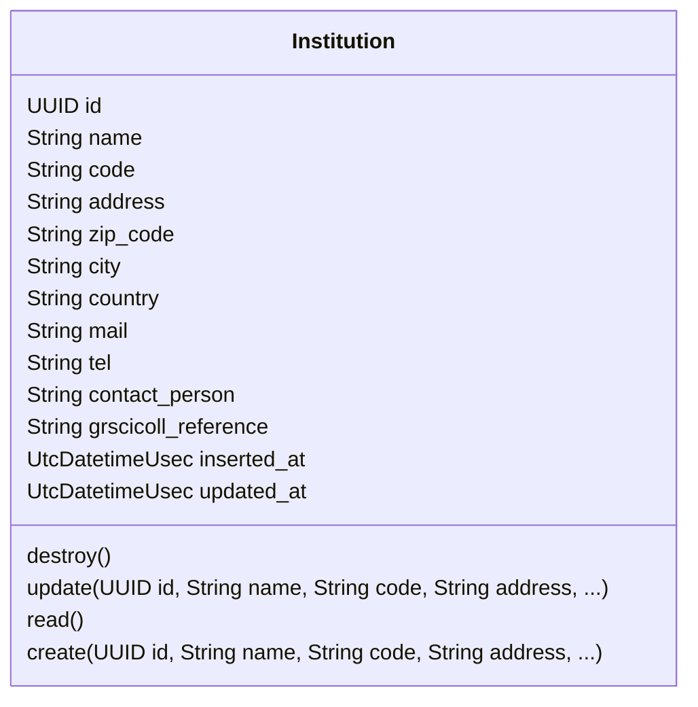
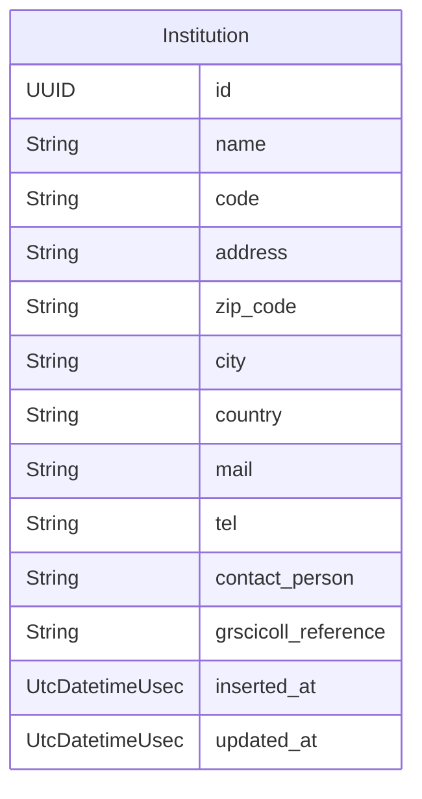
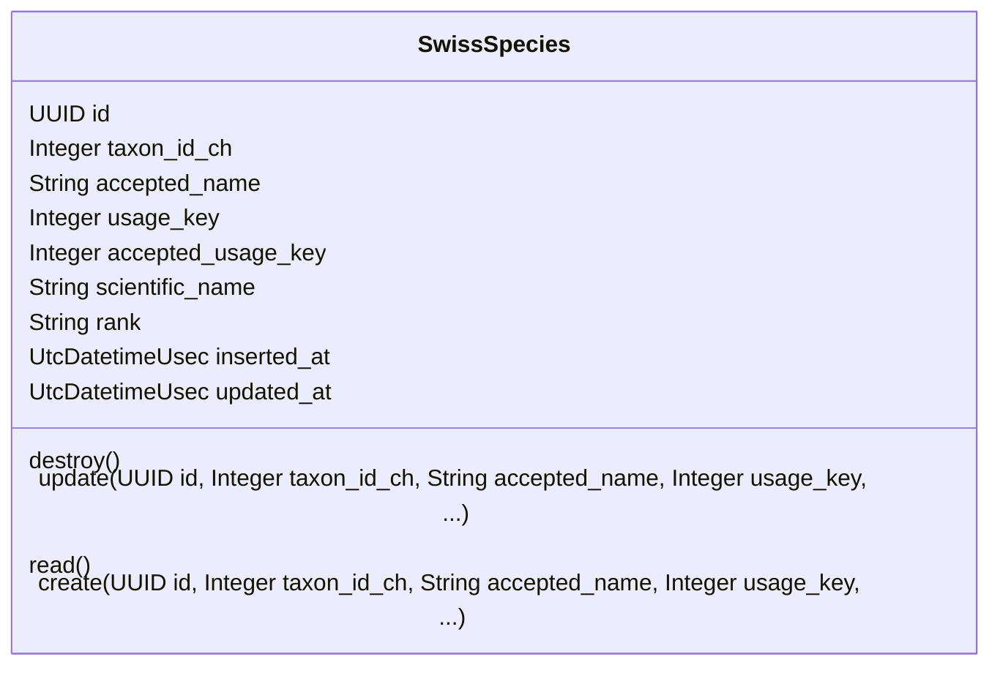
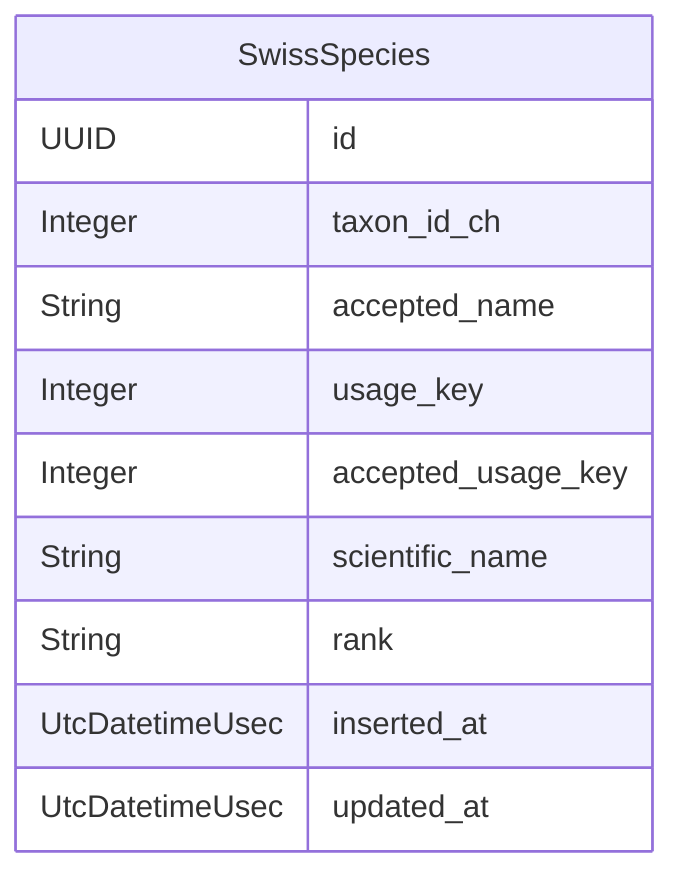
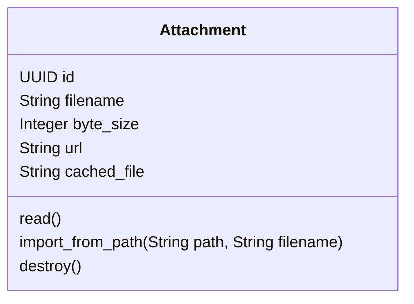
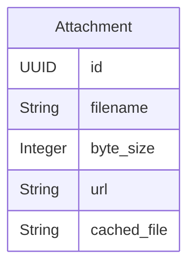
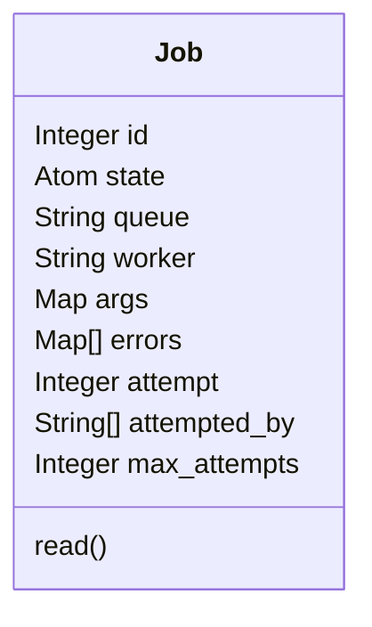
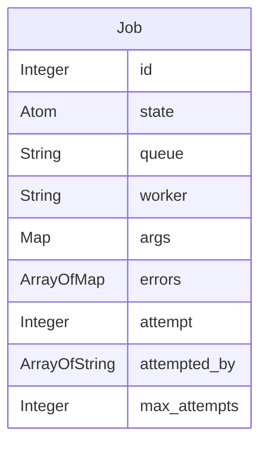

```mermaid
classDiagram
    class ChangeEvent {
        UUID id
        Atom dwc_attribute
        String value
        String previous_value
        EventCategory category
        UtcDatetimeUsec inserted_at
        UtcDatetimeUsec updated_at
        Record record
        destroy()
        read()
        create(Record record, UUID id, Atom dwc_attribute, String value, ...)
        update(Record record, UUID id, Atom dwc_attribute, String value, ...)
    }
    class Collection {
        UUID id
        Integer items_to_digitize
        String owner
        String name
        String code
        String grscicoll_reference
        String description
        Map[] import_mapping
        CollectionType type
        UtcDatetimeUsec inserted_at
        UtcDatetimeUsec updated_at
        Float digitizing_progress
        Integer records_count
        Integer imports_count
        Integer records_count_not_encoded
        Integer records_count_imported
        Integer records_count_encoding_queued
        Integer records_count_encoding
        Integer records_count_encoded
        Integer records_count_failed
        Institution institution
        Import[] imports
        Record[] records
        destroy()
        update(UUID id, Integer items_to_digitize, String owner, String name, ...)
        create(UUID id, Integer items_to_digitize, String owner, String name, ...)
        read(String sort)
        update_import_mapping(Map[] import_mapping)
    }
    class RecordEncodingResult {
        UUID id
        Map input
        Map output
        String message
        Catalog catalog
        EncodingResultState state
        UtcDatetimeUsec inserted_at
        UtcDatetimeUsec updated_at
        Record record
        destroy()
        read()
        filter_by_record(String record_id)
        create(Record record, UUID id, Map input, Map output, ...)
        update(Record record, UUID id, Map input, Map output, ...)
    }
    class Import {
        UUID id
        Column[] columns
        UtcDatetimeUsec inserted_at
        UtcDatetimeUsec updated_at
        UtcDatetime started_at
        UtcDatetime finished_at
        Integer rows_count
        Integer rows_valid_count
        Integer rows_invalid_count
        Integer rows_imported_count
        Integer job_id
        Atom state
        Float import_progress
        Integer rows_validated_count
        Float rows_valid_ratio
        Float validation_progress
        Time duration
        String collection_name
        String attachment_url
        Integer attachment_byte_size
        String attachment_filename
        Term attachment_data
        Column[] mappings
        Map missing_mappings
        Integer records_count
        Collection collection
        Attachment attachment
        Record[] records
        Job job
        destroy()
        read(String sort)
        create(Collection collection, UUID id, Column[] columns, UtcDatetimeUsec inserted_at, ...)
        create_from_path(Collection collection, String path, String filename)
        update_mapping(Column[] columns)
        add_validation_progress(Integer valid, Integer invalid)
        enqueue_import()
        import()
        set_importing()
        add_import_progress(Integer imported)
        set_failed()
        set_imported()
    }
    class Record {
        Import import
        Record record
        update()
        destroy()
        read()
        create(Import import, Record record)
    }
    class Record {
        String mts_material_sample_type
        String mte_material_entity_id
        String occ_occurrence_remarks
        String occ_associated_occurrences
        String occ_sex
        String occ_recorded_by
        String loc_municipality
        String loc_county
        String loc_city
        Float loc_swiss_coordinates_y
        Float loc_swiss_coordinates_x
        String loc_country_code
        String loc_georeference_remarks
        Float loc_decimal_latitude
        Float loc_decimal_longitude
        String loc_state_province
        String loc_verbatim_locality
        String loc_locality
        String loc_country
        String loc_continent
        String spp_life_stage
        String tax_taxon_rank
        String tax_accepted_name_usage_id
        String tax_accepted_name_usage
        Integer tax_taxon_id_ch
        Integer tax_taxon_id
        String tax_specific_epithet
        String tax_infraspecific_epithet
        String tax_scientific_name_authorship
        String tax_scientific_name
        String tax_genus
        String tax_family
        String tax_order
        String tax_class
        String tax_phylum
        String tax_kingdom
        String rrp_relationship_of_resource_id
        String rrp_relationship_of_resource
        Date ref_relationship_established_date
        String ref_title
        String ref_source
        String ref_rights
        Date ref_date
        String ref_creator
        String ref_bibliographic_citation
        String idf_type_status
        String idf_identified_by
        Date idf_date_identified
        Integer eve_end_of_period_year
        Integer eve_end_of_period_month
        Integer eve_end_of_period_day
        Integer eve_year
        Integer eve_month
        Integer eve_day
        Date eve_event_date
        Date prs_date_of_birth
        String prs_last_name
        String prs_first_name
        String prs_contact_point
        UUID id
        Map import_data
        Map extra_data
        Map errors
        UtcDatetimeUsec inserted_at
        UtcDatetimeUsec updated_at
        Integer encoder_job_id
        Atom state
        Version[] paper_trail_versions
        Collection collection
        Import[] imports
        Image[] images
        Attachment[] image_attachments
        Job encoder_job
        EncodedRecord encoded_record
        destroy()
        update(String mts_material_sample_type, String mte_material_entity_id, String occ_occurrence_remarks, String occ_associated_occurrences, ...)
        read(String sort)
        create(Collection collection, String mts_material_sample_type, String mte_material_entity_id, String occ_occurrence_remarks, ...)
        import(Import import, Map params, String mts_material_sample_type, String mte_material_entity_id, ...)
        enqueue_encoder()
        bulk_import(Import import, Term rows)
        encode(Term record, Atom catalog)
        set_imported(String mts_material_sample_type, String mte_material_entity_id, String occ_occurrence_remarks, String occ_associated_occurrences, ...)
        set_encoding(String mts_material_sample_type, String mte_material_entity_id, String occ_occurrence_remarks, String occ_associated_occurrences, ...)
        set_encoded(String mts_material_sample_type, String mte_material_entity_id, String occ_occurrence_remarks, String occ_associated_occurrences, ...)
        set_failed(String mts_material_sample_type, String mte_material_entity_id, String occ_occurrence_remarks, String occ_associated_occurrences, ...)
    }
    class Image {
        UUID id
        Integer size
        UtcDatetimeUsec inserted_at
        UtcDatetimeUsec updated_at
        Attachment attachment
        Record record
        destroy()
        update(UUID id, Integer size, UtcDatetimeUsec inserted_at, UtcDatetimeUsec updated_at)
        read()
        create(UUID id, Integer size, UtcDatetimeUsec inserted_at, UtcDatetimeUsec updated_at)
    }
    class Version {
        UUID id
        Atom version_action_type
        Atom version_action_name
        UUID version_source_id
        Map changes
        Record version_source
        update(UUID id, Atom version_action_type, Atom version_action_name, UUID version_source_id, ...)
        read()
        create(UUID id, Atom version_action_type, Atom version_action_name, UUID version_source_id, ...)
    }
    class EncodedRecord {
        String mts_material_sample_type
        String mte_material_entity_id
        String occ_occurrence_remarks
        String occ_associated_occurrences
        String occ_sex
        String occ_recorded_by
        String loc_municipality
        String loc_county
        String loc_city
        Float loc_swiss_coordinates_y
        Float loc_swiss_coordinates_x
        String loc_country_code
        String loc_georeference_remarks
        Float loc_decimal_latitude
        Float loc_decimal_longitude
        String loc_state_province
        String loc_verbatim_locality
        String loc_locality
        String loc_country
        String loc_continent
        String spp_life_stage
        String tax_taxon_rank
        String tax_accepted_name_usage_id
        String tax_accepted_name_usage
        Integer tax_taxon_id_ch
        Integer tax_taxon_id
        String tax_specific_epithet
        String tax_infraspecific_epithet
        String tax_scientific_name_authorship
        String tax_scientific_name
        String tax_genus
        String tax_family
        String tax_order
        String tax_class
        String tax_phylum
        String tax_kingdom
        String rrp_relationship_of_resource_id
        String rrp_relationship_of_resource
        Date ref_relationship_established_date
        String ref_title
        String ref_source
        String ref_rights
        Date ref_date
        String ref_creator
        String ref_bibliographic_citation
        String idf_type_status
        String idf_identified_by
        Date idf_date_identified
        Integer eve_end_of_period_year
        Integer eve_end_of_period_month
        Integer eve_end_of_period_day
        Integer eve_year
        Integer eve_month
        Integer eve_day
        Date eve_event_date
        Date prs_date_of_birth
        String prs_last_name
        String prs_first_name
        String prs_contact_point
        UUID id
        Map extra_data
        UtcDatetimeUsec inserted_at
        UtcDatetimeUsec updated_at
        Record record
        destroy()
        update(String mts_material_sample_type, String mte_material_entity_id, String occ_occurrence_remarks, String occ_associated_occurrences, ...)
        read(String sort)
        create(Record record, String mts_material_sample_type, String mte_material_entity_id, String occ_occurrence_remarks, ...)
    }

    Attachment -- Import
    Attachment -- Record
    Attachment -- Image
    Job -- Import
    Job -- Record
    Institution -- Collection
    ChangeEvent -- Record
    Collection -- Import
    Collection -- Record
    EncodedRecord -- Record
    RecordEncodingResult -- Record
    Import -- Record
    Import -- Record
    Record -- Record
    Record -- Image
    Record -- Version
```

```mermaid
erDiagram
    ChangeEvent {
        UUID id
        Atom dwc_attribute
        String value
        String previous_value
        EventCategory category
        UtcDatetimeUsec inserted_at
        UtcDatetimeUsec updated_at
    }
    Collection {
        UUID id
        Integer items_to_digitize
        String owner
        String name
        String code
        String grscicoll_reference
        String description
        ArrayOfMap import_mapping
        CollectionType type
        UtcDatetimeUsec inserted_at
        UtcDatetimeUsec updated_at
        Float digitizing_progress
        Integer records_count
        Integer imports_count
        Integer records_count_not_encoded
        Integer records_count_imported
        Integer records_count_encoding_queued
        Integer records_count_encoding
        Integer records_count_encoded
        Integer records_count_failed
    }
    RecordEncodingResult {
        UUID id
        Map input
        Map output
        String message
        Catalog catalog
        EncodingResultState state
        UtcDatetimeUsec inserted_at
        UtcDatetimeUsec updated_at
    }
    Import {
        UUID id
        ArrayOfColumn columns
        UtcDatetimeUsec inserted_at
        UtcDatetimeUsec updated_at
        UtcDatetime started_at
        UtcDatetime finished_at
        Integer rows_count
        Integer rows_valid_count
        Integer rows_invalid_count
        Integer rows_imported_count
        Integer job_id
        Atom state
        Float import_progress
        Integer rows_validated_count
        Float rows_valid_ratio
        Float validation_progress
        Time duration
        String collection_name
        String attachment_url
        Integer attachment_byte_size
        String attachment_filename
        Term attachment_data
        ArrayOfColumn mappings
        Map missing_mappings
        Integer records_count
    }
    Record {

    }
    Record {
        String mts_material_sample_type
        String mte_material_entity_id
        String occ_occurrence_remarks
        String occ_associated_occurrences
        String occ_sex
        String occ_recorded_by
        String loc_municipality
        String loc_county
        String loc_city
        Float loc_swiss_coordinates_y
        Float loc_swiss_coordinates_x
        String loc_country_code
        String loc_georeference_remarks
        Float loc_decimal_latitude
        Float loc_decimal_longitude
        String loc_state_province
        String loc_verbatim_locality
        String loc_locality
        String loc_country
        String loc_continent
        String spp_life_stage
        String tax_taxon_rank
        String tax_accepted_name_usage_id
        String tax_accepted_name_usage
        Integer tax_taxon_id_ch
        Integer tax_taxon_id
        String tax_specific_epithet
        String tax_infraspecific_epithet
        String tax_scientific_name_authorship
        String tax_scientific_name
        String tax_genus
        String tax_family
        String tax_order
        String tax_class
        String tax_phylum
        String tax_kingdom
        String rrp_relationship_of_resource_id
        String rrp_relationship_of_resource
        Date ref_relationship_established_date
        String ref_title
        String ref_source
        String ref_rights
        Date ref_date
        String ref_creator
        String ref_bibliographic_citation
        String idf_type_status
        String idf_identified_by
        Date idf_date_identified
        Integer eve_end_of_period_year
        Integer eve_end_of_period_month
        Integer eve_end_of_period_day
        Integer eve_year
        Integer eve_month
        Integer eve_day
        Date eve_event_date
        Date prs_date_of_birth
        String prs_last_name
        String prs_first_name
        String prs_contact_point
        UUID id
        Map import_data
        Map extra_data
        Map errors
        UtcDatetimeUsec inserted_at
        UtcDatetimeUsec updated_at
        Integer encoder_job_id
        Atom state
    }
    Image {
        UUID id
        Integer size
        UtcDatetimeUsec inserted_at
        UtcDatetimeUsec updated_at
    }
    Version {
        UUID id
        Atom version_action_type
        Atom version_action_name
        UUID version_source_id
        Map changes
    }
    EncodedRecord {
        String mts_material_sample_type
        String mte_material_entity_id
        String occ_occurrence_remarks
        String occ_associated_occurrences
        String occ_sex
        String occ_recorded_by
        String loc_municipality
        String loc_county
        String loc_city
        Float loc_swiss_coordinates_y
        Float loc_swiss_coordinates_x
        String loc_country_code
        String loc_georeference_remarks
        Float loc_decimal_latitude
        Float loc_decimal_longitude
        String loc_state_province
        String loc_verbatim_locality
        String loc_locality
        String loc_country
        String loc_continent
        String spp_life_stage
        String tax_taxon_rank
        String tax_accepted_name_usage_id
        String tax_accepted_name_usage
        Integer tax_taxon_id_ch
        Integer tax_taxon_id
        String tax_specific_epithet
        String tax_infraspecific_epithet
        String tax_scientific_name_authorship
        String tax_scientific_name
        String tax_genus
        String tax_family
        String tax_order
        String tax_class
        String tax_phylum
        String tax_kingdom
        String rrp_relationship_of_resource_id
        String rrp_relationship_of_resource
        Date ref_relationship_established_date
        String ref_title
        String ref_source
        String ref_rights
        Date ref_date
        String ref_creator
        String ref_bibliographic_citation
        String idf_type_status
        String idf_identified_by
        Date idf_date_identified
        Integer eve_end_of_period_year
        Integer eve_end_of_period_month
        Integer eve_end_of_period_day
        Integer eve_year
        Integer eve_month
        Integer eve_day
        Date eve_event_date
        Date prs_date_of_birth
        String prs_last_name
        String prs_first_name
        String prs_contact_point
        UUID id
        Map extra_data
        UtcDatetimeUsec inserted_at
        UtcDatetimeUsec updated_at
    }

    Attachment ||--|| Import : ""
    Attachment ||--|| Record : ""
    Attachment ||--|| Image : ""
    Job ||--|| Import : ""
    Job ||--|| Record : ""
    Institution ||--|| Collection : ""
    ChangeEvent ||--|| Record : ""
    Collection ||--|| Import : ""
    Collection ||--|| Record : ""
    EncodedRecord ||--|| Record : ""
    RecordEncodingResult ||--|| Record : ""
    Import ||--|| Record : ""
    Import ||--|| Record : ""
    Record ||--|| Record : ""
    Record ||--|| Image : ""
    Record ||--|| Version : ""
```

# API Documentation

## API DataAggregator.Platform

### Class Diagram

### ER Diagram

### Resources

- [Institution](#institution)

### Institution

#### Attributes

| Name | Type | Description |
| ---- | ---- | ----------- |
| **id** | UUID |  |
| **name** | String |  |
| **code** | String | an iternationally valid code to identify the institution |
| **address** | String |  |
| **zip_code** | String |  |
| **city** | String |  |
| **country** | String |  |
| **mail** | String |  |
| **tel** | String |  |
| **contact_person** | String |  |
| **grscicoll_reference** | String | a code to identify the institution in the GrSciColl database |
| **inserted_at** | UtcDatetimeUsec |  |
| **updated_at** | UtcDatetimeUsec |  |

#### Actions

| Name | Type | Input | Description |
| ---- | ---- | ----- | ----------- |
| **destroy** | _destroy_ | <ul></ul> |  |
| **update** | _update_ | <ul><li><b>id</b> <i>UUID</i> attribute</li><li><b>name</b> <i>String</i> attribute</li><li><b>code</b> <i>String</i> attribute</li><li><b>address</b> <i>String</i> attribute</li><li><b>zip_code</b> <i>String</i> attribute</li><li><b>city</b> <i>String</i> attribute</li><li><b>country</b> <i>String</i> attribute</li><li><b>mail</b> <i>String</i> attribute</li><li><b>tel</b> <i>String</i> attribute</li><li><b>contact_person</b> <i>String</i> attribute</li><li><b>grscicoll_reference</b> <i>String</i> attribute</li><li><b>inserted_at</b> <i>UtcDatetimeUsec</i> attribute</li><li><b>updated_at</b> <i>UtcDatetimeUsec</i> attribute</li></ul> |  |
| **read** | _read_ | <ul></ul> |  |
| **create** | _create_ | <ul><li><b>id</b> <i>UUID</i> attribute</li><li><b>name</b> <i>String</i> attribute</li><li><b>code</b> <i>String</i> attribute</li><li><b>address</b> <i>String</i> attribute</li><li><b>zip_code</b> <i>String</i> attribute</li><li><b>city</b> <i>String</i> attribute</li><li><b>country</b> <i>String</i> attribute</li><li><b>mail</b> <i>String</i> attribute</li><li><b>tel</b> <i>String</i> attribute</li><li><b>contact_person</b> <i>String</i> attribute</li><li><b>grscicoll_reference</b> <i>String</i> attribute</li><li><b>inserted_at</b> <i>UtcDatetimeUsec</i> attribute</li><li><b>updated_at</b> <i>UtcDatetimeUsec</i> attribute</li></ul> |  |

## API DataAggregator.Records

### Class Diagram

### ER Diagram

### Resources

- [ChangeEvent](#changeevent)
- [Collection](#collection)
- [RecordEncodingResult](#recordencodingresult)
- [Import](#import)
- [Record](#record)
- [Record](#record)
- [Image](#image)
- [Version](#version)
- [EncodedRecord](#encodedrecord)

### ChangeEvent

#### Attributes

| Name | Type | Description |
| ---- | ---- | ----------- |
| **id** | UUID |  |
| **dwc_attribute** | Atom |  |
| **value** | String |  |
| **previous_value** | String |  |
| **category** | EventCategory |  |
| **inserted_at** | UtcDatetimeUsec |  |
| **updated_at** | UtcDatetimeUsec |  |
| **record_id** | UUID |  |

#### Actions

| Name | Type | Input | Description |
| ---- | ---- | ----- | ----------- |
| **destroy** | _destroy_ | <ul></ul> |  |
| **read** | _read_ | <ul></ul> |  |
| **create** | _create_ | <ul><li><b>record</b> <i>Record</i> </li><li><b>id</b> <i>UUID</i> attribute</li><li><b>dwc_attribute</b> <i>Atom</i> attribute</li><li><b>value</b> <i>String</i> attribute</li><li><b>previous_value</b> <i>String</i> attribute</li><li><b>category</b> <i>EventCategory</i> attribute</li><li><b>inserted_at</b> <i>UtcDatetimeUsec</i> attribute</li><li><b>updated_at</b> <i>UtcDatetimeUsec</i> attribute</li></ul> |  |
| **update** | _update_ | <ul><li><b>record</b> <i>Record</i> </li><li><b>id</b> <i>UUID</i> attribute</li><li><b>dwc_attribute</b> <i>Atom</i> attribute</li><li><b>value</b> <i>String</i> attribute</li><li><b>previous_value</b> <i>String</i> attribute</li><li><b>category</b> <i>EventCategory</i> attribute</li><li><b>inserted_at</b> <i>UtcDatetimeUsec</i> attribute</li><li><b>updated_at</b> <i>UtcDatetimeUsec</i> attribute</li></ul> |  |

### Collection

#### Attributes

| Name | Type | Description |
| ---- | ---- | ----------- |
| **id** | UUID |  |
| **items_to_digitize** | Integer |  |
| **owner** | String |  |
| **name** | String |  |
| **code** | String | an iternationally valid code to identify the collection |
| **grscicoll_reference** | String | a code to identify the collection in the GrSciColl database |
| **description** | String |  |
| **import_mapping** | Map[] |  |
| **type** | CollectionType |  |
| **inserted_at** | UtcDatetimeUsec |  |
| **updated_at** | UtcDatetimeUsec |  |
| **institution_id** | UUID |  |

#### Actions

| Name | Type | Input | Description |
| ---- | ---- | ----- | ----------- |
| **destroy** | _destroy_ | <ul></ul> |  |
| **update** | _update_ | <ul><li><b>id</b> <i>UUID</i> attribute</li><li><b>items_to_digitize</b> <i>Integer</i> attribute</li><li><b>owner</b> <i>String</i> attribute</li><li><b>name</b> <i>String</i> attribute</li><li><b>code</b> <i>String</i> attribute</li><li><b>grscicoll_reference</b> <i>String</i> attribute</li><li><b>description</b> <i>String</i> attribute</li><li><b>import_mapping</b> <i>Map[]</i> attribute</li><li><b>type</b> <i>CollectionType</i> attribute</li><li><b>inserted_at</b> <i>UtcDatetimeUsec</i> attribute</li><li><b>updated_at</b> <i>UtcDatetimeUsec</i> attribute</li></ul> |  |
| **create** | _create_ | <ul><li><b>id</b> <i>UUID</i> attribute</li><li><b>items_to_digitize</b> <i>Integer</i> attribute</li><li><b>owner</b> <i>String</i> attribute</li><li><b>name</b> <i>String</i> attribute</li><li><b>code</b> <i>String</i> attribute</li><li><b>grscicoll_reference</b> <i>String</i> attribute</li><li><b>description</b> <i>String</i> attribute</li><li><b>import_mapping</b> <i>Map[]</i> attribute</li><li><b>type</b> <i>CollectionType</i> attribute</li><li><b>inserted_at</b> <i>UtcDatetimeUsec</i> attribute</li><li><b>updated_at</b> <i>UtcDatetimeUsec</i> attribute</li></ul> |  |
| **read** | _read_ | <ul><li><b>sort</b> <i>String</i> </li></ul> |  |
| **update_import_mapping** | _update_ | <ul><li><b>import_mapping</b> <i>Map[]</i> attribute</li></ul> |  |

### RecordEncodingResult

#### Attributes

| Name | Type | Description |
| ---- | ---- | ----------- |
| **id** | UUID |  |
| **input** | Map | The input data for the encoding |
| **output** | Map | The output data of the encoding |
| **message** | String | A message describing the result of the encoding |
| **catalog** | Catalog | The catalog used for the encoding |
| **state** | EncodingResultState | The state of the encoding result |
| **inserted_at** | UtcDatetimeUsec |  |
| **updated_at** | UtcDatetimeUsec |  |
| **record_id** | UUID |  |

#### Actions

| Name | Type | Input | Description |
| ---- | ---- | ----- | ----------- |
| **destroy** | _destroy_ | <ul></ul> |  |
| **read** | _read_ | <ul></ul> |  |
| **filter_by_record** | _read_ | <ul><li><b>record_id</b> <i>String</i> </li></ul> |  |
| **create** | _create_ | <ul><li><b>record</b> <i>Record</i> </li><li><b>id</b> <i>UUID</i> attribute</li><li><b>input</b> <i>Map</i> attribute</li><li><b>output</b> <i>Map</i> attribute</li><li><b>message</b> <i>String</i> attribute</li><li><b>catalog</b> <i>Catalog</i> attribute</li><li><b>state</b> <i>EncodingResultState</i> attribute</li><li><b>inserted_at</b> <i>UtcDatetimeUsec</i> attribute</li><li><b>updated_at</b> <i>UtcDatetimeUsec</i> attribute</li></ul> |  |
| **update** | _update_ | <ul><li><b>record</b> <i>Record</i> </li><li><b>id</b> <i>UUID</i> attribute</li><li><b>input</b> <i>Map</i> attribute</li><li><b>output</b> <i>Map</i> attribute</li><li><b>message</b> <i>String</i> attribute</li><li><b>catalog</b> <i>Catalog</i> attribute</li><li><b>state</b> <i>EncodingResultState</i> attribute</li><li><b>inserted_at</b> <i>UtcDatetimeUsec</i> attribute</li><li><b>updated_at</b> <i>UtcDatetimeUsec</i> attribute</li></ul> |  |

### Import

#### Attributes

| Name | Type | Description |
| ---- | ---- | ----------- |
| **id** | UUID |  |
| **columns** | Column[] |  |
| **inserted_at** | UtcDatetimeUsec |  |
| **updated_at** | UtcDatetimeUsec |  |
| **started_at** | UtcDatetime |  |
| **finished_at** | UtcDatetime |  |
| **rows_count** | Integer |  |
| **rows_valid_count** | Integer |  |
| **rows_invalid_count** | Integer |  |
| **rows_imported_count** | Integer |  |
| **collection_id** | UUID |  |
| **attachment_id** | UUID |  |
| **job_id** | Integer |  |
| **state** | Atom |  |

#### Actions

| Name | Type | Input | Description |
| ---- | ---- | ----- | ----------- |
| **destroy** | _destroy_ | <ul></ul> |  |
| **read** | _read_ | <ul><li><b>sort</b> <i>String</i> </li></ul> |  |
| **create** | _create_ | <ul><li><b>collection</b> <i>Collection</i> </li><li><b>id</b> <i>UUID</i> attribute</li><li><b>columns</b> <i>Column[]</i> attribute</li><li><b>inserted_at</b> <i>UtcDatetimeUsec</i> attribute</li><li><b>updated_at</b> <i>UtcDatetimeUsec</i> attribute</li><li><b>started_at</b> <i>UtcDatetime</i> attribute</li><li><b>finished_at</b> <i>UtcDatetime</i> attribute</li><li><b>rows_count</b> <i>Integer</i> attribute</li><li><b>rows_valid_count</b> <i>Integer</i> attribute</li><li><b>rows_invalid_count</b> <i>Integer</i> attribute</li><li><b>rows_imported_count</b> <i>Integer</i> attribute</li><li><b>job_id</b> <i>Integer</i> attribute</li></ul> |  |
| **create_from_path** | _create_ | <ul><li><b>collection</b> <i>Collection</i> </li><li><b>path</b> <i>String</i> </li><li><b>filename</b> <i>String</i> </li></ul> |  |
| **update_mapping** | _update_ | <ul><li><b>columns</b> <i>Column[]</i> attribute</li></ul> |  |
| **add_validation_progress** | _update_ | <ul><li><b>valid</b> <i>Integer</i> </li><li><b>invalid</b> <i>Integer</i> </li></ul> |  |
| **enqueue_import** | _update_ | <ul></ul> |  |
| **import** | _update_ | <ul></ul> |  |
| **set_importing** | _update_ | <ul></ul> |  |
| **add_import_progress** | _update_ | <ul><li><b>imported</b> <i>Integer</i> </li></ul> |  |
| **set_failed** | _update_ | <ul></ul> |  |
| **set_imported** | _update_ | <ul></ul> |  |

### Record

#### Attributes

| Name | Type | Description |
| ---- | ---- | ----------- |
| **import_id** | UUID |  |
| **record_id** | UUID |  |

#### Actions

| Name | Type | Input | Description |
| ---- | ---- | ----- | ----------- |
| **update** | _update_ | <ul></ul> |  |
| **destroy** | _destroy_ | <ul></ul> |  |
| **read** | _read_ | <ul></ul> |  |
| **create** | _create_ | <ul><li><b>import</b> <i>Import</i> </li><li><b>record</b> <i>Record</i> </li></ul> |  |

### Record

#### Attributes

| Name | Type | Description |
| ---- | ---- | ----------- |
| **mts_material_sample_type** | String |  |
| **mte_material_entity_id** | String |  |
| **occ_occurrence_remarks** | String |  |
| **occ_associated_occurrences** | String |  |
| **occ_sex** | String |  |
| **occ_recorded_by** | String |  |
| **loc_municipality** | String |  |
| **loc_county** | String |  |
| **loc_city** | String |  |
| **loc_swiss_coordinates_y** | Float |  |
| **loc_swiss_coordinates_x** | Float |  |
| **loc_country_code** | String |  |
| **loc_georeference_remarks** | String |  |
| **loc_decimal_latitude** | Float |  |
| **loc_decimal_longitude** | Float |  |
| **loc_state_province** | String |  |
| **loc_verbatim_locality** | String |  |
| **loc_locality** | String |  |
| **loc_country** | String |  |
| **loc_continent** | String |  |
| **spp_life_stage** | String |  |
| **tax_taxon_rank** | String |  |
| **tax_accepted_name_usage_id** | String |  |
| **tax_accepted_name_usage** | String |  |
| **tax_taxon_id_ch** | Integer |  |
| **tax_taxon_id** | Integer |  |
| **tax_specific_epithet** | String |  |
| **tax_infraspecific_epithet** | String |  |
| **tax_scientific_name_authorship** | String |  |
| **tax_scientific_name** | String |  |
| **tax_genus** | String |  |
| **tax_family** | String |  |
| **tax_order** | String |  |
| **tax_class** | String |  |
| **tax_phylum** | String |  |
| **tax_kingdom** | String |  |
| **rrp_relationship_of_resource_id** | String |  |
| **rrp_relationship_of_resource** | String |  |
| **ref_relationship_established_date** | Date |  |
| **ref_title** | String |  |
| **ref_source** | String |  |
| **ref_rights** | String |  |
| **ref_date** | Date |  |
| **ref_creator** | String |  |
| **ref_bibliographic_citation** | String |  |
| **idf_type_status** | String |  |
| **idf_identified_by** | String |  |
| **idf_date_identified** | Date |  |
| **eve_end_of_period_year** | Integer |  |
| **eve_end_of_period_month** | Integer |  |
| **eve_end_of_period_day** | Integer |  |
| **eve_year** | Integer |  |
| **eve_month** | Integer |  |
| **eve_day** | Integer |  |
| **eve_event_date** | Date |  |
| **prs_date_of_birth** | Date |  |
| **prs_last_name** | String |  |
| **prs_first_name** | String |  |
| **prs_contact_point** | String | TODO: Add attribute descriptions |
| **id** | UUID |  |
| **import_data** | Map |  |
| **extra_data** | Map |  |
| **errors** | Map |  |
| **inserted_at** | UtcDatetimeUsec |  |
| **updated_at** | UtcDatetimeUsec |  |
| **collection_id** | UUID |  |
| **encoder_job_id** | Integer |  |
| **state** | Atom |  |

#### Actions

| Name | Type | Input | Description |
| ---- | ---- | ----- | ----------- |
| **destroy** | _destroy_ | <ul></ul> |  |
| **update** | _update_ | <ul><li><b>mts_material_sample_type</b> <i>String</i> attribute</li><li><b>mte_material_entity_id</b> <i>String</i> attribute</li><li><b>occ_occurrence_remarks</b> <i>String</i> attribute</li><li><b>occ_associated_occurrences</b> <i>String</i> attribute</li><li><b>occ_sex</b> <i>String</i> attribute</li><li><b>occ_recorded_by</b> <i>String</i> attribute</li><li><b>loc_municipality</b> <i>String</i> attribute</li><li><b>loc_county</b> <i>String</i> attribute</li><li><b>loc_city</b> <i>String</i> attribute</li><li><b>loc_swiss_coordinates_y</b> <i>Float</i> attribute</li><li><b>loc_swiss_coordinates_x</b> <i>Float</i> attribute</li><li><b>loc_country_code</b> <i>String</i> attribute</li><li><b>loc_georeference_remarks</b> <i>String</i> attribute</li><li><b>loc_decimal_latitude</b> <i>Float</i> attribute</li><li><b>loc_decimal_longitude</b> <i>Float</i> attribute</li><li><b>loc_state_province</b> <i>String</i> attribute</li><li><b>loc_verbatim_locality</b> <i>String</i> attribute</li><li><b>loc_locality</b> <i>String</i> attribute</li><li><b>loc_country</b> <i>String</i> attribute</li><li><b>loc_continent</b> <i>String</i> attribute</li><li><b>spp_life_stage</b> <i>String</i> attribute</li><li><b>tax_taxon_rank</b> <i>String</i> attribute</li><li><b>tax_accepted_name_usage_id</b> <i>String</i> attribute</li><li><b>tax_accepted_name_usage</b> <i>String</i> attribute</li><li><b>tax_taxon_id_ch</b> <i>Integer</i> attribute</li><li><b>tax_taxon_id</b> <i>Integer</i> attribute</li><li><b>tax_specific_epithet</b> <i>String</i> attribute</li><li><b>tax_infraspecific_epithet</b> <i>String</i> attribute</li><li><b>tax_scientific_name_authorship</b> <i>String</i> attribute</li><li><b>tax_scientific_name</b> <i>String</i> attribute</li><li><b>tax_genus</b> <i>String</i> attribute</li><li><b>tax_family</b> <i>String</i> attribute</li><li><b>tax_order</b> <i>String</i> attribute</li><li><b>tax_class</b> <i>String</i> attribute</li><li><b>tax_phylum</b> <i>String</i> attribute</li><li><b>tax_kingdom</b> <i>String</i> attribute</li><li><b>rrp_relationship_of_resource_id</b> <i>String</i> attribute</li><li><b>rrp_relationship_of_resource</b> <i>String</i> attribute</li><li><b>ref_relationship_established_date</b> <i>Date</i> attribute</li><li><b>ref_title</b> <i>String</i> attribute</li><li><b>ref_source</b> <i>String</i> attribute</li><li><b>ref_rights</b> <i>String</i> attribute</li><li><b>ref_date</b> <i>Date</i> attribute</li><li><b>ref_creator</b> <i>String</i> attribute</li><li><b>ref_bibliographic_citation</b> <i>String</i> attribute</li><li><b>idf_type_status</b> <i>String</i> attribute</li><li><b>idf_identified_by</b> <i>String</i> attribute</li><li><b>idf_date_identified</b> <i>Date</i> attribute</li><li><b>eve_end_of_period_year</b> <i>Integer</i> attribute</li><li><b>eve_end_of_period_month</b> <i>Integer</i> attribute</li><li><b>eve_end_of_period_day</b> <i>Integer</i> attribute</li><li><b>eve_year</b> <i>Integer</i> attribute</li><li><b>eve_month</b> <i>Integer</i> attribute</li><li><b>eve_day</b> <i>Integer</i> attribute</li><li><b>eve_event_date</b> <i>Date</i> attribute</li><li><b>prs_date_of_birth</b> <i>Date</i> attribute</li><li><b>prs_last_name</b> <i>String</i> attribute</li><li><b>prs_first_name</b> <i>String</i> attribute</li><li><b>prs_contact_point</b> <i>String</i> attribute</li><li><b>id</b> <i>UUID</i> attribute</li><li><b>import_data</b> <i>Map</i> attribute</li><li><b>extra_data</b> <i>Map</i> attribute</li><li><b>errors</b> <i>Map</i> attribute</li><li><b>inserted_at</b> <i>UtcDatetimeUsec</i> attribute</li><li><b>updated_at</b> <i>UtcDatetimeUsec</i> attribute</li><li><b>encoder_job_id</b> <i>Integer</i> attribute</li></ul> |  |
| **read** | _read_ | <ul><li><b>sort</b> <i>String</i> </li></ul> |  |
| **create** | _create_ | <ul><li><b>collection</b> <i>Collection</i> </li><li><b>mts_material_sample_type</b> <i>String</i> attribute</li><li><b>mte_material_entity_id</b> <i>String</i> attribute</li><li><b>occ_occurrence_remarks</b> <i>String</i> attribute</li><li><b>occ_associated_occurrences</b> <i>String</i> attribute</li><li><b>occ_sex</b> <i>String</i> attribute</li><li><b>occ_recorded_by</b> <i>String</i> attribute</li><li><b>loc_municipality</b> <i>String</i> attribute</li><li><b>loc_county</b> <i>String</i> attribute</li><li><b>loc_city</b> <i>String</i> attribute</li><li><b>loc_swiss_coordinates_y</b> <i>Float</i> attribute</li><li><b>loc_swiss_coordinates_x</b> <i>Float</i> attribute</li><li><b>loc_country_code</b> <i>String</i> attribute</li><li><b>loc_georeference_remarks</b> <i>String</i> attribute</li><li><b>loc_decimal_latitude</b> <i>Float</i> attribute</li><li><b>loc_decimal_longitude</b> <i>Float</i> attribute</li><li><b>loc_state_province</b> <i>String</i> attribute</li><li><b>loc_verbatim_locality</b> <i>String</i> attribute</li><li><b>loc_locality</b> <i>String</i> attribute</li><li><b>loc_country</b> <i>String</i> attribute</li><li><b>loc_continent</b> <i>String</i> attribute</li><li><b>spp_life_stage</b> <i>String</i> attribute</li><li><b>tax_taxon_rank</b> <i>String</i> attribute</li><li><b>tax_accepted_name_usage_id</b> <i>String</i> attribute</li><li><b>tax_accepted_name_usage</b> <i>String</i> attribute</li><li><b>tax_taxon_id_ch</b> <i>Integer</i> attribute</li><li><b>tax_taxon_id</b> <i>Integer</i> attribute</li><li><b>tax_specific_epithet</b> <i>String</i> attribute</li><li><b>tax_infraspecific_epithet</b> <i>String</i> attribute</li><li><b>tax_scientific_name_authorship</b> <i>String</i> attribute</li><li><b>tax_scientific_name</b> <i>String</i> attribute</li><li><b>tax_genus</b> <i>String</i> attribute</li><li><b>tax_family</b> <i>String</i> attribute</li><li><b>tax_order</b> <i>String</i> attribute</li><li><b>tax_class</b> <i>String</i> attribute</li><li><b>tax_phylum</b> <i>String</i> attribute</li><li><b>tax_kingdom</b> <i>String</i> attribute</li><li><b>rrp_relationship_of_resource_id</b> <i>String</i> attribute</li><li><b>rrp_relationship_of_resource</b> <i>String</i> attribute</li><li><b>ref_relationship_established_date</b> <i>Date</i> attribute</li><li><b>ref_title</b> <i>String</i> attribute</li><li><b>ref_source</b> <i>String</i> attribute</li><li><b>ref_rights</b> <i>String</i> attribute</li><li><b>ref_date</b> <i>Date</i> attribute</li><li><b>ref_creator</b> <i>String</i> attribute</li><li><b>ref_bibliographic_citation</b> <i>String</i> attribute</li><li><b>idf_type_status</b> <i>String</i> attribute</li><li><b>idf_identified_by</b> <i>String</i> attribute</li><li><b>idf_date_identified</b> <i>Date</i> attribute</li><li><b>eve_end_of_period_year</b> <i>Integer</i> attribute</li><li><b>eve_end_of_period_month</b> <i>Integer</i> attribute</li><li><b>eve_end_of_period_day</b> <i>Integer</i> attribute</li><li><b>eve_year</b> <i>Integer</i> attribute</li><li><b>eve_month</b> <i>Integer</i> attribute</li><li><b>eve_day</b> <i>Integer</i> attribute</li><li><b>eve_event_date</b> <i>Date</i> attribute</li><li><b>prs_date_of_birth</b> <i>Date</i> attribute</li><li><b>prs_last_name</b> <i>String</i> attribute</li><li><b>prs_first_name</b> <i>String</i> attribute</li><li><b>prs_contact_point</b> <i>String</i> attribute</li><li><b>id</b> <i>UUID</i> attribute</li><li><b>import_data</b> <i>Map</i> attribute</li><li><b>extra_data</b> <i>Map</i> attribute</li><li><b>errors</b> <i>Map</i> attribute</li><li><b>inserted_at</b> <i>UtcDatetimeUsec</i> attribute</li><li><b>updated_at</b> <i>UtcDatetimeUsec</i> attribute</li><li><b>encoder_job_id</b> <i>Integer</i> attribute</li></ul> |  |
| **import** | _create_ | <ul><li><b>import</b> <i>Import</i> </li><li><b>params</b> <i>Map</i> </li><li><b>mts_material_sample_type</b> <i>String</i> attribute</li><li><b>mte_material_entity_id</b> <i>String</i> attribute</li><li><b>occ_occurrence_remarks</b> <i>String</i> attribute</li><li><b>occ_associated_occurrences</b> <i>String</i> attribute</li><li><b>occ_sex</b> <i>String</i> attribute</li><li><b>occ_recorded_by</b> <i>String</i> attribute</li><li><b>loc_municipality</b> <i>String</i> attribute</li><li><b>loc_county</b> <i>String</i> attribute</li><li><b>loc_city</b> <i>String</i> attribute</li><li><b>loc_swiss_coordinates_y</b> <i>Float</i> attribute</li><li><b>loc_swiss_coordinates_x</b> <i>Float</i> attribute</li><li><b>loc_country_code</b> <i>String</i> attribute</li><li><b>loc_georeference_remarks</b> <i>String</i> attribute</li><li><b>loc_decimal_latitude</b> <i>Float</i> attribute</li><li><b>loc_decimal_longitude</b> <i>Float</i> attribute</li><li><b>loc_state_province</b> <i>String</i> attribute</li><li><b>loc_verbatim_locality</b> <i>String</i> attribute</li><li><b>loc_locality</b> <i>String</i> attribute</li><li><b>loc_country</b> <i>String</i> attribute</li><li><b>loc_continent</b> <i>String</i> attribute</li><li><b>spp_life_stage</b> <i>String</i> attribute</li><li><b>tax_taxon_rank</b> <i>String</i> attribute</li><li><b>tax_accepted_name_usage_id</b> <i>String</i> attribute</li><li><b>tax_accepted_name_usage</b> <i>String</i> attribute</li><li><b>tax_taxon_id_ch</b> <i>Integer</i> attribute</li><li><b>tax_taxon_id</b> <i>Integer</i> attribute</li><li><b>tax_specific_epithet</b> <i>String</i> attribute</li><li><b>tax_infraspecific_epithet</b> <i>String</i> attribute</li><li><b>tax_scientific_name_authorship</b> <i>String</i> attribute</li><li><b>tax_scientific_name</b> <i>String</i> attribute</li><li><b>tax_genus</b> <i>String</i> attribute</li><li><b>tax_family</b> <i>String</i> attribute</li><li><b>tax_order</b> <i>String</i> attribute</li><li><b>tax_class</b> <i>String</i> attribute</li><li><b>tax_phylum</b> <i>String</i> attribute</li><li><b>tax_kingdom</b> <i>String</i> attribute</li><li><b>rrp_relationship_of_resource_id</b> <i>String</i> attribute</li><li><b>rrp_relationship_of_resource</b> <i>String</i> attribute</li><li><b>ref_relationship_established_date</b> <i>Date</i> attribute</li><li><b>ref_title</b> <i>String</i> attribute</li><li><b>ref_source</b> <i>String</i> attribute</li><li><b>ref_rights</b> <i>String</i> attribute</li><li><b>ref_date</b> <i>Date</i> attribute</li><li><b>ref_creator</b> <i>String</i> attribute</li><li><b>ref_bibliographic_citation</b> <i>String</i> attribute</li><li><b>idf_type_status</b> <i>String</i> attribute</li><li><b>idf_identified_by</b> <i>String</i> attribute</li><li><b>idf_date_identified</b> <i>Date</i> attribute</li><li><b>eve_end_of_period_year</b> <i>Integer</i> attribute</li><li><b>eve_end_of_period_month</b> <i>Integer</i> attribute</li><li><b>eve_end_of_period_day</b> <i>Integer</i> attribute</li><li><b>eve_year</b> <i>Integer</i> attribute</li><li><b>eve_month</b> <i>Integer</i> attribute</li><li><b>eve_day</b> <i>Integer</i> attribute</li><li><b>eve_event_date</b> <i>Date</i> attribute</li><li><b>prs_date_of_birth</b> <i>Date</i> attribute</li><li><b>prs_last_name</b> <i>String</i> attribute</li><li><b>prs_first_name</b> <i>String</i> attribute</li><li><b>prs_contact_point</b> <i>String</i> attribute</li><li><b>id</b> <i>UUID</i> attribute</li><li><b>import_data</b> <i>Map</i> attribute</li><li><b>extra_data</b> <i>Map</i> attribute</li><li><b>errors</b> <i>Map</i> attribute</li><li><b>inserted_at</b> <i>UtcDatetimeUsec</i> attribute</li><li><b>updated_at</b> <i>UtcDatetimeUsec</i> attribute</li><li><b>encoder_job_id</b> <i>Integer</i> attribute</li></ul> | Creates or updates a `Record` from the given `params`.

The record is associated with the give `DataAggregator.Records.Import` and
its `DataAggregator.Records.Collection`.
 |
| **enqueue_encoder** | _update_ | <ul></ul> |  |
| **bulk_import** | _action_ | <ul><li><b>import</b> <i>Import</i> </li><li><b>rows</b> <i>Term</i> </li></ul> | Imports multiple records using `DataAggregator.Records.bulk_create/3`.

The `rows` can be any enumberable, where each item which will be used as `params` for
the `DataAggregator.Records.Record.import/2` action.
 |
| **encode** | _action_ | <ul><li><b>record</b> <i>Term</i> </li><li><b>catalog</b> <i>Atom</i> </li></ul> |  |
| **set_imported** | _update_ | <ul><li><b>mts_material_sample_type</b> <i>String</i> attribute</li><li><b>mte_material_entity_id</b> <i>String</i> attribute</li><li><b>occ_occurrence_remarks</b> <i>String</i> attribute</li><li><b>occ_associated_occurrences</b> <i>String</i> attribute</li><li><b>occ_sex</b> <i>String</i> attribute</li><li><b>occ_recorded_by</b> <i>String</i> attribute</li><li><b>loc_municipality</b> <i>String</i> attribute</li><li><b>loc_county</b> <i>String</i> attribute</li><li><b>loc_city</b> <i>String</i> attribute</li><li><b>loc_swiss_coordinates_y</b> <i>Float</i> attribute</li><li><b>loc_swiss_coordinates_x</b> <i>Float</i> attribute</li><li><b>loc_country_code</b> <i>String</i> attribute</li><li><b>loc_georeference_remarks</b> <i>String</i> attribute</li><li><b>loc_decimal_latitude</b> <i>Float</i> attribute</li><li><b>loc_decimal_longitude</b> <i>Float</i> attribute</li><li><b>loc_state_province</b> <i>String</i> attribute</li><li><b>loc_verbatim_locality</b> <i>String</i> attribute</li><li><b>loc_locality</b> <i>String</i> attribute</li><li><b>loc_country</b> <i>String</i> attribute</li><li><b>loc_continent</b> <i>String</i> attribute</li><li><b>spp_life_stage</b> <i>String</i> attribute</li><li><b>tax_taxon_rank</b> <i>String</i> attribute</li><li><b>tax_accepted_name_usage_id</b> <i>String</i> attribute</li><li><b>tax_accepted_name_usage</b> <i>String</i> attribute</li><li><b>tax_taxon_id_ch</b> <i>Integer</i> attribute</li><li><b>tax_taxon_id</b> <i>Integer</i> attribute</li><li><b>tax_specific_epithet</b> <i>String</i> attribute</li><li><b>tax_infraspecific_epithet</b> <i>String</i> attribute</li><li><b>tax_scientific_name_authorship</b> <i>String</i> attribute</li><li><b>tax_scientific_name</b> <i>String</i> attribute</li><li><b>tax_genus</b> <i>String</i> attribute</li><li><b>tax_family</b> <i>String</i> attribute</li><li><b>tax_order</b> <i>String</i> attribute</li><li><b>tax_class</b> <i>String</i> attribute</li><li><b>tax_phylum</b> <i>String</i> attribute</li><li><b>tax_kingdom</b> <i>String</i> attribute</li><li><b>rrp_relationship_of_resource_id</b> <i>String</i> attribute</li><li><b>rrp_relationship_of_resource</b> <i>String</i> attribute</li><li><b>ref_relationship_established_date</b> <i>Date</i> attribute</li><li><b>ref_title</b> <i>String</i> attribute</li><li><b>ref_source</b> <i>String</i> attribute</li><li><b>ref_rights</b> <i>String</i> attribute</li><li><b>ref_date</b> <i>Date</i> attribute</li><li><b>ref_creator</b> <i>String</i> attribute</li><li><b>ref_bibliographic_citation</b> <i>String</i> attribute</li><li><b>idf_type_status</b> <i>String</i> attribute</li><li><b>idf_identified_by</b> <i>String</i> attribute</li><li><b>idf_date_identified</b> <i>Date</i> attribute</li><li><b>eve_end_of_period_year</b> <i>Integer</i> attribute</li><li><b>eve_end_of_period_month</b> <i>Integer</i> attribute</li><li><b>eve_end_of_period_day</b> <i>Integer</i> attribute</li><li><b>eve_year</b> <i>Integer</i> attribute</li><li><b>eve_month</b> <i>Integer</i> attribute</li><li><b>eve_day</b> <i>Integer</i> attribute</li><li><b>eve_event_date</b> <i>Date</i> attribute</li><li><b>prs_date_of_birth</b> <i>Date</i> attribute</li><li><b>prs_last_name</b> <i>String</i> attribute</li><li><b>prs_first_name</b> <i>String</i> attribute</li><li><b>prs_contact_point</b> <i>String</i> attribute</li><li><b>id</b> <i>UUID</i> attribute</li><li><b>import_data</b> <i>Map</i> attribute</li><li><b>extra_data</b> <i>Map</i> attribute</li><li><b>errors</b> <i>Map</i> attribute</li><li><b>inserted_at</b> <i>UtcDatetimeUsec</i> attribute</li><li><b>updated_at</b> <i>UtcDatetimeUsec</i> attribute</li><li><b>encoder_job_id</b> <i>Integer</i> attribute</li></ul> |  |
| **set_encoding** | _update_ | <ul><li><b>mts_material_sample_type</b> <i>String</i> attribute</li><li><b>mte_material_entity_id</b> <i>String</i> attribute</li><li><b>occ_occurrence_remarks</b> <i>String</i> attribute</li><li><b>occ_associated_occurrences</b> <i>String</i> attribute</li><li><b>occ_sex</b> <i>String</i> attribute</li><li><b>occ_recorded_by</b> <i>String</i> attribute</li><li><b>loc_municipality</b> <i>String</i> attribute</li><li><b>loc_county</b> <i>String</i> attribute</li><li><b>loc_city</b> <i>String</i> attribute</li><li><b>loc_swiss_coordinates_y</b> <i>Float</i> attribute</li><li><b>loc_swiss_coordinates_x</b> <i>Float</i> attribute</li><li><b>loc_country_code</b> <i>String</i> attribute</li><li><b>loc_georeference_remarks</b> <i>String</i> attribute</li><li><b>loc_decimal_latitude</b> <i>Float</i> attribute</li><li><b>loc_decimal_longitude</b> <i>Float</i> attribute</li><li><b>loc_state_province</b> <i>String</i> attribute</li><li><b>loc_verbatim_locality</b> <i>String</i> attribute</li><li><b>loc_locality</b> <i>String</i> attribute</li><li><b>loc_country</b> <i>String</i> attribute</li><li><b>loc_continent</b> <i>String</i> attribute</li><li><b>spp_life_stage</b> <i>String</i> attribute</li><li><b>tax_taxon_rank</b> <i>String</i> attribute</li><li><b>tax_accepted_name_usage_id</b> <i>String</i> attribute</li><li><b>tax_accepted_name_usage</b> <i>String</i> attribute</li><li><b>tax_taxon_id_ch</b> <i>Integer</i> attribute</li><li><b>tax_taxon_id</b> <i>Integer</i> attribute</li><li><b>tax_specific_epithet</b> <i>String</i> attribute</li><li><b>tax_infraspecific_epithet</b> <i>String</i> attribute</li><li><b>tax_scientific_name_authorship</b> <i>String</i> attribute</li><li><b>tax_scientific_name</b> <i>String</i> attribute</li><li><b>tax_genus</b> <i>String</i> attribute</li><li><b>tax_family</b> <i>String</i> attribute</li><li><b>tax_order</b> <i>String</i> attribute</li><li><b>tax_class</b> <i>String</i> attribute</li><li><b>tax_phylum</b> <i>String</i> attribute</li><li><b>tax_kingdom</b> <i>String</i> attribute</li><li><b>rrp_relationship_of_resource_id</b> <i>String</i> attribute</li><li><b>rrp_relationship_of_resource</b> <i>String</i> attribute</li><li><b>ref_relationship_established_date</b> <i>Date</i> attribute</li><li><b>ref_title</b> <i>String</i> attribute</li><li><b>ref_source</b> <i>String</i> attribute</li><li><b>ref_rights</b> <i>String</i> attribute</li><li><b>ref_date</b> <i>Date</i> attribute</li><li><b>ref_creator</b> <i>String</i> attribute</li><li><b>ref_bibliographic_citation</b> <i>String</i> attribute</li><li><b>idf_type_status</b> <i>String</i> attribute</li><li><b>idf_identified_by</b> <i>String</i> attribute</li><li><b>idf_date_identified</b> <i>Date</i> attribute</li><li><b>eve_end_of_period_year</b> <i>Integer</i> attribute</li><li><b>eve_end_of_period_month</b> <i>Integer</i> attribute</li><li><b>eve_end_of_period_day</b> <i>Integer</i> attribute</li><li><b>eve_year</b> <i>Integer</i> attribute</li><li><b>eve_month</b> <i>Integer</i> attribute</li><li><b>eve_day</b> <i>Integer</i> attribute</li><li><b>eve_event_date</b> <i>Date</i> attribute</li><li><b>prs_date_of_birth</b> <i>Date</i> attribute</li><li><b>prs_last_name</b> <i>String</i> attribute</li><li><b>prs_first_name</b> <i>String</i> attribute</li><li><b>prs_contact_point</b> <i>String</i> attribute</li><li><b>id</b> <i>UUID</i> attribute</li><li><b>import_data</b> <i>Map</i> attribute</li><li><b>extra_data</b> <i>Map</i> attribute</li><li><b>errors</b> <i>Map</i> attribute</li><li><b>inserted_at</b> <i>UtcDatetimeUsec</i> attribute</li><li><b>updated_at</b> <i>UtcDatetimeUsec</i> attribute</li><li><b>encoder_job_id</b> <i>Integer</i> attribute</li></ul> |  |
| **set_encoded** | _update_ | <ul><li><b>mts_material_sample_type</b> <i>String</i> attribute</li><li><b>mte_material_entity_id</b> <i>String</i> attribute</li><li><b>occ_occurrence_remarks</b> <i>String</i> attribute</li><li><b>occ_associated_occurrences</b> <i>String</i> attribute</li><li><b>occ_sex</b> <i>String</i> attribute</li><li><b>occ_recorded_by</b> <i>String</i> attribute</li><li><b>loc_municipality</b> <i>String</i> attribute</li><li><b>loc_county</b> <i>String</i> attribute</li><li><b>loc_city</b> <i>String</i> attribute</li><li><b>loc_swiss_coordinates_y</b> <i>Float</i> attribute</li><li><b>loc_swiss_coordinates_x</b> <i>Float</i> attribute</li><li><b>loc_country_code</b> <i>String</i> attribute</li><li><b>loc_georeference_remarks</b> <i>String</i> attribute</li><li><b>loc_decimal_latitude</b> <i>Float</i> attribute</li><li><b>loc_decimal_longitude</b> <i>Float</i> attribute</li><li><b>loc_state_province</b> <i>String</i> attribute</li><li><b>loc_verbatim_locality</b> <i>String</i> attribute</li><li><b>loc_locality</b> <i>String</i> attribute</li><li><b>loc_country</b> <i>String</i> attribute</li><li><b>loc_continent</b> <i>String</i> attribute</li><li><b>spp_life_stage</b> <i>String</i> attribute</li><li><b>tax_taxon_rank</b> <i>String</i> attribute</li><li><b>tax_accepted_name_usage_id</b> <i>String</i> attribute</li><li><b>tax_accepted_name_usage</b> <i>String</i> attribute</li><li><b>tax_taxon_id_ch</b> <i>Integer</i> attribute</li><li><b>tax_taxon_id</b> <i>Integer</i> attribute</li><li><b>tax_specific_epithet</b> <i>String</i> attribute</li><li><b>tax_infraspecific_epithet</b> <i>String</i> attribute</li><li><b>tax_scientific_name_authorship</b> <i>String</i> attribute</li><li><b>tax_scientific_name</b> <i>String</i> attribute</li><li><b>tax_genus</b> <i>String</i> attribute</li><li><b>tax_family</b> <i>String</i> attribute</li><li><b>tax_order</b> <i>String</i> attribute</li><li><b>tax_class</b> <i>String</i> attribute</li><li><b>tax_phylum</b> <i>String</i> attribute</li><li><b>tax_kingdom</b> <i>String</i> attribute</li><li><b>rrp_relationship_of_resource_id</b> <i>String</i> attribute</li><li><b>rrp_relationship_of_resource</b> <i>String</i> attribute</li><li><b>ref_relationship_established_date</b> <i>Date</i> attribute</li><li><b>ref_title</b> <i>String</i> attribute</li><li><b>ref_source</b> <i>String</i> attribute</li><li><b>ref_rights</b> <i>String</i> attribute</li><li><b>ref_date</b> <i>Date</i> attribute</li><li><b>ref_creator</b> <i>String</i> attribute</li><li><b>ref_bibliographic_citation</b> <i>String</i> attribute</li><li><b>idf_type_status</b> <i>String</i> attribute</li><li><b>idf_identified_by</b> <i>String</i> attribute</li><li><b>idf_date_identified</b> <i>Date</i> attribute</li><li><b>eve_end_of_period_year</b> <i>Integer</i> attribute</li><li><b>eve_end_of_period_month</b> <i>Integer</i> attribute</li><li><b>eve_end_of_period_day</b> <i>Integer</i> attribute</li><li><b>eve_year</b> <i>Integer</i> attribute</li><li><b>eve_month</b> <i>Integer</i> attribute</li><li><b>eve_day</b> <i>Integer</i> attribute</li><li><b>eve_event_date</b> <i>Date</i> attribute</li><li><b>prs_date_of_birth</b> <i>Date</i> attribute</li><li><b>prs_last_name</b> <i>String</i> attribute</li><li><b>prs_first_name</b> <i>String</i> attribute</li><li><b>prs_contact_point</b> <i>String</i> attribute</li><li><b>id</b> <i>UUID</i> attribute</li><li><b>import_data</b> <i>Map</i> attribute</li><li><b>extra_data</b> <i>Map</i> attribute</li><li><b>errors</b> <i>Map</i> attribute</li><li><b>inserted_at</b> <i>UtcDatetimeUsec</i> attribute</li><li><b>updated_at</b> <i>UtcDatetimeUsec</i> attribute</li><li><b>encoder_job_id</b> <i>Integer</i> attribute</li></ul> |  |
| **set_failed** | _update_ | <ul><li><b>mts_material_sample_type</b> <i>String</i> attribute</li><li><b>mte_material_entity_id</b> <i>String</i> attribute</li><li><b>occ_occurrence_remarks</b> <i>String</i> attribute</li><li><b>occ_associated_occurrences</b> <i>String</i> attribute</li><li><b>occ_sex</b> <i>String</i> attribute</li><li><b>occ_recorded_by</b> <i>String</i> attribute</li><li><b>loc_municipality</b> <i>String</i> attribute</li><li><b>loc_county</b> <i>String</i> attribute</li><li><b>loc_city</b> <i>String</i> attribute</li><li><b>loc_swiss_coordinates_y</b> <i>Float</i> attribute</li><li><b>loc_swiss_coordinates_x</b> <i>Float</i> attribute</li><li><b>loc_country_code</b> <i>String</i> attribute</li><li><b>loc_georeference_remarks</b> <i>String</i> attribute</li><li><b>loc_decimal_latitude</b> <i>Float</i> attribute</li><li><b>loc_decimal_longitude</b> <i>Float</i> attribute</li><li><b>loc_state_province</b> <i>String</i> attribute</li><li><b>loc_verbatim_locality</b> <i>String</i> attribute</li><li><b>loc_locality</b> <i>String</i> attribute</li><li><b>loc_country</b> <i>String</i> attribute</li><li><b>loc_continent</b> <i>String</i> attribute</li><li><b>spp_life_stage</b> <i>String</i> attribute</li><li><b>tax_taxon_rank</b> <i>String</i> attribute</li><li><b>tax_accepted_name_usage_id</b> <i>String</i> attribute</li><li><b>tax_accepted_name_usage</b> <i>String</i> attribute</li><li><b>tax_taxon_id_ch</b> <i>Integer</i> attribute</li><li><b>tax_taxon_id</b> <i>Integer</i> attribute</li><li><b>tax_specific_epithet</b> <i>String</i> attribute</li><li><b>tax_infraspecific_epithet</b> <i>String</i> attribute</li><li><b>tax_scientific_name_authorship</b> <i>String</i> attribute</li><li><b>tax_scientific_name</b> <i>String</i> attribute</li><li><b>tax_genus</b> <i>String</i> attribute</li><li><b>tax_family</b> <i>String</i> attribute</li><li><b>tax_order</b> <i>String</i> attribute</li><li><b>tax_class</b> <i>String</i> attribute</li><li><b>tax_phylum</b> <i>String</i> attribute</li><li><b>tax_kingdom</b> <i>String</i> attribute</li><li><b>rrp_relationship_of_resource_id</b> <i>String</i> attribute</li><li><b>rrp_relationship_of_resource</b> <i>String</i> attribute</li><li><b>ref_relationship_established_date</b> <i>Date</i> attribute</li><li><b>ref_title</b> <i>String</i> attribute</li><li><b>ref_source</b> <i>String</i> attribute</li><li><b>ref_rights</b> <i>String</i> attribute</li><li><b>ref_date</b> <i>Date</i> attribute</li><li><b>ref_creator</b> <i>String</i> attribute</li><li><b>ref_bibliographic_citation</b> <i>String</i> attribute</li><li><b>idf_type_status</b> <i>String</i> attribute</li><li><b>idf_identified_by</b> <i>String</i> attribute</li><li><b>idf_date_identified</b> <i>Date</i> attribute</li><li><b>eve_end_of_period_year</b> <i>Integer</i> attribute</li><li><b>eve_end_of_period_month</b> <i>Integer</i> attribute</li><li><b>eve_end_of_period_day</b> <i>Integer</i> attribute</li><li><b>eve_year</b> <i>Integer</i> attribute</li><li><b>eve_month</b> <i>Integer</i> attribute</li><li><b>eve_day</b> <i>Integer</i> attribute</li><li><b>eve_event_date</b> <i>Date</i> attribute</li><li><b>prs_date_of_birth</b> <i>Date</i> attribute</li><li><b>prs_last_name</b> <i>String</i> attribute</li><li><b>prs_first_name</b> <i>String</i> attribute</li><li><b>prs_contact_point</b> <i>String</i> attribute</li><li><b>id</b> <i>UUID</i> attribute</li><li><b>import_data</b> <i>Map</i> attribute</li><li><b>extra_data</b> <i>Map</i> attribute</li><li><b>errors</b> <i>Map</i> attribute</li><li><b>inserted_at</b> <i>UtcDatetimeUsec</i> attribute</li><li><b>updated_at</b> <i>UtcDatetimeUsec</i> attribute</li><li><b>encoder_job_id</b> <i>Integer</i> attribute</li></ul> |  |

### Image

#### Attributes

| Name | Type | Description |
| ---- | ---- | ----------- |
| **id** | UUID |  |
| **size** | Integer |  |
| **inserted_at** | UtcDatetimeUsec |  |
| **updated_at** | UtcDatetimeUsec |  |
| **attachment_id** | UUID |  |
| **record_id** | UUID |  |

#### Actions

| Name | Type | Input | Description |
| ---- | ---- | ----- | ----------- |
| **destroy** | _destroy_ | <ul></ul> |  |
| **update** | _update_ | <ul><li><b>id</b> <i>UUID</i> attribute</li><li><b>size</b> <i>Integer</i> attribute</li><li><b>inserted_at</b> <i>UtcDatetimeUsec</i> attribute</li><li><b>updated_at</b> <i>UtcDatetimeUsec</i> attribute</li></ul> |  |
| **read** | _read_ | <ul></ul> |  |
| **create** | _create_ | <ul><li><b>id</b> <i>UUID</i> attribute</li><li><b>size</b> <i>Integer</i> attribute</li><li><b>inserted_at</b> <i>UtcDatetimeUsec</i> attribute</li><li><b>updated_at</b> <i>UtcDatetimeUsec</i> attribute</li></ul> |  |

### Version

#### Attributes

| Name | Type | Description |
| ---- | ---- | ----------- |
| **id** | UUID |  |
| **version_action_type** | Atom |  |
| **version_action_name** | Atom |  |
| **version_source_id** | UUID |  |
| **changes** | Map |  |
| **version_inserted_at** | UtcDatetimeUsec |  |
| **version_updated_at** | UtcDatetimeUsec |  |

#### Actions

| Name | Type | Input | Description |
| ---- | ---- | ----- | ----------- |
| **update** | _update_ | <ul><li><b>id</b> <i>UUID</i> attribute</li><li><b>version_action_type</b> <i>Atom</i> attribute</li><li><b>version_action_name</b> <i>Atom</i> attribute</li><li><b>version_source_id</b> <i>UUID</i> attribute</li><li><b>changes</b> <i>Map</i> attribute</li></ul> |  |
| **read** | _read_ | <ul></ul> |  |
| **create** | _create_ | <ul><li><b>id</b> <i>UUID</i> attribute</li><li><b>version_action_type</b> <i>Atom</i> attribute</li><li><b>version_action_name</b> <i>Atom</i> attribute</li><li><b>version_source_id</b> <i>UUID</i> attribute</li><li><b>changes</b> <i>Map</i> attribute</li></ul> |  |

### EncodedRecord

#### Attributes

| Name | Type | Description |
| ---- | ---- | ----------- |
| **mts_material_sample_type** | String |  |
| **mte_material_entity_id** | String |  |
| **occ_occurrence_remarks** | String |  |
| **occ_associated_occurrences** | String |  |
| **occ_sex** | String |  |
| **occ_recorded_by** | String |  |
| **loc_municipality** | String |  |
| **loc_county** | String |  |
| **loc_city** | String |  |
| **loc_swiss_coordinates_y** | Float |  |
| **loc_swiss_coordinates_x** | Float |  |
| **loc_country_code** | String |  |
| **loc_georeference_remarks** | String |  |
| **loc_decimal_latitude** | Float |  |
| **loc_decimal_longitude** | Float |  |
| **loc_state_province** | String |  |
| **loc_verbatim_locality** | String |  |
| **loc_locality** | String |  |
| **loc_country** | String |  |
| **loc_continent** | String |  |
| **spp_life_stage** | String |  |
| **tax_taxon_rank** | String |  |
| **tax_accepted_name_usage_id** | String |  |
| **tax_accepted_name_usage** | String |  |
| **tax_taxon_id_ch** | Integer |  |
| **tax_taxon_id** | Integer |  |
| **tax_specific_epithet** | String |  |
| **tax_infraspecific_epithet** | String |  |
| **tax_scientific_name_authorship** | String |  |
| **tax_scientific_name** | String |  |
| **tax_genus** | String |  |
| **tax_family** | String |  |
| **tax_order** | String |  |
| **tax_class** | String |  |
| **tax_phylum** | String |  |
| **tax_kingdom** | String |  |
| **rrp_relationship_of_resource_id** | String |  |
| **rrp_relationship_of_resource** | String |  |
| **ref_relationship_established_date** | Date |  |
| **ref_title** | String |  |
| **ref_source** | String |  |
| **ref_rights** | String |  |
| **ref_date** | Date |  |
| **ref_creator** | String |  |
| **ref_bibliographic_citation** | String |  |
| **idf_type_status** | String |  |
| **idf_identified_by** | String |  |
| **idf_date_identified** | Date |  |
| **eve_end_of_period_year** | Integer |  |
| **eve_end_of_period_month** | Integer |  |
| **eve_end_of_period_day** | Integer |  |
| **eve_year** | Integer |  |
| **eve_month** | Integer |  |
| **eve_day** | Integer |  |
| **eve_event_date** | Date |  |
| **prs_date_of_birth** | Date |  |
| **prs_last_name** | String |  |
| **prs_first_name** | String |  |
| **prs_contact_point** | String | TODO: Add attribute descriptions |
| **id** | UUID |  |
| **extra_data** | Map |  |
| **inserted_at** | UtcDatetimeUsec |  |
| **updated_at** | UtcDatetimeUsec |  |
| **record_id** | UUID |  |

#### Actions

| Name | Type | Input | Description |
| ---- | ---- | ----- | ----------- |
| **destroy** | _destroy_ | <ul></ul> |  |
| **update** | _update_ | <ul><li><b>mts_material_sample_type</b> <i>String</i> attribute</li><li><b>mte_material_entity_id</b> <i>String</i> attribute</li><li><b>occ_occurrence_remarks</b> <i>String</i> attribute</li><li><b>occ_associated_occurrences</b> <i>String</i> attribute</li><li><b>occ_sex</b> <i>String</i> attribute</li><li><b>occ_recorded_by</b> <i>String</i> attribute</li><li><b>loc_municipality</b> <i>String</i> attribute</li><li><b>loc_county</b> <i>String</i> attribute</li><li><b>loc_city</b> <i>String</i> attribute</li><li><b>loc_swiss_coordinates_y</b> <i>Float</i> attribute</li><li><b>loc_swiss_coordinates_x</b> <i>Float</i> attribute</li><li><b>loc_country_code</b> <i>String</i> attribute</li><li><b>loc_georeference_remarks</b> <i>String</i> attribute</li><li><b>loc_decimal_latitude</b> <i>Float</i> attribute</li><li><b>loc_decimal_longitude</b> <i>Float</i> attribute</li><li><b>loc_state_province</b> <i>String</i> attribute</li><li><b>loc_verbatim_locality</b> <i>String</i> attribute</li><li><b>loc_locality</b> <i>String</i> attribute</li><li><b>loc_country</b> <i>String</i> attribute</li><li><b>loc_continent</b> <i>String</i> attribute</li><li><b>spp_life_stage</b> <i>String</i> attribute</li><li><b>tax_taxon_rank</b> <i>String</i> attribute</li><li><b>tax_accepted_name_usage_id</b> <i>String</i> attribute</li><li><b>tax_accepted_name_usage</b> <i>String</i> attribute</li><li><b>tax_taxon_id_ch</b> <i>Integer</i> attribute</li><li><b>tax_taxon_id</b> <i>Integer</i> attribute</li><li><b>tax_specific_epithet</b> <i>String</i> attribute</li><li><b>tax_infraspecific_epithet</b> <i>String</i> attribute</li><li><b>tax_scientific_name_authorship</b> <i>String</i> attribute</li><li><b>tax_scientific_name</b> <i>String</i> attribute</li><li><b>tax_genus</b> <i>String</i> attribute</li><li><b>tax_family</b> <i>String</i> attribute</li><li><b>tax_order</b> <i>String</i> attribute</li><li><b>tax_class</b> <i>String</i> attribute</li><li><b>tax_phylum</b> <i>String</i> attribute</li><li><b>tax_kingdom</b> <i>String</i> attribute</li><li><b>rrp_relationship_of_resource_id</b> <i>String</i> attribute</li><li><b>rrp_relationship_of_resource</b> <i>String</i> attribute</li><li><b>ref_relationship_established_date</b> <i>Date</i> attribute</li><li><b>ref_title</b> <i>String</i> attribute</li><li><b>ref_source</b> <i>String</i> attribute</li><li><b>ref_rights</b> <i>String</i> attribute</li><li><b>ref_date</b> <i>Date</i> attribute</li><li><b>ref_creator</b> <i>String</i> attribute</li><li><b>ref_bibliographic_citation</b> <i>String</i> attribute</li><li><b>idf_type_status</b> <i>String</i> attribute</li><li><b>idf_identified_by</b> <i>String</i> attribute</li><li><b>idf_date_identified</b> <i>Date</i> attribute</li><li><b>eve_end_of_period_year</b> <i>Integer</i> attribute</li><li><b>eve_end_of_period_month</b> <i>Integer</i> attribute</li><li><b>eve_end_of_period_day</b> <i>Integer</i> attribute</li><li><b>eve_year</b> <i>Integer</i> attribute</li><li><b>eve_month</b> <i>Integer</i> attribute</li><li><b>eve_day</b> <i>Integer</i> attribute</li><li><b>eve_event_date</b> <i>Date</i> attribute</li><li><b>prs_date_of_birth</b> <i>Date</i> attribute</li><li><b>prs_last_name</b> <i>String</i> attribute</li><li><b>prs_first_name</b> <i>String</i> attribute</li><li><b>prs_contact_point</b> <i>String</i> attribute</li><li><b>id</b> <i>UUID</i> attribute</li><li><b>extra_data</b> <i>Map</i> attribute</li><li><b>inserted_at</b> <i>UtcDatetimeUsec</i> attribute</li><li><b>updated_at</b> <i>UtcDatetimeUsec</i> attribute</li></ul> |  |
| **read** | _read_ | <ul><li><b>sort</b> <i>String</i> </li></ul> |  |
| **create** | _create_ | <ul><li><b>record</b> <i>Record</i> </li><li><b>mts_material_sample_type</b> <i>String</i> attribute</li><li><b>mte_material_entity_id</b> <i>String</i> attribute</li><li><b>occ_occurrence_remarks</b> <i>String</i> attribute</li><li><b>occ_associated_occurrences</b> <i>String</i> attribute</li><li><b>occ_sex</b> <i>String</i> attribute</li><li><b>occ_recorded_by</b> <i>String</i> attribute</li><li><b>loc_municipality</b> <i>String</i> attribute</li><li><b>loc_county</b> <i>String</i> attribute</li><li><b>loc_city</b> <i>String</i> attribute</li><li><b>loc_swiss_coordinates_y</b> <i>Float</i> attribute</li><li><b>loc_swiss_coordinates_x</b> <i>Float</i> attribute</li><li><b>loc_country_code</b> <i>String</i> attribute</li><li><b>loc_georeference_remarks</b> <i>String</i> attribute</li><li><b>loc_decimal_latitude</b> <i>Float</i> attribute</li><li><b>loc_decimal_longitude</b> <i>Float</i> attribute</li><li><b>loc_state_province</b> <i>String</i> attribute</li><li><b>loc_verbatim_locality</b> <i>String</i> attribute</li><li><b>loc_locality</b> <i>String</i> attribute</li><li><b>loc_country</b> <i>String</i> attribute</li><li><b>loc_continent</b> <i>String</i> attribute</li><li><b>spp_life_stage</b> <i>String</i> attribute</li><li><b>tax_taxon_rank</b> <i>String</i> attribute</li><li><b>tax_accepted_name_usage_id</b> <i>String</i> attribute</li><li><b>tax_accepted_name_usage</b> <i>String</i> attribute</li><li><b>tax_taxon_id_ch</b> <i>Integer</i> attribute</li><li><b>tax_taxon_id</b> <i>Integer</i> attribute</li><li><b>tax_specific_epithet</b> <i>String</i> attribute</li><li><b>tax_infraspecific_epithet</b> <i>String</i> attribute</li><li><b>tax_scientific_name_authorship</b> <i>String</i> attribute</li><li><b>tax_scientific_name</b> <i>String</i> attribute</li><li><b>tax_genus</b> <i>String</i> attribute</li><li><b>tax_family</b> <i>String</i> attribute</li><li><b>tax_order</b> <i>String</i> attribute</li><li><b>tax_class</b> <i>String</i> attribute</li><li><b>tax_phylum</b> <i>String</i> attribute</li><li><b>tax_kingdom</b> <i>String</i> attribute</li><li><b>rrp_relationship_of_resource_id</b> <i>String</i> attribute</li><li><b>rrp_relationship_of_resource</b> <i>String</i> attribute</li><li><b>ref_relationship_established_date</b> <i>Date</i> attribute</li><li><b>ref_title</b> <i>String</i> attribute</li><li><b>ref_source</b> <i>String</i> attribute</li><li><b>ref_rights</b> <i>String</i> attribute</li><li><b>ref_date</b> <i>Date</i> attribute</li><li><b>ref_creator</b> <i>String</i> attribute</li><li><b>ref_bibliographic_citation</b> <i>String</i> attribute</li><li><b>idf_type_status</b> <i>String</i> attribute</li><li><b>idf_identified_by</b> <i>String</i> attribute</li><li><b>idf_date_identified</b> <i>Date</i> attribute</li><li><b>eve_end_of_period_year</b> <i>Integer</i> attribute</li><li><b>eve_end_of_period_month</b> <i>Integer</i> attribute</li><li><b>eve_end_of_period_day</b> <i>Integer</i> attribute</li><li><b>eve_year</b> <i>Integer</i> attribute</li><li><b>eve_month</b> <i>Integer</i> attribute</li><li><b>eve_day</b> <i>Integer</i> attribute</li><li><b>eve_event_date</b> <i>Date</i> attribute</li><li><b>prs_date_of_birth</b> <i>Date</i> attribute</li><li><b>prs_last_name</b> <i>String</i> attribute</li><li><b>prs_first_name</b> <i>String</i> attribute</li><li><b>prs_contact_point</b> <i>String</i> attribute</li><li><b>id</b> <i>UUID</i> attribute</li><li><b>extra_data</b> <i>Map</i> attribute</li><li><b>inserted_at</b> <i>UtcDatetimeUsec</i> attribute</li><li><b>updated_at</b> <i>UtcDatetimeUsec</i> attribute</li></ul> |  |

## API DataAggregator.Taxonomy

### Class Diagram

### ER Diagram

### Resources

- [SwissSpecies](#swissspecies)

### SwissSpecies

#### Attributes

| Name | Type | Description |
| ---- | ---- | ----------- |
| **id** | UUID |  |
| **taxon_id_ch** | Integer |  |
| **accepted_name** | String |  |
| **usage_key** | Integer |  |
| **accepted_usage_key** | Integer |  |
| **scientific_name** | String |  |
| **rank** | String |  |
| **inserted_at** | UtcDatetimeUsec |  |
| **updated_at** | UtcDatetimeUsec |  |

#### Actions

| Name | Type | Input | Description |
| ---- | ---- | ----- | ----------- |
| **destroy** | _destroy_ | <ul></ul> |  |
| **update** | _update_ | <ul><li><b>id</b> <i>UUID</i> attribute</li><li><b>taxon_id_ch</b> <i>Integer</i> attribute</li><li><b>accepted_name</b> <i>String</i> attribute</li><li><b>usage_key</b> <i>Integer</i> attribute</li><li><b>accepted_usage_key</b> <i>Integer</i> attribute</li><li><b>scientific_name</b> <i>String</i> attribute</li><li><b>rank</b> <i>String</i> attribute</li><li><b>inserted_at</b> <i>UtcDatetimeUsec</i> attribute</li><li><b>updated_at</b> <i>UtcDatetimeUsec</i> attribute</li></ul> |  |
| **read** | _read_ | <ul></ul> |  |
| **create** | _create_ | <ul><li><b>id</b> <i>UUID</i> attribute</li><li><b>taxon_id_ch</b> <i>Integer</i> attribute</li><li><b>accepted_name</b> <i>String</i> attribute</li><li><b>usage_key</b> <i>Integer</i> attribute</li><li><b>accepted_usage_key</b> <i>Integer</i> attribute</li><li><b>scientific_name</b> <i>String</i> attribute</li><li><b>rank</b> <i>String</i> attribute</li><li><b>inserted_at</b> <i>UtcDatetimeUsec</i> attribute</li><li><b>updated_at</b> <i>UtcDatetimeUsec</i> attribute</li></ul> |  |

## API DataAggregator.Files

### Class Diagram

### ER Diagram

### Resources

- [Attachment](#attachment)

### Attachment

#### Attributes

| Name | Type | Description |
| ---- | ---- | ----------- |
| **id** | UUID |  |
| **filename** | String |  |
| **byte_size** | Integer |  |
| **inserted_at** | UtcDatetimeUsec |  |
| **updated_at** | UtcDatetimeUsec |  |

#### Actions

| Name | Type | Input | Description |
| ---- | ---- | ----- | ----------- |
| **read** | _read_ | <ul></ul> |  |
| **import_from_path** | _create_ | <ul><li><b>path</b> <i>String</i> </li><li><b>filename</b> <i>String</i> attribute</li></ul> |  |
| **destroy** | _destroy_ | <ul></ul> |  |

## API DataAggregator.Jobs

### Class Diagram

### ER Diagram

### Resources

- [Job](#job)

### Job

#### Attributes

| Name | Type | Description |
| ---- | ---- | ----------- |
| **id** | Integer |  |
| **state** | Atom |  |
| **queue** | String |  |
| **worker** | String |  |
| **args** | Map |  |
| **errors** | Map[] |  |
| **attempt** | Integer |  |
| **attempted_by** | String[] |  |
| **max_attempts** | Integer |  |

#### Actions

| Name | Type | Input | Description |
| ---- | ---- | ----- | ----------- |
| **read** | _read_ | <ul></ul> |  |

