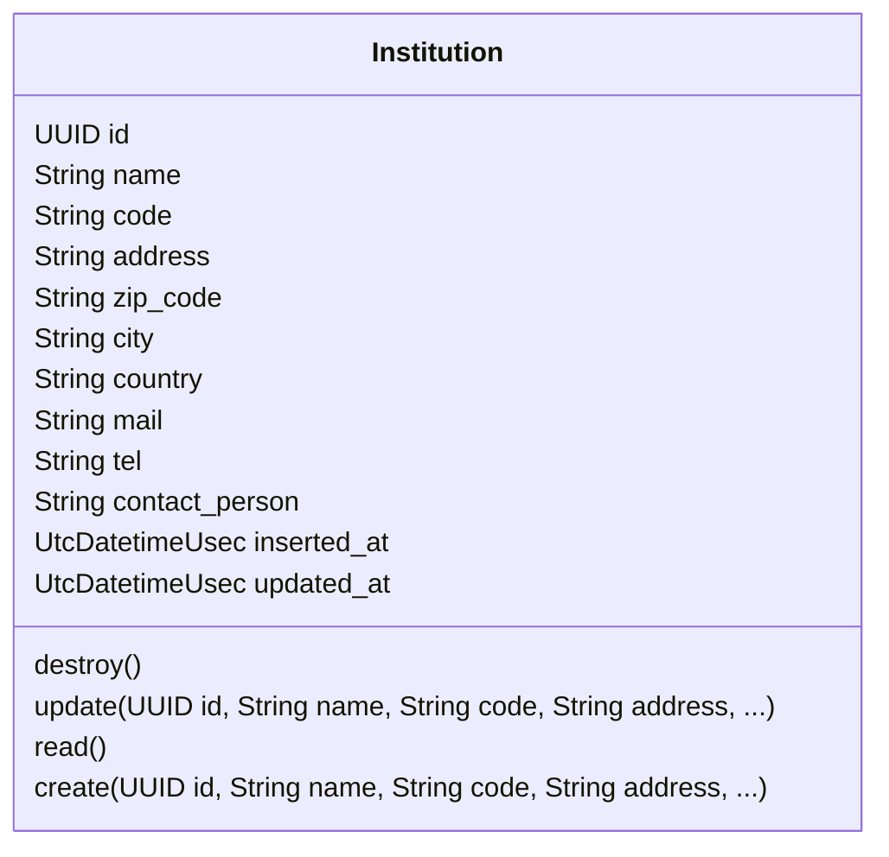
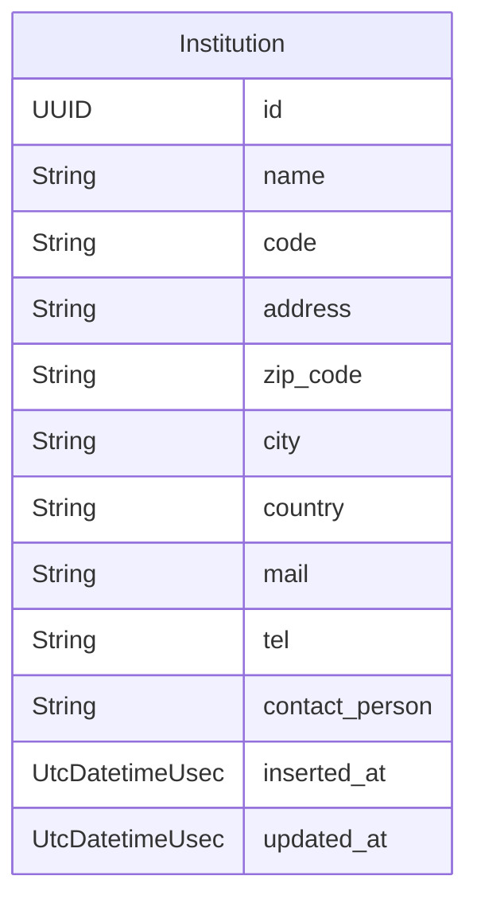
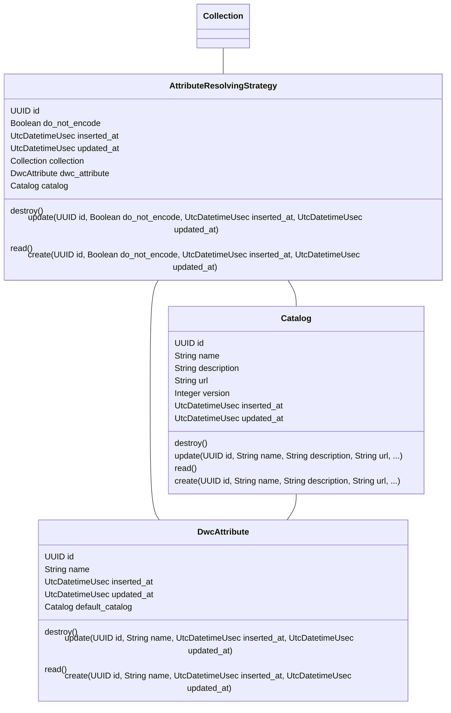
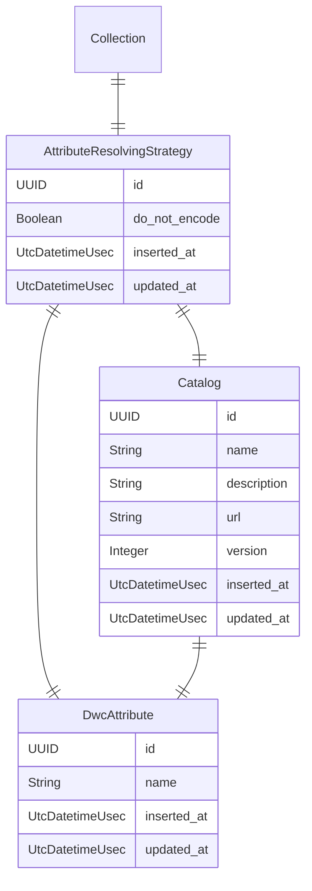
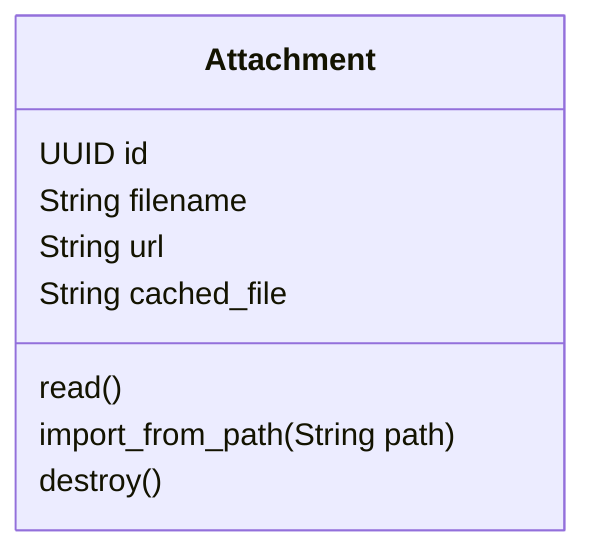
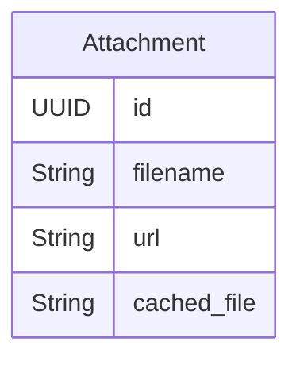

```mermaid
classDiagram
    class Collection {
        UUID id
        Integer items_to_digitize
        String owner
        String name
        String code
        String description
        Map mapping
        UtcDatetimeUsec inserted_at
        UtcDatetimeUsec updated_at
        Float digitizing_progress
        Integer records_count
        Institution institution
        Import[] imports
        Record[] records
        destroy()
        update(UUID id, Integer items_to_digitize, String owner, String name, ...)
        create(UUID id, Integer items_to_digitize, String owner, String name, ...)
        read(String sort)
    }
    class Import {
        UUID id
        Column[] columns
        UtcDatetimeUsec inserted_at
        UtcDatetimeUsec updated_at
        Term attachment_data
        Integer records_count
        Collection collection
        Attachment attachment
        Record[] records
        destroy()
        read()
        create(Collection collection, UUID id, Column[] columns, UtcDatetimeUsec inserted_at, ...)
        create_from_path(String path, Collection collection)
        update_mapping(Column[] columns)
        import_records()
    }
    class Record {
        Import import
        Record record
        update()
        destroy()
        read()
        create(Import import, Record record)
    }
    class Record {
        String mts_material_sample_type
        String mte_material_entity_id
        String occ_occurrence_remarks
        String occ_associated_occurrences
        String occ_sex
        String occ_recorded_by
        String loc_georeference_remarks
        Float loc_decimal_latitude
        Float loc_decimal_longitude
        String loc_state_province
        String loc_verbatim_locality
        String loc_locality
        String loc_country
        String loc_continent
        String spp_life_stage
        String tax_specific_epithet
        String tax_infraspecific_epithet
        String tax_scientific_name_authorship
        String tax_scientific_name
        String tax_genus
        String tax_family
        String tax_order
        String rrp_relationship_of_resource_id
        String rrp_relationship_of_resource
        Date ref_relationship_established_date
        String ref_title
        String ref_source
        String ref_rights
        Date ref_date
        String ref_creator
        String ref_bibliographic_citation
        String idf_type_status
        String idf_identified_by
        Date idf_date_identified
        Integer eve_end_of_period_year
        Integer eve_end_of_period_month
        Integer eve_end_of_period_day
        Integer eve_year
        Integer eve_month
        Integer eve_day
        Date eve_event_date
        Date prs_date_of_birth
        String prs_last_name
        String prs_first_name
        String prs_contact_point
        UUID id
        Map import_data
        Map extra_data
        UtcDatetimeUsec inserted_at
        UtcDatetimeUsec updated_at
        Collection collection
        Import[] imports
        Image[] images
        Attachment[] image_attachments
        destroy()
        update(String mts_material_sample_type, String mte_material_entity_id, String occ_occurrence_remarks, String occ_associated_occurrences, ...)
        read(String sort)
        create(Collection collection, String mts_material_sample_type, String mte_material_entity_id, String occ_occurrence_remarks, ...)
        import(Import import, Map params, String mts_material_sample_type, String mte_material_entity_id, ...)
        bulk_import(Import import, Term rows)
    }
    class Image {
        UUID id
        Integer size
        UtcDatetimeUsec inserted_at
        UtcDatetimeUsec updated_at
        Attachment attachment
        Record record
        destroy()
        update(UUID id, Integer size, UtcDatetimeUsec inserted_at, UtcDatetimeUsec updated_at)
        read()
        create(UUID id, Integer size, UtcDatetimeUsec inserted_at, UtcDatetimeUsec updated_at)
    }

    Attachment -- Import
    Attachment -- Record
    Attachment -- Image
    Institution -- Collection
    Collection -- Import
    Collection -- Record
    Import -- Record
    Import -- Record
    Record -- Record
    Record -- Image
```

```mermaid
erDiagram
    Collection {
        UUID id
        Integer items_to_digitize
        String owner
        String name
        String code
        String description
        Map mapping
        UtcDatetimeUsec inserted_at
        UtcDatetimeUsec updated_at
        Float digitizing_progress
        Integer records_count
    }
    Import {
        UUID id
        ArrayOfColumn columns
        UtcDatetimeUsec inserted_at
        UtcDatetimeUsec updated_at
        Term attachment_data
        Integer records_count
    }
    Record {

    }
    Record {
        String mts_material_sample_type
        String mte_material_entity_id
        String occ_occurrence_remarks
        String occ_associated_occurrences
        String occ_sex
        String occ_recorded_by
        String loc_georeference_remarks
        Float loc_decimal_latitude
        Float loc_decimal_longitude
        String loc_state_province
        String loc_verbatim_locality
        String loc_locality
        String loc_country
        String loc_continent
        String spp_life_stage
        String tax_specific_epithet
        String tax_infraspecific_epithet
        String tax_scientific_name_authorship
        String tax_scientific_name
        String tax_genus
        String tax_family
        String tax_order
        String rrp_relationship_of_resource_id
        String rrp_relationship_of_resource
        Date ref_relationship_established_date
        String ref_title
        String ref_source
        String ref_rights
        Date ref_date
        String ref_creator
        String ref_bibliographic_citation
        String idf_type_status
        String idf_identified_by
        Date idf_date_identified
        Integer eve_end_of_period_year
        Integer eve_end_of_period_month
        Integer eve_end_of_period_day
        Integer eve_year
        Integer eve_month
        Integer eve_day
        Date eve_event_date
        Date prs_date_of_birth
        String prs_last_name
        String prs_first_name
        String prs_contact_point
        UUID id
        Map import_data
        Map extra_data
        UtcDatetimeUsec inserted_at
        UtcDatetimeUsec updated_at
    }
    Image {
        UUID id
        Integer size
        UtcDatetimeUsec inserted_at
        UtcDatetimeUsec updated_at
    }

    Attachment ||--|| Import : ""
    Attachment ||--|| Record : ""
    Attachment ||--|| Image : ""
    Institution ||--|| Collection : ""
    Collection ||--|| Import : ""
    Collection ||--|| Record : ""
    Import ||--|| Record : ""
    Import ||--|| Record : ""
    Record ||--|| Record : ""
    Record ||--|| Image : ""
```

# API Documentation

## API DataAggregator.Platform

### Class Diagram

### ER Diagram

### Resources

- [Institution](#institution)

### Institution

#### Attributes

| Name | Type | Description |
| ---- | ---- | ----------- |
| **id** | UUID |  |
| **name** | String |  |
| **code** | String | an iternationally valid code to identify the collection |
| **address** | String |  |
| **zip_code** | String |  |
| **city** | String |  |
| **country** | String |  |
| **mail** | String |  |
| **tel** | String |  |
| **contact_person** | String |  |
| **inserted_at** | UtcDatetimeUsec |  |
| **updated_at** | UtcDatetimeUsec |  |

#### Actions

| Name | Type | Input | Description |
| ---- | ---- | ----- | ----------- |
| **destroy** | _destroy_ | <ul></ul> |  |
| **update** | _update_ | <ul><li><b>id</b> <i>UUID</i> attribute</li><li><b>name</b> <i>String</i> attribute</li><li><b>code</b> <i>String</i> attribute</li><li><b>address</b> <i>String</i> attribute</li><li><b>zip_code</b> <i>String</i> attribute</li><li><b>city</b> <i>String</i> attribute</li><li><b>country</b> <i>String</i> attribute</li><li><b>mail</b> <i>String</i> attribute</li><li><b>tel</b> <i>String</i> attribute</li><li><b>contact_person</b> <i>String</i> attribute</li><li><b>inserted_at</b> <i>UtcDatetimeUsec</i> attribute</li><li><b>updated_at</b> <i>UtcDatetimeUsec</i> attribute</li></ul> |  |
| **read** | _read_ | <ul></ul> |  |
| **create** | _create_ | <ul><li><b>id</b> <i>UUID</i> attribute</li><li><b>name</b> <i>String</i> attribute</li><li><b>code</b> <i>String</i> attribute</li><li><b>address</b> <i>String</i> attribute</li><li><b>zip_code</b> <i>String</i> attribute</li><li><b>city</b> <i>String</i> attribute</li><li><b>country</b> <i>String</i> attribute</li><li><b>mail</b> <i>String</i> attribute</li><li><b>tel</b> <i>String</i> attribute</li><li><b>contact_person</b> <i>String</i> attribute</li><li><b>inserted_at</b> <i>UtcDatetimeUsec</i> attribute</li><li><b>updated_at</b> <i>UtcDatetimeUsec</i> attribute</li></ul> |  |

## API DataAggregator.Records

### Class Diagram

### ER Diagram

### Resources

- [Collection](#collection)
- [Import](#import)
- [Record](#record)
- [Record](#record)
- [Image](#image)

### Collection

#### Attributes

| Name | Type | Description |
| ---- | ---- | ----------- |
| **id** | UUID |  |
| **items_to_digitize** | Integer |  |
| **owner** | String |  |
| **name** | String |  |
| **code** | String | an iternationally valid code to identify the collection |
| **description** | String |  |
| **mapping** | Map |  |
| **inserted_at** | UtcDatetimeUsec |  |
| **updated_at** | UtcDatetimeUsec |  |
| **institution_id** | UUID |  |

#### Actions

| Name | Type | Input | Description |
| ---- | ---- | ----- | ----------- |
| **destroy** | _destroy_ | <ul></ul> |  |
| **update** | _update_ | <ul><li><b>id</b> <i>UUID</i> attribute</li><li><b>items_to_digitize</b> <i>Integer</i> attribute</li><li><b>owner</b> <i>String</i> attribute</li><li><b>name</b> <i>String</i> attribute</li><li><b>code</b> <i>String</i> attribute</li><li><b>description</b> <i>String</i> attribute</li><li><b>mapping</b> <i>Map</i> attribute</li><li><b>inserted_at</b> <i>UtcDatetimeUsec</i> attribute</li><li><b>updated_at</b> <i>UtcDatetimeUsec</i> attribute</li></ul> |  |
| **create** | _create_ | <ul><li><b>id</b> <i>UUID</i> attribute</li><li><b>items_to_digitize</b> <i>Integer</i> attribute</li><li><b>owner</b> <i>String</i> attribute</li><li><b>name</b> <i>String</i> attribute</li><li><b>code</b> <i>String</i> attribute</li><li><b>description</b> <i>String</i> attribute</li><li><b>mapping</b> <i>Map</i> attribute</li><li><b>inserted_at</b> <i>UtcDatetimeUsec</i> attribute</li><li><b>updated_at</b> <i>UtcDatetimeUsec</i> attribute</li></ul> |  |
| **read** | _read_ | <ul><li><b>sort</b> <i>String</i> </li></ul> |  |

### Import

#### Attributes

| Name | Type | Description |
| ---- | ---- | ----------- |
| **id** | UUID |  |
| **columns** | Column[] |  |
| **inserted_at** | UtcDatetimeUsec |  |
| **updated_at** | UtcDatetimeUsec |  |
| **collection_id** | UUID |  |
| **attachment_id** | UUID |  |

#### Actions

| Name | Type | Input | Description |
| ---- | ---- | ----- | ----------- |
| **destroy** | _destroy_ | <ul></ul> |  |
| **read** | _read_ | <ul></ul> |  |
| **create** | _create_ | <ul><li><b>collection</b> <i>Collection</i> </li><li><b>id</b> <i>UUID</i> attribute</li><li><b>columns</b> <i>Column[]</i> attribute</li><li><b>inserted_at</b> <i>UtcDatetimeUsec</i> attribute</li><li><b>updated_at</b> <i>UtcDatetimeUsec</i> attribute</li></ul> |  |
| **create_from_path** | _create_ | <ul><li><b>path</b> <i>String</i> </li><li><b>collection</b> <i>Collection</i> </li></ul> |  |
| **update_mapping** | _update_ | <ul><li><b>columns</b> <i>Column[]</i> attribute</li></ul> |  |
| **import_records** | _update_ | <ul></ul> |  |

### Record

#### Attributes

| Name | Type | Description |
| ---- | ---- | ----------- |
| **import_id** | UUID |  |
| **record_id** | UUID |  |

#### Actions

| Name | Type | Input | Description |
| ---- | ---- | ----- | ----------- |
| **update** | _update_ | <ul></ul> |  |
| **destroy** | _destroy_ | <ul></ul> |  |
| **read** | _read_ | <ul></ul> |  |
| **create** | _create_ | <ul><li><b>import</b> <i>Import</i> </li><li><b>record</b> <i>Record</i> </li></ul> |  |

### Record

#### Attributes

| Name | Type | Description |
| ---- | ---- | ----------- |
| **mts_material_sample_type** | String |  |
| **mte_material_entity_id** | String |  |
| **occ_occurrence_remarks** | String |  |
| **occ_associated_occurrences** | String |  |
| **occ_sex** | String |  |
| **occ_recorded_by** | String |  |
| **loc_georeference_remarks** | String |  |
| **loc_decimal_latitude** | Float |  |
| **loc_decimal_longitude** | Float |  |
| **loc_state_province** | String |  |
| **loc_verbatim_locality** | String |  |
| **loc_locality** | String |  |
| **loc_country** | String |  |
| **loc_continent** | String |  |
| **spp_life_stage** | String |  |
| **tax_specific_epithet** | String |  |
| **tax_infraspecific_epithet** | String |  |
| **tax_scientific_name_authorship** | String |  |
| **tax_scientific_name** | String |  |
| **tax_genus** | String |  |
| **tax_family** | String |  |
| **tax_order** | String |  |
| **rrp_relationship_of_resource_id** | String |  |
| **rrp_relationship_of_resource** | String |  |
| **ref_relationship_established_date** | Date |  |
| **ref_title** | String |  |
| **ref_source** | String |  |
| **ref_rights** | String |  |
| **ref_date** | Date |  |
| **ref_creator** | String |  |
| **ref_bibliographic_citation** | String |  |
| **idf_type_status** | String |  |
| **idf_identified_by** | String |  |
| **idf_date_identified** | Date |  |
| **eve_end_of_period_year** | Integer |  |
| **eve_end_of_period_month** | Integer |  |
| **eve_end_of_period_day** | Integer |  |
| **eve_year** | Integer |  |
| **eve_month** | Integer |  |
| **eve_day** | Integer |  |
| **eve_event_date** | Date |  |
| **prs_date_of_birth** | Date |  |
| **prs_last_name** | String |  |
| **prs_first_name** | String |  |
| **prs_contact_point** | String | TODO: Add attribute descriptions |
| **id** | UUID |  |
| **import_data** | Map |  |
| **extra_data** | Map |  |
| **inserted_at** | UtcDatetimeUsec |  |
| **updated_at** | UtcDatetimeUsec |  |
| **collection_id** | UUID |  |

#### Actions

| Name | Type | Input | Description |
| ---- | ---- | ----- | ----------- |
| **destroy** | _destroy_ | <ul></ul> |  |
| **update** | _update_ | <ul><li><b>mts_material_sample_type</b> <i>String</i> attribute</li><li><b>mte_material_entity_id</b> <i>String</i> attribute</li><li><b>occ_occurrence_remarks</b> <i>String</i> attribute</li><li><b>occ_associated_occurrences</b> <i>String</i> attribute</li><li><b>occ_sex</b> <i>String</i> attribute</li><li><b>occ_recorded_by</b> <i>String</i> attribute</li><li><b>loc_georeference_remarks</b> <i>String</i> attribute</li><li><b>loc_decimal_latitude</b> <i>Float</i> attribute</li><li><b>loc_decimal_longitude</b> <i>Float</i> attribute</li><li><b>loc_state_province</b> <i>String</i> attribute</li><li><b>loc_verbatim_locality</b> <i>String</i> attribute</li><li><b>loc_locality</b> <i>String</i> attribute</li><li><b>loc_country</b> <i>String</i> attribute</li><li><b>loc_continent</b> <i>String</i> attribute</li><li><b>spp_life_stage</b> <i>String</i> attribute</li><li><b>tax_specific_epithet</b> <i>String</i> attribute</li><li><b>tax_infraspecific_epithet</b> <i>String</i> attribute</li><li><b>tax_scientific_name_authorship</b> <i>String</i> attribute</li><li><b>tax_scientific_name</b> <i>String</i> attribute</li><li><b>tax_genus</b> <i>String</i> attribute</li><li><b>tax_family</b> <i>String</i> attribute</li><li><b>tax_order</b> <i>String</i> attribute</li><li><b>rrp_relationship_of_resource_id</b> <i>String</i> attribute</li><li><b>rrp_relationship_of_resource</b> <i>String</i> attribute</li><li><b>ref_relationship_established_date</b> <i>Date</i> attribute</li><li><b>ref_title</b> <i>String</i> attribute</li><li><b>ref_source</b> <i>String</i> attribute</li><li><b>ref_rights</b> <i>String</i> attribute</li><li><b>ref_date</b> <i>Date</i> attribute</li><li><b>ref_creator</b> <i>String</i> attribute</li><li><b>ref_bibliographic_citation</b> <i>String</i> attribute</li><li><b>idf_type_status</b> <i>String</i> attribute</li><li><b>idf_identified_by</b> <i>String</i> attribute</li><li><b>idf_date_identified</b> <i>Date</i> attribute</li><li><b>eve_end_of_period_year</b> <i>Integer</i> attribute</li><li><b>eve_end_of_period_month</b> <i>Integer</i> attribute</li><li><b>eve_end_of_period_day</b> <i>Integer</i> attribute</li><li><b>eve_year</b> <i>Integer</i> attribute</li><li><b>eve_month</b> <i>Integer</i> attribute</li><li><b>eve_day</b> <i>Integer</i> attribute</li><li><b>eve_event_date</b> <i>Date</i> attribute</li><li><b>prs_date_of_birth</b> <i>Date</i> attribute</li><li><b>prs_last_name</b> <i>String</i> attribute</li><li><b>prs_first_name</b> <i>String</i> attribute</li><li><b>prs_contact_point</b> <i>String</i> attribute</li><li><b>id</b> <i>UUID</i> attribute</li><li><b>import_data</b> <i>Map</i> attribute</li><li><b>extra_data</b> <i>Map</i> attribute</li><li><b>inserted_at</b> <i>UtcDatetimeUsec</i> attribute</li><li><b>updated_at</b> <i>UtcDatetimeUsec</i> attribute</li></ul> |  |
| **read** | _read_ | <ul><li><b>sort</b> <i>String</i> </li></ul> |  |
| **create** | _create_ | <ul><li><b>collection</b> <i>Collection</i> </li><li><b>mts_material_sample_type</b> <i>String</i> attribute</li><li><b>mte_material_entity_id</b> <i>String</i> attribute</li><li><b>occ_occurrence_remarks</b> <i>String</i> attribute</li><li><b>occ_associated_occurrences</b> <i>String</i> attribute</li><li><b>occ_sex</b> <i>String</i> attribute</li><li><b>occ_recorded_by</b> <i>String</i> attribute</li><li><b>loc_georeference_remarks</b> <i>String</i> attribute</li><li><b>loc_decimal_latitude</b> <i>Float</i> attribute</li><li><b>loc_decimal_longitude</b> <i>Float</i> attribute</li><li><b>loc_state_province</b> <i>String</i> attribute</li><li><b>loc_verbatim_locality</b> <i>String</i> attribute</li><li><b>loc_locality</b> <i>String</i> attribute</li><li><b>loc_country</b> <i>String</i> attribute</li><li><b>loc_continent</b> <i>String</i> attribute</li><li><b>spp_life_stage</b> <i>String</i> attribute</li><li><b>tax_specific_epithet</b> <i>String</i> attribute</li><li><b>tax_infraspecific_epithet</b> <i>String</i> attribute</li><li><b>tax_scientific_name_authorship</b> <i>String</i> attribute</li><li><b>tax_scientific_name</b> <i>String</i> attribute</li><li><b>tax_genus</b> <i>String</i> attribute</li><li><b>tax_family</b> <i>String</i> attribute</li><li><b>tax_order</b> <i>String</i> attribute</li><li><b>rrp_relationship_of_resource_id</b> <i>String</i> attribute</li><li><b>rrp_relationship_of_resource</b> <i>String</i> attribute</li><li><b>ref_relationship_established_date</b> <i>Date</i> attribute</li><li><b>ref_title</b> <i>String</i> attribute</li><li><b>ref_source</b> <i>String</i> attribute</li><li><b>ref_rights</b> <i>String</i> attribute</li><li><b>ref_date</b> <i>Date</i> attribute</li><li><b>ref_creator</b> <i>String</i> attribute</li><li><b>ref_bibliographic_citation</b> <i>String</i> attribute</li><li><b>idf_type_status</b> <i>String</i> attribute</li><li><b>idf_identified_by</b> <i>String</i> attribute</li><li><b>idf_date_identified</b> <i>Date</i> attribute</li><li><b>eve_end_of_period_year</b> <i>Integer</i> attribute</li><li><b>eve_end_of_period_month</b> <i>Integer</i> attribute</li><li><b>eve_end_of_period_day</b> <i>Integer</i> attribute</li><li><b>eve_year</b> <i>Integer</i> attribute</li><li><b>eve_month</b> <i>Integer</i> attribute</li><li><b>eve_day</b> <i>Integer</i> attribute</li><li><b>eve_event_date</b> <i>Date</i> attribute</li><li><b>prs_date_of_birth</b> <i>Date</i> attribute</li><li><b>prs_last_name</b> <i>String</i> attribute</li><li><b>prs_first_name</b> <i>String</i> attribute</li><li><b>prs_contact_point</b> <i>String</i> attribute</li><li><b>id</b> <i>UUID</i> attribute</li><li><b>import_data</b> <i>Map</i> attribute</li><li><b>extra_data</b> <i>Map</i> attribute</li><li><b>inserted_at</b> <i>UtcDatetimeUsec</i> attribute</li><li><b>updated_at</b> <i>UtcDatetimeUsec</i> attribute</li></ul> |  |
| **import** | _create_ | <ul><li><b>import</b> <i>Import</i> </li><li><b>params</b> <i>Map</i> </li><li><b>mts_material_sample_type</b> <i>String</i> attribute</li><li><b>mte_material_entity_id</b> <i>String</i> attribute</li><li><b>occ_occurrence_remarks</b> <i>String</i> attribute</li><li><b>occ_associated_occurrences</b> <i>String</i> attribute</li><li><b>occ_sex</b> <i>String</i> attribute</li><li><b>occ_recorded_by</b> <i>String</i> attribute</li><li><b>loc_georeference_remarks</b> <i>String</i> attribute</li><li><b>loc_decimal_latitude</b> <i>Float</i> attribute</li><li><b>loc_decimal_longitude</b> <i>Float</i> attribute</li><li><b>loc_state_province</b> <i>String</i> attribute</li><li><b>loc_verbatim_locality</b> <i>String</i> attribute</li><li><b>loc_locality</b> <i>String</i> attribute</li><li><b>loc_country</b> <i>String</i> attribute</li><li><b>loc_continent</b> <i>String</i> attribute</li><li><b>spp_life_stage</b> <i>String</i> attribute</li><li><b>tax_specific_epithet</b> <i>String</i> attribute</li><li><b>tax_infraspecific_epithet</b> <i>String</i> attribute</li><li><b>tax_scientific_name_authorship</b> <i>String</i> attribute</li><li><b>tax_scientific_name</b> <i>String</i> attribute</li><li><b>tax_genus</b> <i>String</i> attribute</li><li><b>tax_family</b> <i>String</i> attribute</li><li><b>tax_order</b> <i>String</i> attribute</li><li><b>rrp_relationship_of_resource_id</b> <i>String</i> attribute</li><li><b>rrp_relationship_of_resource</b> <i>String</i> attribute</li><li><b>ref_relationship_established_date</b> <i>Date</i> attribute</li><li><b>ref_title</b> <i>String</i> attribute</li><li><b>ref_source</b> <i>String</i> attribute</li><li><b>ref_rights</b> <i>String</i> attribute</li><li><b>ref_date</b> <i>Date</i> attribute</li><li><b>ref_creator</b> <i>String</i> attribute</li><li><b>ref_bibliographic_citation</b> <i>String</i> attribute</li><li><b>idf_type_status</b> <i>String</i> attribute</li><li><b>idf_identified_by</b> <i>String</i> attribute</li><li><b>idf_date_identified</b> <i>Date</i> attribute</li><li><b>eve_end_of_period_year</b> <i>Integer</i> attribute</li><li><b>eve_end_of_period_month</b> <i>Integer</i> attribute</li><li><b>eve_end_of_period_day</b> <i>Integer</i> attribute</li><li><b>eve_year</b> <i>Integer</i> attribute</li><li><b>eve_month</b> <i>Integer</i> attribute</li><li><b>eve_day</b> <i>Integer</i> attribute</li><li><b>eve_event_date</b> <i>Date</i> attribute</li><li><b>prs_date_of_birth</b> <i>Date</i> attribute</li><li><b>prs_last_name</b> <i>String</i> attribute</li><li><b>prs_first_name</b> <i>String</i> attribute</li><li><b>prs_contact_point</b> <i>String</i> attribute</li><li><b>id</b> <i>UUID</i> attribute</li><li><b>import_data</b> <i>Map</i> attribute</li><li><b>extra_data</b> <i>Map</i> attribute</li><li><b>inserted_at</b> <i>UtcDatetimeUsec</i> attribute</li><li><b>updated_at</b> <i>UtcDatetimeUsec</i> attribute</li></ul> | Creates or updates a `Record` from the given `params`.

The record is associated with the give `DataAggregator.Records.Import` and
its `DataAggregator.Records.Collection`.
 |
| **bulk_import** | _action_ | <ul><li><b>import</b> <i>Import</i> </li><li><b>rows</b> <i>Term</i> </li></ul> | Imports multiple records using `DataAggregator.Records.bulk_create/3`.

The `rows` can be any enumberable, where each item which will be used as `params` for
the `DataAggregator.Records.Record.import/2` action.
 |

### Image

#### Attributes

| Name | Type | Description |
| ---- | ---- | ----------- |
| **id** | UUID |  |
| **size** | Integer |  |
| **inserted_at** | UtcDatetimeUsec |  |
| **updated_at** | UtcDatetimeUsec |  |
| **attachment_id** | UUID |  |
| **record_id** | UUID |  |

#### Actions

| Name | Type | Input | Description |
| ---- | ---- | ----- | ----------- |
| **destroy** | _destroy_ | <ul></ul> |  |
| **update** | _update_ | <ul><li><b>id</b> <i>UUID</i> attribute</li><li><b>size</b> <i>Integer</i> attribute</li><li><b>inserted_at</b> <i>UtcDatetimeUsec</i> attribute</li><li><b>updated_at</b> <i>UtcDatetimeUsec</i> attribute</li></ul> |  |
| **read** | _read_ | <ul></ul> |  |
| **create** | _create_ | <ul><li><b>id</b> <i>UUID</i> attribute</li><li><b>size</b> <i>Integer</i> attribute</li><li><b>inserted_at</b> <i>UtcDatetimeUsec</i> attribute</li><li><b>updated_at</b> <i>UtcDatetimeUsec</i> attribute</li></ul> |  |

## API DataAggregator.Taxonomy

### Class Diagram

### ER Diagram

### Resources

- [DwcAttribute](#dwcattribute)
- [Catalog](#catalog)
- [AttributeResolvingStrategy](#attributeresolvingstrategy)

### DwcAttribute

#### Attributes

| Name | Type | Description |
| ---- | ---- | ----------- |
| **id** | UUID |  |
| **name** | String |  |
| **inserted_at** | UtcDatetimeUsec |  |
| **updated_at** | UtcDatetimeUsec |  |
| **default_catalog_id** | UUID |  |

#### Actions

| Name | Type | Input | Description |
| ---- | ---- | ----- | ----------- |
| **destroy** | _destroy_ | <ul></ul> |  |
| **update** | _update_ | <ul><li><b>id</b> <i>UUID</i> attribute</li><li><b>name</b> <i>String</i> attribute</li><li><b>inserted_at</b> <i>UtcDatetimeUsec</i> attribute</li><li><b>updated_at</b> <i>UtcDatetimeUsec</i> attribute</li></ul> |  |
| **read** | _read_ | <ul></ul> |  |
| **create** | _create_ | <ul><li><b>id</b> <i>UUID</i> attribute</li><li><b>name</b> <i>String</i> attribute</li><li><b>inserted_at</b> <i>UtcDatetimeUsec</i> attribute</li><li><b>updated_at</b> <i>UtcDatetimeUsec</i> attribute</li></ul> |  |

### Catalog

#### Attributes

| Name | Type | Description |
| ---- | ---- | ----------- |
| **id** | UUID |  |
| **name** | String |  |
| **description** | String |  |
| **url** | String |  |
| **version** | Integer |  |
| **inserted_at** | UtcDatetimeUsec |  |
| **updated_at** | UtcDatetimeUsec |  |

#### Actions

| Name | Type | Input | Description |
| ---- | ---- | ----- | ----------- |
| **destroy** | _destroy_ | <ul></ul> |  |
| **update** | _update_ | <ul><li><b>id</b> <i>UUID</i> attribute</li><li><b>name</b> <i>String</i> attribute</li><li><b>description</b> <i>String</i> attribute</li><li><b>url</b> <i>String</i> attribute</li><li><b>version</b> <i>Integer</i> attribute</li><li><b>inserted_at</b> <i>UtcDatetimeUsec</i> attribute</li><li><b>updated_at</b> <i>UtcDatetimeUsec</i> attribute</li></ul> |  |
| **read** | _read_ | <ul></ul> |  |
| **create** | _create_ | <ul><li><b>id</b> <i>UUID</i> attribute</li><li><b>name</b> <i>String</i> attribute</li><li><b>description</b> <i>String</i> attribute</li><li><b>url</b> <i>String</i> attribute</li><li><b>version</b> <i>Integer</i> attribute</li><li><b>inserted_at</b> <i>UtcDatetimeUsec</i> attribute</li><li><b>updated_at</b> <i>UtcDatetimeUsec</i> attribute</li></ul> |  |

### AttributeResolvingStrategy

#### Attributes

| Name | Type | Description |
| ---- | ---- | ----------- |
| **id** | UUID |  |
| **do_not_encode** | Boolean |  |
| **inserted_at** | UtcDatetimeUsec |  |
| **updated_at** | UtcDatetimeUsec |  |
| **collection_id** | UUID |  |
| **dwc_attribute_id** | UUID |  |
| **catalog_id** | UUID |  |

#### Actions

| Name | Type | Input | Description |
| ---- | ---- | ----- | ----------- |
| **destroy** | _destroy_ | <ul></ul> |  |
| **update** | _update_ | <ul><li><b>id</b> <i>UUID</i> attribute</li><li><b>do_not_encode</b> <i>Boolean</i> attribute</li><li><b>inserted_at</b> <i>UtcDatetimeUsec</i> attribute</li><li><b>updated_at</b> <i>UtcDatetimeUsec</i> attribute</li></ul> |  |
| **read** | _read_ | <ul></ul> |  |
| **create** | _create_ | <ul><li><b>id</b> <i>UUID</i> attribute</li><li><b>do_not_encode</b> <i>Boolean</i> attribute</li><li><b>inserted_at</b> <i>UtcDatetimeUsec</i> attribute</li><li><b>updated_at</b> <i>UtcDatetimeUsec</i> attribute</li></ul> |  |

## API DataAggregator.Files

### Class Diagram

### ER Diagram

### Resources

- [Attachment](#attachment)

### Attachment

#### Attributes

| Name | Type | Description |
| ---- | ---- | ----------- |
| **id** | UUID |  |
| **filename** | String |  |
| **inserted_at** | UtcDatetimeUsec |  |
| **updated_at** | UtcDatetimeUsec |  |

#### Actions

| Name | Type | Input | Description |
| ---- | ---- | ----- | ----------- |
| **read** | _read_ | <ul></ul> |  |
| **import_from_path** | _create_ | <ul><li><b>path</b> <i>String</i> </li></ul> |  |
| **destroy** | _destroy_ | <ul></ul> |  |

