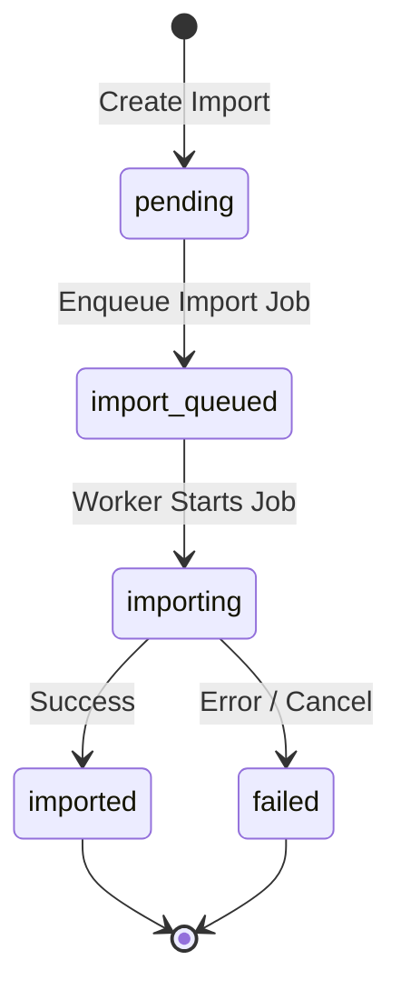
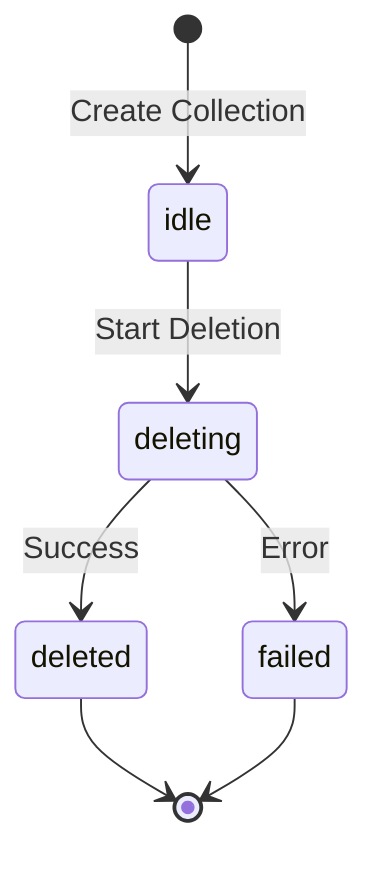

# Summary

The Data Aggregator is a web application that is used to integrate biodiversity data into a Darwin Core compatible data format. The application is built using the Phoenix, and Ash Frameworks which are development utilities written in Elixir. The application is designed to be modular and extensible, allowing for the addition of new features and functionality as needed. It is a project of the Swiss Academy of Sciences (SCNAT) and is developed by Zebbra.

If there are - in your opinion - parts missing or if you detect issues, please create an issue on [Github]("https://github.com/zebbra/data_aggregator") or consider contribute by submitting a [PR]("https://github.com/zebbra/data_aggregator")

We will describe the High- to Mid-Level concepts of the application. The goal is to give you a good understanding of the applications architecture and the main modules that cover the processes needed for import, enrichment, and publication of biodiversity data.

Throughout the documentation, we will use the `for_coders:` tag to indicate sections that are more technical in nature and contain hints to code sections where one can find corresponding elixir code modules. These sections are intended for developers and technical people who are interested in the inner workings of the application.

`for_coders:` checkout the [Development]("./development.md") section for more detailed information on how to work with the application as a developer and setup your local development environment. if you're a devops person, you might want to check out the [Deployment]("./deployment.md") section as well.

Consider as well play around with some tutorials or getting-started guides of the [Ash Framework]("https://ash-hq.org/") and the [Phoenix Framework]("https://www.phoenixframework.org/") which are the core of the application.

- [Data Model](#data-model)
- [Core Modules](#core-modules)
- [System Features](#system-features)
- [Integration Points](#integration-points)
- [JSON Rest API](#json-rest-api)

# Data Model

The Data Aggregator uses a comprehensive data model that follows Darwin Core standards and includes additional fields for Swiss-specific requirements. The system's data structure is defined in detail in the [Entity Relationship Diagram](./erd.mmd), which shows all entities, their attributes, and relationships.

# Core Modules

This section details the main workflows and functionalities provided by the application.

**Note:** The term "Collection" is used throughout the codebase and resource definitions, but often corresponds to the concept of a "Dataset" from a user perspective.

## Collection Management (Datasets)

Collections (Datasets) are the top-level containers for managing biodiversity records through their lifecycle. Different information is stored on the collection item:

- **Metadata:** Metadata such as name, code, description, type but also information from external ressources like GrSciColl (`grscicoll_reference`, `grscicoll_institution_key`, etc.) and/or GBIF (`gbif_dataset_key`, `gbif_doi`).
- **Mapping:** The import mapping is also stored in the dataset.
- **State Management:** The state of a collection (dataset) is stored on the object (`:idle`, `:mapping`, `:importing`, `:encoding`, `:exporting`, `:publishing`, `:validating`, `:deleting`).

## Import

### Description

The import module handles uploading tabular data files (e.g., CSV, TSV), mapping source columns to the system's data model, validating data, and creating/updating `Record` resources within a Collection (Dataset).

### Key Features

- Upload tabular data files (CSV, TSV).
- Guided column mapping UI with mandatory field highlighting.
- Option to reuse previous mappings for a Collection.
- Automatic column detection and row counting.
- File type and size validation.
- Background processing for validation and record creation/update (upsert).
- Real-time progress monitoring (status, row counts).
- Detailed error logging for failed imports.

### Process

1. **File Upload & Validation**

   - User uploads a tabular data file (CSV, TSV)
   - System performs initial validation:
     - File format check (must be CSV, TSV, TXT, ARROW, IPC, PARQUET, PQT)
     - File size validation (max 200MB)
     - Column header presence
     - Line separator compatibility (Unix-style `\n`)
     - Column separator validation (`,` or `;` for CSV, `\t` for TSV)
     - Minimum data requirements (at least one row, two columns)
     - UTF-8 character validation
   - File is stored in S3 storage with unique identifier
   - Initial import object is created in database with metadata

2. **Column Mapping**

   - User maps source columns to Darwin Core fields through UI
   - System validates field type compatibility:
     - String fields must map to string data
     - Date fields must map to date-compatible data
     - Numeric fields must map to numeric data
   - Mapping configuration is stored with import
   - System tracks mandatory field mappings
   - Option to reuse previous mappings for efficiency

3. **Background Processing**

   - Import job is enqueued via Oban worker (`DataAggregator.Records.Import.Workers.Importer`)
   - Records are processed in configurable batch sizes (default: 1000 records)
   - Progress is tracked and updated in real-time:
     - Row count validation
     - Record creation progress
     - Error accumulation
   - Errors are logged and can be reviewed in UI
   - Process can be monitored through collection state

4. **Record Creation**
   - Valid records are created/updated in database using upsert logic
   - Each record is linked to its collection
   - Initial state is set to `:imported`
   - Error log is generated for failed records
   - Collection state is updated to reflect import status

`for_coders:` The import process is handled by the `lib/data_aggregator/records/import` modules. Key components include:

- `Import.Changes.ImportRecords`: Handles the actual record creation
- `Import.Workers.Importer`: Manages background processing
- `Import.Calculations.AttachmentData`: Processes file data
- Configuration options in `config/runtime.exs` control batch sizes and timeouts

### State Machine (`Import` Resource)

The `Import` resource tracks the progress of a single import job.

- **`pending`**: Initial state after resource creation, before job enqueueing.
- **`import_queued`**: The `Importer` background job has been scheduled.
- **`importing`**: The `Importer` worker is actively validating rows and creating/updating records.
- **`imported`**: The import job completed successfully.
- **`failed`**: An error occurred during the import process or it was cancelled.



## Encoding

### Description

The encoding module standardizes and enriches raw imported `Record` data using a sequence of defined strategies (e.g., date conversion, geocoding, taxonomic lookups). Results are stored in a corresponding `EncodedRecord` resource, aligned with Darwin Core standards.

### Key Features

- Standardizes data formats (e.g., dates to ISO 8601).
- Enriches records with external/internal data (Taxonomy, Geocoordinates, IUCN status, Image URLs).
- Populates Darwin Core fields in `EncodedRecord`.
- Calculates MIDS (Minimum Information about a Digital Specimen) levels.
- Uses modular, extensible encoding strategies.
- Logs detailed results (success/failure/unchanged) per strategy per record via `RecordEncodingResult`.
- Executes asynchronously via the `Encoder` Oban worker.
- Creates/updates `EncodedRecord` using upsert logic.

### Encoding Strategies

The encoding process sequentially applies the following strategies, controlled by `DataAggregator.Taxonomy.Catalog.get_catalogs()` and dispatched via `DataAggregator.Records.Encoding.Strategy`:

1.  **`:col_taxonomy`**: Looks up taxonomic names against the GBIF Backbone Taxonomy. _Crucially, this first step also initializes/resets the `EncodedRecord` based on the source `Record` data before applying its specific logic._
2.  **`:swiss_species`**: Looks up taxonomic information in the integrated Swiss Species catalog.
3.  **`:geo_reverse`**: Performs reverse geocoding (coordinates to administrative levels like country, canton) using an external service (likely OpenCage).
4.  **`:geo_forward`**: Performs forward geocoding (place names to coordinates) using an external service (likely OpenCage).
5.  **`:iucn_redlist`**: Determines the IUCN Red List conservation status, likely querying GBIF.
6.  **`:relate_images`**: Associates URLs of linked `Image` attachments with the `EncodedRecord`.
7.  **`:convert_dates`**: Parses various date/time formats found in eventDate, dateIdentified, etc., into standardized formats.

### Process

1. **Initialization**

   - User triggers encoding for selected records through UI
   - Collection state is set to `:encoding`
   - Records are enqueued for processing via Oban
   - System validates collection state (must be `:idle`)
   - Encoding job is created and tracked

2. **Sequential Strategy Application**

   - Records are processed through each strategy in order:

     1. **CoL Taxonomy** (`:col_taxonomy`):

        - Initializes/resets EncodedRecord from source Record
        - Queries GBIF Backbone Taxonomy API
        - Updates taxonomic information
        - Minimum confidence level: 80%

     2. **Swiss Species** (`:swiss_species`):

        - Queries integrated Swiss Species catalog
        - Updates taxonomic information
        - Records registration status

     3. **Reverse Geocoding** (`:geo_reverse`):

        - Processes coordinates to administrative levels
        - Updates country, canton, municipality
        - Uses external geocoding service

     4. **Forward Geocoding** (`:geo_forward`):

        - Processes place names to coordinates
        - Updates coordinate information
        - Uses external geocoding service

     5. **IUCN Red List** (`:iucn_redlist`):

        - Queries GBIF for conservation status
        - Updates IUCN category information

     6. **Image Association** (`:relate_images`):

        - Links related image URLs
        - Updates image metadata

     7. **Date Standardization** (`:convert_dates`):
        - Parses various date formats
        - Converts to ISO 8601 standard
        - Updates event dates and identification dates

3. **Progress Tracking**

   - Each strategy execution is logged via `RecordEncodingResult`
   - Results include:
     - Success/failure status
     - Input values used
     - Output values generated
     - Error messages if applicable
   - Collection state is monitored through polling
   - Encoding status is updated per record
   - Real-time progress updates in UI

4. **Completion**
   - Records are marked as `:encoded` or `:failed`
   - Collection returns to `:idle` state
   - Results can be reviewed in UI
   - Error logs are available for failed records
   - Encoding statistics are updated

`for_coders:` The encoding process is handled by the `lib/data_aggregator/records/encoding` modules. Key components include:

- `Strategy`: Main module for strategy selection and execution
- `Workers.Encoder`: Manages background processing
- Individual strategy modules in `strategies/` directory
- Configuration in `config/runtime.exs` for timeouts and batch sizes
- State management through `Record` and `Collection` resources

### State Machine (`Record` Resource - Encoding Status)

The encoding status is reflected in the `Record` resource's state machine.

- **`imported`**: Initial state after successful import, before encoding.
- **`queued`**: Encoding job has been enqueued for this record.
- **`encoding`**: The `Encoder` worker is actively processing the record.
- **`encoded`**: All encoding strategies completed successfully.
- **`failed`**: An error occurred during encoding.

```mermaid
stateDiagram-v2
    imported --> queued: Enqueue Encoding Job
    queued --> encoding: Worker Starts Job
    encoding --> encoded: Success
    encoding --> failed: Error / Cancel
    encoded --> [*]  % Or back to imported if re-encoding needed? Needs clarification
    failed --> [*] % Or back to imported for retry? Needs clarification
    [*] --> imported : Record Created (via Import)
```

## Export

### Description

The export module allows users to generate downloadable files (e.g., CSV, TSV) of selected record data from a Collection. Users can filter records, choose between raw imported or standardized encoded data, and select the source for output file headers.

### Key Features

- Generates downloadable data files (likely CSV/TSV).
- Allows filtering of records to be exported using current UI filters (`records_query`).
- Option to export "Raw" (original imported) or "Encoded" (standardized) data.
- Choice of header source: "Dataset Mapping" (import mapping) or "DWC Attributes" (standard Darwin Core).
- Background processing via the `Exporter` Oban worker.
- Real-time progress monitoring and status updates.
- Downloadable export file upon completion.

### Process

1. **Export Configuration**

   - User selects records to export (using UI filters)
   - User chooses data type (Raw/Encoded)
   - User selects header source (Dataset Mapping/DWC Attributes)
   - System validates configuration
   - Export job is created

2. **Background Processing**

   - Export job is enqueued via Oban worker
   - Records are processed in batches
   - Progress is tracked in real-time
   - Export file is generated
   - File is stored in S3

3. **Completion**
   - Export file is made available for download
   - Export status is updated
   - User is notified of completion

`for_coders:` The export process is handled by the `lib/data_aggregator/records/export` modules. Key components include:

- `Export.Workers.Exporter`: Manages background processing
- `Export.Calculations.ExportData`: Processes record data
- Configuration in `config/runtime.exs` for batch sizes and timeouts

## Publication

### Description

The publication module handles the process of publishing data to GBIF through the SwissNatColl portal. It generates a Darwin Core Archive (DwC-A) and submits it to GBIF's registration API.

### Key Features

- Generates Darwin Core Archive (DwC-A) from encoded records
- Submits data to GBIF through SwissNatColl portal
- Tracks publication status and metadata
- Handles GBIF dataset registration
- Manages DOI assignment
- Provides publication history

### Process

1. **Pre-publication Checks**

   - Validates record requirements
   - Checks for mandatory fields
   - Verifies data quality
   - Ensures proper encoding

2. **Darwin Core Archive Generation**

   - Creates DwC-A structure
   - Includes metadata.xml
   - Generates occurrence.txt
   - Packages files into archive
   - Stores archive in S3

3. **GBIF Submission**

   - Registers dataset with GBIF
   - Submits DwC-A
   - Tracks submission status
   - Handles response

4. **Completion**
   - Updates collection state
   - Stores GBIF metadata
   - Records DOI
   - Updates publication history

`for_coders:` The publication process is handled by the `lib/data_aggregator/records/publication` modules. Key components include:

- `Publication.Workers.Publisher`: Manages background processing
- `DarwinCore.Publication`: Handles DwC-A generation
- Configuration in `config/runtime.exs` for GBIF API settings

## Validation

### Description

The validation module manages the process of having data validated by the InfoSpecies Switzerland team before publication to GBIF. It handles the creation of validation requests, notification of validators, and processing of validation responses.

### Key Features

- Creates validation requests for selected records
- Generates Darwin Core Archive for validation
- Notifies InfoSpecies team
- Processes validation responses
- Updates record validation status
- Maintains validation history

### Process

1. **Validation Request Initiation**

   - User selects records for validation
   - System identifies target InfoSpecies data center
   - Validation request is created
   - Collection state is set to `:validating`

2. **Data Package Preparation**

   - Selected records are extracted
   - Darwin Core Archive is generated
   - Package is stored in S3
   - Download link is generated

3. **Notification**

   - Email notification is generated
   - Sent to InfoSpecies center
   - Includes download link
   - Contains validation request details

4. **Response Handling**
   - API endpoint for validation responses
   - Processes validation results
   - Updates records based on validation
   - Notifies users of completion

`for_coders:` The validation process is handled by the `lib/data_aggregator/records/validation` modules. Key components include:

- `Validation.Workers.ValidationRequestHandler`: Manages validation requests
- `Validation.Changes.CreateDwCA`: Generates validation packages
- Configuration in `config/runtime.exs` for validation settings

## Image Upload

### Description

The image upload module manages the process of uploading and associating images with records. It handles file validation, storage, and linking to records based on catalog numbers and identifiers.

### Key Features

- Bulk image upload support
- Automatic record association
- Image metadata extraction
- S3 storage integration
- Progress tracking
- Error handling and reporting

### Process

1. **Image Upload Initiation**

   - User selects images for upload
   - System validates:
     - File types (JPEG, PNG, etc.)
     - File sizes
     - Image dimensions
     - Metadata presence
   - Upload session is created

2. **Background Processing**

   - Images are processed in batches
   - Files are stored in S3
   - Metadata is extracted
   - Progress is tracked

3. **Record Association**

   - Images are linked to records
   - Association metadata is stored
   - Links are verified
   - Statistics are updated

4. **Completion**
   - Upload statistics are updated
   - Success/error summary is generated
   - User is notified of completion

`for_coders:` The image upload process is handled by the `lib/data_aggregator/records/image` modules. Key components include:

- `Image.Workers.ImageProcessor`: Manages background processing
- `Image.Changes.ProcessImage`: Handles image processing
- Configuration in `config/runtime.exs` for upload settings

## Deletion

### Description

The deletion module manages the process of removing collections, records, and their associated data from the system. This is a complex process that involves handling cascading deletions, cleaning up external storage, and maintaining data integrity.

### Key Features

- Cascading deletion of all related resources
- Cleanup of external storage (S3)
- Partition management for database tables
- State tracking during deletion
- Background processing for large deletions
- Audit trail preservation

### Process

1. **Collection Deletion**

   - Sets collection state to `:deleting`
   - Triggers database partition cleanup
   - Cascades deletion to all related resources:
     - Records and their versions
     - Encoded records and their versions
     - Validated records
     - Published records
     - Import/Export files
     - Validation requests/responses
     - Image uploads and attachments
   - Cleans up S3 storage:
     - Deletes all associated media files
     - Removes import/export files
     - Cleans up validation packages
     - Removes image attachments

2. **Record Deletion**

   - Cascades to related resources:
     - Encoded records
     - Validated records
     - Published records
     - Image attachments
   - Updates collection record count
   - Removes from GBIF on next publication
   - Preserves audit trail

3. **Media Deletion**
   - Handles cleanup of S3 storage
   - Removes file attachments
   - Updates record associations
   - Maintains referential integrity

`for_coders:` The deletion process is implemented across several modules:

- `Collection.Changes.DeleteAllMedia`: Handles S3 cleanup
- `Collection.Changes.SetDeleting`: Manages deletion state
- Database triggers for partition management
- Cascading foreign key constraints
- Configuration in `config/runtime.exs`

### State Machine (Collection Resource - Deletion Status)

The deletion status is reflected in the Collection resource's state machine.

- **`idle`**: Normal state
- **`deleting`**: Collection is being deleted
- **`deleted`**: Collection has been removed



# System Features

## User Management and Authentication

The system utilizes the `AshAuthentication` extension for user management and authentication, combined with Ash's built-in policy authorization framework for permissions.

### Authentication

- Password-based strategy with email
- Case-insensitive email identity
- Sign-in token management
- Terms acceptance tracking
- Session handling

### Roles

Authorization is primarily based on roles assigned to users. Roles are stored as an array of strings in the `User.roles` attribute:

- **`admin`:** Has broad access across the system (often bypassing specific policy checks).
- **`collection_administrator`:** Manages users and resources (like Collections, Publications, etc.) within a specific institution. Their permissions are scoped by the `institution_id` associated with their user account.
- **`data_digitizer`:** Has read access to resources within their associated institution.

### Permissions and Policies

- **Framework:** Permissions are enforced using `Ash.Policy.Authorizer` defined on resources.
- **Checks:** Policies use built-in Ash checks (e.g., `action_type/1`) and custom checks defined in `lib/data_aggregator/checks/`:
  - `with_role(role_or_roles)`: Checks if the current user (actor) has at least one of the specified roles.
  - `it_is_myself()`: Checks if the actor is the same as the user resource being accessed.
  - `it_is_admin()`: Checks if the user resource being accessed has the `admin` role.
  - `relates_to_institution_check(foreign_key)`: Checks if the actor and the resource being acted upon belong to the same institution (via `institution_id`).
  - `relates_to_institution_filter(foreign_key)`: Applies a filter to queries to restrict results to the actor's institution.

`for_coders:` The user management system is implemented using:

- `AshAuthentication` for authentication
- `Ash.Policy.Authorizer` for permissions
- Custom checks in `lib/data_aggregator/checks/`
- Configuration in `config/runtime.exs`

## Additional Features

### Process Cancellation

Most long-running background processes (Import, Export, Publication, Validation Request Send, Image Mapping) support cancellation.

- **Mechanism:** Each process resource (`Import`, `Export`, etc.) typically has a specific `cancel_` action (e.g., `cancel_import`, `cancel_export`).
- **Effect & Job Handling:**
  - Standard cancellation actions (`cancel_import`, etc.) primarily transition the state machine to `:failed` and set `finished_at`. They **do not** actively stop the running Oban job; the job may continue until completion, error, or timeout.
  - The admin-only `Collection.cancel_action` is more forceful. It finds the active process, calls its specific `cancel_` action, and also **actively signals Oban to kill** the associated running job(s) (`ash_cancel_all_jobs` helper in `CancelAction` change).
- **Outcome:** A cancelled job's corresponding resource is marked as `:failed`.

### Auditing and Versioning

The system provides an audit trail for changes made to core data resources using the `AshPaperTrail` extension.

- **Tracked Resources:** Versioning is enabled for `Record` and `EncodedRecord` resources.
- **Tracking Mode:** Only the _changes_ made during an update are stored, not the full record state for each version (`change_tracking_mode :changes_only`).
- **Recorded Information:** Each version typically stores:
  - The changes made to tracked attributes.
  - The action that triggered the change (`store_action_name? true`).
  - A reference to the user (actor) who performed the action (`belongs_to_actor :user`).
  - A reference back to the original record (`reference_source? true`).
  - Copies of certain key attributes for easier querying (e.g., `mte_catalog_number`, `tax_scientific_name` on `Record` versions).
- **Scope:**
  - For `Record`, versioning specifically tracks changes made via the `:update_publication_status` and `:update_validation_status` actions.
  - For `EncodedRecord`, versioning tracks updates but ignores create/destroy actions.
  - Certain attributes (like timestamps, internal state fields) are explicitly ignored.

### Search Functionality

Users can search for records within a Collection using PostgreSQL's full-text search capabilities, integrated via the `AshPagify.Tsearch` extension.

- **Target:** Full-text search operates on the data stored in the `EncodedRecord` resource (the standardized version of the record), specifically targeting its pre-calculated text search vector (`tsv`) column.
- **Mechanism:** Queries entered by the user are converted into PostgreSQL `ts_query` format and executed efficiently against the indexed `tsv` column.
- **Filtering:** In addition to full-text search, predefined filter scopes are available (via `AshPagify` configuration) to easily filter records based on their status, such as `:not_encoded`, `:not_published`, and `:not_validated`.

`for_coders:` Additional features are implemented using:

- `AshPaperTrail` for versioning
- `AshPagify.Tsearch` for search
- Custom cancellation actions
- Configuration in `config/runtime.exs`

# Integration Points

The Data Aggregator interacts with several external biodiversity informatics platforms and services:

## GBIF Integration

The Global Biodiversity Information Facility (GBIF) is the primary target for data publication and a source for taxonomic and institutional information.

- **Dataset Publication:** The core publication workflow generates Darwin Core Archives (DwC-A) and submits them to the GBIF registry endpoint associated with a Collection's registered `gbif_dataset_key`.
- **Dataset Registration:** Provides functionality (`Collection.register_at_gbif` action) to register the dataset entity with GBIF.
- **Taxonomic Resolution:** Uses the GBIF Backbone Taxonomy during the Encoding process (`:col_taxonomy` strategy) to standardize scientific names and classifications.
- **IUCN Status:** Queries GBIF during encoding (`:iucn_redlist` strategy) to enrich records with IUCN Red List conservation status.
- **GrSciColl Data Source:** Leverages GBIF's API to retrieve information about institutions and collections registered in the Global Registry of Scientific Collections (GrSciColl).
- **Publication Verification:** Includes a background job (`PublicationVerifier`) to periodically check via the GBIF API if records marked as published are actually discoverable on the GBIF portal.

## GrSciColl Integration

The Global Registry of Scientific Collections (GrSciColl) is used for institutional context.

- **Metadata Association:** Collections within the Data Aggregator are linked to GrSciColl entries by storing `grscicoll_reference` (for the collection) and associated `grscicoll_institution_key`, `_code`, and `_name`.
- **Metadata Retrieval:** Uses the GBIF API to fetch and populate institution details based on the provided GrSciColl identifiers during Collection creation.
- **Validation:** May include specific validation rules related to GrSciColl identifiers (`GrSciCollValidator`).

## InfoSpecies Data Centers Integration

The system facilitates an external data review process with Swiss InfoSpecies data centers.

- **Validation Workflow:** Manages sending selected record data (as DwC-A) to the appropriate InfoSpecies center for expert review.
- **Email Notification:** Sends an email with a download link for the DwC-A to the relevant center (contacts managed via `InfospeciesCenters` catalog).
- **Results Ingestion:** Processes a results file (provided back by the center via a URL) to update the `validation_status` of records and store corrected/validated data in `ValidatedRecord` resources.

`for_coders:` Integration points are implemented in:

- `lib/data_aggregator/gbif`
- `lib/data_aggregator/grscicoll`
- `lib/data_aggregator/infospecies`
- Configuration in `config/runtime.exs`

# JSON Rest API

The application provides a JSON Rest API to interact with the data. The API is built using the Ash Framework and provides a set of endpoints to access and manipulate the data. Read full Rest API documentation [here](./api/json_api.md).
