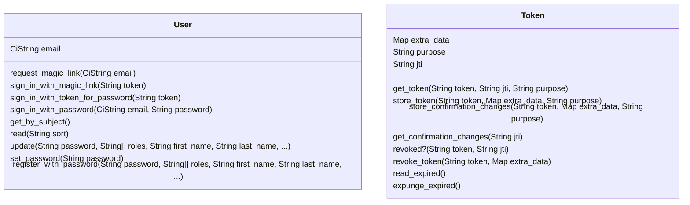

```mermaid
classDiagram
    class User {
        CiString email
        request_magic_link(CiString email)
        sign_in_with_magic_link(String token)
        sign_in_with_token_for_password(String token)
        sign_in_with_password(CiString email, String password)
        get_by_subject()
        read(String sort)
        update(String password, String[] roles, String first_name, String last_name, ...)
        set_password(String password)
        register_with_password(String password, String[] roles, String first_name, String last_name, ...)
    }
    class Token {
        Map extra_data
        String purpose
        String jti
        get_token(String token, String jti, String purpose)
        store_token(String token, Map extra_data, String purpose)
        store_confirmation_changes(String token, Map extra_data, String purpose)
        get_confirmation_changes(String jti)
        revoked?(String token, String jti)
        revoke_token(String token, Map extra_data)
        read_expired()
        expunge_expired()
    }


```
