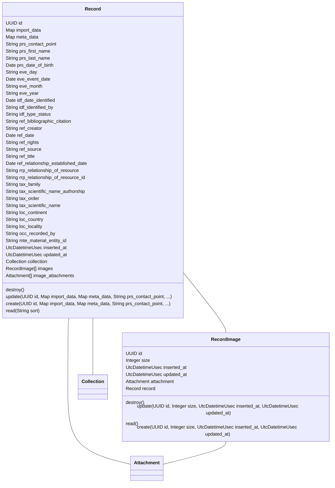

```mermaid
classDiagram
    class Record {
        UUID id
        Map import_data
        Map meta_data
        String prs_contact_point
        String prs_first_name
        String prs_last_name
        Date prs_date_of_birth
        String eve_day
        Date eve_event_date
        String eve_month
        String eve_year
        Date idf_date_identified
        String idf_identified_by
        String idf_type_status
        String ref_bibliographic_citation
        String ref_creator
        Date ref_date
        String ref_rights
        String ref_source
        String ref_title
        Date ref_relationship_established_date
        String rrp_relationship_of_resource
        String rrp_relationship_of_resource_id
        String tax_family
        String tax_scientific_name_authorship
        String tax_order
        String tax_scientific_name
        String loc_continent
        String loc_country
        String loc_locality
        String occ_recorded_by
        String mte_material_entity_id
        UtcDatetimeUsec inserted_at
        UtcDatetimeUsec updated_at
        Collection collection
        RecordImage[] images
        Attachment[] image_attachments
        destroy()
        update(UUID id, Map import_data, Map meta_data, String prs_contact_point, ...)
        create(UUID id, Map import_data, Map meta_data, String prs_contact_point, ...)
        read(String sort)
    }
    class RecordImage {
        UUID id
        Integer size
        UtcDatetimeUsec inserted_at
        UtcDatetimeUsec updated_at
        Attachment attachment
        Record record
        destroy()
        update(UUID id, Integer size, UtcDatetimeUsec inserted_at, UtcDatetimeUsec updated_at)
        read()
        create(UUID id, Integer size, UtcDatetimeUsec inserted_at, UtcDatetimeUsec updated_at)
    }

    Record -- RecordImage
    Record -- Attachment
    Record -- Collection
    RecordImage -- Attachment

```
