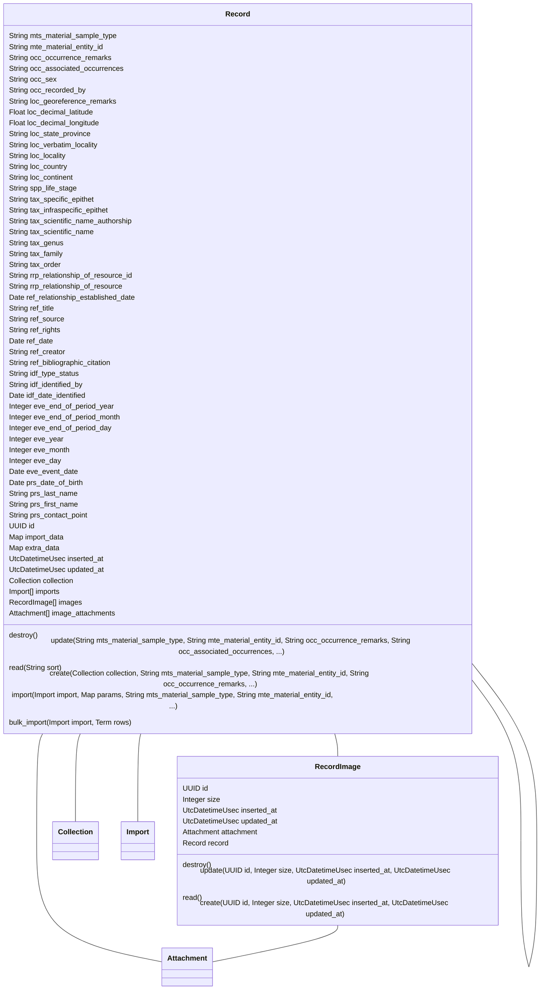

```mermaid
classDiagram
    class Record {
        String mts_material_sample_type
        String mte_material_entity_id
        String occ_occurrence_remarks
        String occ_associated_occurrences
        String occ_sex
        String occ_recorded_by
        String loc_georeference_remarks
        Float loc_decimal_latitude
        Float loc_decimal_longitude
        String loc_state_province
        String loc_verbatim_locality
        String loc_locality
        String loc_country
        String loc_continent
        String spp_life_stage
        String tax_specific_epithet
        String tax_infraspecific_epithet
        String tax_scientific_name_authorship
        String tax_scientific_name
        String tax_genus
        String tax_family
        String tax_order
        String rrp_relationship_of_resource_id
        String rrp_relationship_of_resource
        Date ref_relationship_established_date
        String ref_title
        String ref_source
        String ref_rights
        Date ref_date
        String ref_creator
        String ref_bibliographic_citation
        String idf_type_status
        String idf_identified_by
        Date idf_date_identified
        Integer eve_end_of_period_year
        Integer eve_end_of_period_month
        Integer eve_end_of_period_day
        Integer eve_year
        Integer eve_month
        Integer eve_day
        Date eve_event_date
        Date prs_date_of_birth
        String prs_last_name
        String prs_first_name
        String prs_contact_point
        UUID id
        Map import_data
        Map extra_data
        UtcDatetimeUsec inserted_at
        UtcDatetimeUsec updated_at
        Collection collection
        Import[] imports
        RecordImage[] images
        Attachment[] image_attachments
        destroy()
        update(String mts_material_sample_type, String mte_material_entity_id, String occ_occurrence_remarks, String occ_associated_occurrences, ...)
        read(String sort)
        create(Collection collection, String mts_material_sample_type, String mte_material_entity_id, String occ_occurrence_remarks, ...)
        import(Import import, Map params, String mts_material_sample_type, String mte_material_entity_id, ...)
        bulk_import(Import import, Term rows)
    }
    class RecordImage {
        UUID id
        Integer size
        UtcDatetimeUsec inserted_at
        UtcDatetimeUsec updated_at
        Attachment attachment
        Record record
        destroy()
        update(UUID id, Integer size, UtcDatetimeUsec inserted_at, UtcDatetimeUsec updated_at)
        read()
        create(UUID id, Integer size, UtcDatetimeUsec inserted_at, UtcDatetimeUsec updated_at)
    }

    Record -- RecordImage
    Record -- Attachment
    Record -- Collection
    Record -- Import
    Record -- Record
    RecordImage -- Attachment

```
