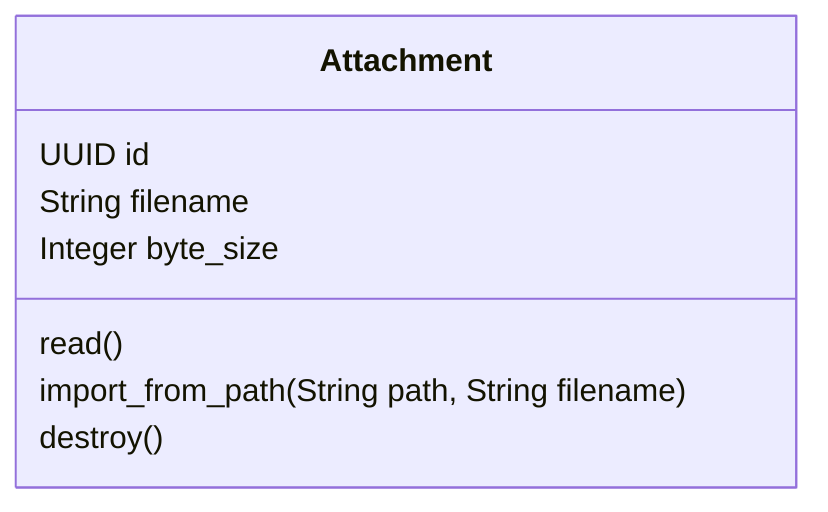

```mermaid
classDiagram
    class Attachment {
        UUID id
        String filename
        Integer byte_size
        read()
        import_from_path(String path, String filename)
        destroy()
    }


```
