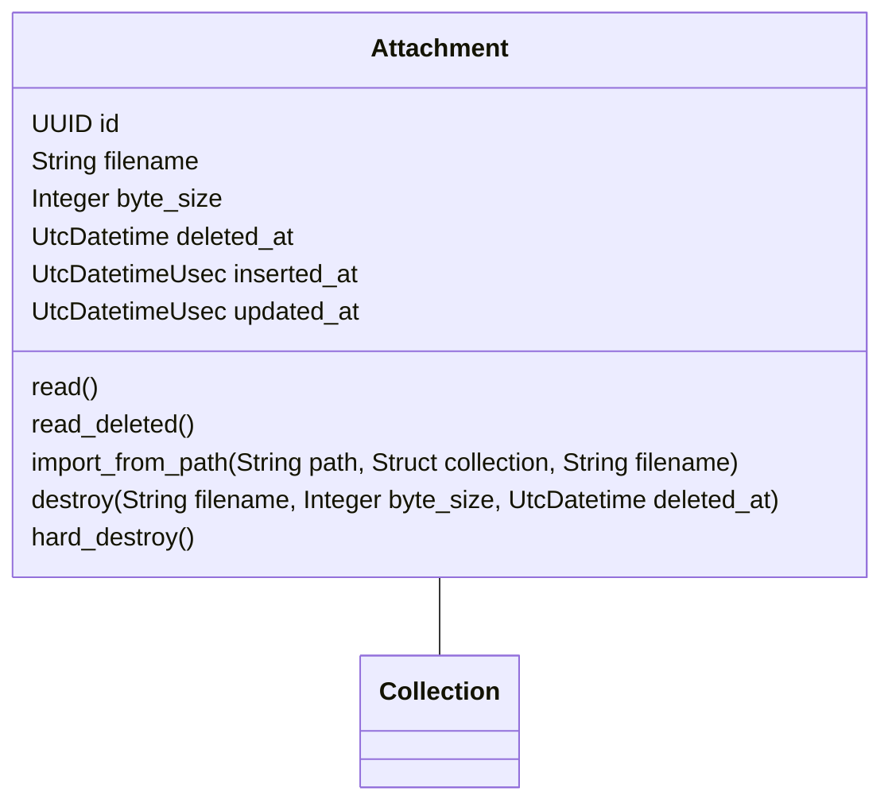

```mermaid
classDiagram
    class Attachment {
        UUID id
        String filename
        Integer byte_size
        UtcDatetime deleted_at
        UtcDatetimeUsec inserted_at
        UtcDatetimeUsec updated_at
        read()
        read_deleted()
        import_from_path(String path, Struct collection, String filename)
        destroy(String filename, Integer byte_size, UtcDatetime deleted_at)
        hard_destroy()
    }

    Attachment -- Collection

```
