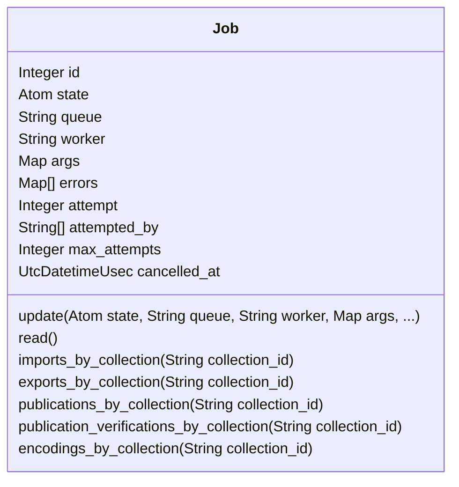

```mermaid
classDiagram
    class Job {
        Integer id
        Atom state
        String queue
        String worker
        Map args
        Map[] errors
        Integer attempt
        String[] attempted_by
        Integer max_attempts
        UtcDatetimeUsec cancelled_at
        update(Atom state, String queue, String worker, Map args, ...)
        read()
        imports_by_collection(String collection_id)
        exports_by_collection(String collection_id)
        publications_by_collection(String collection_id)
        publication_verifications_by_collection(String collection_id)
        encodings_by_collection(String collection_id)
    }


```
