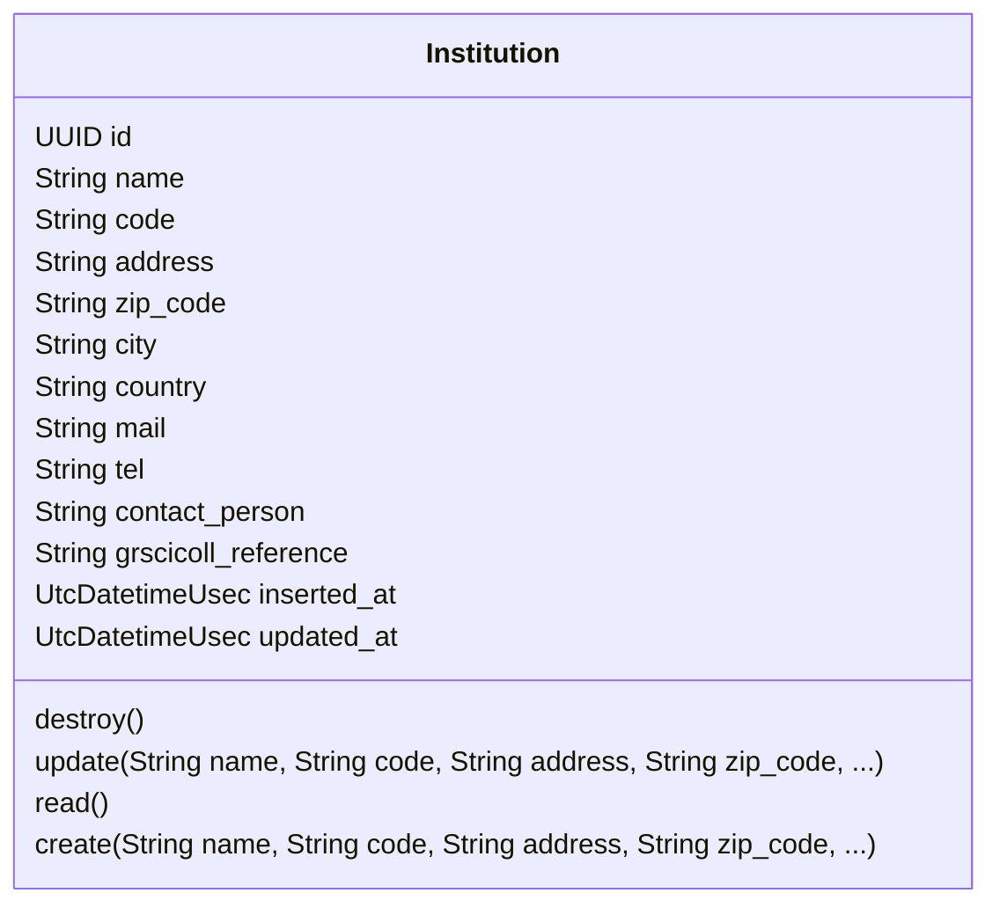

```mermaid
classDiagram
    class Institution {
        UUID id
        String name
        String code
        String address
        String zip_code
        String city
        String country
        String mail
        String tel
        String contact_person
        String grscicoll_reference
        UtcDatetimeUsec inserted_at
        UtcDatetimeUsec updated_at
        destroy()
        update(String name, String code, String address, String zip_code, ...)
        read()
        create(String name, String code, String address, String zip_code, ...)
    }


```
