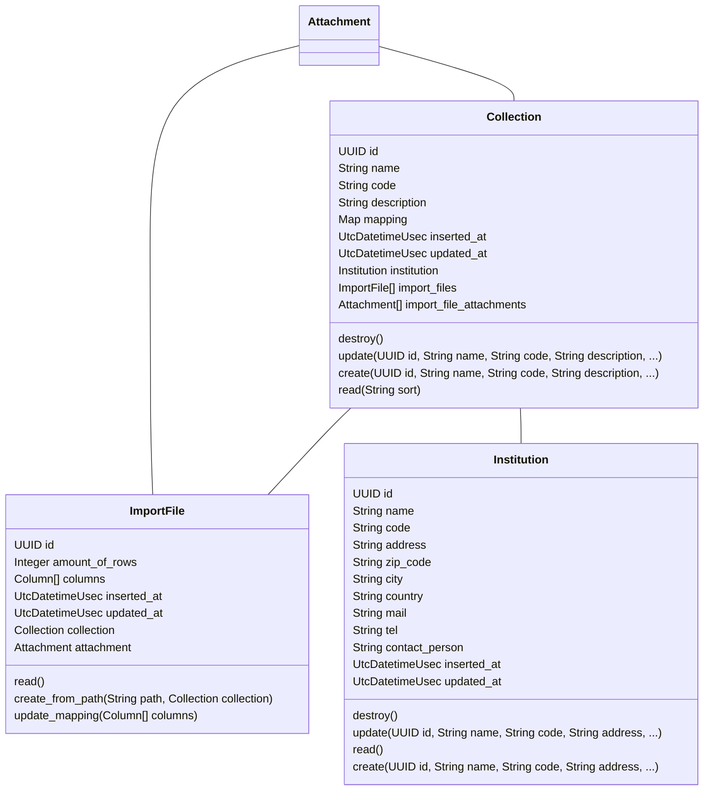

```mermaid
classDiagram
    class Institution {
        UUID id
        String name
        String code
        String address
        String zip_code
        String city
        String country
        String mail
        String tel
        String contact_person
        UtcDatetimeUsec inserted_at
        UtcDatetimeUsec updated_at
        destroy()
        update(UUID id, String name, String code, String address, ...)
        read()
        create(UUID id, String name, String code, String address, ...)
    }
    class Collection {
        UUID id
        String name
        String code
        String description
        Map mapping
        UtcDatetimeUsec inserted_at
        UtcDatetimeUsec updated_at
        Institution institution
        ImportFile[] import_files
        Attachment[] import_file_attachments
        destroy()
        update(UUID id, String name, String code, String description, ...)
        create(UUID id, String name, String code, String description, ...)
        read(String sort)
    }
    class ImportFile {
        UUID id
        Integer amount_of_rows
        Column[] columns
        UtcDatetimeUsec inserted_at
        UtcDatetimeUsec updated_at
        Collection collection
        Attachment attachment
        read()
        create_from_path(String path, Collection collection)
        update_mapping(Column[] columns)
    }

    Attachment -- Collection
    Attachment -- ImportFile
    Collection -- ImportFile
    Collection -- Institution

```
