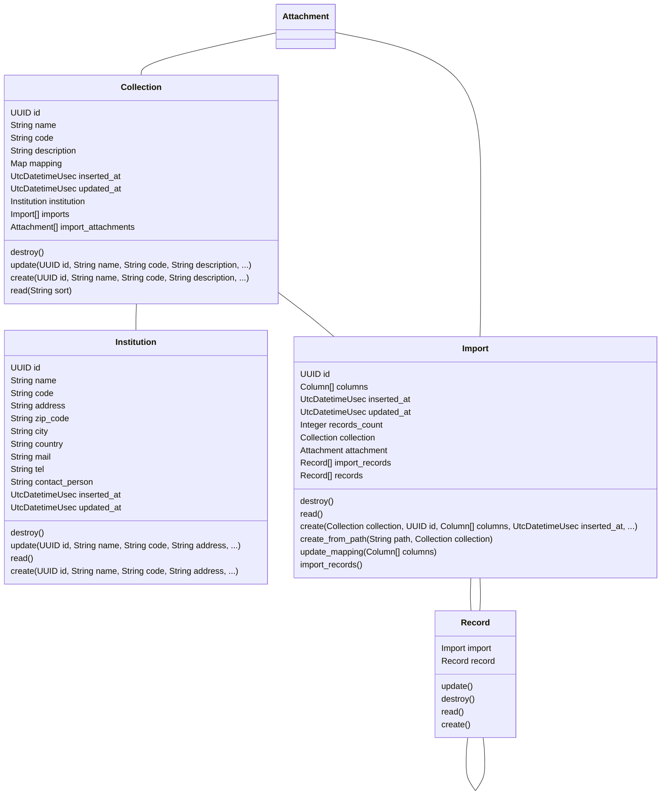

```mermaid
classDiagram
    class Institution {
        UUID id
        String name
        String code
        String address
        String zip_code
        String city
        String country
        String mail
        String tel
        String contact_person
        UtcDatetimeUsec inserted_at
        UtcDatetimeUsec updated_at
        destroy()
        update(UUID id, String name, String code, String address, ...)
        read()
        create(UUID id, String name, String code, String address, ...)
    }
    class Collection {
        UUID id
        String name
        String code
        String description
        Map mapping
        UtcDatetimeUsec inserted_at
        UtcDatetimeUsec updated_at
        Institution institution
        Import[] imports
        Attachment[] import_attachments
        destroy()
        update(UUID id, String name, String code, String description, ...)
        create(UUID id, String name, String code, String description, ...)
        read(String sort)
    }
    class Import {
        UUID id
        Column[] columns
        UtcDatetimeUsec inserted_at
        UtcDatetimeUsec updated_at
        Integer records_count
        Collection collection
        Attachment attachment
        Record[] import_records
        Record[] records
        destroy()
        read()
        create(Collection collection, UUID id, Column[] columns, UtcDatetimeUsec inserted_at, ...)
        create_from_path(String path, Collection collection)
        update_mapping(Column[] columns)
        import_records()
    }
    class Record {
        Import import
        Record record
        update()
        destroy()
        read()
        create()
    }

    Record -- Import
    Record -- Record
    Attachment -- Collection
    Attachment -- Import
    Collection -- Import
    Collection -- Institution
    Import -- Record

```
