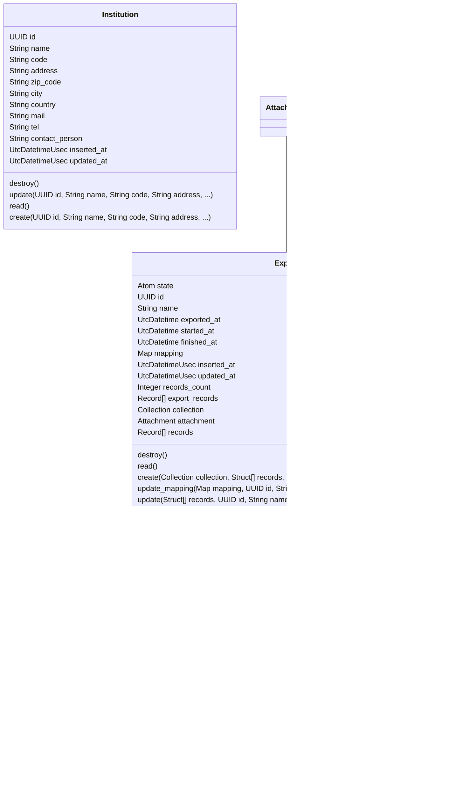

```mermaid
classDiagram
    class Institution {
        UUID id
        String name
        String code
        String address
        String zip_code
        String city
        String country
        String mail
        String tel
        String contact_person
        UtcDatetimeUsec inserted_at
        UtcDatetimeUsec updated_at
        destroy()
        update(UUID id, String name, String code, String address, ...)
        read()
        create(UUID id, String name, String code, String address, ...)
    }
    class Export {
        Atom state
        UUID id
        String name
        UtcDatetime exported_at
        UtcDatetime started_at
        UtcDatetime finished_at
        Map mapping
        UtcDatetimeUsec inserted_at
        UtcDatetimeUsec updated_at
        Integer records_count
        Record[] export_records
        Collection collection
        Attachment attachment
        Record[] records
        destroy()
        read()
        create(Collection collection, Struct[] records, UUID id, String name, ...)
        update_mapping(Map mapping, UUID id, String name, UtcDatetime exported_at, ...)
        update(Struct[] records, UUID id, String name, UtcDatetime exported_at, ...)
        enqueue()
        set_running()
        set_failed(UUID id, String name, UtcDatetime exported_at, UtcDatetime started_at, ...)
        run()
        set_exported()
        update_attachment(Attachment attachment)
        publish(Struct export)
    }
    class Record {
        Export export
        Record record
        update()
        destroy()
        read()
        create(Export export, Record record)
    }

    Attachment -- Export
    Export -- Record
    Export -- Collection
    Export -- Record
    Record -- Record

```
