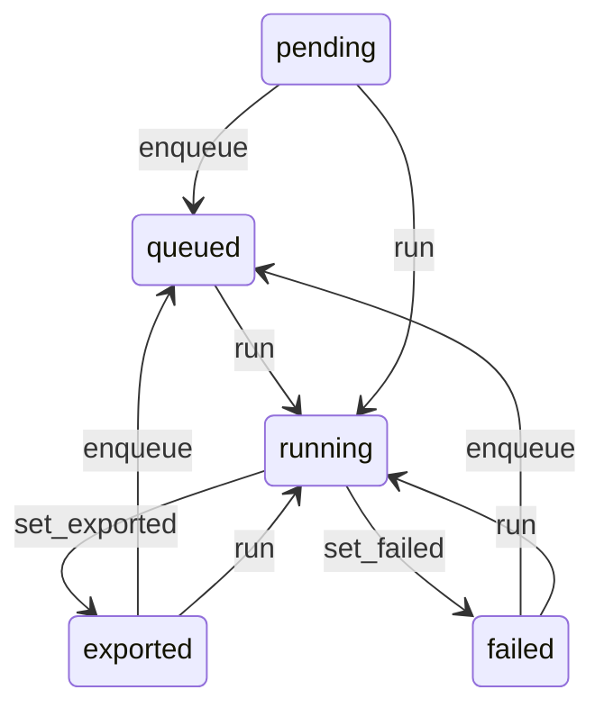

```mermaid
stateDiagram-v2
pending --> queued: enqueue
queued --> running: run
running --> exported: set_exported
exported --> queued: enqueue
exported --> running: run
running --> failed: set_failed
failed --> queued: enqueue
failed --> running: run
pending --> running: run
```
