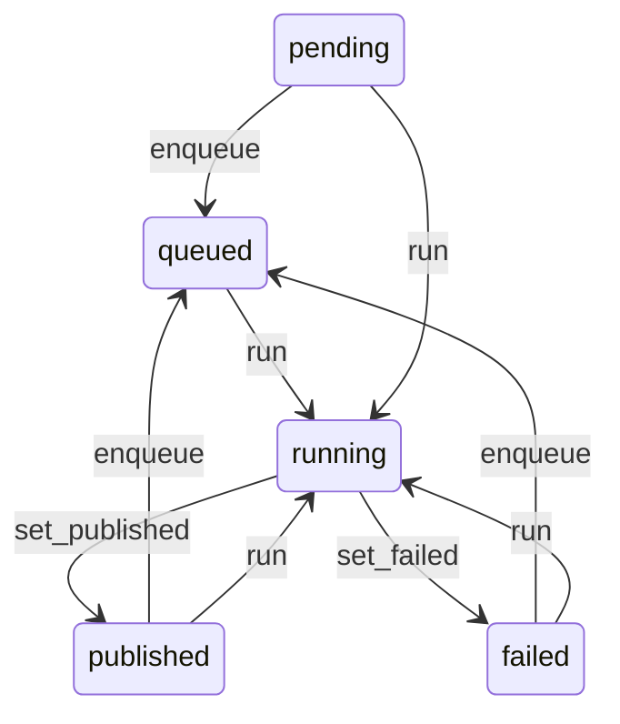

```mermaid
stateDiagram-v2
pending --> queued: enqueue
queued --> running: run
running --> published: set_published
published --> queued: enqueue
published --> running: run
running --> failed: set_failed
failed --> queued: enqueue
failed --> running: run
pending --> running: run
```
