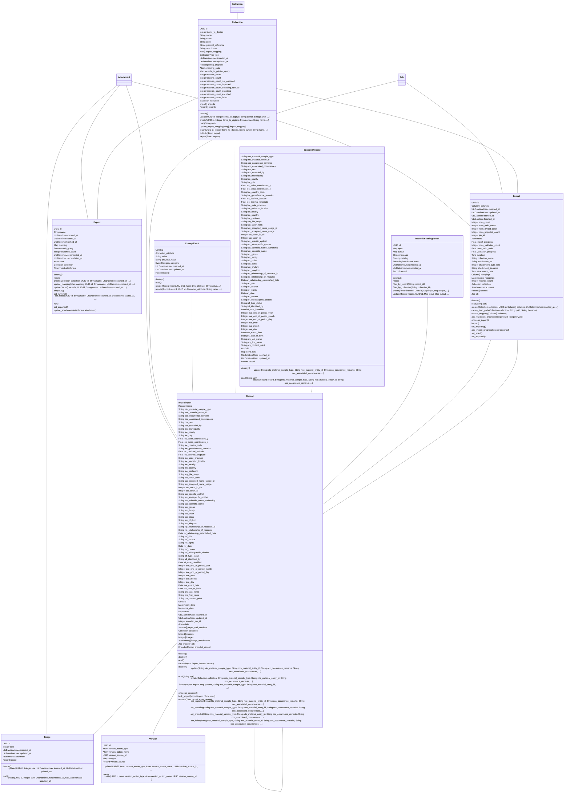

```mermaid
classDiagram
    class ChangeEvent {
        UUID id
        Atom dwc_attribute
        String value
        String previous_value
        EventCategory category
        UtcDatetimeUsec inserted_at
        UtcDatetimeUsec updated_at
        Record record
        destroy()
        read()
        create(Record record, UUID id, Atom dwc_attribute, String value, ...)
        update(Record record, UUID id, Atom dwc_attribute, String value, ...)
    }
    class Collection {
        UUID id
        Integer items_to_digitize
        String owner
        String name
        String code
        String grscicoll_reference
        String description
        Map[] import_mapping
        CollectionType type
        UtcDatetimeUsec inserted_at
        UtcDatetimeUsec updated_at
        Float digitizing_progress
        Atom encoding_state
        Map records_to_publish_query
        Integer records_count
        Integer imports_count
        Integer records_count_not_encoded
        Integer records_count_imported
        Integer records_count_encoding_queued
        Integer records_count_encoding
        Integer records_count_encoded
        Integer records_count_failed
        Institution institution
        Import[] imports
        Record[] records
        destroy()
        update(UUID id, Integer items_to_digitize, String owner, String name, ...)
        create(UUID id, Integer items_to_digitize, String owner, String name, ...)
        read(String sort)
        update_import_mapping(Map[] import_mapping)
        touch(UUID id, Integer items_to_digitize, String owner, String name, ...)
        publish(Struct export)
        export(Struct export)
    }
    class Export {
        UUID id
        String name
        UtcDatetime exported_at
        UtcDatetime started_at
        UtcDatetime finished_at
        Map mapping
        Term records_query
        Integer exported_count
        UtcDatetimeUsec inserted_at
        UtcDatetimeUsec updated_at
        Atom state
        Collection collection
        Attachment attachment
        destroy()
        read()
        create(Collection collection, UUID id, String name, UtcDatetime exported_at, ...)
        update_mapping(Map mapping, UUID id, String name, UtcDatetime exported_at, ...)
        update(Struct[] records, UUID id, String name, UtcDatetime exported_at, ...)
        enqueue()
        set_running()
        set_failed(UUID id, String name, UtcDatetime exported_at, UtcDatetime started_at, ...)
        run()
        set_exported()
        update_attachment(Attachment attachment)
    }
    class RecordEncodingResult {
        UUID id
        Map input
        Map output
        String message
        Catalog catalog
        EncodingResultState state
        UtcDatetimeUsec inserted_at
        UtcDatetimeUsec updated_at
        Record record
        destroy()
        read()
        filter_by_record(String record_id)
        filter_by_collection(String collection_id)
        create(Record record, UUID id, Map input, Map output, ...)
        update(Record record, UUID id, Map input, Map output, ...)
    }
    class Import {
        UUID id
        Column[] columns
        UtcDatetimeUsec inserted_at
        UtcDatetimeUsec updated_at
        UtcDatetime started_at
        UtcDatetime finished_at
        Integer rows_count
        Integer rows_valid_count
        Integer rows_invalid_count
        Integer rows_imported_count
        Integer job_id
        Atom state
        Float import_progress
        Integer rows_validated_count
        Float rows_valid_ratio
        Float validation_progress
        Time duration
        String collection_name
        String attachment_url
        Integer attachment_byte_size
        String attachment_filename
        Term attachment_data
        Column[] mappings
        Map missing_mappings
        Integer records_count
        Collection collection
        Attachment attachment
        Record[] records
        Job job
        destroy()
        read(String sort)
        create(Collection collection, UUID id, Column[] columns, UtcDatetimeUsec inserted_at, ...)
        create_from_path(Collection collection, String path, String filename)
        update_mapping(Column[] columns)
        add_validation_progress(Integer valid, Integer invalid)
        enqueue_import()
        import()
        set_importing()
        add_import_progress(Integer imported)
        set_failed()
        set_imported()
    }
    class Record {
        Import import
        Record record
        update()
        destroy()
        read()
        create(Import import, Record record)
    }
    class Record {
        String mts_material_sample_type
        String mte_material_entity_id
        String occ_occurrence_remarks
        String occ_associated_occurrences
        String occ_sex
        String occ_recorded_by
        String loc_municipality
        String loc_county
        String loc_city
        Float loc_swiss_coordinates_y
        Float loc_swiss_coordinates_x
        String loc_country_code
        String loc_georeference_remarks
        Float loc_decimal_latitude
        Float loc_decimal_longitude
        String loc_state_province
        String loc_verbatim_locality
        String loc_locality
        String loc_country
        String loc_continent
        String spp_life_stage
        String tax_taxon_rank
        String tax_accepted_name_usage_id
        String tax_accepted_name_usage
        Integer tax_taxon_id_ch
        Integer tax_taxon_id
        String tax_specific_epithet
        String tax_infraspecific_epithet
        String tax_scientific_name_authorship
        String tax_scientific_name
        String tax_genus
        String tax_family
        String tax_order
        String tax_class
        String tax_phylum
        String tax_kingdom
        String rrp_relationship_of_resource_id
        String rrp_relationship_of_resource
        Date ref_relationship_established_date
        String ref_title
        String ref_source
        String ref_rights
        Date ref_date
        String ref_creator
        String ref_bibliographic_citation
        String idf_type_status
        String idf_identified_by
        Date idf_date_identified
        Integer eve_end_of_period_year
        Integer eve_end_of_period_month
        Integer eve_end_of_period_day
        Integer eve_year
        Integer eve_month
        Integer eve_day
        Date eve_event_date
        Date prs_date_of_birth
        String prs_last_name
        String prs_first_name
        String prs_contact_point
        UUID id
        Map import_data
        Map extra_data
        Map errors
        UtcDatetimeUsec inserted_at
        UtcDatetimeUsec updated_at
        Integer encoder_job_id
        Atom state
        Version[] paper_trail_versions
        Collection collection
        Import[] imports
        Image[] images
        Attachment[] image_attachments
        Job encoder_job
        EncodedRecord encoded_record
        destroy()
        update(String mts_material_sample_type, String mte_material_entity_id, String occ_occurrence_remarks, String occ_associated_occurrences, ...)
        read(String sort)
        create(Collection collection, String mts_material_sample_type, String mte_material_entity_id, String occ_occurrence_remarks, ...)
        import(Import import, Map params, String mts_material_sample_type, String mte_material_entity_id, ...)
        enqueue_encoder()
        bulk_import(Import import, Term rows)
        encode(Term record, Atom catalog)
        set_imported(String mts_material_sample_type, String mte_material_entity_id, String occ_occurrence_remarks, String occ_associated_occurrences, ...)
        set_encoding(String mts_material_sample_type, String mte_material_entity_id, String occ_occurrence_remarks, String occ_associated_occurrences, ...)
        set_encoded(String mts_material_sample_type, String mte_material_entity_id, String occ_occurrence_remarks, String occ_associated_occurrences, ...)
        set_failed(String mts_material_sample_type, String mte_material_entity_id, String occ_occurrence_remarks, String occ_associated_occurrences, ...)
    }
    class Image {
        UUID id
        Integer size
        UtcDatetimeUsec inserted_at
        UtcDatetimeUsec updated_at
        Attachment attachment
        Record record
        destroy()
        update(UUID id, Integer size, UtcDatetimeUsec inserted_at, UtcDatetimeUsec updated_at)
        read()
        create(UUID id, Integer size, UtcDatetimeUsec inserted_at, UtcDatetimeUsec updated_at)
    }
    class Version {
        UUID id
        Atom version_action_type
        Atom version_action_name
        UUID version_source_id
        Map changes
        Record version_source
        update(UUID id, Atom version_action_type, Atom version_action_name, UUID version_source_id, ...)
        read()
        create(UUID id, Atom version_action_type, Atom version_action_name, UUID version_source_id, ...)
    }
    class EncodedRecord {
        String mts_material_sample_type
        String mte_material_entity_id
        String occ_occurrence_remarks
        String occ_associated_occurrences
        String occ_sex
        String occ_recorded_by
        String loc_municipality
        String loc_county
        String loc_city
        Float loc_swiss_coordinates_y
        Float loc_swiss_coordinates_x
        String loc_country_code
        String loc_georeference_remarks
        Float loc_decimal_latitude
        Float loc_decimal_longitude
        String loc_state_province
        String loc_verbatim_locality
        String loc_locality
        String loc_country
        String loc_continent
        String spp_life_stage
        String tax_taxon_rank
        String tax_accepted_name_usage_id
        String tax_accepted_name_usage
        Integer tax_taxon_id_ch
        Integer tax_taxon_id
        String tax_specific_epithet
        String tax_infraspecific_epithet
        String tax_scientific_name_authorship
        String tax_scientific_name
        String tax_genus
        String tax_family
        String tax_order
        String tax_class
        String tax_phylum
        String tax_kingdom
        String rrp_relationship_of_resource_id
        String rrp_relationship_of_resource
        Date ref_relationship_established_date
        String ref_title
        String ref_source
        String ref_rights
        Date ref_date
        String ref_creator
        String ref_bibliographic_citation
        String idf_type_status
        String idf_identified_by
        Date idf_date_identified
        Integer eve_end_of_period_year
        Integer eve_end_of_period_month
        Integer eve_end_of_period_day
        Integer eve_year
        Integer eve_month
        Integer eve_day
        Date eve_event_date
        Date prs_date_of_birth
        String prs_last_name
        String prs_first_name
        String prs_contact_point
        UUID id
        Map extra_data
        UtcDatetimeUsec inserted_at
        UtcDatetimeUsec updated_at
        Record record
        destroy()
        update(String mts_material_sample_type, String mte_material_entity_id, String occ_occurrence_remarks, String occ_associated_occurrences, ...)
        read(String sort)
        create(Record record, String mts_material_sample_type, String mte_material_entity_id, String occ_occurrence_remarks, ...)
    }

    Attachment -- Export
    Attachment -- Import
    Attachment -- Record
    Attachment -- Image
    Job -- Import
    Job -- Record
    Institution -- Collection
    ChangeEvent -- Record
    Collection -- Export
    Collection -- Import
    Collection -- Record
    EncodedRecord -- Record
    RecordEncodingResult -- Record
    Import -- Record
    Import -- Record
    Record -- Record
    Record -- Image
    Record -- Version

```
