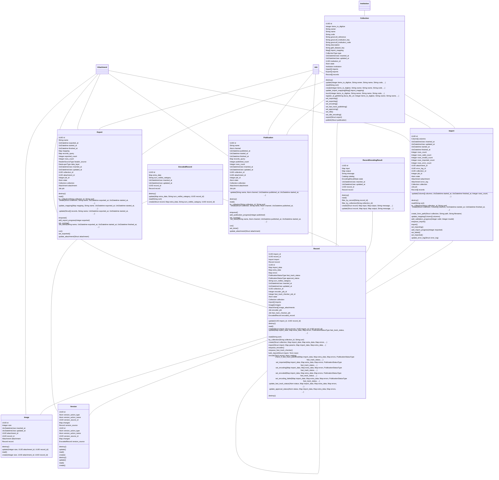

```mermaid
classDiagram
    class Collection {
        UUID id
        Integer items_to_digitize
        String owner
        String name
        String code
        String grscicoll_reference
        String grscicoll_institution_key
        String grscicoll_institution_code
        String description
        String gbif_dataset_key
        Map[] import_mapping
        CollectionType type
        UtcDatetimeUsec inserted_at
        UtcDatetimeUsec updated_at
        UUID institution_id
        Atom state
        Institution institution
        Import[] imports
        Export[] exports
        Record[] records
        destroy()
        update(Integer items_to_digitize, String owner, String name, String code, ...)
        read(String sort)
        create(Integer items_to_digitize, String owner, String name, String code, ...)
        update_import_mapping(Map[] import_mapping)
        touch(Integer items_to_digitize, String owner, String name, String code, ...)
        register_at_gbif(String dwca_file_url, Integer items_to_digitize, String owner, String name, ...)
        set_importing()
        set_exporting()
        set_encoding()
        set_fast_track_publishing()
        set_approving()
        set_idle()
        set_idle_encoding()
        export(Struct export)
        publish(Struct publication)
    }
    class EncodedRecord {
        UUID id
        Map extra_data
        String iucn_redlist_category
        UtcDatetimeUsec inserted_at
        UtcDatetimeUsec updated_at
        UUID record_id
        Record record
        destroy()
        update(Map extra_data, String iucn_redlist_category, UUID record_id)
        read(String sort)
        create(Struct record, Map extra_data, String iucn_redlist_category, UUID record_id)
    }
    class RecordEncodingResult {
        UUID id
        Map input
        Map output
        String message
        Catalog catalog
        EncodingResultState state
        UtcDatetimeUsec inserted_at
        UtcDatetimeUsec updated_at
        UUID record_id
        Record record
        destroy()
        read()
        filter_by_record(String record_id)
        filter_by_collection(String collection_id)
        create(Struct record, Map input, Map output, String message, ...)
        update(Struct record, Map input, Map output, String message, ...)
    }
    class Export {
        UUID id
        String name
        UtcDatetime exported_at
        UtcDatetime started_at
        UtcDatetime finished_at
        Map mapping
        Map records_query
        Integer exported_count
        Integer rows_count
        HeaderSourceType header_source
        DataLayerType data_layer
        UtcDatetimeUsec inserted_at
        UtcDatetimeUsec updated_at
        UUID collection_id
        UUID attachment_id
        Integer job_id
        Atom state
        Collection collection
        Attachment attachment
        Job job
        destroy()
        read()
        by_collection(String collection_id, String sort)
        create(Struct collection, String name, UtcDatetime exported_at, UtcDatetime started_at, ...)
        update_mapping(Map mapping, String name, UtcDatetime exported_at, UtcDatetime started_at, ...)
        update(Struct[] records, String name, UtcDatetime exported_at, UtcDatetime started_at, ...)
        enqueue()
        add_export_progress(Integer exported)
        set_running()
        set_failed(String name, UtcDatetime exported_at, UtcDatetime started_at, UtcDatetime finished_at, ...)
        run()
        set_exported()
        update_attachment(Struct attachment)
    }
    class Import {
        UUID id
        Column[] columns
        UtcDatetimeUsec inserted_at
        UtcDatetimeUsec updated_at
        UtcDatetime started_at
        UtcDatetime finished_at
        Integer rows_count
        Integer rows_valid_count
        Integer rows_invalid_count
        Integer rows_imported_count
        Integer rows_error_count
        UUID attachment_id
        UUID error_log_id
        UUID collection_id
        Integer job_id
        Atom state
        Attachment attachment
        Attachment error_log
        Collection collection
        Job job
        Record[] records
        update(Column[] columns, UtcDatetime started_at, UtcDatetime finished_at, Integer rows_count, ...)
        destroy()
        read(String sort)
        by_collection(String collection_id, String sort)
        create(Struct collection, Column[] columns, UtcDatetime started_at, UtcDatetime finished_at, ...)
        create_from_path(Struct collection, String path, String filename)
        update_mapping(Column[] columns)
        add_validation_progress(Integer valid, Integer invalid)
        enqueue_import()
        import()
        set_importing()
        add_import_progress(Integer imported)
        set_failed()
        set_imported()
        update_error_log(Struct error_log)
    }
    class Record {
        UUID import_id
        UUID record_id
        Import import
        Record record
        update(UUID import_id, UUID record_id)
        destroy()
        read()
        create(Struct import, Struct record, UUID import_id, UUID record_id)
    }
    class Publication {
        UUID id
        String name
        Atom channel
        UtcDatetime published_at
        UtcDatetime started_at
        UtcDatetime finished_at
        Map records_query
        Integer published_count
        Integer rows_count
        UtcDatetimeUsec inserted_at
        UtcDatetimeUsec updated_at
        UUID collection_id
        UUID attachment_id
        Integer job_id
        Atom state
        Collection collection
        Attachment attachment
        Job job
        update(String name, Atom channel, UtcDatetime published_at, UtcDatetime started_at, ...)
        destroy()
        read()
        by_collection(String collection_id, String sort)
        create(Struct collection, String name, Atom channel, UtcDatetime published_at, ...)
        enqueue()
        add_publication_progress(Integer published)
        set_running()
        set_failed(String name, Atom channel, UtcDatetime published_at, UtcDatetime started_at, ...)
        run()
        set_done()
        update_attachment(Struct attachment)
    }
    class Record {
        UUID id
        Map import_data
        Map extra_data
        Map errors
        PublicationStatusType fast_track_status
        PublicationStatusType approval_status
        String iucn_redlist_category
        UtcDatetimeUsec inserted_at
        UtcDatetimeUsec updated_at
        UUID collection_id
        Integer encoder_job_id
        Integer fast_track_checker_job_id
        Atom state
        Collection collection
        Import[] imports
        Image[] images
        Attachment[] image_attachments
        Job encoder_job
        Job fast_track_checker_job
        EncodedRecord encoded_record
        update(Map import_data, Map extra_data, Map errors, PublicationStatusType fast_track_status, ...)
        read(String sort)
        by_collection(String collection_id, String sort)
        create(Struct collection, Map import_data, Map extra_data, Map errors, ...)
        import(Struct import, Map params, Map import_data, Map extra_data, ...)
        enqueue_encoder()
        enqueue_fast_track_checker()
        bulk_import(Struct import, Term rows)
        encode(Term record, Atom catalog)
        check_if_fast_track_pubished(Map import_data, Map extra_data, Map errors, PublicationStatusType fast_track_status, ...)
        set_imported(Map import_data, Map extra_data, Map errors, PublicationStatusType fast_track_status, ...)
        set_encoding(Map import_data, Map extra_data, Map errors, PublicationStatusType fast_track_status, ...)
        set_encoded(Map import_data, Map extra_data, Map errors, PublicationStatusType fast_track_status, ...)
        set_encoding_failed(Map import_data, Map extra_data, Map errors, PublicationStatusType fast_track_status, ...)
        update_fast_track_status(Atom status, Map import_data, Map extra_data, Map errors, ...)
        update_approval_status(Atom status, Map import_data, Map extra_data, Map errors, ...)
        destroy()
    }
    class Image {
        UUID id
        Integer size
        UtcDatetimeUsec inserted_at
        UtcDatetimeUsec updated_at
        UUID attachment_id
        UUID record_id
        Attachment attachment
        Record record
        destroy()
        update(Integer size, UUID attachment_id, UUID record_id)
        read()
        create(Integer size, UUID attachment_id, UUID record_id)
    }
    class Version {
        UUID id
        Atom version_action_type
        Atom version_action_name
        UUID version_source_id
        Map changes
        Record version_source
        destroy()
        update()
        read()
        create()
    }
    class Version {
        UUID id
        Atom version_action_type
        Atom version_action_name
        UUID version_source_id
        Map changes
        EncodedRecord version_source
        destroy()
        update()
        read()
        create()
    }

    Attachment -- Export
    Attachment -- Import
    Attachment -- Publication
    Attachment -- Record
    Attachment -- Image
    Job -- Export
    Job -- Import
    Job -- Publication
    Job -- Record
    Institution -- Collection
    Collection -- Export
    Collection -- Import
    Collection -- Publication
    Collection -- Record
    EncodedRecord -- Version
    EncodedRecord -- Record
    RecordEncodingResult -- Record
    Import -- Record
    Import -- Record
    Record -- Record
    Record -- Image
    Record -- Version

```
