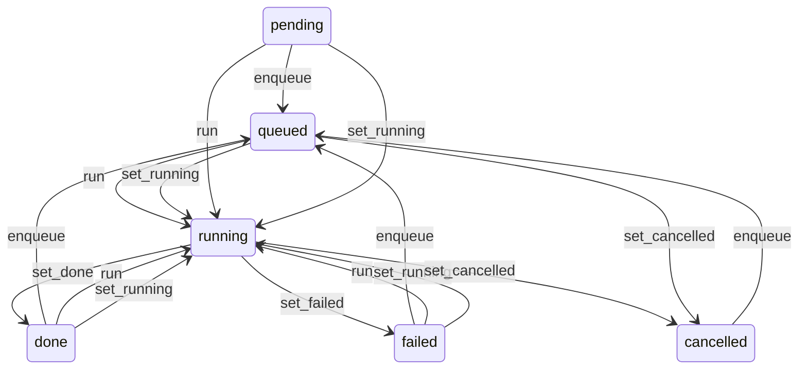

```mermaid
stateDiagram-v2
pending --> queued: enqueue
queued --> running: run
running --> done: set_done
done --> queued: enqueue
done --> running: run
done --> running: set_running
running --> failed: set_failed
failed --> queued: enqueue
failed --> running: run
failed --> running: set_running
running --> cancelled: set_cancelled
cancelled --> queued: enqueue
queued --> running: set_running
queued --> cancelled: set_cancelled
pending --> running: run
pending --> running: set_running
```
