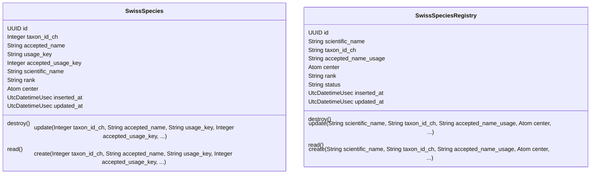

```mermaid
classDiagram
    class SwissSpecies {
        UUID id
        Integer taxon_id_ch
        String accepted_name
        String usage_key
        Integer accepted_usage_key
        String scientific_name
        String rank
        Atom center
        UtcDatetimeUsec inserted_at
        UtcDatetimeUsec updated_at
        destroy()
        update(Integer taxon_id_ch, String accepted_name, String usage_key, Integer accepted_usage_key, ...)
        read()
        create(Integer taxon_id_ch, String accepted_name, String usage_key, Integer accepted_usage_key, ...)
    }
    class SwissSpeciesRegistry {
        UUID id
        String scientific_name
        String taxon_id_ch
        String accepted_name_usage
        Atom center
        String rank
        String status
        UtcDatetimeUsec inserted_at
        UtcDatetimeUsec updated_at
        destroy()
        update(String scientific_name, String taxon_id_ch, String accepted_name_usage, Atom center, ...)
        read()
        create(String scientific_name, String taxon_id_ch, String accepted_name_usage, Atom center, ...)
    }


```
