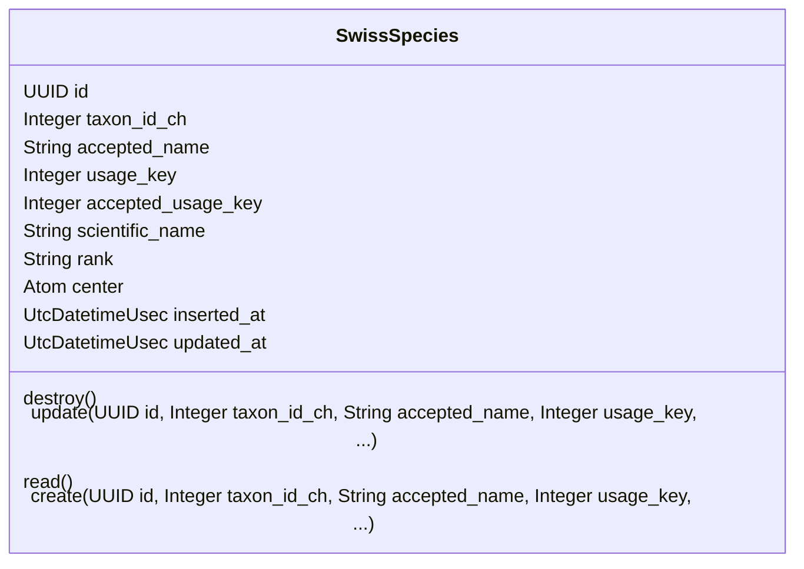

```mermaid
classDiagram
    class SwissSpecies {
        UUID id
        Integer taxon_id_ch
        String accepted_name
        Integer usage_key
        Integer accepted_usage_key
        String scientific_name
        String rank
        Atom center
        UtcDatetimeUsec inserted_at
        UtcDatetimeUsec updated_at
        destroy()
        update(UUID id, Integer taxon_id_ch, String accepted_name, Integer usage_key, ...)
        read()
        create(UUID id, Integer taxon_id_ch, String accepted_name, Integer usage_key, ...)
    }


```
