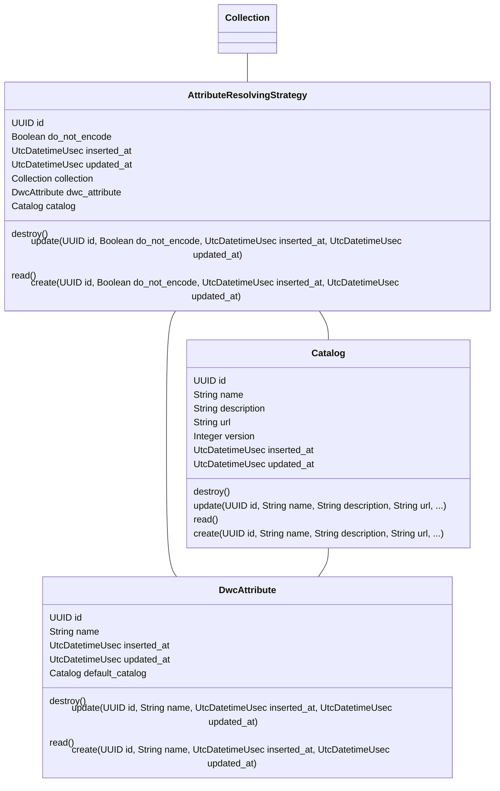

```mermaid
classDiagram
    class DwcAttribute {
        UUID id
        String name
        UtcDatetimeUsec inserted_at
        UtcDatetimeUsec updated_at
        Catalog default_catalog
        destroy()
        update(UUID id, String name, UtcDatetimeUsec inserted_at, UtcDatetimeUsec updated_at)
        read()
        create(UUID id, String name, UtcDatetimeUsec inserted_at, UtcDatetimeUsec updated_at)
    }
    class Catalog {
        UUID id
        String name
        String description
        String url
        Integer version
        UtcDatetimeUsec inserted_at
        UtcDatetimeUsec updated_at
        destroy()
        update(UUID id, String name, String description, String url, ...)
        read()
        create(UUID id, String name, String description, String url, ...)
    }
    class AttributeResolvingStrategy {
        UUID id
        Boolean do_not_encode
        UtcDatetimeUsec inserted_at
        UtcDatetimeUsec updated_at
        Collection collection
        DwcAttribute dwc_attribute
        Catalog catalog
        destroy()
        update(UUID id, Boolean do_not_encode, UtcDatetimeUsec inserted_at, UtcDatetimeUsec updated_at)
        read()
        create(UUID id, Boolean do_not_encode, UtcDatetimeUsec inserted_at, UtcDatetimeUsec updated_at)
    }

    Collection -- AttributeResolvingStrategy
    AttributeResolvingStrategy -- Catalog
    AttributeResolvingStrategy -- DwcAttribute
    Catalog -- DwcAttribute

```
