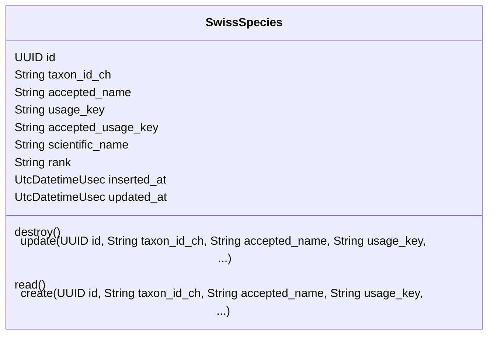

```mermaid
classDiagram
    class SwissSpecies {
        UUID id
        String taxon_id_ch
        String accepted_name
        String usage_key
        String accepted_usage_key
        String scientific_name
        String rank
        UtcDatetimeUsec inserted_at
        UtcDatetimeUsec updated_at
        destroy()
        update(UUID id, String taxon_id_ch, String accepted_name, String usage_key, ...)
        read()
        create(UUID id, String taxon_id_ch, String accepted_name, String usage_key, ...)
    }


```
